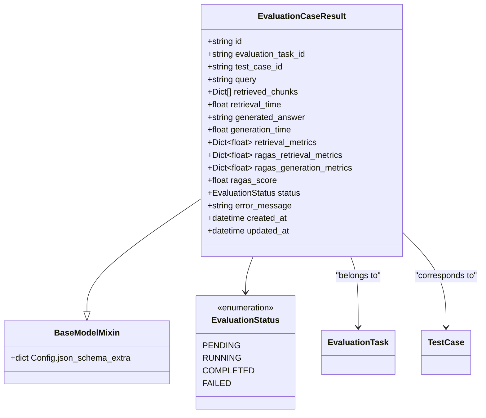
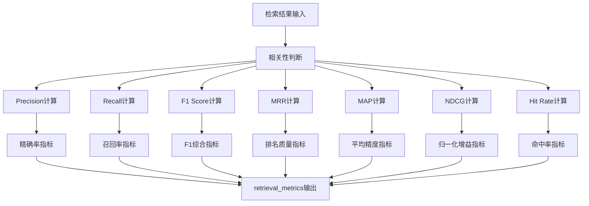
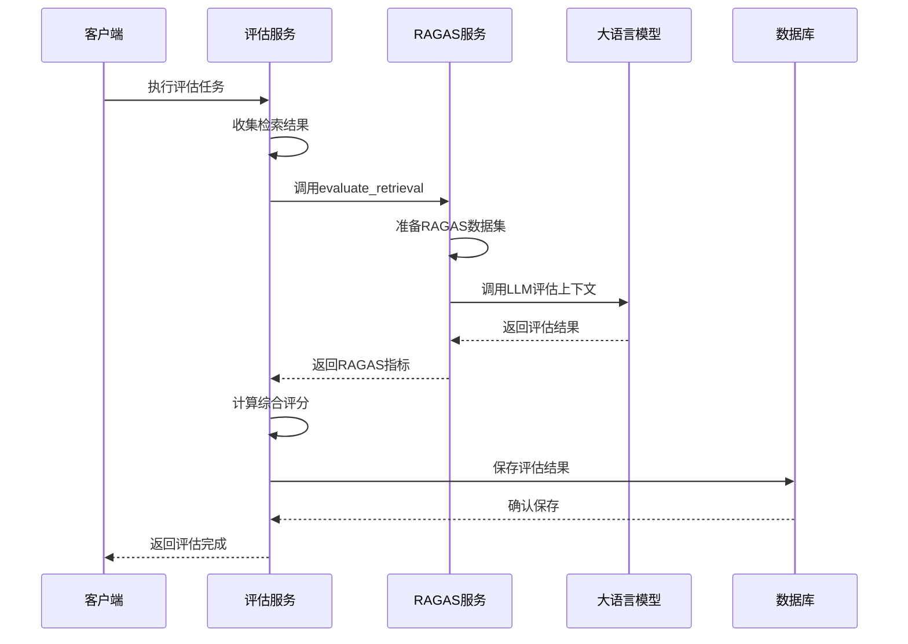
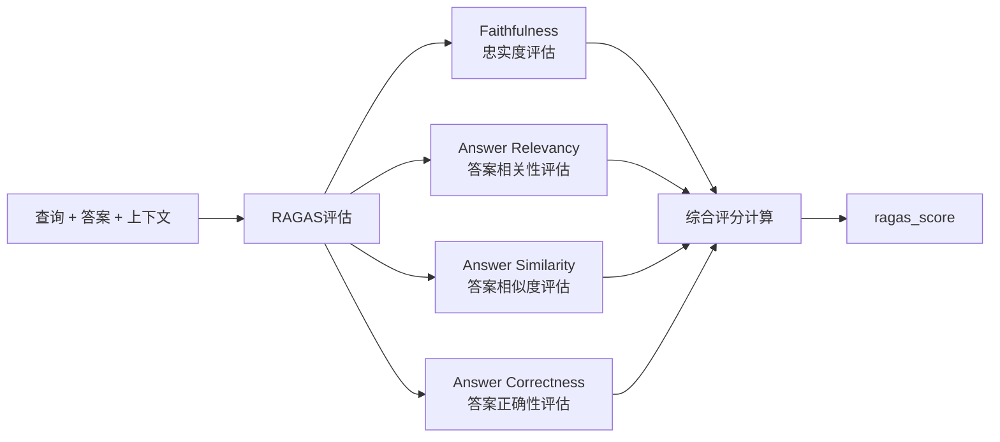
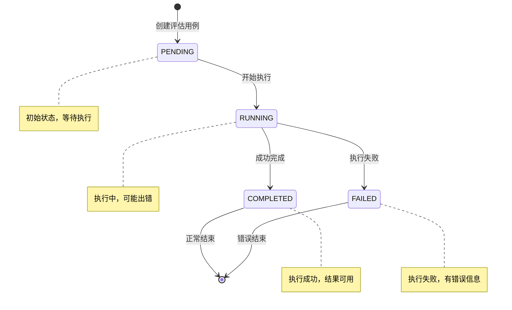
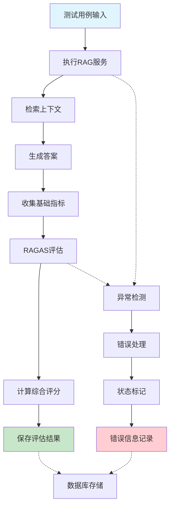

# 评估用例结果模型

<cite>
**本文档引用的文件**
- [backend/app/models/evaluation.py](file://backend/app/models/evaluation.py)
- [backend/app/database/models.py](file://backend/app/database/models.py)
- [backend/app/services/evaluation_task.py](file://backend/app/services/evaluation_task.py)
- [backend/app/services/ragas_evaluation.py](file://backend/app/services/ragas_evaluation.py)
- [backend/app/services/retriever_evaluation.py](file://backend/app/services/retriever_evaluation.py)
- [backend/app/controllers/evaluation.py](file://backend/app/controllers/evaluation.py)
- [web/components/views/evaluation-history.tsx](file://web/components/views/evaluation-history.tsx)
</cite>

## 目录
1. [简介](#简介)
2. [模型结构概览](#模型结构概览)
3. [核心字段详解](#核心字段详解)
4. [检索评估指标体系](#检索评估指标体系)
5. [RAGAS框架集成](#ragas框架集成)
6. [异常处理与诊断机制](#异常处理与诊断机制)
7. [数据流与处理链路](#数据流与处理链路)
8. [前端展示与交互](#前端展示与交互)
9. [性能优化与最佳实践](#性能优化与最佳实践)
10. [故障排除指南](#故障排除指南)

## 简介

评估用例结果（EvaluationCaseResult）模型是RAG Studio系统中单个测试用例评估记录的核心数据结构，它完整记录了从查询输入到最终评估结果输出的全过程数据。该模型不仅包含了传统的信息检索指标，还深度集成了RAGAS框架的先进评估指标，为RAG系统的全面质量评估提供了标准化的数据载体。

该模型的设计体现了现代RAG评估的两个重要维度：传统信息检索指标确保了对检索质量的基础评估，而RAGAS框架指标则提供了更深层次的语义理解和生成质量评估能力。通过这种双重评估体系，系统能够从多个角度全面衡量RAG系统的性能表现。

## 模型结构概览



**图表来源**
- [backend/app/models/evaluation.py](file://backend/app/models/evaluation.py#L70-L106)

**章节来源**
- [backend/app/models/evaluation.py](file://backend/app/models/evaluation.py#L70-L130)

## 核心字段详解

### 基础信息字段

#### 评估任务关联字段
- **evaluation_task_id**: 关联的评估任务ID，建立用例结果与任务的层次关系
- **test_case_id**: 关联的测试用例ID，确保结果可追溯到具体的测试场景
- **query**: 查询文本，记录用户输入的原始问题或查询内容

#### 结果数据字段
- **retrieved_chunks**: 检索到的文档分块列表，每个分块包含内容、得分等信息
- **generated_answer**: LLM生成的回答内容，体现生成质量
- **retrieval_time**: 检索操作耗时，单位为秒
- **generation_time**: 生成操作耗时，单位为秒

### 评估指标字段

#### 传统检索指标（retrieval_metrics）
该字段包含基于文档级别的传统信息检索评估指标：

| 指标名称 | 技术定义 | 计算公式 | 应用场景 |
|---------|---------|---------|---------|
| precision | 精确率 | 检索到的相关文档数 / 总检索文档数 | 衡量检索结果的相关性 |
| recall | 召回率 | 检索到的相关文档数 / 总相关文档数 | 衡量检索的完整性 |
| f1_score | F1分数 | 2 × (precision × recall) / (precision + recall) | 综合精确率和召回率 |
| mrr | 平均倒数排名 | 1 / 第一个相关文档的排名位置 | 评估排名质量 |
| map | 平均精度 | 所有相关文档的精度平均值 | 综合评估排序效果 |
| ndcg | 归一化折损累积增益 | DCG / IDCG | 考虑排名位置的评估指标 |
| hit_rate | 命中率 | 是否至少检索到一个相关文档 | 简单的二元评估指标 |

#### RAGAS检索指标（ragas_retrieval_metrics）
基于RAGAS框架的语义级别评估指标：

| 指标名称 | 技术定义 | 计算方法 | 评估价值 |
|---------|---------|---------|---------|
| context_precision | 上下文精确率 | 检索上下文与相关上下文的重叠程度 | 衡量上下文的相关性 |
| context_recall | 上下文召回率 | 检索上下文覆盖相关上下文的比例 | 评估上下文完整性 |
| context_relevancy | 上下文相关性 | 上下文内容与查询的相关程度 | 语义层面的质量评估 |

#### RAGAS生成指标（ragas_generation_metrics）
生成质量评估指标：

| 指标名称 | 技术定义 | 评估维度 | 应用价值 |
|---------|---------|---------|---------|
| faithfulness | 忠实度 | 生成答案与检索上下文的一致性 | 防止幻觉现象 |
| answer_relevancy | 答案相关性 | 生成答案与查询的相关程度 | 评估语义匹配度 |
| answer_similarity | 答案相似度 | 生成答案与参考答案的相似程度 | 与人工标注对比 |
| answer_correctness | 答案正确性 | 生成答案的准确性判断 | 质量保证指标 |

#### 综合评分（ragas_score）
RAGAS综合评分采用加权平均算法，将所有RAGAS指标进行标准化处理后计算得出：

```
ragas_score = (sum(all_ragas_metrics)) / (count(all_ragas_metrics))
```

**章节来源**
- [backend/app/models/evaluation.py](file://backend/app/models/evaluation.py#L70-L106)
- [backend/app/services/retriever_evaluation.py](file://backend/app/services/retriever_evaluation.py#L17-L23)

## 检索评估指标体系

### 传统信息检索指标计算

系统实现了完整的传统信息检索评估指标计算体系，支持多种经典评估方法：



**图表来源**
- [backend/app/services/retriever_evaluation.py](file://backend/app/services/retriever_evaluation.py#L106-L259)

### 指标计算算法详解

#### 精确率（Precision）计算
精确率衡量检索结果的相关性，计算公式为：
```
Precision = 检索到的相关文档数 / 总检索文档数
```

#### 召回率（Recall）计算  
召回率衡量检索的完整性，计算公式为：
```
Recall = 检索到的相关文档数 / 总相关文档数
```

#### F1分数计算
F1分数是精确率和召回率的调和平均数：
```
F1 = 2 × (Precision × Recall) / (Precision + Recall)
```

#### MRR（Mean Reciprocal Rank）计算
MRR关注第一个相关文档的排名位置：
```
MRR = 1 / rank_of_first_relevant_doc
```

#### MAP（Mean Average Precision）计算
MAP考虑所有相关文档在不同截断点的精度：
```
MAP = (sum of P@k for each relevant doc) / |relevant docs|
```

#### NDCG（Normalized Discounted Cumulative Gain）计算
NDCG考虑排名位置的权重衰减：
```
NDCG = DCG / IDCG
```

其中DCG（Discounted Cumulative Gain）计算公式为：
```
DCG = Σ(i=1 to k) (rel_i / log2(i+1))
```

#### Hit Rate计算
命中率是最简单的二元评估指标：
```
Hit Rate = 1 if at least one relevant doc retrieved, 0 otherwise
```

**章节来源**
- [backend/app/services/retriever_evaluation.py](file://backend/app/services/retriever_evaluation.py#L106-L259)

## RAGAS框架集成

### RAGAS检索评估

RAGAS（RAGAS: Automated Evaluation of Retrieval-Augmented Generation）是一个专门针对RAG系统的自动化评估框架。系统通过以下流程集成RAGAS评估：



**图表来源**
- [backend/app/services/evaluation_task.py](file://backend/app/services/evaluation_task.py#L290-L338)
- [backend/app/services/ragas_evaluation.py](file://backend/app/services/ragas_evaluation.py#L340-L380)

### RAGAS生成评估

生成质量评估通过多个维度的语义分析实现：



**图表来源**
- [backend/app/services/ragas_evaluation.py](file://backend/app/services/ragas_evaluation.py#L388-L530)

### RAGAS指标的技术背景

#### Context Precision（上下文精确率）
Context Precision衡量检索到的上下文与相关上下文之间的重叠程度，通过LLM判断上下文片段的相关性来计算。

#### Context Recall（上下文召回率）
Context Recall评估检索到的上下文是否充分覆盖了相关上下文，反映上下文的完整性。

#### Faithfulness（忠实度）
Faithfulness指标通过LLM判断生成答案是否严格基于检索到的上下文，防止模型产生幻觉。

#### Answer Relevancy（答案相关性）
Answer Relevancy评估生成答案与原始查询的相关程度，确保答案的语义匹配。

**章节来源**
- [backend/app/services/ragas_evaluation.py](file://backend/app/services/ragas_evaluation.py#L340-L530)

## 异常处理与诊断机制

### 状态管理

系统通过EvaluationStatus枚举类型管理评估用例的状态流转：



**图表来源**
- [backend/app/models/evaluation.py](file://backend/app/models/evaluation.py#L19-L24)

### 错误处理策略

#### 自动降级机制
当RAGAS评估失败时，系统自动降级到基础评估模式：

```python
# RAGAS评估失败时的降级处理
if not _check_ragas_available():
    return await self._evaluate_retrieval_basic(
        queries, retrieved_contexts, ground_truth_contexts
    )
```

#### 异常捕获与恢复
系统在关键环节设置异常捕获，确保评估过程的稳定性：

```python
try:
    # 主要业务逻辑
    result = await self.ragas_service.evaluate_retrieval(...)
except Exception as e:
    logger.error(f"RAGAS评估失败: {e}", exc_info=True)
    # 降级处理
    return await self._evaluate_retrieval_basic(...)
```

#### 错误信息记录
每个评估用例都记录详细的错误信息，便于问题诊断：

```python
case_result = EvaluationCaseResult(
    id=f"eval_result_{uuid.uuid4().hex[:12]}",
    evaluation_task_id=task.id,
    test_case_id=test_case.id,
    query=test_case.query,
    status=EvaluationStatus.FAILED,
    error_message=str(e)
)
```

**章节来源**
- [backend/app/services/evaluation_task.py](file://backend/app/services/evaluation_task.py#L426-L440)
- [backend/app/services/ragas_evaluation.py](file://backend/app/services/ragas_evaluation.py#L381-L386)

## 数据流与处理链路

### 完整评估流程



**图表来源**
- [backend/app/services/evaluation_task.py](file://backend/app/services/evaluation_task.py#L339-L485)

### 数据持久化

系统采用两层数据存储架构：

#### ORM模型映射
数据库层通过EvaluationCaseResultORM模型映射到关系型数据库：

```python
class EvaluationCaseResultORM(Base):
    __tablename__ = "evaluation_case_results"
    
    id = Column(String(50), primary_key=True)
    evaluation_task_id = Column(String(50), ForeignKey("evaluation_tasks.id", ondelete="CASCADE"), nullable=False, index=True)
    test_case_id = Column(String(50), ForeignKey("test_cases.id"), nullable=False, index=True)
    query = Column(Text, nullable=False)
    
    retrieved_chunks = Column(JSON, nullable=True)
    retrieval_time = Column(Float, nullable=True)
    
    generated_answer = Column(Text, nullable=True)
    generation_time = Column(Float, nullable=True)
    
    retrieval_metrics = Column(JSON, nullable=True)
    ragas_retrieval_metrics = Column(JSON, nullable=True)
    ragas_generation_metrics = Column(JSON, nullable=True)
    ragas_score = Column(Float, nullable=True)
    
    status = Column(SQLEnum(EvaluationStatusEnum), nullable=False, default=EvaluationStatusEnum.PENDING)
    error_message = Column(Text, nullable=True)
```

#### Pydantic模型验证
应用层通过EvaluationCaseResult模型进行数据验证和序列化：

```python
class EvaluationCaseResult(BaseModelMixin):
    evaluation_task_id: str = Field(..., description="评估任务ID")
    test_case_id: str = Field(..., description="测试用例ID")
    query: str = Field(..., description="查询文本")
    
    # 检索结果
    retrieved_chunks: List[Dict[str, Any]] = Field(
        default_factory=list,
        description="检索到的分块列表"
    )
    retrieval_time: Optional[float] = Field(None, description="检索耗时(秒)")
    
    # 生成结果
    generated_answer: Optional[str] = Field(None, description="生成的答案")
    generation_time: Optional[float] = Field(None, description="生成耗时(秒)")
    
    # 评估指标
    retrieval_metrics: Dict[str, float] = Field(
        default_factory=dict,
        description="检索评估指标"
    )
    ragas_retrieval_metrics: Dict[str, float] = Field(
        default_factory=dict,
        description="RAGAS检索指标"
    )
    ragas_generation_metrics: Dict[str, float] = Field(
        default_factory=dict,
        description="RAGAS生成指标"
    )
    ragas_score: Optional[float] = Field(None, description="RAGAS综合评分", ge=0.0, le=1.0)
    
    # 状态
    status: EvaluationStatus = Field(default=EvaluationStatus.PENDING, description="状态")
    error_message: Optional[str] = Field(None, description="错误信息")
```

**章节来源**
- [backend/app/database/models.py](file://backend/app/database/models.py#L86-L109)
- [backend/app/models/evaluation.py](file://backend/app/models/evaluation.py#L70-L106)

## 前端展示与交互

### 评估结果可视化

前端通过React组件实现评估结果的可视化展示：

#### 评估汇总展示
```typescript
// 汇总指标展示
{summary.overall_ragas_retrieval_metrics && (
  <div className="mb-2">
    <div className="text-sm font-medium mb-1">RAGAS检索指标</div>
    <div className="grid grid-cols-4 gap-2 text-sm">
      {Object.entries(summary.overall_ragas_retrieval_metrics).map(([key, value]) => (
        <div key={key} className="p-2 bg-gray-50 rounded">
          <div className="text-xs text-gray-500">{key}</div>
          <div className="font-semibold">{(value * 100).toFixed(2)}%</div>
        </div>
      ))}
    </div>
  </div>
)}
```

#### 用例结果详情
```typescript
// 用例结果详情对话框
<div className="space-y-4">
  <div>
    <div className="text-sm font-medium mb-1">查询</div>
    <div className="p-2 bg-gray-50 rounded">{selectedResult.query}</div>
  </div>
  
  {selectedResult.generated_answer && (
    <div>
      <div className="text-sm font-medium mb-1">生成的答案</div>
      <div className="p-2 bg-gray-50 rounded max-h-[200px] overflow-y-auto">
        {selectedResult.generated_answer}
      </div>
    </div>
  )}
  
  {selectedResult.ragas_score !== undefined && (
    <div className="p-3 bg-blue-50 rounded">
      <div className="text-sm text-gray-600">RAGAS综合评分</div>
      <div className="text-2xl font-bold text-blue-700">
        {(selectedResult.ragas_score * 100).toFixed(2)}%
      </div>
    </div>
  )}
  
  {selectedResult.error_message && (
    <div className="p-3 bg-red-50 rounded">
      <div className="text-sm font-medium text-red-700">错误信息</div>
      <div className="text-sm text-red-600 mt-1">{selectedResult.error_message}</div>
    </div>
  )}
</div>
```

### 用户交互功能

#### 结果筛选与排序
- **按RAGAS评分排序**：支持按综合评分高低排序用例结果
- **按状态筛选**：可筛选成功、失败、待执行的用例
- **按指标范围筛选**：支持按特定指标范围筛选结果

#### 详细分析功能
- **指标对比**：支持多个用例间的指标对比分析
- **趋势分析**：展示评估结果的时间趋势变化
- **异常检测**：自动识别异常结果并高亮显示

**章节来源**
- [web/components/views/evaluation-history.tsx](file://web/components/views/evaluation-history.tsx#L300-L464)

## 性能优化与最佳实践

### 数据存储优化

#### JSON字段优化
系统采用JSON格式存储复杂的数据结构，提高灵活性：

```python
# 检索结果存储
retrieved_chunks = Column(JSON, nullable=True)

# 指标数据存储  
retrieval_metrics = Column(JSON, nullable=True)
ragas_retrieval_metrics = Column(JSON, nullable=True)
ragas_generation_metrics = Column(JSON, nullable=True)
```

#### 索引策略
数据库层面采用复合索引优化查询性能：

```python
# 评估任务ID索引
evaluation_task_id = Column(String(50), ForeignKey("evaluation_tasks.id", ondelete="CASCADE"), 
                           nullable=False, index=True)

# 测试用例ID索引
test_case_id = Column(String(50), ForeignKey("test_cases.id"), 
                     nullable=False, index=True)
```

### 评估性能优化

#### 异步处理
系统采用异步架构处理耗时的RAGAS评估：

```python
# 使用asyncio.to_thread避免阻塞
result = await asyncio.to_thread(_run_ragas_evaluate)
```

#### 批量处理
对于大量测试用例，系统支持批量评估以提高效率：

```python
# 批量RAGAS评估
ragas_result = await self.ragas_service.evaluate_retrieval(
    queries=queries,
    retrieved_contexts=retrieved_contexts,
    ground_truth_contexts=ground_truth_contexts
)
```

### 内存管理

#### 流式处理
对于大规模评估任务，系统采用流式处理减少内存占用：

```python
# 分页获取评估结果
case_results = await self.case_result_repo.get_all(
    skip=0, limit=10000, filters=filters
)
```

#### 缓存策略
关键指标结果采用缓存机制避免重复计算：

```python
# 缓存RAGAS评估结果
ragas_score = ragas_result.get("ragas_score")
if ragas_score is None or ragas_score == 0.0:
    # 手动计算综合评分
    metric_values = [v for v in ragas_metrics.values() if v is not None]
    if metric_values:
        ragas_score = sum(metric_values) / len(metric_values)
```

**章节来源**
- [backend/app/database/models.py](file://backend/app/database/models.py#L86-L109)
- [backend/app/services/evaluation_task.py](file://backend/app/services/evaluation_task.py#L310-L316)

## 故障排除指南

### 常见问题诊断

#### RAGAS评估失败

**症状**：评估用例状态为FAILED，error_message包含RAGAS相关错误

**诊断步骤**：
1. 检查RAGAS框架是否正确安装
2. 验证LLM服务连接状态
3. 确认评估数据格式正确性

**解决方案**：
```python
# 检查RAGAS可用性
if not _check_ragas_available():
    # 降级到基础评估
    return await self._evaluate_retrieval_basic(...)
```

#### 指标计算异常

**症状**：某些指标值为NaN或异常高/低

**诊断步骤**：
1. 检查输入数据的完整性
2. 验证相关文档ID的有效性
3. 确认检索结果的合理性

**解决方案**：
```python
# 添加数据验证
if not retrieved or not relevant:
    return self._empty_metrics()

# 数值边界检查
if precision + recall == 0:
    return 0.0
```

#### 性能问题

**症状**：评估过程耗时过长

**诊断步骤**：
1. 监控RAGAS评估耗时
2. 检查数据库查询性能
3. 分析内存使用情况

**优化方案**：
```python
# 异步处理
result = await asyncio.to_thread(_run_ragas_evaluate)

# 批量处理
case_results = await self.case_result_repo.get_all(
    skip=0, limit=10000, filters=filters
)
```

### 调试工具与技巧

#### 日志分析
系统提供详细的日志记录用于问题诊断：

```python
logger.info(f"RAGAS评估结果: metrics={ragas_metrics}, score={ragas_score}")
logger.error(f"评估测试用例失败 {test_case.id}: {e}", exc_info=True)
```

#### 数据验证
前端提供数据验证功能：

```typescript
// 指标有效性检查
const isValidMetric = (value: number) => !isNaN(value) && value >= 0 && value <= 1;
```

#### 性能监控
实时监控评估性能指标：

```python
# 耗时统计
start_time = time.time()
# ... 评估逻辑 ...
elapsed_time = time.time() - start_time
logger.info(f"评估耗时: {elapsed_time:.2f}秒")
```

**章节来源**
- [backend/app/services/ragas_evaluation.py](file://backend/app/services/ragas_evaluation.py#L381-L386)
- [backend/app/services/evaluation_task.py](file://backend/app/services/evaluation_task.py#L426-L440)

## 总结

评估用例结果模型（EvaluationCaseResult）作为RAG Studio系统的核心数据结构，实现了从传统信息检索到现代语义理解的全面评估覆盖。通过精心设计的字段结构、完善的异常处理机制和高效的性能优化策略，该模型为RAG系统的质量评估提供了可靠的数据基础。

该模型的主要优势包括：
- **完整性**：涵盖检索和生成的全链路评估
- **标准化**：统一的指标体系和数据格式
- **可扩展性**：支持新指标和评估方法的动态添加
- **可靠性**：完善的异常处理和降级机制
- **易用性**：直观的前端展示和交互体验

通过深入理解和正确使用这个模型，开发者可以构建更加可靠的RAG评估系统，为AI应用的质量保障提供有力支撑。