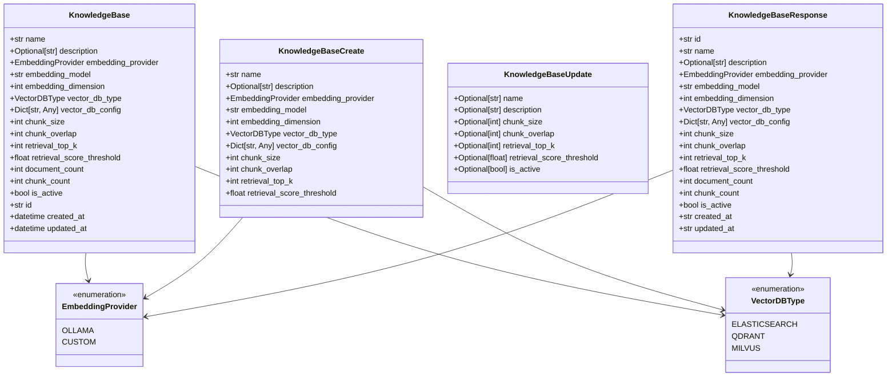
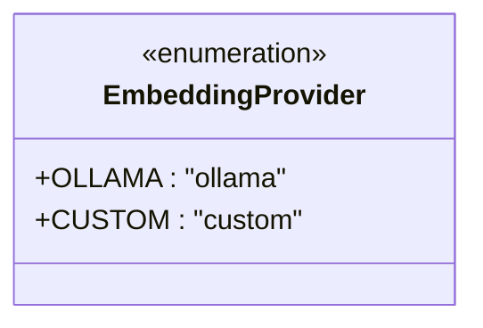
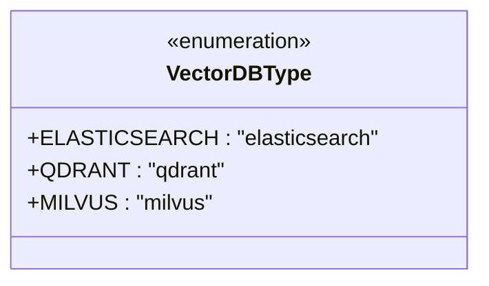
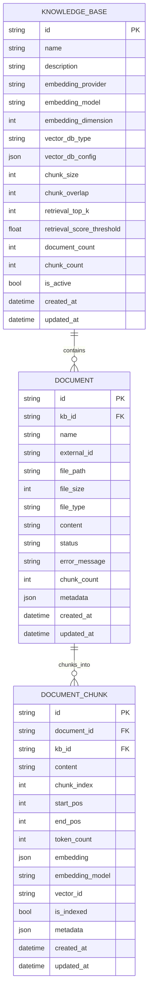
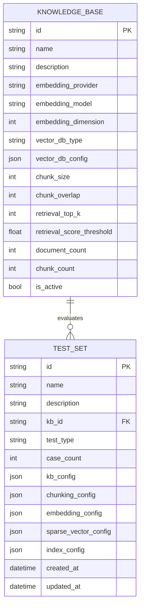
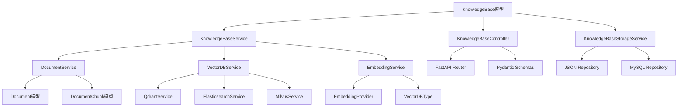
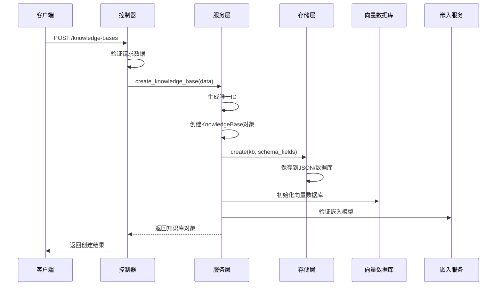
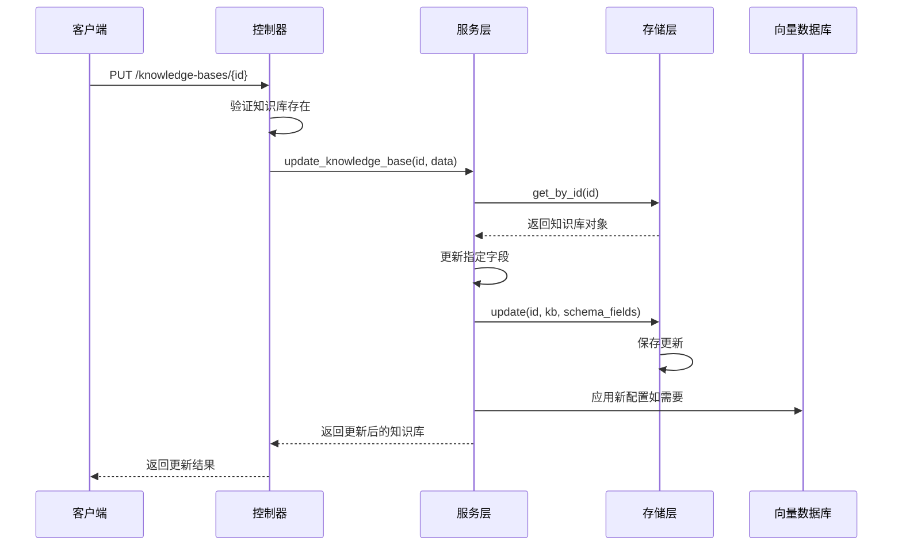
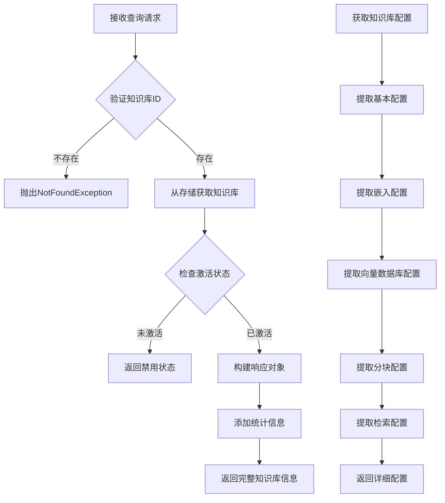

# 知识库模型技术文档

<cite>
**本文档引用的文件**
- [knowledge_base.py](file://backend/app/models/knowledge_base.py)
- [knowledge_base.py](file://backend/app/schemas/knowledge_base.py)
- [knowledge_base.py](file://backend/app/controllers/knowledge_base.py)
- [knowledge_base.py](file://backend/app/services/knowledge_base.py)
- [models.py](file://backend/app/database/models.py)
- [document.py](file://backend/app/models/document.py)
- [test.py](file://backend/app/models/test.py)
- [api.ts](file://web/lib/api.ts)
- [README_TEST.md](file://backend/README_TEST.md)
</cite>

## 目录
1. [简介](#简介)
2. [模型结构概览](#模型结构概览)
3. [核心字段详解](#核心字段详解)
4. [枚举类型定义](#枚举类型定义)
5. [模型关系分析](#模型关系分析)
6. [业务流程应用](#业务流程应用)
7. [API使用示例](#api使用示例)
8. [配置策略与最佳实践](#配置策略与最佳实践)
9. [性能优化建议](#性能优化建议)
10. [故障排除指南](#故障排除指南)

## 简介

知识库模型（KnowledgeBase）是RAG Studio系统的核心组件之一，负责管理向量知识库的完整生命周期。该模型定义了知识库的基本属性、配置参数和运行状态，为文档处理、向量检索和智能问答提供了基础设施支持。

知识库模型采用分层架构设计，包含数据模型层、业务逻辑层和服务接口层，确保了系统的可扩展性和维护性。通过标准化的配置管理和灵活的参数设置，支持多种嵌入模型提供商和向量数据库类型的集成。

## 模型结构概览



**图表来源**
- [knowledge_base.py](file://backend/app/models/knowledge_base.py#L25-L80)
- [knowledge_base.py](file://backend/app/schemas/knowledge_base.py#L11-L106)

**章节来源**
- [knowledge_base.py](file://backend/app/models/knowledge_base.py#L1-L80)
- [knowledge_base.py](file://backend/app/schemas/knowledge_base.py#L1-L106)

## 核心字段详解

### 基础信息字段

#### name（知识库名称）
- **数据类型**: `str`
- **约束条件**: 必填，最小长度1，最大长度100
- **业务含义**: 知识库的唯一标识名称，用于用户界面显示和API调用
- **默认值**: 无默认值，必须显式指定
- **验证规则**: 字符串长度验证，防止过长或过短的名称

#### description（知识库描述）
- **数据类型**: `Optional[str]`
- **约束条件**: 最大长度500
- **业务含义**: 对知识库用途和内容的简要说明
- **默认值**: `None`
- **应用场景**: 在知识库列表页面显示，帮助用户理解知识库用途

### 嵌入配置字段

#### embedding_provider（嵌入模型提供商）
- **数据类型**: `EmbeddingProvider`（枚举类型）
- **约束条件**: 必填，默认值为`EmbeddingProvider.OLLAMA`
- **业务含义**: 指定使用的嵌入模型服务提供商
- **可用选项**: 
  - `OLLAMA`: 本地Ollama服务
  - `CUSTOM`: 自定义嵌入服务

#### embedding_model（嵌入模型名称）
- **数据类型**: `str`
- **约束条件**: 必填
- **业务含义**: 具体的嵌入模型名称，如"nomic-embed-text"
- **验证规则**: 需要与提供商兼容的模型名称

#### embedding_dimension（向量维度）
- **数据类型**: `int`
- **约束条件**: 默认值768
- **业务含义**: 嵌入向量的维度大小
- **影响因素**: 不同模型产生不同维度的向量，需与向量数据库兼容

### 向量数据库配置

#### vector_db_type（向量数据库类型）
- **数据类型**: `VectorDBType`（枚举类型）
- **约束条件**: 必填
- **业务含义**: 指定使用的向量数据库类型
- **可用选项**:
  - `ELASTICSEARCH`: Elasticsearch向量搜索
  - `QDRANT`: Qdrant分布式向量数据库
  - `MILVUS`: Milvus高性能向量数据库

#### vector_db_config（向量数据库配置）
- **数据类型**: `Dict[str, Any]`
- **约束条件**: 默认为空字典
- **业务含义**: 向量数据库的具体连接和配置参数
- **配置示例**: 包含主机地址、端口、认证信息等
- **动态性**: 支持不同向量数据库的特定配置需求

### 分块配置字段

#### chunk_size（分块大小）
- **数据类型**: `int`
- **约束条件**: 默认值512，范围100-2000
- **业务含义**: 文档分块的字符长度
- **优化原则**: 
  - 较小值（100-500）适合细粒度检索
  - 较大值（500-2000）适合保持上下文完整性
- **影响因素**: 模型token限制和检索质量平衡

#### chunk_overlap（分块重叠）
- **数据类型**: `int`
- **约束条件**: 默认值50，范围0-500
- **业务含义**: 相邻分块之间的重叠字符数
- **作用**: 防止语义断裂，提高检索连续性
- **推荐值**: 通常为chunk_size的10%-20%

### 检索参数配置

#### retrieval_top_k（检索返回数量）
- **数据类型**: `int`
- **约束条件**: 默认值5，范围1-50
- **业务含义**: 检索时返回的最相似文档数量
- **性能考虑**: 数值越大，检索越准确但速度越慢
- **典型值**: 3-10适用于大多数场景

#### retrieval_score_threshold（检索分数阈值）
- **数据类型**: `float`
- **约束条件**: 默认值0.7，范围0.0-1.0
- **业务含义**: 检索结果的最低相似度阈值
- **质量控制**: 高阈值提高准确性，低阈值增加召回率
- **调优策略**: 根据具体应用场景调整

### 统计信息字段

#### document_count（文档数量）
- **数据类型**: `int`
- **约束条件**: 默认值0
- **业务含义**: 当前知识库中包含的文档总数
- **更新时机**: 文档导入完成后更新

#### chunk_count（分块数量）
- **数据类型**: `int`
- **约束条件**: 默认值0
- **业务含义**: 文档分块后的总分块数量
- **存储计算**: 通常大于document_count

### 状态字段

#### is_active（是否激活）
- **数据类型**: `bool`
- **约束条件**: 默认值True
- **业务含义**: 知识库的启用状态
- **影响范围**: 影响检索服务的可用性
- **管理操作**: 可通过API禁用或启用知识库

**章节来源**
- [knowledge_base.py](file://backend/app/models/knowledge_base.py#L28-L58)

## 枚举类型定义

### EmbeddingProvider枚举



**图表来源**
- [knowledge_base.py](file://backend/app/models/knowledge_base.py#L12-L16)

#### OLLAMA提供商
- **特点**: 本地部署，完全可控
- **优势**: 数据隐私保护，离线可用
- **适用场景**: 对数据安全要求高的企业环境
- **配置要求**: 需要本地Ollama服务运行

#### CUSTOM提供商
- **特点**: 自定义嵌入服务
- **优势**: 灵活适配特定需求
- **适用场景**: 使用专有嵌入模型的企业
- **配置复杂度**: 需要额外的服务配置

### VectorDBType枚举



**图表来源**
- [knowledge_base.py](file://backend/app/models/knowledge_base.py#L18-L23)

#### ELASTICSEARCH
- **特点**: 分布式全文搜索引擎
- **优势**: 成熟稳定，功能丰富
- **适用场景**: 需要全文搜索能力的混合场景
- **配置复杂度**: 中等

#### QDRANT
- **特点**: 专门的向量数据库
- **优势**: 专为向量搜索优化，性能优异
- **适用场景**: 纯向量检索为主的场景
- **配置复杂度**: 较低

#### MILVUS
- **特点**: 高性能向量数据库
- **优势**: 大规模向量存储，高并发检索
- **适用场景**: 大数据量和高并发访问场景
- **配置复杂度**: 较高

**章节来源**
- [knowledge_base.py](file://backend/app/models/knowledge_base.py#L12-L23)

## 模型关系分析

### 与Document模型的关系



**图表来源**
- [knowledge_base.py](file://backend/app/models/knowledge_base.py#L25-L80)
- [document.py](file://backend/app/models/document.py#L34-L116)

#### 关系特性
- **一对多关系**: 一个知识库可以包含多个文档
- **级联操作**: 删除知识库时需要同步删除关联文档
- **数据一致性**: 文档数量和分块数量统计依赖于关联文档的状态

### 与TestSet模型的关系



**图表来源**
- [knowledge_base.py](file://backend/app/models/knowledge_base.py#L25-L80)
- [test.py](file://backend/app/models/test.py#L26-L80)

#### 关系特性
- **配置快照**: 测试集保存知识库创建时的完整配置
- **版本控制**: 测试集记录知识库的配置历史
- **评估基础**: 测试集基于知识库配置进行检索和生成测试

### 依赖关系图



**图表来源**
- [knowledge_base.py](file://backend/app/services/knowledge_base.py#L15-L230)
- [knowledge_base.py](file://backend/app/controllers/knowledge_base.py#L19-L283)

**章节来源**
- [document.py](file://backend/app/models/document.py#L34-L116)
- [test.py](file://backend/app/models/test.py#L26-L80)

## 业务流程应用

### 知识库创建流程



**图表来源**
- [knowledge_base.py](file://backend/app/services/knowledge_base.py#L21-L47)
- [knowledge_base.py](file://backend/app/controllers/knowledge_base.py#L22-L44)

#### 创建步骤详解
1. **数据验证**: 使用Pydantic模式验证输入参数
2. **ID生成**: 使用UUID生成唯一知识库ID
3. **对象创建**: 构建KnowledgeBase实例
4. **存储持久化**: 保存到JSON文件或数据库
5. **资源初始化**: 初始化向量数据库和嵌入服务

### 知识库更新流程



**图表来源**
- [knowledge_base.py](file://backend/app/services/knowledge_base.py#L88-L117)
- [knowledge_base.py](file://backend/app/controllers/knowledge_base.py#L100-L121)

#### 更新特性
- **部分更新**: 支持只更新指定字段
- **配置热更新**: 部分配置可在运行时更新
- **向量数据库同步**: 更新向量数据库配置

### 知识库查询流程



**图表来源**
- [knowledge_base.py](file://backend/app/services/knowledge_base.py#L49-L60)
- [knowledge_base.py](file://backend/app/controllers/knowledge_base.py#L78-L97)

**章节来源**
- [knowledge_base.py](file://backend/app/services/knowledge_base.py#L21-L117)
- [knowledge_base.py](file://backend/app/controllers/knowledge_base.py#L22-L121)

## API使用示例

### 创建知识库示例

以下展示了通过API创建知识库的完整流程：

#### 基础创建请求
```json
{
  "name": "技术文档库",
  "description": "存储公司技术文档和开发指南",
  "embedding_model": "nomic-embed-text",
  "embedding_dimension": 768,
  "vector_db_type": "qdrant",
  "chunk_size": 512,
  "chunk_overlap": 50,
  "retrieval_top_k": 5,
  "retrieval_score_threshold": 0.7
}
```

#### 高级配置示例
```json
{
  "name": "企业知识库",
  "embedding_provider": "ollama",
  "embedding_model": "nomic-embed-text",
  "vector_db_type": "qdrant",
  "vector_db_config": {
    "host": "localhost",
    "port": 6333,
    "api_key": "your-api-key",
    "ssl": false
  },
  "chunk_size": 1024,
  "chunk_overlap": 100,
  "retrieval_top_k": 10,
  "retrieval_score_threshold": 0.8
}
```

### 更新知识库配置

#### 部分字段更新
```json
{
  "name": "更新后的技术文档库",
  "chunk_size": 1024,
  "retrieval_top_k": 8
}
```

#### 激活状态切换
```json
{
  "is_active": false
}
```

### 获取知识库配置

#### 基础信息获取
```bash
GET /api/v1/knowledge-bases/{kb_id}
```

#### 详细配置获取
```bash
GET /api/v1/knowledge-bases/{kb_id}/config
```

#### 统计信息获取
```bash
GET /api/v1/knowledge-bases/{kb_id}/stats
```

### API客户端使用示例

#### JavaScript客户端
```typescript
// 创建知识库
const createKnowledgeBase = async (data) => {
  const response = await fetch('/api/v1/knowledge-bases', {
    method: 'POST',
    headers: { 'Content-Type': 'application/json' },
    body: JSON.stringify(data)
  });
  return response.json();
};

// 更新知识库
const updateKnowledgeBase = async (kbId, data) => {
  const response = await fetch(`/api/v1/knowledge-bases/${kbId}`, {
    method: 'PUT',
    headers: { 'Content-Type': 'application/json' },
    body: JSON.stringify(data)
  });
  return response.json();
};
```

#### Python客户端
```python
import requests

# 创建知识库
def create_kb(name, embedding_model, vector_db_type):
    data = {
        "name": name,
        "embedding_model": embedding_model,
        "vector_db_type": vector_db_type
    }
    response = requests.post("http://localhost:8000/api/v1/knowledge-bases", json=data)
    return response.json()

# 获取知识库配置
def get_kb_config(kb_id):
    response = requests.get(f"http://localhost:8000/api/v1/knowledge-bases/{kb_id}/config")
    return response.json()
```

**章节来源**
- [api.ts](file://web/lib/api.ts#L59-L185)
- [README_TEST.md](file://backend/README_TEST.md#L40-L82)

## 配置策略与最佳实践

### 嵌入模型选择策略

#### 模型维度匹配
- **768维模型**: 适用于大多数通用场景，平衡性能和质量
- **1024维模型**: 适用于对精度要求较高的专业领域
- **384维模型**: 适用于资源受限的环境

#### 提供商选择指南
- **本地部署**: 推荐使用OLLAMA，确保数据隐私
- **云端服务**: 考虑供应商的SLA和成本
- **自定义服务**: 需要专门的技术支持

### 向量数据库选择指南

#### Qdrant配置优化
```json
{
  "vector_db_config": {
    "host": "localhost",
    "port": 6333,
    "collection_name": "knowledge_base_vectors",
    "distance": "Cosine",
    "hnsw_config": {
      "m": 16,
      "ef_construct": 200
    }
  }
}
```

#### Elasticsearch配置优化
```json
{
  "vector_db_config": {
    "hosts": ["http://localhost:9200"],
    "index_name": "knowledge_base",
    "ssl_verify": false,
    "timeout": 30
  }
}
```

### 分块策略优化

#### 小型文档处理
```json
{
  "chunk_size": 256,
  "chunk_overlap": 20,
  "retrieval_top_k": 3
}
```

#### 大型文档处理
```json
{
  "chunk_size": 1024,
  "chunk_overlap": 100,
  "retrieval_top_k": 10
}
```

#### 专业文档处理
```json
{
  "chunk_size": 512,
  "chunk_overlap": 50,
  "retrieval_score_threshold": 0.8
}
```

### 检索参数调优

#### 高精度场景
```json
{
  "retrieval_score_threshold": 0.85,
  "retrieval_top_k": 3
}
```

#### 高召回场景
```json
{
  "retrieval_score_threshold": 0.6,
  "retrieval_top_k": 10
}
```

#### 平衡场景
```json
{
  "retrieval_score_threshold": 0.7,
  "retrieval_top_k": 5
}
```

### 性能监控指标

#### 关键性能指标
- **检索延迟**: 平均检索响应时间
- **内存使用**: 向量数据库内存占用
- **磁盘空间**: 向量存储占用空间
- **CPU使用率**: 嵌入计算CPU负载

#### 监控告警配置
```yaml
monitoring:
  thresholds:
    retrieval_latency: 2.0  # 秒
    memory_usage: 80       # 百分比
    disk_usage: 90         # 百分比
```

**章节来源**
- [knowledge_base.py](file://backend/app/models/knowledge_base.py#L32-L54)

## 性能优化建议

### 向量数据库优化

#### Qdrant优化策略
- **索引配置**: 调整HNSW参数优化检索性能
- **批量操作**: 使用批量插入减少网络开销
- **内存映射**: 启用内存映射提高I/O性能

#### Elasticsearch优化策略
- **分片配置**: 根据数据量合理配置分片
- **刷新间隔**: 调整索引刷新间隔平衡实时性和性能
- **副本设置**: 根据读写比例配置副本数量

### 内存管理优化

#### 嵌入缓存策略
```python
# 缓存最近使用的嵌入向量
class EmbeddingCache:
    def __init__(self, max_size=1000):
        self.cache = {}
        self.max_size = max_size
    
    def get_embedding(self, text):
        if text in self.cache:
            return self.cache[text]
        # 计算嵌入并向量数据库存储
        embedding = self.calculate_embedding(text)
        self.cache[text] = embedding
        return embedding
```

#### 分块预处理
- **异步处理**: 使用异步方式处理文档分块
- **批量嵌入**: 批量计算多个文本的嵌入向量
- **压缩存储**: 对向量进行量化压缩

### 网络优化

#### 连接池配置
```python
# 向量数据库连接池
import httpx

client = httpx.AsyncClient(
    limits=httpx.Limits(
        max_keepalive_connections=20,
        max_connections=100,
        keepalive_expiry=30
    ),
    timeout=httpx.Timeout(30.0)
)
```

#### 负载均衡
- **多节点部署**: 在多个节点上部署向量数据库
- **读写分离**: 分离读写操作到不同节点
- **智能路由**: 根据负载情况智能分配请求

### 存储优化

#### 数据压缩
- **向量量化**: 使用INT8/FP16量化减少存储空间
- **增量备份**: 只备份变更的数据
- **冷热分离**: 将不常访问的数据迁移到低成本存储

#### 索引优化
- **定期重建**: 定期重建向量索引提高检索效率
- **分层索引**: 使用分层索引加速大规模数据检索
- **预计算**: 预计算常用查询的索引结果

**章节来源**
- [knowledge_base.py](file://backend/app/services/knowledge_base.py#L195-L229)

## 故障排除指南

### 常见问题诊断

#### 嵌入模型连接问题

**症状**: 创建知识库时嵌入模型验证失败
**可能原因**:
- 模型名称拼写错误
- 嵌入服务不可用
- 网络连接问题

**解决方案**:
```python
# 验证嵌入模型可用性
def validate_embedding_model(provider, model_name):
    try:
        # 测试连接
        client = get_embedding_client(provider)
        test_text = "test"
        embedding = client.embed_documents([test_text])
        return True
    except Exception as e:
        print(f"嵌入模型验证失败: {e}")
        return False
```

#### 向量数据库连接问题

**症状**: 知识库创建成功但向量数据库初始化失败
**诊断步骤**:
1. 检查数据库连接配置
2. 验证数据库服务状态
3. 检查网络连通性

**解决方案**:
```python
# 向量数据库连接测试
async def test_vector_db_connection(config):
    try:
        if config["type"] == "qdrant":
            from app.services.qdrant_service import QdrantService
            service = QdrantService(config=config)
            await service.health_check()
        elif config["type"] == "elasticsearch":
            from app.services.elasticsearch_service import ElasticsearchService
            service = ElasticsearchService(config=config)
            await service.health_check()
        return True
    except Exception as e:
        print(f"向量数据库连接失败: {e}")
        return False
```

### 性能问题排查

#### 检索性能下降

**诊断指标**:
- 检索延迟 > 2秒
- 内存使用率 > 80%
- CPU使用率持续高

**优化措施**:
```python
# 性能监控和优化
class PerformanceMonitor:
    def __init__(self):
        self.metrics = {}
    
    async def monitor_retrieval_performance(self, kb_id, query):
        start_time = time.time()
        try:
            # 执行检索
            result = await self.retrieval_service.search(kb_id, query)
            latency = time.time() - start_time
            
            # 记录性能指标
            self.metrics[kb_id] = {
                "avg_latency": latency,
                "recent_queries": self.metrics.get(kb_id, {}).get("recent_queries", [])[-100:]
            }
            
            return result
        except Exception as e:
            print(f"检索失败: {e}")
            raise
```

#### 内存泄漏检测

**检测方法**:
- 监控内存使用趋势
- 检查对象引用计数
- 分析垃圾回收频率

**预防措施**:
```python
# 内存管理工具
import gc
import psutil

class MemoryManager:
    def __init__(self):
        self.initial_memory = psutil.Process().memory_info().rss
    
    def check_memory_leak(self):
        current_memory = psutil.Process().memory_info().rss
        memory_growth = current_memory - self.initial_memory
        
        if memory_growth > 100 * 1024 * 1024:  # 100MB增长
            print(f"检测到内存增长: {memory_growth / 1024 / 1024:.2f}MB")
            gc.collect()  # 强制垃圾回收
```

### 配置错误处理

#### 参数范围验证

```python
# 参数验证装饰器
def validate_knowledge_base_params(func):
    async def wrapper(*args, **kwargs):
        params = kwargs.get('data') or args[0]
        
        # 验证chunk_size范围
        if hasattr(params, 'chunk_size'):
            assert 100 <= params.chunk_size <= 2000, "chunk_size必须在100-2000之间"
        
        # 验证retrieval_top_k范围
        if hasattr(params, 'retrieval_top_k'):
            assert 1 <= params.retrieval_top_k <= 50, "retrieval_top_k必须在1-50之间"
        
        # 验证分数阈值范围
        if hasattr(params, 'retrieval_score_threshold'):
            assert 0.0 <= params.retrieval_score_threshold <= 1.0, "分数阈值必须在0.0-1.0之间"
        
        return await func(*args, **kwargs)
    return wrapper
```

#### 配置冲突检测

```python
# 配置冲突检测
def detect_config_conflicts(kb_config):
    conflicts = []
    
    # 检查向量维度与模型兼容性
    if kb_config.get('embedding_dimension') == 768:
        if kb_config.get('vector_db_type') == 'milvus':
            conflicts.append("768维向量可能不被Milvus最优支持")
    
    # 检查分块参数合理性
    chunk_size = kb_config.get('chunk_size', 512)
    chunk_overlap = kb_config.get('chunk_overlap', 50)
    
    if chunk_overlap >= chunk_size:
        conflicts.append("chunk_overlap不应大于等于chunk_size")
    
    return conflicts
```

### 日志和监控

#### 结构化日志记录

```python
import logging
from datetime import datetime

# 知识库操作日志
class KnowledgeBaseLogger:
    def __init__(self):
        self.logger = logging.getLogger('knowledge_base')
    
    def log_creation(self, kb_id, name, provider, db_type):
        self.logger.info({
            'event': 'kb_created',
            'timestamp': datetime.utcnow(),
            'kb_id': kb_id,
            'name': name,
            'provider': provider,
            'db_type': db_type
        })
    
    def log_error(self, kb_id, error_type, error_message):
        self.logger.error({
            'event': 'kb_error',
            'timestamp': datetime.utcnow(),
            'kb_id': kb_id,
            'error_type': error_type,
            'message': error_message
        })
```

#### 健康检查机制

```python
# 健康检查服务
class HealthChecker:
    async def check_knowledge_base_health(self, kb_id):
        checks = {
            'database_connection': await self.check_database_connection(kb_id),
            'embedding_service': await self.check_embedding_service(kb_id),
            'vector_index': await self.check_vector_index(kb_id),
            'performance': await self.check_performance(kb_id)
        }
        
        overall_status = all(checks.values())
        
        return {
            'overall_status': overall_status,
            'checks': checks,
            'timestamp': datetime.utcnow()
        }
```

**章节来源**
- [knowledge_base.py](file://backend/app/services/knowledge_base.py#L195-L229)

## 总结

知识库模型作为RAG Studio系统的核心组件，通过精心设计的字段结构和配置参数，为向量知识库的创建、管理和使用提供了完整的基础设施支持。本文档详细介绍了模型的各个组成部分，包括基础信息、嵌入配置、向量数据库设置、分块策略和检索参数等关键字段。

通过合理的配置策略和最佳实践指导，开发者可以根据具体的应用场景优化知识库性能，满足不同规模和复杂度的需求。同时，完善的故障排除指南和性能优化建议为系统的稳定运行提供了保障。

知识库模型与Document、TestSet等其他模型的紧密关联，体现了系统整体架构的设计思想，确保了数据的一致性和业务流程的完整性。随着系统的不断发展，知识库模型将继续演进，为用户提供更加智能和高效的检索服务。