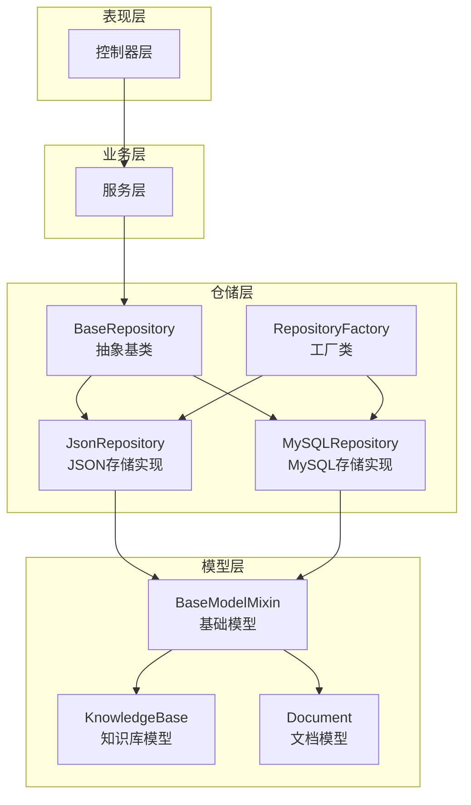
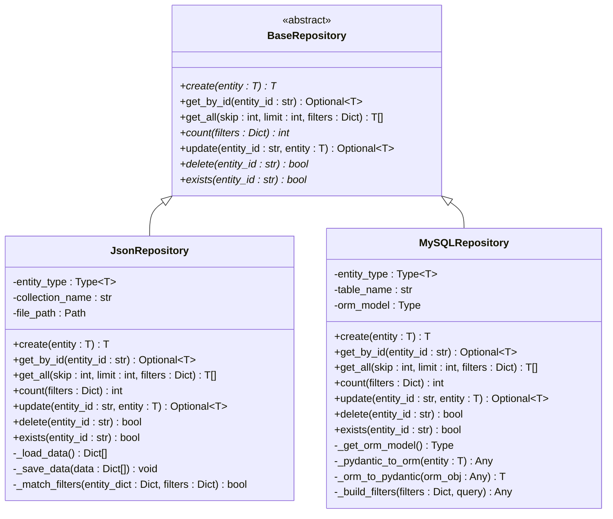
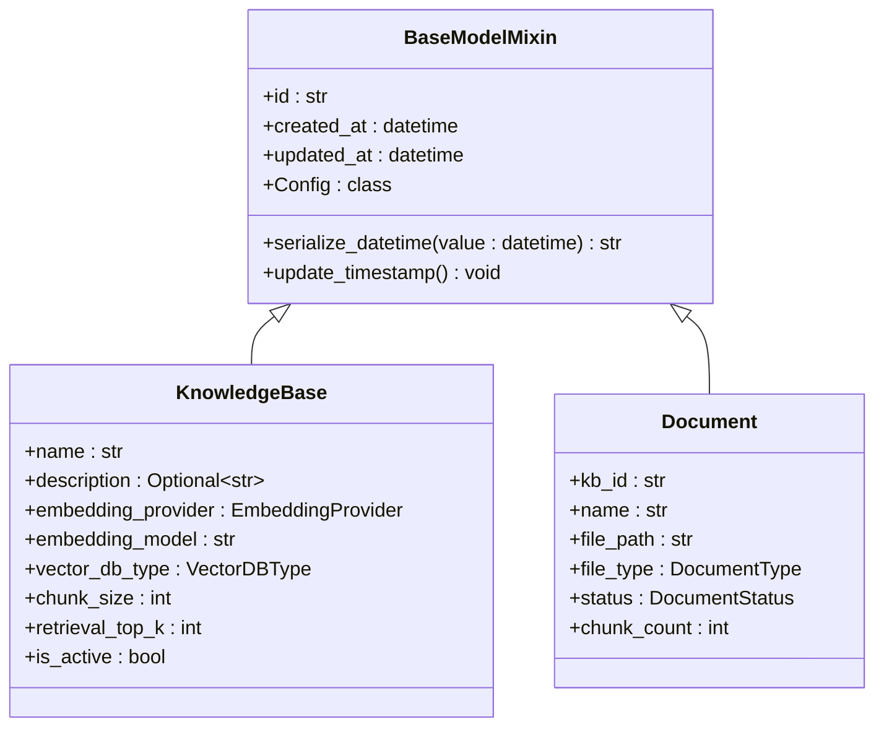
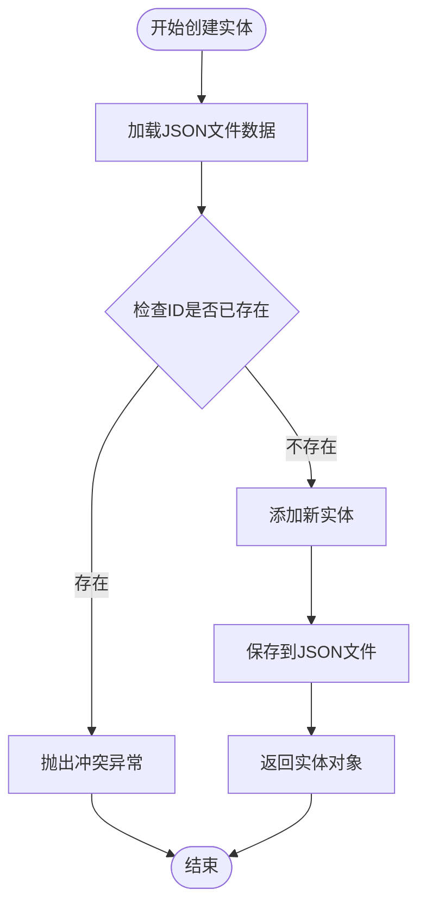
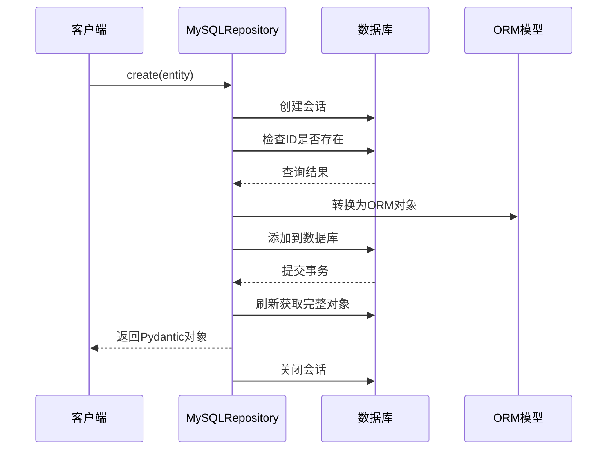
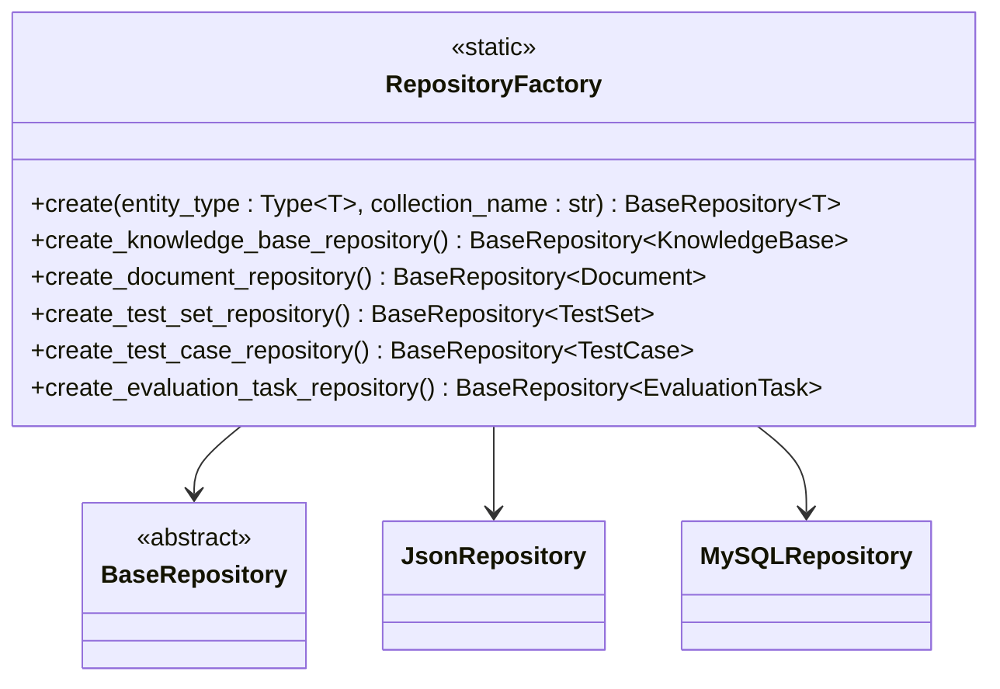
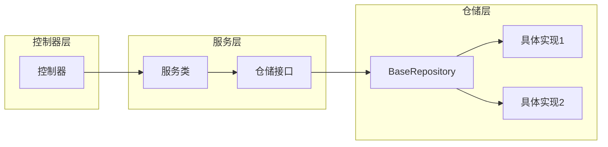
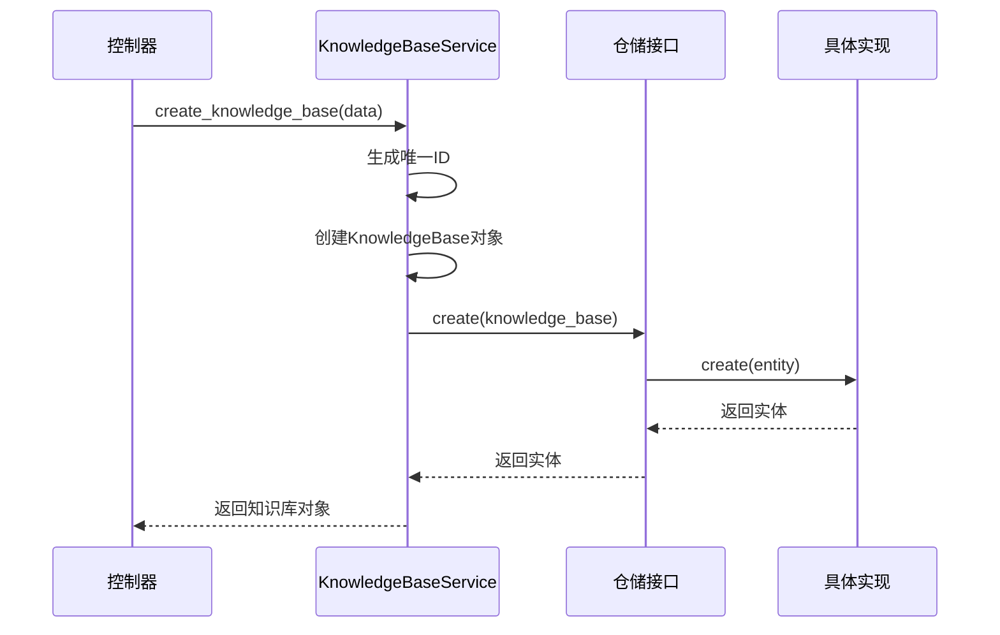

# RAG-Studio仓储基础接口详细文档

<cite>
**本文档引用的文件**
- [base.py](file://backend/app/repositories/base.py)
- [json_repository.py](file://backend/app/repositories/json_repository.py)
- [mysql_repository.py](file://backend/app/repositories/mysql_repository.py)
- [factory.py](file://backend/app/repositories/factory.py)
- [base.py](file://backend/app/models/base.py)
- [knowledge_base.py](file://backend/app/models/knowledge_base.py)
- [document.py](file://backend/app/models/document.py)
- [knowledge_base.py](file://backend/app/services/knowledge_base.py)
- [document.py](file://backend/app/services/document.py)
</cite>

## 目录
1. [简介](#简介)
2. [项目结构概览](#项目结构概览)
3. [BaseRepository核心设计](#baserepository核心设计)
4. [泛型与类型安全](#泛型与类型安全)
5. [CRUD操作详解](#crud操作详解)
6. [存储实现对比](#存储实现对比)
7. [工厂模式与依赖注入](#工厂模式与依赖注入)
8. [服务层集成](#服务层集成)
9. [最佳实践指南](#最佳实践指南)
10. [总结](#总结)

## 简介

RAG-Studio的仓储基础接口是一个精心设计的抽象层，它定义了统一的数据访问标准，为整个应用程序提供了类型安全且灵活的数据持久化解决方案。该接口采用泛型设计，结合Pydantic模型，确保了类型安全性和开发效率。

## 项目结构概览

RAG-Studio的仓储层采用了清晰的分层架构，主要包含以下组件：



**图表来源**
- [base.py](file://backend/app/repositories/base.py#L1-L119)
- [factory.py](file://backend/app/repositories/factory.py#L1-L116)
- [json_repository.py](file://backend/app/repositories/json_repository.py#L1-L162)
- [mysql_repository.py](file://backend/app/repositories/mysql_repository.py#L1-L308)

**章节来源**
- [base.py](file://backend/app/repositories/base.py#L1-L119)
- [factory.py](file://backend/app/repositories/factory.py#L1-L116)

## BaseRepository核心设计

### 抽象类定义

BaseRepository是整个仓储层的核心抽象类，它定义了一套标准化的CRUD操作接口。该类采用泛型设计，通过TypeVar约束确保类型安全。



**图表来源**
- [base.py](file://backend/app/repositories/base.py#L14-L119)
- [json_repository.py](file://backend/app/repositories/json_repository.py#L16-L162)
- [mysql_repository.py](file://backend/app/repositories/mysql_repository.py#L19-L308)

### 设计原则

BaseRepository的设计遵循以下核心原则：

1. **单一职责原则**：专注于数据访问操作
2. **开闭原则**：对扩展开放，对修改封闭
3. **依赖倒置原则**：依赖抽象而非具体实现
4. **类型安全**：通过泛型确保编译时类型检查

**章节来源**
- [base.py](file://backend/app/repositories/base.py#L14-L119)

## 泛型与类型安全

### 泛型设计

BaseRepository采用泛型设计，通过TypeVar约束确保类型安全：

```python
T = TypeVar("T", bound=BaseModelMixin)
```

这种设计带来了以下优势：
- **编译时类型检查**：IDE和类型检查器可以提供更好的智能提示
- **运行时类型验证**：Pydantic自动验证数据完整性
- **代码可读性**：明确的类型声明提高了代码可维护性

### BaseModelMixin基类

所有实体模型都必须继承自BaseModelMixin，它提供了通用的字段和行为：



**图表来源**
- [base.py](file://backend/app/models/base.py#L11-L31)
- [knowledge_base.py](file://backend/app/models/knowledge_base.py#L25-L80)
- [document.py](file://backend/app/models/document.py#L34-L116)

**章节来源**
- [base.py](file://backend/app/repositories/base.py#L11-L12)
- [base.py](file://backend/app/models/base.py#L11-L31)

## CRUD操作详解

### create方法

创建实体是最基本的操作，要求实体具有唯一的ID：

| 参数 | 类型 | 描述 | 必需 |
|------|------|------|------|
| entity | T | 要创建的实体对象 | 是 |

| 返回值 | 类型 | 描述 |
|--------|------|------|
| result | T | 创建成功的实体对象 |

**设计意图**：确保每个实体都有唯一标识符，便于后续操作。

### get_by_id方法

根据实体ID获取单个实体：

| 参数 | 类型 | 描述 | 必需 |
|------|------|------|------|
| entity_id | str | 实体的唯一标识符 | 是 |

| 返回值 | 类型 | 描述 |
|--------|------|------|
| result | Optional[T] | 实体对象，不存在时返回None |

**设计意图**：提供快速的实体查询能力，支持空值处理。

### get_all方法

获取所有实体，支持分页和过滤：

| 参数 | 类型 | 默认值 | 描述 | 必需 |
|------|------|--------|------|------|
| skip | int | 0 | 跳过的实体数量 | 否 |
| limit | int | 100 | 限制返回的实体数量 | 否 |
| filters | Optional[Dict[str, Any]] | None | 过滤条件字典 | 否 |

| 返回值 | 类型 | 描述 |
|--------|------|------|
| result | List[T] | 符合条件的实体列表 |

**设计意图**：提供灵活的数据查询能力，支持大数据集的高效浏览。

### count方法

统计符合条件的实体数量：

| 参数 | 类型 | 描述 | 必需 |
|------|------|------|------|
| filters | Optional[Dict[str, Any]] | 过滤条件 | 否 |

| 返回值 | 类型 | 描述 |
|--------|------|------|
| result | int | 实体数量 |

**设计意图**：为前端分页提供准确的总数信息。

### update方法

更新现有实体：

| 参数 | 类型 | 描述 | 必需 |
|------|------|------|------|
| entity_id | str | 要更新的实体ID | 是 |
| entity | T | 包含更新数据的实体对象 | 是 |

| 返回值 | 类型 | 描述 |
|--------|------|------|
| result | Optional[T] | 更新后的实体，不存在时返回None |

**设计意图**：支持部分字段更新，保持实体的其他属性不变。

### delete方法

删除指定ID的实体：

| 参数 | 类型 | 描述 | 必需 |
|------|------|------|------|
| entity_id | str | 要删除的实体ID | 是 |

| 返回值 | 类型 | 描述 |
|--------|------|------|
| result | bool | 是否删除成功 |

**设计意图**：提供原子性的删除操作，确保数据一致性。

### exists方法

检查实体是否存在：

| 参数 | 类型 | 描述 | 必需 |
|------|------|------|------|
| entity_id | str | 要检查的实体ID | 是 |

| 返回值 | 类型 | 描述 |
|--------|------|------|
| result | bool | 实体是否存在 |

**设计意图**：提供高效的存活性检查，避免不必要的查询操作。

**章节来源**
- [base.py](file://backend/app/repositories/base.py#L20-L117)

## 存储实现对比

### JSON存储实现

JsonRepository适用于开发环境和小型项目：



**图表来源**
- [json_repository.py](file://backend/app/repositories/json_repository.py#L70-L87)

**特点**：
- **简单易用**：无需数据库配置
- **便携性强**：单个JSON文件即可保存所有数据
- **开发友好**：适合调试和原型开发
- **性能限制**：不适合大规模数据

### MySQL存储实现

MySQLRepository适用于生产环境：



**图表来源**
- [mysql_repository.py](file://backend/app/repositories/mysql_repository.py#L112-L145)

**特点**：
- **高性能**：支持并发访问和复杂查询
- **数据安全**：事务支持和数据完整性保证
- **可扩展性**：支持水平扩展和集群部署
- **功能丰富**：支持复杂过滤和聚合查询

**章节来源**
- [json_repository.py](file://backend/app/repositories/json_repository.py#L16-L162)
- [mysql_repository.py](file://backend/app/repositories/mysql_repository.py#L19-L308)

## 工厂模式与依赖注入

### RepositoryFactory设计

RepositoryFactory采用工厂模式，根据配置动态创建合适的仓储实例：



**图表来源**
- [factory.py](file://backend/app/repositories/factory.py#L17-L116)

### 配置驱动的存储切换

系统支持通过配置文件动态切换存储类型：

| 配置项 | 可选值 | 描述 |
|--------|--------|------|
| STORAGE_TYPE | json, mysql | 存储类型配置 |
| STORAGE_PATH | 任意路径 | JSON存储文件路径 |

**设计优势**：
- **环境隔离**：开发、测试、生产环境使用不同存储
- **零代码变更**：通过配置切换存储类型
- **易于测试**：可在测试环境中使用内存存储

**章节来源**
- [factory.py](file://backend/app/repositories/factory.py#L23-L48)

## 服务层集成

### MVC架构中的角色

BaseRepository在MVC架构中扮演着关键的抽象边界角色：



**图表来源**
- [knowledge_base.py](file://backend/app/services/knowledge_base.py#L15-L230)
- [document.py](file://backend/app/services/document.py#L16-L272)

### 服务层使用示例

以KnowledgeBaseService为例，展示如何使用仓储接口：



**图表来源**
- [knowledge_base.py](file://backend/app/services/knowledge_base.py#L21-L47)

### 依赖注入模式

服务层通过构造函数注入仓储实例：

```python
class DocumentService:
    def __init__(self):
        self.doc_repository = RepositoryFactory.create_document_repository()
        self.chunk_repository = RepositoryFactory.create_document_chunk_repository()
```

**设计优势**：
- **松耦合**：服务层不依赖具体实现
- **可测试性**：易于模拟仓储接口进行单元测试
- **可维护性**：修改存储实现不影响业务逻辑

**章节来源**
- [knowledge_base.py](file://backend/app/services/knowledge_base.py#L15-L230)
- [document.py](file://backend/app/services/document.py#L16-L272)

## 最佳实践指南

### 继承BaseRepository创建新仓储

创建新的仓储类需要遵循以下步骤：

1. **定义实体模型**：继承BaseModelMixin
2. **实现仓储类**：继承BaseRepository并实现所有抽象方法
3. **配置工厂**：在RepositoryFactory中添加创建方法

### 异常处理最佳实践

```python
# 推荐的异常处理模式
try:
    result = await repository.create(entity)
    return result
except ConflictException as e:
    # 处理ID冲突
    logger.warning(f"实体创建冲突: {e}")
    raise
except InternalServerException as e:
    # 处理内部服务器错误
    logger.error(f"实体创建失败: {e}")
    raise
```

### 性能优化建议

1. **批量操作**：对于大量数据操作，考虑实现批量方法
2. **缓存策略**：对频繁查询的数据实现缓存
3. **索引优化**：在数据库实现中为常用查询字段建立索引
4. **连接池管理**：合理配置数据库连接池参数

### 测试策略

```python
# 单元测试示例
@pytest.mark.asyncio
async def test_create_entity():
    # 模拟仓储接口
    mock_repo = MagicMock(spec=BaseRepository)
    mock_repo.create.return_value = expected_entity
    
    # 测试业务逻辑
    service = KnowledgeBaseService(mock_repo)
    result = await service.create_knowledge_base(valid_data)
    
    # 验证调用
    mock_repo.create.assert_called_once_with(expected_entity)
    assert result == expected_entity
```

### 类型注解规范

```python
# 推荐的类型注解
async def create(self, entity: KnowledgeBase) -> KnowledgeBase:
    """创建知识库
    
    Args:
        entity: 要创建的知识库实体
        
    Returns:
        创建成功的知识库对象
    """
    # 实现细节...
```

## 总结

RAG-Studio的仓储基础接口设计体现了现代软件架构的最佳实践：

### 核心优势

1. **类型安全**：通过泛型和Pydantic确保编译时和运行时类型安全
2. **抽象统一**：为不同存储后端提供统一的接口
3. **灵活扩展**：支持多种存储实现，易于添加新的存储类型
4. **服务解耦**：通过接口隔离业务逻辑和数据访问逻辑
5. **易于测试**：支持依赖注入和模拟测试

### 设计亮点

- **泛型约束**：确保类型安全的同时保持灵活性
- **异步支持**：完全支持异步操作，适应现代Web应用需求
- **异常处理**：提供丰富的异常类型，便于错误处理
- **工厂模式**：支持运行时存储类型切换

### 应用价值

该设计不仅满足了当前的功能需求，更为未来的扩展奠定了坚实的基础。通过遵循这些设计原则和最佳实践，开发者可以构建出高质量、可维护的数据访问层，为整个应用程序提供稳定可靠的数据服务。