# RAG-Studio仓储工厂机制架构文档

<cite>
**本文档引用的文件**
- [factory.py](file://backend/app/repositories/factory.py)
- [base.py](file://backend/app/repositories/base.py)
- [json_repository.py](file://backend/app/repositories/json_repository.py)
- [mysql_repository.py](file://backend/app/repositories/mysql_repository.py)
- [config.py](file://backend/app/config.py)
- [knowledge_base.py](file://backend/app/services/knowledge_base.py)
- [document.py](file://backend/app/services/document.py)
- [knowledge_base_storage.py](file://backend/app/services/knowledge_base_storage.py)
- [test_service.py](file://backend/app/services/test_service.py)
- [retriever_evaluation_repository.py](file://backend/app/repositories/retriever_evaluation_repository.py)
</cite>

## 目录
1. [概述](#概述)
2. [系统架构](#系统架构)
3. [核心组件分析](#核心组件分析)
4. [工厂模式实现](#工厂模式实现)
5. [类型安全机制](#类型安全机制)
6. [存储后端适配](#存储后端适配)
7. [服务层集成](#服务层集成)
8. [扩展指南](#扩展指南)
9. [最佳实践](#最佳实践)
10. [总结](#总结)

## 概述

RAG-Studio采用仓储工厂模式实现存储后端的可插拔性，通过动态配置机制支持多种存储类型（JSON文件存储和MySQL数据库）。该架构提供了统一的数据访问接口，实现了依赖注入的简化，使上层服务无需关心具体的存储实现细节。

### 主要特性

- **可插拔存储后端**：支持JSON和MySQL两种存储类型
- **类型安全**：利用Python泛型确保编译时类型检查
- **依赖注入简化**：通过工厂模式隐藏存储实现细节
- **统一接口**：所有仓储实现遵循相同的CRUD接口
- **配置驱动**：通过配置文件动态切换存储后端

## 系统架构


**图表来源**
- [factory.py](file://backend/app/repositories/factory.py#L17-L116)
- [base.py](file://backend/app/repositories/base.py#L14-L119)
- [config.py](file://backend/app/config.py#L42-L43)

## 核心组件分析

### RepositoryFactory类

RepositoryFactory是整个仓储工厂机制的核心，采用静态工厂方法模式实现存储后端的动态创建。


**图表来源**
- [factory.py](file://backend/app/repositories/factory.py#L17-L116)
- [base.py](file://backend/app/repositories/base.py#L14-L119)
- [json_repository.py](file://backend/app/repositories/json_repository.py#L16-L162)
- [mysql_repository.py](file://backend/app/repositories/mysql_repository.py#L19-L308)

**章节来源**
- [factory.py](file://backend/app/repositories/factory.py#L17-L116)
- [base.py](file://backend/app/repositories/base.py#L14-L119)

### BaseRepository抽象基类

BaseRepository定义了所有仓储实现必须遵循的统一接口，确保不同存储后端的一致性。

#### 核心接口规范

| 方法名 | 参数 | 返回值 | 描述 |
|--------|------|--------|------|
| create | entity: T | T | 创建实体对象 |
| get_by_id | entity_id: str | Optional[T] | 根据ID获取实体 |
| get_all | skip: int, limit: int, filters: Optional[Dict] | List[T] | 获取实体列表（支持分页和过滤） |
| count | filters: Optional[Dict] | int | 统计实体数量 |
| update | entity_id: str, entity: T | Optional[T] | 更新实体对象 |
| delete | entity_id: str | bool | 删除实体对象 |
| exists | entity_id: str | bool | 检查实体是否存在 |

**章节来源**
- [base.py](file://backend/app/repositories/base.py#L20-L118)

## 工厂模式实现

### create方法的类型安全实现

RepositoryFactory的create方法采用了泛型编程技术，确保类型安全和编译时检查。


**图表来源**
- [factory.py](file://backend/app/repositories/factory.py#L23-L48)
- [config.py](file://backend/app/config.py#L42-L43)

### 特定领域模型工厂方法

除了通用的create方法，RepositoryFactory还提供了一系列专门针对领域模型的工厂方法，简化了特定仓储的创建过程。

#### 工厂方法映射表

| 工厂方法 | 实体类型 | 集合/表名称 | 用途 |
|----------|----------|-------------|------|
| create_knowledge_base_repository | KnowledgeBase | knowledge_bases | 知识库管理 |
| create_document_repository | Document | documents | 文档管理 |
| create_document_chunk_repository | DocumentChunk | document_chunks | 文档分块管理 |
| create_test_set_repository | TestSet | test_sets | 测试集管理 |
| create_test_case_repository | TestCase | test_cases | 测试用例管理 |
| create_retrieval_test_result_repository | RetrievalTestResult | retrieval_test_results | 检索测试结果 |
| create_generation_test_result_repository | GenerationTestResult | generation_test_results | 生成测试结果 |
| create_retriever_evaluation_repository | RetrieverEvaluationResult | retriever_evaluations | 检索器评估 |
| create_evaluation_task_repository | EvaluationTask | evaluation_tasks | 评估任务管理 |
| create_evaluation_case_result_repository | EvaluationCaseResult | evaluation_case_results | 评估用例结果 |
| create_evaluation_summary_repository | EvaluationSummary | evaluation_summaries | 评估汇总管理 |

**章节来源**
- [factory.py](file://backend/app/repositories/factory.py#L50-L114)

## 类型安全机制

### 泛型约束与类型推断

RepositoryFactory使用Python泛型技术确保类型安全：

```python
# 类型变量定义
T = TypeVar("T", bound=BaseModelMixin)

# 泛型方法签名
@staticmethod
def create(entity_type: Type[T], collection_name: str) -> BaseRepository[T]:
```

这种设计确保：
- 编译时类型检查
- IDE智能提示支持
- 运行时类型安全
- 自动类型推断

### 类型兼容性保证

所有仓储实现都继承自BaseRepository[T]，确保：
- 统一的接口契约
- 相同的返回类型
- 一致的行为语义
- 可互换的存储实现

**章节来源**
- [factory.py](file://backend/app/repositories/factory.py#L6-L16)
- [base.py](file://backend/app/repositories/base.py#L11-L12)

## 存储后端适配

### JSON文件存储实现

JsonRepository为本地开发和调试提供轻量级的存储解决方案。


**图表来源**
- [json_repository.py](file://backend/app/repositories/json_repository.py#L22-L40)

#### JSON存储特性

- **文件格式**：每个实体类型对应一个JSON文件
- **数据结构**：数组格式存储实体对象
- **序列化**：使用Pydantic模型的model_dump()方法
- **错误处理**：完善的异常处理机制
- **性能特点**：适合小规模数据和开发环境

**章节来源**
- [json_repository.py](file://backend/app/repositories/json_repository.py#L16-L162)

### MySQL数据库存储实现

MySQLRepository提供生产级别的数据持久化能力。

```mermaid
flowchart TD
Start([初始化MySQLRepository]) --> GetModel["获取ORM模型<br/>_get_orm_model()"]
GetModel --> ModelFound{"模型找到?"}
ModelFound --> |否| ThrowError["抛出ValueError异常"]
ModelFound --> |是| Ready["准备就绪"]
Ready --> Operation{"执行操作"}
Operation --> |create| CheckExists["检查ID是否存在"]
Operation --> |get_by_id| QueryByID["查询单条记录"]
Operation --> |get_all| QueryWithFilters["查询带过滤条件"]
Operation --> |update| FindAndUpdate["查找并更新"]
Operation --> |delete| FindAndDelete["查找并删除"]
Operation --> |count| CountRecords["统计记录数"]
Operation --> |exists| CheckExistence["检查存在性"]
CheckExists --> ConvertPydantic["转换Pydantic模型<br/>_pydantic_to_orm()"]
QueryByID --> ConvertORM["转换ORM模型<br/>_orm_to_pydantic()"]
QueryWithFilters --> ConvertORM
FindAndUpdate --> ConvertORM
FindAndDelete --> ConvertORM
CountRecords --> ConvertORM
CheckExistence --> ConvertORM
ConvertPydantic --> ExecuteDB["执行数据库操作"]
ConvertORM --> ExecuteDB
ExecuteDB --> HandleTransaction["事务处理"]
HandleTransaction --> Return["返回结果"]
```



**图表来源**
- [mysql_repository.py](file://backend/app/repositories/mysql_repository.py#L28-L60)

#### MySQL存储特性

- **ORM映射**：使用SQLAlchemy ORM进行对象关系映射
- **事务支持**：完整的ACID事务保证
- **并发控制**：数据库级别的并发安全
- **性能优化**：索引、连接池等优化措施
- **扩展性**：支持大规模数据存储

**章节来源**
- [mysql_repository.py](file://backend/app/repositories/mysql_repository.py#L19-L308)

## 服务层集成

### 依赖注入简化

RepositoryFactory通过工厂模式实现了依赖注入的简化，业务服务无需关心具体的存储实现。


**图表来源**
- [document.py](file://backend/app/services/document.py#L19-L21)
- [test_service.py](file://backend/app/services/test_service.py#L24-L28)

### 典型服务层调用方式

#### 文档服务中的使用

文档服务展示了仓储工厂在实际业务中的应用模式：

```python
# 服务初始化时创建仓储实例
class DocumentService:
    def __init__(self):
        self.doc_repository = RepositoryFactory.create_document_repository()
        self.chunk_repository = RepositoryFactory.create_document_chunk_repository()
    
    # 业务方法中使用仓储
    async def upload_document(self, kb_id: str, file: UploadFile) -> Document:
        # 使用仓储进行数据操作
        document = Document(id=doc_id, kb_id=kb_id, ...)
        await self.doc_repository.create(document)
        return document
```

#### 知识库服务中的使用

知识库服务展示了复杂业务场景下的仓储使用：

```python
class KnowledgeBaseService:
    def __init__(self):
        self.storage = KnowledgeBaseStorageService()
    
    async def create_knowledge_base(self, data: KnowledgeBaseCreate) -> KnowledgeBase:
        # 使用仓储进行知识库管理
        kb = KnowledgeBase(id=kb_id, **data.model_dump())
        await self.storage.create(kb, schema_fields)
        return kb
```

**章节来源**
- [document.py](file://backend/app/services/document.py#L16-L21)
- [knowledge_base.py](file://backend/app/services/knowledge_base.py#L15-L19)

## 扩展指南

### 新增存储类型

要添加新的存储类型（如Redis），需要以下步骤：

#### 1. 创建新的仓储实现类

```python
class RedisRepository(BaseRepository[T], Generic[T]):
    def __init__(self, entity_type: Type[T], collection_name: str):
        self.entity_type = entity_type
        self.collection_name = collection_name
        self.redis_client = redis.Redis(host='localhost', port=6379, db=0)
    
    # 实现所有抽象方法...
```

#### 2. 修改RepositoryFactory

```python
@staticmethod
def create(entity_type: Type[T], collection_name: str) -> BaseRepository[T]:
    storage_type = settings.STORAGE_TYPE.lower()
    
    if storage_type == "json":
        return JsonRepository(entity_type, collection_name)
    elif storage_type == "mysql":
        return MySQLRepository(entity_type, collection_name)
    elif storage_type == "redis":  # 新增Redis支持
        return RedisRepository(entity_type, collection_name)
    else:
        raise ValueError(
            f"不支持的存储类型: {storage_type}，"
            f"支持的类型: json, mysql, redis"
        )
```

#### 3. 更新配置验证

修改配置类以支持新存储类型：

```python
class Settings(BaseSettings):
    STORAGE_TYPE: str = Field(default="json", description="存储类型: json, mysql, redis")
```

### 扩展现有工厂方法

#### 添加新的领域模型仓储

以添加向量数据库仓储为例：

```python
@staticmethod
def create_vector_db_repository():
    """创建向量数据库仓储"""
    from app.models.vector_db import VectorDB
    return RepositoryFactory.create(VectorDB, "vector_databases")

@staticmethod
def create_vector_embedding_repository():
    """创建向量嵌入仓储"""
    from app.models.vector_db import VectorEmbedding
    return RepositoryFactory.create(VectorEmbedding, "vector_embeddings")
```

#### 批量扩展策略

对于大量相似的仓储需求，可以使用装饰器模式：

```python
def register_repository_factory(model_class, collection_name):
    """注册仓储工厂方法的装饰器"""
    def decorator(cls):
        factory_method_name = f"create_{model_class.__name__.lower()}_repository"
        
        @staticmethod
        def factory_method():
            return RepositoryFactory.create(model_class, collection_name)
        
        setattr(cls, factory_method_name, factory_method)
        return cls
    return decorator

@register_repository_factory(KnowledgeBase, "knowledge_bases")
@register_repository_factory(Document, "documents")
@register_repository_factory(TestCase, "test_cases")
class RepositoryFactory:
    # 已有的工厂方法...
```

**章节来源**
- [factory.py](file://backend/app/repositories/factory.py#L23-L48)
- [config.py](file://backend/app/config.py#L42-L43)

## 最佳实践

### 配置管理

1. **环境隔离**：使用不同的存储类型配置开发和生产环境
2. **配置验证**：在应用启动时验证存储配置的有效性
3. **默认值设置**：为STORAGE_TYPE提供合理的默认值

### 错误处理

1. **异常传播**：仓储层的异常应该清晰地传递给上层服务
2. **日志记录**：在仓储层记录关键操作的日志
3. **重试机制**：对于数据库操作，考虑实现重试机制

### 性能优化

1. **连接池**：MySQL仓储使用连接池提高性能
2. **缓存策略**：在适当场景下引入缓存机制
3. **批量操作**：对于大量数据操作，考虑批量处理

### 测试策略

1. **单元测试**：为每个仓储实现编写单元测试
2. **集成测试**：测试不同存储类型下的功能一致性
3. **性能测试**：对比不同存储类型的性能表现

## 总结

RAG-Studio的仓储工厂机制通过以下核心设计实现了存储后端的可插拔性：

### 设计优势

1. **解耦架构**：业务服务与存储实现完全解耦
2. **类型安全**：利用Python泛型确保编译时类型检查
3. **易于扩展**：支持新存储类型的无缝添加
4. **配置驱动**：通过配置文件灵活切换存储后端
5. **统一接口**：所有仓储实现遵循相同的操作契约

### 架构特点

- **工厂模式**：RepositoryFactory采用静态工厂方法模式
- **抽象基类**：BaseRepository定义统一的接口规范
- **泛型编程**：使用TypeVar确保类型安全
- **依赖注入**：简化业务服务的依赖管理
- **配置驱动**：动态选择存储实现

### 应用价值

该架构为RAG-Studio提供了灵活的数据存储解决方案，支持从小规模开发到大规模生产的各种部署场景。通过统一的接口设计和配置驱动的实现选择，开发者可以专注于业务逻辑的实现，而无需关心底层存储的具体细节。

这种设计模式不仅适用于当前的JSON和MySQL存储，也为未来集成更多存储类型（如Redis、MongoDB等）奠定了坚实的基础。