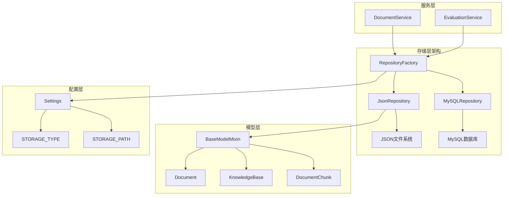
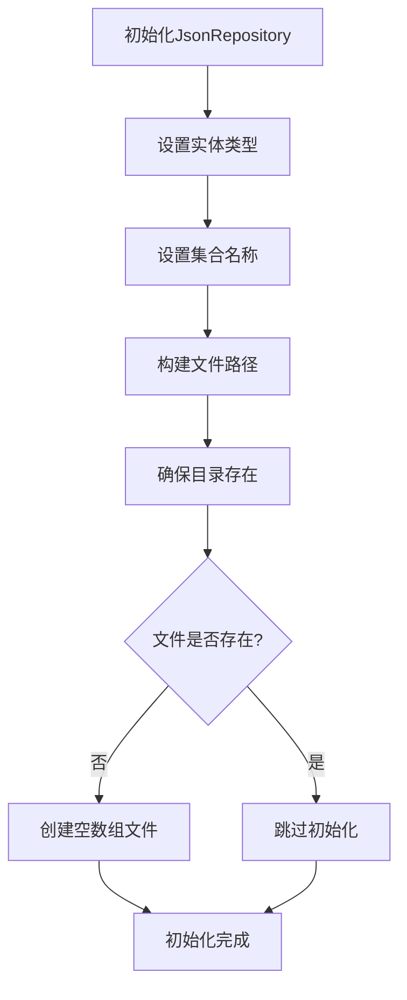
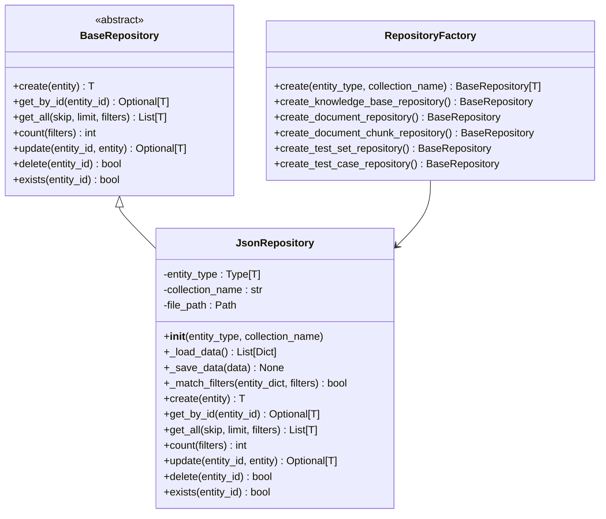
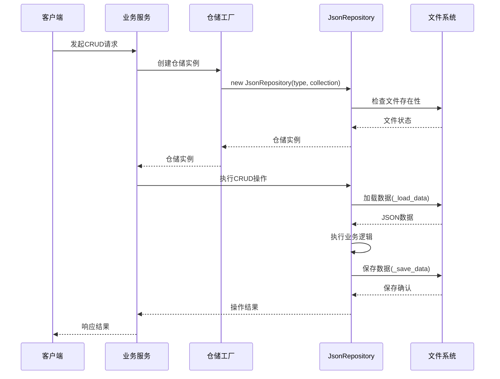
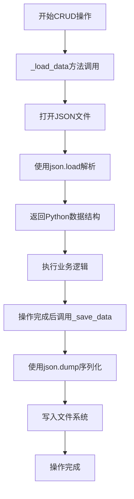
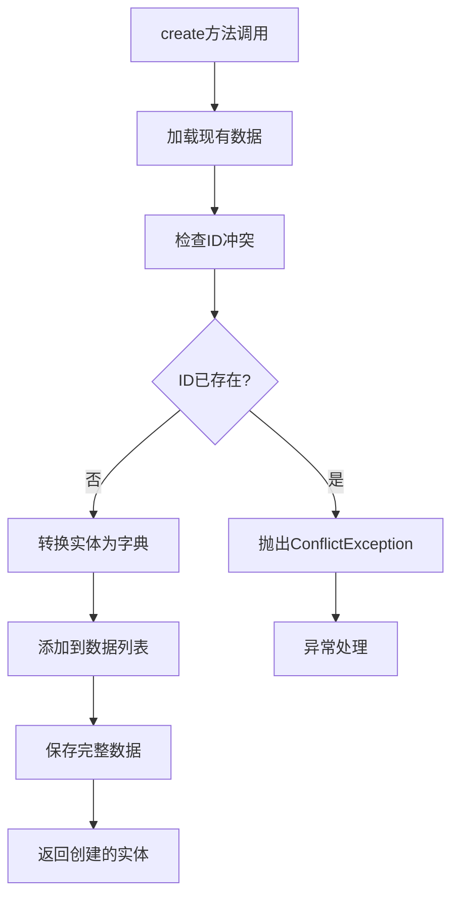
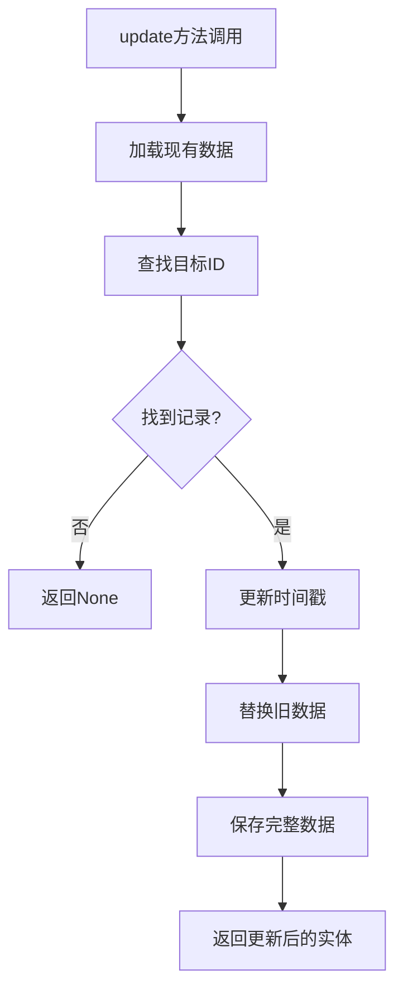
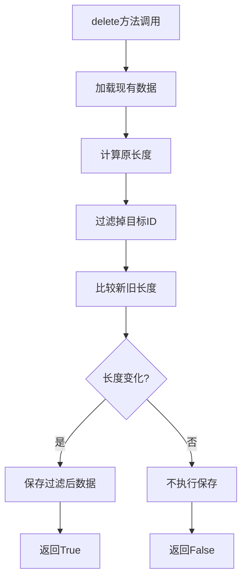
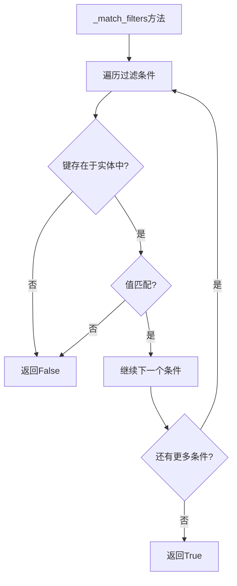
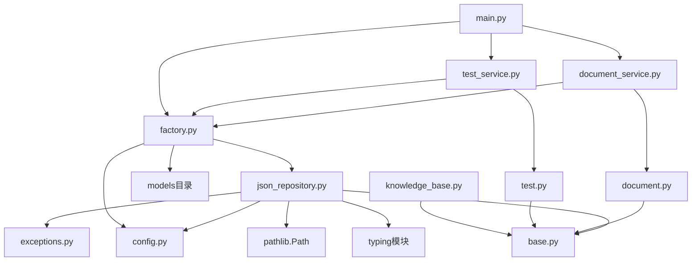

# JSON文件存储

<cite>
**本文档引用的文件**
- [json_repository.py](file://backend/app/repositories/json_repository.py)
- [base.py](file://backend/app/repositories/base.py)
- [factory.py](file://backend/app/repositories/factory.py)
- [config.py](file://backend/app/config.py)
- [base.py](file://backend/app/models/base.py)
- [document.py](file://backend/app/models/document.py)
- [document.py](file://backend/app/services/document.py)
- [README.md](file://backend/README.md)
</cite>

## 目录
1. [简介](#简介)
2. [项目结构](#项目结构)
3. [核心组件](#核心组件)
4. [架构概览](#架构概览)
5. [详细组件分析](#详细组件分析)
6. [依赖关系分析](#依赖关系分析)
7. [性能考虑](#性能考虑)
8. [故障排除指南](#故障排除指南)
9. [结论](#结论)

## 简介

JSON文件存储是RAG Studio后端系统中的轻量级数据持久化解决方案，专为本地开发和链路排查场景设计。该存储系统通过文件系统实现数据的持久化，提供了简单易用的CRUD操作接口，同时保持了数据的可读性和可维护性。

### 主要特性

- **轻量级设计**: 基于文件系统的简单存储方案
- **数据可读性**: JSON格式确保数据易于人工阅读和调试
- **零依赖**: 无需外部数据库系统，降低部署复杂度
- **开发友好**: 适合本地开发和快速原型验证
- **灵活配置**: 支持JSON和MySQL两种存储类型的动态切换

## 项目结构



**图表来源**
- [factory.py](file://backend/app/repositories/factory.py#L17-L48)
- [json_repository.py](file://backend/app/repositories/json_repository.py#L16-L39)
- [config.py](file://backend/app/config.py#L42-L43)

**章节来源**
- [factory.py](file://backend/app/repositories/factory.py#L1-L116)
- [json_repository.py](file://backend/app/repositories/json_repository.py#L1-L162)

## 核心组件

### JsonRepository类

JsonRepository是JSON文件存储的核心实现类，继承自BaseRepository抽象基类，提供了完整的CRUD操作接口。

#### 关键属性

| 属性名 | 类型 | 描述 |
|--------|------|------|
| entity_type | Type[T] | 实体类型，用于类型安全的泛型操作 |
| collection_name | str | 集合名称，对应JSON文件名 |
| file_path | Path | 完整的文件路径，包含存储目录和文件名 |
| settings.STORAGE_PATH | str | 存储根目录路径，默认为项目根目录下的storage文件夹 |

#### 初始化流程



**图表来源**
- [json_repository.py](file://backend/app/repositories/json_repository.py#L22-L39)

**章节来源**
- [json_repository.py](file://backend/app/repositories/json_repository.py#L16-L39)

## 架构概览

### 存储抽象层架构



**图表来源**
- [base.py](file://backend/app/repositories/base.py#L14-L118)
- [json_repository.py](file://backend/app/repositories/json_repository.py#L16-L161)
- [factory.py](file://backend/app/repositories/factory.py#L17-L115)

### 数据流架构



**图表来源**
- [factory.py](file://backend/app/repositories/factory.py#L23-L48)
- [json_repository.py](file://backend/app/repositories/json_repository.py#L70-L161)

**章节来源**
- [base.py](file://backend/app/repositories/base.py#L1-L119)
- [json_repository.py](file://backend/app/repositories/json_repository.py#L1-L162)
- [factory.py](file://backend/app/repositories/factory.py#L1-L116)

## 详细组件分析

### 序列化与反序列化机制

#### 数据加载机制

JsonRepository采用内存加载模式，在每次CRUD操作前都会将整个JSON文件加载到内存中进行处理：



**图表来源**
- [json_repository.py](file://backend/app/repositories/json_repository.py#L41-L61)

#### 数据保存机制

保存操作采用全量写回策略，确保数据的一致性：

| 特性 | 实现方式 | 优势 | 局限性 |
|------|----------|------|--------|
| 序列化格式 | JSON | 可读性强，跨平台兼容 | 大文件性能较差 |
| 编码方式 | UTF-8 | 支持多语言字符 | 需要显式编码声明 |
| 格式化输出 | indent=2 | 人类可读，便于调试 | 增加文件大小 |
| 默认处理 | default=str | 处理非标准类型 | 可能丢失精度 |

**章节来源**
- [json_repository.py](file://backend/app/repositories/json_repository.py#L41-L61)

### CRUD操作实现详解

#### 创建操作（Create）

创建操作实现了严格的ID唯一性检查和原子性保证：



**图表来源**
- [json_repository.py](file://backend/app/repositories/json_repository.py#L70-L87)

#### 查询操作（Read）

查询操作支持多种查询模式：

| 查询类型 | 实现方式 | 性能特点 | 使用场景 |
|----------|----------|----------|----------|
| 按ID查询 | 线性搜索 | O(n) | 单条记录查询 |
| 条件过滤 | 列表推导式 | O(n) | 复杂条件查询 |
| 分页查询 | 切片操作 | O(1) | 大数据集浏览 |
| 数量统计 | 过滤后计数 | O(n) | 数据统计 |

#### 更新操作（Update）

更新操作采用就地修改策略：



**图表来源**
- [json_repository.py](file://backend/app/repositories/json_repository.py#L127-L140)

#### 删除操作（Delete）

删除操作采用过滤策略：



**图表来源**
- [json_repository.py](file://backend/app/repositories/json_repository.py#L144-L155)

**章节来源**
- [json_repository.py](file://backend/app/repositories/json_repository.py#L70-L161)

### 过滤器系统

JsonRepository实现了简单的键值过滤器系统：



**图表来源**
- [json_repository.py](file://backend/app/repositories/json_repository.py#L63-L68)

**章节来源**
- [json_repository.py](file://backend/app/repositories/json_repository.py#L63-L68)

## 依赖关系分析

### 模块依赖图



**图表来源**
- [json_repository.py](file://backend/app/repositories/json_repository.py#L1-L15)
- [factory.py](file://backend/app/repositories/factory.py#L1-L15)

### 配置依赖

JsonRepository的配置完全依赖于settings模块：

| 配置项 | 类型 | 默认值 | 用途 |
|--------|------|--------|------|
| STORAGE_TYPE | str | "json" | 存储类型选择 |
| STORAGE_PATH | str | "./storage" | 存储文件根目录 |

**章节来源**
- [json_repository.py](file://backend/app/repositories/json_repository.py#L1-L15)
- [config.py](file://backend/app/config.py#L42-L43)

## 性能考虑

### 优势分析

#### 开发与调试优势

1. **数据可读性强**
   - JSON格式天然可读，便于人工检查和调试
   - 结构化数据便于理解和分析
   - 支持直接编辑和修改

2. **部署简单**
   - 无需安装和配置数据库系统
   - 单文件即可备份和迁移
   - 适合开发环境和小规模应用

3. **快速验证**
   - 立即可见数据变化
   - 无需复杂的数据库连接配置
   - 适合快速原型开发

#### 使用场景优势

- **本地开发**: 开发阶段的理想选择
- **链路排查**: 便于跟踪数据流转过程
- **小规模应用**: 用户量较小的应用场景
- **原型验证**: 快速验证业务逻辑

### 局限性分析

#### 性能瓶颈

1. **内存占用**
   - 整个数据集加载到内存
   - 大数据量时内存压力大
   - 可能导致内存溢出

2. **I/O性能**
   - 每次操作都需要文件读写
   - 大文件读写耗时较长
   - 并发访问性能差

3. **并发控制**
   - 缺乏内置的并发控制机制
   - 多进程同时写入可能导致数据损坏
   - 无事务支持

#### 扩展性限制

| 限制方面 | 具体表现 | 影响程度 |
|----------|----------|----------|
| 数据量 | 受单文件大小限制 | 中等 |
| 并发性 | 无锁机制，易产生竞争 | 高 |
| 事务性 | 不支持事务操作 | 高 |
| 索引 | 无内置索引机制 | 高 |

### 最佳实践建议

#### 开发阶段使用

```python
# 推荐配置
STORAGE_TYPE = "json"
STORAGE_PATH = "./storage"  # 开发环境
DEBUG = True
```

#### 生产环境考虑

```python
# 生产环境建议
STORAGE_TYPE = "mysql"  # 或其他高性能存储
STORAGE_PATH = "/var/lib/ragstudio/storage"  # 生产环境路径
```

#### 性能优化建议

1. **定期清理**: 清理不再需要的历史数据
2. **数据压缩**: 对大文件进行压缩存储
3. **缓存策略**: 在应用层实现适当的缓存
4. **异步处理**: 对批量操作使用异步处理

## 故障排除指南

### 常见问题及解决方案

#### 文件权限问题

**症状**: 无法创建或写入JSON文件
**原因**: 目录或文件权限不足
**解决方案**: 
- 确保STORAGE_PATH目录存在且可写
- 检查文件系统权限设置
- 使用适当的用户权限运行服务

#### 数据损坏问题

**症状**: JSON文件格式错误，无法解析
**原因**: 异常中断导致文件写入不完整
**解决方案**:
- 实现文件完整性检查
- 使用原子写入操作
- 定期备份重要数据

#### 内存泄漏问题

**症状**: 随着时间推移内存使用持续增长
**原因**: 大量数据未及时释放
**解决方案**:
- 实现数据分页加载
- 定期清理内存缓存
- 监控内存使用情况

**章节来源**
- [json_repository.py](file://backend/app/repositories/json_repository.py#L41-L61)
- [config.py](file://backend/app/config.py#L42-L43)

## 结论

JSON文件存储作为RAG Studio后端系统的重要组成部分，为开发者提供了简单而有效的数据持久化解决方案。其轻量级设计和易用性使其成为本地开发和链路排查的理想选择。

### 核心价值

1. **开发效率**: 极简的部署和配置降低了开发门槛
2. **调试便利**: 可读的数据格式便于问题定位和分析
3. **学习友好**: 清晰的代码结构有助于理解系统架构
4. **灵活性**: 支持多种存储类型的动态切换

### 适用场景

- **本地开发环境**: 快速原型开发和功能验证
- **小规模应用**: 用户量较少的业务场景
- **教学演示**: 技术培训和概念验证
- **链路排查**: 系统调试和问题诊断

### 发展方向

随着系统复杂度的增加，建议逐步从JSON存储迁移到更专业的数据库解决方案，同时保留JSON存储作为开发和测试环境的补充方案。