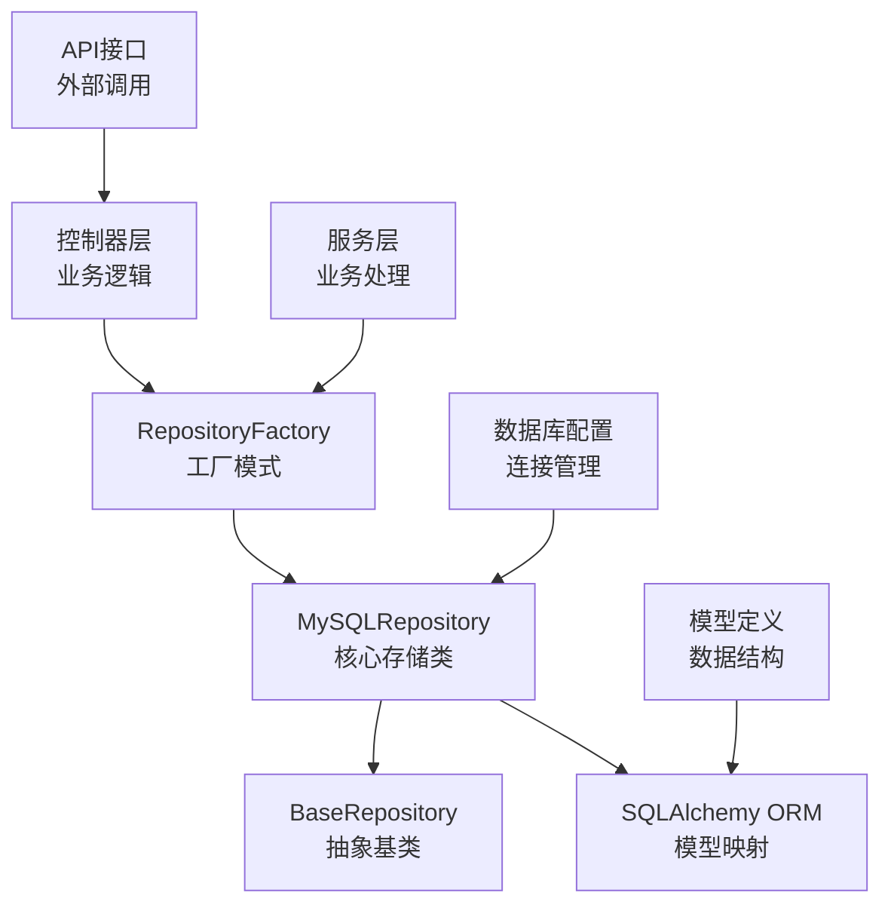
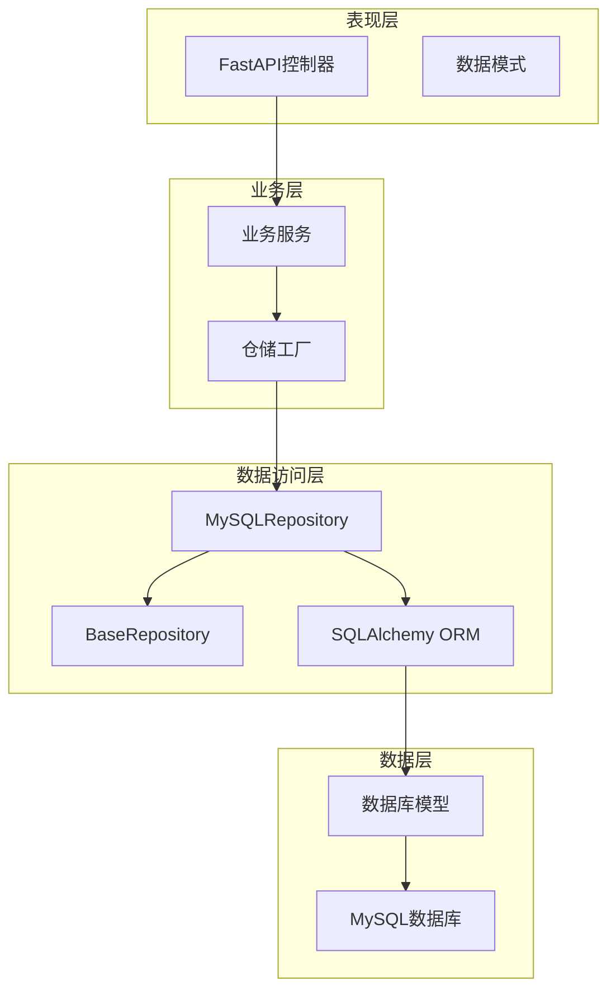
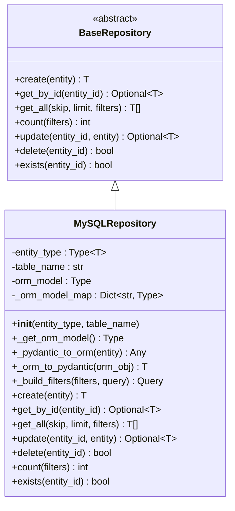
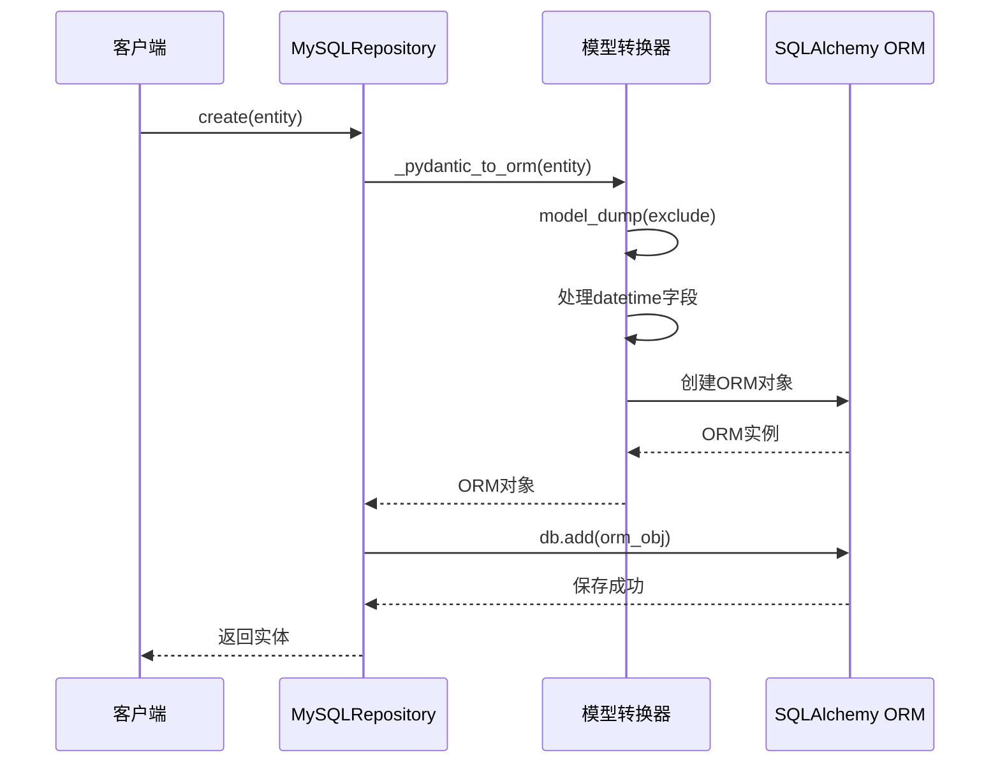
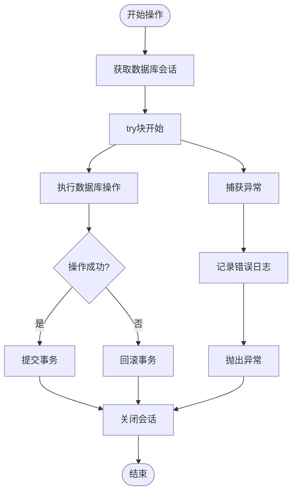
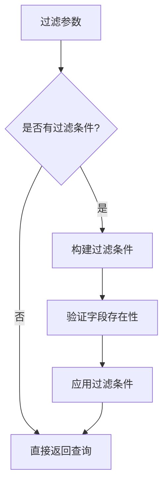
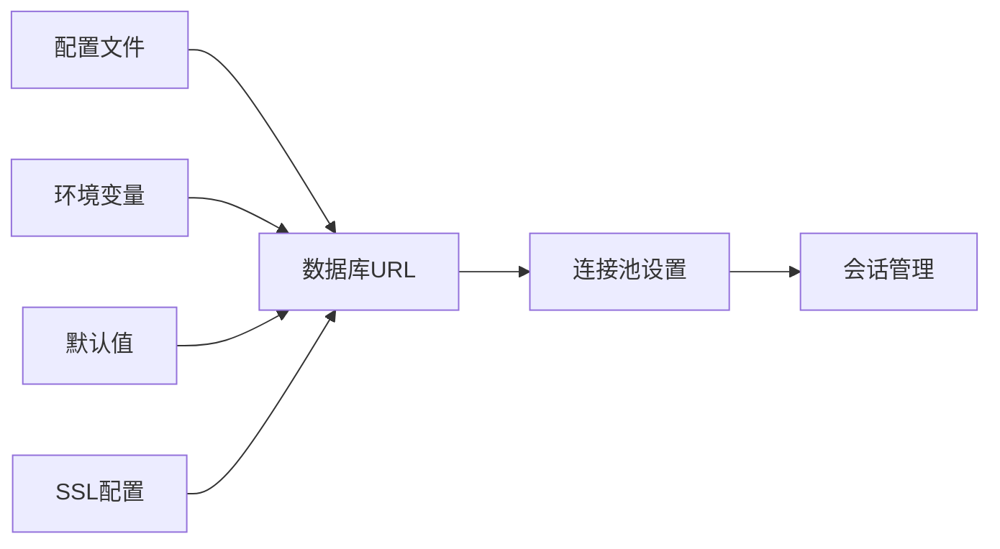
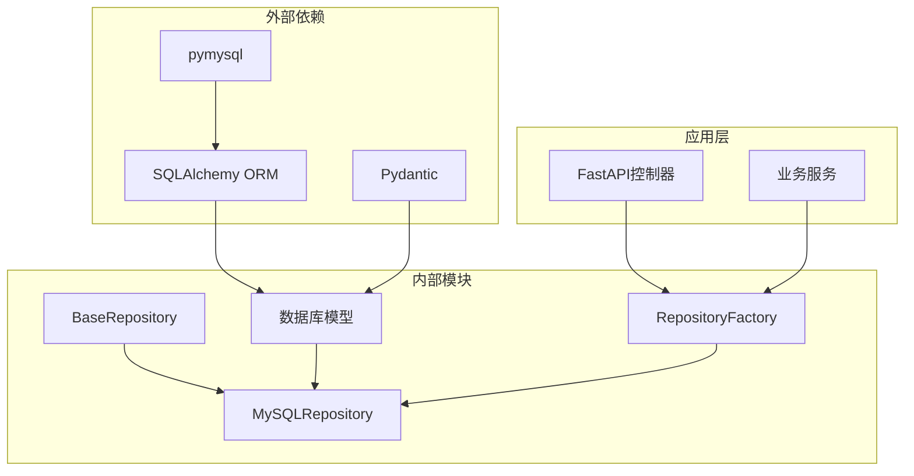

# MySQL存储

<cite>
**本文档中引用的文件**
- [mysql_repository.py](file://backend/app/repositories/mysql_repository.py)
- [base.py](file://backend/app/repositories/base.py)
- [models.py](file://backend/app/database/models.py)
- [factory.py](file://backend/app/repositories/factory.py)
- [__init__.py](file://backend/app/database/__init__.py)
- [base.py](file://backend/app/models/base.py)
- [config.py](file://backend/app/config.py)
- [test_management.py](file://backend/app/controllers/test_management.py)
- [evaluation.py](file://backend/app/controllers/evaluation.py)
</cite>

## 目录
1. [简介](#简介)
2. [项目结构](#项目结构)
3. [核心组件](#核心组件)
4. [架构概览](#架构概览)
5. [详细组件分析](#详细组件分析)
6. [依赖关系分析](#依赖关系分析)
7. [性能考虑](#性能考虑)
8. [故障排除指南](#故障排除指南)
9. [结论](#结论)

## 简介

MySQL存储是RAG Studio项目中用于生产环境数据持久化的核心组件，基于SQLAlchemy ORM框架实现。该存储方案提供了可靠的数据库操作能力，支持复杂的CRUD操作、事务管理和高性能的数据访问。

MySQL存储相比JSON存储具有显著优势：
- **性能提升**：原生SQL查询优化，支持索引和复杂查询
- **可靠性增强**：完善的事务控制和数据一致性保障
- **扩展性改进**：支持高并发访问和大规模数据处理
- **成熟机制**：具备完善的备份恢复和监控体系

## 项目结构

MySQL存储模块采用分层架构设计，主要包含以下核心文件：

**图表来源**
- [mysql_repository.py](file://backend/app/repositories/mysql_repository.py#L19-L308)
- [base.py](file://backend/app/repositories/base.py#L14-L119)
- [factory.py](file://backend/app/repositories/factory.py#L17-L116)

**章节来源**
- [mysql_repository.py](file://backend/app/repositories/mysql_repository.py#L1-L308)
- [base.py](file://backend/app/repositories/base.py#L1-L119)
- [factory.py](file://backend/app/repositories/factory.py#L1-L116)

## 核心组件

### MySQLRepository类

MySQLRepository是基于SQLAlchemy ORM的MySQL存储实现，继承自BaseRepository抽象类，提供完整的CRUD操作功能。

#### 主要特性

1. **泛型设计**：支持任意类型的实体模型
2. **ORM映射**：自动建立Pydantic模型与SQLAlchemy模型的转换
3. **异步操作**：所有数据库操作都通过线程池实现异步化
4. **事务管理**：内置完整的事务控制机制
5. **异常处理**：统一的异常处理和错误响应

#### 核心方法

- `create()`：创建新实体
- `get_by_id()`：按ID查询实体
- `get_all()`：查询实体列表（支持分页和过滤）
- `update()`：更新实体
- `delete()`：删除实体
- `count()`：统计实体数量
- `exists()`：检查实体存在性

**章节来源**
- [mysql_repository.py](file://backend/app/repositories/mysql_repository.py#L19-L308)

## 架构概览

MySQL存储采用多层架构设计，确保了良好的可维护性和扩展性：

**图表来源**
- [mysql_repository.py](file://backend/app/repositories/mysql_repository.py#L19-L308)
- [factory.py](file://backend/app/repositories/factory.py#L17-L116)
- [base.py](file://backend/app/repositories/base.py#L14-L119)

## 详细组件分析

### 1. 基础仓储抽象层

BaseRepository定义了统一的数据访问接口，确保不同存储实现的一致性。

**图表来源**
- [base.py](file://backend/app/repositories/base.py#L14-L119)
- [mysql_repository.py](file://backend/app/repositories/mysql_repository.py#L19-L308)

### 2. ORM模型映射机制

MySQLRepository通过动态模型映射实现Pydantic模型与SQLAlchemy模型的双向转换。

#### Pydantic到ORM转换

**图表来源**
- [mysql_repository.py](file://backend/app/repositories/mysql_repository.py#L61-L76)

#### ORM到Pydantic转换

模型转换过程确保数据类型正确性和时间戳格式化：

- **字段映射**：自动映射ORM模型的所有字段
- **类型转换**：处理datetime对象的序列化
- **空值处理**：正确处理NULL值
- **格式标准化**：统一返回ISO格式的时间字符串

**章节来源**
- [mysql_repository.py](file://backend/app/repositories/mysql_repository.py#L61-L95)

### 3. 会话管理和事务控制

MySQLRepository实现了完整的会话管理和事务控制机制：

**图表来源**
- [mysql_repository.py](file://backend/app/repositories/mysql_repository.py#L112-L145)
- [mysql_repository.py](file://backend/app/repositories/mysql_repository.py#L147-L166)

#### 异常处理策略

1. **冲突检测**：检查主键冲突并抛出ConflictException
2. **通用错误**：捕获所有异常并转换为InternalServerException
3. **日志记录**：详细记录错误信息便于调试
4. **资源清理**：确保会话正确关闭

**章节来源**
- [mysql_repository.py](file://backend/app/repositories/mysql_repository.py#L112-L145)

### 4. 查询构建和过滤机制

MySQLRepository提供了强大的查询构建和过滤功能：

#### 过滤条件构建

**图表来源**
- [mysql_repository.py](file://backend/app/repositories/mysql_repository.py#L97-L110)

#### 支持的过滤类型

- **相等匹配**：`{"field": "value"}`
- **字段验证**：确保字段存在于ORM模型中
- **条件组合**：使用AND逻辑组合多个条件
- **动态构建**：运行时动态构建查询条件

**章节来源**
- [mysql_repository.py](file://backend/app/repositories/mysql_repository.py#L97-L110)

### 5. CRUD操作详解

#### 创建操作（Create）

创建操作包含完整的验证和事务控制：

1. **ID冲突检查**：防止重复创建相同ID的实体
2. **模型转换**：将Pydantic实体转换为ORM对象
3. **事务处理**：确保操作的原子性
4. **结果转换**：将ORM对象转换回Pydantic格式

#### 查询操作（Read）

支持多种查询模式：

- **单条查询**：`get_by_id()`按ID查询
- **批量查询**：`get_all()`支持分页和过滤
- **统计查询**：`count()`统计符合条件的实体数量
- **存在性检查**：`exists()`快速检查实体是否存在

#### 更新操作（Update）

更新操作采用增量更新策略：

1. **实体查找**：定位要更新的实体
2. **字段更新**：只更新指定的字段
3. **时间戳更新**：自动更新updated_at字段
4. **事务保证**：确保更新的完整性

#### 删除操作（Delete）

删除操作支持级联删除和软删除：

1. **实体验证**：确认实体存在
2. **删除执行**：执行删除操作
3. **结果反馈**：返回删除成功状态
4. **异常处理**：处理删除过程中的异常

**章节来源**
- [mysql_repository.py](file://backend/app/repositories/mysql_repository.py#L112-L286)

### 6. 数据库连接配置

MySQL存储使用SQLAlchemy进行数据库连接管理：

#### 连接配置

**图表来源**
- [config.py](file://backend/app/config.py#L83-L86)
- [__init__.py](file://backend/app/database/__init__.py#L18-L24)

#### 连接池配置

- **pool_pre_ping**：启用连接健康检查
- **pool_recycle**：设置连接回收时间（3600秒）
- **echo**：调试模式下显示SQL语句

**章节来源**
- [config.py](file://backend/app/config.py#L35-L40)
- [__init__.py](file://backend/app/database/__init__.py#L18-L24)

### 7. 实体模型映射

MySQL存储支持多种实体类型的映射：

#### 支持的实体类型

| 表名 | ORM模型 | 实体类型 | 描述 |
|------|---------|----------|------|
| test_sets | TestSetORM | TestSet | 测试集管理 |
| test_cases | TestCaseORM | TestCase | 测试用例管理 |
| evaluation_tasks | EvaluationTaskORM | EvaluationTask | 评估任务管理 |
| evaluation_case_results | EvaluationCaseResultORM | EvaluationCaseResult | 评估结果管理 |
| evaluation_summaries | EvaluationSummaryORM | EvaluationSummary | 评估汇总管理 |

#### 模型字段映射

每个ORM模型都包含标准字段：
- **id**：主键，字符串类型
- **created_at**：创建时间，默认当前时间
- **updated_at**：更新时间，默认当前时间
- **JSON字段**：支持复杂配置数据存储

**章节来源**
- [models.py](file://backend/app/database/models.py#L23-L128)
- [mysql_repository.py](file://backend/app/repositories/mysql_repository.py#L40-L60)

## 依赖关系分析

MySQL存储模块的依赖关系体现了清晰的分层架构：

**图表来源**
- [mysql_repository.py](file://backend/app/repositories/mysql_repository.py#L1-L16)
- [factory.py](file://backend/app/repositories/factory.py#L1-L16)

### 核心依赖

1. **SQLAlchemy**：提供ORM功能和数据库连接
2. **Pydantic**：数据验证和序列化
3. **pymysql**：MySQL数据库驱动
4. **asyncio**：异步操作支持

### 模块间关系

- **继承关系**：MySQLRepository继承BaseRepository
- **组合关系**：通过工厂模式创建实例
- **依赖注入**：控制器和服务层依赖仓储实例

**章节来源**
- [mysql_repository.py](file://backend/app/repositories/mysql_repository.py#L1-L16)
- [factory.py](file://backend/app/repositories/factory.py#L1-L16)

## 性能考虑

### 异步操作优化

MySQL存储通过线程池实现异步操作，避免阻塞主线程：

- **线程池**：使用`asyncio.to_thread()`执行同步数据库操作
- **连接复用**：通过连接池复用数据库连接
- **批量操作**：支持批量插入和查询优化

### 查询性能优化

1. **索引利用**：合理使用数据库索引
2. **查询优化**：避免N+1查询问题
3. **分页处理**：支持大结果集的分页查询
4. **缓存策略**：结合应用层缓存机制

### 并发控制

- **连接池**：限制最大连接数
- **事务隔离**：支持不同的事务隔离级别
- **死锁检测**：自动检测和处理死锁

## 故障排除指南

### 常见问题及解决方案

#### 1. 连接问题

**症状**：无法连接到MySQL数据库
**原因**：
- 数据库服务未启动
- 网络连接问题
- 认证信息错误

**解决方案**：
- 检查数据库服务状态
- 验证网络连接
- 确认用户名密码正确

#### 2. 模型映射错误

**症状**：Pydantic模型与ORM模型字段不匹配
**原因**：
- 字段类型不兼容
- 字段名称不一致
- 时间戳格式问题

**解决方案**：
- 检查字段映射关系
- 验证数据类型兼容性
- 处理时间戳转换

#### 3. 事务失败

**症状**：数据库操作失败但没有正确回滚
**原因**：
- 异常处理不当
- 连接泄漏
- 死锁问题

**解决方案**：
- 确保异常被捕获和处理
- 使用上下文管理器管理连接
- 实施超时和重试机制

**章节来源**
- [mysql_repository.py](file://backend/app/repositories/mysql_repository.py#L112-L145)
- [mysql_repository.py](file://backend/app/repositories/mysql_repository.py#L147-L166)

## 结论

MySQL存储作为RAG Studio项目的核心数据持久化方案，具有以下优势：

### 技术优势

1. **可靠性**：基于成熟的SQLAlchemy ORM框架
2. **性能**：支持原生SQL查询和索引优化
3. **可扩展**：支持高并发和大规模数据处理
4. **维护性**：清晰的分层架构和统一接口

### 生产环境适用性

- **事务支持**：完整的ACID特性保障
- **备份恢复**：成熟的数据库备份机制
- **监控告警**：完善的性能监控体系
- **安全防护**：数据加密和访问控制

### 与JSON存储的对比

| 特性 | MySQL存储 | JSON存储 |
|------|-----------|----------|
| 性能 | 高（原生SQL） | 中等（文件I/O） |
| 可靠性 | 高（事务支持） | 中等（文件完整性） |
| 扩展性 | 高（分布式支持） | 中等（文件系统限制） |
| 开发效率 | 中等（需要迁移） | 高（无需迁移） |
| 生产就绪 | 高 | 中等 |

MySQL存储特别适合生产环境，能够满足企业级应用对数据可靠性、性能和可扩展性的严格要求。通过合理的架构设计和配置优化，可以充分发挥MySQL数据库的优势，为RAG Studio提供稳定可靠的数据持久化服务。