# RAG-Studio存储实现对比与详解

<cite>
**本文档引用的文件**
- [json_repository.py](file://backend/app/repositories/json_repository.py)
- [mysql_repository.py](file://backend/app/repositories/mysql_repository.py)
- [base.py](file://backend/app/repositories/base.py)
- [factory.py](file://backend/app/repositories/factory.py)
- [config.py](file://backend/app/config.py)
- [models.py](file://backend/app/database/models.py)
- [base.py](file://backend/app/models/base.py)
- [test.py](file://backend/app/models/test.py)
- [evaluation.py](file://backend/app/models/evaluation.py)
</cite>

## 目录
1. [概述](#概述)
2. [架构设计](#架构设计)
3. [JSON存储实现](#json存储实现)
4. [MySQL存储实现](#mysql存储实现)
5. [存储后端对比分析](#存储后端对比分析)
6. [工厂模式与配置管理](#工厂模式与配置管理)
7. [性能特征与适用场景](#性能特征与适用场景)
8. [选择指南](#选择指南)
9. [故障排除与最佳实践](#故障排除与最佳实践)
10. [总结](#总结)

## 概述

RAG-Studio采用了双存储后端架构，提供了灵活的存储解决方案以适应不同的开发和生产环境需求。系统支持两种主要的存储实现：

- **JSON存储后端**：基于文件系统的轻量级存储，适用于开发调试和小规模数据
- **MySQL存储后端**：基于SQLAlchemy ORM的关系型数据库存储，适用于生产环境和大规模数据

这种设计使得开发者可以在不同阶段选择最适合的存储方案，同时保持代码的一致性和可维护性。

## 架构设计

### 存储层架构图

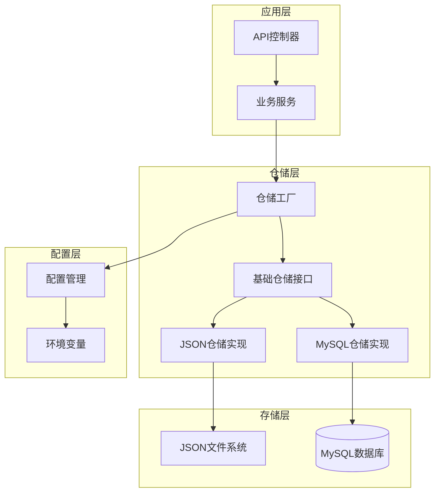

**图表来源**
- [factory.py](file://backend/app/repositories/factory.py#L17-L48)
- [base.py](file://backend/app/repositories/base.py#L14-L119)

### 抽象接口设计

系统通过抽象基类定义了统一的仓储接口，确保两种存储实现的一致性：

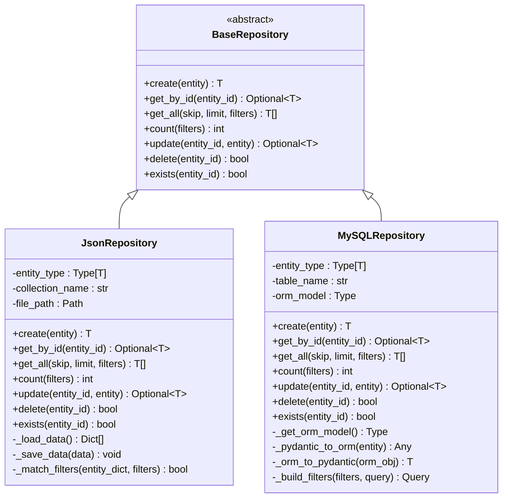

**图表来源**
- [base.py](file://backend/app/repositories/base.py#L14-L119)
- [json_repository.py](file://backend/app/repositories/json_repository.py#L16-L162)
- [mysql_repository.py](file://backend/app/repositories/mysql_repository.py#L19-L308)

**章节来源**
- [base.py](file://backend/app/repositories/base.py#L1-L119)
- [factory.py](file://backend/app/repositories/factory.py#L1-L116)

## JSON存储实现

### 初始化流程

JSON存储后端采用简单直接的初始化方式，每个实体类型对应一个独立的JSON文件：

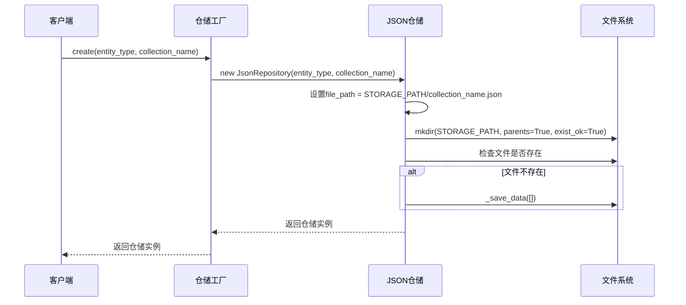

**图表来源**
- [json_repository.py](file://backend/app/repositories/json_repository.py#L22-L40)

### 数据序列化与反序列化

JSON存储实现了完整的数据序列化机制：

| 特性 | 实现方式 | 优势 | 限制 |
|------|----------|------|------|
| **序列化** | `entity.model_dump()` → JSON | 支持复杂嵌套结构 | 不支持二进制数据 |
| **反序列化** | JSON → `entity_type(**data)` | 类型安全 | 需要类型转换 |
| **时间处理** | ISO格式字符串 | 标准化存储 | 需要额外解析 |
| **编码支持** | UTF-8编码 | 支持多语言字符 | 文件大小可能较大 |

### CRUD操作实现差异

#### 创建操作
JSON存储通过追加方式添加新实体，无需复杂的事务处理：

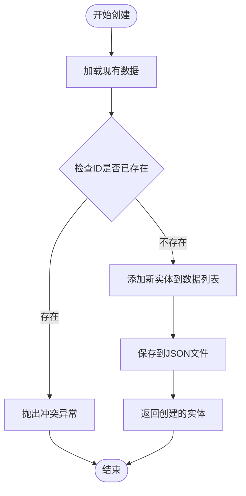

**图表来源**
- [json_repository.py](file://backend/app/repositories/json_repository.py#L70-L87)

#### 查询操作
JSON存储的查询功能相对简单但功能完整：

| 操作类型 | 实现方式 | 性能特征 | 适用场景 |
|----------|----------|----------|----------|
| **按ID查询** | 线性搜索 | O(n) | 小数据集 |
| **全量查询** | 加载整个文件 | O(1) | 内存充足 |
| **过滤查询** | 列表推导式 | O(n×m) | 简单过滤条件 |
| **分页** | 切片操作 | O(k) | 小批量数据 |

#### 更新与删除操作
JSON存储通过重新写入整个文件来保证数据一致性：

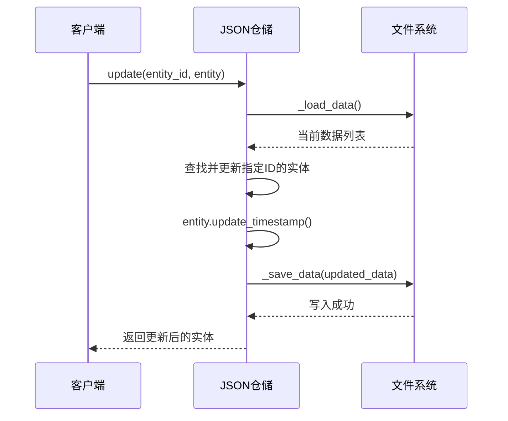

**图表来源**
- [json_repository.py](file://backend/app/repositories/json_repository.py#L127-L142)

**章节来源**
- [json_repository.py](file://backend/app/repositories/json_repository.py#L1-L162)

## MySQL存储实现

### 初始化流程

MySQL存储后端通过ORM映射建立与数据库的连接：

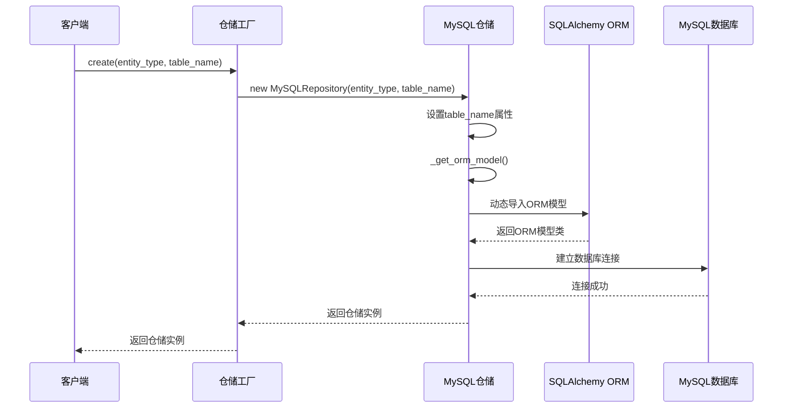

**图表来源**
- [mysql_repository.py](file://backend/app/repositories/mysql_repository.py#L28-L59)

### 数据序列化与反序列化

MySQL存储实现了复杂的ORM转换机制：

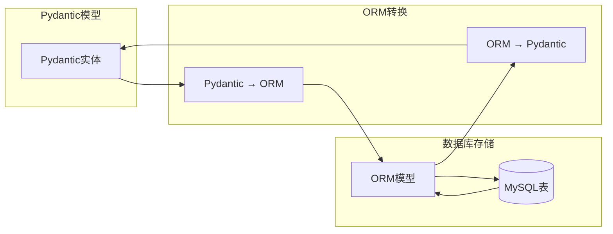

**图表来源**
- [mysql_repository.py](file://backend/app/repositories/mysql_repository.py#L61-L95)

### ORM模型映射

系统支持多种实体类型的ORM映射：

| 实体类型 | 表名 | ORM模型 | 主要用途 |
|----------|------|---------|----------|
| **测试集** | `test_sets` | `TestSetORM` | 测试配置管理 |
| **测试用例** | `test_cases` | `TestCaseORM` | 单个测试用例 |
| **评估任务** | `evaluation_tasks` | `EvaluationTaskORM` | 评估任务调度 |
| **评估结果** | `evaluation_case_results` | `EvaluationCaseResultORM` | 评估结果记录 |
| **评估汇总** | `evaluation_summaries` | `EvaluationSummaryORM` | 总体评估报告 |

### CRUD操作实现差异

#### 并发控制与事务管理
MySQL存储提供了完整的事务支持和并发控制：

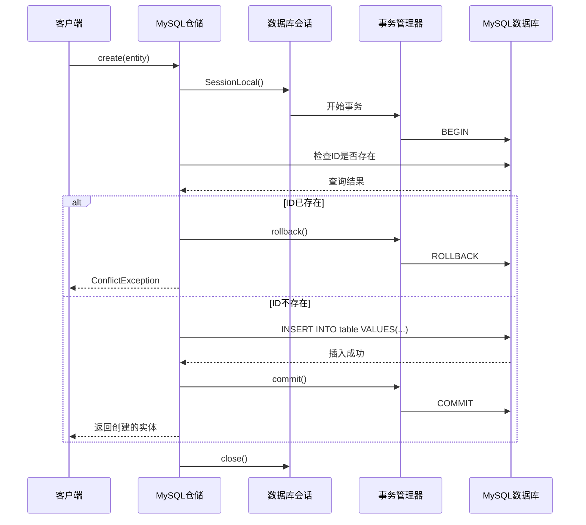

**图表来源**
- [mysql_repository.py](file://backend/app/repositories/mysql_repository.py#L112-L144)

#### 过滤与分页实现
MySQL存储利用SQL原生能力实现高效的过滤和分页：

| 操作类型 | 实现方式 | 性能特征 | 优势 |
|----------|----------|----------|------|
| **过滤** | `WHERE`子句 | O(log n) | 数据库索引支持 |
| **排序** | `ORDER BY`子句 | O(log n) | 数据库优化 |
| **分页** | `LIMIT OFFSET` | O(k) | 内存高效 |
| **统计** | `COUNT()`聚合 | O(log n) | 索引加速 |

**章节来源**
- [mysql_repository.py](file://backend/app/repositories/mysql_repository.py#L1-L308)
- [models.py](file://backend/app/database/models.py#L1-L128)

## 存储后端对比分析

### 功能特性对比

| 特性 | JSON存储 | MySQL存储 | 说明 |
|------|----------|-----------|------|
| **初始化速度** | 快速启动 | 需要数据库连接 | JSON无需网络连接 |
| **数据一致性** | 文件锁机制 | ACID事务 | MySQL更强的一致性保证 |
| **并发性能** | 串行访问 | 并发事务支持 | MySQL支持多用户 |
| **数据完整性** | 手动验证 | 数据库约束 | MySQL内置约束检查 |
| **查询能力** | 简单过滤 | 复杂SQL查询 | MySQL支持复杂查询 |
| **扩展性** | 受文件系统限制 | 可水平扩展 | MySQL支持集群部署 |

### 错误处理策略

#### JSON存储错误处理
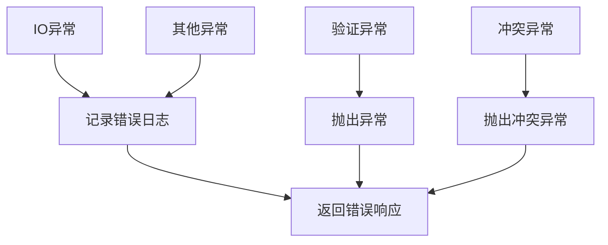

#### MySQL存储错误处理
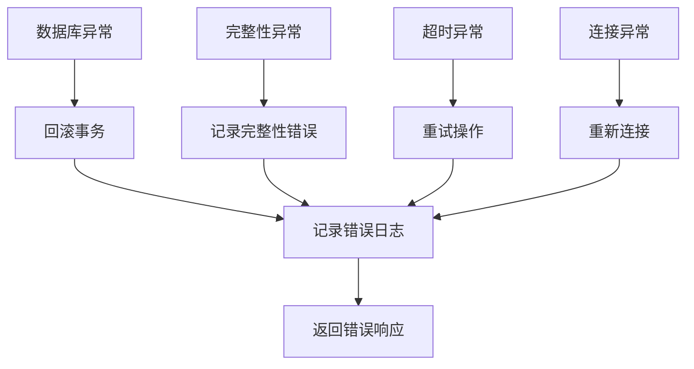

**章节来源**
- [json_repository.py](file://backend/app/repositories/json_repository.py#L44-L61)
- [mysql_repository.py](file://backend/app/repositories/mysql_repository.py#L135-L141)

## 工厂模式与配置管理

### 仓储工厂设计

仓储工厂采用简单而有效的工厂模式，根据配置动态创建合适的存储实例：

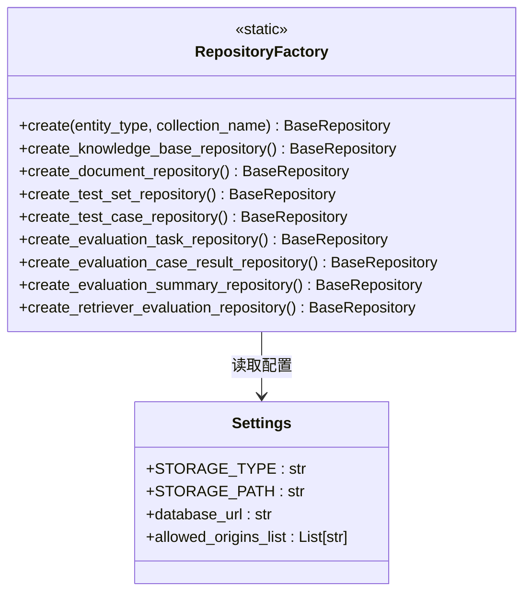

**图表来源**
- [factory.py](file://backend/app/repositories/factory.py#L17-L116)
- [config.py](file://backend/app/config.py#L42-L43)

### 配置驱动的存储选择

系统通过环境变量`STORAGE_TYPE`控制存储后端的选择：

| 配置值 | 存储类型 | 适用场景 | 推荐使用 |
|--------|----------|----------|----------|
| `json` | JSON文件存储 | 开发调试、小规模数据 | 开发环境 |
| `mysql` | MySQL关系数据库 | 生产环境、大规模数据 | 生产环境 |

**章节来源**
- [factory.py](file://backend/app/repositories/factory.py#L23-L48)
- [config.py](file://backend/app/config.py#L42-L43)

## 性能特征与适用场景

### 性能特征对比

#### 小规模数据场景（< 1000条记录）

| 指标 | JSON存储 | MySQL存储 | 结论 |
|------|----------|-----------|------|
| **启动时间** | 几毫秒 | 100-500ms | JSON更快 |
| **内存占用** | 整个文件加载 | 连接池管理 | JSON更高 |
| **查询延迟** | O(n)线性搜索 | O(log n)索引查询 | MySQL更优 |
| **写入延迟** | O(1)追加写入 | O(log n)事务写入 | JSON更快 |
| **文件大小** | 直接存储 | 包含ORM元数据 | JSON更小 |

#### 大规模数据场景（> 10000条记录）

| 指标 | JSON存储 | MySQL存储 | 结论 |
|------|----------|-----------|------|
| **查询性能** | 明显下降 | 保持稳定 | MySQL更优 |
| **并发支持** | 无法支持 | 强并发支持 | MySQL更佳 |
| **数据完整性** | 手动保证 | 数据库约束 | MySQL更可靠 |
| **备份恢复** | 文件复制 | 数据库备份 | MySQL更方便 |
| **扩展性** | 受文件系统限制 | 支持集群扩展 | MySQL更灵活 |

### 适用场景分析

#### JSON存储适用场景

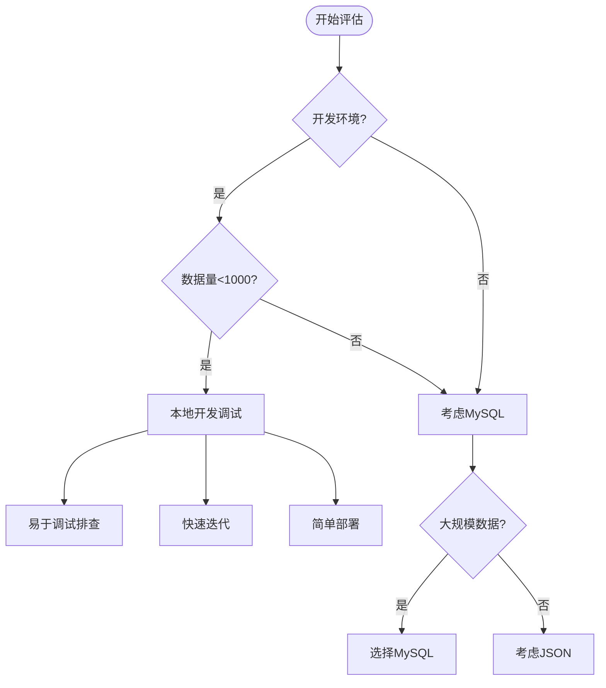

#### MySQL存储适用场景

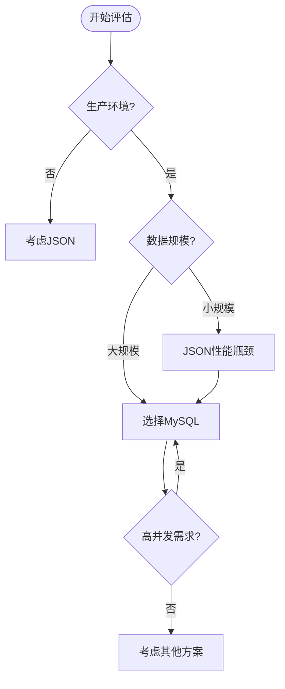

**章节来源**
- [config.py](file://backend/app/config.py#L42-L43)

## 选择指南

### 决策树

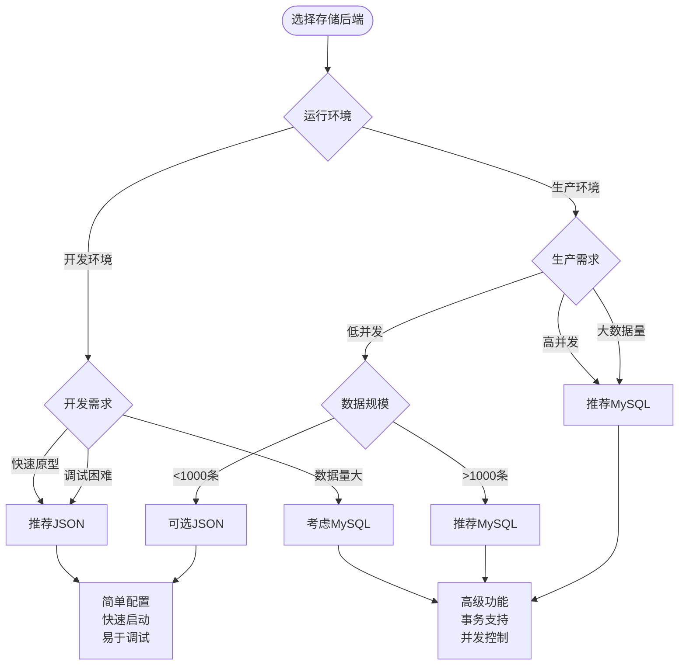

### 具体场景建议

#### 场景1：个人开发者原型开发
**推荐**：JSON存储  
**理由**：
- 零配置部署
- 快速启动和调试
- 易于理解和修改
- 适合学习和实验

#### 场景2：团队协作开发
**推荐**：JSON存储（本地开发）+ MySQL（CI/CD）  
**理由**：
- 本地开发使用JSON提高效率
- CI/CD环境使用MySQL保证一致性

#### 场景3：生产环境部署
**推荐**：MySQL存储  
**理由**：
- 数据一致性保证
- 并发访问支持
- 监控和运维便利
- 扩展性需求

#### 场景4：大数据量处理
**推荐**：MySQL存储  
**理由**：
- 查询性能优异
- 并发处理能力强
- 数据完整性有保障
- 支持分布式部署

## 故障排除与最佳实践

### 常见问题与解决方案

#### JSON存储常见问题

| 问题类型 | 症状 | 解决方案 | 预防措施 |
|----------|------|----------|----------|
| **文件锁定** | 并发写入失败 | 使用文件锁或重试机制 | 控制并发写入 |
| **磁盘空间** | 文件过大 | 定期清理或压缩 | 监控文件大小 |
| **权限问题** | 无法读写文件 | 检查目录权限 | 设置正确权限 |
| **编码问题** | 中文乱码 | 使用UTF-8编码 | 统一编码格式 |

#### MySQL存储常见问题

| 问题类型 | 症状 | 解决方案 | 预防措施 |
|----------|------|----------|----------|
| **连接超时** | 数据库连接失败 | 增加连接超时时间 | 优化连接池配置 |
| **死锁** | 事务执行失败 | 重试机制 | 优化事务顺序 |
| **索引失效** | 查询性能下降 | 添加适当索引 | 定期分析查询 |
| **内存溢出** | 服务器崩溃 | 调整内存配置 | 监控资源使用 |

### 最佳实践建议

#### 开发阶段最佳实践
1. **使用JSON存储**进行快速原型开发
2. **定期备份**重要数据
3. **监控文件大小**避免磁盘空间不足
4. **编写单元测试**验证存储逻辑

#### 生产阶段最佳实践
1. **使用MySQL存储**保证数据可靠性
2. **配置监控告警**及时发现异常
3. **定期维护数据库**优化性能
4. **制定灾难恢复计划**确保数据安全

#### 性能优化建议
1. **合理设置分页参数**避免大量数据加载
2. **使用适当的过滤条件**减少查询范围
3. **定期清理无用数据**保持数据库整洁
4. **监控慢查询**优化数据库性能

**章节来源**
- [json_repository.py](file://backend/app/repositories/json_repository.py#L44-L61)
- [mysql_repository.py](file://backend/app/repositories/mysql_repository.py#L135-L141)

## 总结

RAG-Studio的双存储后端架构体现了现代软件设计的灵活性和实用性。通过精心设计的抽象接口和工厂模式，系统能够在开发和生产环境中无缝切换，同时保持代码的一致性和可维护性。

### 关键优势

1. **灵活性**：支持多种存储后端，适应不同场景需求
2. **一致性**：统一的接口设计确保行为一致性
3. **可扩展性**：易于添加新的存储实现
4. **可维护性**：清晰的职责分离和模块化设计

### 设计亮点

- **抽象接口**：通过`BaseRepository`定义统一的CRUD操作规范
- **工厂模式**：`RepositoryFactory`根据配置动态创建存储实例
- **配置驱动**：通过环境变量控制存储后端选择
- **类型安全**：泛型支持确保编译时类型检查

### 未来发展方向

1. **云存储支持**：集成AWS S3、Azure Blob等云存储服务
2. **缓存层**：引入Redis等缓存系统提升性能
3. **数据迁移工具**：提供JSON到MySQL的数据迁移脚本
4. **监控指标**：添加详细的存储性能监控指标

这种存储架构设计不仅满足了当前的功能需求，也为未来的扩展和优化奠定了坚实的基础。开发者可以根据项目的具体需求和演进阶段，选择最适合的存储方案，从而在开发效率和生产稳定性之间找到最佳平衡点。