# RAG-Studio数据访问层架构文档

<cite>
**本文档引用的文件**
- [base.py](file://backend/app/repositories/base.py)
- [json_repository.py](file://backend/app/repositories/json_repository.py)
- [mysql_repository.py](file://backend/app/repositories/mysql_repository.py)
- [factory.py](file://backend/app/repositories/factory.py)
- [retriever_evaluation_repository.py](file://backend/app/repositories/retriever_evaluation_repository.py)
- [config.py](file://backend/app/config.py)
- [models/base.py](file://backend/app/models/base.py)
- [database/models.py](file://backend/app/database/models.py)
</cite>

## 目录
1. [概述](#概述)
2. [架构总览](#架构总览)
3. [核心组件分析](#核心组件分析)
4. [仓储模式实现](#仓储模式实现)
5. [存储后端抽象层](#存储后端抽象层)
6. [工厂模式与配置驱动](#工厂模式与配置驱动)
7. [特殊仓储实现](#特殊仓储实现)
8. [事务管理与错误处理](#事务管理与错误处理)
9. [性能优化策略](#性能优化策略)
10. [扩展指南](#扩展指南)
11. [总结](#总结)

## 概述

RAG-Studio采用分层架构设计，其中数据访问层（Repository Layer）作为业务逻辑与数据存储之间的桥梁，实现了存储后端的可插拔性和高度的灵活性。该层通过仓储模式（Repository Pattern）提供了统一的数据访问接口，支持JSON文件存储和MySQL数据库两种存储后端，并具备无缝切换的能力。

### 主要特性

- **可插拔存储后端**：支持JSON文件和MySQL数据库的动态切换
- **统一数据访问接口**：通过抽象基类提供一致的操作方法
- **类型安全**：利用Python泛型确保编译时类型检查
- **异步操作支持**：全面采用async/await模式提升并发性能
- **特殊化仓储**：针对评估结果等特定场景提供专门的仓储实现

## 架构总览

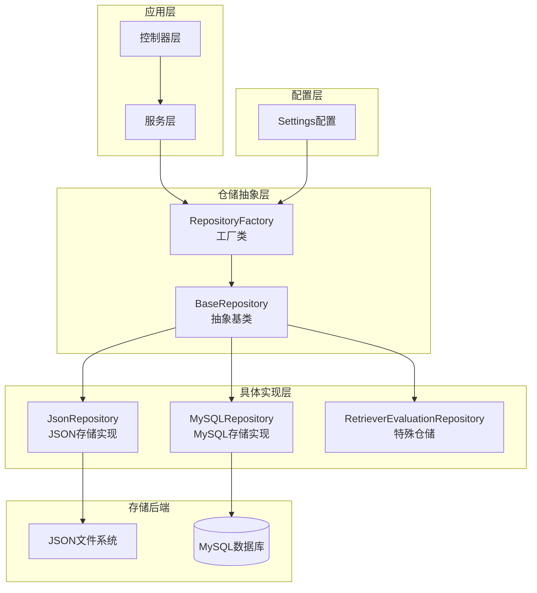

**图表来源**
- [base.py](file://backend/app/repositories/base.py#L14-L119)
- [factory.py](file://backend/app/repositories/factory.py#L17-L116)
- [json_repository.py](file://backend/app/repositories/json_repository.py#L16-L162)
- [mysql_repository.py](file://backend/app/repositories/mysql_repository.py#L19-L308)

## 核心组件分析

### 基础仓储抽象类

`BaseRepository`是整个数据访问层的核心抽象类，定义了所有仓储实现必须遵循的标准接口。

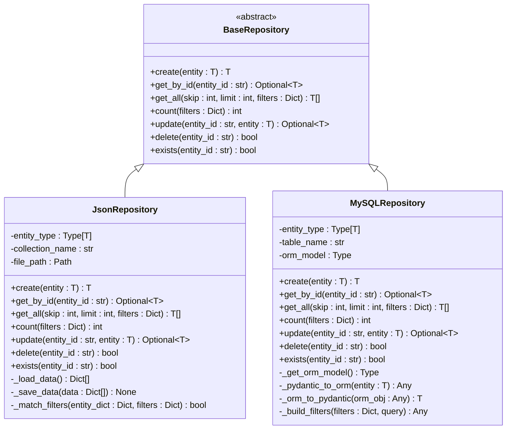

**图表来源**
- [base.py](file://backend/app/repositories/base.py#L14-L119)
- [json_repository.py](file://backend/app/repositories/json_repository.py#L16-L162)
- [mysql_repository.py](file://backend/app/repositories/mysql_repository.py#L19-L308)

**章节来源**
- [base.py](file://backend/app/repositories/base.py#L1-L119)
- [json_repository.py](file://backend/app/repositories/json_repository.py#L1-L162)
- [mysql_repository.py](file://backend/app/repositories/mysql_repository.py#L1-L308)

## 仓储模式实现

### CRUD操作标准化

仓储模式的核心在于提供标准化的CRUD操作接口，确保不同存储后端的操作行为一致性。

#### 标准化CRUD方法

| 方法 | 功能描述 | 参数说明 | 返回值 |
|------|----------|----------|--------|
| `create()` | 创建新实体 | `entity: T` - 要创建的实体对象 | `T` - 创建成功的实体 |
| `get_by_id()` | 根据ID查询实体 | `entity_id: str` - 实体唯一标识 | `Optional[T]` - 实体对象或None |
| `get_all()` | 查询实体列表 | `skip: int`, `limit: int`, `filters: Dict` | `List[T]` - 实体列表 |
| `count()` | 统计实体数量 | `filters: Dict` - 过滤条件 | `int` - 实体数量 |
| `update()` | 更新实体 | `entity_id: str`, `entity: T` | `Optional[T]` - 更新后的实体 |
| `delete()` | 删除实体 | `entity_id: str` - 实体ID | `bool` - 是否删除成功 |
| `exists()` | 检查实体存在性 | `entity_id: str` - 实体ID | `bool` - 是否存在 |

### 异步操作模式

所有仓储操作均采用异步模式，通过`asyncio.to_thread()`实现数据库操作的线程安全执行：

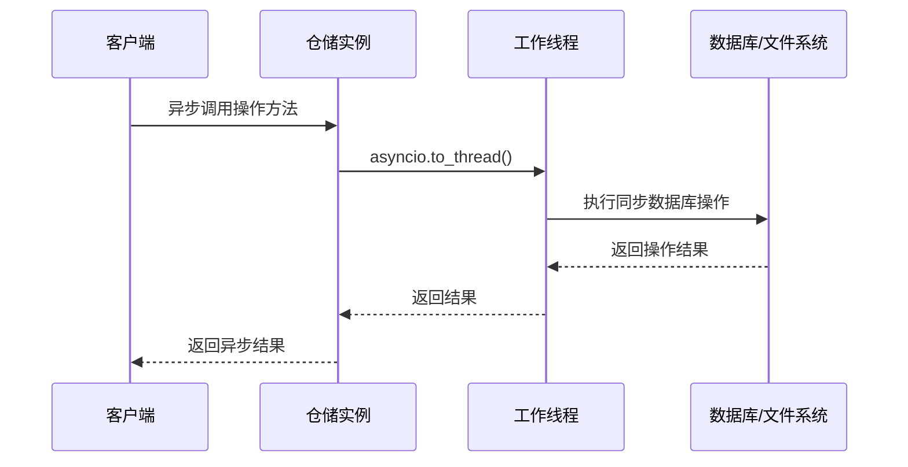

**图表来源**
- [mysql_repository.py](file://backend/app/repositories/mysql_repository.py#L145-L146)
- [mysql_repository.py](file://backend/app/repositories/mysql_repository.py#L165-L166)

**章节来源**
- [base.py](file://backend/app/repositories/base.py#L20-L118)
- [mysql_repository.py](file://backend/app/repositories/mysql_repository.py#L112-L307)

## 存储后端抽象层

### JSON文件存储实现

JSON存储适用于本地开发和测试环境，每个实体类型对应一个独立的JSON文件。

#### 实现特点

- **文件隔离**：每个集合（collection）对应单独的JSON文件
- **简单易用**：无需数据库配置，开箱即用
- **可读性强**：数据以人类可读的JSON格式存储
- **轻量级**：适合小规模数据和原型开发

#### 性能考虑

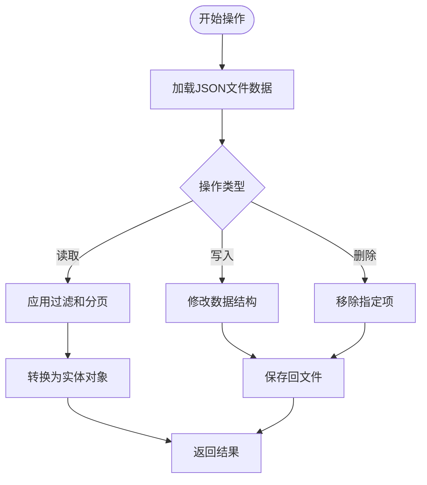

**图表来源**
- [json_repository.py](file://backend/app/repositories/json_repository.py#L41-L61)
- [json_repository.py](file://backend/app/repositories/json_repository.py#L70-L161)

### MySQL数据库存储实现

MySQL存储提供生产级别的数据持久化能力，支持复杂查询和事务管理。

#### ORM映射机制

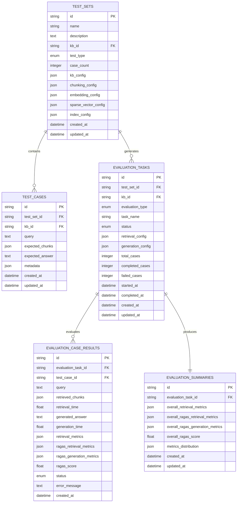

**图表来源**
- [database/models.py](file://backend/app/database/models.py#L23-L128)

#### 数据类型转换

MySQL仓储实现了Pydantic模型与SQLAlchemy ORM模型之间的双向转换：

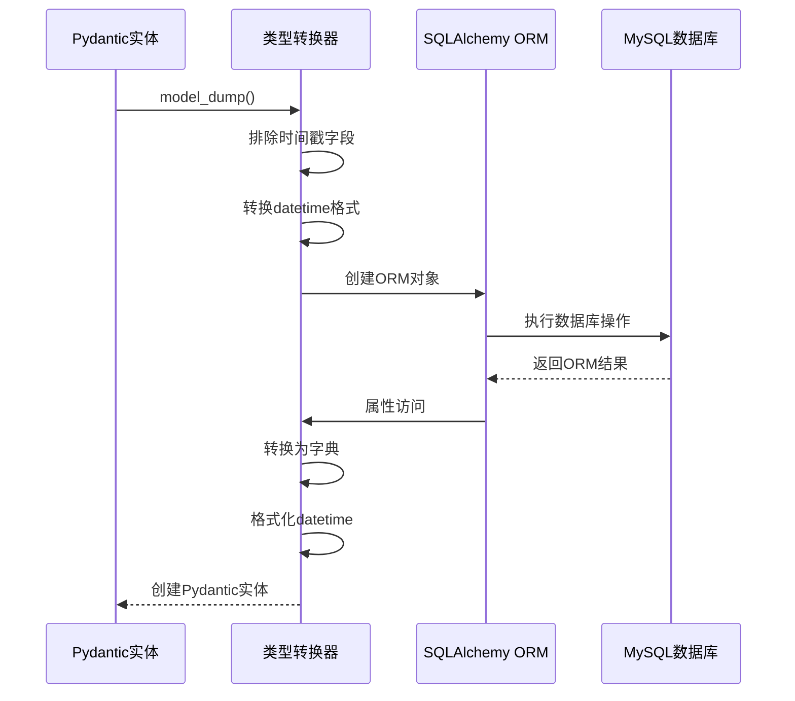

**图表来源**
- [mysql_repository.py](file://backend/app/repositories/mysql_repository.py#L61-L95)

**章节来源**
- [json_repository.py](file://backend/app/repositories/json_repository.py#L16-L162)
- [mysql_repository.py](file://backend/app/repositories/mysql_repository.py#L19-L308)
- [database/models.py](file://backend/app/database/models.py#L1-L128)

## 工厂模式与配置驱动

### RepositoryFactory设计

`RepositoryFactory`采用工厂模式，根据配置动态创建相应的仓储实例，实现了存储后端的完全可插拔性。

#### 工厂方法架构

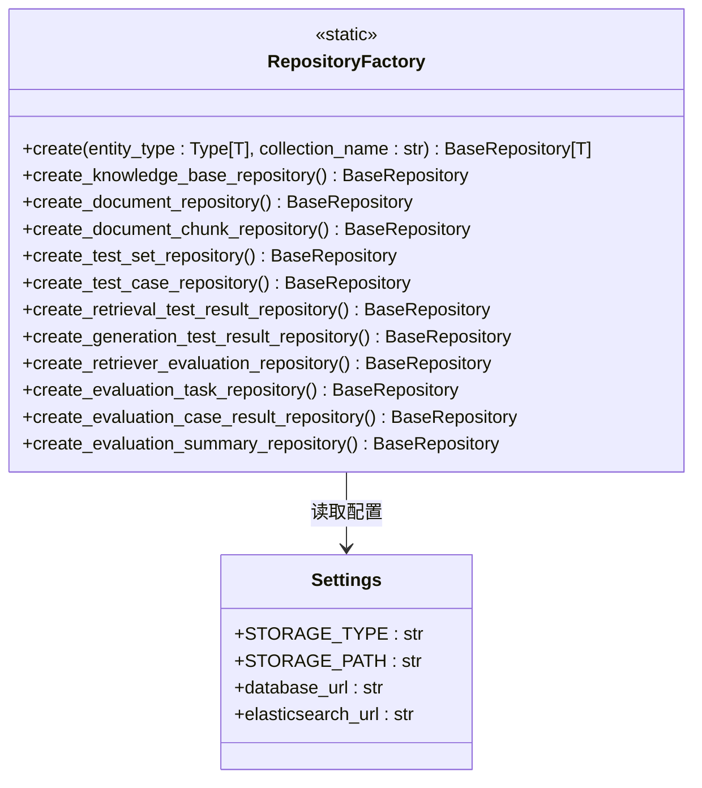

**图表来源**
- [factory.py](file://backend/app/repositories/factory.py#L17-L116)
- [config.py](file://backend/app/config.py#L42-L44)

#### 配置驱动的存储选择

工厂根据`settings.STORAGE_TYPE`自动选择合适的存储后端：

| 配置值 | 存储类型 | 适用场景 | 特点 |
|--------|----------|----------|------|
| `json` | JSON文件存储 | 开发测试 | 无数据库依赖，数据可读 |
| `mysql` | MySQL数据库存储 | 生产环境 | 支持复杂查询，事务安全 |

### 仓储实例创建流程

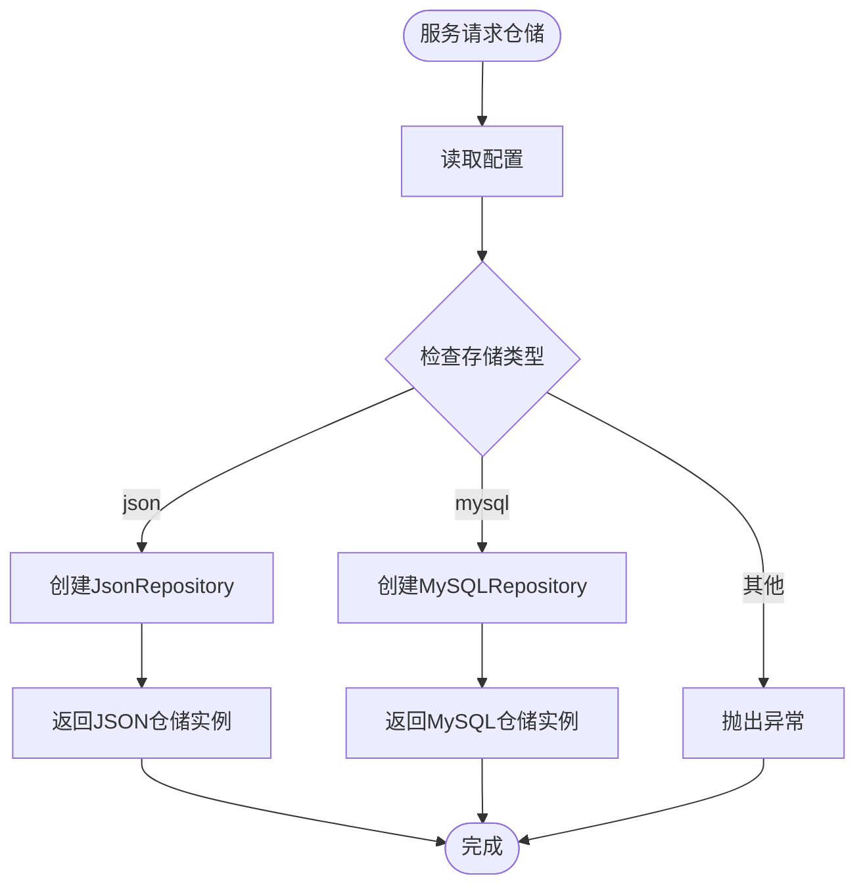

**图表来源**
- [factory.py](file://backend/app/repositories/factory.py#L23-L48)

**章节来源**
- [factory.py](file://backend/app/repositories/factory.py#L1-L116)
- [config.py](file://backend/app/config.py#L42-L44)

## 特殊仓储实现

### RetrieverEvaluationRepository

针对检索器评估结果的特殊需求，`RetrieverEvaluationRepository`提供了专门的查询方法。

#### 专用查询方法

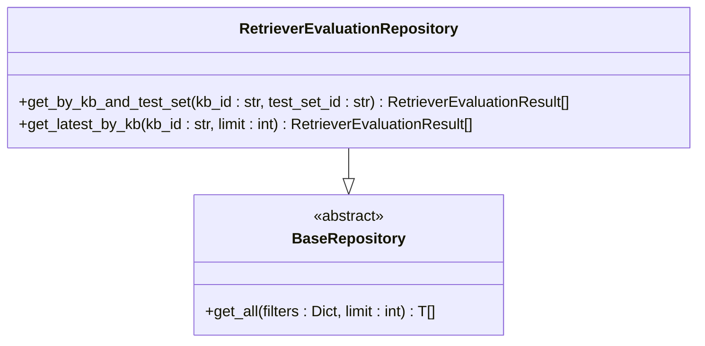

**图表来源**
- [retriever_evaluation_repository.py](file://backend/app/repositories/retriever_evaluation_repository.py#L10-L54)

#### 查询方法详解

| 方法 | 功能 | 参数 | 返回值 | 应用场景 |
|------|------|------|--------|----------|
| `get_by_kb_and_test_set()` | 获取指定知识库和测试集的评估结果 | `kb_id`, `test_set_id` | `List[RetrieverEvaluationResult]` | A/B测试对比 |
| `get_latest_by_kb()` | 获取指定知识库的最新评估结果 | `kb_id`, `limit` | `List[RetrieverEvaluationResult]` | 性能趋势分析 |

### 特殊化设计原则

1. **领域特定优化**：针对评估场景的查询需求进行优化
2. **组合查询支持**：支持复合条件查询
3. **排序和分页**：提供灵活的结果排序和分页
4. **类型安全**：保持与基础仓储相同的类型安全性

**章节来源**
- [retriever_evaluation_repository.py](file://backend/app/repositories/retriever_evaluation_repository.py#L1-L54)

## 事务管理与错误处理

### MySQL事务管理

MySQL仓储实现了完整的事务管理机制，确保数据的一致性和完整性。

#### 事务处理流程

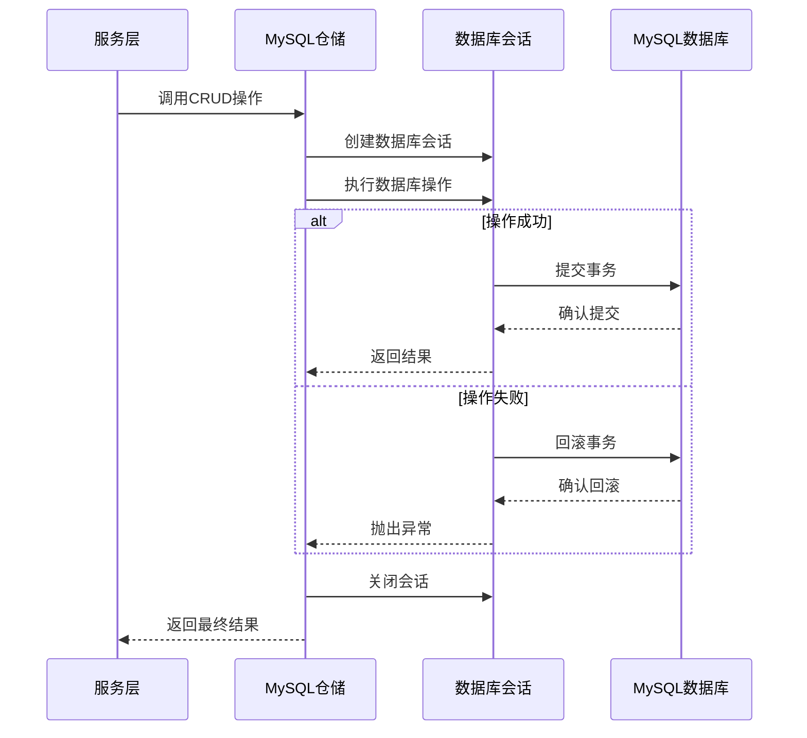

**图表来源**
- [mysql_repository.py](file://backend/app/repositories/mysql_repository.py#L135-L144)
- [mysql_repository.py](file://backend/app/repositories/mysql_repository.py#L164-L166)

#### 错误处理策略

| 异常类型 | 触发条件 | 处理方式 | 用户反馈 |
|----------|----------|----------|----------|
| `ConflictException` | 实体ID冲突 | 立即抛出，阻止操作 | "实体ID已存在" |
| `NotFoundException` | 实体不存在 | 返回None或抛出异常 | "实体未找到" |
| `InternalServerException` | 数据库内部错误 | 记录日志，返回通用错误 | "服务器内部错误" |
| `ValueError` | 不支持的存储类型 | 立即抛出，阻止初始化 | "不支持的存储类型" |

### JSON存储错误处理

JSON存储采用不同的错误处理策略：

- **文件IO异常**：捕获文件读写异常，提供详细的文件路径信息
- **数据格式异常**：验证JSON数据格式，确保数据完整性
- **并发控制**：通过文件锁机制避免并发写入冲突

**章节来源**
- [mysql_repository.py](file://backend/app/repositories/mysql_repository.py#L135-L144)
- [json_repository.py](file://backend/app/repositories/json_repository.py#L47-L59)

## 性能优化策略

### 异步操作优化

当前实现采用了多种异步优化策略：

1. **线程池隔离**：使用`asyncio.to_thread()`将阻塞的数据库操作移到工作线程
2. **连接池管理**：MySQL仓储使用SQLAlchemy的连接池机制
3. **批量操作支持**：JSON仓储支持批量读写操作

### 查询优化建议

#### MySQL查询优化

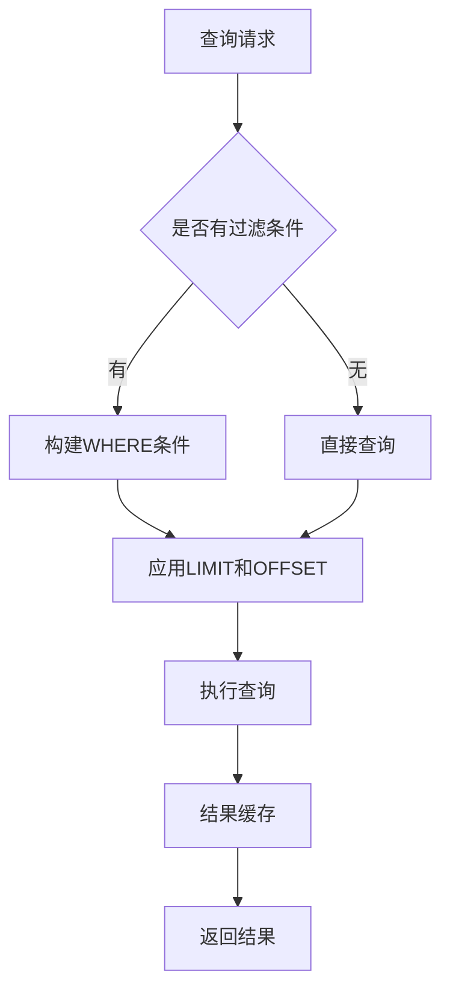

#### JSON查询优化

对于JSON存储，查询性能主要受以下因素影响：

1. **文件大小**：单个JSON文件不宜过大
2. **内存使用**：完全加载到内存中进行过滤
3. **索引策略**：通过实体ID建立快速查找索引

### 缓存机制（待实现）

虽然当前实现未包含缓存机制，但架构设计支持后续添加缓存层：

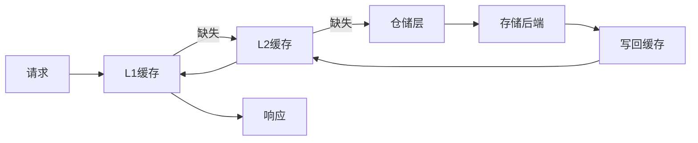

## 扩展指南

### 新增存储类型

要添加新的存储后端（如Redis），需要：

1. **实现BaseRepository接口**：
   ```python
   class RedisRepository(BaseRepository[T]):
       def __init__(self, entity_type: Type[T], collection_name: str):
           # Redis连接初始化
           pass
       
       # 实现所有抽象方法
   ```

2. **更新Factory类**：
   ```python
   if storage_type == "redis":
       return RedisRepository(entity_type, collection_name)
   ```

3. **添加配置选项**：
   在`Settings`类中添加Redis配置参数

### 优化现有仓储

#### MySQL仓储优化方向

1. **连接池优化**：调整连接池大小和超时设置
2. **查询优化**：添加适当的数据库索引
3. **批量操作**：实现批量插入和更新操作
4. **读写分离**：配置主从数据库实现读写分离

#### JSON仓储优化方向

1. **分片存储**：将大文件拆分为多个小文件
2. **增量更新**：只更新变更的部分而非整个文件
3. **压缩存储**：对大型数据集启用文件压缩
4. **内存映射**：对于超大文件使用内存映射技术

### 扩展最佳实践

1. **保持接口一致性**：新存储后端必须完全实现BaseRepository接口
2. **类型安全**：充分利用Python泛型确保类型安全
3. **错误处理**：提供详细的错误信息和上下文
4. **性能监控**：添加操作耗时和成功率的监控指标

## 总结

RAG-Studio的数据访问层通过精心设计的仓储模式，实现了存储后端的高度可插拔性和代码的高内聚低耦合。主要优势包括：

### 架构优势

- **统一接口**：所有存储后端提供一致的操作接口
- **配置驱动**：通过配置文件轻松切换存储后端
- **类型安全**：利用Python泛型确保编译时类型检查
- **异步支持**：全面采用异步编程模式提升性能

### 技术特色

- **抽象层次清晰**：从抽象基类到具体实现的层次分明
- **特殊化设计**：针对特定场景提供专门的仓储实现
- **事务安全保障**：MySQL仓储提供完整的事务管理
- **错误处理完善**：多层次的异常处理和用户友好的错误信息

### 扩展性设计

- **易于扩展**：新的存储后端只需实现BaseRepository接口
- **配置灵活**：支持多种存储后端的动态配置
- **性能优化空间**：架构设计支持后续的性能优化和缓存机制

这种设计不仅满足了当前的功能需求，还为未来的功能扩展和技术演进奠定了坚实的基础，是现代软件架构中仓储模式应用的优秀范例。