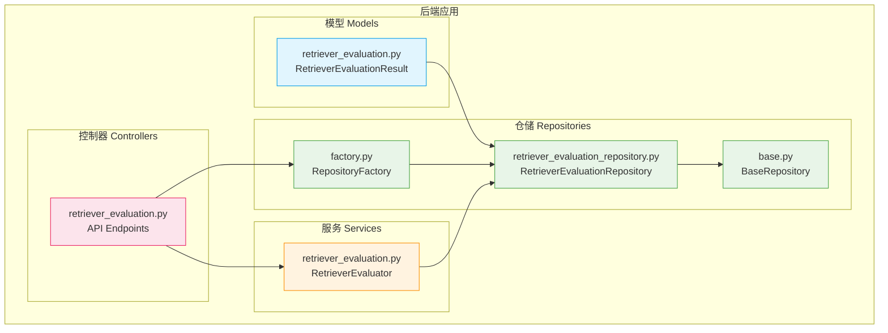
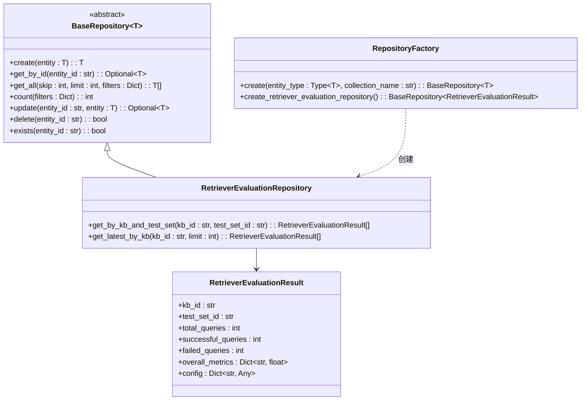
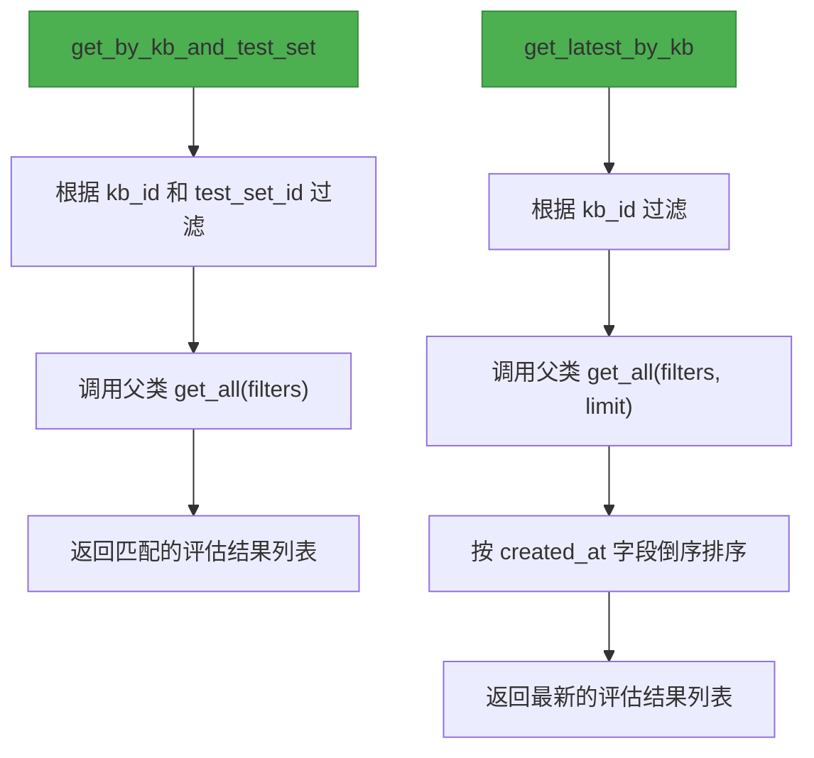
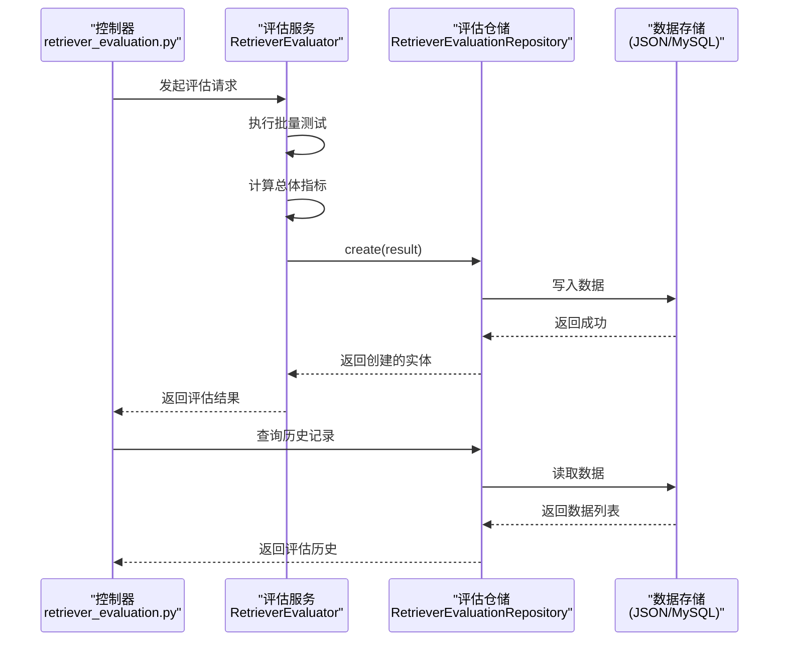
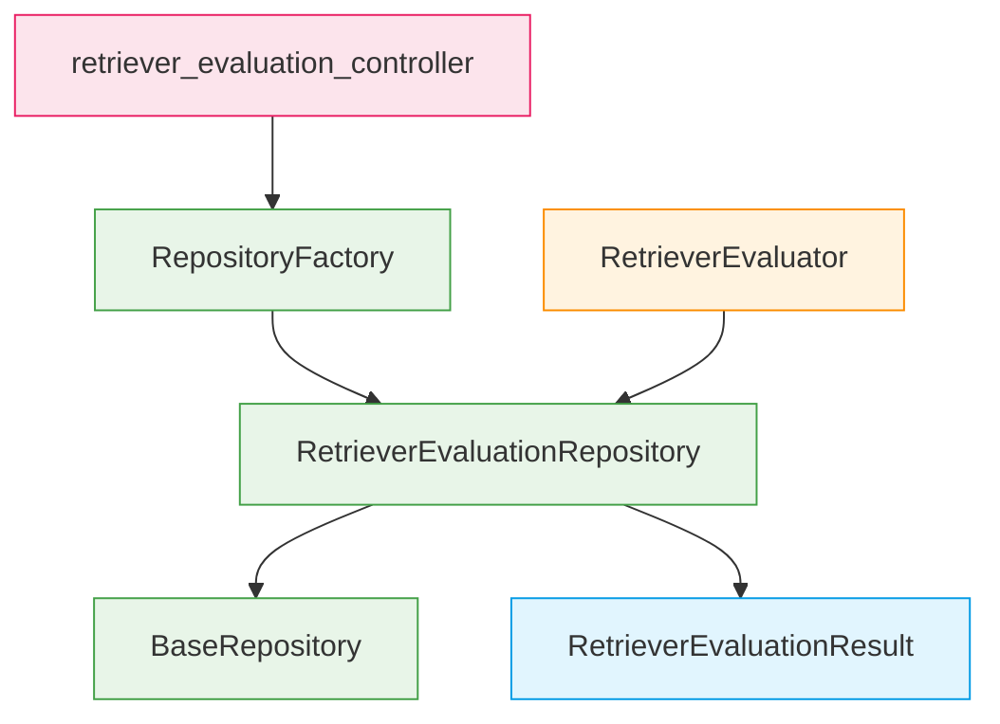

# 检索器评估专用仓储

<cite>
**本文档引用文件**  
- [retriever_evaluation_repository.py](file://backend/app/repositories/retriever_evaluation_repository.py)
- [retriever_evaluation.py](file://backend/app/models/retriever_evaluation.py)
- [base.py](file://backend/app/repositories/base.py)
- [factory.py](file://backend/app/repositories/factory.py)
- [retriever_evaluation.py](file://backend/app/controllers/retriever_evaluation.py)
- [models.py](file://backend/app/database/models.py)
</cite>

## 目录
1. [简介](#简介)
2. [项目结构](#项目结构)
3. [核心组件](#核心组件)
4. [架构概述](#架构概述)
5. [详细组件分析](#详细组件分析)
6. [依赖分析](#依赖分析)
7. [性能考虑](#性能考虑)
8. [故障排除指南](#故障排除指南)
9. [结论](#结论)

## 简介
本文档详细介绍了RAG-Studio系统中用于检索器评估的专用仓储模块。该模块专为处理大规模检索器评估结果数据而设计，提供了超越基础CRUD操作的定制化数据访问功能。文档深入分析了`RetrieverEvaluationRepository`的设计理念、其与`RetrieverEvaluationResult`数据模型的协同工作方式，以及它如何与上层服务高效地存储和检索评估数据。本指南旨在为开发者提供一个全面的理解，以便于优化数据存储性能和扩展评估指标。

## 项目结构
检索器评估专用仓储是RAG-Studio后端系统的一部分，位于`backend/app/repositories/`目录下。它与数据模型、服务层和控制器紧密协作，构成了一个完整的评估数据管理子系统。



**图示来源**  
- [retriever_evaluation.py](file://backend/app/models/retriever_evaluation.py)
- [retriever_evaluation_repository.py](file://backend/app/repositories/retriever_evaluation_repository.py)
- [base.py](file://backend/app/repositories/base.py)
- [factory.py](file://backend/app/repositories/factory.py)
- [retriever_evaluation.py](file://backend/app/services/retriever_evaluation.py)
- [retriever_evaluation.py](file://backend/app/controllers/retriever_evaluation.py)

## 核心组件
检索器评估专用仓储的核心由`RetrieverEvaluationRepository`类构成，它继承自通用的`BaseRepository`，并针对`RetrieverEvaluationResult`数据模型进行了功能扩展。该仓储不仅提供基础的数据持久化能力，还实现了针对评估场景的高级查询方法，如按知识库和测试集聚合结果、获取最新评估记录等。这些方法极大地简化了上层服务对评估数据的访问逻辑。

**组件来源**  
- [retriever_evaluation_repository.py](file://backend/app/repositories/retriever_evaluation_repository.py#L10-L52)
- [retriever_evaluation.py](file://backend/app/models/retriever_evaluation.py#L11-L60)

## 架构概述
该仓储采用分层架构设计，遵循依赖倒置原则。`RetrieverEvaluationRepository`作为业务逻辑与数据存储之间的抽象层，其具体实现由`RepositoryFactory`根据配置动态创建（如JSON文件存储或MySQL数据库）。这种设计使得上层服务（如`RetrieverEvaluator`）无需关心底层存储细节，只需通过统一的接口进行数据操作，从而提高了系统的可维护性和可扩展性。



**图示来源**  
- [base.py](file://backend/app/repositories/base.py#L14-L118)
- [retriever_evaluation_repository.py](file://backend/app/repositories/retriever_evaluation_repository.py#L10-L52)
- [factory.py](file://backend/app/repositories/factory.py#L24-L114)
- [retriever_evaluation.py](file://backend/app/models/retriever_evaluation.py#L11-L60)

## 详细组件分析

### 检索器评估结果模型分析
`RetrieverEvaluationResult`数据模型是评估数据的核心载体，其设计充分考虑了评估场景的复杂性。

```mermaid
classDiagram
class RetrieverEvaluationResult {
+kb_id : str
+test_set_id : str
+total_queries : int
+successful_queries : int
+failed_queries : int
+overall_metrics : Dict~str, float~
+config : Dict~str, Any~
}
note right of RetrieverEvaluationResult
**字段说明 : **
- kb_id : 关联的知识库ID
- test_set_id : 关联的测试集ID
- total_queries : 总查询数
- successful_queries : 成功查询数
- failed_queries : 失败查询数
- overall_metrics : 包含precision, recall,
f1_score, mrr, map, ndcg, hit_rate等
多个评估指标的字典
- config : 保存评估时的配置参数，
如top_k, vector_db_type, embedding_model等
end
```

**图示来源**  
- [retriever_evaluation.py](file://backend/app/models/retriever_evaluation.py#L11-L60)

### 检索器评估仓储分析
`RetrieverEvaluationRepository`在继承`BaseRepository`的基础上，提供了两个关键的定制化查询方法，这些方法直接服务于上层业务需求。

#### 定制化查询方法


**图示来源**  
- [retriever_evaluation_repository.py](file://backend/app/repositories/retriever_evaluation_repository.py#L13-L52)

**组件来源**  
- [retriever_evaluation_repository.py](file://backend/app/repositories/retriever_evaluation_repository.py#L10-L52)

### 与服务层的协同工作
`RetrieverEvaluationRepository`与`RetrieverEvaluator`服务紧密协作，共同完成评估任务。当评估服务完成对一批查询的测试后，会将计算出的总体指标和配置信息封装成`RetrieverEvaluationResult`对象，并通过仓储的`create`方法持久化到数据库中。反之，当需要查看历史评估结果或进行对比分析时，服务层会调用仓储的`get_by_kb_and_test_set`或`get_latest_by_kb`等方法来高效地检索所需数据。



**图示来源**  
- [retriever_evaluation.py](file://backend/app/controllers/retriever_evaluation.py#L197-L288)
- [retriever_evaluation.py](file://backend/app/services/retriever_evaluation.py#L26-L200)
- [retriever_evaluation_repository.py](file://backend/app/repositories/retriever_evaluation_repository.py#L10-L52)

## 依赖分析
该仓储模块的依赖关系清晰，体现了良好的模块化设计。



**图示来源**  
- [retriever_evaluation_repository.py](file://backend/app/repositories/retriever_evaluation_repository.py#L6-L7)
- [factory.py](file://backend/app/repositories/factory.py#L91-L96)
- [retriever_evaluation.py](file://backend/app/services/retriever_evaluation.py)
- [retriever_evaluation.py](file://backend/app/controllers/retriever_evaluation.py)

## 性能考虑
为了高效处理大规模评估数据，该仓储设计时考虑了以下性能因素：
1.  **过滤与分页**：`get_all`方法支持`filters`和`limit`参数，允许在数据检索阶段就进行过滤和分页，避免了将大量无用数据加载到内存中。
2.  **索引优化**：在数据库层面，`kb_id`和`test_set_id`字段被设计为索引字段（如`models.py`中的`index=True`），这能显著加速基于这些字段的查询操作。
3.  **工厂模式**：通过`RepositoryFactory`，可以根据实际需求选择最适合的存储后端（如高性能的MySQL用于生产环境，简单的JSON用于开发测试），从而在不同场景下获得最佳性能。

## 故障排除指南
在使用该仓储时，可能遇到的常见问题及解决方法：
- **问题**：调用`get_by_kb_and_test_set`方法返回空列表。
  **解决**：首先确认`kb_id`和`test_set_id`是否正确，然后检查数据库中是否存在对应的数据。可以通过`RepositoryFactory.create_retriever_evaluation_repository()`手动创建仓储实例，并调用`get_all()`方法查看所有记录进行排查。
- **问题**：`create`方法保存评估结果失败。
  **解决**：检查`RetrieverEvaluationResult`对象的必填字段（如`kb_id`, `test_set_id`, `total_queries`等）是否已正确赋值。同时，查看底层存储（如MySQL连接、JSON文件权限）是否正常。

**组件来源**  
- [retriever_evaluation_repository.py](file://backend/app/repositories/retriever_evaluation_repository.py)
- [models.py](file://backend/app/database/models.py)

## 结论
`RetrieverEvaluationRepository`是一个设计精良、功能专用的仓储实现。它通过继承通用基类并扩展定制化查询方法，完美地平衡了代码复用性和业务特殊性。其与`RetrieverEvaluationResult`模型和上层服务的紧密结合，为RAG-Studio的检索器评估功能提供了强大而高效的数据管理支持。该设计模式值得在系统其他需要复杂数据查询的模块中推广。