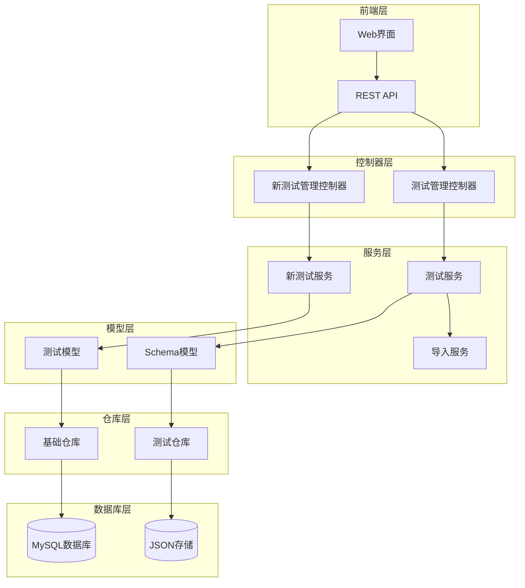
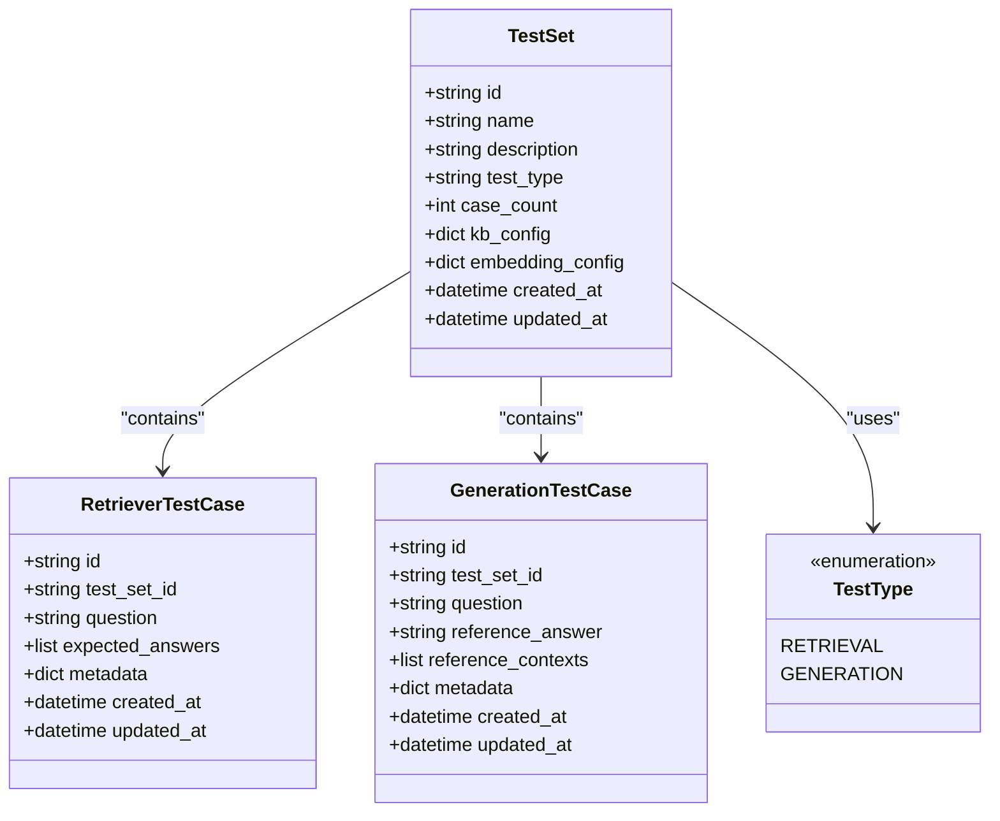
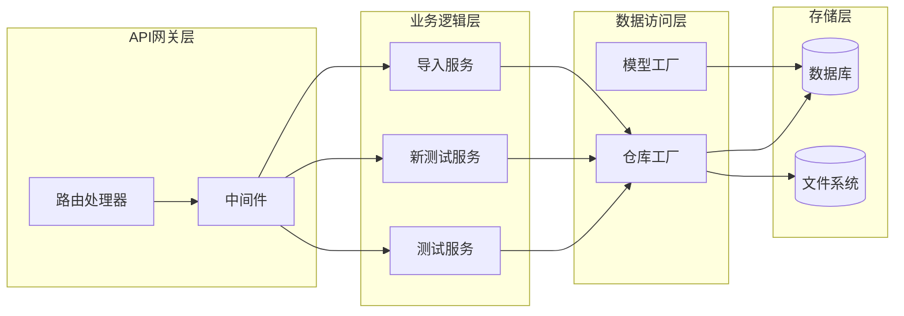
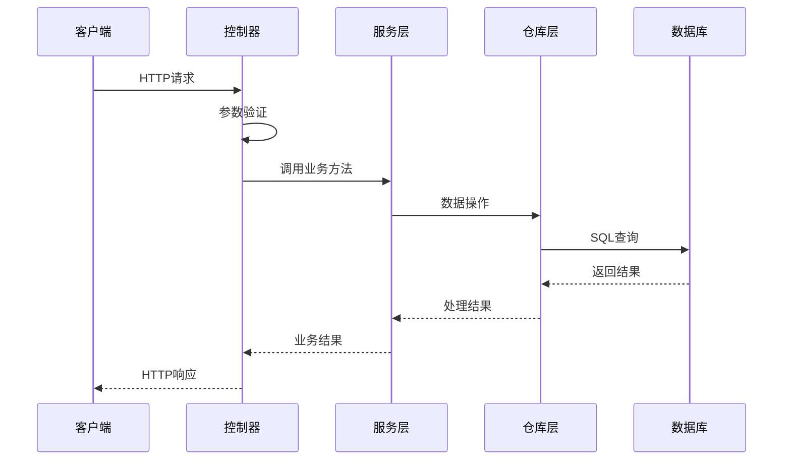
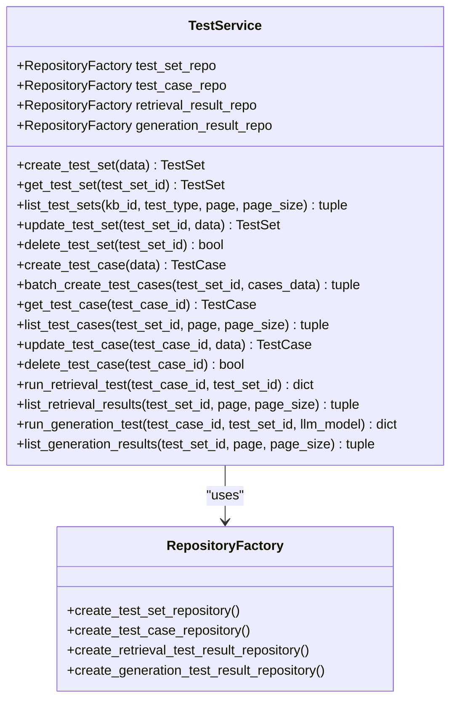
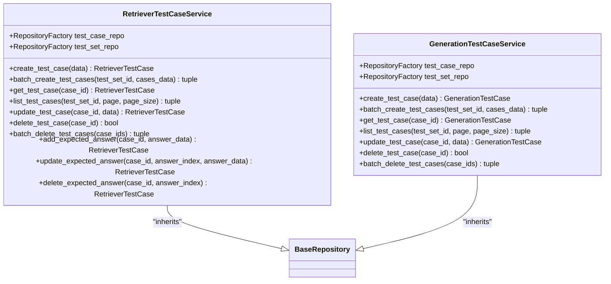
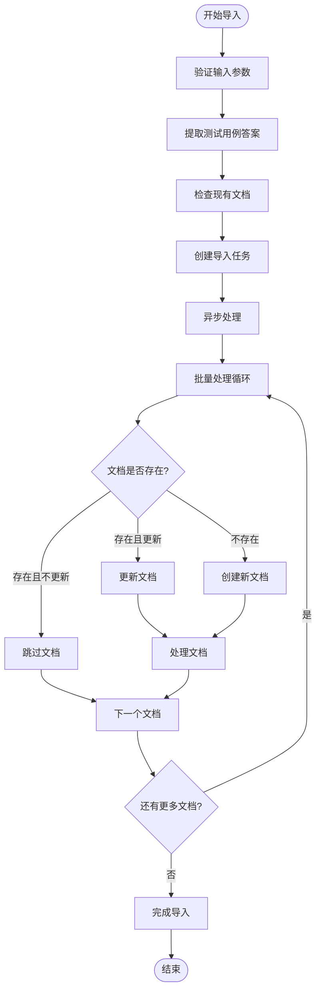
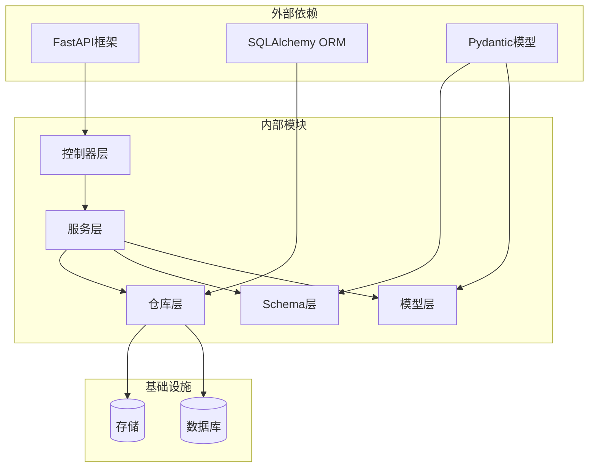
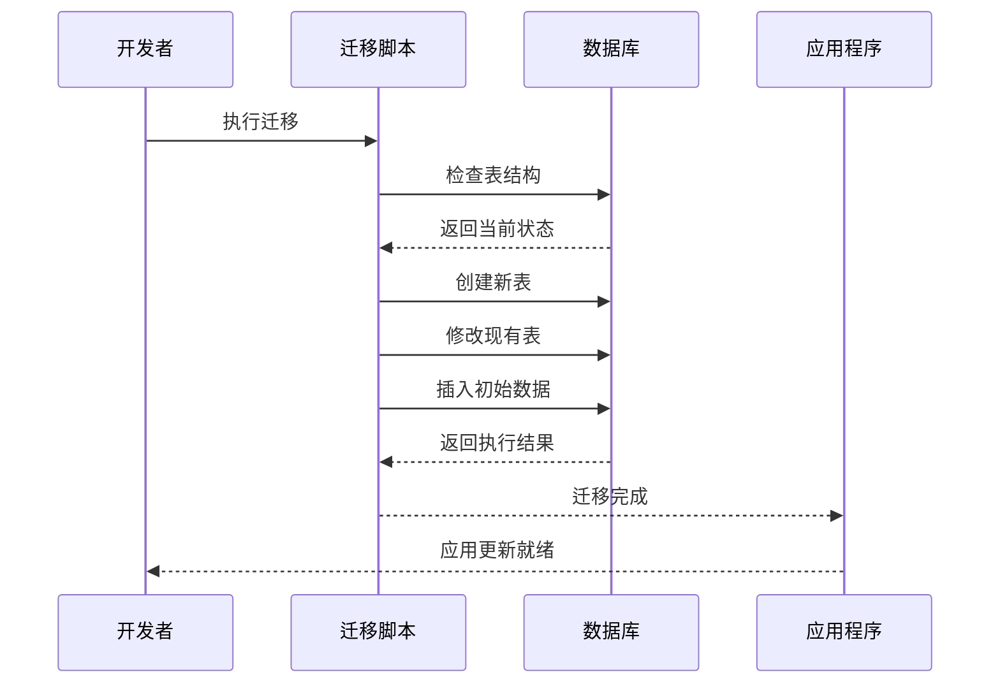

# Generation Test Case Service 生成测试用例服务

<cite>
**本文档引用的文件**
- [test_service.py](file://backend/app/services/test_service.py)
- [new_test_service.py](file://backend/app/services/new_test_service.py)
- [test_management.py](file://backend/app/controllers/test_management.py)
- [new_test_management.py](file://backend/app/controllers/new_test_management.py)
- [test.py](file://backend/app/models/test.py)
- [test.py](file://backend/app/schemas/test.py)
- [base.py](file://backend/app/repositories/base.py)
- [test_set_import_service.py](file://backend/app/services/test_set_import_service.py)
- [002_create_new_test_tables.py](file://backend/migrations/002_create_new_test_tables.py)
- [003_refactor_test_set_kb_relation.py](file://backend/migrations/003_refactor_test_set_kb_relation.py)
- [README_TEST.md](file://backend/README_TEST.md)
</cite>

## 目录
1. [简介](#简介)
2. [项目结构](#项目结构)
3. [核心组件](#核心组件)
4. [架构概览](#架构概览)
5. [详细组件分析](#详细组件分析)
6. [依赖关系分析](#依赖关系分析)
7. [性能考虑](#性能考虑)
8. [故障排除指南](#故障排除指南)
9. [结论](#结论)

## 简介

Generation Test Case Service 是 RAG Studio 项目中的核心测试管理模块，专门负责生成测试用例的创建、管理和评估。该服务支持两种主要的测试类型：检索测试（Retrieval Test）和生成测试（Generation Test），为 RAG（检索增强生成）系统的质量保证提供了完整的测试解决方案。

该服务采用现代化的微服务架构，通过清晰的分层设计实现了业务逻辑与数据访问的分离，支持独立的检索器测试用例和生成测试用例管理，提供了丰富的 API 接口和强大的批量操作能力。

## 项目结构



**图表来源**
- [test_management.py](file://backend/app/controllers/test_management.py#L1-L50)
- [new_test_management.py](file://backend/app/controllers/new_test_management.py#L1-L50)
- [test_service.py](file://backend/app/services/test_service.py#L1-L50)
- [new_test_service.py](file://backend/app/services/new_test_service.py#L1-L50)

**章节来源**
- [test_management.py](file://backend/app/controllers/test_management.py#L1-L728)
- [new_test_management.py](file://backend/app/controllers/new_test_management.py#L1-L651)
- [test_service.py](file://backend/app/services/test_service.py#L1-L352)
- [new_test_service.py](file://backend/app/services/new_test_service.py#L1-L437)

## 核心组件

### 1. 测试服务架构

系统采用分层架构设计，主要包括以下核心组件：

- **控制器层（Controllers）**：处理 HTTP 请求和响应，提供 RESTful API 接口
- **服务层（Services）**：实现业务逻辑，包括测试用例管理、评估和导入功能
- **模型层（Models）**：定义数据结构和业务实体
- **仓库层（Repositories）**：抽象数据访问逻辑，支持多种存储后端
- **Schema 层**：定义 API 请求和响应的数据结构

### 2. 测试类型支持

系统支持两种主要的测试类型：

- **检索测试（Retrieval Test）**：专注于评估检索系统的准确性
- **生成测试（Generation Test）**：专注于评估生成系统的质量和一致性

### 3. 数据模型设计



**图表来源**
- [test.py](file://backend/app/models/test.py#L13-L221)
- [test.py](file://backend/app/schemas/test.py#L11-L612)

**章节来源**
- [test.py](file://backend/app/models/test.py#L1-L441)
- [test.py](file://backend/app/schemas/test.py#L1-L612)

## 架构概览

### 整体架构设计



**图表来源**
- [test_management.py](file://backend/app/controllers/test_management.py#L33-L35)
- [new_test_management.py](file://backend/app/controllers/new_test_management.py#L30-L32)
- [test_service.py](file://backend/app/services/test_service.py#L24-L31)

### 数据流架构



**图表来源**
- [test_management.py](file://backend/app/controllers/test_management.py#L38-L72)
- [test_service.py](file://backend/app/services/test_service.py#L35-L58)

## 详细组件分析

### 测试服务组件

#### TestService 类

TestService 是传统的测试管理服务，提供全面的测试集和测试用例管理功能：



**图表来源**
- [test_service.py](file://backend/app/services/test_service.py#L24-L352)

#### 主要功能特性

1. **测试集管理**
   - 创建、查询、更新、删除测试集
   - 支持分页查询和过滤
   - 自动维护测试用例数量统计

2. **测试用例管理**
   - 单个和批量创建测试用例
   - 支持复杂的数据验证和转换
   - 提供详细的错误处理机制

3. **测试执行**
   - 检索测试执行框架
   - 生成测试执行框架
   - 评估指标计算（待实现）

**章节来源**
- [test_service.py](file://backend/app/services/test_service.py#L35-L352)

### 新测试服务组件

#### RetrieverTestCaseService 类

专门负责检索器测试用例的管理：



**图表来源**
- [new_test_service.py](file://backend/app/services/new_test_service.py#L25-L437)

#### 核心功能

1. **独立的测试用例管理**
   - 检索器测试用例和生成测试用例分离
   - 更精细的权限控制和数据隔离

2. **高级操作支持**
   - 动态添加、更新、删除期望答案
   - 批量操作优化
   - 详细的错误处理和反馈

3. **灵活的数据结构**
   - 支持多答案的检索器测试用例
   - 生成测试用例的上下文管理

**章节来源**
- [new_test_service.py](file://backend/app/services/new_test_service.py#L25-L437)

### 测试集导入服务

#### TestSetImportService 类

负责将测试集导入到知识库的复杂业务逻辑：



**图表来源**
- [test_set_import_service.py](file://backend/app/services/test_set_import_service.py#L142-L240)

#### 导入流程特性

1. **智能预览功能**
   - 计算导入结果统计信息
   - 区分新文档和现有文档
   - 提供详细的导入计划

2. **异步处理机制**
   - 后台异步执行导入任务
   - 实时监控导入进度
   - 支持任务状态查询

3. **完整的文档处理**
   - 自动生成外部ID
   - 智能文档分块
   - 向量嵌入生成
   - 向量数据库写入

**章节来源**
- [test_set_import_service.py](file://backend/app/services/test_set_import_service.py#L30-L564)

### 控制器层组件

#### API 路由设计

系统采用模块化的路由设计，将不同类型的测试用例分离到独立的路由组：

```mermaid
graph TB
subgraph "传统测试管理"
TestRouter[/tests]
TestSets[测试集管理]
TestCases[测试用例管理]
RetrievalTests[检索测试]
GenerationTests[生成测试]
end
subgraph "新测试管理"
RetrieverRouter[/tests/retriever]
GenerationRouter[/tests/generation]
RetrieverCases[检索器测试用例]
GenerationCases[生成测试用例]
end
TestRouter --> TestSets
TestRouter --> TestCases
TestRouter --> RetrievalTests
TestRouter --> GenerationTests
RetrieverRouter --> RetrieverCases
GenerationRouter --> GenerationCases
```

**图表来源**
- [test_management.py](file://backend/app/controllers/test_management.py#L33-L35)
- [new_test_management.py](file://backend/app/controllers/new_test_management.py#L30-L32)

#### API 接口规范

| 接口类型 | 方法 | 路径 | 功能描述 |
|---------|------|------|----------|
| 测试集管理 | GET | `/tests/test-sets` | 获取测试集列表 |
| 测试集管理 | POST | `/tests/test-sets` | 创建测试集 |
| 测试集管理 | GET | `/tests/test-sets/{id}` | 获取测试集详情 |
| 测试集管理 | PUT | `/tests/test-sets/{id}` | 更新测试集 |
| 测试集管理 | DELETE | `/tests/test-sets/{id}` | 删除测试集 |
| 检索器测试用例 | GET | `/tests/retriever/cases` | 获取检索器测试用例列表 |
| 检索器测试用例 | POST | `/tests/retriever/cases` | 创建检索器测试用例 |
| 检索器测试用例 | GET | `/tests/retriever/cases/{id}` | 获取检索器测试用例详情 |
| 检索器测试用例 | PUT | `/tests/retriever/cases/{id}` | 更新检索器测试用例 |
| 检索器测试用例 | DELETE | `/tests/retriever/cases/{id}` | 删除检索器测试用例 |
| 生成测试用例 | GET | `/tests/generation/cases` | 获取生成测试用例列表 |
| 生成测试用例 | POST | `/tests/generation/cases` | 创建生成测试用例 |
| 生成测试用例 | GET | `/tests/generation/cases/{id}` | 获取生成测试用例详情 |
| 生成测试用例 | PUT | `/tests/generation/cases/{id}` | 更新生成测试用例 |
| 生成测试用例 | DELETE | `/tests/generation/cases/{id}` | 删除生成测试用例 |

**章节来源**
- [test_management.py](file://backend/app/controllers/test_management.py#L38-L728)
- [new_test_management.py](file://backend/app/controllers/new_test_management.py#L37-L651)

## 依赖关系分析

### 组件间依赖关系



**图表来源**
- [base.py](file://backend/app/repositories/base.py#L1-L121)
- [test_service.py](file://backend/app/services/test_service.py#L1-L20)

### 数据库迁移架构

系统通过数据库迁移脚本管理数据结构演进：



**图表来源**
- [002_create_new_test_tables.py](file://backend/migrations/002_create_new_test_tables.py#L19-L35)
- [003_refactor_test_set_kb_relation.py](file://backend/migrations/003_refactor_test_set_kb_relation.py#L21-L83)

**章节来源**
- [002_create_new_test_tables.py](file://backend/migrations/002_create_new_test_tables.py#L1-L60)
- [003_refactor_test_set_kb_relation.py](file://backend/migrations/003_refactor_test_set_kb_relation.py#L1-L122)

## 性能考虑

### 并发处理优化

1. **异步操作支持**
   - 异步导入任务处理
   - 非阻塞的API响应
   - 并发批量操作

2. **缓存策略**
   - 测试用例结果缓存
   - 配置信息缓存
   - 频繁查询结果缓存

3. **数据库优化**
   - 索引优化
   - 分页查询
   - 连接池管理

### 批量操作优化

系统提供了高效的批量操作功能：

- **批量创建**：支持一次性创建多个测试用例
- **批量删除**：支持批量删除测试用例
- **异步处理**：大容量操作在后台异步执行

## 故障排除指南

### 常见问题及解决方案

#### 1. 测试集导入失败

**问题症状**：导入任务状态为 failed，错误信息显示导入失败

**可能原因**：
- 知识库配置不正确
- 文档内容格式问题
- 向量数据库连接异常

**解决方案**：
1. 检查知识库配置是否正确
2. 验证文档内容格式
3. 确认向量数据库服务可用性

#### 2. API 响应超时

**问题症状**：API 请求长时间无响应

**可能原因**：
- 数据库连接池耗尽
- 大量并发请求
- 系统资源不足

**解决方案**：
1. 检查数据库连接池配置
2. 优化查询语句
3. 增加系统资源

#### 3. 测试用例创建失败

**问题症状**：创建测试用例时返回错误

**可能原因**：
- 测试集不存在
- 数据格式验证失败
- 权限不足

**解决方案**：
1. 确认测试集 ID 存在
2. 检查数据格式
3. 验证用户权限

**章节来源**
- [README_TEST.md](file://backend/README_TEST.md#L157-L208)

## 结论

Generation Test Case Service 作为 RAG Studio 的核心测试管理模块，展现了现代软件架构的最佳实践。通过清晰的分层设计、模块化的组件结构和完善的 API 接口，该服务为 RAG 系统的质量保证提供了强大而灵活的解决方案。

### 主要优势

1. **架构清晰**：采用分层架构，职责明确，易于维护和扩展
2. **功能完整**：支持多种测试类型和复杂的业务场景
3. **性能优化**：异步处理、批量操作、缓存策略等优化措施
4. **易于集成**：标准化的 API 接口，便于前端和第三方系统集成

### 发展方向

1. **评估指标完善**：实现更全面的测试评估指标
2. **自动化测试**：开发自动化的测试执行和报告生成功能
3. **可视化界面**：提供更直观的测试管理和监控界面
4. **性能监控**：集成性能监控和告警机制

该服务为 RAG 系统的稳定性和可靠性提供了坚实的基础，是构建高质量 AI 应用的重要组成部分。