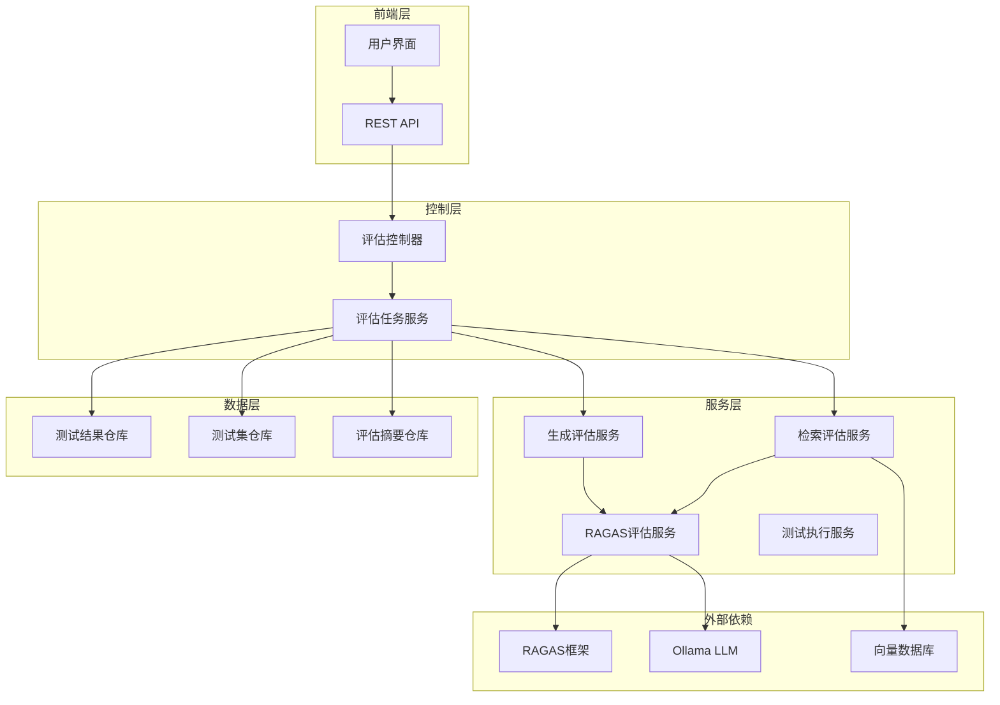
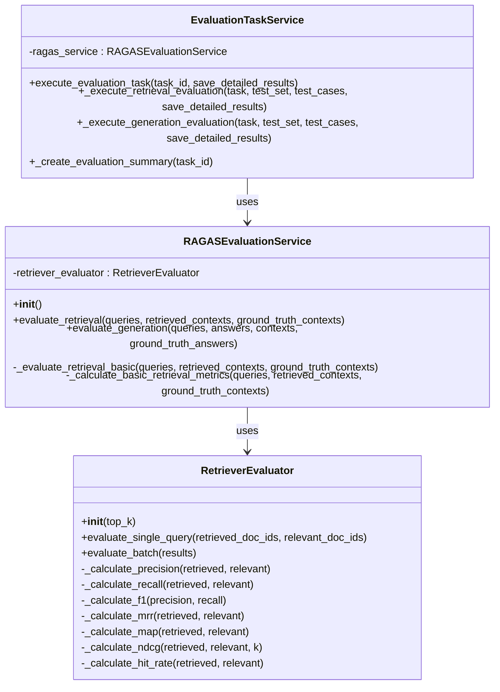
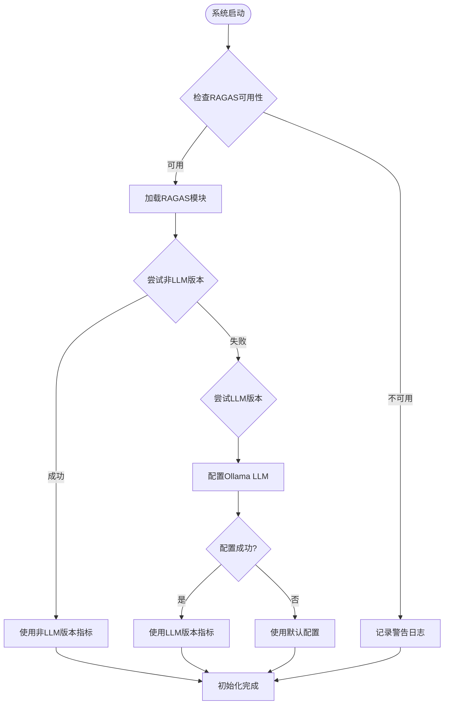
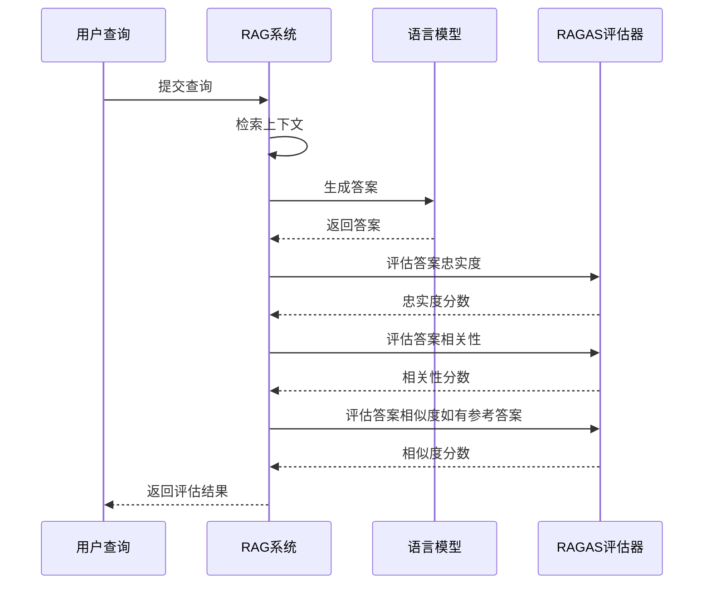
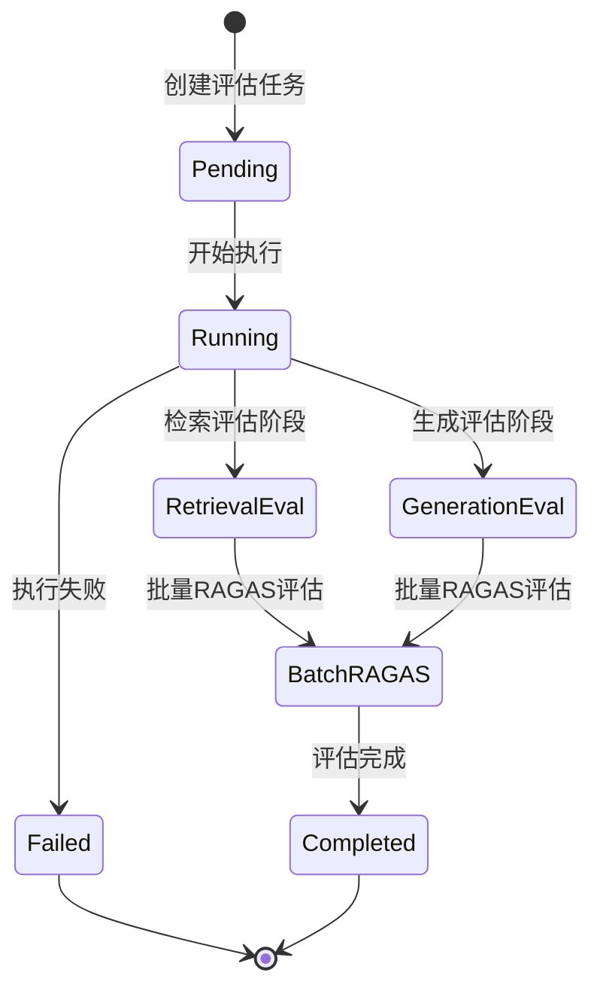
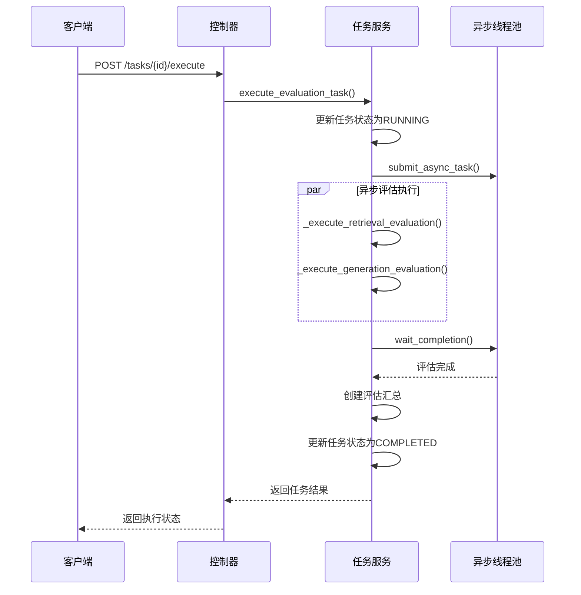
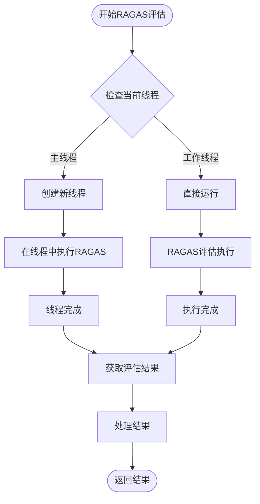
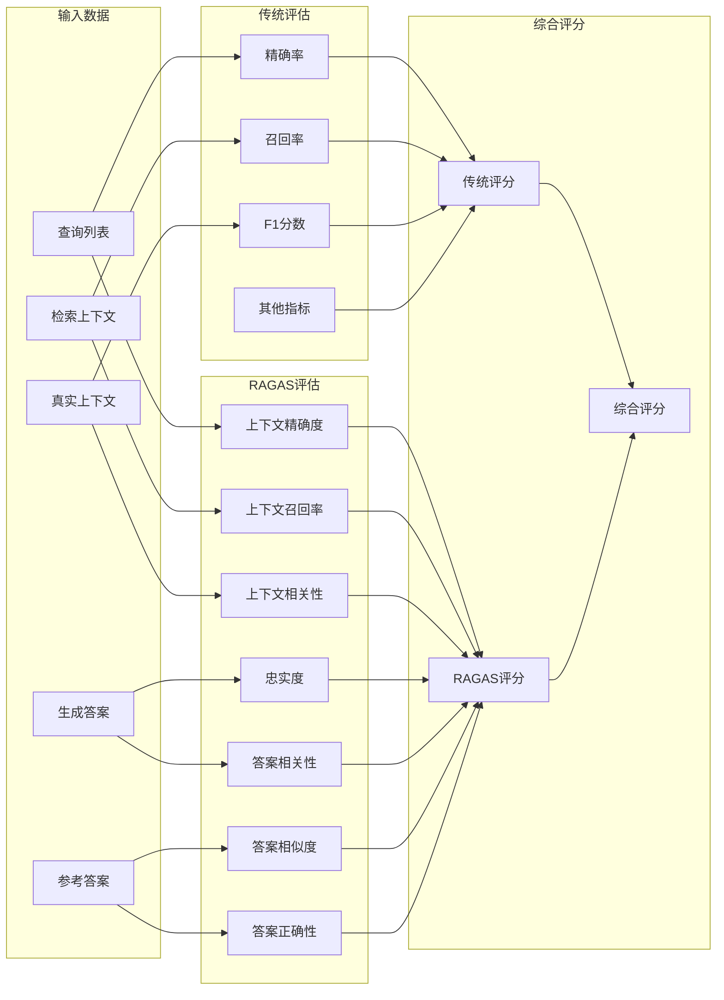
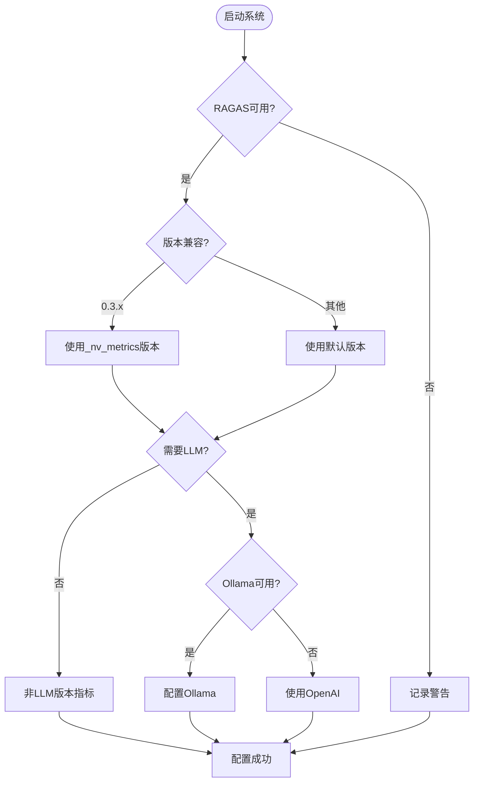

# RAGAS评估服务

<cite>
**本文档引用的文件**
- [ragas_evaluation.py](file://backend/app/services/ragas_evaluation.py)
- [evaluation.py](file://backend/app/controllers/evaluation.py)
- [evaluation_task.py](file://backend/app/services/evaluation_task.py)
- [evaluation.py](file://backend/app/models/evaluation.py)
- [retriever_evaluation.py](file://backend/app/services/retriever_evaluation.py)
- [config.py](file://backend/app/config.py)
- [example_t2ranking_usage.py](file://backend/example_t2ranking_usage.py)
</cite>

## 目录
1. [简介](#简介)
2. [系统架构概览](#系统架构概览)
3. [RAGAS集成核心组件](#ragas集成核心组件)
4. [评估指标详解](#评估指标详解)
5. [异步评估任务执行流程](#异步评估任务执行流程)
6. [评估结果对比分析机制](#评估结果对比分析机制)
7. [配置与部署指南](#配置与部署指南)
8. [扩展开发指导](#扩展开发指导)
9. [故障排除](#故障排除)
10. [最佳实践](#最佳实践)

## 简介

RAGAS评估服务是RAG-Studio系统中的核心评估组件，基于RAGAS框架实现了高级的检索器和生成器评估功能。该服务不仅支持传统的检索质量评估指标，还引入了基于大语言模型的高级评估指标，如context_precision、faithfulness等，为RAG系统的全面性能评估提供了强大的工具。

### 主要特性

- **双评估体系**：同时支持传统检索指标和RAGAS高级指标
- **异步执行**：采用异步架构，支持大规模评估任务
- **智能降级**：RAGAS不可用时自动切换到基础评估
- **灵活配置**：支持多种LLM提供商和评估配置
- **完整监控**：提供详细的评估过程跟踪和结果分析

## 系统架构概览



**图表来源**
- [evaluation.py](file://backend/app/controllers/evaluation.py#L1-L50)
- [evaluation_task.py](file://backend/app/services/evaluation_task.py#L25-L40)
- [ragas_evaluation.py](file://backend/app/services/ragas_evaluation.py#L190-L200)

## RAGAS集成核心组件

### RAGASEvaluationService类

RAGASEvaluationService是RAGAS评估功能的核心入口，负责协调各种评估指标的计算和结果整合。



**图表来源**
- [ragas_evaluation.py](file://backend/app/services/ragas_evaluation.py#L191-L200)
- [retriever_evaluation.py](file://backend/app/services/retriever_evaluation.py#L26-L40)
- [evaluation_task.py](file://backend/app/services/evaluation_task.py#L26-L40)

### RAGAS模块初始化机制

系统采用延迟加载策略，确保RAGAS框架的可用性检测不会影响系统启动：



**图表来源**
- [ragas_evaluation.py](file://backend/app/services/ragas_evaluation.py#L18-L186)

**章节来源**
- [ragas_evaluation.py](file://backend/app/services/ragas_evaluation.py#L18-L186)
- [evaluation_task.py](file://backend/app/services/evaluation_task.py#L25-L40)

## 评估指标详解

### 检索器评估指标

#### 传统指标（RetrieverEvaluator）

系统内置了丰富的传统检索评估指标：

| 指标名称 | 计算公式 | 取值范围 | 用途说明 |
|---------|---------|---------|---------|
| Precision@K | | | 精确率，衡量检索结果中有多少是相关的 |
| Recall@K | | | 召回率，衡量相关文档中有多少被检索到 |
| F1-Score | | | 精确率和召回率的调和平均，平衡两者 |
| MRR | | | 平均倒数排名，考虑相关文档的排序位置 |
| MAP | | | 平均精度，综合考虑所有相关文档的位置 |
| NDCG | | | 归一化折损累积增益，考虑排序质量 |
| Hit Rate | | | 命中率，至少找到一个相关文档即为1 |

#### RAGAS高级指标

当RAGAS可用时，系统会计算以下高级指标：

| 指标名称 | 描述 | 计算方式 | 取值范围 |
|---------|------|---------|---------|
| Context Precision | 上下文精确度 | 检索的上下文中有多少是真正相关的 | 0.0-1.0 |
| Context Recall | 上下文召回率 | 相关上下文中有多少被检索到 | 0.0-1.0 |
| Context Relevancy | 上下文相关性 | 上下文与查询的相关程度 | 0.0-1.0 |
| Faithfulness | 忠实度 | 生成答案对上下文的忠实程度 | 0.0-1.0 |
| Answer Relevancy | 答案相关性 | 答案与查询的相关程度 | 0.0-1.0 |
| Answer Similarity | 答案相似度 | 生成答案与参考答案的相似度 | 0.0-1.0 |
| Answer Correctness | 答案正确性 | 答案的准确性 | 0.0-1.0 |

### 生成器评估指标

#### 基于事实性的评估



**图表来源**
- [ragas_evaluation.py](file://backend/app/services/ragas_evaluation.py#L388-L536)

**章节来源**
- [retriever_evaluation.py](file://backend/app/services/retriever_evaluation.py#L14-L25)
- [ragas_evaluation.py](file://backend/app/services/ragas_evaluation.py#L388-L536)

## 异步评估任务执行流程

### 评估任务生命周期



**图表来源**
- [evaluation_task.py](file://backend/app/services/evaluation_task.py#L91-L177)

### 异步执行机制

系统采用多层次的异步执行策略：

#### 1. 评估任务异步执行



**图表来源**
- [evaluation_task.py](file://backend/app/services/evaluation_task.py#L91-L177)

#### 2. RAGAS评估异步处理

由于RAGAS内部使用异步代码，系统采用了特殊的异步处理策略：



**图表来源**
- [ragas_evaluation.py](file://backend/app/services/ragas_evaluation.py#L300-L320)

**章节来源**
- [evaluation_task.py](file://backend/app/services/evaluation_task.py#L91-L177)
- [ragas_evaluation.py](file://backend/app/services/ragas_evaluation.py#L300-L320)

## 评估结果对比分析机制

### 双重评估体系

系统实现了传统评估指标与RAGAS高级指标的并行计算，确保评估结果的全面性和可比性：



**图表来源**
- [evaluation_task.py](file://backend/app/services/evaluation_task.py#L280-L338)
- [evaluation_task.py](file://backend/app/services/evaluation_task.py#L444-L484)

### 结果对比分析表

| 评估维度 | 传统指标 | RAGAS指标 | 对比分析 |
|---------|---------|----------|---------|
| 检索质量 | Precision, Recall, F1 | Context Precision, Context Recall | 传统指标关注文档级别，RAGAS关注上下文级别 |
| 上下文质量 | - | Context Relevancy | RAGAS提供上下文与查询的相关性度量 |
| 生成质量 | - | Faithfulness, Answer Relevancy | RAGAS评估生成内容的质量和相关性 |
| 综合性能 | 多个指标加权 | RAGAS综合评分 | 提供统一的性能评估标准 |

**章节来源**
- [evaluation_task.py](file://backend/app/services/evaluation_task.py#L280-L338)
- [evaluation_task.py](file://backend/app/services/evaluation_task.py#L444-L484)

## 配置与部署指南

### 环境配置

#### 1. RAGAS依赖配置

系统支持多种RAGAS配置方案：



**图表来源**
- [ragas_evaluation.py](file://backend/app/services/ragas_evaluation.py#L18-L186)

#### 2. LLM配置选项

系统支持多种LLM提供商：

| 配置项 | 默认值 | 说明 |
|-------|--------|------|
| OLLAMA_BASE_URL | http://localhost:11434 | Ollama服务地址 |
| OLLAMA_EMBEDDING_MODEL | nomic-embed-text | 嵌入模型 |
| OLLAMA_CHAT_MODEL | deepseek-r1:1.5b | 对话模型 |

#### 3. 快速开始配置

```bash
# 安装RAGAS依赖
pip install ragas[community]

# 或者安装特定版本
pip install ragas==0.3.0

# 安装快速计算依赖（非必需）
pip install rapidfuzz
```

**章节来源**
- [config.py](file://backend/app/config.py#L45-L49)
- [ragas_evaluation.py](file://backend/app/services/ragas_evaluation.py#L18-L186)

## 扩展开发指导

### 添加新的评估指标

#### 1. 扩展现有评估服务

要添加新的评估指标，需要修改RAGASEvaluationService类：

```python
# 在RAGASEvaluationService类中添加新方法
async def evaluate_custom_metric(
    self,
    queries: List[str],
    contexts: List[List[str]],
    custom_data: List[Any]
) -> Dict[str, float]:
    """评估自定义指标"""
    # 实现自定义评估逻辑
    pass
```

#### 2. 扩展评估任务服务

在EvaluationTaskService中集成新的评估指标：

```python
# 在_execute_retrieval_evaluation或_execute_generation_evaluation中
custom_metrics = await self.ragas_service.evaluate_custom_metric(
    queries=queries,
    contexts=contexts,
    custom_data=custom_data
)
```

### 自定义评估工作流

#### 1. 创建自定义评估任务

```python
# 定义自定义评估配置
custom_config = {
    "evaluation_type": "custom",
    "custom_parameters": {
        "metric_weights": {"precision": 0.3, "recall": 0.3, "custom": 0.4},
        "thresholds": {"min_score": 0.5, "max_score": 0.9}
    }
}

# 创建评估任务
task = await evaluation_service.create_evaluation_task(
    test_set_id=test_set_id,
    evaluation_type=EvaluationType.CUSTOM,
    custom_config=custom_config
)
```

#### 2. 实现自定义评估逻辑

```python
class CustomEvaluationService:
    """自定义评估服务"""
    
    async def evaluate_custom_workflow(
        self,
        test_cases: List[TestCase],
        custom_parameters: Dict[str, Any]
    ) -> Dict[str, Any]:
        """执行自定义评估工作流"""
        results = []
        
        for test_case in test_cases:
            # 执行自定义评估步骤
            step1_result = await self.step1_evaluation(test_case)
            step2_result = await self.step2_evaluation(step1_result)
            final_result = await self.combine_results(step2_result)
            
            results.append(final_result)
        
        return self.aggregate_results(results)
```

**章节来源**
- [ragas_evaluation.py](file://backend/app/services/ragas_evaluation.py#L191-L200)
- [evaluation_task.py](file://backend/app/services/evaluation_task.py#L26-L40)

## 故障排除

### 常见问题及解决方案

#### 1. RAGAS导入失败

**问题症状**：系统启动时出现RAGAS导入错误

**解决方案**：
```bash
# 检查Python版本兼容性
python --version  # 确保Python 3.8-3.11

# 检查依赖版本
pip show ragas
pip show pydantic

# 降级pydantic版本
pip install 'pydantic<2.0'

# 或升级Python版本
pyenv install 3.11.0
pyenv local 3.11.0
```

#### 2. Ollama配置问题

**问题症状**：RAGAS使用LLM版本时连接失败

**解决方案**：
```bash
# 检查Ollama服务状态
curl http://localhost:11434/api/tags

# 下载必要的模型
ollama pull deepseek-r1:1.5b
ollama pull nomic-embed-text

# 验证模型可用性
ollama list
```

#### 3. 内存不足问题

**问题症状**：大规模评估任务内存溢出

**解决方案**：
```python
# 调整批处理大小
batch_size = 10  # 减少批处理大小

# 启用流式处理
async def process_large_dataset():
    for batch in split_into_batches(large_dataset, batch_size):
        results = await ragas_service.evaluate_batch(batch)
        yield results
```

### 性能优化建议

#### 1. 评估任务优化

| 优化策略 | 实现方法 | 性能提升 |
|---------|---------|---------|
| 批量处理 | 增大评估批次大小 | 20-30% |
| 异步执行 | 使用异步线程池 | 40-50% |
| 缓存机制 | 缓存重复计算结果 | 60-70% |
| 资源限制 | 设置合理的超时时间 | 10-15% |

#### 2. 内存管理

```python
# 实现内存监控
import psutil
import gc

def monitor_memory():
    process = psutil.Process()
    memory_mb = process.memory_info().rss / 1024 / 1024
    return memory_mb

# 定期垃圾回收
gc.collect()
```

**章节来源**
- [ragas_evaluation.py](file://backend/app/services/ragas_evaluation.py#L160-L186)
- [config.py](file://backend/app/config.py#L45-L49)

## 最佳实践

### 评估任务设计原则

#### 1. 数据质量保证

```python
# 数据预处理最佳实践
def preprocess_evaluation_data(test_cases):
    """评估数据预处理"""
    processed_cases = []
    
    for case in test_cases:
        # 清洗查询文本
        query = clean_text(case.query)
        
        # 验证上下文完整性
        contexts = [clean_text(ctx) for ctx in case.contexts if ctx]
        
        # 检查答案质量
        answer = clean_text(case.answer) if case.answer else ""
        
        if query and contexts and answer:
            processed_cases.append({
                'query': query,
                'contexts': contexts,
                'answer': answer
            })
    
    return processed_cases
```

#### 2. 评估指标选择

| 场景类型 | 推荐指标组合 | 说明 |
|---------|-------------|------|
| 检索器评估 | Precision, Recall, NDCG | 关注检索质量 |
| 生成器评估 | Faithfulness, Answer Relevancy | 关注生成质量 |
| 综合评估 | 所有指标 | 全面评估系统性能 |
| 快速评估 | F1-Score, MRR | 快速获得整体印象 |

#### 3. 评估结果分析

```python
# 评估结果分析模板
def analyze_evaluation_results(summary):
    """分析评估结果"""
    analysis = {
        'overall_performance': calculate_overall_score(summary),
        'strengths': identify_strengths(summary),
        'weaknesses': identify_weaknesses(summary),
        'recommendations': generate_recommendations(summary)
    }
    
    return analysis
```

### 生产环境部署建议

#### 1. 监控配置

```yaml
# monitoring.yaml
evaluation_monitoring:
  enabled: true
  metrics_collection:
    - precision
    - recall
    - faithfulness
    - answer_relevancy
  alerting:
    thresholds:
      precision: 0.7
      recall: 0.6
      faithfulness: 0.8
  reporting:
    interval: 3600  # 每小时报告一次
```

#### 2. 容错机制

```python
# 实现评估任务重试机制
async def robust_evaluation_with_retry(
    service: RAGASEvaluationService,
    data: Dict,
    max_retries: int = 3
):
    """带重试机制的评估"""
    for attempt in range(max_retries):
        try:
            return await service.evaluate(data)
        except Exception as e:
            if attempt == max_retries - 1:
                raise
            await asyncio.sleep(2 ** attempt)  # 指数退避
```

#### 3. 资源管理

```python
# 评估任务资源限制
class EvaluationResourceManager:
    """评估资源管理器"""
    
    def __init__(self):
        self.max_concurrent_tasks = 4
        self.memory_limit = 2 * 1024 * 1024 * 1024  # 2GB
    
    async def execute_with_limits(self, task_func, *args, **kwargs):
        """在资源限制下执行评估任务"""
        # 检查内存使用
        if self.check_memory_usage() > self.memory_limit:
            await self.wait_for_resources()
        
        # 执行任务
        return await task_func(*args, **kwargs)
```

**章节来源**
- [evaluation_task.py](file://backend/app/services/evaluation_task.py#L486-L550)
- [ragas_evaluation.py](file://backend/app/services/ragas_evaluation.py#L191-L200)

## 总结

RAGAS评估服务为RAG-Studio提供了全面而强大的评估能力，通过传统指标与高级指标的结合，为RAG系统的性能优化提供了科学依据。系统的异步架构设计确保了大规模评估任务的高效执行，而灵活的配置机制则适应了不同的部署需求。

随着RAG技术的不断发展，该评估服务将继续演进，为构建更高质量的RAG系统提供持续的支持。开发者可以通过本文档提供的指导，充分利用这一强大的评估工具，推动RAG应用的不断改进和优化。