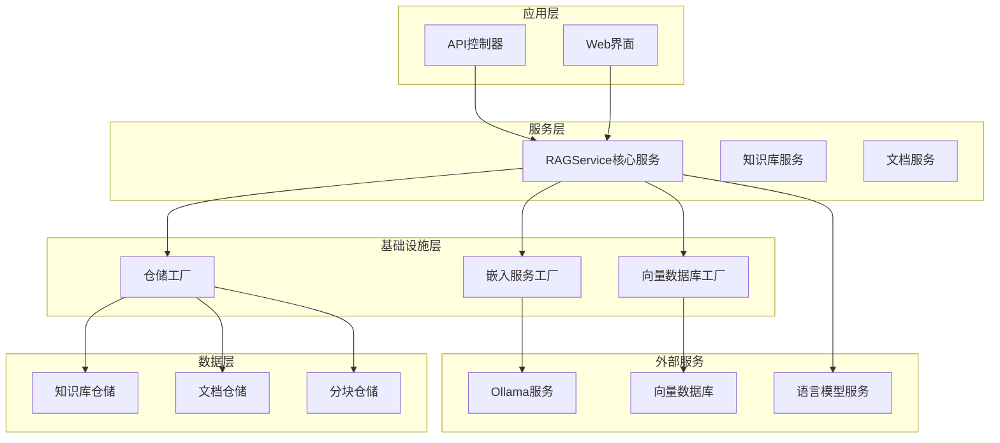
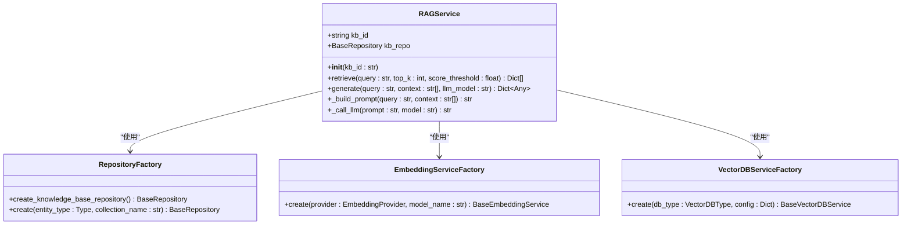
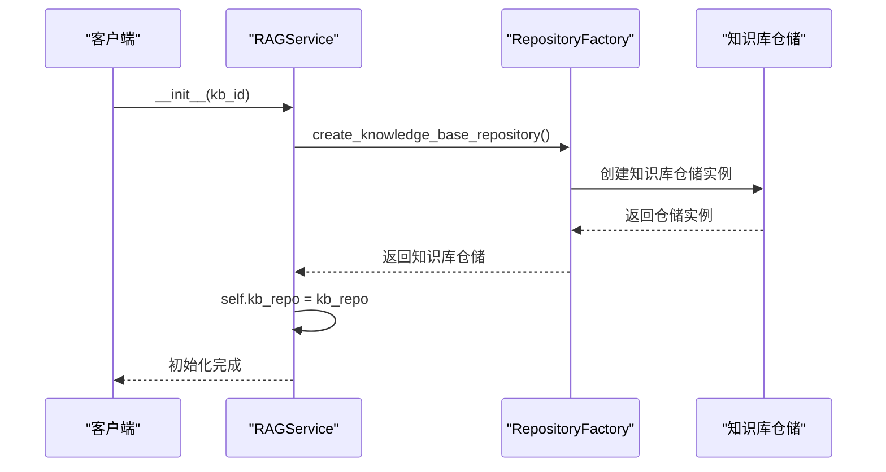
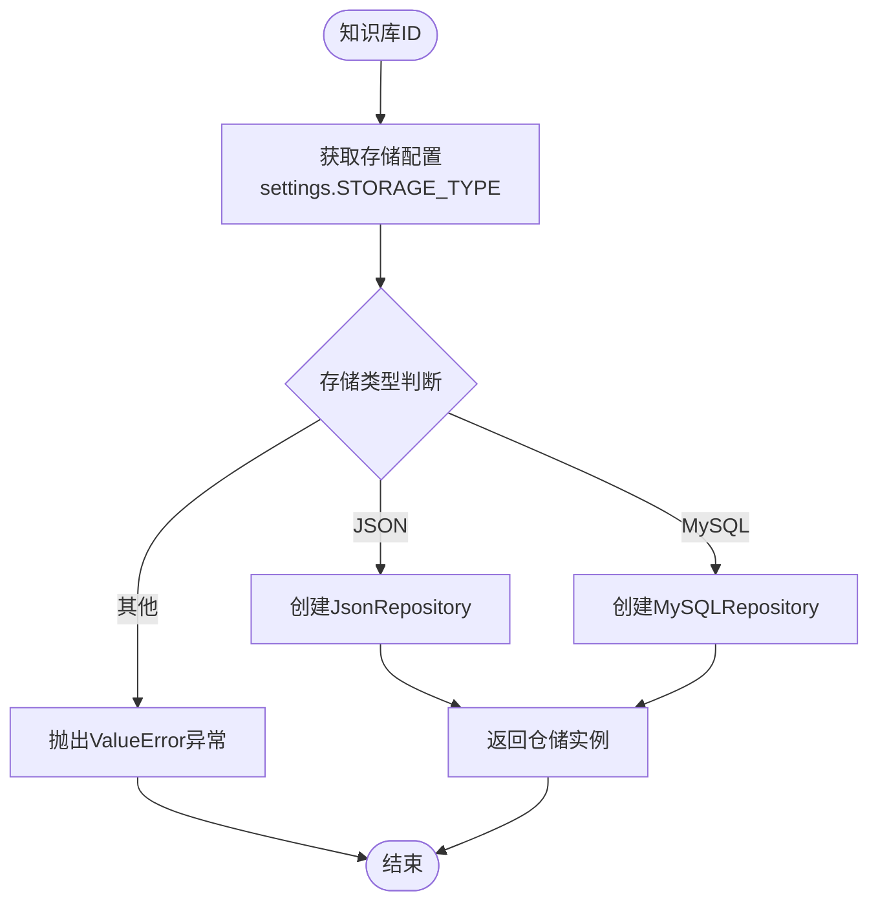
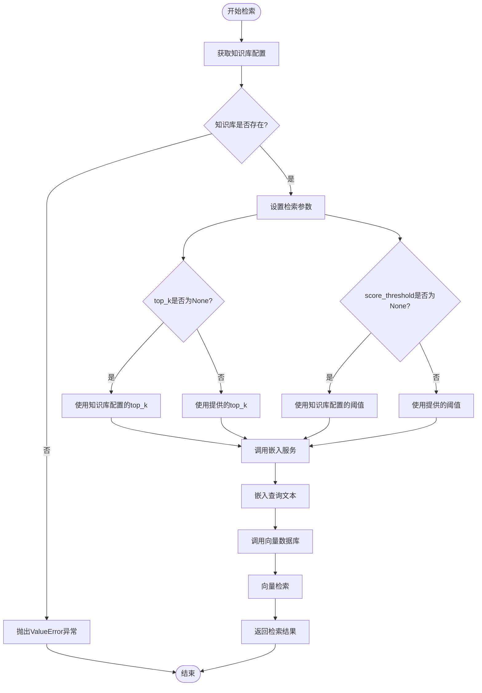
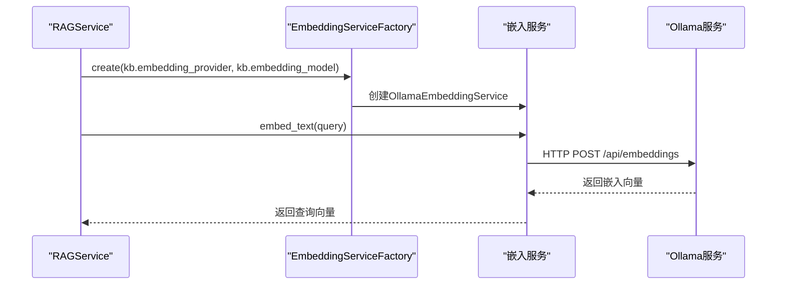
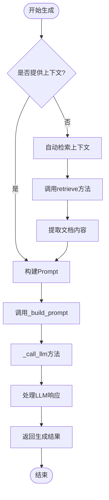
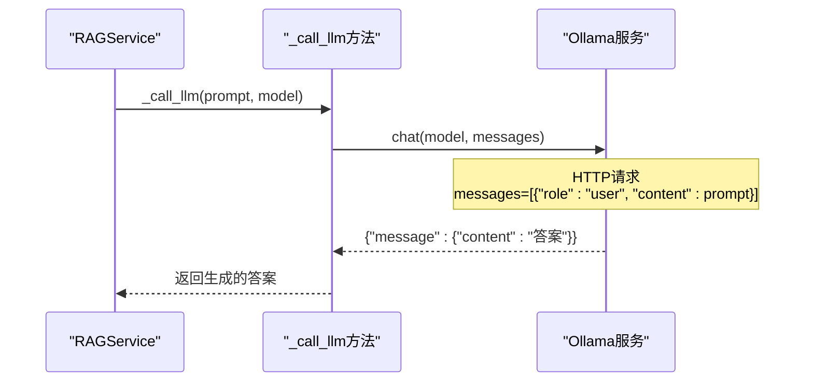
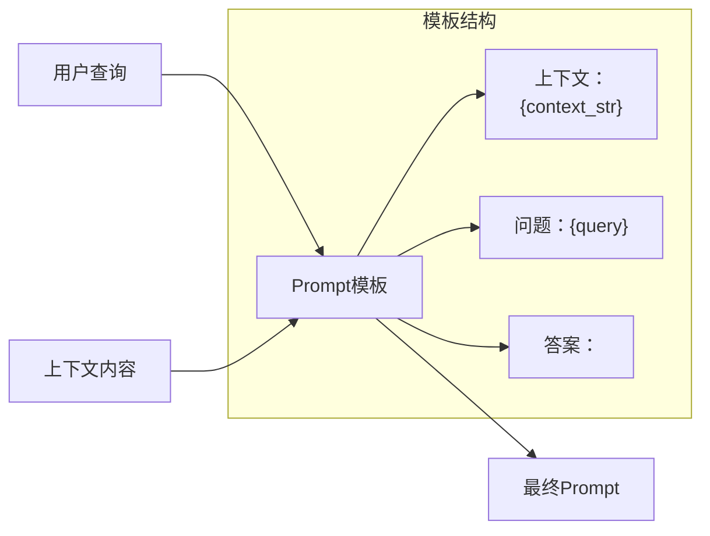

# RAG服务架构文档

<cite>
**本文档中引用的文件**
- [rag_service.py](file://backend/app/services/rag_service.py)
- [factory.py](file://backend/app/repositories/factory.py)
- [knowledge_base.py](file://backend/app/models/knowledge_base.py)
- [embedding_service.py](file://backend/app/services/embedding_service.py)
- [vector_db_service.py](file://backend/app/services/vector_db_service.py)
- [config.py](file://backend/app/config.py)
- [main.py](file://backend/app/main.py)
</cite>

## 目录
1. [简介](#简介)
2. [系统架构概览](#系统架构概览)
3. [RAGService核心类设计](#ragservice核心类设计)
4. [依赖注入机制](#依赖注入机制)
5. [检索功能实现](#检索功能实现)
6. [生成功能实现](#生成功能实现)
7. [Prompt模板设计](#prompt模板设计)
8. [扩展性设计](#扩展性设计)
9. [最佳实践指南](#最佳实践指南)
10. [总结](#总结)

## 简介

RAG-Studio是一个基于检索增强生成（Retrieval-Augmented Generation）技术的智能问答系统。本文档详细阐述了核心RAG服务的架构设计，重点分析`rag_service.py`中RAGService类的设计与实现，包括检索、生成、Prompt模板设计等关键组件。

该系统采用模块化架构，支持多种嵌入模型提供商（如Ollama）、向量数据库（如Qdrant、Elasticsearch）和LLM服务，具备良好的扩展性和灵活性。

## 系统架构概览

RAG服务的整体架构采用分层设计，包含以下几个核心层次：



**图表来源**
- [rag_service.py](file://backend/app/services/rag_service.py#L1-L165)
- [factory.py](file://backend/app/repositories/factory.py#L1-L116)

## RAGService核心类设计

### 类结构与职责

RAGService是整个RAG系统的核心服务类，负责整合检索和生成功能。其设计遵循单一职责原则，主要包含以下核心方法：



**图表来源**
- [rag_service.py](file://backend/app/services/rag_service.py#L13-L165)
- [factory.py](file://backend/app/repositories/factory.py#L17-L116)

### 初始化流程

RAGService的初始化过程体现了依赖注入的设计模式：



**图表来源**
- [rag_service.py](file://backend/app/services/rag_service.py#L19-L28)

**章节来源**
- [rag_service.py](file://backend/app/services/rag_service.py#L13-L28)

## 依赖注入机制

### RepositoryFactory的作用

RepositoryFactory采用工厂模式实现仓储的动态创建，支持JSON和MySQL两种存储后端：



**图表来源**
- [factory.py](file://backend/app/repositories/factory.py#L23-L48)

### 动态知识库配置注入

RAGService通过RepositoryFactory注入知识库仓储，实现了运行时的动态配置：

| 配置项 | 类型 | 描述 | 默认值 |
|--------|------|------|--------|
| kb_id | string | 知识库唯一标识符 | 必需 |
| embedding_provider | EmbeddingProvider | 嵌入模型提供商 | OLLAMA |
| embedding_model | string | 嵌入模型名称 | nomic-embed-text |
| vector_db_type | VectorDBType | 向量数据库类型 | QDRANT |
| retrieval_top_k | int | 检索返回数量 | 5 |
| retrieval_score_threshold | float | 检索分数阈值 | 0.7 |

**章节来源**
- [rag_service.py](file://backend/app/services/rag_service.py#L19-L28)
- [factory.py](file://backend/app/repositories/factory.py#L50-L54)
- [knowledge_base.py](file://backend/app/models/knowledge_base.py#L25-L80)

## 检索功能实现

### 检索流程设计

RAGService的retrieve方法实现了完整的检索流程，支持动态参数配置：



**图表来源**
- [rag_service.py](file://backend/app/services/rag_service.py#L29-L81)

### 嵌入服务集成

检索过程中的嵌入服务选择完全基于知识库配置：



**图表来源**
- [rag_service.py](file://backend/app/services/rag_service.py#L65-L78)
- [embedding_service.py](file://backend/app/services/embedding_service.py#L228-L255)

### 向量数据库选择

系统支持多种向量数据库，通过VectorDBServiceFactory实现动态选择：

| 数据库类型 | 特点 | 适用场景 |
|------------|------|----------|
| Qdrant | 高性能、支持稀疏向量 | 生产环境、大规模数据 |
| Elasticsearch | 搜索引擎友好、混合检索 | 结构化搜索需求 |
| Milvus | 分布式、高可用 | 企业级部署 |
| 自定义 | 灵活扩展 | 特殊需求定制 |

**章节来源**
- [rag_service.py](file://backend/app/services/rag_service.py#L29-L81)
- [embedding_service.py](file://backend/app/services/embedding_service.py#L48-L257)
- [vector_db_service.py](file://backend/app/services/vector_db_service.py#L1089-L1111)

## 生成功能实现

### 生成流程架构

generate方法实现了完整的答案生成流程，支持自动检索和手动上下文：



**图表来源**
- [rag_service.py](file://backend/app/services/rag_service.py#L83-L123)

### LLM服务集成

当前系统支持Ollama作为LLM服务提供商，未来可扩展其他服务：



**图表来源**
- [rag_service.py](file://backend/app/services/rag_service.py#L146-L163)

**章节来源**
- [rag_service.py](file://backend/app/services/rag_service.py#L83-L123)

## Prompt模板设计

### Prompt构建策略

RAGService采用简洁而有效的Prompt模板设计原则：



**图表来源**
- [rag_service.py](file://backend/app/services/rag_service.py#L125-L144)

### 上下文拼接策略

上下文的拼接采用了简单而高效的方式：

| 拼接方式 | 优势 | 适用场景 |
|----------|------|----------|
| `\n\n`分隔 | 清晰的段落分隔 | 多个独立文档 |
| 顺序拼接 | 保持原始顺序 | 时间序列文档 |
| 智能合并 | 减少重复信息 | 相关性强的文档 |

### Prompt模板优化建议

为了进一步提升生成质量，可以考虑以下优化方向：

1. **多轮对话支持**：添加历史对话上下文
2. **领域特定指令**：针对不同领域的专业术语
3. **输出格式控制**：指定答案格式要求
4. **置信度评估**：添加置信度评分

**章节来源**
- [rag_service.py](file://backend/app/services/rag_service.py#L125-L144)

## 扩展性设计

### 新模型集成指南

#### 添加新的嵌入模型提供商

1. **继承BaseEmbeddingService**：
   ```python
   class NewEmbeddingService(BaseEmbeddingService):
       async def embed_text(self, text: str) -> List[float]:
           # 实现具体的嵌入逻辑
           pass
       
       async def embed_texts(self, texts: List[str]) -> List[List[float]]:
           # 实现批量嵌入
           pass
   ```

2. **更新工厂类**：
   ```python
   class EmbeddingServiceFactory:
       @staticmethod
       def create(provider: EmbeddingProvider, model_name: str):
           if provider == EmbeddingProvider.NEW_PROVIDER:
               return NewEmbeddingService(model_name)
           # ... 其他提供商
   ```

#### 添加新的向量数据库

1. **继承BaseVectorDBService**：
   ```python
   class NewVectorDBService(BaseVectorDBService):
       async def search(self, collection_name: str, query_vector: List[float], 
                       top_k: int = 5, score_threshold: float = 0.0):
           # 实现向量检索逻辑
           pass
   ```

2. **更新工厂类**：
   ```python
   class VectorDBServiceFactory:
       @staticmethod
       def create(db_type: VectorDBType, config: Dict):
           if db_type == VectorDBType.NEW_DB:
               return NewVectorDBService(config)
           # ... 其他数据库
   ```

### Prompt模板扩展

#### 多模板支持

```python
class PromptTemplateManager:
    TEMPLATES = {
        "basic": "基于以下上下文回答问题。\n\n上下文：{context}\n\n问题：{query}\n\n答案：",
        "detailed": "请仔细阅读提供的上下文信息，然后回答问题。\n\n上下文：{context}\n\n问题：{query}\n\n回答：",
        "concise": "{context}\n\n问题：{query}\n\n答案："
    }
    
    @classmethod
    def get_template(cls, template_name: str, query: str, context: List[str]) -> str:
        template = cls.TEMPLATES.get(template_name, cls.TEMPLATES["basic"])
        context_str = "\n\n".join(context)
        return template.format(context=context_str, query=query)
```

#### 动态模板配置

```python
class DynamicPromptBuilder:
    def __init__(self, kb_config: KnowledgeBase):
        self.config = kb_config
    
    def build_prompt(self, query: str, context: List[str]) -> str:
        # 根据知识库配置动态调整Prompt
        if self.config.domain_specific:
            return self._build_domain_prompt(query, context)
        else:
            return self._build_general_prompt(query, context)
```

**章节来源**
- [embedding_service.py](file://backend/app/services/embedding_service.py#L18-L257)
- [vector_db_service.py](file://backend/app/services/vector_db_service.py#L31-L1111)

## 最佳实践指南

### 性能优化建议

1. **并发控制**：
   - 嵌入服务使用信号量限制并发请求数
   - 合理设置batch_size参数

2. **缓存策略**：
   - 缓存频繁查询的嵌入向量
   - 缓存检索结果以减少重复计算

3. **资源管理**：
   - 及时释放向量数据库连接
   - 监控内存使用情况

### 错误处理最佳实践

```python
async def robust_retrieve(self, query: str, max_retries: int = 3):
    for attempt in range(max_retries):
        try:
            return await self.retrieve(query)
        except Exception as e:
            if attempt == max_retries - 1:
                logger.error(f"检索失败，达到最大重试次数: {e}")
                raise
            await asyncio.sleep(2 ** attempt)  # 指数退避
```

### 配置管理

1. **环境变量配置**：
   - 使用Pydantic Settings进行类型安全配置
   - 支持多种配置文件格式

2. **动态配置更新**：
   - 支持运行时更新知识库配置
   - 实现配置热加载机制

### 测试策略

1. **单元测试**：
   - Mock外部服务依赖
   - 测试各种边界条件

2. **集成测试**：
   - 测试完整的RAG流程
   - 验证不同配置组合

3. **性能测试**：
   - 测试高并发场景
   - 监控响应时间和吞吐量

## 总结

RAG-Studio的RAGService设计体现了现代软件架构的最佳实践：

### 核心优势

1. **模块化设计**：清晰的职责分离，便于维护和扩展
2. **依赖注入**：灵活的配置管理和测试友好性
3. **工厂模式**：支持多种服务提供商的动态选择
4. **异步架构**：高性能的并发处理能力
5. **配置驱动**：基于知识库配置的动态行为

### 技术亮点

- **多提供商支持**：嵌入模型、向量数据库、LLM服务的灵活切换
- **智能检索**：基于知识库配置的个性化检索策略
- **可扩展架构**：易于添加新功能和第三方服务
- **生产就绪**：完善的错误处理和性能优化

### 发展方向

1. **多模态支持**：扩展图像、音频等多模态内容处理
2. **实时更新**：支持知识库的实时增量更新
3. **智能路由**：基于查询类型的智能服务选择
4. **成本优化**：智能的资源调度和成本控制

该架构为构建企业级RAG应用提供了坚实的基础，同时保持了足够的灵活性以适应未来的技术发展和业务需求变化。