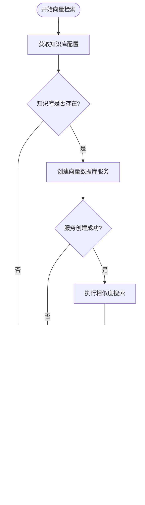

# 检索集成

<cite>
**本文档中引用的文件**
- [retrieval_service.py](file://backend/app/services/retrieval_service.py)
- [embedding_service.py](file://backend/app/services/embedding_service.py)
- [vector_db_service.py](file://backend/app/services/vector_db_service.py)
- [knowledge_base.py](file://backend/app/models/knowledge_base.py)
- [knowledge_base.py](file://backend/app/services/knowledge_base.py)
- [knowledge_base.py](file://backend/app/schemas/knowledge_base.py)
</cite>

## 目录
1. [简介](#简介)
2. [项目结构](#项目结构)
3. [核心组件](#核心组件)
4. [架构概览](#架构概览)
5. [详细组件分析](#详细组件分析)
6. [依赖关系分析](#依赖关系分析)
7. [性能考虑](#性能考虑)
8. [故障排除指南](#故障排除指南)
9. [结论](#结论)

## 简介

RAG（检索增强生成）服务中的检索集成模块是一个复杂的系统，负责通过知识库ID获取配置参数并完成向量检索的全流程。该系统集成了EmbeddingServiceFactory和VectorDBServiceFactory，支持多种向量数据库（Qdrant、Elasticsearch、Milvus）和嵌入模型提供商（Ollama、Custom），为用户提供灵活且高效的检索能力。

本文档重点阐述retrieve方法的实现机制，包括如何通过知识库ID获取配置参数（如retrieval_top_k和retrieval_score_threshold），以及如何集成各种服务完成查询向量化与向量检索的完整流程。

## 项目结构

RAG服务的检索功能主要分布在以下关键模块中：


**图表来源**
- [retrieval_service.py](file://backend/app/services/retrieval_service.py#L136-L142)
- [embedding_service.py](file://backend/app/services/embedding_service.py#L224-L255)
- [vector_db_service.py](file://backend/app/services/vector_db_service.py#L1089-L1111)

**章节来源**
- [retrieval_service.py](file://backend/app/services/retrieval_service.py#L1-L50)
- [embedding_service.py](file://backend/app/services/embedding_service.py#L1-L30)
- [vector_db_service.py](file://backend/app/services/vector_db_service.py#L1-L50)

## 核心组件

### RetrievalService 类

RetrievalService 是检索功能的核心控制器，提供多种检索策略：

- **向量检索**：基于稠密向量的相似度搜索
- **关键词检索**：基于BM25算法的关键词匹配
- **混合检索**：向量检索与关键词检索的融合
- **高级混合检索**：支持多种检索方式的组合

### 配置参数管理

系统通过知识库配置管理检索参数：

| 参数名称 | 类型 | 默认值 | 描述 |
|---------|------|--------|------|
| retrieval_top_k | int | 5 | 检索返回的数量 |
| retrieval_score_threshold | float | 0.7 | 检索分数阈值 |
| embedding_model | str | - | 嵌入模型名称 |
| embedding_dimension | int | 768 | 向量维度 |
| vector_db_type | VectorDBType | - | 向量数据库类型 |

**章节来源**
- [retrieval_service.py](file://backend/app/services/retrieval_service.py#L136-L216)
- [knowledge_base.py](file://backend/app/models/knowledge_base.py#L47-L54)

## 架构概览

检索系统的整体架构采用工厂模式和服务组合的方式：


**图表来源**
- [retrieval_service.py](file://backend/app/services/retrieval_service.py#L143-L216)
- [embedding_service.py](file://backend/app/services/embedding_service.py#L224-L255)
- [vector_db_service.py](file://backend/app/services/vector_db_service.py#L1089-L1111)

## 详细组件分析

### 向量检索实现

向量检索是检索系统的核心功能，其实现包含以下关键步骤：

#### 1. 知识库配置获取



**图表来源**
- [retrieval_service.py](file://backend/app/services/retrieval_service.py#L164-L216)

#### 2. 嵌入服务工厂创建

系统通过EmbeddingServiceFactory根据知识库配置动态选择嵌入模型：


**图表来源**
- [embedding_service.py](file://backend/app/services/embedding_service.py#L224-L255)
- [embedding_service.py](file://backend/app/services/embedding_service.py#L18-L46)

#### 3. 向量数据库服务工厂

VectorDBServiceFactory负责根据向量数据库类型创建相应服务：


**图表来源**
- [vector_db_service.py](file://backend/app/services/vector_db_service.py#L1089-L1111)
- [vector_db_service.py](file://backend/app/services/vector_db_service.py#L31-L84)

**章节来源**
- [retrieval_service.py](file://backend/app/services/retrieval_service.py#L143-L216)
- [embedding_service.py](file://backend/app/services/embedding_service.py#L224-L255)
- [vector_db_service.py](file://backend/app/services/vector_db_service.py#L1089-L1111)

### 被注释检索逻辑的设计意图

在代码的第64-78行，存在被注释的检索逻辑，其设计意图如下：

#### 设计意图分析

1. **动态模型选择**：根据知识库配置动态选择嵌入模型和服务
2. **参数优先级控制**：支持输入参数覆盖配置默认值
3. **异常处理机制**：提供完善的错误处理和回退策略
4. **服务集成优化**：确保各服务间的无缝集成

#### 实现要点


**图表来源**
- [retrieval_service.py](file://backend/app/services/retrieval_service.py#L458-L537)

**章节来源**
- [retrieval_service.py](file://backend/app/services/retrieval_service.py#L458-L537)

### 混合检索策略

系统提供多种混合检索策略以满足不同场景需求：

#### 1. 基础混合检索


**图表来源**
- [retrieval_service.py](file://backend/app/services/retrieval_service.py#L458-L537)

#### 2. 高级混合检索

高级混合检索支持多种检索方式的组合，包括：

- **稠密向量检索**：基于语义相似度
- **稀疏向量检索**：基于关键词匹配  
- **关键词检索**：基于BM25算法

**章节来源**
- [retrieval_service.py](file://backend/app/services/retrieval_service.py#L538-L656)

### 异常处理机制

系统实现了完善的异常处理机制：

#### 1. 知识库不存在处理

```python
# 检查知识库是否存在
kb = await self.kb_service.get_knowledge_base(kb_id)
if not kb:
    logger.warning(f"知识库不存在: {kb_id}")
    return []
```

#### 2. 服务创建失败处理

```python
try:
    vector_db_service = VectorDBServiceFactory.create(
        kb.vector_db_type,
        config=kb.vector_db_config if kb.vector_db_config else None
    )
except Exception as e:
    logger.error(f"创建向量数据库服务失败: {e}")
    return []
```

#### 3. 检索执行失败处理

```python
try:
    search_results = await vector_db_service.search(
        collection_name=kb_id,
        query_vector=query_vector,
        top_k=top_k,
        score_threshold=score_threshold
    )
except Exception as e:
    logger.error(f"向量检索失败: {e}")
    return []
```

**章节来源**
- [retrieval_service.py](file://backend/app/services/retrieval_service.py#L164-L216)

## 依赖关系分析

检索系统的依赖关系呈现清晰的层次结构：


**图表来源**
- [retrieval_service.py](file://backend/app/services/retrieval_service.py#L136-L142)
- [vector_db_service.py](file://backend/app/services/vector_db_service.py#L1089-L1111)
- [embedding_service.py](file://backend/app/services/embedding_service.py#L224-L255)

**章节来源**
- [retrieval_service.py](file://backend/app/services/retrieval_service.py#L1-L50)
- [vector_db_service.py](file://backend/app/services/vector_db_service.py#L1-L50)
- [embedding_service.py](file://backend/app/services/embedding_service.py#L1-L50)

## 性能考虑

### 1. 并发处理优化

系统采用异步编程模式处理并发请求：

- **嵌入服务并发**：OllamaEmbeddingService使用信号量限制并发数
- **批量操作**：支持批量嵌入和向量插入
- **异步检索**：所有数据库操作均为异步执行

### 2. 缓存策略

- **服务实例缓存**：避免重复创建相同配置的服务实例
- **配置缓存**：缓存知识库配置以减少数据库查询

### 3. 参数优化

- **top_k调整**：根据融合算法需求调整初始检索数量
- **score_threshold**：设置合理的分数阈值过滤低质量结果
- **权重分配**：根据业务需求调整不同检索方式的权重

## 故障排除指南

### 常见问题及解决方案

#### 1. 知识库不存在

**症状**：检索返回空结果，日志显示"知识库不存在"警告

**解决方案**：
- 检查知识库ID是否正确
- 验证知识库是否已创建
- 确认知识库状态为激活

#### 2. 嵌入服务连接失败

**症状**：Ollama API调用失败，超时或连接错误

**解决方案**：
- 检查Ollama服务是否运行
- 验证网络连接
- 检查API密钥配置

#### 3. 向量数据库连接失败

**症状**：向量检索失败，服务创建异常

**解决方案**：
- 检查数据库服务状态
- 验证连接配置
- 确认数据库权限

#### 4. 检索结果质量问题

**症状**：检索结果相关性低或分数异常

**解决方案**：
- 调整score_threshold参数
- 优化embedding模型选择
- 检查知识库配置参数

**章节来源**
- [retrieval_service.py](file://backend/app/services/retrieval_service.py#L164-L216)
- [embedding_service.py](file://backend/app/services/embedding_service.py#L100-L135)
- [vector_db_service.py](file://backend/app/services/vector_db_service.py#L220-L260)

## 结论

RAG服务的检索集成模块通过精心设计的架构和完善的异常处理机制，为用户提供了强大而可靠的检索能力。系统的主要优势包括：

1. **灵活性**：支持多种嵌入模型和向量数据库
2. **可扩展性**：模块化设计便于功能扩展
3. **可靠性**：完善的异常处理和回退机制
4. **性能**：异步处理和并发优化

通过合理配置知识库参数和检索策略，开发者可以构建满足特定业务需求的智能检索系统。建议在实际部署时根据具体场景调整参数配置，并建立完善的监控和日志体系以确保系统稳定运行。