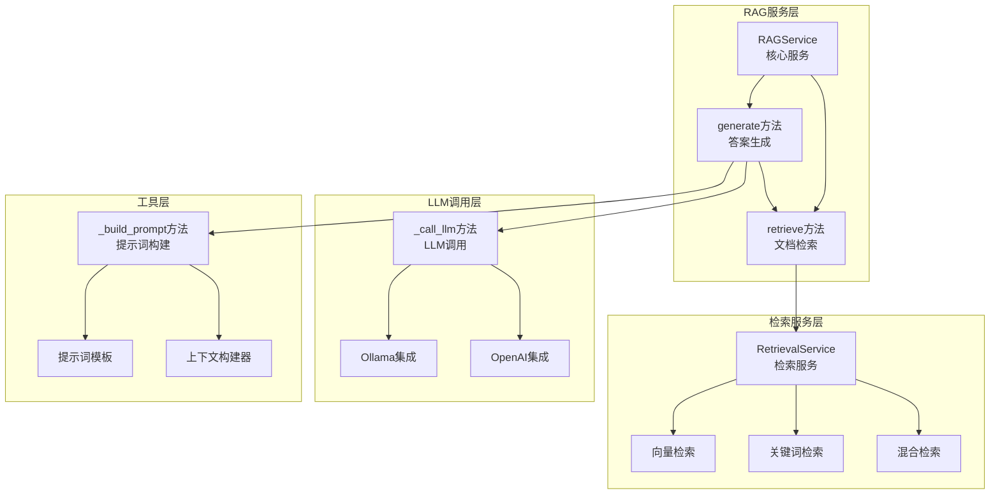
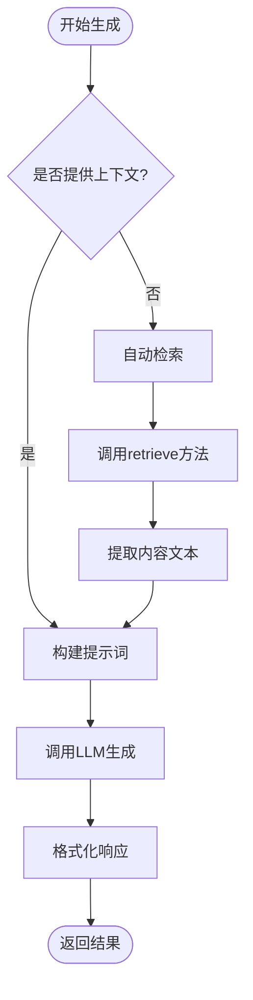
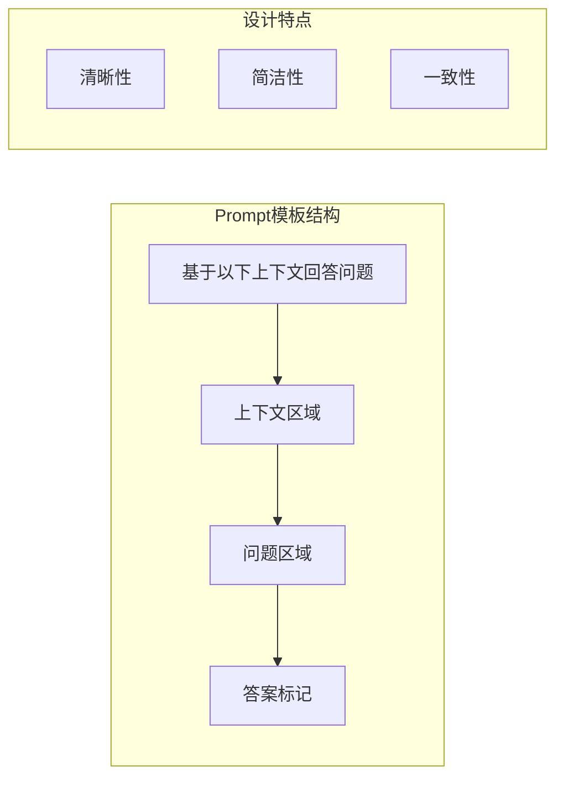
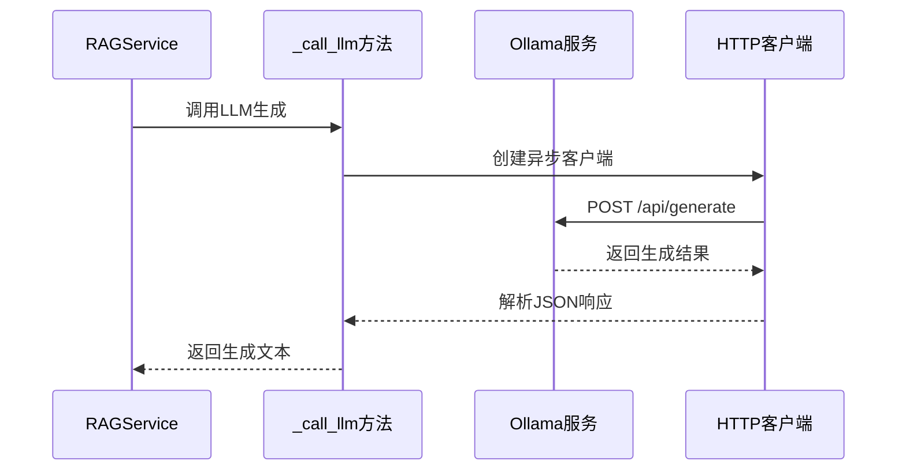
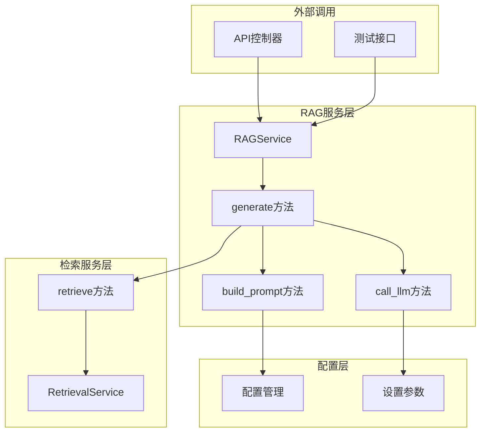

# 答案生成

<cite>
**本文档引用的文件**
- [rag_service.py](file://backend/app/services/rag_service.py)
- [debug_pipeline.py](file://backend/app/controllers/debug_pipeline.py)
- [retrieval_service.py](file://backend/app/services/retrieval_service.py)
- [pipeline.py](file://backend/app/controllers/pipeline.py)
- [config.py](file://backend/app/config.py)
- [evaluation_task.py](file://backend/app/services/evaluation_task.py)
</cite>

## 目录
1. [简介](#简介)
2. [系统架构概览](#系统架构概览)
3. [generate方法详解](#generate方法详解)
4. [自动上下文获取机制](#自动上下文获取机制)
5. [_build_prompt方法分析](#_build_prompt方法分析)
6. [_call_llm方法实现](#_call_llm方法实现)
7. [组件协作关系](#组件协作关系)
8. [扩展指南](#扩展指南)
9. [最佳实践](#最佳实践)
10. [故障排除](#故障排除)

## 简介

RAG（Retrieval-Augmented Generation）服务的核心功能是通过检索相关文档片段来增强大语言模型的回答质量。本文档深入分析generate方法的答案生成流程，重点关注其自动上下文获取机制、prompt模板设计原则以及LLM调用接口的实现。

generate方法作为RAG服务的主要入口点，实现了完整的答案生成工作流程：当context参数未提供时，自动调用retrieve方法获取检索结果，并将其转换为文本列表构建结构化提示词，最终传递给大语言模型生成答案。

## 系统架构概览

RAG服务采用模块化设计，主要包含以下几个核心组件：



**图表来源**
- [rag_service.py](file://backend/app/services/rag_service.py#L13-L165)
- [retrieval_service.py](file://backend/app/services/retrieval_service.py#L136-L854)
- [debug_pipeline.py](file://backend/app/controllers/debug_pipeline.py#L1729-L1786)

## generate方法详解

generate方法是RAG服务的核心入口，负责协调整个答案生成流程。该方法接受查询文本、可选的上下文列表和LLM模型名称作为输入参数。

### 方法签名与参数

```python
async def generate(
    self,
    query: str,
    context: List[str] = None,
    llm_model: str = None
) -> Dict[str, Any]:
```

### 核心处理流程

generate方法遵循以下处理逻辑：



**图表来源**
- [rag_service.py](file://backend/app/services/rag_service.py#L83-L123)

### 返回结果结构

generate方法返回一个包含以下关键信息的字典：

| 字段名 | 类型 | 描述 |
|--------|------|------|
| query | str | 原始查询问题 |
| answer | str | 生成的答案 |
| context | List[str] | 使用的上下文列表 |
| llm_model | str | 使用的LLM模型名称 |

**节来源**
- [rag_service.py](file://backend/app/services/rag_service.py#L83-L123)

## 自动上下文获取机制

当调用generate方法时，如果未提供context参数，系统会自动触发检索机制来获取相关文档片段。

### 检索触发条件

```python
# 如果没有提供context，先检索
if context is None:
    retrieved_chunks = await self.retrieve(query)
    context = [chunk["content"] for chunk in retrieved_chunks]
```

### 检索结果处理

检索结果被转换为纯文本列表的过程包括：

1. **调用retrieve方法**：异步执行文档检索
2. **提取内容字段**：从检索结果中提取"content"字段
3. **构建文本列表**：将所有文档内容组织为列表格式

### 检索参数配置

检索过程会使用知识库的配置参数：

- **top_k**：默认使用知识库的retrieval_top_k设置
- **score_threshold**：默认使用知识库的retrieval_score_threshold设置

这种设计确保了检索行为的一致性和可配置性。

**节来源**
- [rag_service.py](file://backend/app/services/rag_service.py#L107-L109)

## _build_prompt方法分析

_build_prompt方法负责将查询问题和上下文文档组合成适合LLM处理的提示词格式。

### 上下文拼接策略

```python
context_str = "\n\n".join(context)
```

该策略具有以下特点：

- **段落分隔**：使用双换行符分隔不同的文档片段
- **简洁性**：避免过多空白行影响LLM处理效率
- **可读性**：保持上下文的结构化展示

### Prompt模板设计原则

当前的prompt模板遵循以下设计原则：



**图表来源**
- [rag_service.py](file://backend/app/services/rag_service.py#L125-L144)

### 模板内容结构

完整的prompt模板包含以下部分：

1. **引导语**："基于以下上下文回答问题"
2. **上下文分隔**：双换行符分隔不同文档
3. **问题标识**："问题："前缀
4. **答案标记**："答案："后缀

这种结构有助于LLM准确识别输入的不同部分，提高生成质量。

**节来源**
- [rag_service.py](file://backend/app/services/rag_service.py#L125-L144)

## _call_llm方法实现

_call_llm方法预留了LLM调用的接口，目前实现了Ollama集成的基本功能。

### 当前实现状态

```python
# TODO: 实现
# 1. 连接LLM服务（Ollama或自研）
# 2. 发送请求
# 3. 处理响应
```

### Ollama集成实现

基于debug_pipeline中的call_llm方法，当前的实现包括：



**图表来源**
- [debug_pipeline.py](file://backend/app/controllers/debug_pipeline.py#L1729-L1786)

### LLM调用参数

_call_llm方法支持以下参数配置：

| 参数名 | 类型 | 默认值 | 描述 |
|--------|------|--------|------|
| prompt | str | 必需 | 提示词内容 |
| provider | str | "ollama" | LLM提供商 |
| model | str | "deepseek-r1:1.5b" | 模型名称 |
| temperature | float | 0.7 | 生成温度 |
| max_tokens | Optional[int] | None | 最大token数 |
| stream | bool | False | 是否流式输出 |

### 错误处理机制

当前实现包含了基本的错误处理：

1. **HTTP状态码检查**：验证API调用是否成功
2. **异常捕获**：捕获并记录调用过程中的异常
3. **降级处理**：返回"LLM调用失败"作为错误响应

**节来源**
- [rag_service.py](file://backend/app/services/rag_service.py#L146-L164)
- [debug_pipeline.py](file://backend/app/controllers/debug_pipeline.py#L1729-L1786)

## 组件协作关系

RAG服务的各个组件之间形成了清晰的协作关系，确保答案生成流程的顺畅执行。

### 组件交互图



**图表来源**
- [rag_service.py](file://backend/app/services/rag_service.py#L13-L165)
- [retrieval_service.py](file://backend/app/services/retrieval_service.py#L136-L854)
- [config.py](file://backend/app/config.py#L15-L99)

### 数据流转过程

答案生成过程中的数据流转遵循以下路径：

1. **输入阶段**：接收查询和可选上下文
2. **检索阶段**：根据查询检索相关文档
3. **处理阶段**：提取文档内容并构建提示词
4. **生成阶段**：调用LLM生成最终答案
5. **输出阶段**：返回结构化结果

### 异常传播机制

系统设计了清晰的异常传播路径：

- **检索异常**：传播到generate方法
- **提示词构建异常**：传播到generate方法  
- **LLM调用异常**：传播到generate方法
- **格式化异常**：传播到上层调用者

**节来源**
- [rag_service.py](file://backend/app/services/rag_service.py#L83-L123)

## 扩展指南

为了满足不同场景的需求，RAG服务提供了多个扩展点和定制选项。

### 自定义Prompt模板

可以通过修改_build_prompt方法来自定义提示词模板：

```python
def _build_prompt(self, query: str, context: List[str]) -> str:
    # 示例：添加更多上下文信息
    context_str = "\n\n".join([
        f"文档 {i+1}: {content}" 
        for i, content in enumerate(context)
    ])
    
    # 自定义模板结构
    prompt = f"""请基于以下参考资料回答问题：

参考资料：
{context_str}

问题：{query}

请确保答案准确且完整，如果参考资料中没有相关信息，请明确说明。

答案："""
    
    return prompt
```

### 集成不同LLM API

#### OpenAI集成示例

```python
async def _call_llm_openai(self, prompt: str, model: str = None) -> str:
    import openai
    
    try:
        client = openai.AsyncOpenAI(
            api_key=settings.OPENAI_API_KEY,
            base_url=settings.OPENAI_API_BASE
        )
        
        response = await client.chat.completions.create(
            model=model or settings.OPENAI_CHAT_MODEL,
            messages=[
                {"role": "system", "content": "你是一个专业的助手"},
                {"role": "user", "content": prompt}
            ],
            temperature=0.7,
            max_tokens=1000
        )
        
        return response.choices[0].message.content
        
    except Exception as e:
        logger.error(f"OpenAI调用失败: {e}")
        return "OpenAI调用失败"
```

#### 流式响应处理

```python
async def _call_llm_stream(self, prompt: str, model: str = None) -> str:
    import ollama
    
    response_text = ""
    try:
        response = ollama.chat(
            model=model or settings.OLLAMA_CHAT_MODEL,
            messages=[{"role": "user", "content": prompt}],
            stream=True
        )
        
        for chunk in response:
            if 'message' in chunk and 'content' in chunk['message']:
                content = chunk['message']['content']
                response_text += content
                # 可以在这里处理流式输出
                
        return response_text
        
    except Exception as e:
        logger.error(f"流式调用失败: {e}")
        return "流式调用失败"
```

### 错误回退机制

实现多层级的错误处理和回退策略：

```python
async def generate_with_fallback(
    self, 
    query: str, 
    context: List[str] = None, 
    llm_model: str = None
) -> Dict[str, Any]:
    try:
        # 主流程
        return await self.generate(query, context, llm_model)
        
    except Exception as primary_error:
        logger.warning(f"主流程失败: {primary_error}")
        
        try:
            # 备用流程：使用基础模型
            return await self.generate(query, context, "llama2:7b")
            
        except Exception as fallback_error:
            logger.error(f"备用流程也失败: {fallback_error}")
            
            # 最终降级：返回固定答案
            return {
                "query": query,
                "answer": "抱歉，当前无法生成答案，请稍后重试。",
                "context": context or [],
                "llm_model": llm_model or "fallback"
            }
```

### 性能优化建议

1. **上下文截断**：对于长上下文，实现智能截断
2. **缓存机制**：缓存常用的检索结果
3. **并发控制**：限制同时进行的LLM调用数量
4. **超时设置**：为LLM调用设置合理的超时时间

## 最佳实践

### Prompt模板优化

1. **明确角色定位**：在提示词中明确AI的角色和职责
2. **提供示例**：对于复杂任务，提供示例格式
3. **约束输出**：明确要求特定格式的输出
4. **错误处理**：指示如何处理未知情况

### 上下文管理

1. **相关性筛选**：只保留最相关的文档片段
2. **长度控制**：避免上下文过长导致的信息丢失
3. **去重处理**：移除重复的文档内容
4. **格式统一**：确保上下文格式的一致性

### LLM调用优化

1. **参数调优**：根据任务特性调整temperature等参数
2. **模型选择**：为不同类型的任务选择合适的模型
3. **成本控制**：监控token使用量和API调用成本
4. **质量保证**：建立生成质量的评估机制

## 故障排除

### 常见问题及解决方案

#### 检索结果为空

**问题描述**：调用generate方法时，检索结果为空

**可能原因**：
- 知识库中没有相关文档
- 检索阈值设置过高
- 查询与知识库内容不匹配

**解决方案**：
```python
# 调整检索参数
retrieved_chunks = await self.retrieve(
    query=query,
    top_k=20,  # 增加检索数量
    score_threshold=0.3  # 降低分数阈值
)
```

#### LLM调用失败

**问题描述**：_call_llm方法返回错误信息

**诊断步骤**：
1. 检查Ollama服务是否正常运行
2. 验证模型名称是否正确
3. 检查网络连接状态
4. 查看详细的错误日志

**解决方案**：
```python
# 添加详细的错误信息
try:
    response = await client.post(
        f"{settings.OLLAMA_BASE_URL}/api/generate",
        json=payload,
        timeout=30.0
    )
    
    if response.status_code != 200:
        logger.error(f"API响应错误: {response.status_code}, 内容: {await response.text()}")
        return "LLM调用失败"
        
except httpx.TimeoutException:
    logger.error("LLM调用超时")
    return "LLM调用超时"
```

#### 上下文构建异常

**问题描述**：构建提示词时出现异常

**解决方案**：
```python
def _build_prompt_safe(self, query: str, context: List[str]) -> str:
    try:
        # 验证输入
        if not context:
            return f"问题：{query}\n\n答案：没有可用的上下文信息。"
        
        # 截断过长的上下文
        max_context_length = 8000
        truncated_context = []
        remaining_length = max_context_length
        
        for doc in context:
            if len(doc) <= remaining_length:
                truncated_context.append(doc)
                remaining_length -= len(doc)
            else:
                truncated_context.append(doc[:remaining_length])
                break
        
        context_str = "\n\n".join(truncated_context)
        return f"""基于以下上下文回答问题。

上下文：
{context_str}

问题：{query}

答案："""
        
    except Exception as e:
        logger.error(f"提示词构建失败: {e}")
        return f"问题：{query}\n\n答案：提示词构建失败，请联系管理员。"
```

### 监控和日志

建议在生产环境中添加以下监控指标：

1. **检索成功率**：检索结果非空的比例
2. **生成响应时间**：从调用到返回结果的时间
3. **LLM调用成功率**：API调用成功的比例
4. **上下文长度分布**：不同长度上下文的使用频率
5. **错误类型统计**：各类错误的发生频率

通过这些指标可以及时发现和解决系统中的潜在问题。