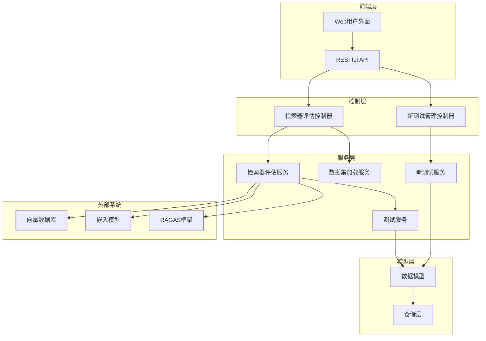
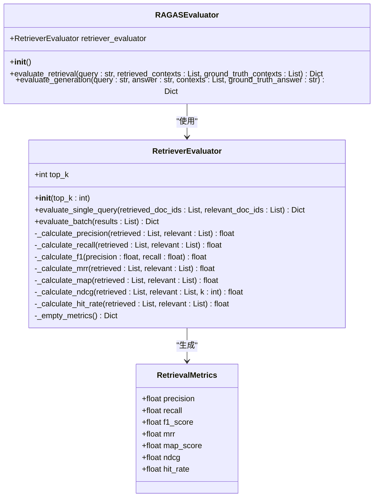
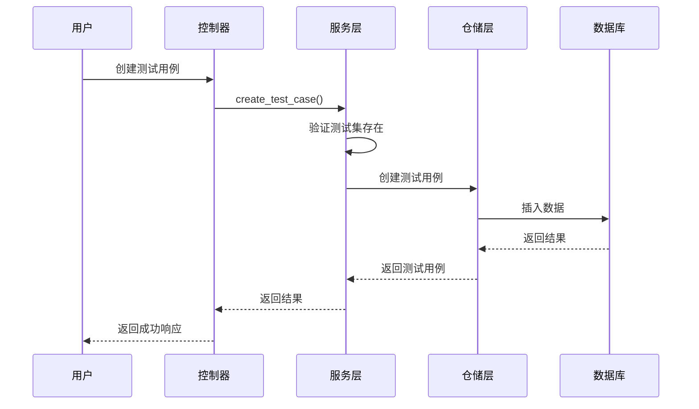
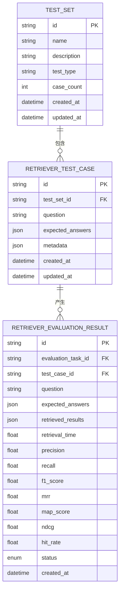
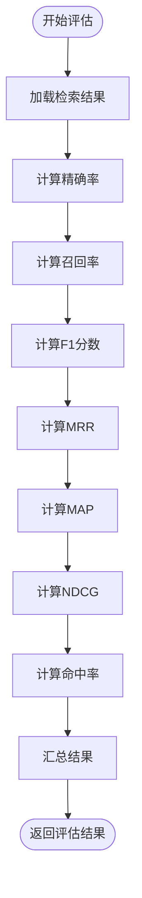
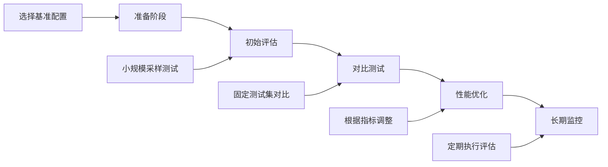

# 检索器测试用例服务

<cite>
**本文档引用的文件**
- [retriever_evaluation.py](file://backend/app/services/retriever_evaluation.py)
- [retriever_evaluation.py](file://backend/app/controllers/retriever_evaluation.py)
- [retriever_evaluation.py](file://backend/app/models/retriever_evaluation.py)
- [retriever_evaluation_repository.py](file://backend/app/repositories/retriever_evaluation_repository.py)
- [test.py](file://backend/app/schemas/test.py)
- [dataset_loader.py](file://backend/app/services/dataset_loader.py)
- [test_service.py](file://backend/app/services/test_service.py)
- [new_test_service.py](file://backend/app/services/new_test_service.py)
- [new_test_management.py](file://backend/app/controllers/new_test_management.py)
- [README_RETRIEVER_EVAL.md](file://backend/README_RETRIEVER_EVAL.md)
- [retriever-test-case-management.tsx](file://web/components/views/retriever-test-case-management.tsx)
</cite>

## 目录
1. [概述](#概述)
2. [系统架构](#系统架构)
3. [核心组件](#核心组件)
4. [数据模型](#数据模型)
5. [API接口](#api接口)
6. [评估指标](#评估指标)
7. [使用指南](#使用指南)
8. [最佳实践](#最佳实践)
9. [故障排除](#故障排除)
10. [总结](#总结)

## 概述

检索器测试用例服务是一个完整的检索器评估框架，专门用于测试和评估向量数据库选择、检索算法配置以及检索质量。该系统基于RAGAS评估框架和T2Ranking标准数据集，提供了全面的检索器性能评估能力。

### 主要功能特性

- **标准化数据集支持**：完全支持T2Ranking数据集导入和处理
- **多维度评估指标**：提供Precision、Recall、F1-Score、MRR、MAP、NDCG、Hit Rate等专业评估指标
- **灵活的测试配置**：支持多种向量数据库和嵌入模型的对比测试
- **完整的评估流程**：从数据导入到结果分析的全流程自动化
- **可视化界面**：提供Web界面进行测试用例管理和结果查看

## 系统架构



**架构图来源**
- [retriever_evaluation.py](file://backend/app/controllers/retriever_evaluation.py#L1-L375)
- [new_test_management.py](file://backend/app/controllers/new_test_management.py#L1-L280)

## 核心组件

### 检索器评估器 (RetrieverEvaluator)

检索器评估器是系统的核心组件，负责计算各种检索质量评估指标。



**类图来源**
- [retriever_evaluation.py](file://backend/app/services/retriever_evaluation.py#L14-L423)

### 测试用例管理系统

系统提供了完整的测试用例管理功能，支持检索器测试用例和生成测试用例的独立管理。



**序列图来源**
- [new_test_management.py](file://backend/app/controllers/new_test_management.py#L35-L71)
- [new_test_service.py](file://backend/app/services/new_test_service.py#L25-L62)

**章节来源**
- [retriever_evaluation.py](file://backend/app/services/retriever_evaluation.py#L26-L423)
- [new_test_management.py](file://backend/app/controllers/new_test_management.py#L1-L280)

## 数据模型

### 检索器测试用例模型



**实体关系图来源**
- [test.py](file://backend/app/models/test.py#L200-L400)
- [retriever_evaluation.py](file://backend/app/models/retriever_evaluation.py#L11-L60)

### 数据集模型

系统支持多种数据集格式，特别是T2Ranking标准数据集。

| 字段名 | 类型 | 描述 | 示例 |
|--------|------|------|------|
| collection_path | string | 文档集合文件路径 | `/path/to/collection.tsv` |
| queries_path | string | 查询文件路径 | `/path/to/queries.dev.tsv` |
| qrels_path | string | 相关性标注文件路径 | `/path/to/qrels.dev.tsv` |
| max_docs | int | 最大文档数量限制 | 10000 |
| max_queries | int | 最大查询数量限制 | 100 |

**章节来源**
- [test.py](file://backend/app/models/test.py#L200-L400)
- [dataset_loader.py](file://backend/app/services/dataset_loader.py#L14-L261)

## API接口

### 检索器评估API

| 接口 | 方法 | 说明 | 参数 |
|------|------|------|------|
| `/retriever-evaluation/dataset-statistics` | GET | 获取数据集统计信息 | collection_path, queries_path, qrels_path, max_docs, max_queries |
| `/retriever-evaluation/import-t2ranking` | POST | 导入T2Ranking数据集 | kb_id, test_set_name, collection_path, queries_path, qrels_path, max_docs, max_queries |
| `/retriever-evaluation/evaluate` | POST | 执行检索器评估 | kb_id, test_set_id, top_k, vector_db_type, embedding_provider, embedding_model |
| `/retriever-evaluation/evaluation-history` | GET | 获取评估历史 | kb_id, test_set_id, page, page_size |
| `/retriever-evaluation/compare-evaluations` | GET | 对比多个评估结果 | evaluation_ids |

### 新测试管理API

| 接口 | 方法 | 说明 | 参数 |
|------|------|------|------|
| `/tests/retriever/cases` | POST | 创建检索器测试用例 | test_set_id, question, expected_answers, metadata |
| `/tests/retriever/cases` | GET | 获取测试用例列表 | test_set_id, page, page_size |
| `/tests/retriever/cases/{case_id}` | GET | 获取测试用例详情 | case_id |
| `/tests/retriever/cases/{case_id}` | PUT | 更新测试用例 | case_id, question, expected_answers, metadata |
| `/tests/retriever/cases/{case_id}` | DELETE | 删除测试用例 | case_id |
| `/tests/retriever/cases/batch` | POST | 批量创建测试用例 | test_set_id, cases |
| `/tests/retriever/cases/batch` | DELETE | 批量删除测试用例 | case_ids |

**章节来源**
- [retriever_evaluation.py](file://backend/app/controllers/retriever_evaluation.py#L26-L375)
- [new_test_management.py](file://backend/app/controllers/new_test_management.py#L35-L280)

## 评估指标

### 核心评估指标

系统提供以下专业的检索器评估指标：

| 指标名称 | 英文名称 | 计算公式 | 说明 |
|----------|----------|----------|------|
| 精确率@K | Precision@K | | 检索结果中相关文档的比例 |
| 召回率@K | Recall@K | | 相关文档被检索到的比例 |
| F1分数 | F1-Score | 2 × (Precision × Recall) / (Precision + Recall) | 精确率和召回率的调和平均 |
| 平均倒数排名 | MRR | | 第一个相关文档的排名倒数 |
| 平均精度均值 | MAP | | 所有相关文档位置的平均精度 |
| 归一化折损累积增益 | NDCG | | 考虑排序位置的综合指标 |
| 命中率 | Hit Rate | | 至少检索到一个相关文档的查询比例 |

### 指标计算流程



**流程图来源**
- [retriever_evaluation.py](file://backend/app/services/retriever_evaluation.py#L38-L107)

**章节来源**
- [retriever_evaluation.py](file://backend/app/services/retriever_evaluation.py#L14-L107)
- [README_RETRIEVER_EVAL.md](file://backend/README_RETRIEVER_EVAL.md#L15-L22)

## 使用指南

### 快速开始

1. **安装依赖**
```bash
# 激活虚拟环境
source .venv/bin/activate

# 安装依赖
pip install -r requirements.txt
```

2. **准备数据集**
```bash
# T2Ranking数据集文件路径
collection_path: "/path/to/collection.tsv"
queries_path: "/path/to/queries.dev.tsv"
qrels_path: "/path/to/qrels.dev.tsv"
```

3. **导入数据集**
```bash
curl -X POST "http://localhost:8000/api/v1/retriever-evaluation/import-t2ranking" \
  -H "Content-Type: application/json" \
  -d '{
    "kb_id": "kb_t2ranking",
    "test_set_name": "T2Ranking检索测试集",
    "collection_path": "/path/to/collection.tsv",
    "queries_path": "/path/to/queries.dev.tsv",
    "qrels_path": "/path/to/qrels.dev.tsv",
    "max_docs": 10000,
    "max_queries": 100
  }'
```

4. **执行评估**
```bash
curl -X POST "http://localhost:8000/api/v1/retriever-evaluation/evaluate" \
  -H "Content-Type: application/json" \
  -d '{
    "kb_id": "kb_001",
    "test_set_id": "ts_001",
    "top_k": 10,
    "vector_db_type": "elasticsearch",
    "embedding_provider": "ollama",
    "embedding_model": "nomic-embed-text"
  }'
```

### 数据集优化策略

系统提供了多种数据集优化策略来处理大规模数据：

| 策略 | 参数 | 说明 | 推荐值 |
|------|------|------|--------|
| 文档采样 | max_docs | 最大文档数量限制 | 10000 |
| 查询采样 | max_queries | 最大查询数量限制 | 100-200 |
| 自动优化 | 自动 | 系统自动优化数据规模 | 默认启用 |

**章节来源**
- [README_RETRIEVER_EVAL.md](file://backend/README_RETRIEVER_EVAL.md#L50-L170)
- [dataset_loader.py](file://backend/app/services/dataset_loader.py#L226-L261)

## 最佳实践

### 评估流程建议



### 性能优化建议

1. **初始评估**
   - 使用小规模采样（50-100个查询）
   - 快速验证系统配置
   - 确定baseline性能

2. **对比测试**
   - 固定测试集
   - 变化单一参数（如embedding模型）
   - 记录每次评估结果

3. **性能优化**
   - 根据评估指标调整配置
   - 重点关注F1-Score和NDCG
   - 平衡精确率和召回率

4. **长期监控**
   - 定期执行评估
   - 追踪性能趋势
   - 及时发现性能退化

### 指标解读指南

| F1-Score范围 | 性能等级 | 建议行动 |
|-------------|----------|----------|
| > 0.7 | 优秀 | 维持现状 |
| 0.5-0.7 | 良好 | 可考虑优化 |
| < 0.5 | 需要优化 | 需要改进 |

**章节来源**
- [README_RETRIEVER_EVAL.md](file://backend/README_RETRIEVER_EVAL.md#L203-L270)

## 故障排除

### 常见问题及解决方案

1. **数据集导入失败**
   - 检查文件路径是否正确
   - 验证文件格式是否符合TSV规范
   - 确认文件编码为UTF-8

2. **评估结果异常**
   - 检查向量数据库连接
   - 验证嵌入模型可用性
   - 确认测试集配置正确

3. **性能问题**
   - 使用数据集采样功能
   - 优化查询和文档数量
   - 检查系统资源使用情况

### 调试工具

系统提供了多种调试和监控工具：

- **评估历史查询**：查看历史评估结果
- **评估对比功能**：对比多个配置的性能
- **详细结果分析**：深入分析单个测试用例

**章节来源**
- [retriever_evaluation.py](file://backend/app/controllers/retriever_evaluation.py#L297-L375)

## 总结

检索器测试用例服务提供了一个完整、专业的检索器评估解决方案。通过标准化的数据集支持、全面的评估指标、灵活的测试配置和直观的用户界面，该系统能够帮助开发者和研究人员有效地评估和优化检索系统的性能。

### 主要优势

1. **标准化**：基于T2Ranking等标准数据集
2. **专业性**：提供业界认可的评估指标
3. **灵活性**：支持多种配置和对比测试
4. **易用性**：提供完整的Web界面和API
5. **可扩展性**：支持自定义评估指标和数据集

### 发展方向

未来版本将重点实现以下功能：
- 完整的RAGAS框架集成
- 更多标准数据集支持
- 评估结果可视化
- 自动化A/B测试
- 分布式评估支持

该系统为RAG应用的质量保证提供了强有力的技术支撑，是构建高质量检索系统的重要工具。