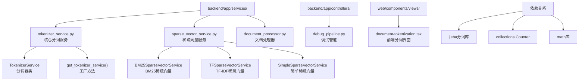
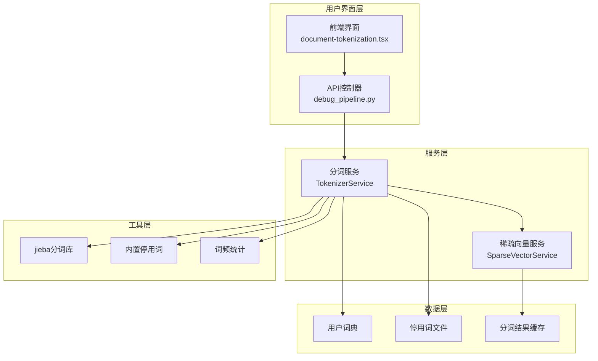
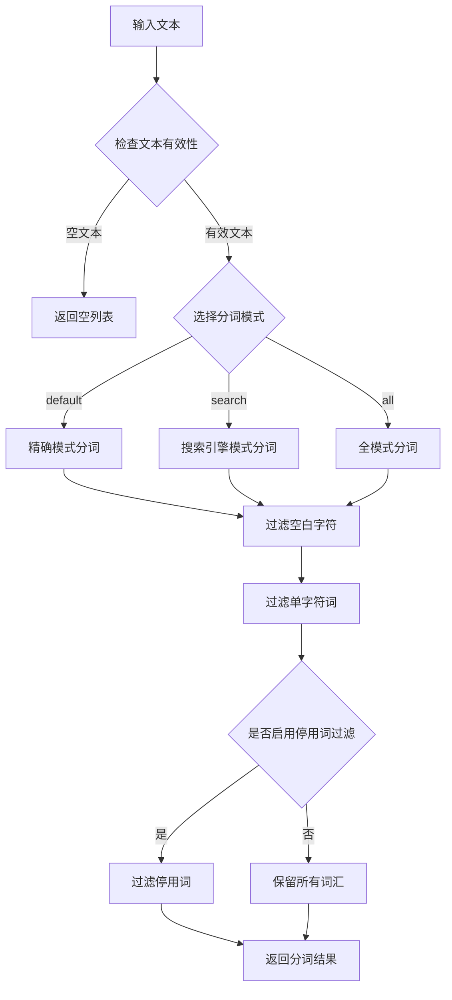
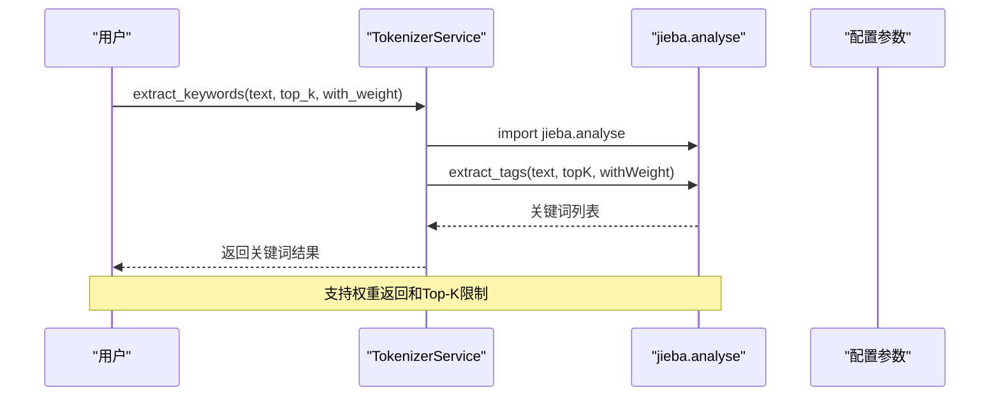
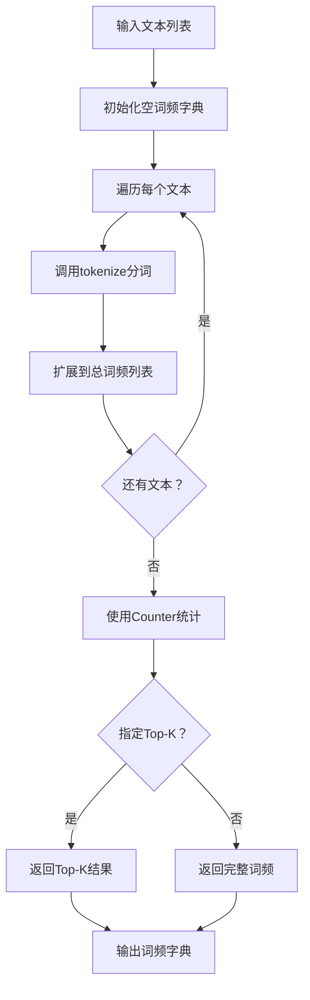
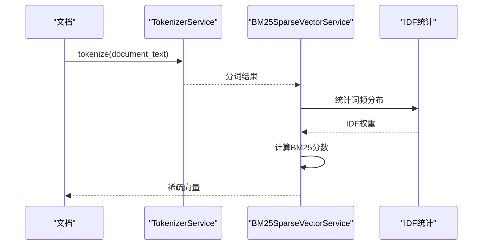

# RAG-Studio分词服务技术文档

<cite>
**本文档引用的文件**
- [tokenizer_service.py](file://backend/app/services/tokenizer_service.py)
- [sparse_vector_service.py](file://backend/app/services/sparse_vector_service.py)
- [document_processor.py](file://backend/app/services/document_processor.py)
- [debug_pipeline.py](file://backend/app/controllers/debug_pipeline.py)
- [document-tokenization.tsx](file://web/components/views/document-tokenization.tsx)
</cite>

## 目录
1. [简介](#简介)
2. [项目结构](#项目结构)
3. [核心组件](#核心组件)
4. [架构概览](#架构概览)
5. [详细组件分析](#详细组件分析)
6. [分词结果应用](#分词结果应用)
7. [扩展指导](#扩展指导)
8. [性能考虑](#性能考虑)
9. [故障排除指南](#故障排除指南)
10. [结论](#结论)

## 简介

RAG-Studio的分词服务是一个专为中文文本处理设计的综合性分词解决方案，基于jieba分词库构建。该服务不仅提供基础的中文分词功能，还集成了多种高级特性，包括停用词管理、关键词提取、词频统计、新词发现以及与稀疏向量生成系统的深度集成。

分词服务在整个RAG系统中扮演着关键角色，为后续的BM25计算、TF-IDF分析、稀疏向量生成等任务提供高质量的文本分割结果。通过灵活的配置选项和丰富的API接口，开发者可以轻松定制分词行为以满足不同应用场景的需求。

## 项目结构

RAG-Studio的分词服务主要分布在以下目录结构中：



**图表来源**
- [tokenizer_service.py](file://backend/app/services/tokenizer_service.py#L1-L277)
- [sparse_vector_service.py](file://backend/app/services/sparse_vector_service.py#L1-L331)

**章节来源**
- [tokenizer_service.py](file://backend/app/services/tokenizer_service.py#L1-L50)
- [sparse_vector_service.py](file://backend/app/services/sparse_vector_service.py#L1-L50)

## 核心组件

### TokenizerService类

TokenizerService是分词服务的核心类，提供了完整的中文分词功能。该类采用延迟加载机制，确保只有在实际使用时才加载jieba分词库，从而提高启动效率。

#### 主要特性

1. **多模式分词支持**
   - `default`：精确模式，适合文本分析
   - `search`：搜索引擎模式，适合检索场景  
   - `all`：全模式，速度快但可能冗余

2. **智能停用词过滤**
   - 内置中文常见停用词集合
   - 支持自定义停用词添加和移除
   - 支持从文件加载停用词

3. **高级分词功能**
   - 关键词提取（基于TF-IDF）
   - 词频统计
   - 新词发现（基于HMM）
   - 用户自定义词典支持

### 工厂方法get_tokenizer_service()

该方法实现了分词服务的单例模式，确保整个应用程序中只有一个分词器实例存在，既节省内存又保证一致性。

**章节来源**
- [tokenizer_service.py](file://backend/app/services/tokenizer_service.py#L13-L277)

## 架构概览

分词服务采用分层架构设计，清晰地分离了不同的职责：



**图表来源**
- [document-tokenization.tsx](file://web/components/views/document-tokenization.tsx#L10-L40)
- [debug_pipeline.py](file://backend/app/controllers/debug_pipeline.py#L307-L364)
- [tokenizer_service.py](file://backend/app/services/tokenizer_service.py#L13-L50)

## 详细组件分析

### 分词器实现机制

#### 中文分词处理

分词器的核心实现基于jieba分词库，支持三种不同的分词模式：



**图表来源**
- [tokenizer_service.py](file://backend/app/services/tokenizer_service.py#L54-L94)

#### 特殊字符处理策略

分词器实现了多层次的文本清理和过滤机制：

1. **空白字符处理**：自动去除首尾空白，避免产生无意义的空词
2. **单字符过滤**：过滤长度小于等于1的词，减少噪声
3. **停用词过滤**：根据配置决定是否过滤常见停用词
4. **编码兼容性**：支持UTF-8和GBK编码的文本处理

**章节来源**
- [tokenizer_service.py](file://backend/app/services/tokenizer_service.py#L54-L94)

### 关键词提取功能

分词器集成了jieba的关键词提取功能，支持基于TF-IDF的关键词识别：



**图表来源**
- [tokenizer_service.py](file://backend/app/services/tokenizer_service.py#L121-L158)

**章节来源**
- [tokenizer_service.py](file://backend/app/services/tokenizer_service.py#L121-L158)

### 词频统计与新词发现

#### 词频统计机制

词频统计功能通过遍历多个文本的分词结果来统计词汇出现频率：



**图表来源**
- [tokenizer_service.py](file://backend/app/services/tokenizer_service.py#L159-L189)

#### 新词发现算法

新词发现基于HMM（隐马尔可夫模型）分词，并结合词频统计：

1. **HMM分词**：使用jieba的HMM模式进行更细致的分词
2. **候选词筛选**：过滤掉低频词和短词
3. **排序输出**：按词频降序排列

**章节来源**
- [tokenizer_service.py](file://backend/app/services/tokenizer_service.py#L232-L275)

## 分词结果应用

### 在BM25计算中的应用

分词结果是BM25算法的基础输入，用于计算文档相似度：



**图表来源**
- [sparse_vector_service.py](file://backend/app/services/sparse_vector_service.py#L51-L156)

#### BM25计算流程

BM25算法的计算过程分为两个阶段：

1. **语料库统计阶段**：
   - 统计每个token在文档中的出现次数
   - 计算平均文档长度
   - 构建IDF权重矩阵

2. **查询处理阶段**：
   - 对查询文本进行分词
   - 计算TF（词频）和IDF（逆文档频率）
   - 应用BM25公式计算最终得分

**章节来源**
- [sparse_vector_service.py](file://backend/app/services/sparse_vector_service.py#L51-L156)

### 在token估算中的应用

文档处理器提供了粗略的token数量估算功能：

| 文本类型 | 估算规则 | 示例 |
|---------|---------|------|
| 中文字符 | 1字 ≈ 1.5 tokens | "你好世界" → 6 tokens |
| 英文单词 | 1词 ≈ 1 token | "hello world" → 2 tokens |
| 混合文本 | 中文×1.5 + 英文/4 | "你好hello" → 4.5 tokens |

这种估算方法为文档分块和资源规划提供了快速参考。

**章节来源**
- [document_processor.py](file://backend/app/services/document_processor.py#L235-L246)

## 扩展指导

### 集成第三方分词库

#### spaCy集成方案

要集成spaCy分词库，需要修改TokenizerService类：

```python
# 添加spaCy支持
def tokenize_with_spacy(self, text: str) -> List[str]:
    """使用spaCy进行英文分词"""
    try:
        import spacy
        if not hasattr(self, '_spacy_model'):
            self._spacy_model = spacy.load('en_core_web_sm')
        doc = self._spacy_model(text)
        return [token.text for token in doc if not token.is_punct and len(token.text) > 1]
    except ImportError:
        logger.error("spaCy未安装")
        return []
```

#### jieba扩展功能

对于jieba的高级功能扩展：

1. **自定义词典加载**：
   ```python
   def add_custom_dictionary(self, dict_path: str):
       """添加自定义词典"""
       self.jieba.load_userdict(dict_path)
   ```

2. **停用词动态管理**：
   ```python
   def update_stop_words(self, new_words: Set[str]):
       """更新停用词集合"""
       self.stop_words.update(new_words)
   ```

### 扩展新的分词算法

#### 实现自定义分词器

创建新的分词器类需要继承BaseSparseVectorService：

```python
class CustomSparseVectorService(BaseSparseVectorService):
    """自定义稀疏向量服务"""
    
    def __init__(self, custom_params: Dict):
        self.custom_params = custom_params
        self.tokenizer = get_tokenizer_service()
    
    def generate_sparse_vector(self, text: str) -> Dict[str, float]:
        """实现自定义稀疏向量生成逻辑"""
        tokens = self.tokenizer.tokenize(text)
        # 自定义权重计算逻辑
        return custom_weight_calculation(tokens, self.custom_params)
```

**章节来源**
- [tokenizer_service.py](file://backend/app/services/tokenizer_service.py#L1-L277)
- [sparse_vector_service.py](file://backend/app/services/sparse_vector_service.py#L14-L48)

## 性能考虑

### 分词性能优化

1. **延迟加载机制**：jieba分词库仅在首次使用时加载
2. **批量处理**：提供batch_tokenize方法支持批量分词
3. **内存管理**：合理使用生成器和迭代器减少内存占用

### 缓存策略

1. **分词结果缓存**：对于重复文本可缓存分词结果
2. **词频统计缓存**：大型语料库的词频统计结果可持久化
3. **稀疏向量缓存**：计算密集型的稀疏向量可缓存

### 并发处理

前端界面支持并发分词处理，每批处理10个分块以保证性能：

```typescript
// 并发处理示例
const batchSize = 10;
for (let i = 0; i < chunks.length; i += batchSize) {
    const batch = chunks.slice(i, i + batchSize);
    // 并发处理批次
}
```

## 故障排除指南

### 常见问题及解决方案

#### jieba分词库缺失

**问题**：ImportError: jieba分词库未安装

**解决方案**：
```bash
pip install jieba
```

#### 分词结果异常

**问题**：分词结果不符合预期

**排查步骤**：
1. 检查输入文本编码
2. 验证分词模式设置
3. 确认停用词配置
4. 检查用户词典加载

#### 性能问题

**问题**：大量文本分词速度慢

**优化建议**：
1. 使用批量处理方法
2. 考虑使用更高效的分词模式
3. 实现分词结果缓存

**章节来源**
- [tokenizer_service.py](file://backend/app/services/tokenizer_service.py#L45-L52)
- [debug_pipeline.py](file://backend/app/controllers/debug_pipeline.py#L307-L364)

## 结论

RAG-Studio的分词服务提供了一个功能完整、性能优异的中文文本处理解决方案。通过jieba分词库的强大功能，结合灵活的配置选项和丰富的API接口，该服务能够满足各种文本分析和检索应用的需求。

### 主要优势

1. **功能完整性**：涵盖基础分词、关键词提取、词频统计等核心功能
2. **灵活性**：支持多种分词模式和自定义配置
3. **性能优化**：采用延迟加载和批量处理等优化策略
4. **易于扩展**：良好的架构设计便于集成新的分词算法

### 应用前景

该分词服务不仅适用于当前的RAG系统，还可以扩展到其他NLP应用场景，如文本分类、情感分析、信息抽取等领域。通过持续的功能增强和性能优化，它将成为RAG-Studio生态系统中不可或缺的核心组件。