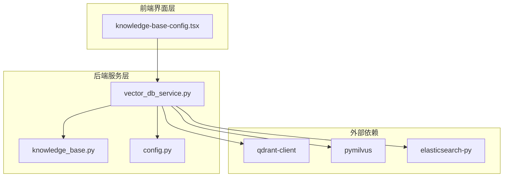
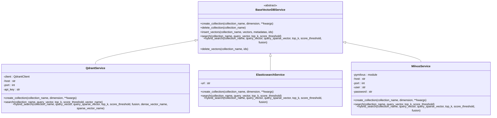
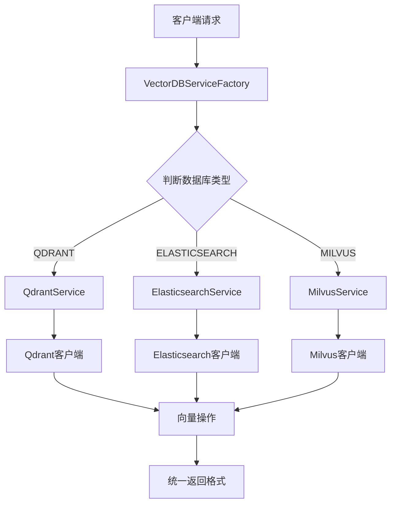
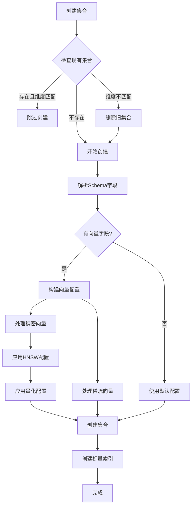
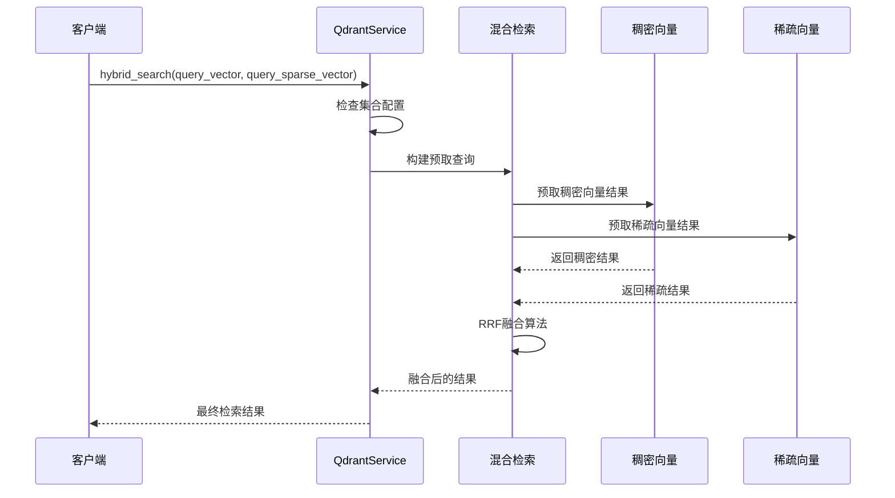
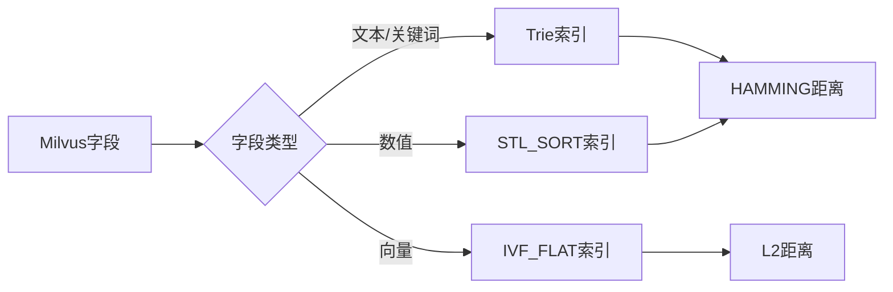
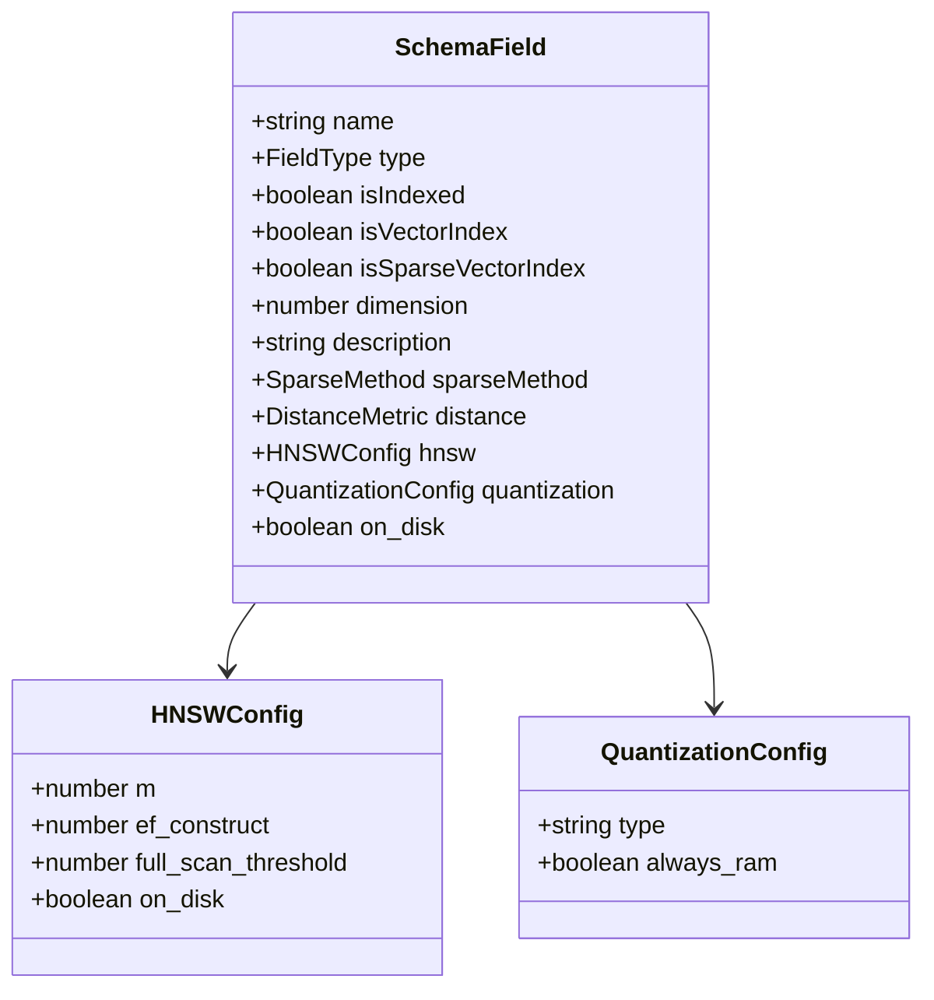
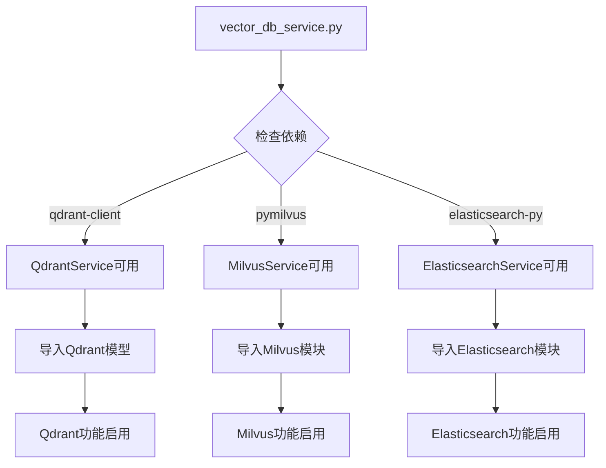

# 向量数据库服务适配层文档

<cite>
**本文档中引用的文件**
- [vector_db_service.py](file://backend/app/services/vector_db_service.py)
- [knowledge_base.py](file://backend/app/models/knowledge_base.py)
- [config.py](file://backend/app/config.py)
- [knowledge-base-config.tsx](file://web/components/views/knowledge-base-config.tsx)
</cite>

## 目录
1. [简介](#简介)
2. [项目结构](#项目结构)
3. [核心组件](#核心组件)
4. [架构概览](#架构概览)
5. [详细组件分析](#详细组件分析)
6. [依赖关系分析](#依赖关系分析)
7. [性能考虑](#性能考虑)
8. [故障排除指南](#故障排除指南)
9. [结论](#结论)

## 简介

RAG-Studio的向量数据库服务适配层是一个高度模块化的设计，支持多种向量数据库的无缝切换。该系统采用工厂模式和抽象基类设计，为开发者提供了统一的接口来操作不同的向量数据库，包括Qdrant、Elasticsearch和Milvus。

该适配层的核心优势在于：
- **统一接口**：所有向量数据库都实现了相同的抽象接口
- **灵活配置**：支持运行时动态选择和配置向量数据库
- **扩展性强**：易于添加新的向量数据库支持
- **混合检索**：原生支持稠密向量和稀疏向量的混合检索

## 项目结构

向量数据库服务位于RAG-Studio项目的后端服务层，具体组织结构如下：



**图表来源**
- [vector_db_service.py](file://backend/app/services/vector_db_service.py#L1-L50)
- [knowledge_base.py](file://backend/app/models/knowledge_base.py#L1-L30)

**章节来源**
- [vector_db_service.py](file://backend/app/services/vector_db_service.py#L1-L100)
- [knowledge_base.py](file://backend/app/models/knowledge_base.py#L1-L80)

## 核心组件

### VectorDBType枚举

系统定义了三种支持的向量数据库类型：

| 数据库类型 | 描述 | 特点 |
|-----------|------|------|
| QDRANT | 专为向量搜索优化的开源向量数据库 | 支持命名向量、稀疏向量、多种距离度量、量化压缩 |
| ELASTICSEARCH | 分布式搜索引擎，支持向量检索 | 结合BM25和稠密向量的混合检索 |
| MILVUS | 云原生向量数据库 | 高性能、可扩展、支持多种索引算法 |

### BaseVectorDBService抽象基类

所有向量数据库服务都继承自这个抽象基类，定义了统一的操作接口：



**图表来源**
- [vector_db_service.py](file://backend/app/services/vector_db_service.py#L31-L114)
- [vector_db_service.py](file://backend/app/services/vector_db_service.py#L203-L265)
- [vector_db_service.py](file://backend/app/services/vector_db_service.py#L116-L199)
- [vector_db_service.py](file://backend/app/services/vector_db_service.py#L807-L844)

**章节来源**
- [vector_db_service.py](file://backend/app/services/vector_db_service.py#L31-L114)
- [knowledge_base.py](file://backend/app/models/knowledge_base.py#L18-L23)

## 架构概览

向量数据库服务采用工厂模式设计，通过VectorDBServiceFactory类根据数据库类型创建相应的服务实例：



**图表来源**
- [vector_db_service.py](file://backend/app/services/vector_db_service.py#L1089-L1111)

**章节来源**
- [vector_db_service.py](file://backend/app/services/vector_db_service.py#L1089-L1111)

## 详细组件分析

### VectorDBServiceFactory工厂模式

工厂类负责根据数据库类型创建相应的服务实例，支持运行时动态切换向量数据库：

#### 核心功能
- **类型安全**：通过VectorDBType枚举确保数据库类型的有效性
- **配置注入**：支持传入自定义配置覆盖默认设置
- **异常处理**：对不支持的数据库类型抛出明确的错误信息

#### 配置参数注入机制

每种服务都支持灵活的配置参数注入：

| 参数类型 | Qdrant | Elasticsearch | Milvus |
|---------|--------|---------------|--------|
| 主机地址 | host | host | host |
| 端口 | port | port | port |
| 用户名 | - | user | user |
| 密码 | api_key | password | password |
| URL | url | url | - |

**章节来源**
- [vector_db_service.py](file://backend/app/services/vector_db_service.py#L1089-L1111)

### QdrantService详细分析

QdrantService是最完善的向量数据库实现，支持丰富的配置选项：

#### 核心特性
- **命名向量**：支持在一个集合中存储多种类型的向量
- **稀疏向量**：原生支持稀疏向量格式
- **量化压缩**：支持标量量化、产品量化和二进制量化
- **HNSW索引**：高性能的近似最近邻搜索
- **混合检索**：原生支持稠密向量和稀疏向量的混合检索

#### 高级配置选项



**图表来源**
- [vector_db_service.py](file://backend/app/services/vector_db_service.py#L266-L475)

#### 混合检索实现

QdrantService实现了原生的混合检索功能：



**图表来源**
- [vector_db_service.py](file://backend/app/services/vector_db_service.py#L654-L762)

**章节来源**
- [vector_db_service.py](file://backend/app/services/vector_db_service.py#L203-L762)

### ElasticsearchService详细分析

ElasticsearchService目前处于开发阶段，提供了基础的框架结构：

#### 当前状态
- **TODO列表**：需要实现连接管理、索引创建、向量检索等功能
- **配置支持**：支持URL、主机、端口、认证等配置
- **混合检索**：预留了混合检索的接口实现

#### 开发路线图
1. **连接管理**：实现elasticsearch-py客户端的连接
2. **索引映射**：创建支持向量检索的索引映射
3. **向量检索**：实现基于向量相似度的搜索
4. **混合检索**：结合BM25和稠密向量的混合检索

**章节来源**
- [vector_db_service.py](file://backend/app/services/vector_db_service.py#L116-L199)

### MilvusService详细分析

MilvusService提供了高性能的向量检索能力：

#### 核心优势
- **高性能索引**：支持IVF_FLAT、IVF_SQ8等多种索引算法
- **大规模扩展**：支持分布式部署和水平扩展
- **实时检索**：支持实时向量插入和检索

#### 数据类型映射

| Schema类型 | Milvus数据类型 | 说明 |
|-----------|---------------|------|
| text/keyword | VARCHAR | 最大长度65535字符 |
| integer | INT64 | 64位整数 |
| float | FLOAT | 单精度浮点数 |
| boolean | BOOL | 布尔值 |

#### 索引策略



**图表来源**
- [vector_db_service.py](file://backend/app/services/vector_db_service.py#L903-L931)

**章节来源**
- [vector_db_service.py](file://backend/app/services/vector_db_service.py#L807-L1087)

### Schema配置系统

系统提供了强大的Schema配置功能，支持复杂的字段定义和索引配置：

#### Schema字段类型

| 字段类型 | 用途 | 配置选项 |
|---------|------|---------|
| dense_vector | 稠密向量 | dimension, distance, hnsw, quantization, on_disk |
| sparse_vector | 稀疏向量 | name, sparseMethod |
| text | 文本字段 | max_length, isIndexed |
| keyword | 关键词字段 | isIndexed |
| integer | 整数字段 | isIndexed |
| float | 浮点数字段 | isIndexed |
| boolean | 布尔字段 | isIndexed |

#### 高级配置选项



**图表来源**
- [knowledge-base-config.tsx](file://web/components/views/knowledge-base-config.tsx#L40-L73)

**章节来源**
- [knowledge-base.py](file://backend/app/models/knowledge_base.py#L40-L42)
- [knowledge-base-config.tsx](file://web/components/views/knowledge-base-config.tsx#L40-L73)

## 依赖关系分析

### 外部依赖管理

系统采用条件导入的方式管理外部依赖，确保在缺少某些依赖时不会影响整体功能：



**图表来源**
- [vector_db_service.py](file://backend/app/services/vector_db_service.py#L13-L30)

### 配置优先级

配置参数的优先级顺序为：
1. **传入配置**：通过create方法传递的config参数
2. **环境变量**：从settings中读取的配置
3. **默认值**：硬编码的默认值

**章节来源**
- [vector_db_service.py](file://backend/app/services/vector_db_service.py#L13-L30)
- [config.py](file://backend/app/config.py#L55-L73)

## 性能考虑

### 索引优化策略

不同向量数据库采用了各自的优化策略：

#### Qdrant优化
- **HNSW算法**：支持可配置的HNSW参数
- **量化压缩**：减少内存占用和提高检索速度
- **磁盘存储**：支持向量数据的磁盘持久化

#### Milvus优化
- **多种索引算法**：IVF_FLAT、IVF_SQ8、IVF_PQ等
- **批量操作**：支持高效的批量插入和检索
- **分布式架构**：支持水平扩展

#### Elasticsearch优化
- **BM25算法**：结合传统文本检索
- **倒排索引**：优化文本搜索性能
- **分片策略**：支持大规模数据分布

### 混合检索性能

混合检索的性能取决于两个主要因素：
1. **预取查询的数量**：通常设置为top_k的2倍
2. **融合算法的复杂度**：RRF算法的时间复杂度为O(n log n)

## 故障排除指南

### 常见问题及解决方案

#### 1. 依赖缺失问题

**问题**：ImportError: qdrant-client not installed
**解决方案**：安装对应的客户端库
```bash
pip install qdrant-client  # Qdrant
pip install pymilvus      # Milvus
```

#### 2. 连接失败问题

**问题**：无法连接到向量数据库
**排查步骤**：
1. 检查网络连接
2. 验证配置参数
3. 确认数据库服务状态

#### 3. 向量维度不匹配

**问题**：创建集合时提示维度不匹配
**解决方案**：删除现有集合或使用不同的集合名称

#### 4. 混合检索失败

**问题**：混合检索功能不可用
**原因**：Qdrant客户端版本过低
**解决方案**：升级qdrant-client到最新版本

**章节来源**
- [vector_db_service.py](file://backend/app/services/vector_db_service.py#L219-L221)
- [vector_db_service.py](file://backend/app/services/vector_db_service.py#L824-L831)

## 结论

RAG-Studio的向量数据库服务适配层展现了优秀的软件架构设计：

### 设计优势
1. **高度模块化**：通过抽象基类和工厂模式实现松耦合
2. **易于扩展**：新增向量数据库只需实现BaseVectorDBService接口
3. **配置灵活**：支持运行时动态配置和多层级参数注入
4. **功能丰富**：原生支持混合检索和高级索引配置

### 技术特色
- **统一接口**：所有数据库提供一致的操作体验
- **性能优化**：针对不同数据库特点进行专门优化
- **开发友好**：完善的错误处理和调试支持

### 发展方向
1. **Elasticsearch完善**：实现完整的Elasticsearch向量检索功能
2. **新数据库支持**：计划添加FAISS、Weaviate等更多数据库支持
3. **性能监控**：增加检索性能指标和监控功能
4. **自动化配置**：提供智能的索引配置建议

该适配层为RAG-Studio提供了坚实的数据存储基础，支持多样化的应用场景和性能需求，是整个系统架构中的关键组件。