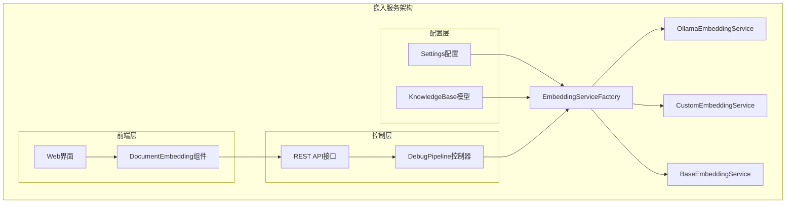
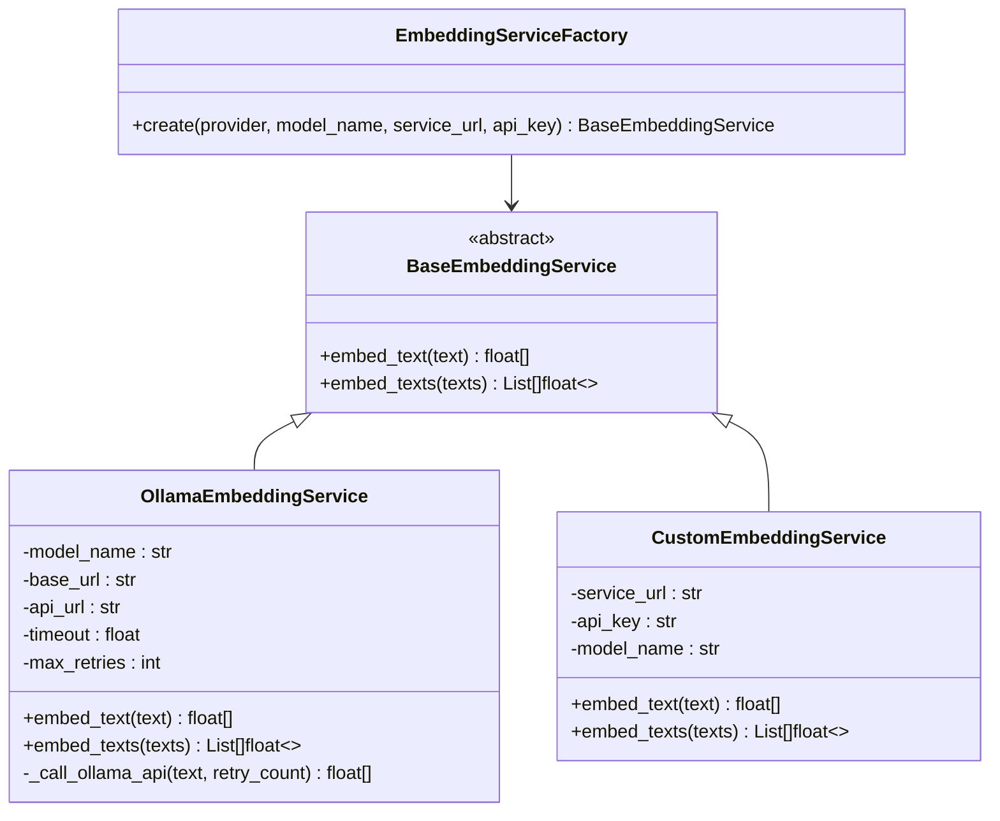
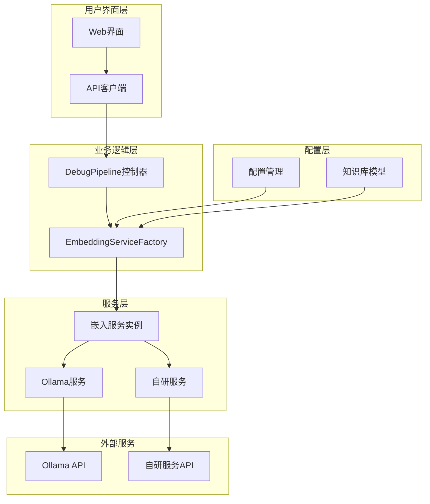
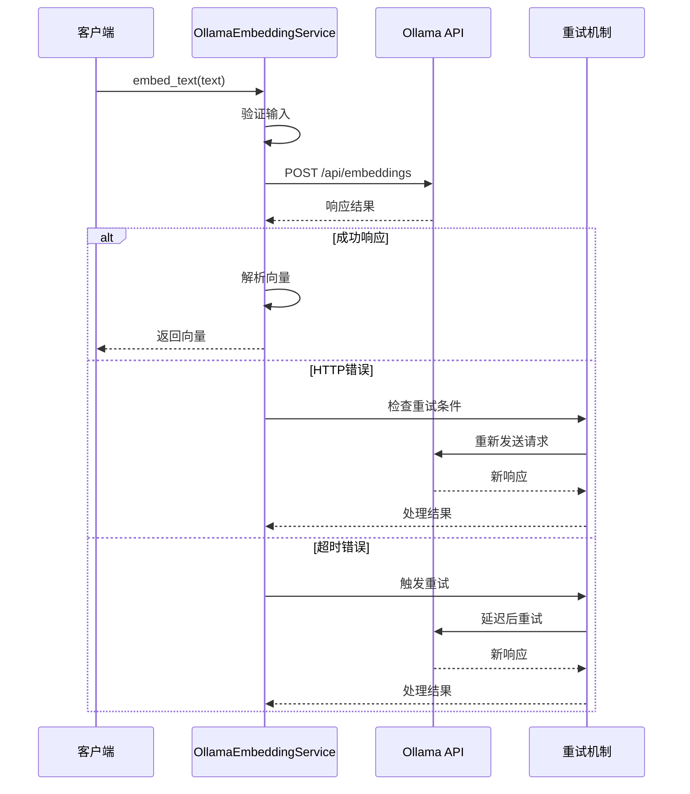
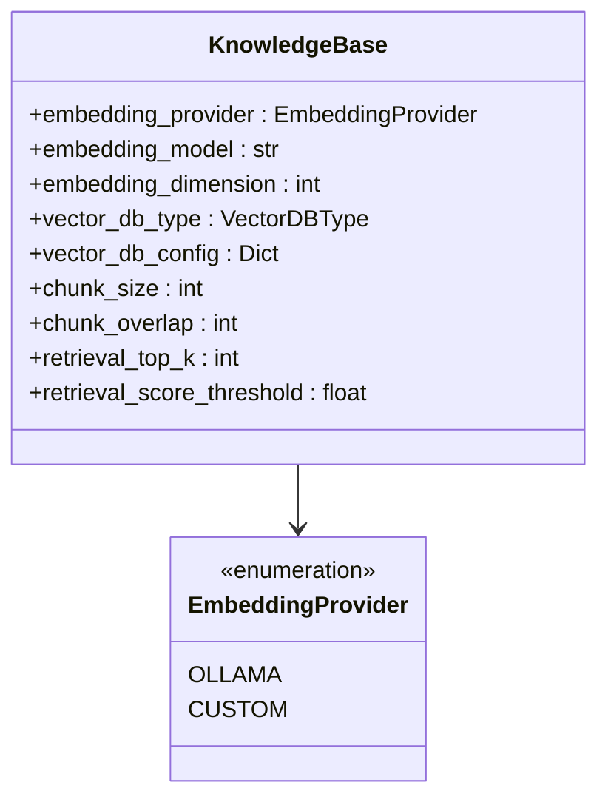
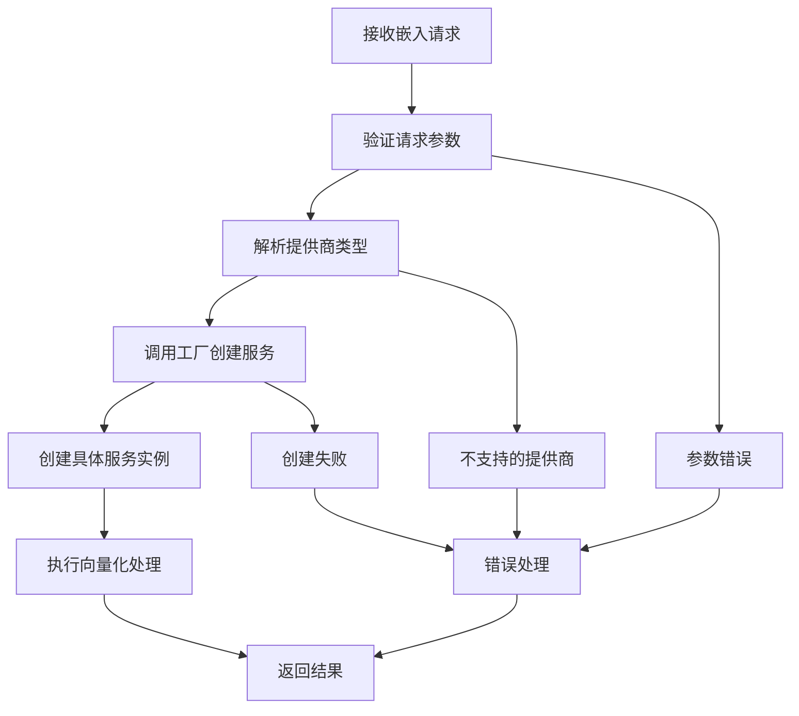

# RAG-Studio嵌入服务集成文档

<cite>
**本文档引用的文件**
- [embedding_service.py](file://backend/app/services/embedding_service.py)
- [config.py](file://backend/app/config.py)
- [knowledge_base.py](file://backend/app/models/knowledge_base.py)
- [debug_pipeline.py](file://backend/app/controllers/debug_pipeline.py)
- [api.ts](file://web/lib/api.ts)
- [document-embedding.tsx](file://web/components/views/document-embedding.tsx)
</cite>

## 目录
1. [简介](#简介)
2. [项目结构概览](#项目结构概览)
3. [核心组件分析](#核心组件分析)
4. [架构设计](#架构设计)
5. [详细组件分析](#详细组件分析)
6. [配置管理](#配置管理)
7. [扩展指南](#扩展指南)
8. [性能优化](#性能优化)
9. [故障排除](#故障排除)
10. [总结](#总结)

## 简介

RAG-Studio的嵌入服务是一个高度模块化和可扩展的向量生成系统，支持多种AI服务提供商，包括Ollama和自研模型。该系统采用工厂模式设计，提供了统一的接口来处理不同类型的嵌入服务，并具备完善的错误处理和重试机制。

## 项目结构概览

嵌入服务的核心文件位于`backend/app/services/`目录下，主要包含以下关键组件：



**图表来源**
- [embedding_service.py](file://backend/app/services/embedding_service.py#L224-L257)
- [config.py](file://backend/app/config.py#L15-L99)
- [debug_pipeline.py](file://backend/app/controllers/debug_pipeline.py#L217-L275)

## 核心组件分析

### BaseEmbeddingService抽象基类

BaseEmbeddingService定义了嵌入服务的标准接口，包含两个核心方法：

- `embed_text(text: str) -> List[float]`: 单文本向量化
- `embed_texts(texts: List[str]) -> List[List[float]]`: 批量文本向量化

这两个方法都采用异步编程模式，支持高并发处理。

**章节来源**
- [embedding_service.py](file://backend/app/services/embedding_service.py#L18-L46)

### EmbeddingServiceFactory工厂类

工厂类实现了基于策略模式的设计，根据不同的提供商类型创建相应的服务实例：



**图表来源**
- [embedding_service.py](file://backend/app/services/embedding_service.py#L224-L257)
- [embedding_service.py](file://backend/app/services/embedding_service.py#L48-L222)

**章节来源**
- [embedding_service.py](file://backend/app/services/embedding_service.py#L224-L257)

## 架构设计

### 整体架构图



**图表来源**
- [debug_pipeline.py](file://backend/app/controllers/debug_pipeline.py#L217-L275)
- [embedding_service.py](file://backend/app/services/embedding_service.py#L224-L257)
- [config.py](file://backend/app/config.py#L15-L99)

## 详细组件分析

### Ollama嵌入服务实现

OllamaEmbeddingService是系统的主要嵌入服务实现，负责与本地或远程的Ollama服务通信。

#### 核心特性

1. **HTTP API调用**: 通过RESTful API与Ollama服务交互
2. **重试机制**: 支持指数退避的自动重试
3. **并发控制**: 使用信号量限制并发请求数量
4. **错误处理**: 完善的异常捕获和错误恢复

#### API调用流程



**图表来源**
- [embedding_service.py](file://backend/app/services/embedding_service.py#L62-L135)
- [embedding_service.py](file://backend/app/services/embedding_service.py#L137-L183)

#### 批量处理优化

Ollama服务实现了智能的批量处理机制：

- **并发限制**: 使用`asyncio.Semaphore(10)`限制最大并发数
- **错误隔离**: 单个请求失败不影响其他请求
- **内存效率**: 异步处理避免阻塞主线程

**章节来源**
- [embedding_service.py](file://backend/app/services/embedding_service.py#L48-L183)

### 自研嵌入服务

CustomEmbeddingService作为预留实现，为未来集成自研AI服务提供框架。

#### 实现要点

1. **配置灵活性**: 支持动态的服务URL和API密钥
2. **标准化接口**: 与Ollama服务保持相同的接口规范
3. **扩展性**: 易于替换为新的自研服务

**章节来源**
- [embedding_service.py](file://backend/app/services/embedding_service.py#L186-L222)

### 知识库模型集成

系统通过KnowledgeBase模型管理嵌入服务配置：



**图表来源**
- [knowledge_base.py](file://backend/app/models/knowledge_base.py#L12-L16)
- [knowledge_base.py](file://backend/app/models/knowledge_base.py#L25-L80)

**章节来源**
- [knowledge_base.py](file://backend/app/models/knowledge_base.py#L12-L80)

## 配置管理

### 环境配置

系统通过Pydantic设置管理配置，支持多种提供商的配置选项：

| 配置项 | 类型 | 默认值 | 描述 |
|--------|------|--------|------|
| `OLLAMA_BASE_URL` | str | `"http://localhost:11434"` | Ollama服务基础URL |
| `OLLAMA_EMBEDDING_MODEL` | str | `"nomic-embed-text"` | 默认嵌入模型 |
| `CUSTOM_SERVICE_URL` | str | `""` | 自研服务地址 |
| `CUSTOM_SERVICE_API_KEY` | str | `""` | 自研服务API密钥 |

### 控制器配置

DebugPipeline控制器通过请求参数动态配置嵌入服务：



**图表来源**
- [debug_pipeline.py](file://backend/app/controllers/debug_pipeline.py#L219-L240)

**章节来源**
- [config.py](file://backend/app/config.py#L45-L52)
- [debug_pipeline.py](file://backend/app/controllers/debug_pipeline.py#L219-L240)

## 扩展指南

### 添加新的嵌入提供商

要添加新的嵌入服务提供商，需要遵循以下步骤：

#### 1. 扩展EmbeddingProvider枚举

在`knowledge_base.py`中添加新的提供商类型：

```python
class EmbeddingProvider(str, Enum):
    """嵌入模型提供商"""
    OLLAMA = "ollama"
    CUSTOM = "custom"
    NEW_PROVIDER = "new_provider"  # 新增提供商
```

#### 2. 实现新的服务类

创建新的服务类继承BaseEmbeddingService：

```python
class NewProviderEmbeddingService(BaseEmbeddingService):
    """新提供商嵌入服务实现"""
    
    def __init__(self, model_name: str, api_key: str = None):
        self.model_name = model_name
        self.api_key = api_key
        self.base_url = settings.NEW_PROVIDER_BASE_URL
    
    async def embed_text(self, text: str) -> List[float]:
        # 实现具体的API调用逻辑
        pass
    
    async def embed_texts(self, texts: List[str]) -> List[List[float]]:
        # 实现批量处理逻辑
        pass
```

#### 3. 更新工厂类

在EmbeddingServiceFactory中添加新的分支：

```python
elif provider == EmbeddingProvider.NEW_PROVIDER:
    return NewProviderEmbeddingService(model_name, api_key)
```

### 自定义向量化流程

#### 批处理优化策略

1. **分块处理**: 将大量文本分成适中的批次
2. **并发控制**: 使用信号量限制并发请求数
3. **内存管理**: 及时释放不需要的数据

#### 错误处理增强

```python
async def embed_texts(self, texts: List[str]) -> List[List[float]]:
    """增强的批量嵌入处理"""
    results = []
    errors = []
    
    for i, text in enumerate(texts):
        try:
            result = await self.embed_text(text)
            results.append(result)
        except Exception as e:
            logger.warning(f"文本{i}处理失败: {e}")
            errors.append((i, str(e)))
            results.append([0.0] * self.dimension)  # 返回零向量作为占位符
    
    if errors:
        logger.info(f"成功处理{len(results)}个文本，失败{len(errors)}个")
    
    return results
```

## 性能优化

### 并发处理优化

系统采用了多层次的并发优化策略：

1. **异步I/O**: 使用asyncio实现非阻塞网络请求
2. **信号量控制**: 限制并发请求数量避免服务过载
3. **批量处理**: 合并多个小请求减少网络开销

### 缓存策略

虽然当前实现没有内置缓存，但可以轻松添加：

```python
from functools import lru_cache
import hashlib

class CachedEmbeddingService(BaseEmbeddingService):
    """带缓存的嵌入服务"""
    
    def __init__(self, base_service: BaseEmbeddingService, cache_size: int = 1000):
        self.base_service = base_service
        self.cache_size = cache_size
        self._cache = {}
    
    @lru_cache(maxsize=1000)
    def _get_cache_key(self, text: str) -> str:
        return hashlib.md5(text.encode()).hexdigest()
    
    async def embed_text(self, text: str) -> List[float]:
        cache_key = self._get_cache_key(text)
        
        if cache_key in self._cache:
            return self._cache[cache_key]
        
        vector = await self.base_service.embed_text(text)
        self._cache[cache_key] = vector
        return vector
```

### 监控和指标

建议添加以下监控指标：

- 请求延迟分布
- 成功率统计
- 并发请求数
- 错误类型分类

## 故障排除

### 常见问题及解决方案

#### 1. Ollama连接失败

**症状**: `无法连接到Ollama服务`

**原因**: Ollama服务未启动或网络配置错误

**解决方案**:
- 检查Ollama服务状态: `curl http://localhost:11434/api/tags`
- 验证配置: 检查`OLLAMA_BASE_URL`设置
- 查看日志: 检查服务启动日志

#### 2. API调用超时

**症状**: `Ollama API请求超时`

**原因**: 网络延迟或模型推理时间过长

**解决方案**:
- 增加超时时间: 修改`timeout`参数
- 优化模型: 使用更轻量级的模型
- 增加重试次数: 调整`max_retries`

#### 3. 向量维度不匹配

**症状**: 向量维度与预期不符

**原因**: 模型输出维度变化或配置错误

**解决方案**:
- 验证模型配置: 检查`embedding_dimension`
- 动态检测: 在运行时验证向量维度
- 记录日志: 记录实际维度信息

### 调试工具

系统提供了完整的调试API：

```typescript
// 获取可用模型列表
const models = await debugAPI.getEmbeddingModels()

// 执行向量化
const result = await debugAPI.embedDocuments({
    texts: chunks,
    model: "bge-m3:latest",
    provider: "ollama"
})
```

**章节来源**
- [embedding_service.py](file://backend/app/services/embedding_service.py#L101-L131)
- [api.ts](file://web/lib/api.ts#L875-L890)

## 总结

RAG-Studio的嵌入服务系统展现了优秀的软件架构设计：

### 设计优势

1. **模块化设计**: 清晰的职责分离和接口抽象
2. **可扩展性**: 工厂模式支持轻松添加新提供商
3. **可靠性**: 完善的错误处理和重试机制
4. **性能优化**: 智能的并发控制和批量处理

### 最佳实践

1. **异步编程**: 充分利用Python的异步特性
2. **配置管理**: 使用环境变量和配置类管理设置
3. **错误处理**: 实现分层的异常处理机制
4. **监控日志**: 提供详细的日志记录和错误追踪

### 发展方向

1. **缓存机制**: 添加向量缓存提升性能
2. **负载均衡**: 支持多个服务实例的负载分担
3. **模型管理**: 实现动态模型切换和版本管理
4. **性能监控**: 集成APM工具进行性能监控

该嵌入服务系统为RAG-Studio提供了坚实的基础，支持多样化的AI服务集成，为构建强大的检索增强生成(RAG)应用奠定了良好的技术基础。