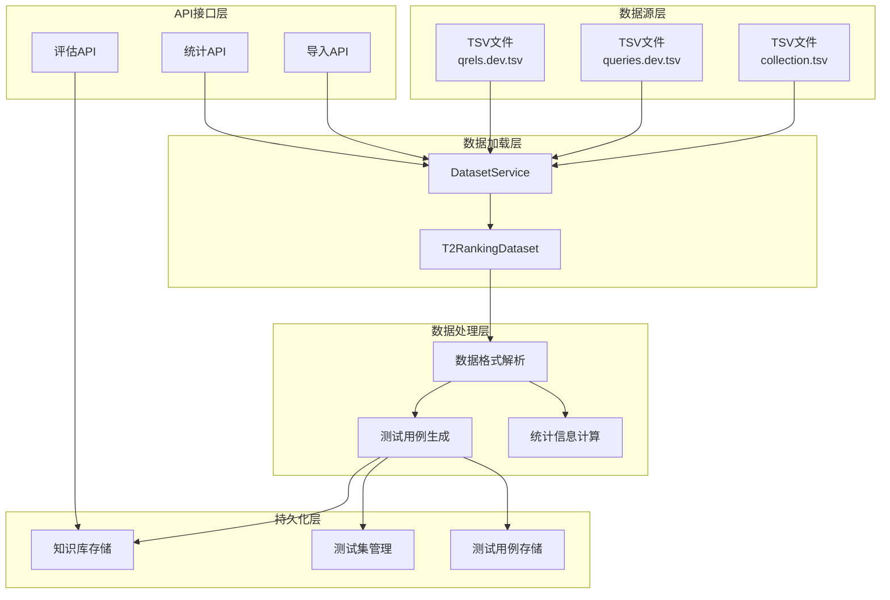
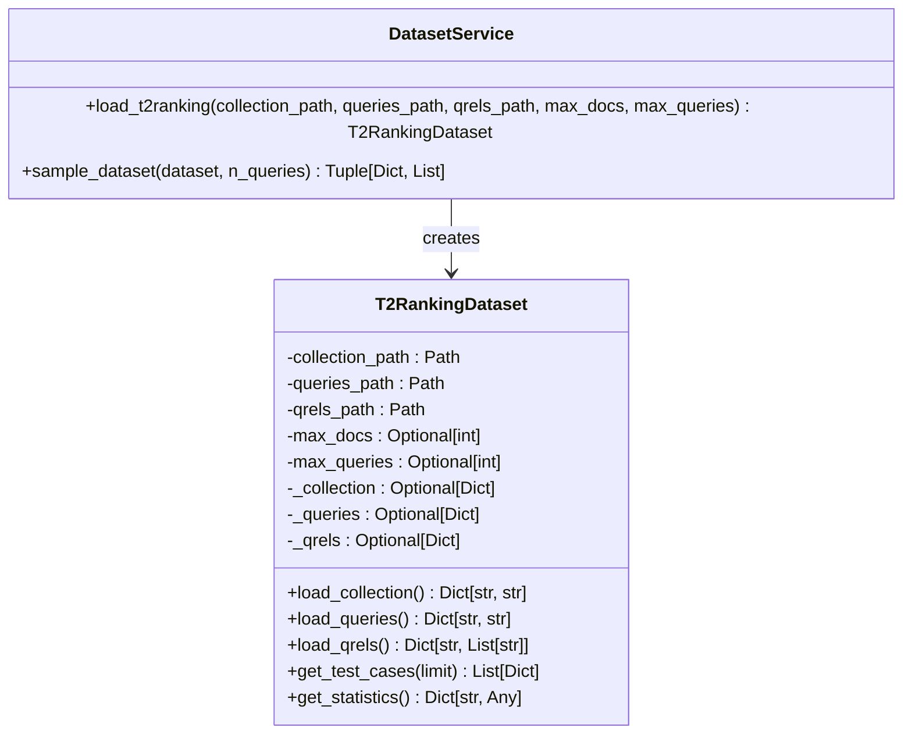
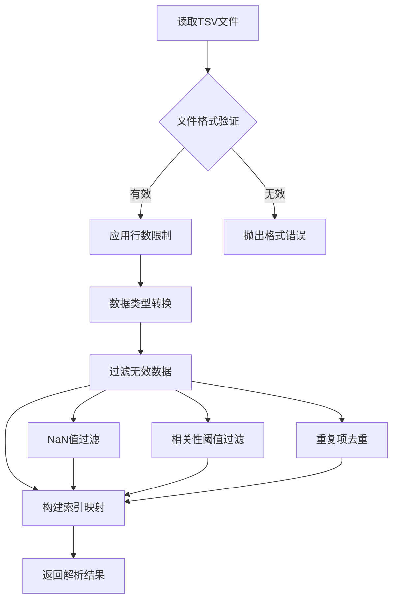
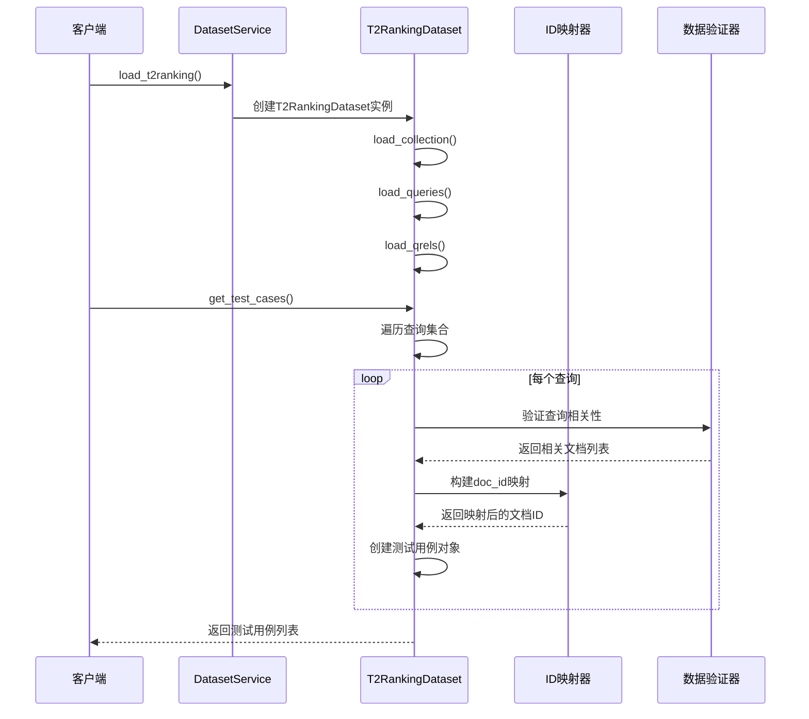
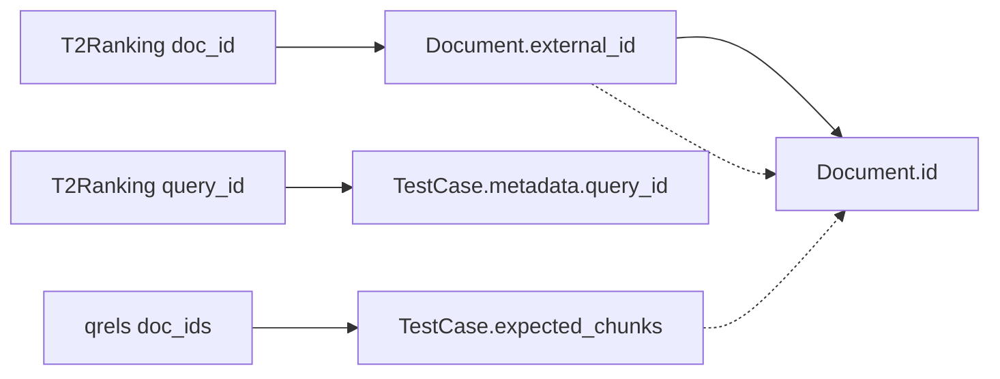
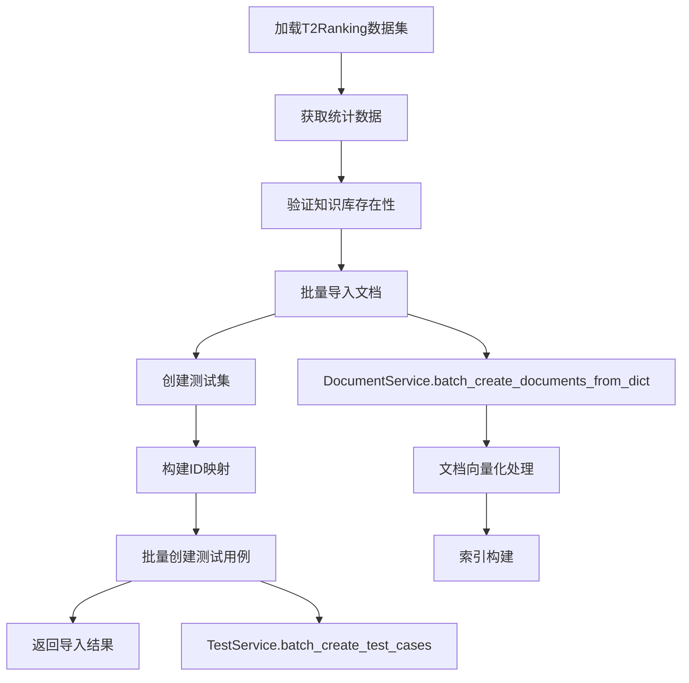
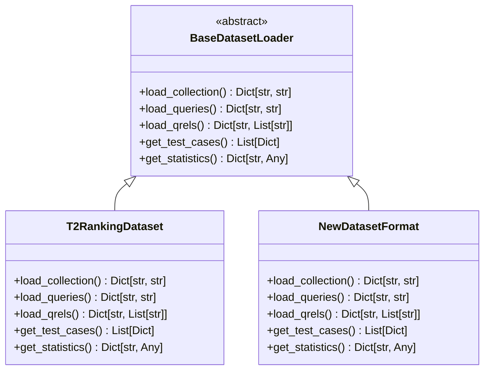
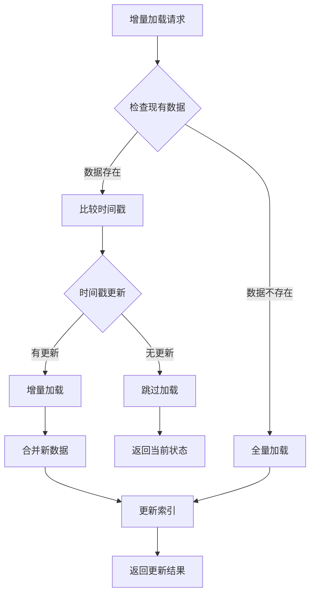

# 数据集加载服务集成文档

<cite>
**本文档引用的文件**
- [dataset_loader.py](file://backend/app/services/dataset_loader.py)
- [example_t2ranking_usage.py](file://backend/example_t2ranking_usage.py)
- [QUICKSTART_检索器评估.md](file://backend/QUICKSTART_检索器评估.md)
- [README_RETRIEVER_EVAL.md](file://backend/README_RETRIEVER_EVAL.md)
- [retriever_evaluation.py](file://backend/app/controllers/retriever_evaluation.py)
- [test.py](file://backend/app/schemas/test.py)
- [test_retriever_eval.py](file://backend/test_retriever_eval.py)
- [test_t2ranking_pipeline.py](file://backend/test_t2ranking_pipeline.py)
</cite>

## 目录
1. [概述](#概述)
2. [系统架构](#系统架构)
3. [核心组件分析](#核心组件分析)
4. [数据集格式解析](#数据集格式解析)
5. [测试用例转换流程](#测试用例转换流程)
6. [数据持久化机制](#数据持久化机制)
7. [与检索器评估系统的集成](#与检索器评估系统的集成)
8. [扩展新数据集格式支持](#扩展新数据集格式支持)
9. [增量加载实现指导](#增量加载实现指导)
10. [最佳实践与性能优化](#最佳实践与性能优化)
11. [故障排除指南](#故障排除指南)
12. [总结](#总结)

## 概述

RAG-Studio的数据集加载服务是一个专门设计用于加载和处理检索器评估数据集的核心模块，主要支持T2Ranking等标准评估数据集。该服务提供了完整的数据集生命周期管理，包括数据加载、格式解析、测试用例转换、数据持久化以及与检索器评估系统的无缝集成。

### 主要功能特性

- **多格式数据集支持**: 专注于T2Ranking数据集格式，支持collection.tsv、queries.tsv、qrels.tsv标准格式
- **智能采样优化**: 提供基于查询数量和文档数量的智能采样机制，显著提升大数据集处理性能
- **完整的数据管道**: 从原始TSV文件到可执行测试用例的完整转换流程
- **灵活的配置选项**: 支持最大文档数和最大查询数的动态限制
- **错误处理与验证**: 完善的文件存在性检查和数据完整性验证

## 系统架构



**架构图来源**
- [dataset_loader.py](file://backend/app/services/dataset_loader.py#L1-L261)
- [retriever_evaluation.py](file://backend/app/controllers/retriever_evaluation.py#L26-L152)

## 核心组件分析

### DatasetService - 数据集管理服务

DatasetService是数据集加载服务的入口点，提供统一的数据集操作接口。



**类图来源**
- [dataset_loader.py](file://backend/app/services/dataset_loader.py#L193-L261)

### T2RankingDataset - T2Ranking数据集加载器

T2RankingDataset负责具体的数据集加载和处理逻辑，采用延迟加载模式优化内存使用。

#### 核心方法分析

| 方法名 | 功能描述 | 返回类型 | 性能特点 |
|--------|----------|----------|----------|
| `load_collection()` | 加载文档集合，返回doc_id到content的映射 | `Dict[str, str]` | 延迟加载，支持max_docs限制 |
| `load_queries()` | 加载查询集合，返回query_id到query_text的映射 | `Dict[str, str]` | 延迟加载，支持max_queries限制 |
| `load_qrels()` | 加载相关性标注，返回query_id到相关文档ID列表的映射 | `Dict[str, List[str]]` | 过滤无效数据，支持查询限制 |
| `get_test_cases()` | 生成测试用例列表，包含查询和相关文档信息 | `List[Dict]` | 支持结果限制，自动过滤无相关文档的查询 |
| `get_statistics()` | 计算数据集统计信息 | `Dict[str, Any]` | 包含文档数、查询数、相关性分布等 |

**节来源**
- [dataset_loader.py](file://backend/app/services/dataset_loader.py#L45-L191)

## 数据集格式解析

### T2Ranking数据集标准格式

T2Ranking数据集采用标准的TSV（制表符分隔值）格式，具有明确的字段结构：

#### collection.tsv 格式
```
doc_id<TAB>document_content
```
- **第一列**: 文档唯一标识符（doc_id）
- **第二列**: 文档完整内容

#### queries.dev.tsv 格式
```
query_id<TAB>query_text
```
- **第一列**: 查询唯一标识符（query_id）
- **第二列**: 查询文本内容

#### qrels.dev.tsv 格式
```
query_id<TAB>0<TAB>doc_id<TAB>relevance
```
- **第一列**: 查询标识符
- **第二列**: 固定值0（兼容标准格式）
- **第三列**: 文档标识符
- **第四列**: 相关性评分（数值类型）

### 数据解析流程



**流程图来源**
- [dataset_loader.py](file://backend/app/services/dataset_loader.py#L57-L136)

### 数据验证与清洗

系统实现了多层次的数据验证机制：

1. **文件存在性检查**: 在加载前验证文件路径有效性
2. **格式完整性检查**: 确保TSV文件具有正确的列数
3. **数据类型验证**: 验证相关性评分的数值类型
4. **范围约束检查**: 过滤超出合理范围的数值
5. **重复数据处理**: 自动去除重复的查询-文档对

**节来源**
- [dataset_loader.py](file://backend/app/services/dataset_loader.py#L117-L136)

## 测试用例转换流程

### 从原始数据到测试用例的转换过程



**序列图来源**
- [dataset_loader.py](file://backend/app/services/dataset_loader.py#L140-L166)
- [retriever_evaluation.py](file://backend/app/controllers/retriever_evaluation.py#L95-L119)

### 测试用例结构定义

每个生成的测试用例包含以下关键信息：

| 字段名 | 类型 | 描述 | 示例值 |
|--------|------|------|--------|
| `query_id` | `str` | 查询唯一标识符 | `"q001"` |
| `query` | `str` | 查询文本内容 | `"什么是机器学习？"` |
| `relevant_doc_ids` | `List[str]` | 相关文档ID列表 | `["doc_001", "doc_002"]` |

### ID映射机制

系统实现了复杂的ID映射机制来处理T2Ranking原始ID与系统内部ID之间的转换：



**流程图来源**
- [retriever_evaluation.py](file://backend/app/controllers/retriever_evaluation.py#L95-L119)

**节来源**
- [retriever_evaluation.py](file://backend/app/controllers/retriever_evaluation.py#L95-L119)

## 数据持久化机制

### 完整的导入流程

数据集导入过程包含多个阶段的持久化操作：



**流程图来源**
- [retriever_evaluation.py](file://backend/app/controllers/retriever_evaluation.py#L46-L152)

### API接口设计

#### 导入T2Ranking数据集API

```python
@router.post("/import-t2ranking")
async def import_t2ranking_dataset(data: ImportT2RankingDatasetRequest):
    """
    导入T2Ranking数据集并创建测试集
    
    此接口会：
    1. 加载T2Ranking数据集文件
    2. 批量导入文档到知识库
    3. 创建对应的测试集和测试用例
    """
```

#### 获取数据集统计API

```python
@router.get("/dataset-statistics")
async def get_dataset_statistics(
    collection_path: str,
    queries_path: str,
    qrels_path: str,
    max_docs: int = None,
    max_queries: int = None
):
    """
    获取T2Ranking数据集的统计信息
    用于在导入前预览数据集规模
    """
```

### 错误处理与事务管理

系统实现了完善的错误处理机制：

1. **文件不存在异常**: 提供清晰的文件路径错误提示
2. **知识库不存在异常**: 验证目标知识库的有效性
3. **导入失败处理**: 记录失败的文档和测试用例，并提供详细的错误信息
4. **部分成功处理**: 即使部分导入失败，仍返回成功的操作结果

**节来源**
- [retriever_evaluation.py](file://backend/app/controllers/retriever_evaluation.py#L147-L194)

## 与检索器评估系统的集成

### API集成点

数据集加载服务与检索器评估系统通过多个API接口紧密集成：

#### 核心集成接口

| 接口路径 | HTTP方法 | 功能描述 | 请求参数 |
|----------|----------|----------|----------|
| `/retriever-evaluation/import-t2ranking` | POST | 导入T2Ranking数据集 | `kb_id, test_set_name, collection_path, queries_path, qrels_path, max_docs, max_queries` |
| `/retriever-evaluation/dataset-statistics` | GET | 获取数据集统计信息 | `collection_path, queries_path, qrels_path, max_docs, max_queries` |
| `/retriever-evaluation/evaluate` | POST | 执行检索器评估 | `kb_id, test_set_id, top_k, vector_db_type, embedding_provider, embedding_model` |

### 评估指标集成

系统支持多种检索器评估指标的计算：

```mermaid
graph LR
A[检索结果] --> B[RetrieverEvaluator]
B --> C[Precision@K]
B --> D[Recall@K]
B --> E[F1-Score]
B --> F[MRR]
B --> G[MAP]
B --> H[NDCG]
B --> I[Hit Rate]
```

**流程图来源**
- [example_t2ranking_usage.py](file://backend/example_t2ranking_usage.py#L56-L71)

### 测试用例管理集成

导入的数据集会自动转换为系统内部的测试用例格式：

```python
# 测试用例结构示例
test_case = {
    "query": "Python中如何定义一个类？",
    "expected_chunks": ["chunk_010", "chunk_011"],
    "metadata": {
        "query_id": "q001",
        "original_doc_ids": ["doc_001", "doc_002"]
    }
}
```

**节来源**
- [test.py](file://backend/app/schemas/test.py#L70-L100)

## 扩展新数据集格式支持

### 设计原则

为了支持新的数据集格式，需要遵循以下设计原则：

1. **接口一致性**: 新数据集加载器应继承或实现相同的接口规范
2. **配置灵活性**: 支持可配置的文件路径和参数设置
3. **错误处理标准化**: 实现统一的异常处理机制
4. **性能优化**: 支持采样和限制功能以处理大数据集

### 扩展示例架构



### 新格式适配步骤

1. **创建新的数据集加载器类**
2. **实现必需的方法接口**
3. **添加格式特定的数据解析逻辑**
4. **集成到DatasetService中**
5. **编写相应的测试用例**

### 配置扩展

```python
# 在DatasetService中添加新格式支持
@staticmethod
def load_new_format(
    collection_path: str,
    queries_path: str,
    qrels_path: str,
    max_docs: Optional[int] = None,
    max_queries: Optional[int] = None
) -> NewDatasetFormat:
    return NewDatasetFormat(
        collection_path=collection_path,
        queries_path=queries_path,
        qrels_path=qrels_path,
        max_docs=max_docs,
        max_queries=max_queries
    )
```

## 增量加载实现指导

### 增量加载架构设计



### 增量加载实现要点

#### 1. 时间戳跟踪机制

```python
class IncrementalDatasetLoader:
    def __init__(self, cache_dir: str):
        self.cache_dir = Path(cache_dir)
        self.metadata_file = self.cache_dir / "metadata.json"
    
    def get_last_modified_timestamp(self, file_path: str) -> datetime:
        """获取文件最后修改时间戳"""
        return datetime.fromtimestamp(Path(file_path).stat().st_mtime)
    
    def update_metadata(self, dataset_info: Dict):
        """更新元数据缓存"""
        self.metadata_file.parent.mkdir(parents=True, exist_ok=True)
        with open(self.metadata_file, 'w') as f:
            json.dump(dataset_info, f)
```

#### 2. 数据变更检测

```python
def detect_changes(self, new_files: List[str]) -> bool:
    """检测数据文件是否有变更"""
    if not self.metadata_file.exists():
        return True
    
    with open(self.metadata_file, 'r') as f:
        old_metadata = json.load(f)
    
    for file_path in new_files:
        if not Path(file_path).exists():
            continue
        
        last_modified = self.get_last_modified_timestamp(file_path)
        file_key = str(Path(file_path).resolve())
        
        if file_key not in old_metadata or old_metadata[file_key] < last_modified:
            return True
    
    return False
```

#### 3. 增量数据合并

```python
def merge_incremental_data(self, new_data: Dict) -> Dict:
    """合并增量数据"""
    current_data = self.load_current_data()
    
    # 合并文档集合
    current_data['collection'].update(new_data['collection'])
    
    # 合并查询集合
    current_data['queries'].update(new_data['queries'])
    
    # 合并相关性标注
    for query_id, relevant_docs in new_data['qrels'].items():
        if query_id in current_data['qrels']:
            current_data['qrels'][query_id].extend(relevant_docs)
        else:
            current_data['qrels'][query_id] = relevant_docs
    
    return current_data
```

### 性能优化策略

1. **并行处理**: 使用异步IO处理多个文件
2. **内存管理**: 实现流式处理大数据集
3. **缓存机制**: 缓存解析结果避免重复处理
4. **增量索引**: 只更新变更的部分索引

## 最佳实践与性能优化

### 数据集规模优化

#### 推荐的采样策略

| 数据集规模 | 推荐查询数量 | 推荐文档数量 | 适用场景 |
|------------|--------------|--------------|----------|
| 小型测试 | 50-100 | 500-1000 | 快速验证、开发测试 |
| 中型评估 | 100-500 | 2000-10000 | 功能验证、性能测试 |
| 大型生产 | 500+ | 10000+ | 生产环境部署 |

#### 内存使用优化

```python
# 使用生成器避免大量数据同时加载
def load_large_dataset_efficiently(collection_path: str, max_docs: int = None):
    """高效加载大型数据集"""
    with open(collection_path, 'r', encoding='utf-8') as f:
        for i, line in enumerate(f):
            if max_docs and i >= max_docs:
                break
            
            doc_id, content = line.strip().split('\t', 1)
            yield doc_id, content
```

### 错误处理最佳实践

#### 分层错误处理

```python
class DatasetLoadError(Exception):
    """数据集加载基础异常"""
    pass

class FileNotFoundError(DatasetLoadError):
    """文件未找到异常"""
    pass

class InvalidFormatError(DatasetLoadError):
    """数据格式无效异常"""
    pass

class ValidationError(DatasetLoadError):
    """数据验证失败异常"""
    pass
```

#### 日志记录策略

```python
import logging

logger = logging.getLogger(__name__)

def safe_load_dataset(collection_path: str, queries_path: str, qrels_path: str):
    """安全加载数据集，包含完整的错误处理和日志记录"""
    try:
        logger.info(f"开始加载数据集: {collection_path}, {queries_path}, {qrels_path}")
        
        # 验证文件存在性
        for path in [collection_path, queries_path, qrels_path]:
            if not Path(path).exists():
                raise FileNotFoundError(f"文件不存在: {path}")
        
        # 执行加载
        dataset = DatasetService.load_t2ranking(
            collection_path=collection_path,
            queries_path=queries_path,
            qrels_path=qrels_path,
            max_queries=100  # 默认采样大小
        )
        
        logger.info(f"数据集加载成功: {dataset.get_statistics()}")
        return dataset
        
    except FileNotFoundError as e:
        logger.error(f"文件加载失败: {e}")
        raise
    except InvalidFormatError as e:
        logger.error(f"格式验证失败: {e}")
        raise
    except Exception as e:
        logger.error(f"未知错误: {e}", exc_info=True)
        raise
```

### 性能监控指标

#### 关键性能指标(KPI)

```python
class DatasetMetrics:
    def __init__(self):
        self.load_times = {}
        self.memory_usage = {}
        self.error_rates = {}
    
    def record_load_time(self, dataset_type: str, duration: float):
        """记录数据集加载时间"""
        self.load_times[dataset_type] = duration
    
    def record_memory_usage(self, dataset_type: str, peak_memory: float):
        """记录峰值内存使用"""
        self.memory_usage[dataset_type] = peak_memory
    
    def record_error_rate(self, dataset_type: str, error_count: int, total_count: int):
        """记录错误率"""
        self.error_rates[dataset_type] = error_count / total_count if total_count > 0 else 0
    
    def get_performance_summary(self) -> Dict:
        """获取性能摘要报告"""
        return {
            "average_load_time": np.mean(list(self.load_times.values())),
            "peak_memory_usage": max(self.memory_usage.values()),
            "average_error_rate": np.mean(list(self.error_rates.values()))
        }
```

**节来源**
- [QUICKSTART_检索器评估.md](file://backend/QUICKSTART_检索器评估.md#L168-L201)

## 故障排除指南

### 常见问题及解决方案

#### 1. 数据集文件找不到

**症状**: `FileNotFoundError` 或文件路径错误

**原因分析**:
- 文件路径配置错误
- 文件权限不足
- 文件已被移动或删除

**解决方案**:
```bash
# 检查文件是否存在
ls -la /path/to/dataset/

# 检查文件权限
chmod 644 /path/to/dataset/*

# 验证文件格式
head -5 /path/to/dataset/collection.tsv
```

#### 2. 内存不足错误

**症状**: `MemoryError` 或系统响应缓慢

**原因分析**:
- 数据集规模过大
- 未启用采样机制
- 系统可用内存不足

**解决方案**:
```python
# 启用采样机制
dataset = DatasetService.load_t2ranking(
    collection_path=collection_path,
    queries_path=queries_path,
    qrels_path=qrels_path,
    max_queries=100,  # 限制查询数量
    max_docs=1000     # 限制文档数量
)
```

#### 3. 数据格式验证失败

**症状**: `InvalidFormatError` 或数据解析错误

**原因分析**:
- TSV文件格式不正确
- 编码格式问题
- 特殊字符处理不当

**解决方案**:
```python
# 检查文件编码
import chardet
with open(collection_path, 'rb') as f:
    result = chardet.detect(f.read())
    print(f"检测到的编码: {result['encoding']}")

# 验证TSV格式
import pandas as pd
try:
    df = pd.read_csv(collection_path, sep='\t', header=None, nrows=5)
    print(f"文件格式验证通过: {df.shape} 行")
except Exception as e:
    print(f"格式验证失败: {e}")
```

#### 4. API响应超时

**症状**: API请求长时间无响应

**原因分析**:
- 数据集过大导致处理时间过长
- 网络连接不稳定
- 服务器资源不足

**解决方案**:
```python
# 设置合理的超时时间
import requests
from requests.adapters import HTTPAdapter
from urllib3.util.retry import Retry

session = requests.Session()
retry_strategy = Retry(
    total=3,
    backoff_factor=1,
    status_forcelist=[429, 500, 502, 503, 504],
)

adapter = HTTPAdapter(max_retries=retry_strategy)
session.mount("http://", adapter)
session.mount("https://", adapter)

response = session.get(url, timeout=(5, 30))  # 连接超时5秒，读取超时30秒
```

### 调试工具和技巧

#### 1. 数据集验证脚本

```python
def validate_dataset_format(collection_path: str, queries_path: str, qrels_path: str):
    """验证数据集格式的完整性"""
    issues = []
    
    # 验证collection.tsv
    try:
        df_collection = pd.read_csv(collection_path, sep='\t', header=None, names=['doc_id', 'content'])
        if df_collection.shape[1] != 2:
            issues.append(f"collection.tsv 应该有2列，实际有 {df_collection.shape[1]} 列")
        if df_collection.isnull().any().any():
            issues.append("collection.tsv 包含空值")
    except Exception as e:
        issues.append(f"无法读取collection.tsv: {e}")
    
    # 验证queries.tsv
    try:
        df_queries = pd.read_csv(queries_path, sep='\t', header=None, names=['query_id', 'query'])
        if df_queries.shape[1] != 2:
            issues.append(f"queries.tsv 应该有2列，实际有 {df_queries.shape[1]} 列")
        if df_queries.isnull().any().any():
            issues.append("queries.tsv 包含空值")
    except Exception as e:
        issues.append(f"无法读取queries.tsv: {e}")
    
    # 验证qrels.tsv
    try:
        df_qrels = pd.read_csv(qrels_path, sep='\t', header=None, names=['query_id', 'q0', 'doc_id', 'relevance'])
        if df_qrels.shape[1] != 4:
            issues.append(f"qrels.tsv 应该有4列，实际有 {df_qrels.shape[1]} 列")
        if df_qrels.isnull().any().any():
            issues.append("qrels.tsv 包含空值")
        if not pd.api.types.is_numeric_dtype(df_qrels['relevance']):
            issues.append("qrels.tsv 的relevance列应该为数值类型")
    except Exception as e:
        issues.append(f"无法读取qrels.tsv: {e}")
    
    return issues
```

#### 2. 性能分析工具

```python
import time
import psutil
import memory_profiler

def profile_dataset_loading(collection_path: str, queries_path: str, qrels_path: str):
    """性能分析工具"""
    
    def get_memory_usage():
        return psutil.Process().memory_info().rss / 1024 / 1024  # MB
    
    start_time = time.time()
    start_memory = get_memory_usage()
    
    try:
        dataset = DatasetService.load_t2ranking(
            collection_path=collection_path,
            queries_path=queries_path,
            qrels_path=qrels_path,
            max_queries=100
        )
        
        end_time = time.time()
        end_memory = get_memory_usage()
        
        return {
            "load_time": end_time - start_time,
            "memory_delta": end_memory - start_memory,
            "dataset_stats": dataset.get_statistics(),
            "peak_memory": max(start_memory, end_memory)
        }
        
    except Exception as e:
        return {"error": str(e)}
```

**节来源**
- [test_retriever_eval.py](file://backend/test_retriever_eval.py#L11-L60)

## 总结

RAG-Studio的数据集加载服务是一个功能完备、设计精良的检索器评估数据集管理系统。通过本文档的深入分析，我们可以看到该系统在以下几个方面的突出优势：

### 核心价值

1. **标准化的数据处理**: 严格遵循T2Ranking数据集标准，确保评估结果的可比性和可靠性
2. **高效的性能优化**: 通过智能采样和延迟加载机制，显著提升大数据集的处理效率
3. **完整的错误处理**: 提供多层次的异常处理和用户友好的错误提示
4. **无缝的系统集成**: 与检索器评估系统形成完整的端到端解决方案

### 技术特色

- **模块化设计**: 清晰的职责分离，便于维护和扩展
- **异步处理**: 支持并发操作，提升系统响应性能
- **配置灵活**: 支持多种参数配置，适应不同使用场景
- **监控完善**: 提供详细的性能指标和状态信息

### 应用前景

该数据集加载服务不仅适用于当前的T2Ranking数据集，其设计理念和架构模式也为支持其他标准数据集格式奠定了坚实基础。随着检索器评估需求的不断增长，这套系统将成为构建高质量评估体系的重要基础设施。

对于开发者而言，理解这套系统的实现原理和扩展机制，将有助于更好地利用RAG-Studio的强大功能，构建更加专业和可靠的检索器评估解决方案。