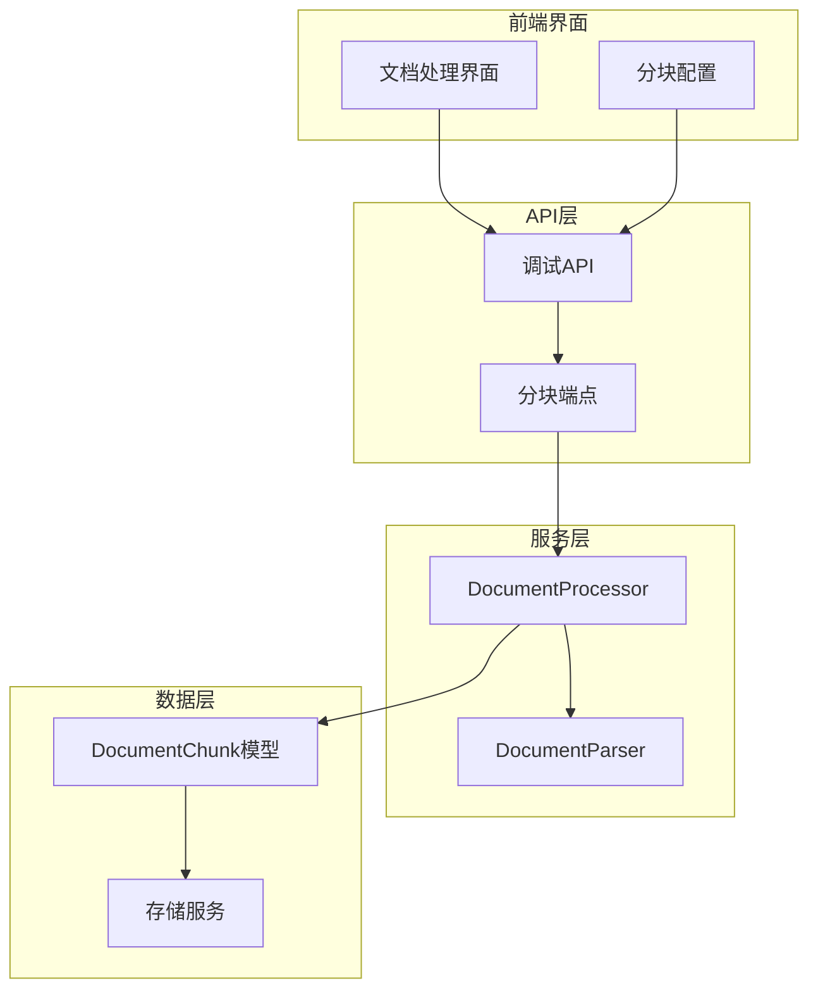
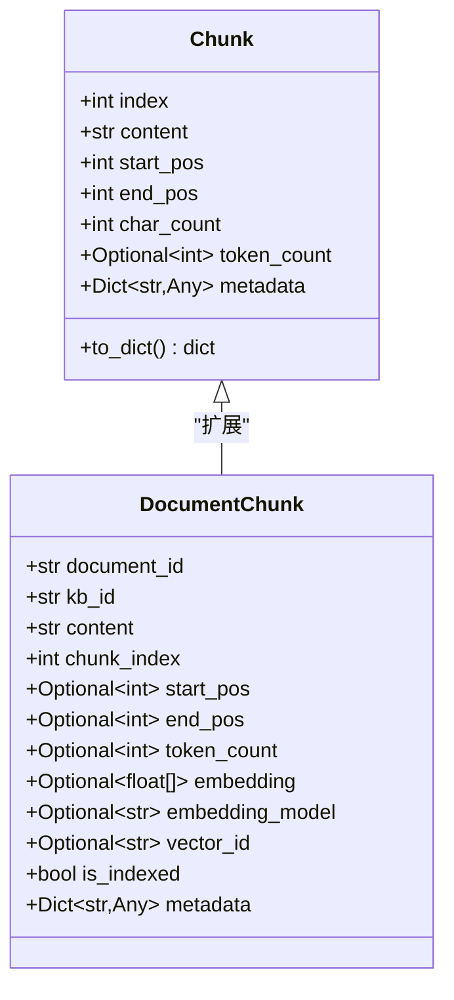
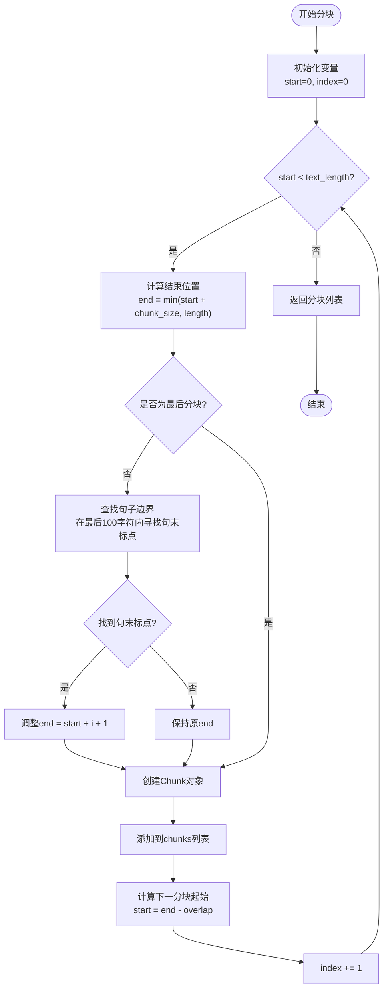
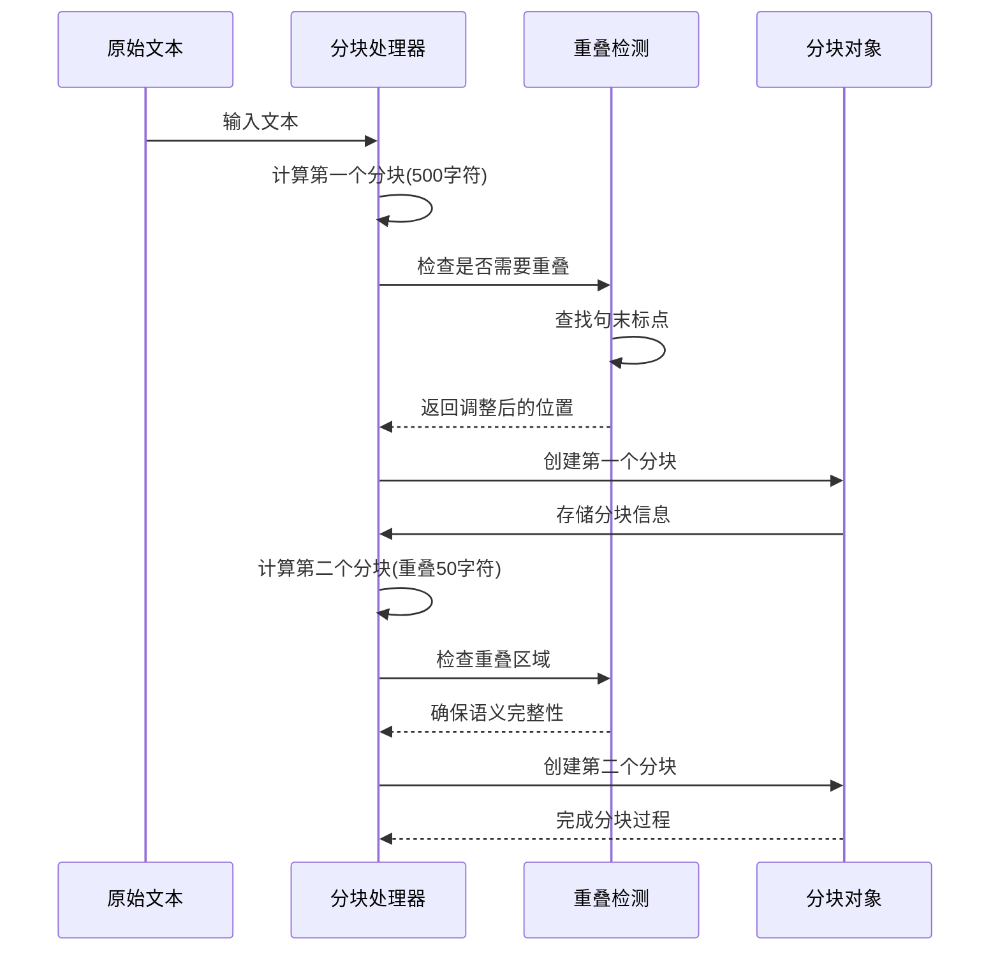
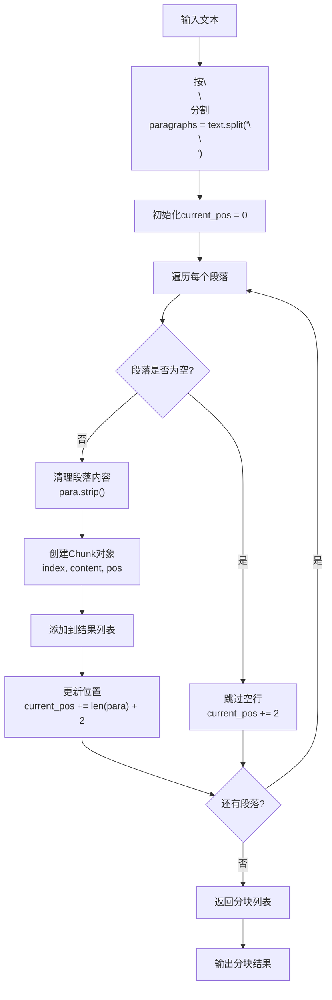
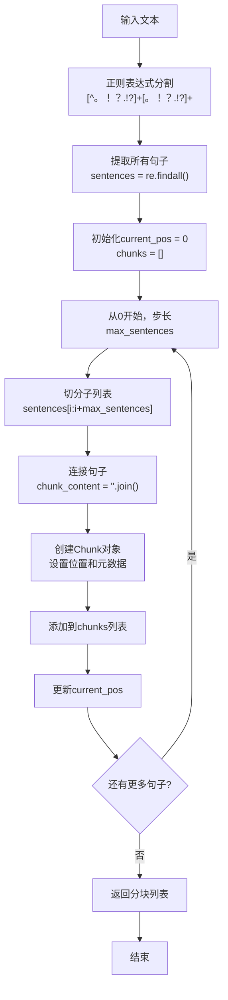
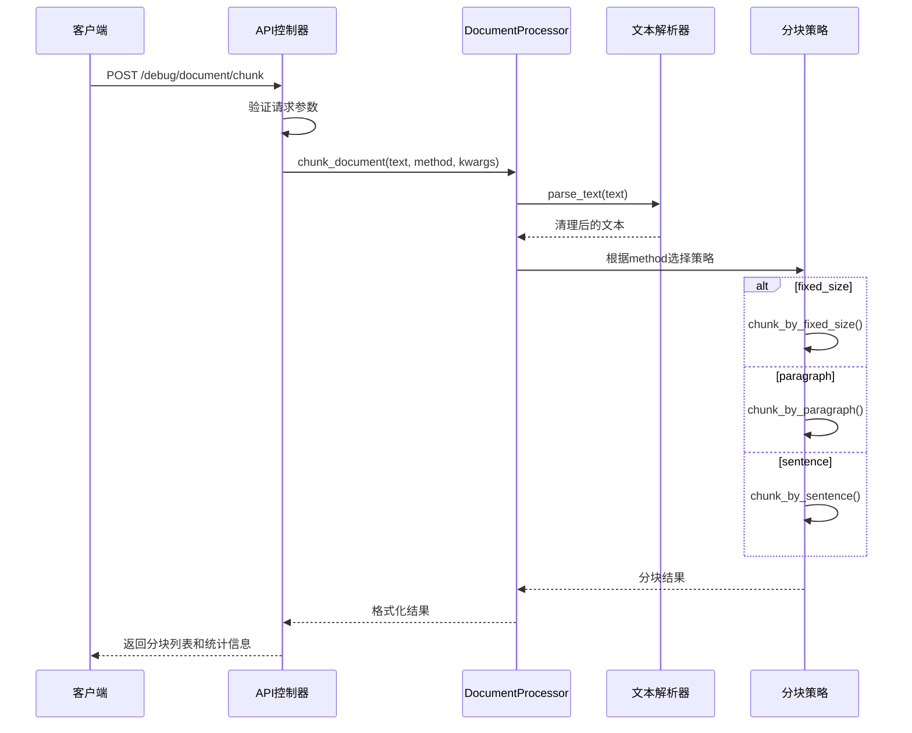

# 分块策略

<cite>
**本文档引用的文件**
- [document_processor.py](file://backend/app/services/document_processor.py)
- [debug_pipeline.py](file://backend/app/controllers/debug_pipeline.py)
- [document.py](file://backend/app/models/document.py)
- [document-processing.tsx](file://web/components/views/document-processing.tsx)
- [api.ts](file://web/lib/api.ts)
</cite>

## 目录
1. [简介](#简介)
2. [项目结构概览](#项目结构概览)
3. [核心数据结构](#核心数据结构)
4. [分块算法详解](#分块算法详解)
5. [统一入口设计](#统一入口设计)
6. [文本预处理与辅助功能](#文本预处理与辅助功能)
7. [API接口设计](#api接口设计)
8. [性能考虑](#性能考虑)
9. [故障排除指南](#故障排除指南)
10. [总结](#总结)

## 简介

DocumentProcessor是RAG Studio系统中的核心文档处理组件，提供了三种智能分块算法，能够根据不同场景需求将大段文本分割成适合向量化和检索的小块。该系统采用模块化设计，支持固定大小分块、段落分块和句子分块三种策略，每种策略都针对不同的应用场景进行了优化。

## 项目结构概览

DocumentProcessor位于服务层的核心位置，作为文档处理管道的第一步，为后续的向量化和检索提供基础数据结构。



**图表来源**
- [document_processing.tsx](file://web/components/views/document-processing.tsx#L1-L32)
- [debug_pipeline.py](file://backend/app/controllers/debug_pipeline.py#L174-L215)

**章节来源**
- [document_processor.py](file://backend/app/services/document_processor.py#L37-L328)
- [debug_pipeline.py](file://backend/app/controllers/debug_pipeline.py#L1-L215)

## 核心数据结构

### Chunk数据类设计

Chunk类是整个分块系统的核心数据结构，包含了分块的所有关键信息：



**图表来源**
- [document_processor.py](file://backend/app/services/document_processor.py#L14-L35)
- [document.py](file://backend/app/models/document.py#L77-L114)

#### 字段详解

| 字段名 | 类型 | 描述 | 用途 |
|--------|------|------|------|
| index | int | 分块索引号 | 唯一标识分块顺序 |
| content | str | 分块内容 | 实际的文本内容 |
| start_pos | int | 起始位置 | 在原文中的字符起始位置 |
| end_pos | int | 结束位置 | 在原文中的字符结束位置 |
| char_count | int | 字符数 | 当前分块的字符长度 |
| token_count | Optional[int] | Token数量 | 可选的token估算值 |
| metadata | Dict[str,Any] | 元数据 | 包含分块方法、统计信息等 |

**章节来源**
- [document_processor.py](file://backend/app/services/document_processor.py#L14-L35)

## 分块算法详解

### chunk_by_fixed_size - 固定大小分块

固定大小分块是最常用的分块策略，通过设定固定的字符数来分割文本，支持重叠机制和句子边界优化。

#### 核心特性

1. **固定大小策略**：每次分块固定指定字符数
2. **重叠机制**：支持前后分块之间的字符重叠
3. **句子边界优化**：在接近边界处寻找句子结束符
4. **字符级切分**：精确控制每个分块的大小

#### 算法流程



**图表来源**
- [document_processor.py](file://backend/app/services/document_processor.py#L60-L119)

#### 重叠机制实现

重叠机制确保相邻分块之间有语义连续性：



**图表来源**
- [document_processor.py](file://backend/app/services/document_processor.py#L89-L118)

**章节来源**
- [document_processor.py](file://backend/app/services/document_processor.py#L60-L119)

### chunk_by_paragraph - 段落分块

基于双换行符的段落分割方法，适用于结构化文档的处理。

#### 实现特点

1. **段落边界识别**：使用`\n\n`作为段落分隔符
2. **位置追踪**：精确记录每个段落在原文中的位置
3. **空行处理**：自动跳过空行和无效段落
4. **语义完整性**：保持段落的完整性和语义连贯性

#### 段落分割流程



**图表来源**
- [document_processor.py](file://backend/app/services/document_processor.py#L124-L157)

**章节来源**
- [document_processor.py](file://backend/app/services/document_processor.py#L124-L157)

### chunk_by_sentence - 句子分块

基于正则表达式的中英文句子识别与聚合算法，支持最大句子数配置。

#### 句子识别策略

1. **多语言支持**：同时识别中英文句子
2. **正则表达式匹配**：使用模式`[^。！？.!?]+[。！？.!?]+`
3. **句子聚合**：支持将多个句子组合成一个分块
4. **位置追踪**：精确记录每个句子在原文中的位置

#### 句子分块算法



**图表来源**
- [document_processor.py](file://backend/app/services/document_processor.py#L160-L200)

#### 中英文句子识别

系统使用统一的正则表达式模式来识别中英文句子：

| 语言 | 句末符号 | 正则模式示例 |
|------|----------|-------------|
| 中文 | 句号、感叹号、问号 | `[^。！？]+[。！？]+` |
| 英文 | 句号、感叹号、问号 | `[^.!?]+[.!?]+` |
| 混合 | 中英文句末符号 | `[^。！？.!?]+[。！？.!?]+` |

**章节来源**
- [document_processor.py](file://backend/app/services/document_processor.py#L160-L200)

## 统一入口设计

### chunk_document - 统一分块入口

`chunk_document`方法作为所有分块策略的统一入口，根据配置参数选择合适的分块方法。

#### 方法调用流程



**图表来源**
- [debug_pipeline.py](file://backend/app/controllers/debug_pipeline.py#L174-L215)
- [document_processor.py](file://backend/app/services/document_processor.py#L204-L232)

#### 配置参数说明

| 参数名 | 类型 | 默认值 | 描述 |
|--------|------|--------|------|
| text | str | 必需 | 输入的原始文本 |
| method | str | "fixed_size" | 分块方法类型 |
| chunk_size | int | 500 | 固定大小分块的字符数 |
| chunk_overlap | int | 50 | 重叠字符数 |
| max_sentences | int | 5 | 句子分块的最大句子数 |

**章节来源**
- [document_processor.py](file://backend/app/services/document_processor.py#L204-L232)
- [debug_pipeline.py](file://backend/app/controllers/debug_pipeline.py#L31-L40)

## 文本预处理与辅助功能

### parse_text - 文本清理功能

`parse_text`方法负责清理和规范化输入文本，提高分块质量。

#### 清理策略

1. **空行移除**：去除多余的空白行
2. **首尾去空**：清理每行的首尾空白字符
3. **内容标准化**：统一换行符格式

```mermaid
flowchart TD
Input[原始文本] --> SplitLines["按行分割<br/>lines = text.split('\\n')"]
SplitLines --> FilterEmpty["过滤空行<br/>line.strip() for line in lines if line.strip()]
FilterEmpty --> JoinLines["重新连接<br/>\\n.join(filtered_lines)"]
JoinLines --> Output[清理后的文本]
```

**图表来源**
- [document_processor.py](file://backend/app/services/document_processor.py#L52-L57)

### estimate_tokens - Token估算功能

`estimate_tokens`方法提供粗略的token数量估算，帮助用户理解文本的复杂度。

#### 估算算法

系统采用简单的加权算法来估算token数量：

| 字符类型 | 估算权重 | 说明 |
|----------|----------|------|
| 中文字符 | 1.5 tokens/字符 | 中文字符通常对应多个token |
| 英文字符 | 1 token/4字符 | 英文单词平均4字符对应1 token |
| 其他字符 | 1 token/字符 | 标点符号等特殊字符 |

#### 估算公式

```
tokens = int(chinese_chars × 1.5 + other_chars ÷ 4)
```

**章节来源**
- [document_processor.py](file://backend/app/services/document_processor.py#L235-L246)

## API接口设计

### 分块API端点

系统提供了RESTful API接口来访问分块功能：

#### 端点定义

| 端点 | 方法 | 功能 | 请求体 |
|------|------|------|-------|
| `/debug/document/chunk` | POST | 文档分块 | ChunkRequest |

#### 请求参数

```typescript
interface ChunkRequest {
  text: string;           // 输入文本
  method: string;         // 分块方法
  chunk_size?: number;    // 分块大小（固定大小分块）
  chunk_overlap?: number; // 重叠大小
  max_sentences?: number; // 最大句子数（句子分块）
}
```

#### 响应格式

```typescript
interface ChunkResponse {
  success: boolean;
  data: {
    chunks: Array<{
      index: number;
      content: string;
      start_pos: number;
      end_pos: number;
      char_count: number;
      token_count?: number;
      metadata: Record<string, any>;
    }>;
    statistics: {
      total_chunks: number;
      avg_chunk_size: number;
      max_chunk_size: number;
      min_chunk_size: number;
    };
  };
  message: string;
}
```

**章节来源**
- [debug_pipeline.py](file://backend/app/controllers/debug_pipeline.py#L174-L215)
- [api.ts](file://web/lib/api.ts#L875-L885)

## 性能考虑

### 时间复杂度分析

| 分块方法 | 时间复杂度 | 空间复杂度 | 适用场景 |
|----------|------------|------------|----------|
| fixed_size | O(n) | O(n) | 大多数场景 |
| paragraph | O(n) | O(n) | 结构化文档 |
| sentence | O(n×m) | O(n) | 需要语义完整性 |

其中：
- n = 文本总字符数
- m = 平均句子数

### 内存优化策略

1. **流式处理**：支持大文件的分块处理
2. **延迟加载**：只在需要时计算token数量
3. **内存复用**：重用中间变量减少内存分配

### 性能调优建议

1. **合理设置chunk_size**：平衡分块数量和语义完整性
2. **控制chunk_overlap**：避免过多的重复信息
3. **选择合适的分块方法**：根据文档类型选择最优策略

## 故障排除指南

### 常见问题及解决方案

#### 1. 分块结果不符合预期

**症状**：分块过于零碎或过大
**原因**：chunk_size设置不当
**解决方案**：
- 检查文本长度和期望的分块粒度
- 调整chunk_size参数
- 考虑使用paragraph方法处理结构化文档

#### 2. 句子分块效果不佳

**症状**：句子被错误分割或合并
**原因**：正则表达式无法正确识别句子边界
**解决方案**：
- 检查文本的语言类型
- 调整max_sentences参数
- 考虑使用fixed_size方法

#### 3. 性能问题

**症状**：大文档分块耗时过长
**原因**：文本过大或分块策略选择不当
**解决方案**：
- 分批处理大文档
- 选择更高效的分块方法
- 优化服务器资源配置

**章节来源**
- [document_processor.py](file://backend/app/services/document_processor.py#L60-L246)

## 总结

DocumentProcessor提供了三种智能分块算法，每种算法都有其独特的优势和适用场景：

1. **chunk_by_fixed_size**：最适合大多数场景，提供灵活的大小控制和重叠机制
2. **chunk_by_paragraph**：适用于结构化文档，保持段落的完整性
3. **chunk_by_sentence**：提供最佳的语义完整性，适合需要精确语义边界的场景

通过统一的API接口和完善的辅助功能，该系统为RAG应用提供了高质量的文档预处理能力。合理的配置和使用策略能够显著提升后续向量化和检索的效果。