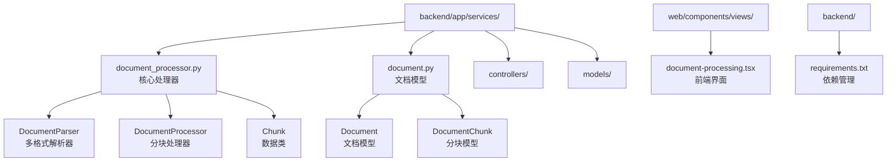
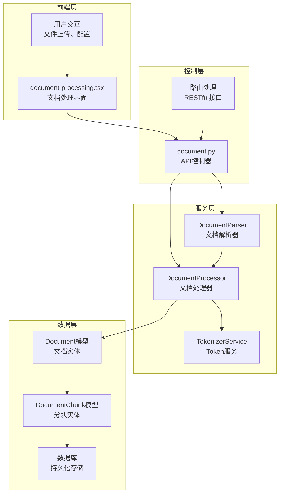
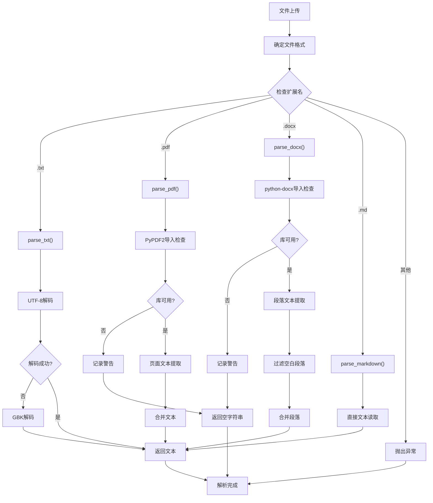
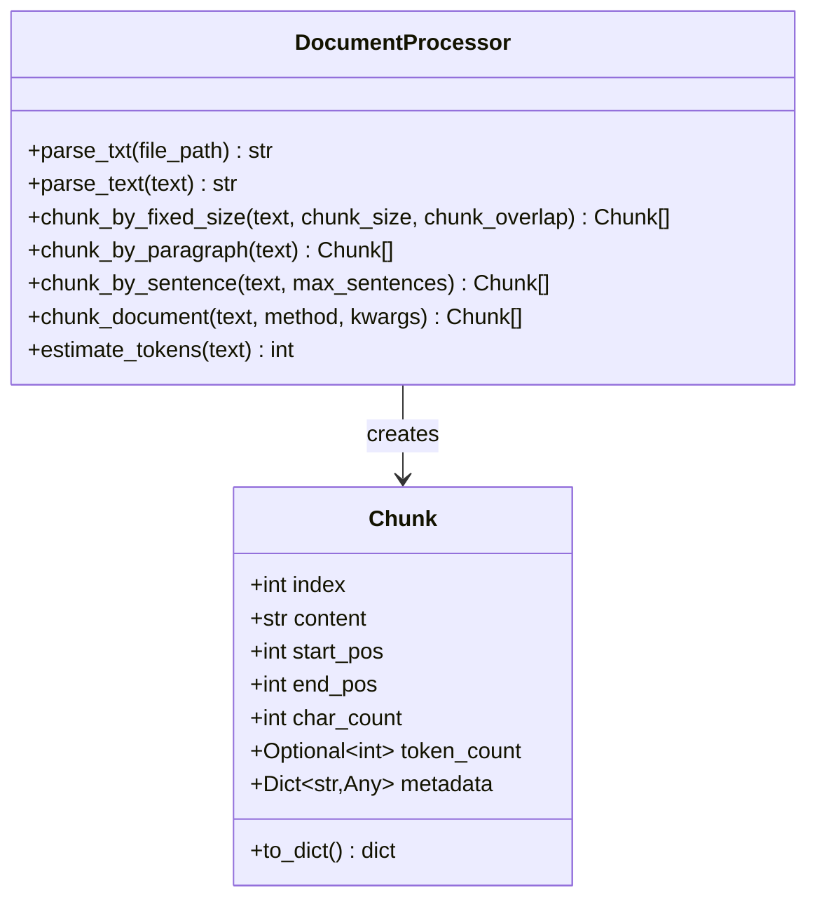
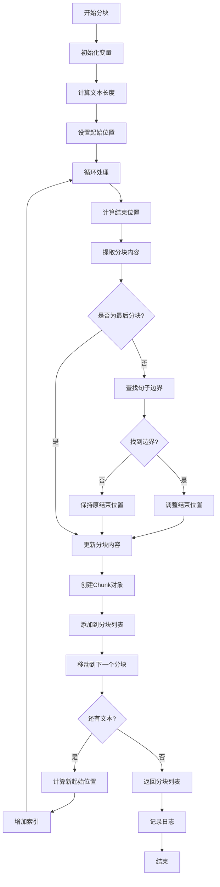
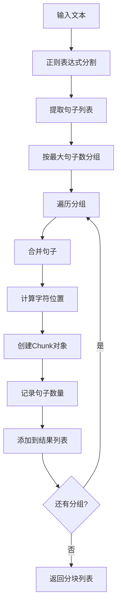
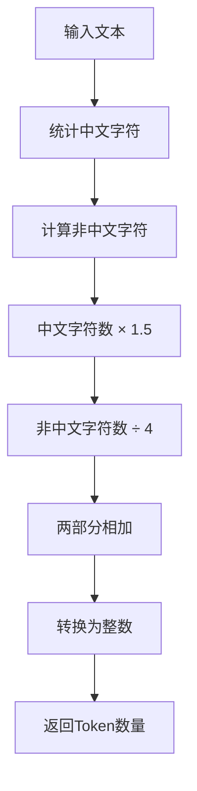
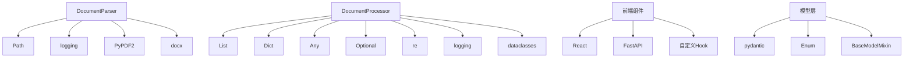

# 文档处理服务

<cite>
**本文档引用的文件**
- [document_processor.py](file://backend/app/services/document_processor.py)
- [document.py](file://backend/app/models/document.py)
- [document.py](file://backend/app/controllers/document.py)
- [document-processing.tsx](file://web/components/views/document-processing.tsx)
- [requirements.txt](file://backend/requirements.txt)
</cite>

## 目录
1. [简介](#简介)
2. [项目结构](#项目结构)
3. [核心组件](#核心组件)
4. [架构概览](#架构概览)
5. [详细组件分析](#详细组件分析)
6. [依赖关系分析](#依赖关系分析)
7. [性能考虑](#性能考虑)
8. [故障排除指南](#故障排除指南)
9. [结论](#结论)

## 简介

RAG-Studio的文档处理服务是一个综合性的文档解析和分块处理系统，专门设计用于处理多种格式的文档（TXT、PDF、DOCX、MD等），并提供灵活的分块策略以满足不同的RAG（检索增强生成）应用场景需求。

该服务的核心功能包括：
- 多格式文档解析
- 智能文本清理和规范化
- 多种分块策略（固定大小、段落、句子）
- Token数量估算
- 元数据记录和管理

## 项目结构

文档处理服务主要分布在以下目录结构中：

**图表来源**
- [document_processor.py](file://backend/app/services/document_processor.py#L1-L328)
- [document.py](file://backend/app/models/document.py#L1-L116)

**章节来源**
- [document_processor.py](file://backend/app/services/document_processor.py#L1-L50)
- [document.py](file://backend/app/models/document.py#L1-L30)

## 核心组件

### DocumentParser - 多格式文档解析器

DocumentParser是文档处理服务的核心解析器，支持多种文档格式的统一解析接口：

- **TXT文件解析**：支持UTF-8和GBK编码
- **PDF文件解析**：基于PyPDF2库，提取页面文本
- **DOCX文件解析**：基于python-docx库，提取段落文本
- **Markdown文件解析**：直接作为文本处理

### DocumentProcessor - 文档分块处理器

DocumentProcessor提供了三种智能分块策略：

- **固定大小分块**：支持自定义分块大小和重叠设置
- **段落分块**：按自然段落边界进行分割
- **句子分块**：基于句子边界进行聚合

### Chunk数据类

Chunk类是文档分块的核心数据结构，包含完整的分块信息：

- 分块索引和内容
- 字符位置信息
- 字符计数和Token估算
- 元数据记录机制

**章节来源**
- [document_processor.py](file://backend/app/services/document_processor.py#L249-L328)
- [document_processor.py](file://backend/app/services/document_processor.py#L14-L35)

## 架构概览

文档处理服务采用模块化架构设计，各组件职责明确，便于扩展和维护：

**图表来源**
- [document-processing.tsx](file://web/components/views/document-processing.tsx#L1-L422)
- [document.py](file://backend/app/controllers/document.py#L1-L171)
- [document_processor.py](file://backend/app/services/document_processor.py#L37-L248)

## 详细组件分析

### DocumentParser - 多格式文档解析器

DocumentParser实现了统一的文档解析接口，支持以下格式：

#### 支持的文件格式

| 格式 | 扩展名 | 解析方式 | 特殊处理 |
|------|--------|----------|----------|
| 文本文件 | .txt | UTF-8/GBK编码读取 | 自动检测编码 |
| Markdown | .md | 直接文本读取 | 无特殊处理 |
| PDF文档 | .pdf | PyPDF2页面提取 | 错误处理和警告 |
| Word文档 | .docx | python-docx段落提取 | 过滤空白段落 |

#### 解析流程图

**图表来源**
- [document_processor.py](file://backend/app/services/document_processor.py#L252-L328)

**章节来源**
- [document_processor.py](file://backend/app/services/document_processor.py#L249-L328)

### DocumentProcessor - 文档分块处理器

DocumentProcessor提供了三种智能分块策略，每种策略都针对不同的应用场景进行了优化。

#### Chunk数据类设计

Chunk类是文档分块的核心数据结构，具有以下特性：

**图表来源**
- [document_processor.py](file://backend/app/services/document_processor.py#L14-L35)
- [document_processor.py](file://backend/app/services/document_processor.py#L37-L248)

#### 固定大小分块策略

固定大小分块是最常用的分块策略，支持以下特性：

- **自定义分块大小**：默认500字符
- **可配置重叠**：默认50字符，避免语义断裂
- **句子边界优化**：在分块末尾寻找句子结束符
- **智能边界调整**：确保不破坏句子完整性

##### 固定大小分块算法流程

**图表来源**
- [document_processor.py](file://backend/app/services/document_processor.py#L60-L119)

#### 段落分块策略

段落分块策略按文档的自然段落边界进行分割，适用于：

- 结构化文档（技术文档、论文等）
- 需要保持段落完整性的场景
- 段落间有明显逻辑关系的文档

##### 段落分块实现特点

- 使用`\n\n`作为段落分隔符
- 自动跳过空白段落
- 保持段落间的相对位置信息
- 记录精确的字符位置

#### 句子分块策略

句子分块策略基于句子边界进行聚合，支持：

- **可配置句子数量**：默认最多5个句子
- **中英文兼容**：支持中文句号、感叹号和英文标点
- **语义完整性**：确保每个分块包含完整的句子

##### 句子分块算法

**图表来源**
- [document_processor.py](file://backend/app/services/document_processor.py#L160-L201)

**章节来源**
- [document_processor.py](file://backend/app/services/document_processor.py#L37-L248)

### Token估算机制

DocumentProcessor提供了简单的Token估算功能，支持中英文混合文本：

#### 估算规则

| 字符类型 | 估算权重 | 说明 |
|----------|----------|------|
| 中文字符 | 1.5 tokens/字符 | 中文字符密度较高 |
| 英文字符 | 1 token/4字符 | 英文单词平均长度 |

#### Token估算算法

**图表来源**
- [document_processor.py](file://backend/app/services/document_processor.py#L235-L246)

**章节来源**
- [document_processor.py](file://backend/app/services/document_processor.py#L235-L246)

### 文本清理和规范化

DocumentProcessor提供了文本清理功能，确保输入文本的质量：

#### 清理规则

- **移除多余空行**：只保留非空行
- **去除行首尾空白**：保持文本整洁
- **保持换行结构**：维护文档的视觉结构

**章节来源**
- [document_processor.py](file://backend/app/services/document_processor.py#L41-L57)

## 依赖关系分析

文档处理服务的依赖关系清晰明确，遵循单一职责原则：

**图表来源**
- [document_processor.py](file://backend/app/services/document_processor.py#L1-L12)
- [document.py](file://backend/app/models/document.py#L1-L11)

### 外部依赖

#### 必需依赖
- **PyPDF2**：PDF文档解析
- **python-docx**：Word文档解析
- **jieba**：中文分词（虽然未直接使用，但可能用于扩展）

#### 可选依赖
- **FastAPI**：Web框架
- **Pydantic**：数据验证
- **SQLAlchemy**：数据库ORM

**章节来源**
- [requirements.txt](file://backend/requirements.txt#L1-L45)

## 性能考虑

### 文档解析性能

- **流式处理**：PDF和DOCX解析采用流式方式，避免内存溢出
- **错误恢复**：提供优雅的错误处理和降级方案
- **缓存机制**：解析结果可被缓存复用

### 分块处理性能

- **增量处理**：支持增量分块，避免重复计算
- **内存优化**：Chunk对象设计紧凑，减少内存占用
- **并发支持**：各分块策略独立，可并行处理

### Token估算性能

- **简单算法**：基于字符统计的快速估算
- **预计算**：可预先计算常见文本的Token数量
- **近似值**：提供足够准确的估算，平衡精度和性能

## 故障排除指南

### 常见问题及解决方案

#### PDF解析失败

**问题描述**：PDF文档无法正确解析

**可能原因**：
- PyPDF2库未安装
- PDF文档加密或受保护
- PDF格式不标准

**解决方案**：
1. 安装PyPDF2：`pip install PyPDF2`
2. 检查PDF文档是否加密
3. 尝试使用其他PDF解析工具

#### DOCX解析失败

**问题描述**：Word文档解析异常

**可能原因**：
- python-docx库未安装
- DOCX文件损坏
- 文档包含特殊格式

**解决方案**：
1. 安装python-docx：`pip install python-docx`
2. 验证DOCX文件完整性
3. 简化文档格式后重试

#### 编码问题

**问题描述**：TXT文件读取出现编码错误

**解决方案**：
1. 系统自动尝试UTF-8和GBK编码
2. 如仍有问题，手动指定编码
3. 转换文件编码格式

#### 分块效果不佳

**问题描述**：分块结果不符合预期

**优化建议**：
1. 调整分块大小参数
2. 修改重叠设置
3. 选择合适的分块策略
4. 检查文本预处理效果

**章节来源**
- [document_processor.py](file://backend/app/services/document_processor.py#L300-L328)

## 结论

RAG-Studio的文档处理服务提供了一个完整、灵活且高性能的文档解析和分块解决方案。其主要优势包括：

### 技术优势

- **多格式支持**：覆盖主流文档格式，满足多样化需求
- **智能分块策略**：提供三种不同策略，适应不同应用场景
- **完善的错误处理**：优雅的降级机制和详细的日志记录
- **可扩展架构**：模块化设计便于功能扩展

### 应用价值

- **提升RAG质量**：通过智能分块提高检索准确性
- **简化开发流程**：统一的接口和标准化的处理流程
- **保证系统稳定性**：健壮的错误处理和性能优化
- **支持业务发展**：灵活的配置和扩展能力

### 发展方向

1. **格式扩展**：支持更多文档格式（如HTML、EPUB等）
2. **算法优化**：改进分块算法，提高语义完整性
3. **性能提升**：引入并行处理和缓存机制
4. **功能增强**：添加文档结构识别和元数据提取

该文档处理服务为RAG-Studio提供了坚实的基础支撑，是构建高质量检索增强生成系统的重要组成部分。