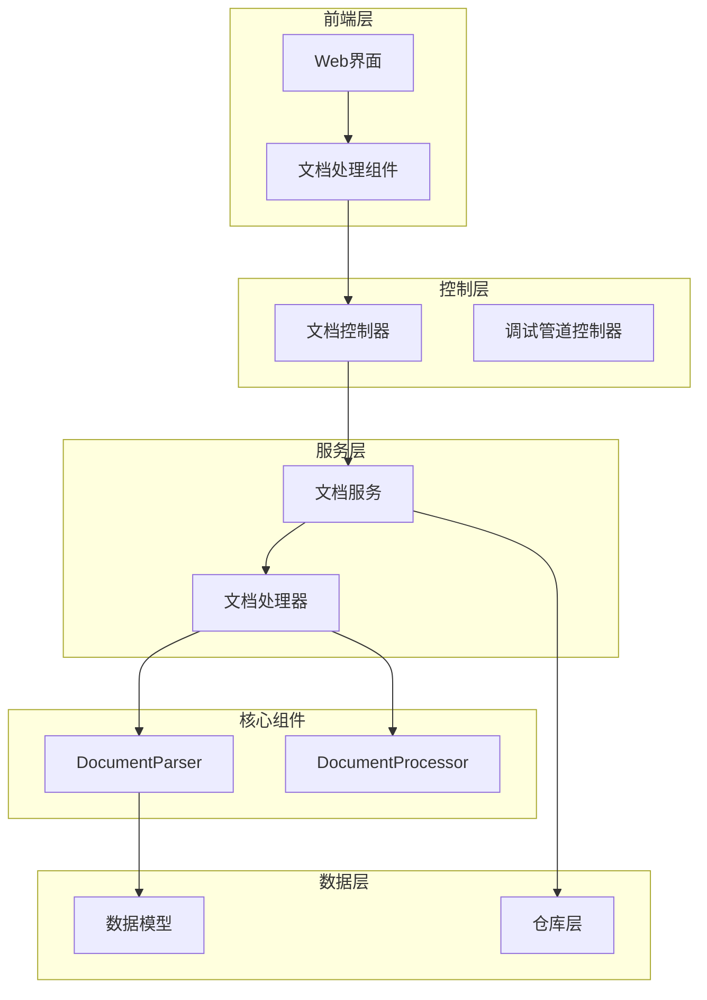
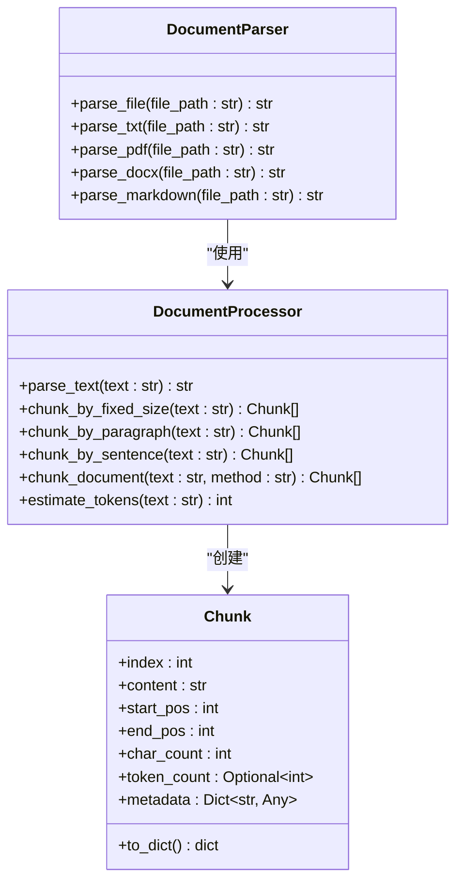
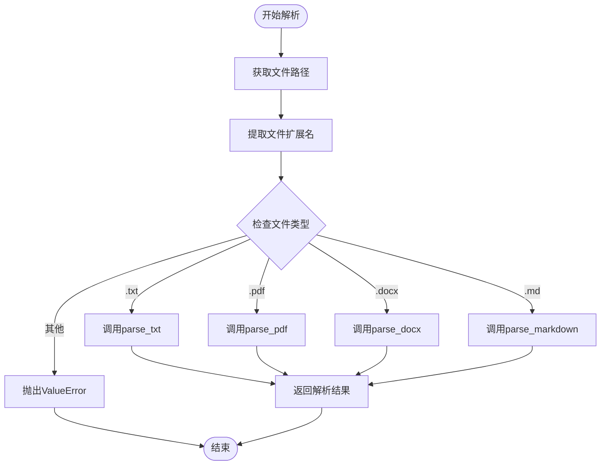
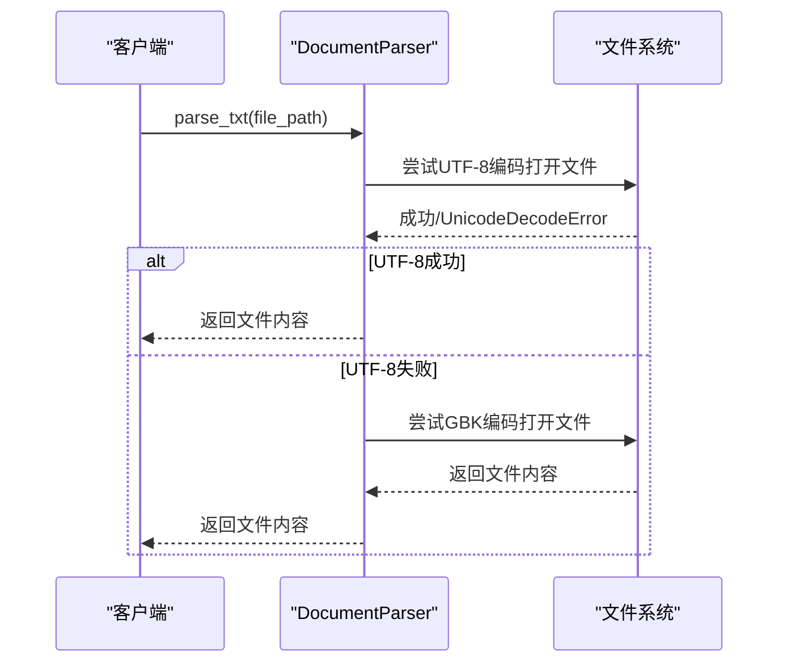
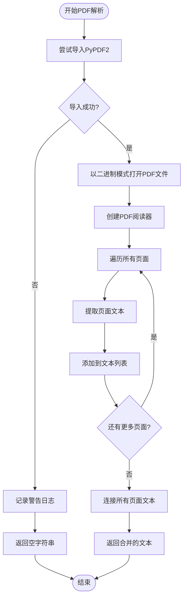
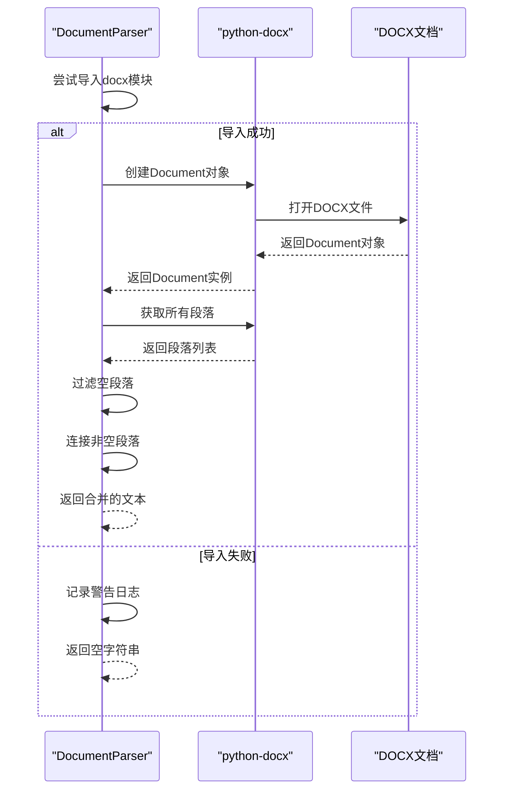
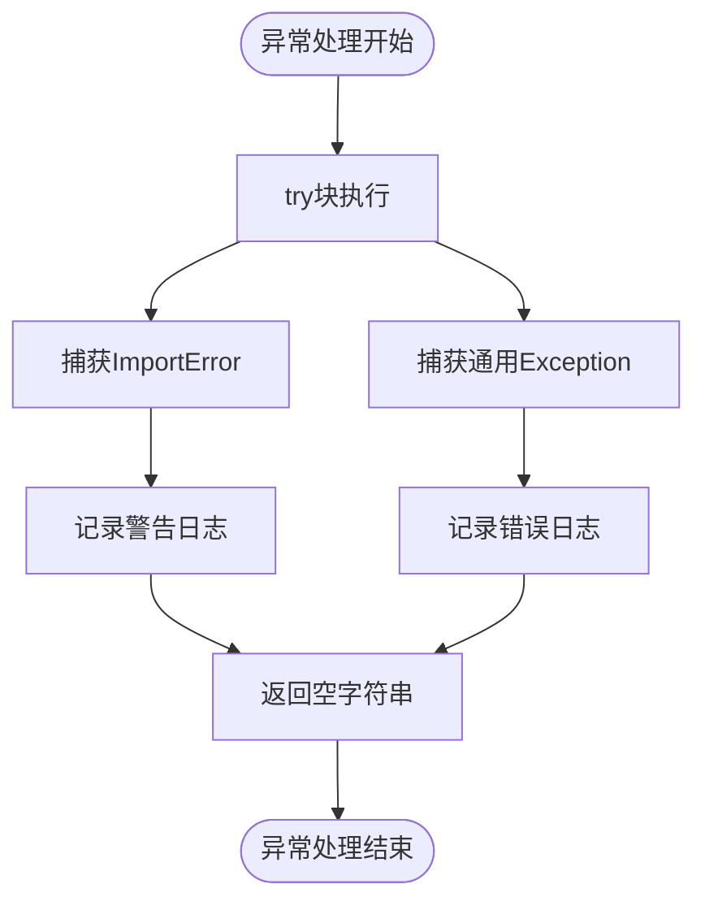
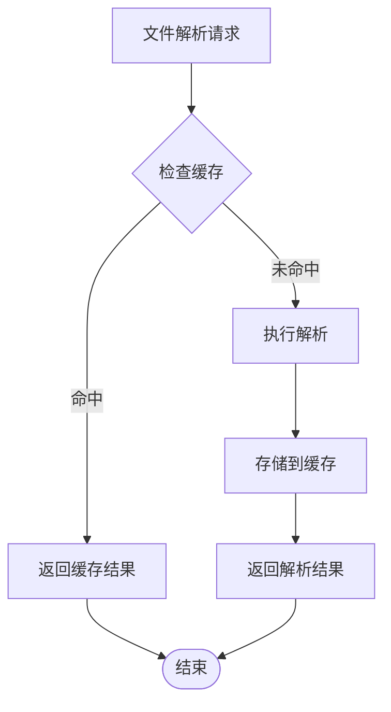

# 文档解析器详细文档

<cite>
**本文档引用的文件**
- [document_processor.py](file://backend/app/services/document_processor.py)
- [document.py](file://backend/app/services/document.py)
- [document.py](file://backend/app/controllers/document.py)
- [document.py](file://backend/app/models/document.py)
- [document.py](file://backend/app/schemas/document.py)
- [requirements.txt](file://backend/requirements.txt)
</cite>

## 目录
1. [简介](#简介)
2. [项目结构概览](#项目结构概览)
3. [DocumentParser类核心架构](#documentparser类核心架构)
4. [文件解析方法详解](#文件解析方法详解)
5. [异常处理机制](#异常处理机制)
6. [扩展新文档格式指南](#扩展新文档格式指南)
7. [性能考虑](#性能考虑)
8. [故障排除指南](#故障排除指南)
9. [总结](#总结)

## 简介

DocumentParser类是RAG Studio项目中的核心文档解析组件，专门负责处理多种文档格式的文本提取和解析。该类采用工厂模式设计，根据文件扩展名自动路由到相应的解析器，支持TXT、PDF、DOCX和Markdown等多种常见文档格式。

该项目是一个基于FastAPI的RAG（检索增强生成）系统，旨在为知识库构建提供完整的文档处理流水线，包括文档上传、解析、分块、嵌入和索引等功能。

## 项目结构概览



**图表来源**
- [document.py](file://backend/app/controllers/document.py#L1-L171)
- [document.py](file://backend/app/services/document.py#L1-L220)
- [document_processor.py](file://backend/app/services/document_processor.py#L248-L328)

**章节来源**
- [document.py](file://backend/app/controllers/document.py#L1-L171)
- [document.py](file://backend/app/services/document.py#L1-L220)
- [document_processor.py](file://backend/app/services/document_processor.py#L1-L328)

## DocumentParser类核心架构

DocumentParser类采用静态方法设计，提供了统一的文档解析接口。该类的核心设计理念是通过文件扩展名识别机制，自动选择最适合的解析器。



**图表来源**
- [document_processor.py](file://backend/app/services/document_processor.py#L248-L328)
- [document_processor.py](file://backend/app/services/document_processor.py#L14-L35)

### 核心设计原则

1. **单一职责原则**: 每个解析方法专注于特定文件格式
2. **开闭原则**: 易于扩展新的文档格式支持
3. **依赖倒置原则**: 通过接口抽象减少耦合
4. **异常安全**: 完善的异常处理机制确保系统稳定性

**章节来源**
- [document_processor.py](file://backend/app/services/document_processor.py#L248-L328)

## 文件解析方法详解

### parse_file方法 - 文件路由核心

parse_file方法是DocumentParser的入口点，它根据文件扩展名智能路由到相应的解析器：



**图表来源**
- [document_processor.py](file://backend/app/services/document_processor.py#L252-L275)

### parse_txt方法 - 多编码支持

parse_txt方法实现了智能编码检测机制，优先使用UTF-8编码，当遇到UnicodeDecodeError时自动降级到GBK编码：



**图表来源**
- [document_processor.py](file://backend/app/services/document_processor.py#L277-L285)

### parse_pdf方法 - PyPDF2集成

parse_pdf方法基于PyPDF2库实现PDF文档的页面级文本提取：



**图表来源**
- [document_processor.py](file://backend/app/services/document_processor.py#L295-L311)

### parse_docx方法 - python-docx集成

parse_docx方法利用python-docx库提取DOCX文档的段落内容：



**图表来源**
- [document_processor.py](file://backend/app/services/document_processor.py#L313-L325)

### parse_markdown方法 - 纯文本读取策略

parse_markdown方法采用最简化的处理策略，直接将Markdown文件作为纯文本读取：


**图表来源**
- [document_processor.py](file://backend/app/services/document_processor.py#L287-L293)

**章节来源**
- [document_processor.py](file://backend/app/services/document_processor.py#L252-L325)

## 异常处理机制

DocumentParser类实现了完善的异常处理机制，确保系统在各种异常情况下的稳定运行：

### 依赖库未安装的降级处理

对于需要第三方库支持的解析器（PDF和DOCX），系统实现了优雅的降级机制：

| 解析器 | 依赖库 | 降级策略 | 日志级别 |
|--------|--------|----------|----------|
| parse_pdf | PyPDF2 | 返回空字符串 | WARNING |
| parse_docx | python-docx | 返回空字符串 | WARNING |

### 解析过程中的异常捕获

每个解析方法都包含了针对特定异常类型的处理：



**图表来源**
- [document_processor.py](file://backend/app/services/document_processor.py#L298-L311)
- [document_processor.py](file://backend/app/services/document_processor.py#L316-L325)

### 错误恢复策略

1. **编码错误恢复**: TXT文件解析时的多编码支持
2. **依赖缺失恢复**: 第三方库未安装时的功能降级
3. **解析失败恢复**: PDF和DOCX解析失败时的静默处理

**章节来源**
- [document_processor.py](file://backend/app/services/document_processor.py#L295-L325)

## 扩展新文档格式指南

### 添加新解析器的基本步骤

要扩展DocumentParser类支持新的文档格式，需要遵循以下步骤：

#### 1. 在parse_file方法中添加路由

```python
elif extension == '.newformat':
    return DocumentParser.parse_newformat(file_path)
```

#### 2. 实现具体的解析方法

```python
@staticmethod
def parse_newformat(file_path: str) -> str:
    """解析新格式文件"""
    try:
        # 实现具体解析逻辑
        pass
    except ImportError:
        logger.warning("新格式解析器依赖未安装")
        return ""
    except Exception as e:
        logger.error(f"新格式解析失败: {e}")
        return ""
```

#### 3. 更新支持的文件类型枚举

在DocumentType枚举中添加新的文件类型：

```python
class DocumentType(str, Enum):
    """文档类型"""
    TXT = "txt"
    PDF = "pdf"
    DOCX = "docx"
    MD = "md"
    NEWFORMAT = "newformat"  # 新增类型
```

### 推荐的第三方库集成

根据不同的文档格式，推荐使用以下第三方库：

| 文档格式 | 推荐库 | 功能特性 | 安装命令 |
|----------|--------|----------|----------|
| PPTX | python-pptx | PowerPoint解析 | pip install python-pptx |
| XLSX | openpyxl | Excel表格解析 | pip install openpyxl |
| HTML | BeautifulSoup | HTML内容提取 | pip install beautifulsoup4 |
| JSON | 内置 | 结构化数据解析 | pip install json |

### 扩展示例：添加PPTX支持

```python
@staticmethod
def parse_pptx(file_path: str) -> str:
    """解析PPTX文件"""
    try:
        from pptx import Presentation
        prs = Presentation(file_path)
        text_content = []
        
        for slide in prs.slides:
            for shape in slide.shapes:
                if hasattr(shape, "text"):
                    text_content.append(shape.text.strip())
        
        return '\n\n'.join(text_content)
    except ImportError:
        logger.warning("python-pptx未安装，PPTX解析功能不可用")
        return ""
    except Exception as e:
        logger.error(f"PPTX解析失败: {e}")
        return ""
```

### 集成第三方库的最佳实践

1. **延迟导入**: 在方法内部导入第三方库，避免全局依赖
2. **版本兼容性**: 检查库的版本兼容性
3. **性能优化**: 对大文件进行流式处理
4. **内存管理**: 及时释放不需要的对象引用

**章节来源**
- [document_processor.py](file://backend/app/services/document_processor.py#L252-L275)
- [document.py](file://backend/app/models/document.py#L24-L32)

## 性能考虑

### 文件大小处理策略

对于大型文档文件，建议采用以下策略：

1. **流式读取**: 对于超大文件，考虑使用流式处理
2. **分块处理**: 将大文件分割为较小的块进行处理
3. **内存监控**: 监控内存使用情况，避免内存溢出

### 缓存机制

虽然当前实现没有内置缓存，但可以考虑添加以下缓存策略：



### 并发处理

对于高并发场景，可以考虑：

1. **异步处理**: 使用asyncio实现异步解析
2. **进程池**: 利用multiprocessing处理CPU密集型任务
3. **队列系统**: 使用消息队列处理批量文档解析

## 故障排除指南

### 常见问题及解决方案

#### 1. PyPDF2未安装错误

**症状**: PDF文件解析失败，返回空字符串
**原因**: PyPDF2库未安装
**解决方案**: 
```bash
pip install PyPDF2
```

#### 2. python-docx未安装错误

**症状**: DOCX文件解析失败，返回空字符串
**原因**: python-docx库未安装
**解决方案**:
```bash
pip install python-docx
```

#### 3. 编码问题

**症状**: TXT文件显示乱码或解析失败
**原因**: 文件使用非UTF-8编码
**解决方案**: 系统已自动尝试GBK编码，如果仍然失败，可能需要手动指定编码

#### 4. 文件权限问题

**症状**: 无法读取文件
**原因**: 文件权限不足或文件不存在
**解决方案**: 检查文件路径和权限设置

### 调试技巧

1. **启用详细日志**: 设置日志级别为DEBUG
2. **文件完整性检查**: 验证文件是否损坏
3. **依赖版本确认**: 检查第三方库版本兼容性
4. **内存使用监控**: 监控解析过程中的内存使用

### 性能优化建议

1. **批量处理**: 对多个文件进行批量解析
2. **预处理**: 在解析前对文件进行预处理
3. **资源池**: 使用连接池管理数据库连接
4. **压缩存储**: 对解析结果进行压缩存储

**章节来源**
- [document_processor.py](file://backend/app/services/document_processor.py#L298-L325)

## 总结

DocumentParser类是RAG Studio项目中文档处理系统的核心组件，它通过精心设计的架构实现了对多种文档格式的统一解析。该类的主要优势包括：

### 技术优势

1. **多格式支持**: 支持TXT、PDF、DOCX、Markdown等主流文档格式
2. **智能路由**: 基于文件扩展名的自动解析器选择
3. **异常安全**: 完善的异常处理和降级机制
4. **易于扩展**: 清晰的接口设计便于添加新的文档格式支持

### 架构特点

1. **模块化设计**: 每种格式的解析逻辑独立封装
2. **依赖隔离**: 第三方库的使用采用延迟导入策略
3. **日志友好**: 完善的日志记录便于问题诊断
4. **向后兼容**: 现有的解析器不会因新功能添加而受到影响

### 应用价值

DocumentParser类为整个RAG系统提供了可靠的文档解析基础，支撑着知识库构建、文档检索和内容理解等核心功能。其设计充分体现了软件工程的最佳实践，为大规模文档处理场景提供了稳定可靠的技术保障。

通过本文档的详细说明，开发者可以深入理解DocumentParser类的工作原理，并能够根据实际需求进行功能扩展和性能优化。