# RAG-Studio服务层深度架构文档

<cite>
**本文档引用的文件**
- [retrieval_service.py](file://backend/app/services/retrieval_service.py)
- [rag_service.py](file://backend/app/services/rag_service.py)
- [retriever_evaluation.py](file://backend/app/services/retriever_evaluation.py)
- [document_processor.py](file://backend/app/services/document_processor.py)
- [embedding_service.py](file://backend/app/services/embedding_service.py)
- [vector_db_service.py](file://backend/app/services/vector_db_service.py)
- [sparse_vector_service.py](file://backend/app/services/sparse_vector_service.py)
- [tokenizer_service.py](file://backend/app/services/tokenizer_service.py)
- [factory.py](file://backend/app/repositories/factory.py)
- [knowledge_base.py](file://backend/app/models/knowledge_base.py)
- [pipeline.py](file://backend/app/controllers/pipeline.py)
</cite>

## 目录
1. [概述](#概述)
2. [服务层架构总览](#服务层架构总览)
3. [核心服务模块详解](#核心服务模块详解)
4. [工厂模式与依赖注入](#工厂模式与依赖注入)
5. [服务间协作机制](#服务间协作机制)
6. [评估与监控体系](#评估与监控体系)
7. [扩展指南](#扩展指南)
8. [总结](#总结)

## 概述

RAG-Studio的服务层采用分层架构设计，通过工厂模式实现松耦合的服务解耦，为RAG（检索增强生成）系统提供完整的基础设施支撑。服务层包含五大核心模块：检索服务、RAG服务、评估服务、文档处理服务和嵌入服务，每个模块都遵循单一职责原则，通过标准化接口实现高度可扩展性。

## 服务层架构总览


**图表来源**
- [retrieval_service.py](file://backend/app/services/retrieval_service.py#L1-L50)
- [rag_service.py](file://backend/app/services/rag_service.py#L1-L30)
- [factory.py](file://backend/app/repositories/factory.py#L1-L40)

## 核心服务模块详解

### 检索服务模块（RetrievalService）

检索服务是RAG系统的核心组件，提供三种主要检索能力：向量检索、关键词检索和混合检索。

#### 核心功能架构


**图表来源**
- [retrieval_service.py](file://backend/app/services/retrieval_service.py#L136-L200)
- [retrieval_service.py](file://backend/app/services/retrieval_service.py#L44-L133)

#### 检索算法实现

检索服务实现了多种先进的检索算法：

1. **向量检索**：基于余弦相似度的高维向量空间搜索
2. **关键词检索**：基于BM25算法的密集文本匹配
3. **混合检索**：结合向量和关键词的RRF融合算法
4. **高级混合检索**：支持多种检索方式的动态组合

**章节来源**
- [retrieval_service.py](file://backend/app/services/retrieval_service.py#L136-L854)

### RAG服务模块（RAGService）

RAG服务整合检索和生成两大核心功能，提供完整的RAG处理链路。

#### RAG处理流程

```mermaid
sequenceDiagram
participant Client as 客户端
participant RAG as RAGService
participant KB as KnowledgeBase
participant ES as EmbeddingService
participant VDB as VectorDBService
participant LLM as LLM服务
Client->>RAG : generate(query, context)
RAG->>KB : 获取知识库配置
KB-->>RAG : 返回配置信息
alt context为空
RAG->>ES : embed_text(query)
ES-->>RAG : query_vector
RAG->>VDB : search(collection, query_vector)
VDB-->>RAG : 检索结果
RAG->>RAG : 构建上下文
end
RAG->>RAG : _build_prompt(query, context)
RAG->>LLM : _call_llm(prompt, model)
LLM-->>RAG : 生成答案
RAG-->>Client : 返回结果
```



**图表来源**
- [rag_service.py](file://backend/app/services/rag_service.py#L83-L165)

#### 检索与生成的协同逻辑

RAG服务通过以下机制实现检索与生成的无缝协同：

1. **智能上下文管理**：自动检测是否需要检索，动态构建上下文
2. **Prompt工程**：标准化的RAG prompt模板设计
3. **LLM集成**：支持多种LLM服务的统一接口
4. **错误处理**：完善的异常捕获和降级机制

**章节来源**
- [rag_service.py](file://backend/app/services/rag_service.py#L1-L165)

### 评估服务模块（RetrieverEvaluation）

评估服务基于RAGAS框架提供全面的检索质量评估体系。

#### 评估指标体系


**图表来源**
- [retriever_evaluation.py](file://backend/app/services/retriever_evaluation.py#L14-L100)
- [retriever_evaluation.py](file://backend/app/services/retriever_evaluation.py#L262-L330)

#### 评估指标计算

评估服务实现了多种专业评估指标：

1. **精确率（Precision@K）**：检索到的相关文档比例
2. **召回率（Recall@K）**：相关文档被检索到的比例  
3. **F1分数**：精确率和召回率的调和平均
4. **平均倒数排名（MRR）**：首个相关文档的排名倒数
5. **平均精度（MAP）**：各相关文档位置的精度平均
6. **NDCG**：归一化折损累积增益
7. **命中率（Hit Rate）**：至少检索到一个相关文档的概率

**章节来源**
- [retriever_evaluation.py](file://backend/app/services/retriever_evaluation.py#L1-L423)

### 文档处理服务模块（DocumentProcessor）

文档处理服务提供完整的文档解析、分块和预处理功能。

#### 文档处理流水线


**图表来源**
- [document_processor.py](file://backend/app/services/document_processor.py#L203-L232)

#### 分块策略对比

| 分块方法 | 适用场景 | 优势 | 劣势 |
|---------|----------|------|------|
| 固定大小 | 结构化文档 | 性能稳定，易于控制 | 可能破坏语义完整性 |
| 段落 | 技术文档 | 保持语义完整性 | 对齐困难 |
| 句子 | 学术论文 | 语义最完整 | 分块过多 |

**章节来源**
- [document_processor.py](file://backend/app/services/document_processor.py#L1-L328)

### 嵌入服务模块（EmbeddingService）

嵌入服务提供多种嵌入模型的统一接口，支持本地和云端模型。

#### 嵌入服务架构


**图表来源**
- [embedding_service.py](file://backend/app/services/embedding_service.py#L18-L50)
- [embedding_service.py](file://backend/app/services/embedding_service.py#L224-L257)

#### 错误处理与重试机制

嵌入服务实现了完善的错误处理机制：

1. **HTTP状态码处理**：针对不同HTTP状态码的差异化处理
2. **指数退避重试**：基于指数退避算法的智能重试
3. **超时控制**：可配置的请求超时时间和重试间隔
4. **连接池管理**：并发请求的合理控制

**章节来源**
- [embedding_service.py](file://backend/app/services/embedding_service.py#L1-L257)

## 工厂模式与依赖注入

### 服务工厂体系

RAG-Studio采用工厂模式实现服务的解耦和动态创建。

#### 工厂架构图


**图表来源**
- [embedding_service.py](file://backend/app/services/embedding_service.py#L224-L257)
- [vector_db_service.py](file://backend/app/services/vector_db_service.py#L1089-L1111)
- [sparse_vector_service.py](file://backend/app/services/sparse_vector_service.py#L272-L301)

### 依赖注入机制

#### 知识库配置驱动的依赖注入

服务层通过知识库配置实现自动化的依赖注入：

```python
# 知识库配置示例
{
    "embedding_provider": "ollama",
    "embedding_model": "nomic-embed-text",
    "vector_db_type": "qdrant",
    "chunk_size": 512,
    "retrieval_top_k": 5
}
```

这种设计的优势：
1. **配置驱动**：通过配置文件即可切换服务提供商
2. **零代码修改**：无需修改业务代码即可更换服务实现
3. **环境隔离**：开发、测试、生产环境可独立配置
4. **服务发现**：自动识别和创建对应的服务实例

**章节来源**
- [factory.py](file://backend/app/repositories/factory.py#L1-L116)
- [knowledge_base.py](file://backend/app/models/knowledge_base.py#L1-L80)

## 服务间协作机制

### 服务调用关系图


**图表来源**
- [rag_service.py](file://backend/app/services/rag_service.py#L1-L20)
- [retrieval_service.py](file://backend/app/services/retrieval_service.py#L136-L142)

### 协作模式分析

#### 1. 同步协作模式
适用于实时性要求高的场景，如RAG生成过程中的检索调用。

#### 2. 异步协作模式  
适用于批量处理场景，如文档预处理和向量索引构建。

#### 3. 事件驱动模式
适用于监控和评估场景，如检索结果的自动评估。

**章节来源**
- [pipeline.py](file://backend/app/controllers/pipeline.py#L1-L174)

## 评估与监控体系

### 评估指标体系

评估服务建立了完整的指标评估体系，涵盖检索质量和生成质量两个维度：

#### 检索质量评估指标

| 指标名称 | 计算公式 | 应用场景 |
|---------|----------|----------|
| Precision@K | | 检索准确性评估 |
| Recall@K | | 检索完整性评估 |
| F1 Score | | 综合性能评估 |
| MRR | | 排序质量评估 |
| MAP | | 平均精度评估 |
| NDCG | | 归一化增益评估 |
| Hit Rate | | 检索命中率评估 |

#### 生成质量评估指标

基于RAGAS框架的评估指标：
- **Context Precision**：上下文精确度
- **Context Recall**：上下文召回率
- **Faithfulness**：答案忠实度
- **Answer Relevancy**：答案相关性

**章节来源**
- [retriever_evaluation.py](file://backend/app/services/retriever_evaluation.py#L14-L259)

### 监控与告警机制

系统内置了多层次的监控机制：

1. **服务健康监控**：各服务实例的可用性检查
2. **性能指标监控**：响应时间、吞吐量等关键指标
3. **错误率监控**：各类错误的发生频率和分布
4. **资源使用监控**：CPU、内存、网络等资源消耗

## 扩展指南

### 新增服务模块指南

#### 1. 实现抽象基类

```python
class BaseCustomService(ABC):
    @abstractmethod
    async def process_data(self, data: Any) -> Any:
        pass
    
    @abstractmethod
    async def validate_input(self, data: Any) -> bool:
        pass
```

#### 2. 创建具体实现类

```python
class CustomServiceImpl(BaseCustomService):
    async def process_data(self, data: Any) -> Any:
        # 实现具体的处理逻辑
        pass
    
    async def validate_input(self, data: Any) -> bool:
        # 实现输入验证逻辑
        pass
```

#### 3. 注册到工厂类

```python
class CustomServiceFactory:
    @staticmethod
    def create(service_type: str, **kwargs) -> BaseCustomService:
        if service_type == "custom":
            return CustomServiceImpl(**kwargs)
        else:
            raise ValueError(f"不支持的服务类型: {service_type}")
```

### 修改现有服务指南

#### 1. 接口兼容性保证
确保新版本与旧版本的接口兼容，避免破坏性变更。

#### 2. 配置迁移策略
提供配置文件的自动迁移机制，支持平滑升级。

#### 3. 向后兼容性测试
建立完善的回归测试体系，确保修改不会影响现有功能。

**章节来源**
- [embedding_service.py](file://backend/app/services/embedding_service.py#L18-L50)
- [vector_db_service.py](file://backend/app/services/vector_db_service.py#L31-L70)

## 总结

RAG-Studio的服务层架构体现了现代软件设计的最佳实践：

1. **模块化设计**：每个服务模块职责明确，边界清晰
2. **工厂模式应用**：通过工厂模式实现服务的解耦和动态创建
3. **配置驱动**：基于知识库配置的自动化依赖注入
4. **评估体系完善**：建立了全面的质量评估和监控体系
5. **扩展性良好**：提供了清晰的扩展接口和最佳实践指南

这种架构设计不仅满足了当前的功能需求，还为未来的功能扩展和技术演进奠定了坚实的基础。通过合理的分层和解耦，系统具备了良好的可维护性和可扩展性，能够适应不断变化的业务需求和技术发展。