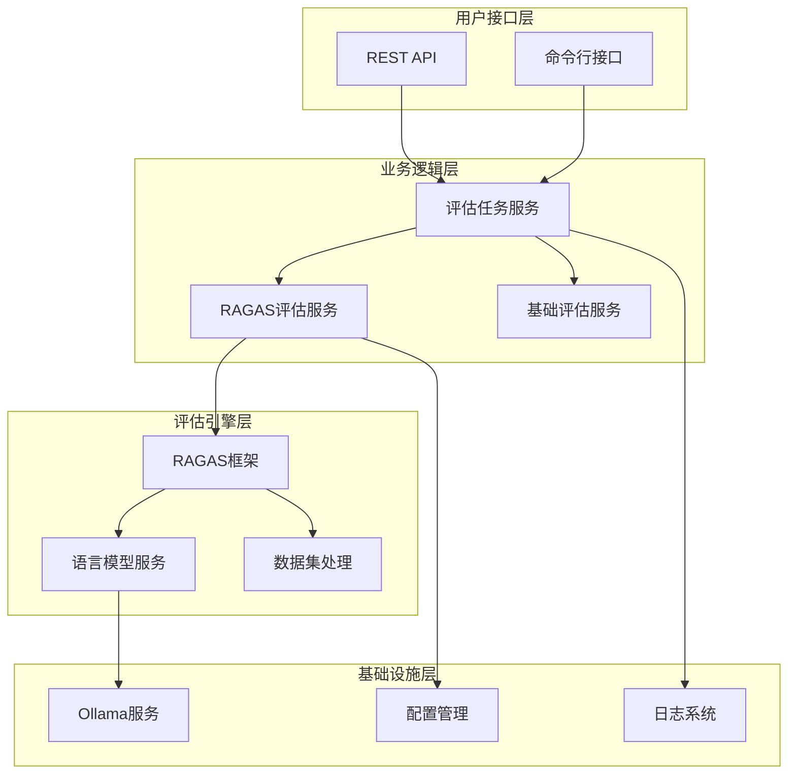
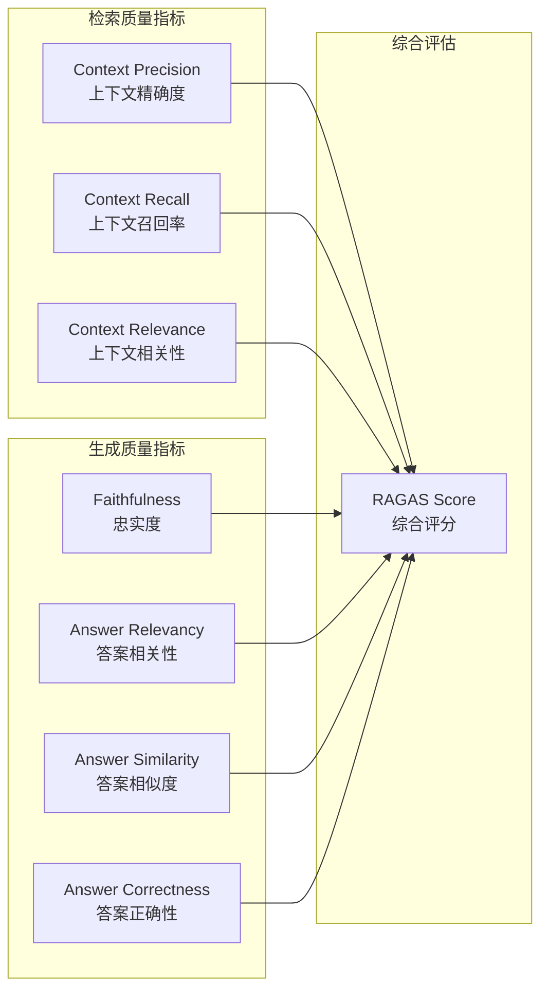
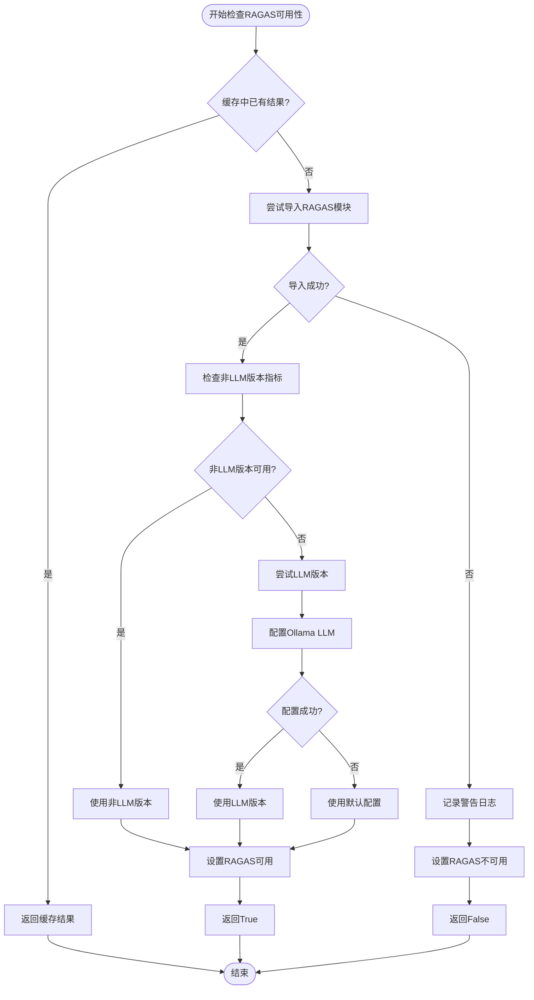
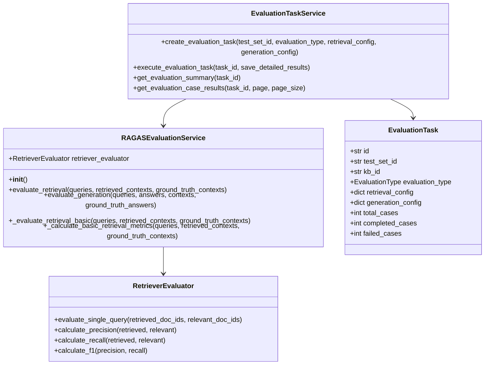
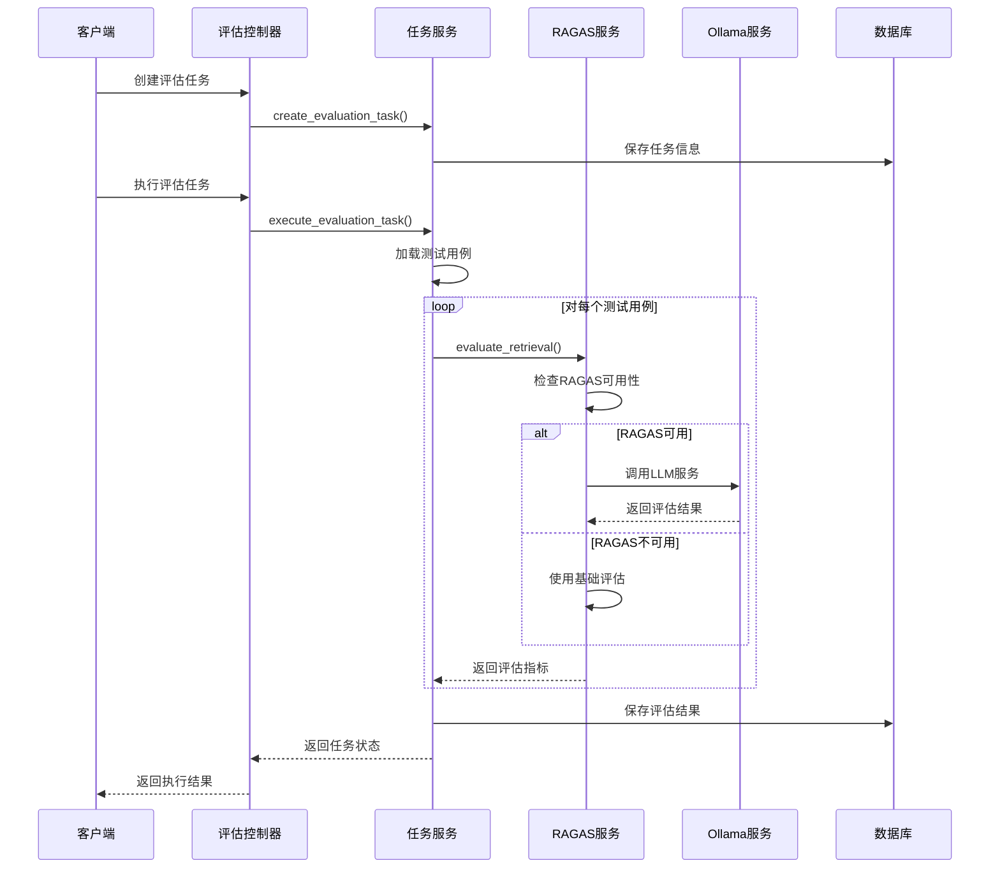
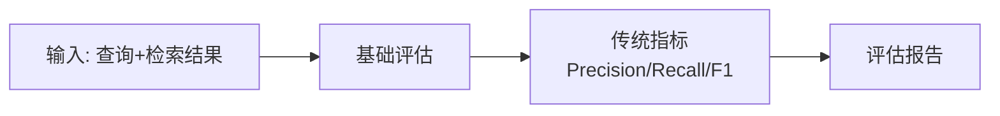
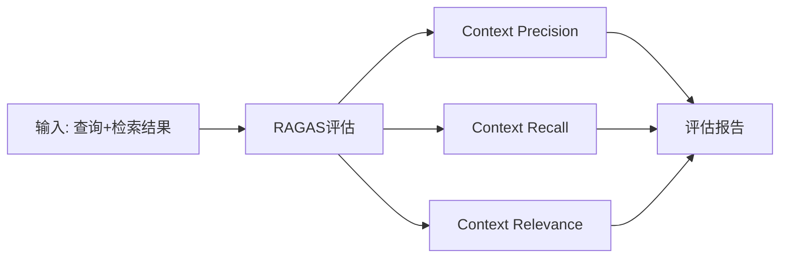
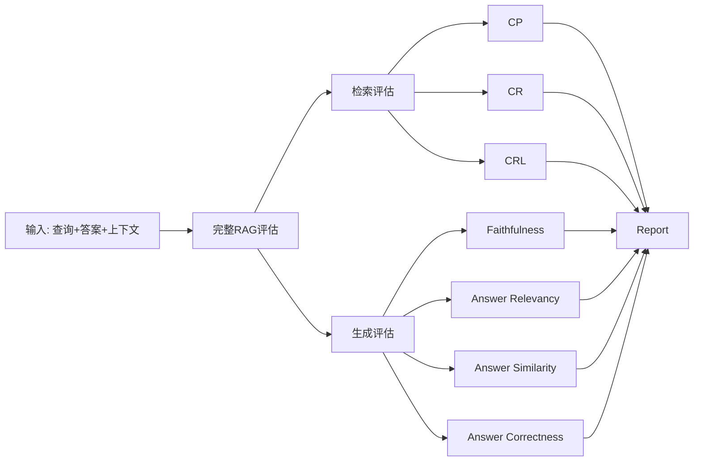
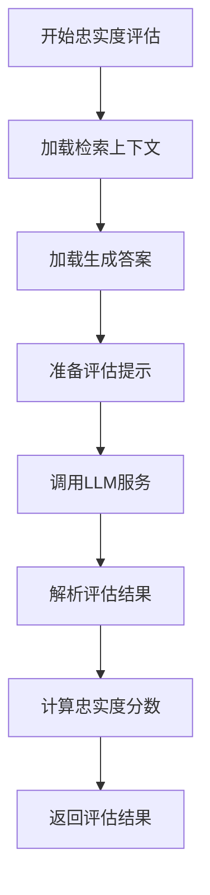
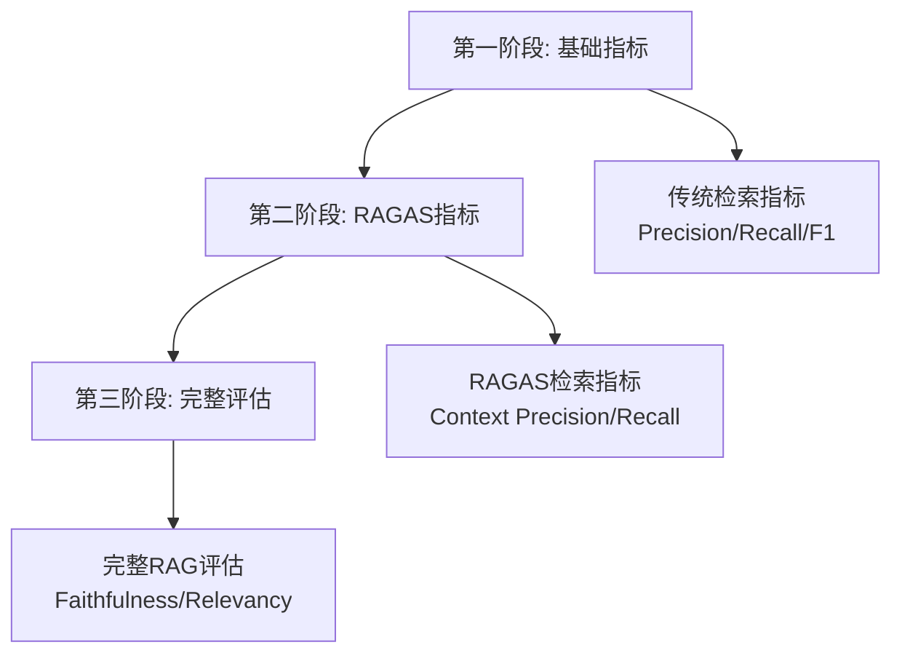

# RAGAS集成设计与实现

<cite>
**本文档引用的文件**
- [ragas_evaluation.py](file://backend/app/services/ragas_evaluation.py)
- [evaluation.py](file://backend/app/models/evaluation.py)
- [evaluation.py](file://backend/app/controllers/evaluation.py)
- [retriever_evaluation.py](file://backend/app/services/retriever_evaluation.py)
- [config.py](file://backend/app/config.py)
- [requirements.txt](file://backend/requirements.txt)
- [README.md](file://backend/README.md)
</cite>

## 目录
1. [项目概述](#项目概述)
2. [RAGAS框架集成目标](#ragas框架集成目标)
3. [核心评估指标体系](#核心评估指标体系)
4. [当前实现状态分析](#当前实现状态分析)
5. [技术架构设计](#技术架构设计)
6. [TODO集成点分析](#todo集成点分析)
7. [端到端RAG质量评估实现路径](#端到端rag质量评估实现路径)
8. [最佳实践与优化建议](#最佳实践与优化建议)
9. [故障排除指南](#故障排除指南)
10. [总结](#总结)

## 项目概述

RAG Studio是一个基于FastAPI构建的RAG（检索增强生成）管理平台，支持知识库管理、链路排查和测试评估等功能。该项目采用云边架构设计，具备存储抽象、AI服务抽象和向量数据库抽象等核心特性。

### 技术栈特点
- **Web框架**: FastAPI + Pydantic
- **AI框架**: LangChain + Ollama
- **数据库**: MySQL + JSON文件存储
- **向量数据库**: Elasticsearch/Qdrant/Milvus
- **评估框架**: RAGAS 0.1.9

**章节来源**
- [README.md](file://backend/README.md#L1-L164)
- [requirements.txt](file://backend/requirements.txt#L1-L43)

## RAGAS框架集成目标

### 设计目标

RAGAS（RAG Assessment）是一个专门针对RAG系统的评估框架，旨在提供全面的RAG质量评估能力。RAG Studio的RAGAS集成设计遵循以下核心目标：

1. **全面性评估**: 覆盖检索质量和生成质量的多个维度
2. **灵活性配置**: 支持多种LLM提供商和评估策略
3. **渐进式集成**: 从基础指标到高级指标的平滑过渡
4. **容错性设计**: 在RAGAS不可用时提供降级方案

### 集成架构层次



**图表来源**
- [ragas_evaluation.py](file://backend/app/services/ragas_evaluation.py#L1-L50)
- [evaluation.py](file://backend/app/controllers/evaluation.py#L1-L50)

## 核心评估指标体系

### 四大高级评估指标

RAGAS框架提供了四个核心评估指标，它们构成了完整的RAG质量评估体系：

#### 1. Context Precision（上下文精确度）
- **语义含义**: 衡量检索到的上下文中有多少是真正相关的
- **计算方法**: 相关上下文数量 / 总检索上下文数量
- **互补关系**: 与传统检索精度指标互补，更关注语义相关性

#### 2. Context Recall（上下文召回率）
- **语义含义**: 衡量检索系统能够找到多少真实相关的上下文
- **计算方法**: 检测到的相关上下文数量 / 真实相关上下文总数
- **互补关系**: 关注覆盖率，发现传统指标难以捕捉的漏检问题

#### 3. Faithfulness（忠实度）
- **语义含义**: 衡量生成答案对检索上下文的忠实程度
- **计算方法**: 基于LLM的语义比较，评估答案事实准确性
- **互补关系**: 检测生成过程中的事实错误和幻觉现象

#### 4. Answer Relevancy（答案相关性）
- **语义含义**: 衡量生成答案与原始查询的相关程度
- **计算方法**: 基于LLM的语义匹配评估
- **互补关系**: 关注语义相关性，发现无关或偏题的答案

### 指标关系图



**图表来源**
- [ragas_evaluation.py](file://backend/app/services/ragas_evaluation.py#L270-L370)

**章节来源**
- [ragas_evaluation.py](file://backend/app/services/ragas_evaluation.py#L260-L290)

## 当前实现状态分析

### RAGAS可用性检查机制

系统实现了完善的RAGAS可用性检查机制，确保在不同环境下都能正常工作：



**图表来源**
- [ragas_evaluation.py](file://backend/app/services/ragas_evaluation.py#L18-L186)

### 检索评估实现状态

当前检索评估功能已经实现了以下能力：

| 功能模块 | 实现状态 | 描述 |
|---------|---------|------|
| Context Precision | ✅ 完全实现 | 支持非LLM和LLM两种版本 |
| Context Recall | ✅ 完全实现 | 支持非LLM和LLM两种版本 |
| Context Relevance | ⚠️ 部分实现 | 仅在提供LLM配置时可用 |
| 基础指标对比 | ✅ 完全实现 | 与传统检索指标的对比分析 |

### 生成评估实现状态

生成评估功能的实现情况如下：

| 功能模块 | 实现状态 | 描述 |
|---------|---------|------|
| Faithfulness | ✅ 完全实现 | 支持LLM版本评估 |
| Answer Relevancy | ✅ 完全实现 | 支持LLM版本评估 |
| Answer Similarity | ⚠️ 条件实现 | 仅在提供真实答案时可用 |
| Answer Correctness | ⚠️ 条件实现 | 仅在提供真实答案时可用 |

**章节来源**
- [ragas_evaluation.py](file://backend/app/services/ragas_evaluation.py#L18-L186)
- [ragas_evaluation.py](file://backend/app/services/ragas_evaluation.py#L202-L380)

## 技术架构设计

### 服务层架构



**图表来源**
- [ragas_evaluation.py](file://backend/app/services/ragas_evaluation.py#L191-L200)
- [evaluation.py](file://backend/app/models/evaluation.py#L27-L68)

### 数据流架构



**图表来源**
- [evaluation.py](file://backend/app/controllers/evaluation.py#L83-L125)
- [ragas_evaluation.py](file://backend/app/services/ragas_evaluation.py#L202-L380)

**章节来源**
- [ragas_evaluation.py](file://backend/app/services/ragas_evaluation.py#L191-L200)
- [evaluation.py](file://backend/app/controllers/evaluation.py#L83-L125)

## TODO集成点分析

### 检索评估TODO点

当前检索评估服务中存在两个主要的TODO集成点：

#### 1. Context Precision集成
```python
# TODO: 集成RAGAS的context_precision和context_recall
# from ragas.metrics import context_precision, context_recall
```

**集成建议**:
- 使用`NonLLMContextPrecisionWithReference`替代传统指标
- 配置`reference_contexts`参数
- 实现与现有评估指标的对比分析

#### 2. Context Relevance集成
```python
# TODO: 集成RAGAS的context_relevancy
# from ragas.metrics import context_relevancy
```

**集成建议**:
- 使用`ContextRelevance`类（需要LLM支持）
- 配置Ollama或其他LLM服务
- 实现动态实例化机制

### 生成评估TODO点

#### 1. Faithfulness集成
```python
# TODO: 集成RAGAS的faithfulness和answer_relevancy
# from ragas.metrics import faithfulness, answer_relevancy
```

**集成建议**:
- 使用`faithfulness`指标评估答案忠实度
- 配置LLM服务进行语义比较
- 实现与答案相似度指标的协同使用

#### 2. Answer Relevancy集成
```python
# TODO: 集成RAGAS的faithfulness和answer_relevancy
# from ragas.metrics import faithfulness, answer_relevancy
```

**集成建议**:
- 使用`answer_relevancy`指标评估相关性
- 配置适当的LLM模型进行语义匹配
- 实现多模型对比评估

### 集成优先级建议

| 集成点 | 优先级 | 依赖条件 | 预期收益 |
|-------|--------|----------|----------|
| Context Precision | 高 | RAGAS安装 | 提升检索质量评估准确性 |
| Context Recall | 高 | RAGAS安装 | 完善检索评估体系 |
| Faithfulness | 中 | LLM服务配置 | 增强生成质量评估能力 |
| Answer Relevancy | 中 | LLM服务配置 | 提高答案相关性评估 |
| Context Relevance | 低 | LLM服务配置 | 完善检索相关性评估 |

**章节来源**
- [retriever_evaluation.py](file://backend/app/services/retriever_evaluation.py#L293)
- [retriever_evaluation.py](file://backend/app/services/retriever_evaluation.py#L322)

## 端到端RAG质量评估实现路径

### 从基础检索评估到完整RAG评估的演进

#### 第一阶段：基础检索评估


**实现要点**:
- 使用现有的`RetrieverEvaluator`服务
- 保持与现有系统的兼容性
- 作为RAGAS集成的基础

#### 第二阶段：RAGAS检索评估


**实现要点**:
- 集成非LLM版本指标
- 支持快速评估场景
- 降低对LLM服务的依赖

#### 第三阶段：完整RAG评估


**实现要点**:
- 集成所有RAGAS指标
- 支持多维度评估
- 提供综合评分体系

### 上下文相关性判断实现建议

#### 实现策略
1. **非LLM版本**: 使用`NonLLMContextPrecisionWithReference`和`NonLLMContextRecall`
2. **LLM版本**: 使用`ContextPrecision`和`ContextRecall`
3. **混合策略**: 根据可用性和性能需求选择合适版本

#### 配置建议
```python
# 配置上下文相关性评估
context_precision = NonLLMContextPrecisionWithReference()  # 快速评估
context_recall = NonLLMContextRecall()  # 快速评估

# 或者使用LLM版本（需要配置）
context_precision = ContextPrecision(llm=wrapped_llm)
context_recall = ContextRecall(llm=wrapped_llm)
```

### 答案忠实度检测实现建议

#### 实现策略
1. **基于LLM的语义比较**: 使用`faithfulness`指标
2. **事实验证**: 检查答案中的事实陈述
3. **上下文一致性**: 验证答案与检索上下文的一致性

#### 评估流程


### 生成相关性评分实现建议

#### 实现策略
1. **语义匹配**: 使用`answer_relevancy`指标
2. **查询对比**: 比较答案与原始查询的相关性
3. **多维度评估**: 结合语义相似度和事实准确性

#### 配置优化
```python
# 配置答案相关性评估
answer_relevancy = AnswerRelevancy()

# 或使用LLM版本（需要配置）
answer_relevancy = ContextRelevance(llm=wrapped_llm)
```

**章节来源**
- [ragas_evaluation.py](file://backend/app/services/ragas_evaluation.py#L202-L380)
- [ragas_evaluation.py](file://backend/app/services/ragas_evaluation.py#L407-L520)

## 最佳实践与优化建议

### RAGAS集成最佳实践

#### 1. 渐进式集成策略


#### 2. 性能优化建议

| 优化方面 | 建议措施 | 预期效果 |
|---------|---------|----------|
| LLM调用频率 | 批量处理评估请求 | 减少API调用次数 |
| 缓存机制 | 缓存LLM评估结果 | 提高重复评估效率 |
| 异步处理 | 使用异步任务队列 | 提升系统响应性 |
| 资源管理 | 合理配置Ollama连接 | 避免资源耗尽 |

#### 3. 错误处理策略

```python
# 示例：完善的错误处理机制
try:
    result = await ragas_service.evaluate_retrieval(queries, contexts)
except ImportError as e:
    logger.warning(f"RAGAS模块不可用: {e}")
    result = await fallback_evaluation(queries, contexts)
except Exception as e:
    logger.error(f"RAGAS评估失败: {e}")
    result = default_evaluation_results
```

### 配置管理优化

#### 1. 环境变量配置
```python
# 推荐的配置项
OLLAMA_BASE_URL = "http://localhost:11434"
OLLAMA_CHAT_MODEL = "deepseek-r1:1.5b"
OLLAMA_EMBEDDING_MODEL = "nomic-embed-text"
```

#### 2. 动态配置支持
```python
# 支持运行时配置LLM参数
async def evaluate_with_custom_llm(
    queries: List[str],
    answers: List[str],
    contexts: List[List[str]],
    llm_model: str = None,
    llm_base_url: str = None
):
    return await ragas_service.evaluate_generation(
        queries, answers, contexts,
        llm_model=llm_model,
        llm_base_url=llm_base_url
    )
```

### 数据处理优化

#### 1. 数据预处理
```python
# 确保数据格式正确
def prepare_ragas_dataset(queries, contexts, answers=None):
    # 清理和标准化数据
    # 验证数据完整性
    # 转换为RAGAS所需的格式
    pass
```

#### 2. 批量处理优化
```python
# 使用异步批量处理
async def batch_evaluate_ragas(tasks):
    results = await asyncio.gather(*[
        ragas_service.evaluate_retrieval(task['queries'], task['contexts'])
        for task in tasks
    ])
    return results
```

**章节来源**
- [config.py](file://backend/app/config.py#L45-L49)
- [ragas_evaluation.py](file://backend/app/services/ragas_evaluation.py#L202-L380)

## 故障排除指南

### 常见问题及解决方案

#### 1. RAGAS安装问题

**问题**: `ImportError: No module named 'ragas'`
**原因**: RAGAS库未安装或版本不兼容
**解决方案**:
```bash
# 安装指定版本的RAGAS
pip install ragas==0.1.9

# 或升级到最新版本
pip install --upgrade ragas
```

#### 2. Python版本兼容性问题

**问题**: `TypeError: recursive_guard`
**原因**: Python 3.12与pydantic v1的兼容性问题
**解决方案**:
```bash
# 方法1: 升级pydantic到v2
pip install 'pydantic>=2.0'

# 方法2: 降级Python版本到3.11
pyenv install 3.11.0
pyenv local 3.11.0
```

#### 3. LLM服务配置问题

**问题**: `Ollama LLM配置失败`
**原因**: Ollama服务未启动或模型不存在
**解决方案**:
```bash
# 检查Ollama服务状态
curl http://localhost:11434/api/tags

# 下载必要的模型
ollama pull deepseek-r1:1.5b
ollama pull nomic-embed-text
```

#### 4. RapidFuzz库缺失

**问题**: `ModuleNotFoundError: No module named 'rapidfuzz'`
**原因**: 非LLM版本指标需要rapidfuzz库
**解决方案**:
```bash
pip install rapidfuzz>=3.0.0
```

### 日志分析指南

#### 1. RAGAS可用性检查日志
```
INFO: RAGAS模块加载成功
WARNING: 非 LLM 版本指标不可用: ...
ERROR: 配置 Ollama LLM 失败: ...
```

#### 2. 评估过程日志
```
INFO: RAGAS检索评估完成: precision=0.8800, recall=0.8200, relevancy=0.7500, score=0.8175
INFO: RAGAS生成评估完成: metrics={'faithfulness': 0.92, 'answer_relevancy': 0.88}
```

#### 3. 错误日志分析
```
ERROR: RAGAS生成评估失败: [具体错误信息]
WARNING: 提取指标 [指标名] 失败: [具体错误]
```

### 性能监控建议

#### 1. 关键指标监控
- **评估响应时间**: 监控单次评估耗时
- **LLM调用频率**: 跟踪API调用次数
- **内存使用情况**: 监控评估过程中的内存占用
- **错误率统计**: 统计各类错误的发生频率

#### 2. 性能优化指标
```python
# 性能监控示例
import time
import psutil

async def monitored_evaluation():
    start_time = time.time()
    memory_start = psutil.Process().memory_info().rss
    
    try:
        result = await ragas_service.evaluate_retrieval(...)
        return result
    finally:
        duration = time.time() - start_time
        memory_end = psutil.Process().memory_info().rss
        memory_used = (memory_end - memory_start) / 1024 / 1024  # MB
        
        logger.info(f"Evaluation took {duration:.2f}s, memory used: {memory_used:.2f}MB")
```

**章节来源**
- [ragas_evaluation.py](file://backend/app/services/ragas_evaluation.py#L160-L186)
- [config.py](file://backend/app/config.py#L45-L49)

## 总结

### RAGAS集成现状总结

RAG Studio的RAGAS集成已经建立了坚实的基础，实现了以下关键能力：

1. **完整的评估框架**: 支持检索质量和生成质量的全面评估
2. **灵活的配置机制**: 支持多种LLM提供商和评估策略
3. **容错性设计**: 在RAGAS不可用时提供降级方案
4. **渐进式集成**: 从基础指标到高级指标的平滑演进

### 技术优势

- **模块化设计**: 清晰的服务分离和职责划分
- **异步处理**: 支持高并发评估任务
- **配置抽象**: 支持多种存储和AI服务提供商
- **监控完善**: 详细的日志记录和错误处理

### 发展方向

1. **指标完善**: 完成剩余TODO集成点，实现完整的RAGAS评估体系
2. **性能优化**: 优化LLM调用频率和数据处理效率
3. **用户体验**: 提供更直观的评估结果展示和分析工具
4. **扩展性增强**: 支持更多评估指标和自定义评估规则

### 实施建议

对于希望引入RAGAS评估功能的开发者，建议按照以下步骤进行：

1. **环境准备**: 确保安装正确的RAGAS版本和依赖库
2. **配置优化**: 正确配置Ollama服务和相关参数
3. **渐进集成**: 从基础指标开始，逐步引入高级评估功能
4. **监控完善**: 建立完善的性能监控和错误处理机制

通过持续的优化和完善，RAG Studio的RAGAS集成将成为一个强大而可靠的RAG质量评估平台，为用户提供全面、准确、高效的评估能力。