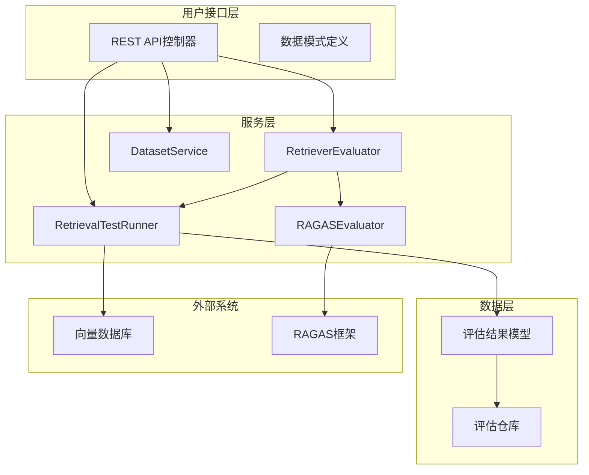
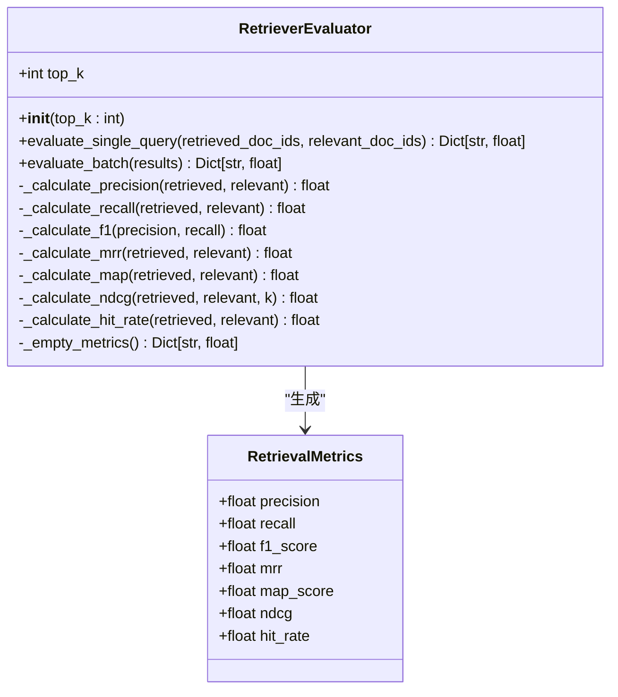
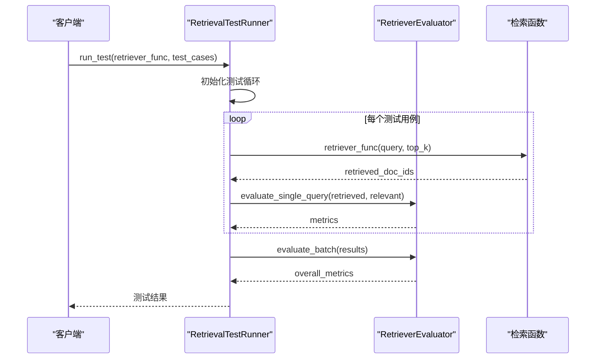
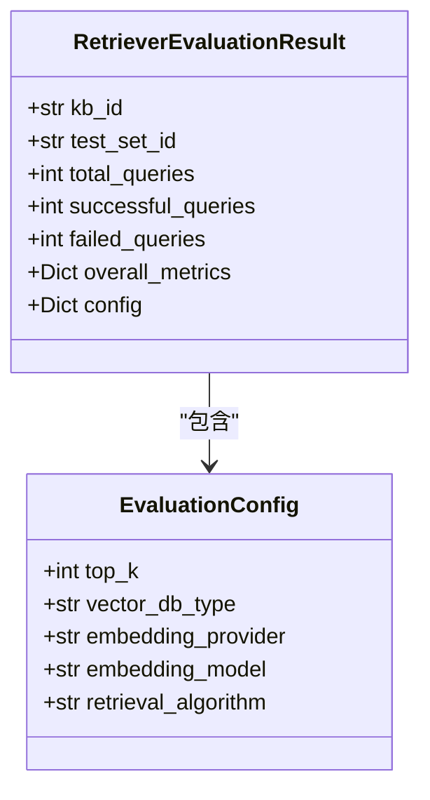
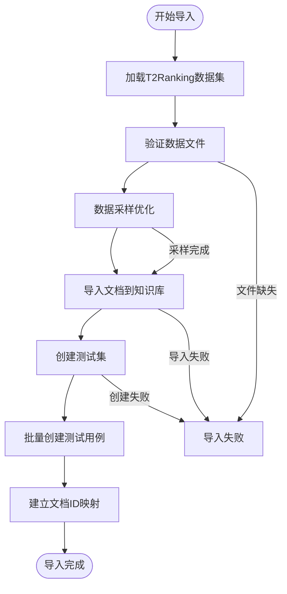
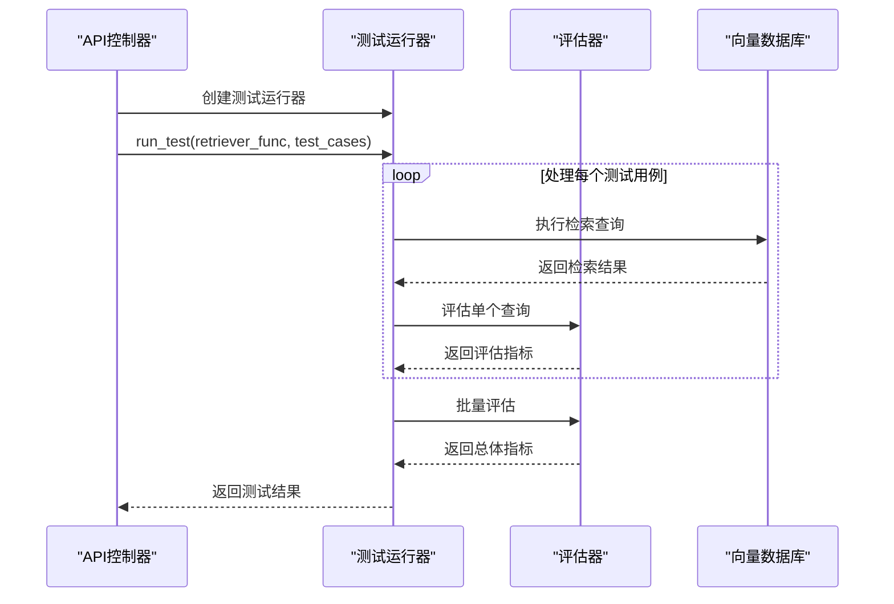
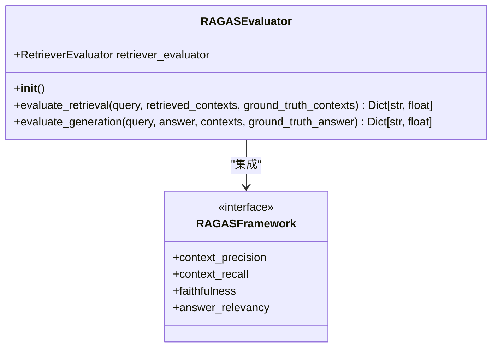

# 检索器评估服务技术文档

<cite>
**本文档引用的文件**
- [retriever_evaluation.py](file://backend/app/services/retriever_evaluation.py)
- [retriever_evaluation.py](file://backend/app/controllers/retriever_evaluation.py)
- [retriever_evaluation.py](file://backend/app/models/retriever_evaluation.py)
- [test.py](file://backend/app/schemas/test.py)
- [dataset_loader.py](file://backend/app/services/dataset_loader.py)
- [example_t2ranking_usage.py](file://backend/example_t2ranking_usage.py)
- [test_retriever_eval.py](file://backend/test_retriever_eval.py)
- [ragas_evaluation.py](file://backend/app/services/ragas_evaluation.py)
- [evaluation_task.py](file://backend/app/services/evaluation_task.py)
</cite>

## 目录
1. [简介](#简介)
2. [系统架构](#系统架构)
3. [核心组件分析](#核心组件分析)
4. [评估指标算法详解](#评估指标算法详解)
5. [数据模型定义](#数据模型定义)
6. [测试执行流程](#测试执行流程)
7. [RAGAS框架集成](#ragas框架集成)
8. [扩展指南](#扩展指南)
9. [最佳实践](#最佳实践)
10. [故障排除](#故障排除)

## 简介

RAG-Studio检索器评估服务是一个基于T2Ranking标准数据集的综合性检索质量评估系统。该系统提供了完整的检索器性能评估能力，支持多种评估指标计算，并具备良好的扩展性，能够满足不同场景下的检索器评估需求。

### 主要特性

- **标准化评估**：基于T2Ranking数据集的标准评估流程
- **多样化指标**：支持Precision@K、Recall@K、F1-Score、MRR、MAP、NDCG等多种评估指标
- **灵活配置**：支持自定义top-k参数和评估配置
- **批量处理**：高效处理大量测试用例的批量评估
- **RAGAS集成**：预留RAGAS框架集成接口，支持更高级的评估指标

## 系统架构



**图表来源**
- [retriever_evaluation.py](file://backend/app/controllers/retriever_evaluation.py#L1-L375)
- [retriever_evaluation.py](file://backend/app/services/retriever_evaluation.py#L1-L423)

## 核心组件分析

### RetrieverEvaluator类

RetrieverEvaluator是系统的核心评估组件，负责计算各种检索质量指标。



**图表来源**
- [retriever_evaluation.py](file://backend/app/services/retriever_evaluation.py#L26-L423)

### RetrievalTestRunner类

RetrievalTestRunner负责协调测试执行流程，管理评估过程。



**图表来源**
- [retriever_evaluation.py](file://backend/app/services/retriever_evaluation.py#L334-L423)

**章节来源**
- [retriever_evaluation.py](file://backend/app/services/retriever_evaluation.py#L26-L423)

## 评估指标算法详解

### Precision@K 精确率计算

Precision@K衡量检索结果中相关文档的比例，计算公式为：

```
Precision@K = |检索到的相关文档| / |检索到的文档总数|
```

**算法特点**：
- 使用集合运算判断文档相关性
- 仅考虑top-K范围内的结果
- 返回值范围：0.0 ≤ Precision ≤ 1.0

**实现细节**：
- `_calculate_precision`方法通过集合交集计算相关文档数量
- 支持空检索结果的边界情况处理
- 时间复杂度：O(K)，其中K为top_k参数

### Recall@K 召回率计算

Recall@K衡量检索系统找到相关文档的能力，计算公式为：

```
Recall@K = |检索到的相关文档| / |所有相关文档总数|
```

**算法特点**：
- 分母为真实相关文档总数
- 考虑所有相关文档，不限制top-K
- 返回值范围：0.0 ≤ Recall ≤ 1.0

**实现细节**：
- 使用集合运算快速判断文档相关性
- 支持无相关文档的特殊情况
- 时间复杂度：O(K)，其中K为检索结果长度

### MRR 平均倒数排名

MRR（Mean Reciprocal Rank）关注第一个相关文档的排名位置。

```
MRR = 1 / rank_of_first_relevant_doc
```

**算法特点**：
- 只关注第一个相关文档的位置
- 对早期相关性敏感
- 返回值范围：0.0 ≤ MRR ≤ 1.0

**实现细节**：
- 遍历检索结果直到找到第一个相关文档
- 如果没有相关文档，返回0.0
- 时间复杂度：O(K)，最坏情况下需要遍历全部结果

### MAP 平均精度

MAP（Mean Average Precision）综合考虑所有相关文档的精度。

```
MAP = (sum of P@k for each relevant doc) / |relevant docs|
```

**算法特点**：
- 考虑所有相关文档的精度贡献
- 对排序质量敏感
- 返回值范围：0.0 ≤ MAP ≤ 1.0

**实现细节**：
- 累积每个相关文档的P@k值
- 按检索顺序计算精度
- 支持无相关文档的情况
- 时间复杂度：O(K)，其中K为检索结果长度

### NDCG 归一化折损累积增益

NDCG（Normalized Discounted Cumulative Gain）综合考虑相关性和排序位置。

```
NDCG = DCG / IDCG
```

**算法特点**：
- 考虑文档的相关性等级
- 使用对数函数折损高位置的收益
- 对排序质量非常敏感
- 返回值范围：0.0 ≤ NDCG ≤ 1.0

**实现细节**：
- 计算DCG（折扣累积增益）
- 计算IDCG（理想DCG）
- 使用log2对位置进行折损
- 支持截断参数k
- 时间复杂度：O(K)，其中K为检索结果长度

**章节来源**
- [retriever_evaluation.py](file://backend/app/services/retriever_evaluation.py#L109-L248)

## 数据模型定义

### RetrievalMetrics数据类

RetrievalMetrics数据类定义了检索评估的所有指标字段：

| 指标名称 | 数据类型 | 取值范围 | 业务含义 |
|---------|---------|---------|---------|
| precision | float | [0.0, 1.0] | 精确率，衡量检索结果的相关性 |
| recall | float | [0.0, 1.0] | 召回率，衡量检索系统的完整性 |
| f1_score | float | [0.0, 1.0] | F1分数，精确率和召回率的调和平均 |
| mrr | float | [0.0, 1.0] | 平均倒数排名，关注第一个相关结果 |
| map_score | float | [0.0, 1.0] | 平均精度均值，综合考虑所有相关结果 |
| ndcg | float | [0.0, 1.0] | 归一化折损累积增益，考虑排序质量 |
| hit_rate | float | [0.0, 1.0] | 命中率，是否至少检索到一个相关文档 |

### RetrieverEvaluationResult模型

RetrieverEvaluationResult模型封装了完整的评估结果：



**图表来源**
- [retriever_evaluation.py](file://backend/app/models/retriever_evaluation.py#L11-L60)

**章节来源**
- [retriever_evaluation.py](file://backend/app/models/retriever_evaluation.py#L11-L60)

## 测试执行流程

### 数据集导入流程

系统支持T2Ranking数据集的完整导入流程：



**图表来源**
- [retriever_evaluation.py](file://backend/app/controllers/retriever_evaluation.py#L26-L152)

### 评估执行流程



**图表来源**
- [retriever_evaluation.py](file://backend/app/services/retriever_evaluation.py#L352-L423)

**章节来源**
- [retriever_evaluation.py](file://backend/app/controllers/retriever_evaluation.py#L26-L152)
- [retriever_evaluation.py](file://backend/app/services/retriever_evaluation.py#L334-L423)

## RAGAS框架集成

### 当前集成状态

RAGAS框架集成目前处于待实现状态，系统预留了完整的集成接口：



**图表来源**
- [retriever_evaluation.py](file://backend/app/services/retriever_evaluation.py#L262-L331)

### 待实现功能

1. **上下文精确度评估**：评估检索上下文的精确度
2. **上下文召回率评估**：评估检索上下文的召回率
3. **忠实度评估**：评估答案对上下文的忠实度
4. **答案相关性评估**：评估答案与问题的相关性

### 集成优势

- **标准化评估**：使用RAGAS框架的标准化指标
- **深度分析**：提供更细粒度的评估维度
- **可扩展性**：支持自定义评估指标
- **社区支持**：受益于RAGAS社区的持续改进

**章节来源**
- [retriever_evaluation.py](file://backend/app/services/retriever_evaluation.py#L262-L331)

## 扩展指南

### 添加自定义评估指标

开发者可以通过以下步骤添加新的评估指标：

#### 1. 修改RetrieverEvaluator类

```python
# 在RetrieverEvaluator类中添加新方法
def _calculate_custom_metric(
    self,
    retrieved: List[str],
    relevant: List[str]
) -> float:
    """
    计算自定义评估指标
    """
    # 实现自定义算法
    pass
```

#### 2. 更新评估方法

```python
def evaluate_single_query(self, ...) -> Dict[str, float]:
    # 调用新指标计算方法
    custom_metric = self._calculate_custom_metric(retrieved_doc_ids, relevant_doc_ids)
    
    return {
        # ... 其他指标
        'custom_metric': custom_metric
    }
```

#### 3. 更新数据模型

```python
@dataclass
class RetrievalMetrics:
    # ... 现有指标
    custom_metric: float  # 新增指标
```

### 扩展测试用例类型

#### 1. 定义新的测试用例结构

```python
class CustomTestCase(BaseModel):
    query_id: str
    query: str
    expected_chunks: List[str]
    custom_metadata: Dict[str, Any]
```

#### 2. 实现自定义评估逻辑

```python
async def evaluate_custom_test_cases(
    self,
    test_cases: List[CustomTestCase]
) -> Dict[str, float]:
    # 实现自定义评估逻辑
    pass
```

### 配置批量测试参数

#### 1. 批量测试配置

```python
class BatchTestConfig:
    def __init__(
        self,
        top_k: int = 10,
        max_concurrent: int = 5,
        timeout: float = 30.0,
        retry_count: int = 3
    ):
        self.top_k = top_k
        self.max_concurrent = max_concurrent
        self.timeout = timeout
        self.retry_count = retry_count
```

#### 2. 扩展测试运行器

```python
class ExtendedRetrievalTestRunner(RetrievalTestRunner):
    def __init__(self, evaluator: RetrieverEvaluator, config: BatchTestConfig):
        super().__init__(evaluator, config.top_k)
        self.config = config
    
    async def run_batch_test(
        self,
        retriever_func,
        test_cases: List[Dict[str, Any]]
    ) -> Dict[str, Any]:
        # 实现并发批量测试
        pass
```

**章节来源**
- [retriever_evaluation.py](file://backend/app/services/retriever_evaluation.py#L26-L423)

## 最佳实践

### 评估指标选择指南

#### 1. 根据应用场景选择指标

| 场景 | 推荐指标 | 理由 |
|------|---------|------|
| 单答案检索 | MRR, Precision@K | 关注第一个相关结果 |
| 多答案检索 | MAP, NDCG | 考虑所有相关结果 |
| 检索系统对比 | F1-Score, NDCG | 平衡精确率和排序质量 |
| 排序算法评估 | NDCG, MRR | 重点评估排序效果 |

#### 2. 性能优化建议

- **数据采样**：对于大规模数据集，使用max_queries和max_docs参数进行采样
- **并发控制**：合理设置并发查询数量，避免系统过载
- **缓存机制**：对重复的检索结果进行缓存
- **内存管理**：及时释放大型数据集的内存占用

#### 3. 结果解释技巧

- **综合评估**：不要只看单一指标，要结合多个指标进行判断
- **业务相关性**：选择与业务场景最相关的评估指标
- **基准对比**：与基线系统进行对比分析
- **趋势跟踪**：定期评估，追踪性能变化趋势

### 开发环境配置

#### 1. 必需依赖

```bash
pip install numpy pandas datasets
```

#### 2. 可选依赖（RAGAS集成）

```bash
pip install ragas>=0.1.9
```

#### 3. 性能监控

```python
import logging
logging.basicConfig(level=logging.INFO)

# 启用详细日志
logger = logging.getLogger(__name__)
logger.setLevel(logging.DEBUG)
```

**章节来源**
- [example_t2ranking_usage.py](file://backend/example_t2ranking_usage.py#L1-L171)

## 故障排除

### 常见问题及解决方案

#### 1. 数据集加载失败

**问题症状**：FileNotFoundError或数据加载异常

**解决方案**：
- 检查文件路径是否正确
- 验证文件格式是否符合TSV规范
- 确认文件权限设置
- 使用max_queries/max_docs参数减少数据规模

#### 2. 评估指标异常

**问题症状**：指标值超出正常范围（如>1.0或<0.0）

**解决方案**：
- 检查输入数据的格式和内容
- 验证相关文档ID的匹配准确性
- 确认top_k参数设置合理
- 检查边界条件处理

#### 3. 性能问题

**问题症状**：评估过程耗时过长

**解决方案**：
- 减少测试用例数量
- 优化检索函数性能
- 增加并发处理能力
- 使用数据采样技术

#### 4. RAGAS集成问题

**问题症状**：RAGAS相关功能不可用

**解决方案**：
- 检查RAGAS版本兼容性
- 安装必要的依赖库（如rapidfuzz）
- 配置正确的Python版本（推荐Python 3.11）
- 检查pydantic版本兼容性

### 调试技巧

#### 1. 启用详细日志

```python
import logging
logging.basicConfig(level=logging.DEBUG)
```

#### 2. 单步测试

```python
# 测试单个指标计算
evaluator = RetrieverEvaluator(top_k=10)
metrics = evaluator.evaluate_single_query(retrieved_docs, relevant_docs)
print(f"Precision: {metrics['precision']}")
```

#### 3. 数据验证

```python
# 验证输入数据格式
assert isinstance(retrieved_doc_ids, list)
assert isinstance(relevant_doc_ids, list)
assert all(isinstance(doc_id, str) for doc_id in retrieved_doc_ids)
```

**章节来源**
- [test_retriever_eval.py](file://backend/test_retriever_eval.py#L1-L150)

## 总结

RAG-Studio检索器评估服务提供了一个完整、灵活且可扩展的检索质量评估解决方案。通过标准化的T2Ranking数据集支持、多样化的评估指标计算、以及良好的扩展性设计，该系统能够满足不同场景下的检索器评估需求。

### 核心优势

1. **标准化评估**：基于权威数据集的标准化评估流程
2. **多样化指标**：涵盖精确率、召回率、排序质量等多个维度
3. **高性能设计**：支持批量处理和并发优化
4. **良好扩展性**：预留接口支持自定义指标和评估方法
5. **RAGAS集成**：为未来深度集成RAGAS框架做好准备

### 发展方向

- **指标丰富化**：添加更多专业评估指标
- **自动化增强**：实现自动化的A/B测试和配置优化
- **可视化支持**：提供直观的评估结果展示
- **云端部署**：支持大规模分布式评估任务

通过持续的优化和功能扩展，RAG-Studio检索器评估服务将成为RAG应用开发和优化的重要工具。