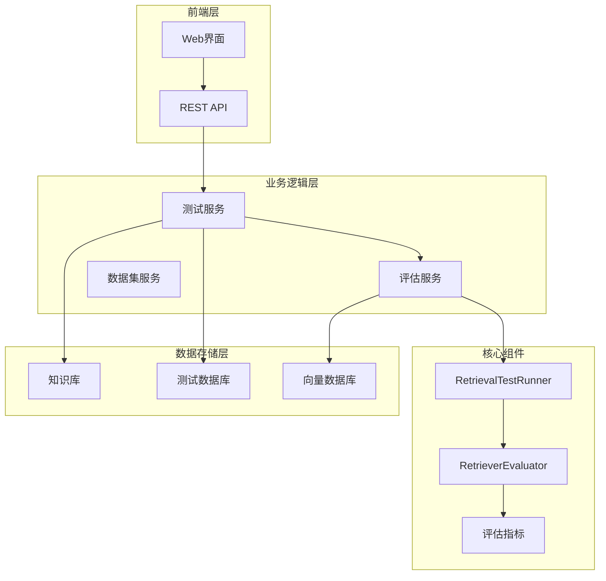
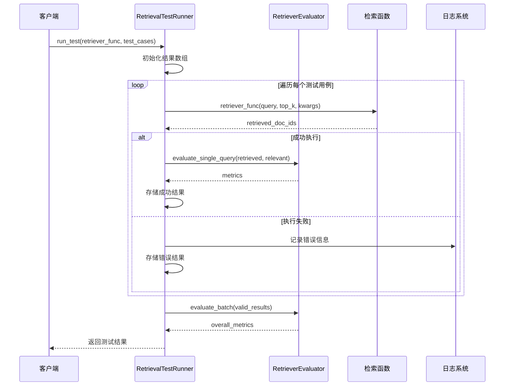
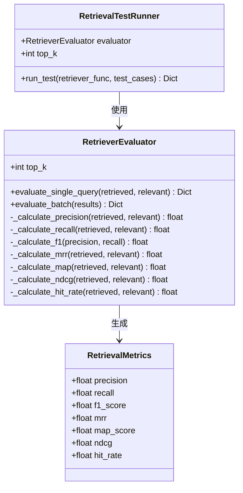
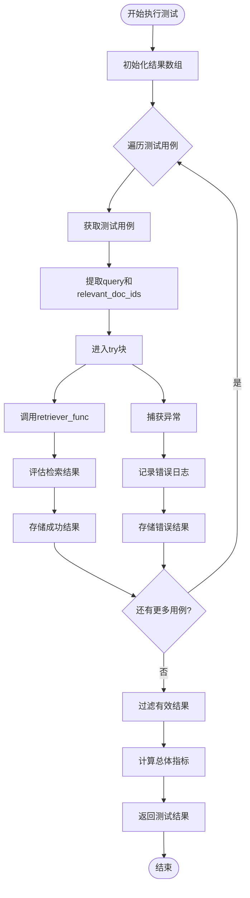
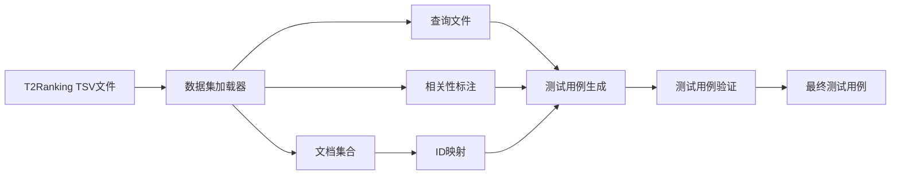
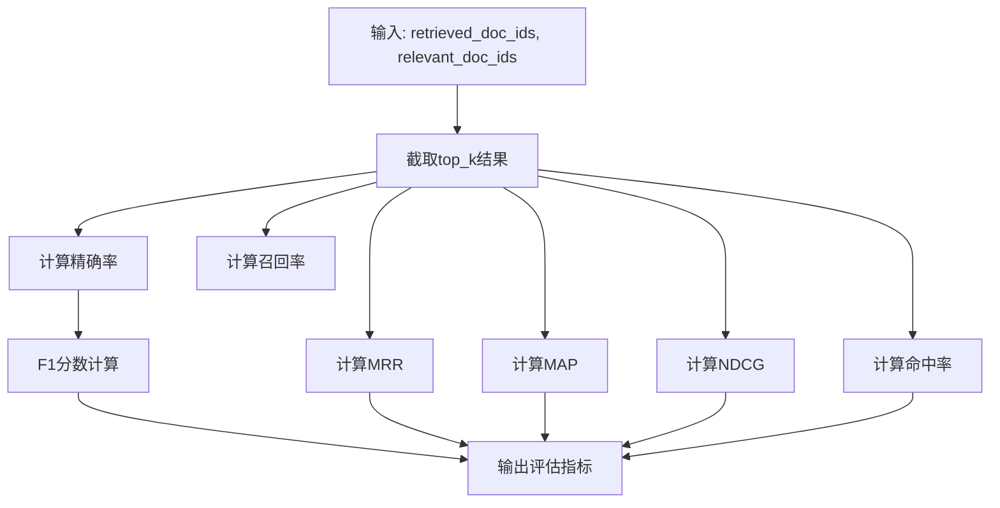
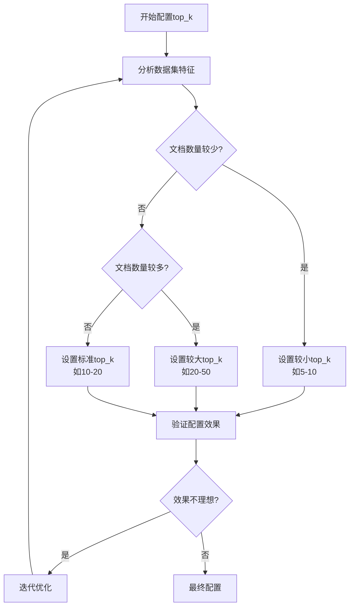
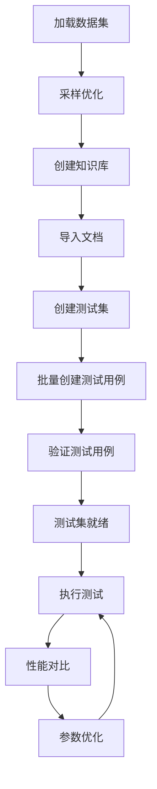
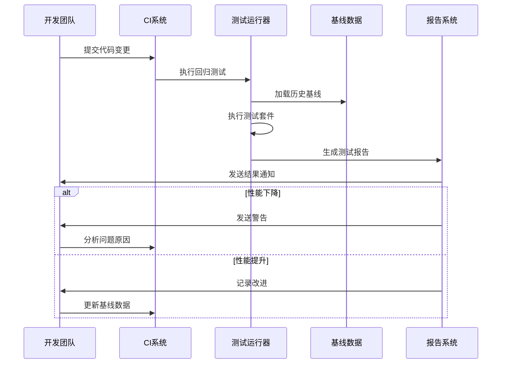

# 测试执行

<cite>
**本文档中引用的文件**
- [retriever_evaluation.py](file://backend/app/services/retriever_evaluation.py)
- [example_t2ranking_usage.py](file://backend/example_t2ranking_usage.py)
- [test_service.py](file://backend/app/services/test_service.py)
- [retriever_evaluation.py](file://backend/app/controllers/retriever_evaluation.py)
- [test_retriever_eval.py](file://backend/test_retriever_eval.py)
</cite>

## 目录
1. [简介](#简介)
2. [项目结构概览](#项目结构概览)
3. [核心组件分析](#核心组件分析)
4. [架构设计](#架构设计)
5. [详细组件分析](#详细组件分析)
6. [测试用例结构](#测试用例结构)
7. [批量测试与统计聚合](#批量测试与统计聚合)
8. [参数优化与配置](#参数优化与配置)
9. [最佳实践指导](#最佳实践指导)
10. [故障排除指南](#故障排除指南)
11. [总结](#总结)

## 简介

RetrievalTestRunner类是RAG Studio检索器评估系统的核心组件，专门负责执行检索器性能测试。该类通过抽象的retriever_func接口集成不同的检索实现，支持异步执行和错误隔离，并提供了完整的测试结果统计和分析功能。

本文档详细阐述了RetrievalTestRunner类的设计理念、测试执行流程、参数配置方法以及在真实场景中的应用实践。

## 项目结构概览

RAG Studio的检索器评估系统采用模块化架构设计，主要包含以下核心模块：



**图表来源**
- [test_service.py](file://backend/app/services/test_service.py#L24-L374)
- [retriever_evaluation.py](file://backend/app/services/retriever_evaluation.py#L334-L423)

**章节来源**
- [test_service.py](file://backend/app/services/test_service.py#L1-L374)
- [retriever_evaluation.py](file://backend/app/services/retriever_evaluation.py#L1-L423)

## 核心组件分析

### RetrievalTestRunner类设计

RetrievalTestRunner类是测试执行的核心控制器，其设计遵循以下原则：

1. **抽象接口设计**: 通过retriever_func参数支持多种检索实现
2. **异步执行**: 完全支持异步操作，提高并发性能
3. **错误隔离**: 单个查询失败不影响整体测试执行
4. **灵活配置**: 支持top_k参数动态调整

### RetrieverEvaluator评估器

RetrieverEvaluator类负责具体的评估指标计算，提供以下核心功能：

1. **单查询评估**: evaluate_single_query方法处理单个查询的评估
2. **批量评估**: evaluate_batch方法处理多个查询的统计分析
3. **多种指标**: 支持Precision、Recall、F1-Score、MRR、MAP、NDCG等指标

**章节来源**
- [retriever_evaluation.py](file://backend/app/services/retriever_evaluation.py#L334-L423)

## 架构设计

### 测试执行架构



**图表来源**
- [retriever_evaluation.py](file://backend/app/services/retriever_evaluation.py#L352-L421)

### 组件依赖关系



**图表来源**
- [retriever_evaluation.py](file://backend/app/services/retriever_evaluation.py#L14-L423)

**章节来源**
- [retriever_evaluation.py](file://backend/app/services/retriever_evaluation.py#L334-L423)

## 详细组件分析

### run_test方法实现机制

run_test方法是RetrievalTestRunner的核心执行方法，其实现包含以下关键步骤：

#### 1. 初始化与准备阶段



**图表来源**
- [retriever_evaluation.py](file://backend/app/services/retriever_evaluation.py#L352-L421)

#### 2. 异步执行与错误处理

run_test方法采用异步编程模式，每个测试用例独立执行，确保：

- **并发性能**: 多个查询可以并行执行
- **错误隔离**: 单个查询失败不会影响其他查询
- **资源管理**: 异常情况下自动清理资源

#### 3. 结果聚合与统计

测试完成后，系统自动计算以下统计指标：

- **总体指标**: 所有成功查询的平均性能
- **成功率**: 成功执行的查询比例
- **失败率**: 执行失败的查询比例
- **详细结果**: 每个查询的完整评估信息

**章节来源**
- [retriever_evaluation.py](file://backend/app/services/retriever_evaluation.py#L352-L421)

### retriever_func抽象接口

retriever_func参数是RetrievalTestRunner的核心抽象，它允许集成各种检索实现：

#### 接口规范

```python
async def retriever_func(
    query: str,
    top_k: int = 10,
    **kwargs
) -> List[str]:
    """
    检索函数接口
    
    Args:
        query: 查询文本
        top_k: 返回的top-k文档数量
        **kwargs: 其他检索参数
        
    Returns:
        检索到的文档ID列表
    """
```

#### 支持的检索实现

1. **向量检索**: 基于嵌入向量的相似度搜索
2. **BM25检索**: 基于TF-IDF的传统检索算法
3. **混合检索**: 结合向量和关键词的检索策略
4. **自定义检索**: 用户定义的检索逻辑

**章节来源**
- [retriever_evaluation.py](file://backend/app/services/retriever_evaluation.py#L352-L380)

## 测试用例结构

### 基础测试用例格式

每个测试用例包含以下核心字段：

| 字段名 | 类型 | 描述 | 必需 |
|--------|------|------|------|
| query | str | 查询文本 | 是 |
| relevant_doc_ids | List[str] | 相关文档ID列表 | 是 |
| query_id | str | 查询唯一标识符 | 否 |

### 测试用例生成流程



**图表来源**
- [example_t2ranking_usage.py](file://backend/example_t2ranking_usage.py#L17-L44)

### 示例测试用例

以下是典型的测试用例结构示例：

```python
test_case = {
    "query_id": "q001",
    "query": "什么是机器学习？",
    "relevant_doc_ids": ["doc_123", "doc_456", "doc_789"],
    "metadata": {
        "topic": "人工智能",
        "difficulty": "初级"
    }
}
```

**章节来源**
- [example_t2ranking_usage.py](file://backend/example_t2ranking_usage.py#L17-L44)
- [test_retriever_eval.py](file://backend/test_retriever_eval.py#L43-L59)

## 批量测试与统计聚合

### 批量评估机制

RetrieverEvaluator提供了强大的批量评估能力，支持对多个查询进行统一分析：

#### 单查询评估流程



**图表来源**
- [retriever_evaluation.py](file://backend/app/services/retriever_evaluation.py#L38-L73)

#### 批量统计聚合

evaluate_batch方法实现了以下统计功能：

1. **平均值计算**: 对每个指标计算平均值
2. **异常处理**: 自动跳过无效结果
3. **空数据处理**: 返回默认空指标

### 评估指标详解

| 指标名称 | 计算公式 | 取值范围 | 重要性 |
|----------|----------|----------|--------|
| Precision@K | |相关文档数 / 检索结果数| 精确性 |
| Recall@K | |相关文档数 / 真实相关文档数| 完整性 |
| F1-Score | 2×(P×R)/(P+R) | 0-1 | 平衡性 |
| MRR | 1/rank_first_relevant | 0-1 | 排序质量 |
| MAP | 平均精度 | 0-1 | 整体性能 |
| NDCG | 归一化DCG | 0-1 | 排序质量 |
| Hit Rate | 是否有相关文档 | 0-1 | 基础性能 |

**章节来源**
- [retriever_evaluation.py](file://backend/app/services/retriever_evaluation.py#L75-L107)

## 参数优化与配置

### top_k参数配置

top_k参数是影响测试结果的关键配置项，其设置原则如下：

#### 配置策略



**图表来源**
- [example_t2ranking_usage.py](file://backend/example_t2ranking_usage.py#L24-L29)

#### 参数优化示例

根据example_t2ranking_usage.py中的示例，推荐的配置策略：

```python
# 建议的参数配置
evaluator = RetrieverEvaluator(top_k=10)  # 标准配置
test_runner = RetrievalTestRunner(evaluator, top_k=10)

# 大规模数据集优化
large_dataset_evaluator = RetrieverEvaluator(top_k=20)

# 小规模测试配置
small_test_evaluator = RetrieverEvaluator(top_k=5)
```

### 配置对比实验

系统支持不同配置的对比测试，帮助选择最优参数：

```python
# 配置A: BM25检索
config_a_metrics = evaluator.evaluate_single_query(
    config_a_results, relevant_docs
)

# 配置B: Dense Retrieval
config_b_metrics = evaluator.evaluate_single_query(
    config_b_results, relevant_docs
)

# 性能对比
winner = "配置B" if metrics_b['f1_score'] > metrics_a['f1_score'] else "配置A"
```

**章节来源**
- [example_t2ranking_usage.py](file://backend/example_t2ranking_usage.py#L107-L137)

## 最佳实践指导

### 真实场景测试集构建

#### 1. 数据集采样策略

根据链路实施总结中的建议，推荐的数据集采样策略：

```python
# 生产环境配置
dataset = DatasetService.load_t2ranking(
    collection_path=COLLECTION_PATH,
    queries_path=QUERIES_PATH,
    qrels_path=QRELS_PATH,
    max_queries=1000,  # 生产环境建议1000+
    max_docs=5000     # 限制文档数量
)

# 测试环境配置
test_dataset = DatasetService.load_t2ranking(
    collection_path=COLLECTION_PATH,
    queries_path=QUERIES_PATH,
    qrels_path=QRELS_PATH,
    max_queries=100,   # 测试环境建议100
    max_docs=1000      # 限制文档数量
)
```

#### 2. 测试集管理



**图表来源**
- [retriever_evaluation.py](file://backend/app/controllers/retriever_evaluation.py#L58-L91)

#### 3. A/B测试实施

系统支持完整的A/B测试流程：

1. **基线建立**: 使用现有检索器作为基线
2. **新方案测试**: 部署新的检索策略
3. **统计显著性**: 确保测试结果的可靠性
4. **持续监控**: 长期跟踪性能变化

### 性能回归验证

#### 回归测试流程



**图表来源**
- [test_service.py](file://backend/app/services/test_service.py#L271-L287)

#### 监控指标

建议监控以下关键指标：

- **精确率变化**: Precision@K的变化趋势
- **召回率稳定性**: Recall@K的波动情况
- **响应时间**: 检索执行时间的分布
- **错误率**: 查询失败的比例

**章节来源**
- [example_t2ranking_usage.py](file://backend/example_t2ranking_usage.py#L140-L169)
- [test_service.py](file://backend/app/services/test_service.py#L271-L374)

## 故障排除指南

### 常见问题与解决方案

#### 1. 测试执行失败

**问题症状**: run_test方法抛出异常或返回空结果

**排查步骤**:
1. 检查retriever_func是否正确实现
2. 验证测试用例格式是否符合要求
3. 确认网络连接和数据库状态

**解决方案**:
```python
# 添加错误处理和重试机制
async def robust_retriever_func(query, top_k=10, **kwargs):
    try:
        return await retriever_func(query, top_k, **kwargs)
    except Exception as e:
        logger.error(f"检索失败: {query}, 错误: {str(e)}")
        return []  # 返回空结果而非抛出异常
```

#### 2. 评估指标异常

**问题症状**: 某些指标值异常（如负数或NaN）

**排查步骤**:
1. 检查输入数据的有效性
2. 验证相关文档ID的映射关系
3. 确认top_k参数设置合理

**解决方案**:
```python
# 添加数据验证
def validate_test_case(test_case):
    assert isinstance(test_case['query'], str), "查询必须是字符串"
    assert isinstance(test_case['relevant_doc_ids'], list), "相关文档ID必须是列表"
    assert len(test_case['relevant_doc_ids']) > 0, "至少需要一个相关文档"
```

#### 3. 性能问题

**问题症状**: 测试执行时间过长

**优化策略**:
1. 减少max_queries参数值
2. 使用异步并行执行
3. 优化retriever_func实现

**章节来源**
- [retriever_evaluation.py](file://backend/app/services/retriever_evaluation.py#L375-L403)

## 总结

RetrievalTestRunner类作为RAG Studio检索器评估系统的核心组件，展现了优秀的软件架构设计：

### 设计亮点

1. **高度抽象**: 通过retriever_func接口支持多种检索实现
2. **异步友好**: 完全支持异步执行，提高并发性能
3. **错误隔离**: 单个查询失败不影响整体测试
4. **统计完备**: 提供全面的评估指标和统计功能

### 应用价值

- **性能评估**: 为检索器优化提供科学依据
- **A/B测试**: 支持不同方案的对比分析
- **回归验证**: 确保系统稳定性和性能一致性
- **参数优化**: 帮助选择最优的配置参数

### 发展方向

随着系统的不断完善，RetrievalTestRunner将在以下方面继续发展：

1. **更多指标**: 集成RAGAS等先进评估框架
2. **可视化**: 提供直观的评估结果展示
3. **自动化**: 实现智能的参数调优和配置推荐
4. **扩展性**: 支持更多类型的检索任务和评估场景

通过本文档的详细分析，开发者可以深入理解RetrievalTestRunner的设计理念和使用方法，为构建高质量的检索系统评估能力奠定坚实基础。