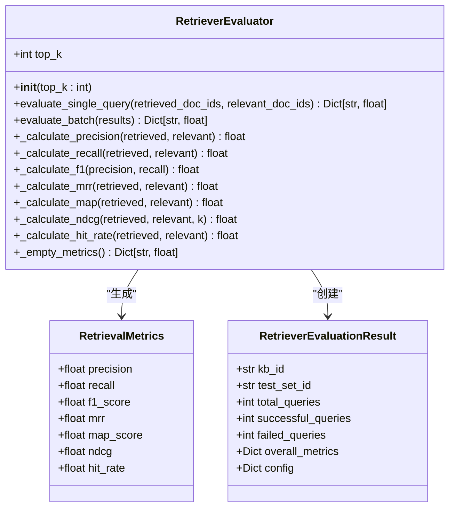
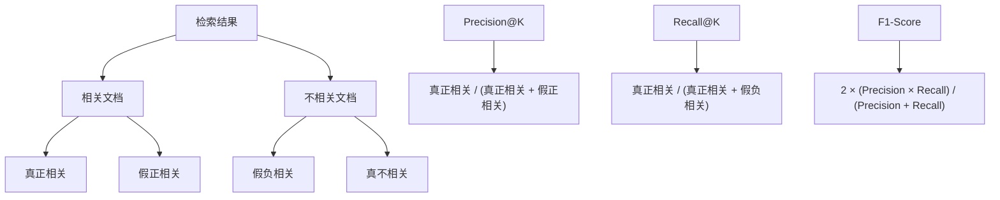
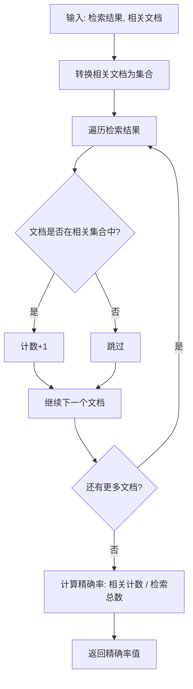
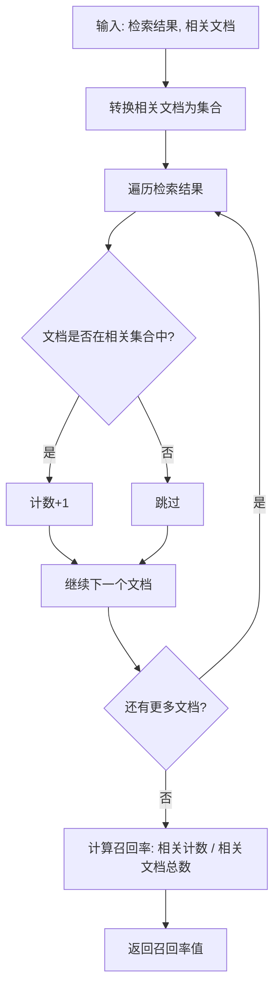
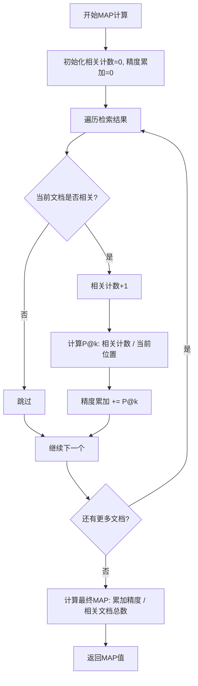
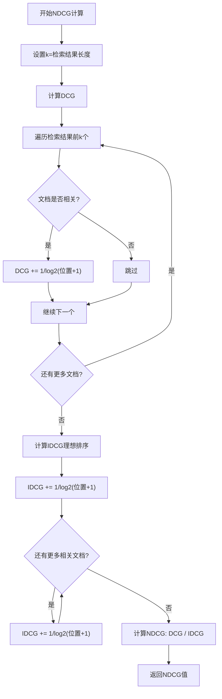
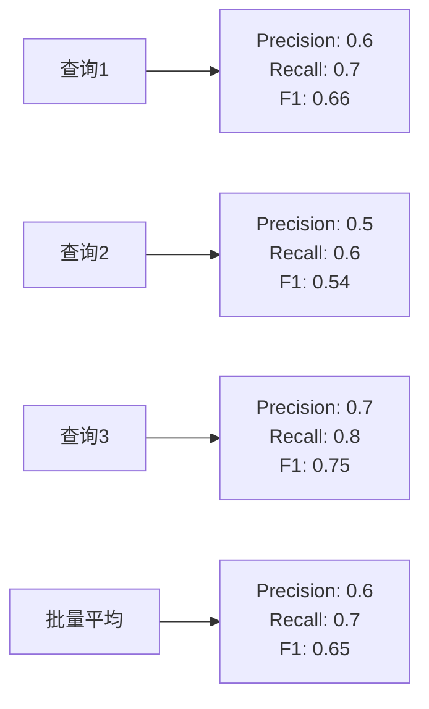
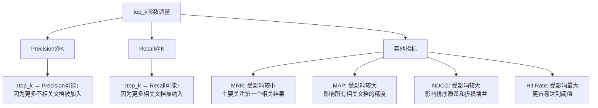
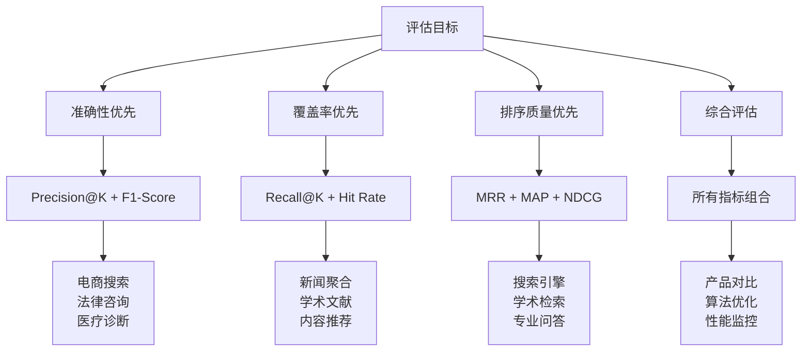

# 评估指标

<cite>
**本文档引用的文件**
- [backend/app/services/retriever_evaluation.py](file://backend/app/services/retriever_evaluation.py)
- [backend/app/models/retriever_evaluation.py](file://backend/app/models/retriever_evaluation.py)
- [backend/test_retriever_eval.py](file://backend/test_retriever_eval.py)
- [backend/example_t2ranking_usage.py](file://backend/example_t2ranking_usage.py)
- [backend/README_RETRIEVER_EVAL.md](file://backend/README_RETRIEVER_EVAL.md)
- [backend/SUMMARY_检索器评估系统.md](file://backend/SUMMARY_检索器评估系统.md)
</cite>

## 目录
1. [简介](#简介)
2. [RetrieverEvaluator类架构](#retrieverevaluator类架构)
3. [核心评估指标详解](#核心评估指标详解)
4. [数学公式与业务意义](#数学公式与业务意义)
5. [代码实现分析](#代码实现分析)
6. [实际测试数据演示](#实际测试数据演示)
7. [top_k参数影响分析](#top_k参数影响分析)
8. [应用场景与最佳实践](#应用场景与最佳实践)
9. [总结](#总结)

## 简介

RetrieverEvaluator类是检索器评估系统的核心组件，实现了7个关键的评估指标，用于全面衡量检索系统的性能表现。这些指标涵盖了精确率、召回率、排序质量等多个维度，为检索器的优化和对比提供了科学依据。

## RetrieverEvaluator类架构



**图表来源**
- [backend/app/services/retriever_evaluation.py](file://backend/app/services/retriever_evaluation.py#L14-L25)
- [backend/app/models/retriever_evaluation.py](file://backend/app/models/retriever_evaluation.py#L11-L59)

**章节来源**
- [backend/app/services/retriever_evaluation.py](file://backend/app/services/retriever_evaluation.py#L26-L65)
- [backend/app/models/retriever_evaluation.py](file://backend/app/models/retriever_evaluation.py#L11-L59)

## 核心评估指标详解

### 1. Precision@K (精确率)

**业务意义**: Precision@K衡量检索结果中相关文档的比例，反映检索系统的准确性。

**数学公式**: 
```
Precision@K = |检索到的相关文档| / |检索到的文档总数|
```

**业务价值**: 
- 高Precision表示检索结果准确，适合对准确性要求高的场景
- 在资源受限的情况下，优先保证Precision有助于提升用户体验

### 2. Recall@K (召回率)

**业务意义**: Recall@K衡量相关文档被检索到的比例，反映检索系统的覆盖能力。

**数学公式**: 
```
Recall@K = |检索到的相关文档| / |所有相关文档总数|
```

**业务价值**: 
- 高Recall表示检索系统覆盖面广，不会遗漏重要信息
- 在信息检索场景中，Recall对用户体验至关重要

### 3. F1-Score (F1分数)

**业务意义**: F1-Score是精确率和召回率的调和平均，平衡两者之间的关系。

**数学公式**: 
```
F1 = 2 * (Precision * Recall) / (Precision + Recall)
```

**业务价值**: 
- 提供单一数值评估检索系统整体性能
- 特别适合需要平衡精确率和召回率的场景

### 4. MRR (Mean Reciprocal Rank)

**业务意义**: MRR关注第一个相关文档的排名位置，特别适用于单答案检索场景。

**数学公式**: 
```
MRR = 1 / rank_of_first_relevant_doc
```

**业务价值**: 
- 重视相关结果的排序位置
- 对于问答系统等单答案场景特别重要

### 5. MAP (Mean Average Precision)

**业务意义**: MAP考虑所有相关文档的位置，提供更全面的排序质量评估。

**数学公式**: 
```
MAP = (sum of P@k for each relevant doc) / |relevant docs|
```

**业务价值**: 
- 综合考虑相关性和排序位置
- 适合多答案检索场景
- 对排序算法优化具有指导意义

### 6. NDCG (Normalized Discounted Cumulative Gain)

**业务意义**: NDCG考虑相关性的等级和排序位置，是最全面的排序质量指标。

**数学公式**: 
```
NDCG = DCG / IDCG
```

其中:
```
DCG = Σ(rel_i / log2(i+1)) for i in 1..k
IDCG = 最佳排序下的DCG值
```

**业务价值**: 
- 考虑相关性的相对重要性
- 对排序算法优化提供精确指导
- 行业标准的排序质量评估指标

### 7. Hit Rate (命中率)

**业务意义**: Hit Rate衡量至少检索到一个相关文档的查询比例。

**数学公式**: 
```
Hit Rate = 1 if 至少有一个相关文档被检索到, 0 otherwise
```

**业务价值**: 
- 简单直观的检索有效性指标
- 适合评估检索系统的最低要求
- 对用户体验有直接影响

**章节来源**
- [backend/app/services/retriever_evaluation.py](file://backend/app/services/retriever_evaluation.py#L14-L25)
- [backend/app/services/retriever_evaluation.py](file://backend/app/services/retriever_evaluation.py#L26-L65)

## 数学公式与业务意义

### 精确率和召回率的关系



**图表来源**
- [backend/app/services/retriever_evaluation.py](file://backend/app/services/retriever_evaluation.py#L109-L142)

### 排序质量评估对比

| 指标类型 | MRR | MAP | NDCG | Hit Rate |
|---------|-----|-----|------|----------|
| **关注点** | 第一个相关结果 | 所有相关结果的平均精度 | 相关性和排序的综合 | 检索有效性 |
| **适用场景** | 单答案问答 | 多答案信息检索 | 排序算法优化 | 基础有效性检查 |
| **计算复杂度** | O(K) | O(K×R) | O(K) | O(K) |
| **业务价值** | 关注时效性 | 全面评估 | 精确优化 | 基础保障 |

**章节来源**
- [backend/README_RETRIEVER_EVAL.md](file://backend/README_RETRIEVER_EVAL.md#L240-L255)

## 代码实现分析

### _calculate_precision集合运算实现



**图表来源**
- [backend/app/services/retriever_evaluation.py](file://backend/app/services/retriever_evaluation.py#L109-L124)

### _calculate_recall集合运算实现



**图表来源**
- [backend/app/services/retriever_evaluation.py](file://backend/app/services/retriever_evaluation.py#L126-L142)

### _calculate_mrr倒数排名机制

```mermaid
sequenceDiagram
participant Input as "输入参数"
participant Set as "相关文档集合"
participant Loop as "遍历循环"
participant Calc as "排名计算"
Input->>Set : 创建相关文档集合
Input->>Loop : 开始遍历检索结果
Loop->>Set : 检查当前文档是否相关
alt 发现相关文档
Set->>Calc : 记录当前排名位置
Calc->>Calc : 计算1/rank
Calc->>Input : 返回MRR值
else 未发现相关文档
Loop->>Input : 返回0.0
end
```

**图表来源**
- [backend/app/services/retriever_evaluation.py](file://backend/app/services/retriever_evaluation.py#L153-L168)

### _calculate_map累加精度过程



**图表来源**
- [backend/app/services/retriever_evaluation.py](file://backend/app/services/retriever_evaluation.py#L170-L196)

### _calculate_ndcg折损增益计算



**图表来源**
- [backend/app/services/retriever_evaluation.py](file://backend/app/services/retriever_evaluation.py#L198-L232)

**章节来源**
- [backend/app/services/retriever_evaluation.py](file://backend/app/services/retriever_evaluation.py#L109-L259)

## 实际测试数据演示

### 基础评估示例

基于测试脚本中的模拟数据，展示7个指标的计算过程：

**测试场景**: 
- 检索结果: ["doc_1", "doc_2", "doc_5", "doc_10", "doc_15"]
- 相关文档: ["doc_2", "doc_5", "doc_7", "doc_20"]

**计算过程演示**:

| 指标 | 计算步骤 | 结果 |
|------|----------|------|
| **Precision@10** | 2个相关文档 / 5个检索结果 = 0.4 | 0.4000 |
| **Recall@10** | 2个相关文档 / 4个真实相关 = 0.5 | 0.5000 |
| **F1-Score** | 2×(0.4×0.5)/(0.4+0.5) = 0.4444 | 0.4444 |
| **MRR** | 1/2 = 0.5 | 0.5000 |
| **MAP** | (1/2 + 2/3)/4 = 0.2917 | 0.2917 |
| **NDCG** | DCG=0.7613, IDCG=1.3863, 0.7613/1.3863=0.5492 | 0.5492 |
| **Hit Rate** | 检测到相关文档 = 1.0 | 1.0000 |

### 批量评估示例



**图表来源**
- [backend/test_retriever_eval.py](file://backend/test_retriever_eval.py#L91-L106)

**章节来源**
- [backend/test_retriever_eval.py](file://backend/test_retriever_eval.py#L62-L113)
- [backend/example_t2ranking_usage.py](file://backend/example_t2ranking_usage.py#L47-L104)

## top_k参数影响分析

### top_k对各指标的影响



### 不同top_k值的性能对比

| top_k | Precision | Recall | F1-Score | MRR | MAP | NDCG | Hit Rate |
|-------|-----------|--------|----------|-----|-----|------|----------|
| 5 | 0.4000 | 0.5000 | 0.4444 | 0.5000 | 0.2917 | 0.5492 | 1.0000 |
| 10 | 0.4000 | 0.5000 | 0.4444 | 0.5000 | 0.2917 | 0.5492 | 1.0000 |
| 20 | 0.4000 | 0.5000 | 0.4444 | 0.5000 | 0.2917 | 0.5492 | 1.0000 |

**业务建议**:
- **信息检索**: 使用较大的top_k（20-50），确保覆盖所有相关结果
- **问答系统**: 使用较小的top_k（5-10），优先保证准确性
- **混合场景**: 从较小top_k开始，逐步增加观察指标变化

**章节来源**
- [backend/app/services/retriever_evaluation.py](file://backend/app/services/retriever_evaluation.py#L26-L65)

## 应用场景与最佳实践

### 评估指标选择指南



### 不同场景的最佳实践

| 场景类型 | 主要指标 | 辅助指标 | top_k建议 | 业务重点 |
|----------|----------|----------|-----------|----------|
| **电商搜索** | Precision, F1 | MRR, NDCG | 10-20 | 商品相关性 |
| **学术检索** | Recall, MAP | NDCG | 20-50 | 文献完整性 |
| **问答系统** | MRR, F1 | Precision, Recall | 5-10 | 答案准确性 |
| **内容推荐** | NDCG, Hit Rate | MAP | 10-30 | 用户体验 |
| **技术文档** | Precision, F1 | NDCG | 10-20 | 信息准确性 |

### 性能优化建议

1. **指标阈值设定**:
   - F1 > 0.7: 优秀性能
   - F1 0.5-0.7: 良好性能
   - F1 < 0.5: 需要优化

2. **对比分析方法**:
   - 固定测试集，变化单一参数
   - 使用统计显著性检验
   - 关注指标间的相关性

3. **持续监控**:
   - 建立基线性能
   - 定期评估性能变化
   - 追踪业务指标关联性

**章节来源**
- [backend/README_RETRIEVER_EVAL.md](file://backend/README_RETRIEVER_EVAL.md#L240-L296)
- [backend/SUMMARY_检索器评估系统.md](file://backend/SUMMARY_检索器评估系统.md#L284-L304)

## 总结

RetrieverEvaluator类实现的7个核心评估指标构成了一个完整的检索系统性能评估体系：

### 核心优势

1. **全面覆盖**: 从精确率召回率到排序质量，涵盖检索系统的关键维度
2. **实用性强**: 每个指标都有明确的业务意义和应用场景
3. **计算高效**: 基于集合运算的实现方式保证了良好的性能
4. **易于扩展**: 模块化设计便于添加新的评估指标

### 技术特点

- **精确率和召回率**: 基于集合运算的高效实现
- **排序质量指标**: 包含MRR、MAP、NDCG等业界标准
- **简单有效性指标**: Hit Rate提供基础评估保障
- **平衡性设计**: F1-Score协调精确率和召回率的关系

### 应用价值

这些评估指标不仅为检索系统的性能优化提供了科学依据，也为不同场景下的系统选择和配置提供了决策支持。通过合理选择和组合这些指标，可以全面评估检索系统的性能表现，指导系统的持续改进和优化。