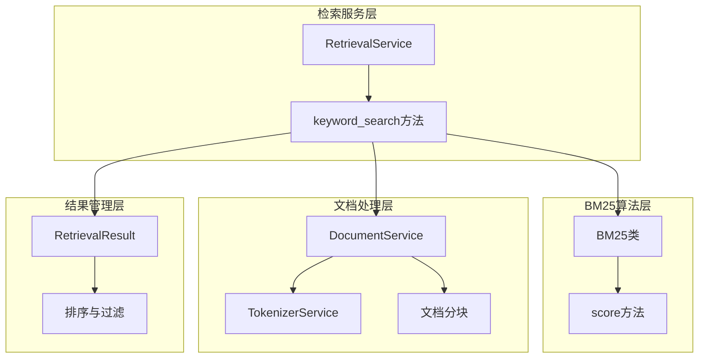
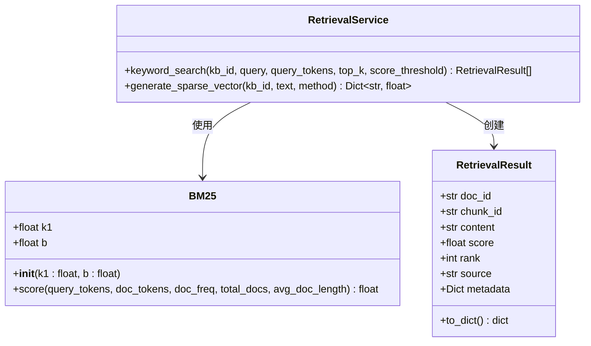
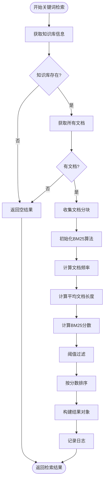
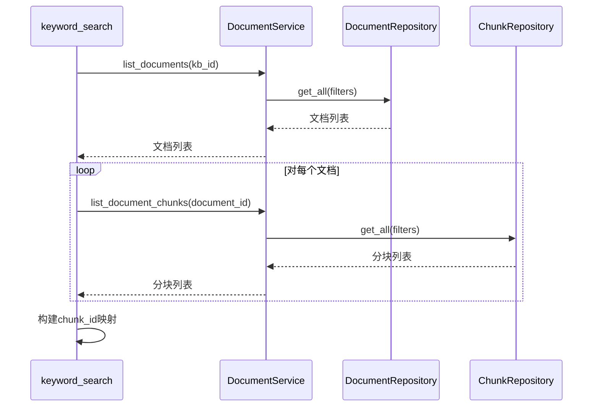
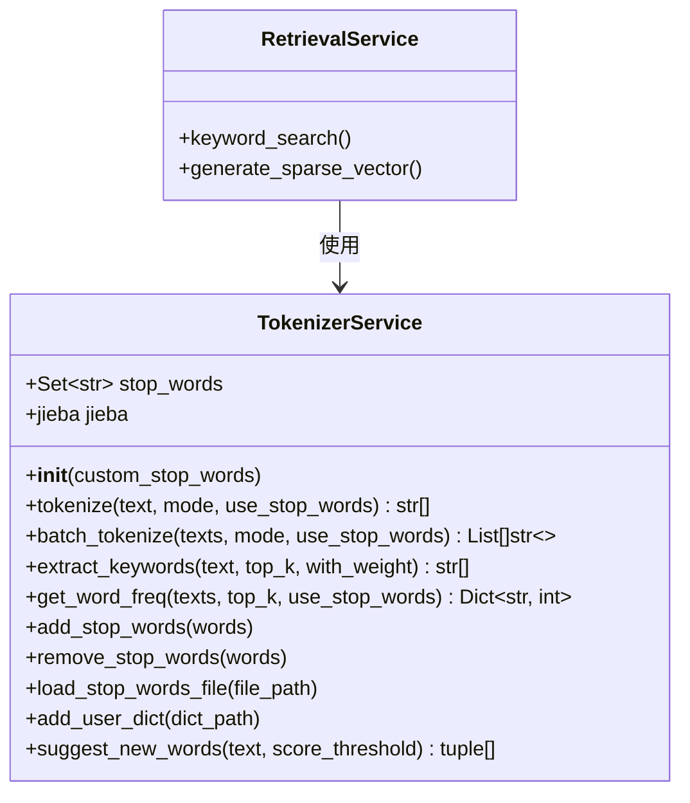
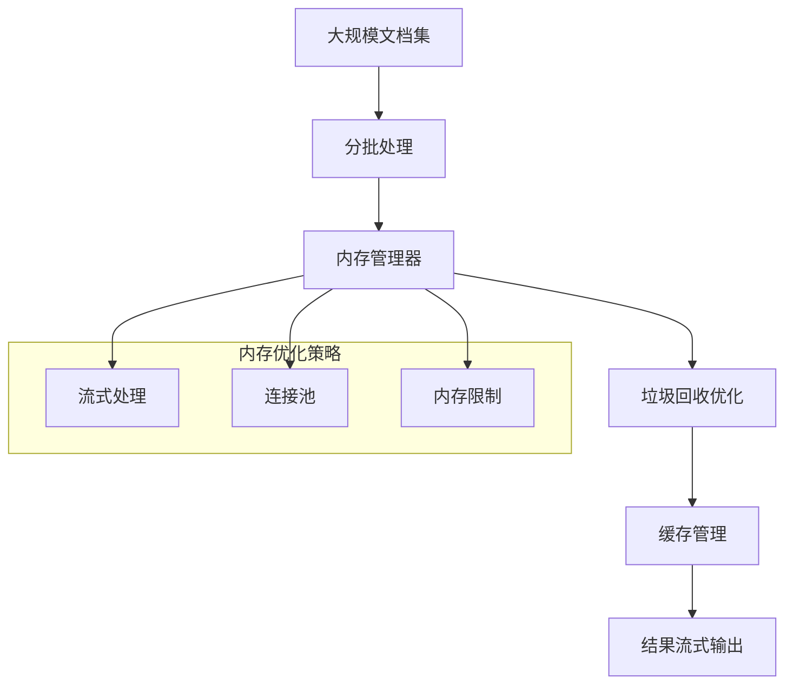

# 关键词检索

<cite>
**本文档中引用的文件**
- [retrieval_service.py](file://backend/app/services/retrieval_service.py)
- [tokenizer_service.py](file://backend/app/services/tokenizer_service.py)
- [document.py](file://backend/app/services/document.py)
- [sparse_vector_service.py](file://backend/app/services/sparse_vector_service.py)
</cite>

## 目录
1. [简介](#简介)
2. [系统架构概览](#系统架构概览)
3. [BM25算法核心实现](#bm25算法核心实现)
4. [关键词检索流程详解](#关键词检索流程详解)
5. [分词服务与文档处理](#分词服务与文档处理)
6. [性能优化策略](#性能优化策略)
7. [参数调优指南](#参数调优指南)
8. [故障排除与最佳实践](#故障排除与最佳实践)
9. [总结](#总结)

## 简介

RAG-Studio的关键词检索功能基于BM25算法，为用户提供高效的文本匹配能力。该系统通过精确的词频统计、文档频率计算和智能的归一化机制，实现了高质量的文档检索效果。本文档深入解析keyword_search方法的完整实现，涵盖从查询文本分词到检索结果排序的每一个技术细节。

## 系统架构概览

关键词检索系统采用模块化设计，主要由以下核心组件构成：



**图表来源**
- [retrieval_service.py](file://backend/app/services/retrieval_service.py#L135-L328)
- [retrieval_service.py](file://backend/app/services/retrieval_service.py#L717-L783)

**章节来源**
- [retrieval_service.py](file://backend/app/services/retrieval_service.py#L135-L328)

## BM25算法核心实现

### BM25类结构设计

BM25算法的核心实现位于专门的类中，具有清晰的参数化设计：



**图表来源**
- [retrieval_service.py](file://backend/app/services/retrieval_service.py#L717-L783)
- [retrieval_service.py](file://backend/app/services/retrieval_service.py#L21-L40)

### k1参数对检索结果的影响

k1参数控制词频饱和度，其影响机制如下：

| k1值范围 | 效果描述 | 检索特点 | 适用场景 |
|---------|----------|----------|----------|
| 0.5-1.0 | 低饱和度，快速饱和 | 对高词频文档更敏感 | 精确匹配场景 |
| 1.5-2.0 | 标准饱和度 | 平衡词频影响 | 通用检索场景 |
| 2.5-3.0 | 高饱和度，缓慢饱和 | 更重视文档长度 | 长文档优先场景 |

### b参数对文档长度归一化的影响

b参数控制文档长度归一化的程度：

| b值范围 | 影响机制 | 检索行为 | 性能特征 |
|---------|----------|----------|----------|
| 0.3-0.5 | 强归一化 | 长短文档差异显著 | 精确长度匹配 |
| 0.7-0.8 | 标准归一化 | 平衡长度考虑 | 通用平衡性 |
| 0.9-1.0 | 弱归一化 | 长文档优势明显 | 长文档友好 |

**章节来源**
- [retrieval_service.py](file://backend/app/services/retrieval_service.py#L717-L783)

## 关键词检索流程详解

### 完整检索流程图



**图表来源**
- [retrieval_service.py](file://backend/app/services/retrieval_service.py#L216-L328)

### 查询文本分词处理

查询文本的分词过程包括以下关键步骤：

1. **分词模式选择**：支持default、search、all三种模式
2. **停用词过滤**：可配置是否过滤常见停用词
3. **长度过滤**：自动过滤单字符和空白词项
4. **编码处理**：确保文本编码的一致性

### 文档分块内容加载

系统通过DocumentService获取知识库中的所有文档分块：



**图表来源**
- [retrieval_service.py](file://backend/app/services/retrieval_service.py#L245-L267)
- [document.py](file://backend/app/services/document.py#L201-L224)

### 词频统计与文档频率计算

词频统计是BM25算法的基础，涉及两个层次的统计：

1. **文档内词频统计**：计算每个分块中各词的出现次数
2. **文档频率统计**：统计包含每个词的文档数量

### 平均文档长度归一化

平均文档长度的计算公式：
```
avg_doc_length = total_length / total_docs
```

归一化因子的计算：
```
norm_factor = 1 - b + b * doc_length / avg_doc_length
```

**章节来源**
- [retrieval_service.py](file://backend/app/services/retrieval_service.py#L274-L306)

## 分词服务与文档处理

### 分词服务架构

分词服务基于jieba库实现，提供灵活的分词配置：



**图表来源**
- [tokenizer_service.py](file://backend/app/services/tokenizer_service.py#L13-L277)

### 分词参数配置

| 参数 | 类型 | 默认值 | 描述 | 影响 |
|------|------|--------|------|------|
| mode | str | "default" | 分词模式 | 控制分词精度和速度 |
| use_stop_words | bool | True | 是否过滤停用词 | 影响检索准确性 |
| custom_stop_words | Set[str] | None | 自定义停用词 | 扩展停用词范围 |

### 停用词管理

系统内置了中文常见停用词集合，并支持动态扩展：

- **默认停用词**：包含常用虚词、助词、代词等
- **自定义扩展**：支持从文件或代码中添加停用词
- **动态管理**：运行时可添加或移除停用词

**章节来源**
- [tokenizer_service.py](file://backend/app/services/tokenizer_service.py#L13-L277)

## 性能优化策略

### 分词缓存策略

为了提高性能，系统实现了多层缓存机制：

1. **分词结果缓存**：相同文本的分词结果缓存
2. **词频统计缓存**：文档频率统计结果缓存
3. **BM25参数缓存**：BM25算法参数缓存

### 大规模文档集的内存管理

针对大规模文档集，系统采用以下优化策略：



### 并发处理优化

系统支持并发处理以提升性能：

- **批量分词**：支持同时处理多个文档
- **异步检索**：非阻塞的检索操作
- **连接池管理**：数据库连接复用

**章节来源**
- [tokenizer_service.py](file://backend/app/services/tokenizer_service.py#L96-L119)

## 参数调优指南

### BM25参数推荐配置

根据不同的应用场景，推荐以下参数配置：

| 应用场景 | k1值 | b值 | 说明 |
|----------|------|-----|------|
| 精确问答系统 | 1.0-1.2 | 0.6-0.7 | 严格匹配，减少噪音 |
| 通用搜索 | 1.5-1.8 | 0.7-0.8 | 平衡准确性和召回率 |
| 长文档检索 | 2.0-2.5 | 0.8-0.9 | 倾向于长文档 |
| 短文本匹配 | 1.0-1.3 | 0.5-0.6 | 快速响应，降低饱和度 |

### 分词参数优化

| 场景 | mode | use_stop_words | 优化目标 |
|------|------|----------------|----------|
| 检索增强 | search | True | 提高检索质量 |
| 文本分析 | default | False | 保留完整信息 |
| 快速匹配 | all | True | 提升处理速度 |

### 阈值设置建议

- **score_threshold**：根据应用需求设置，通常在0.1-2.0之间
- **top_k**：一般设置为10-50，平衡质量和性能
- **批量大小**：建议每次处理10-100个文档

## 故障排除与最佳实践

### 常见问题诊断

1. **检索结果质量差**
   - 检查分词配置是否合适
   - 调整BM25参数
   - 验证停用词设置

2. **性能瓶颈**
   - 启用分词缓存
   - 优化数据库查询
   - 调整批量处理大小

3. **内存占用过高**
   - 减少并发处理数量
   - 实施流式处理
   - 定期清理缓存

### 最佳实践建议

1. **定期更新停用词表**：根据具体应用场景维护停用词库
2. **监控检索质量**：建立指标体系评估检索效果
3. **渐进式优化**：从基础配置开始，逐步调整参数
4. **缓存策略**：合理利用缓存提升性能
5. **异常处理**：完善的错误处理和日志记录

**章节来源**
- [retrieval_service.py](file://backend/app/services/retrieval_service.py#L216-L328)

## 总结

RAG-Studio的关键词检索系统通过BM25算法实现了高效、准确的文本检索功能。系统的核心优势包括：

1. **算法先进性**：基于BM25的经典信息检索算法
2. **参数灵活性**：可调优的k1和b参数
3. **性能优化**：多层次的缓存和并发处理
4. **易用性**：简洁的API设计和丰富的配置选项

通过深入理解BM25算法的工作原理和系统的实现细节，开发者可以根据具体需求进行针对性的优化，从而获得最佳的检索效果。