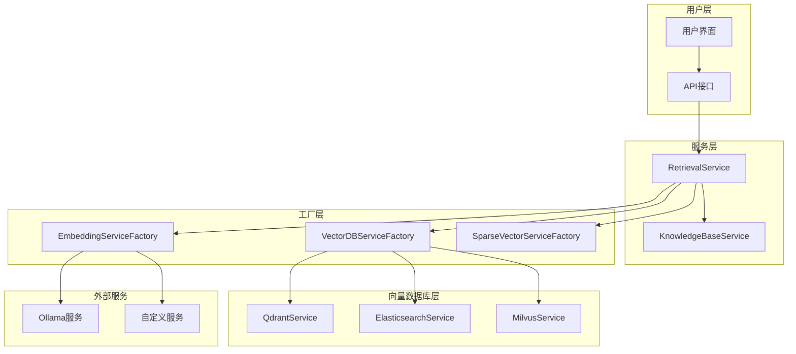
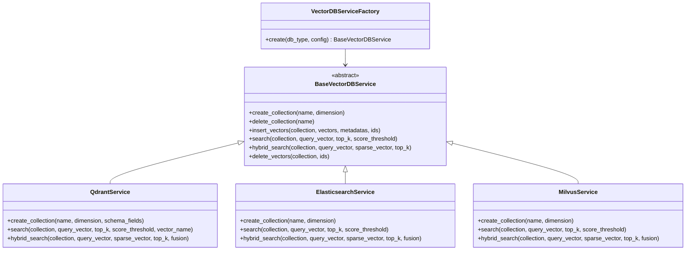
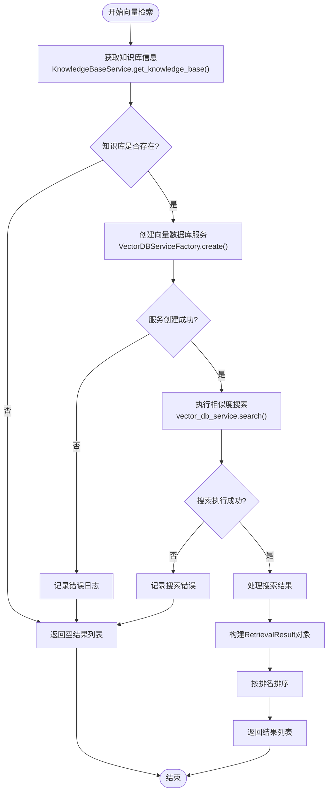
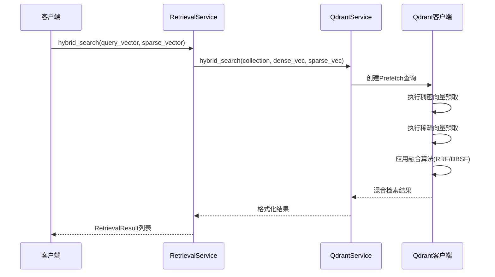
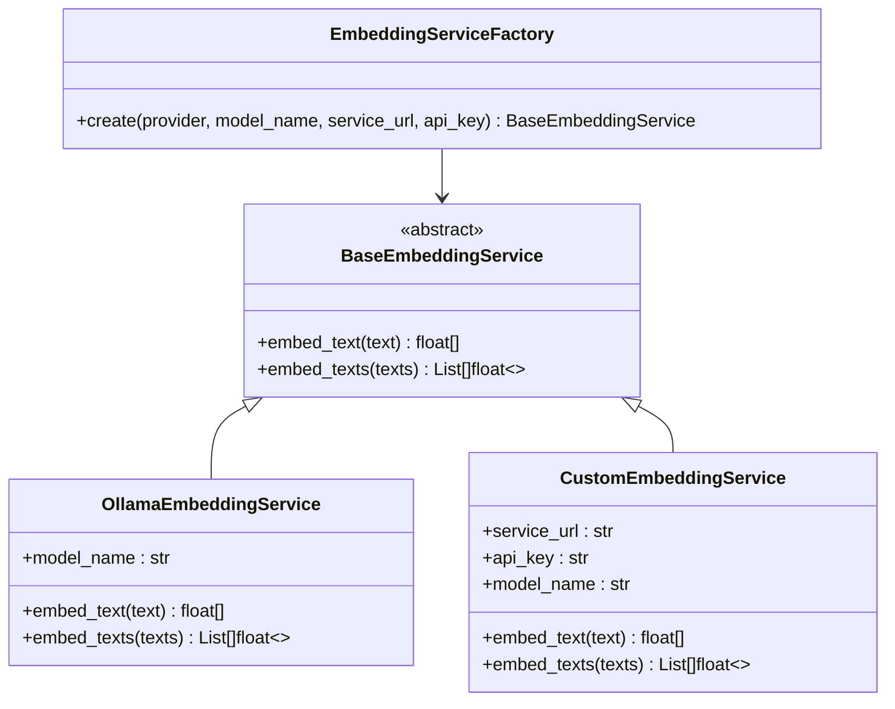
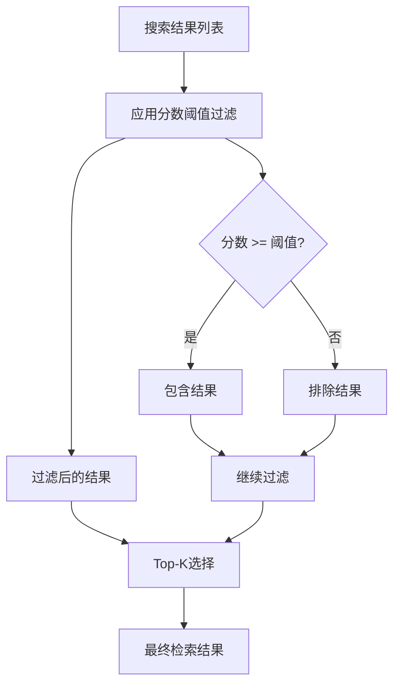
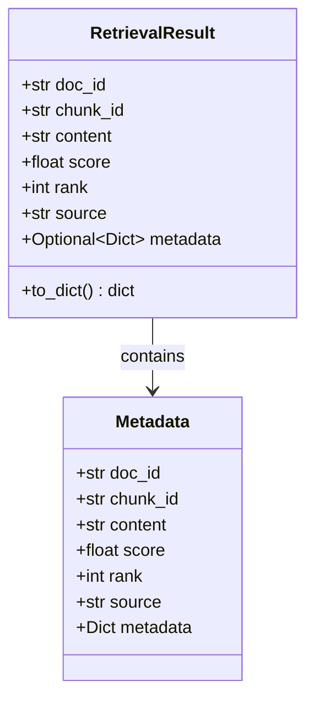
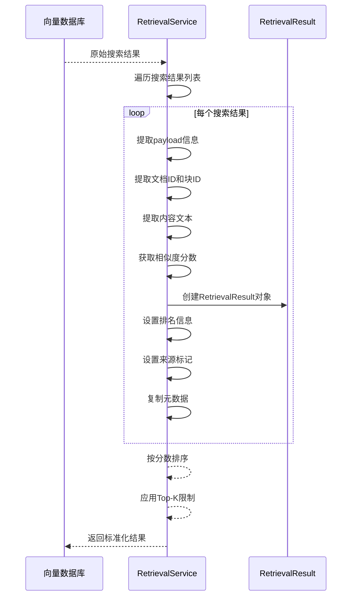
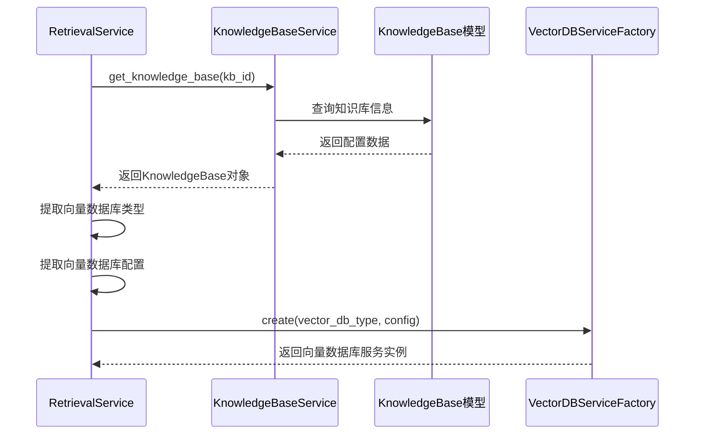

# 向量检索

<cite>
**本文档中引用的文件**
- [retrieval_service.py](file://backend/app/services/retrieval_service.py)
- [vector_db_service.py](file://backend/app/services/vector_db_service.py)
- [knowledge_base.py](file://backend/app/services/knowledge_base.py)
- [knowledge_base.py](file://backend/app/models/knowledge_base.py)
- [sparse_vector_service.py](file://backend/app/services/sparse_vector_service.py)
- [embedding_service.py](file://backend/app/services/embedding_service.py)
</cite>

## 目录
1. [简介](#简介)
2. [系统架构概览](#系统架构概览)
3. [核心组件分析](#核心组件分析)
4. [vector_search方法深度解析](#vector_search方法深度解析)
5. [向量数据库服务工厂](#向量数据库服务工厂)
6. [查询向量生成流程](#查询向量生成流程)
7. [分数阈值过滤机制](#分数阈值过滤机制)
8. [数据转换与结果构建](#数据转换与结果构建)
9. [与KnowledgeBaseService的集成](#与knowledgebaseservice的集成)
10. [扩展新向量数据库支持](#扩展新向量数据库支持)
11. [性能优化建议](#性能优化建议)
12. [故障排除指南](#故障排除指南)

## 简介

RAG-Studio的向量检索系统是一个高度模块化的智能检索框架，专门设计用于处理大规模文档的语义相似度搜索。该系统通过VectorDBServiceFactory工厂模式支持多种向量数据库（Qdrant、Elasticsearch、Milvus），并实现了灵活的查询向量生成、相似度搜索、结果过滤和数据转换机制。

核心特性包括：
- **多数据库支持**：统一接口支持Qdrant、Elasticsearch和Milvus
- **灵活的查询生成**：支持稠密向量和稀疏向量混合检索
- **智能结果过滤**：基于分数阈值的精确结果控制
- **标准化结果格式**：统一的RetrievalResult数据结构
- **可扩展架构**：易于添加新的向量数据库和检索方法

## 系统架构概览



**图表来源**
- [retrieval_service.py](file://backend/app/services/retrieval_service.py#L136-L142)
- [vector_db_service.py](file://backend/app/services/vector_db_service.py#L1089-L1111)

## 核心组件分析

### RetrievalService类

RetrievalService是向量检索的核心控制器，负责协调整个检索流程。该类提供了多种检索方法，包括纯向量检索、关键词检索、混合检索和高级混合检索。

主要方法包括：
- `vector_search()`：执行纯粹的向量相似度搜索
- `keyword_search()`：基于BM25算法的关键词检索
- `hybrid_search()`：向量与关键词的RRF融合检索
- `advanced_hybrid_search()`：支持多种检索方式的高级混合检索

### VectorDBServiceFactory工厂模式

VectorDBServiceFactory采用工厂模式设计，根据配置的向量数据库类型动态创建相应的服务实例。这种设计模式具有以下优势：



**图表来源**
- [vector_db_service.py](file://backend/app/services/vector_db_service.py#L1089-L1111)
- [vector_db_service.py](file://backend/app/services/vector_db_service.py#L31-L114)

**章节来源**
- [retrieval_service.py](file://backend/app/services/retrieval_service.py#L136-L142)
- [vector_db_service.py](file://backend/app/services/vector_db_service.py#L1089-L1111)

## vector_search方法深度解析

vector_search方法是向量检索的核心入口，实现了从查询文本到检索结果的完整流程。该方法的设计体现了清晰的职责分离和错误处理机制。

### 方法签名与参数

```python
async def vector_search(
    self,
    kb_id: str,
    query: str,
    query_vector: List[float],
    top_k: int = 10,
    score_threshold: float = 0.0
) -> List[RetrievalResult]:
```

关键参数说明：
- `kb_id`：知识库标识符，用于定位具体的向量数据库集合
- `query`：原始查询文本，主要用于知识库配置获取
- `query_vector`：预计算的查询向量，避免重复计算
- `top_k`：期望返回的结果数量，默认为10
- `score_threshold`：分数阈值，低于此值的结果将被过滤

### 执行流程图



**图表来源**
- [retrieval_service.py](file://backend/app/services/retrieval_service.py#L143-L215)

### 错误处理机制

vector_search方法实现了多层次的错误处理：

1. **知识库验证**：确保目标知识库存在且配置正确
2. **服务创建异常**：捕获并记录向量数据库服务初始化失败
3. **搜索执行异常**：处理向量数据库查询过程中的各种异常情况
4. **数据转换异常**：确保结果格式转换过程的健壮性

**章节来源**
- [retrieval_service.py](file://backend/app/services/retrieval_service.py#L143-L215)

## 向量数据库服务工厂

### QdrantService详解

QdrantService是目前最完善的向量数据库实现，支持复杂的向量配置和混合检索。

#### 高级配置支持

QdrantService支持丰富的配置选项：

| 配置项 | 描述 | 默认值 | 支持的值 |
|--------|------|--------|----------|
| 向量维度 | 向量空间的维度 | 768 | 任意正整数 |
| 距离度量 | 向量相似度计算方式 | Cosine | Cosine, Euclidean, Dot, Manhattan |
| HNSW参数 | 分层导航小世界索引配置 | 内置优化 | m, ef_construct, full_scan_threshold |
| 量化配置 | 向量压缩和存储优化 | 无量化 | Scalar, Product, Binary |
| 磁盘存储 | 是否使用磁盘存储向量 | False | True/False |

#### 混合检索实现

QdrantService提供了原生的混合检索能力，支持稠密向量和稀疏向量的联合搜索：



**图表来源**
- [vector_db_service.py](file://backend/app/services/vector_db_service.py#L654-L761)

### ElasticsearchService状态

ElasticsearchService目前处于开发阶段，虽然提供了基础的接口定义，但具体实现仍在完善中。其设计目标包括：

- **向量索引映射**：支持稠密向量和稀疏向量的索引配置
- **混合检索**：结合dense vector和sparse vector进行混合检索
- **BM25集成**：利用Elasticsearch内置的BM25算法进行关键词检索

**章节来源**
- [vector_db_service.py](file://backend/app/services/vector_db_service.py#L116-L201)
- [vector_db_service.py](file://backend/app/services/vector_db_service.py#L203-L800)

## 查询向量生成流程

### 嵌入服务集成

查询向量的生成通过EmbeddingServiceFactory实现，支持多种嵌入服务提供商：



**图表来源**
- [embedding_service.py](file://backend/app/services/embedding_service.py#L224-L255)

### 向量生成策略

系统支持两种主要的向量生成策略：

1. **预计算向量**：在调用vector_search之前预先计算查询向量，适用于批处理场景
2. **即时生成**：在检索过程中动态生成查询向量，适用于实时查询场景

### 向量维度兼容性

不同嵌入模型生成的向量维度需要与向量数据库配置相匹配。系统通过以下机制确保兼容性：

- **自动检测**：从知识库配置中获取预期的向量维度
- **运行时验证**：在向量插入时验证维度一致性
- **错误恢复**：当维度不匹配时自动重建集合

**章节来源**
- [embedding_service.py](file://backend/app/services/embedding_service.py#L224-L255)
- [retrieval_service.py](file://backend/app/services/retrieval_service.py#L386-L404)

## 分数阈值过滤机制

### 分数计算原理

向量数据库返回的相似度分数反映了查询向量与候选向量之间的语义接近程度。不同的向量数据库使用不同的分数计算方法：

| 数据库类型 | 分数范围 | 计算方法 | 排序规则 |
|------------|----------|----------|----------|
| Qdrant | [-1.0, 1.0] | 余弦相似度 | 降序排列 |
| Elasticsearch | [0, 100] | 向量相似度分数 | 降序排列 |
| Milvus | [0, 1] | 欧几里得距离倒数 | 降序排列 |

### 过滤策略

score_threshold参数提供了灵活的结果过滤机制：



**图表来源**
- [retrieval_service.py](file://backend/app/services/retrieval_service.py#L185-L186)

### 阈值设置建议

不同应用场景下的阈值设置建议：

- **高精度场景**：0.8-0.95，确保高质量结果
- **平衡场景**：0.6-0.8，兼顾准确性和召回率  
- **高召回场景**：0.3-0.6，获取更多潜在相关结果

**章节来源**
- [retrieval_service.py](file://backend/app/services/retrieval_service.py#L148-L149)

## 数据转换与结果构建

### RetrievalResult数据结构

RetrievalResult是检索结果的标准数据结构，包含了检索过程中的所有重要信息：



**图表来源**
- [retrieval_service.py](file://backend/app/services/retrieval_service.py#L21-L41)

### 结果转换流程

从向量数据库原始结果到RetrievalResult对象的转换过程：



**图表来源**
- [retrieval_service.py](file://backend/app/services/retrieval_service.py#L193-L212)

### 元数据保留机制

RetrievalResult的metadata字段保留了原始向量数据库中的所有元数据信息，包括：

- **文档元信息**：文档ID、块ID、创建时间等
- **检索上下文**：查询向量维度、相似度计算参数
- **数据库特定信息**：Qdrant的payload字段、Elasticsearch的元数据

**章节来源**
- [retrieval_service.py](file://backend/app/services/retrieval_service.py#L21-L41)
- [retrieval_service.py](file://backend/app/services/retrieval_service.py#L193-L212)

## 与KnowledgeBaseService的集成

### 知识库配置加载

KnowledgeBaseService负责管理知识库的配置信息，包括向量数据库类型、嵌入模型配置、检索参数等。vector_search方法通过以下步骤获取必要的配置：



**图表来源**
- [retrieval_service.py](file://backend/app/services/retrieval_service.py#L165-L178)
- [knowledge_base.py](file://backend/app/services/knowledge_base.py#L49-L59)

### 动态服务实例创建

基于知识库配置，VectorDBServiceFactory动态创建相应的向量数据库服务实例：

| 配置字段 | 用途 | 示例值 |
|----------|------|--------|
| `vector_db_type` | 指定数据库类型 | "qdrant", "elasticsearch", "milvus" |
| `vector_db_config` | 数据库连接配置 | 主机地址、端口、认证信息 |
| `embedding_provider` | 嵌入服务提供商 | "ollama", "custom" |
| `embedding_model` | 嵌入模型名称 | "nomic-embed-text", "custom-model" |
| `embedding_dimension` | 向量维度 | 768, 1024, 1536 |

### 配置验证机制

系统在创建向量数据库服务实例时会进行配置验证：

1. **类型验证**：确保vector_db_type是支持的枚举值
2. **连接验证**：测试数据库连接的可用性
3. **权限验证**：验证数据库访问权限
4. **资源验证**：检查数据库资源可用性

**章节来源**
- [retrieval_service.py](file://backend/app/services/retrieval_service.py#L165-L178)
- [knowledge_base.py](file://backend/app/services/knowledge_base.py#L49-L59)

## 扩展新向量数据库支持

### 接口契约要求

要支持新的向量数据库，需要实现BaseVectorDBService抽象基类的所有方法：

```python
class BaseVectorDBService(ABC):
    @abstractmethod
    async def create_collection(self, collection_name: str, dimension: int, **kwargs):
        """创建集合/索引"""
        pass
    
    @abstractmethod
    async def delete_collection(self, collection_name: str):
        """删除集合/索引"""
        pass
    
    @abstractmethod
    async def insert_vectors(
        self,
        collection_name: str,
        vectors: List[Union[List[float], Dict[str, Any]]],
        metadatas: List[Dict[str, Any]],
        ids: List[str]
    ):
        """插入向量"""
        pass
    
    @abstractmethod
    async def search(
        self,
        collection_name: str,
        query_vector: List[float],
        top_k: int = 5,
        score_threshold: float = 0.0
    ) -> List[Dict[str, Any]]:
        """检索相似向量"""
        pass
    
    @abstractmethod
    async def delete_vectors(self, collection_name: str, ids: List[str]):
        """删除向量"""
        pass
```

### 注册新服务的步骤

1. **实现服务类**：继承BaseVectorDBService并实现所有抽象方法
2. **更新工厂类**：在VectorDBServiceFactory的create方法中添加新的分支
3. **添加枚举值**：在VectorDBType枚举中添加新的数据库类型
4. **编写测试**：为新服务编写单元测试和集成测试

### 示例：添加新的向量数据库

```python
class NewVectorDBService(BaseVectorDBService):
    """新的向量数据库服务实现"""
    
    def __init__(self, config: Optional[Dict[str, Any]] = None):
        # 实现初始化逻辑
        pass
    
    async def create_collection(self, collection_name: str, dimension: int, **kwargs):
        # 实现集合创建逻辑
        pass
    
    async def search(self, collection_name: str, query_vector: List[float], 
                    top_k: int = 5, score_threshold: float = 0.0) -> List[Dict[str, Any]]:
        # 实现搜索逻辑
        pass

# 在VectorDBServiceFactory中添加支持
class VectorDBServiceFactory:
    @staticmethod
    def create(db_type: VectorDBType, config: Optional[Dict[str, Any]] = None) -> BaseVectorDBService:
        if db_type == VectorDBType.NEW_VECTOR_DB:
            return NewVectorDBService(config=config)
        # ... 其他数据库类型
```

### 最佳实践

- **错误处理**：实现全面的异常处理机制
- **性能监控**：添加数据库操作的性能指标
- **连接池管理**：实现数据库连接的复用和管理
- **配置验证**：提供配置参数的有效性检查
- **文档完善**：为新服务提供详细的使用文档

**章节来源**
- [vector_db_service.py](file://backend/app/services/vector_db_service.py#L31-L114)
- [vector_db_service.py](file://backend/app/services/vector_db_service.py#L1089-L1111)

## 性能优化建议

### 向量数据库优化

1. **索引优化**
   - 为高频查询字段建立索引
   - 使用适当的HNSW参数配置
   - 启用量化压缩减少存储开销

2. **查询优化**
   - 使用预取查询减少网络往返
   - 实现查询缓存机制
   - 优化批量操作的批次大小

3. **存储优化**
   - 启用磁盘存储降低内存压力
   - 实现定期的数据压缩和清理
   - 使用分片策略分散查询负载

### 检索性能调优

1. **Top-K调整**
   - 根据应用需求调整top_k值
   - 在混合检索中合理分配各部分的top_k

2. **分数阈值优化**
   - 设置合理的score_threshold避免过多无效结果
   - 根据召回率和精度需求调整阈值

3. **并发控制**
   - 实现查询队列和限流机制
   - 使用异步操作提高并发处理能力

### 内存和计算优化

1. **向量预计算**
   - 在批处理场景中预计算查询向量
   - 实现向量缓存机制

2. **结果缓存**
   - 缓存频繁查询的检索结果
   - 实现基于内容的缓存键生成

3. **模型优化**
   - 选择适合应用需求的嵌入模型
   - 考虑使用量化模型减少计算开销

## 故障排除指南

### 常见问题及解决方案

#### 1. 向量数据库连接失败

**症状**：创建向量数据库服务时抛出连接异常

**排查步骤**：
- 检查数据库服务是否正常运行
- 验证网络连接和防火墙设置
- 确认认证凭据的正确性
- 检查数据库配置参数

**解决方案**：
```python
# 添加连接重试机制
from tenacity import retry, stop_after_attempt, wait_exponential

@retry(stop=stop_after_attempt(3), wait=wait_exponential(multiplier=1, min=4, max=10))
def connect_with_retry(config):
    return VectorDBServiceFactory.create(VectorDBType.QDRANT, config)
```

#### 2. 向量维度不匹配

**症状**：插入向量时出现维度错误

**排查步骤**：
- 检查嵌入模型输出的向量维度
- 验证知识库配置中的embedding_dimension
- 确认向量数据库集合的维度设置

**解决方案**：
```python
# 添加维度验证
def validate_vector_dimension(vector, expected_dim):
    if len(vector) != expected_dim:
        raise ValueError(f"向量维度不匹配: {len(vector)} != {expected_dim}")
```

#### 3. 检索结果质量不佳

**症状**：检索结果的相关性较低

**排查步骤**：
- 检查查询向量的质量
- 验证嵌入模型的适用性
- 调整分数阈值和top_k参数
- 分析向量数据库的索引配置

**解决方案**：
```python
# 实现结果质量评估
def evaluate_retrieval_quality(results, ground_truth):
    # 计算召回率、精确率等指标
    recall = calculate_recall(results, ground_truth)
    precision = calculate_precision(results, ground_truth)
    return {"recall": recall, "precision": precision}
```

#### 4. 性能瓶颈识别

**症状**：检索响应时间过长

**排查步骤**：
- 监控数据库查询时间
- 分析网络延迟和带宽使用
- 检查服务器资源使用情况
- 识别热点查询和数据

**解决方案**：
```python
# 添加性能监控
import time
from functools import wraps

def monitor_performance(func):
    @wraps(func)
    async def wrapper(*args, **kwargs):
        start_time = time.time()
        result = await func(*args, **kwargs)
        duration = time.time() - start_time
        logger.info(f"Operation {func.__name__} took {duration:.2f}s")
        return result
    return wrapper
```

### 日志和监控

建议启用详细的日志记录和监控机制：

```python
# 配置日志级别
import logging
logging.basicConfig(level=logging.INFO)

# 添加监控指标
from prometheus_client import Counter, Histogram

search_requests = Counter('vector_search_requests_total', 'Total search requests')
search_duration = Histogram('vector_search_duration_seconds', 'Search operation duration')
```

**章节来源**
- [retrieval_service.py](file://backend/app/services/retrieval_service.py#L165-L178)
- [vector_db_service.py](file://backend/app/services/vector_db_service.py#L203-L233)

## 总结

RAG-Studio的向量检索系统通过精心设计的架构和模块化实现，提供了一个强大而灵活的语义检索解决方案。系统的核心优势包括：

1. **架构灵活性**：通过工厂模式和抽象基类实现的高度可扩展设计
2. **多数据库支持**：统一接口下支持多种主流向量数据库
3. **智能检索策略**：结合向量相似度和关键词匹配的混合检索
4. **标准化结果**：统一的RetrievalResult格式便于后续处理
5. **完善的错误处理**：多层次的异常捕获和恢复机制

该系统为构建高质量的RAG应用提供了坚实的基础，同时保持了良好的可维护性和扩展性。随着向量数据库技术的不断发展，系统也具备了快速适应新技术的能力。