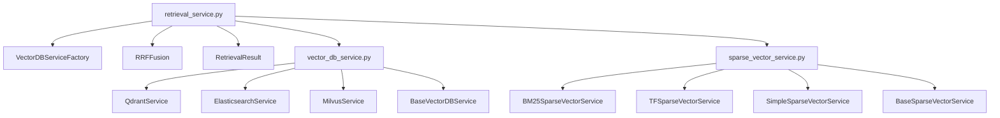
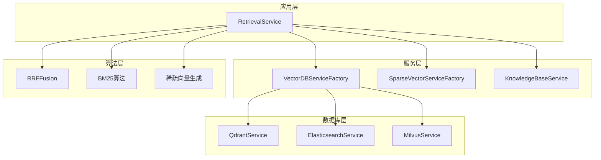
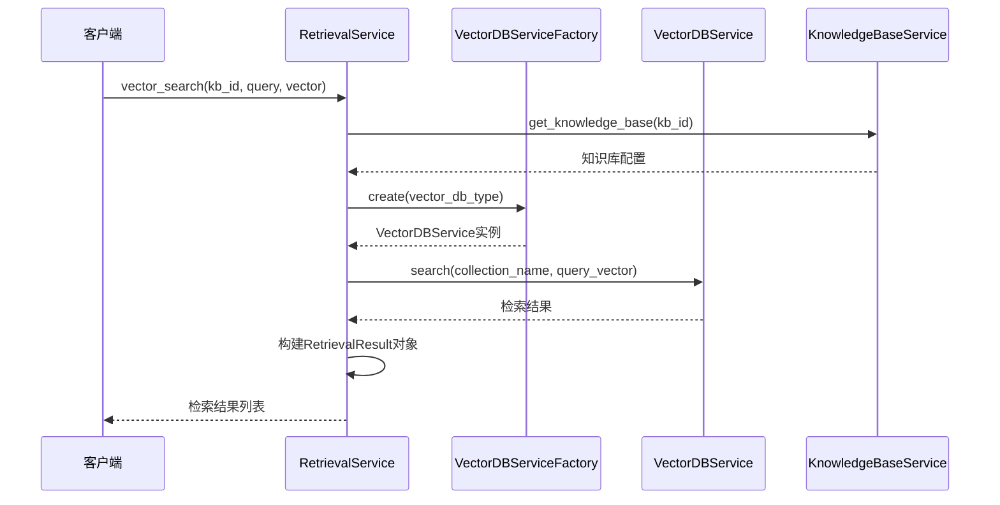
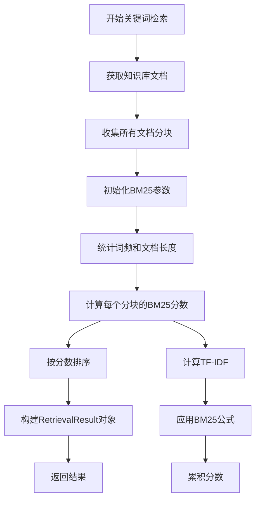
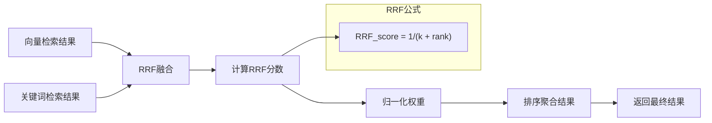
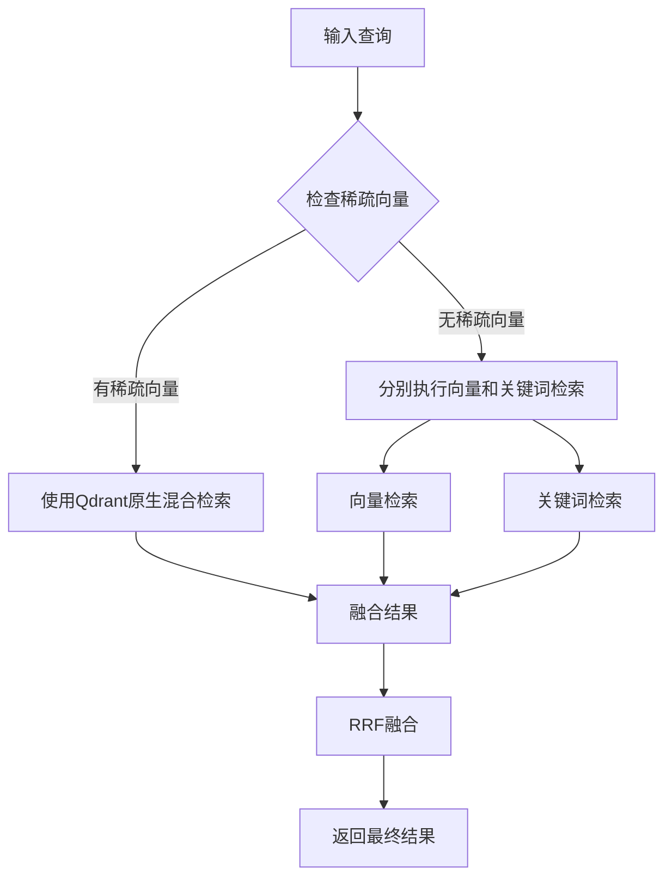
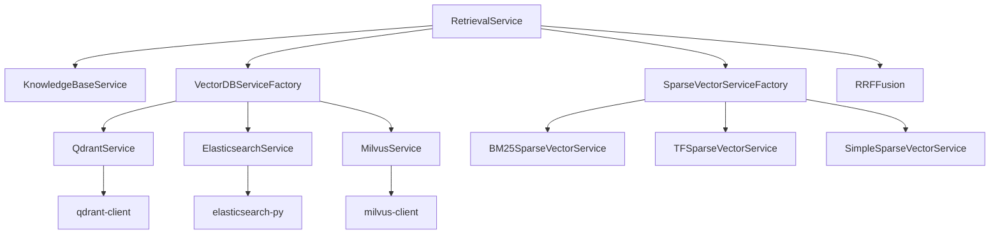

# 检索服务

<cite>
**本文档中引用的文件**
- [retrieval_service.py](file://backend/app/services/retrieval_service.py)
- [vector_db_service.py](file://backend/app/services/vector_db_service.py)
- [sparse_vector_service.py](file://backend/app/services/sparse_vector_service.py)
- [knowledge_base.py](file://backend/app/models/knowledge_base.py)
</cite>

## 目录
1. [简介](#简介)
2. [项目结构](#项目结构)
3. [核心组件](#核心组件)
4. [架构概览](#架构概览)
5. [详细组件分析](#详细组件分析)
6. [依赖关系分析](#依赖关系分析)
7. [性能考虑](#性能考虑)
8. [故障排除指南](#故障排除指南)
9. [结论](#结论)

## 简介

RAG-Studio的检索服务是一个高度模块化的向量检索系统，提供了多种检索策略和高级融合算法。该系统支持向量检索、关键词检索、混合检索，并实现了先进的RRF（Reciprocal Rank Fusion）融合算法，能够有效整合不同检索方式的结果。

检索服务的核心价值在于：
- **多数据库支持**：兼容Qdrant、Elasticsearch、Milvus等多种向量数据库
- **混合检索能力**：结合稠密向量和稀疏向量的优势
- **智能融合算法**：基于RRF的先进结果融合
- **灵活的扩展性**：支持自定义检索器和融合策略

## 项目结构

检索服务位于RAG-Studio项目的`backend/app/services/`目录下，主要包含以下核心文件：

**图表来源**
- [retrieval_service.py](file://backend/app/services/retrieval_service.py#L1-L50)
- [vector_db_service.py](file://backend/app/services/vector_db_service.py#L1-L50)
- [sparse_vector_service.py](file://backend/app/services/sparse_vector_service.py#L1-L50)

**章节来源**
- [retrieval_service.py](file://backend/app/services/retrieval_service.py#L1-L100)
- [vector_db_service.py](file://backend/app/services/vector_db_service.py#L1-L100)

## 核心组件

### RetrievalService 类

`RetrievalService`是检索服务的核心控制器，提供了统一的检索接口。它支持四种主要的检索模式：

1. **向量检索** (`vector_search`)：基于稠密向量的相似度搜索
2. **关键词检索** (`keyword_search`)：基于BM25算法的关键词匹配
3. **混合检索** (`hybrid_search`)：结合向量和关键词检索
4. **高级混合检索** (`advanced_hybrid_search`)：支持多种检索方式的组合

### RRFFusion 类

`RRFFusion`实现了Reciprocal Rank Fusion算法，这是一种高效的检索结果融合方法。其核心数学公式为：

$$RRF\_score = \frac{1}{k + rank}$$

其中：
- $k$ 是融合参数，通常设置为60
- $rank$ 是文档在各个检索结果列表中的排名位置

### RetrievalResult 数据类

`RetrievalResult`是检索结果的标准数据结构，包含以下关键字段：

| 字段名 | 类型 | 描述 |
|--------|------|------|
| doc_id | str | 文档唯一标识符 |
| chunk_id | str | 分块唯一标识符 |
| content | str | 分块内容 |
| score | float | 检索分数 |
| rank | int | 在结果列表中的排名 |
| source | str | 检索来源（"vector"、"keyword"、"hybrid"） |
| metadata | Dict | 附加元数据信息 |

**章节来源**
- [retrieval_service.py](file://backend/app/services/retrieval_service.py#L21-L60)

## 架构概览

检索服务采用分层架构设计，确保了良好的可扩展性和维护性：

**图表来源**
- [retrieval_service.py](file://backend/app/services/retrieval_service.py#L136-L142)
- [vector_db_service.py](file://backend/app/services/vector_db_service.py#L1089-L1111)

## 详细组件分析

### 向量检索实现

向量检索通过`vector_search`方法实现，该方法与VectorDBServiceFactory协作，支持多种向量数据库：

**图表来源**
- [retrieval_service.py](file://backend/app/services/retrieval_service.py#L143-L215)

#### Qdrant集成特性

QdrantService提供了丰富的功能特性：

- **命名向量支持**：支持多个向量字段的并行检索
- **稀疏向量检索**：原生支持稀疏向量查询
- **混合检索**：结合稠密和稀疏向量的融合检索
- **高级配置**：支持HNSW索引、量化压缩等优化选项

**章节来源**
- [retrieval_service.py](file://backend/app/services/retrieval_service.py#L143-L215)
- [vector_db_service.py](file://backend/app/services/vector_db_service.py#L203-L300)

### 关键词检索实现

关键词检索基于BM25算法，通过`keyword_search`方法实现：

**图表来源**
- [retrieval_service.py](file://backend/app/services/retrieval_service.py#L217-L329)

#### BM25算法详解

BM25算法的核心公式为：

$$score = IDF \times normalized\_TF$$

其中：
- $normalized\_TF = \frac{TF \times (k1 + 1)}{TF + k1 \times (1 - b + b \times \frac{doc\_length}{avg\_doc\_length})}$
- $IDF = \ln\left(\frac{N - df + 0.5}{df + 0.5} + 1\right)$

**章节来源**
- [retrieval_service.py](file://backend/app/services/retrieval_service.py#L718-L784)

### 混合检索与RRF融合

混合检索结合了向量检索和关键词检索的优势，通过RRF算法实现智能融合：

**图表来源**
- [retrieval_service.py](file://backend/app/services/retrieval_service.py#L44-L133)

#### RRF算法数学原理

RRF算法的核心思想是将不同检索结果的排名位置转化为分数，然后进行加权求和：

1. **分数计算**：对于每个结果，计算 $RRF\_score = \frac{1}{k + rank}$
2. **权重应用**：根据检索方式的重要性分配权重
3. **分数聚合**：将来自不同源的分数相加
4. **最终排序**：按照聚合分数降序排列

**章节来源**
- [retrieval_service.py](file://backend/app/services/retrieval_service.py#L44-L133)

### 高级混合检索

`advanced_hybrid_search`方法提供了更灵活的混合检索策略：

**图表来源**
- [retrieval_service.py](file://backend/app/services/retrieval_service.py#L538-L656)

**章节来源**
- [retrieval_service.py](file://backend/app/services/retrieval_service.py#L538-L656)

### 稀疏向量生成服务

稀疏向量服务提供了多种生成方法：

| 方法 | 算法 | 适用场景 | 性能特点 |
|------|------|----------|----------|
| BM25 | BM25算法 | 结构化文档检索 | 高精度，需要语料库统计 |
| TF-IDF | TF-IDF算法 | 传统信息检索 | 中等精度，快速计算 |
| Simple | 词频统计 | 快速原型开发 | 最高效率，基础效果 |
| SPLADE | 神经网络模型 | 高质量检索 | 最高质量，计算复杂 |

**章节来源**
- [sparse_vector_service.py](file://backend/app/services/sparse_vector_service.py#L51-L200)

## 依赖关系分析

检索服务的依赖关系体现了清晰的分层架构：

**图表来源**
- [retrieval_service.py](file://backend/app/services/retrieval_service.py#L1-L20)
- [vector_db_service.py](file://backend/app/services/vector_db_service.py#L1-L30)

### 外部依赖管理

系统对外部依赖的管理策略：

1. **可选依赖**：Qdrant、Elasticsearch、Milvus客户端作为可选依赖
2. **版本兼容**：确保与不同版本的客户端库兼容
3. **优雅降级**：当某些功能不可用时提供替代方案

**章节来源**
- [vector_db_service.py](file://backend/app/services/vector_db_service.py#L1-L30)

## 性能考虑

### 检索性能优化

1. **预取策略**：混合检索中使用预取机制减少延迟
2. **批量操作**：支持批量插入和检索操作
3. **缓存机制**：对频繁访问的稀疏向量进行缓存
4. **索引优化**：利用向量数据库的索引特性加速检索

### 内存管理

1. **流式处理**：大数据集采用流式处理避免内存溢出
2. **结果截断**：预先获取更多候选结果再进行融合
3. **对象复用**：合理复用RetrievalResult对象

### 并发处理

1. **异步操作**：所有数据库操作采用异步模式
2. **并行检索**：向量检索和关键词检索可以并行执行
3. **资源池化**：数据库连接采用连接池管理

## 故障排除指南

### 常见问题诊断

#### 向量检索失败

**症状**：向量检索返回空结果或抛出异常

**排查步骤**：
1. 检查知识库配置是否正确
2. 验证向量数据库连接状态
3. 确认向量维度匹配
4. 检查集合是否存在

#### RRF融合效果不佳

**症状**：融合后的结果质量下降

**解决方案**：
1. 调整权重参数
2. 检查k参数设置（推荐60）
3. 分析各检索源的质量分布

#### 稀疏向量生成异常

**症状**：稀疏向量生成失败或结果异常

**排查方法**：
1. 检查分词器配置
2. 验证语料库统计信息
3. 确认算法参数设置

**章节来源**
- [retrieval_service.py](file://backend/app/services/retrieval_service.py#L164-L215)
- [sparse_vector_service.py](file://backend/app/services/sparse_vector_service.py#L109-L155)

## 结论

RAG-Studio的检索服务展现了现代信息检索系统的最佳实践。通过模块化设计、先进的融合算法和灵活的扩展机制，该系统能够满足各种复杂的检索需求。

### 主要优势

1. **技术先进性**：采用RRF等前沿融合算法
2. **架构灵活性**：支持多种数据库和检索策略
3. **性能优化**：多层次的性能优化措施
4. **易于扩展**：清晰的接口设计便于功能扩展

### 发展方向

1. **神经网络融合**：探索基于深度学习的融合方法
2. **实时优化**：动态调整权重参数提升效果
3. **多模态支持**：扩展对图像、音频等多模态数据的支持
4. **智能路由**：根据查询特征自动选择最优检索策略

该检索服务为构建高质量的RAG系统奠定了坚实的技术基础，其设计理念和实现方式值得在类似项目中借鉴和应用。