# 混合检索

<cite>
**本文档中引用的文件**
- [retrieval_service.py](file://backend/app/services/retrieval_service.py)
- [sparse_vector_service.py](file://backend/app/services/sparse_vector_service.py)
- [vector_db_service.py](file://backend/app/services/vector_db_service.py)
- [debug_pipeline.py](file://backend/app/controllers/debug_pipeline.py)
- [test_sparse_vector_simple.py](file://test_sparse_vector_simple.py)
</cite>

## 目录
1. [简介](#简介)
2. [系统架构概览](#系统架构概览)
3. [核心组件分析](#核心组件分析)
4. [混合检索模式详解](#混合检索模式详解)
5. [稀疏向量生成机制](#稀疏向量生成机制)
6. [融合策略对比](#融合策略对比)
7. [Qdrant原生混合检索](#qdrant原生混合检索)
8. [扩展接口设计](#扩展接口设计)
9. [性能优化建议](#性能优化建议)
10. [故障排除指南](#故障排除指南)

## 简介

RAG-Studio的混合检索系统是一个高度灵活的多模态检索框架，支持向量检索、关键词检索和稀疏向量检索的智能融合。系统提供两种主要的混合检索模式：基础的hybrid_search和高级的advanced_hybrid_search，同时支持Qdrant原生混合检索能力。

混合检索的核心价值在于通过融合不同类型的检索信号，克服单一检索方式的局限性，提供更准确、更全面的检索结果。系统采用RRF（Reciprocal Rank Fusion）和DBSF（Differentiable Bayesian Score Fusion）两种融合策略，并提供可扩展的接口设计，支持自定义融合算法。

## 系统架构概览

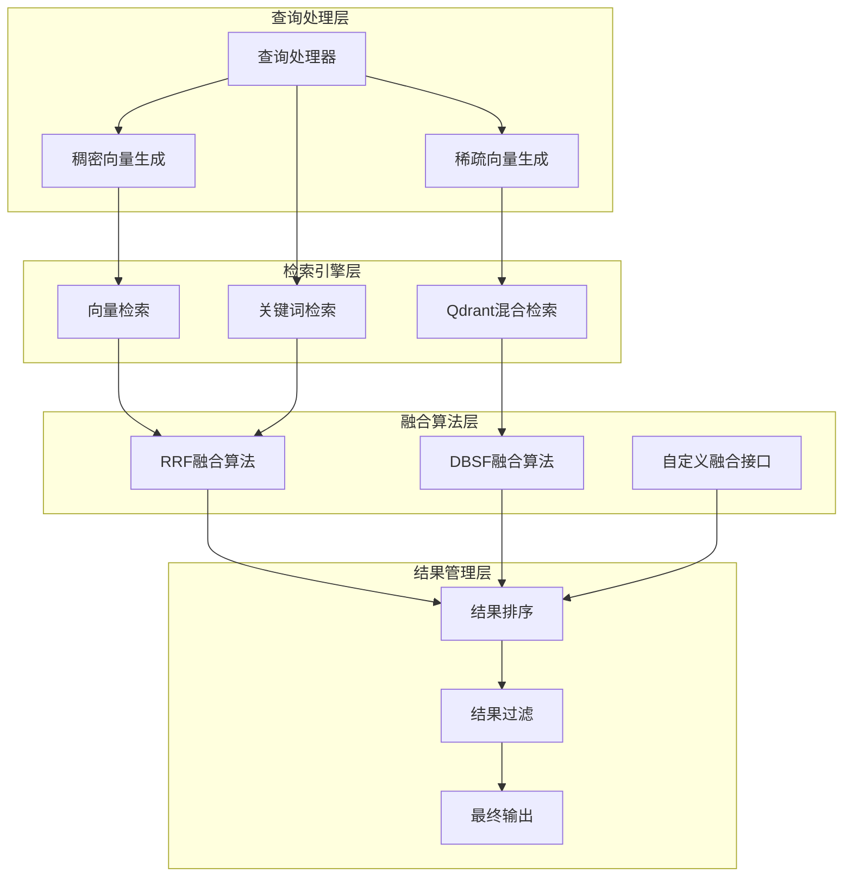

**图表来源**
- [retrieval_service.py](file://backend/app/services/retrieval_service.py#L44-L133)
- [vector_db_service.py](file://backend/app/services/vector_db_service.py#L654-L761)

## 核心组件分析

### RetrievalService类

RetrievalService是混合检索系统的核心服务类，负责协调各种检索操作和融合策略。

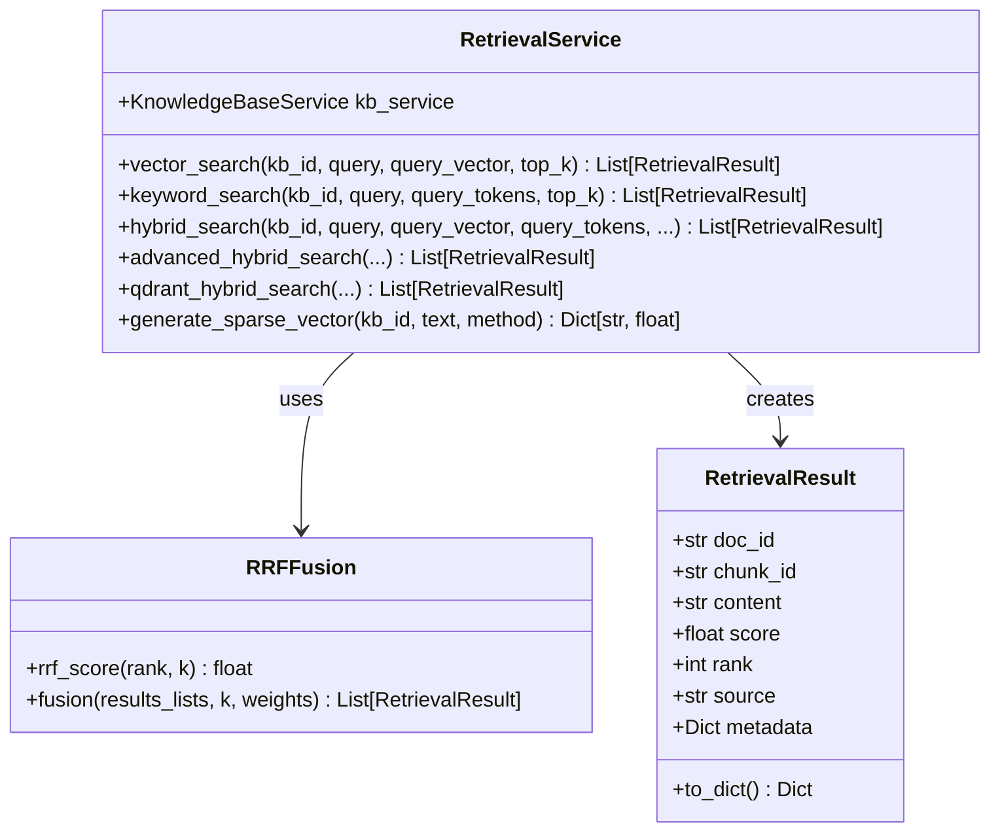

**图表来源**
- [retrieval_service.py](file://backend/app/services/retrieval_service.py#L136-L854)

### 稀疏向量服务架构

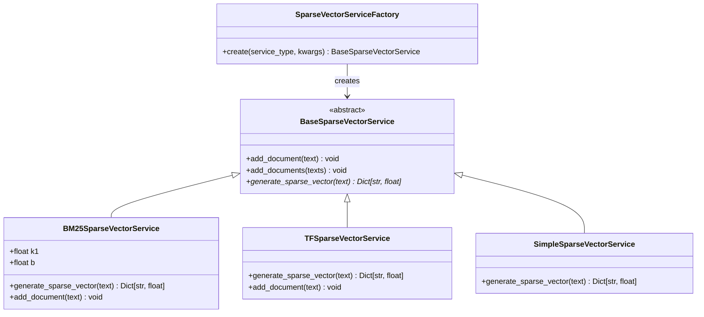

**图表来源**
- [sparse_vector_service.py](file://backend/app/services/sparse_vector_service.py#L14-L331)

**章节来源**
- [retrieval_service.py](file://backend/app/services/retrieval_service.py#L136-L854)
- [sparse_vector_service.py](file://backend/app/services/sparse_vector_service.py#L14-L331)

## 混合检索模式详解

### hybrid_search基础混合检索

hybrid_search方法实现了传统的向量检索与关键词检索的融合，适用于大多数混合检索场景。

#### 核心流程

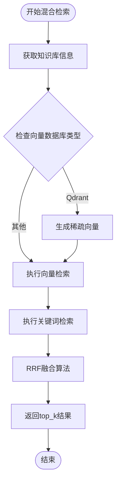

**图表来源**
- [retrieval_service.py](file://backend/app/services/retrieval_service.py#L458-L536)

#### 参数配置

| 参数 | 类型 | 默认值 | 说明 |
|------|------|--------|------|
| vector_weight | float | 0.7 | 向量检索权重 |
| keyword_weight | float | 0.3 | 关键词检索权重 |
| rrf_k | int | 60 | RRF算法参数k |
| top_k | int | 10 | 返回结果数量 |

#### 适用场景

- **通用混合检索**：当需要平衡向量语义理解和关键词精确匹配时
- **资源受限环境**：不需要复杂的稀疏向量配置
- **快速原型开发**：提供开箱即用的混合检索能力

### advanced_hybrid_search高级混合检索

advanced_hybrid_search支持多种检索方式的组合，包括稠密向量、稀疏向量和关键词检索的三路融合。

#### 检索策略选择

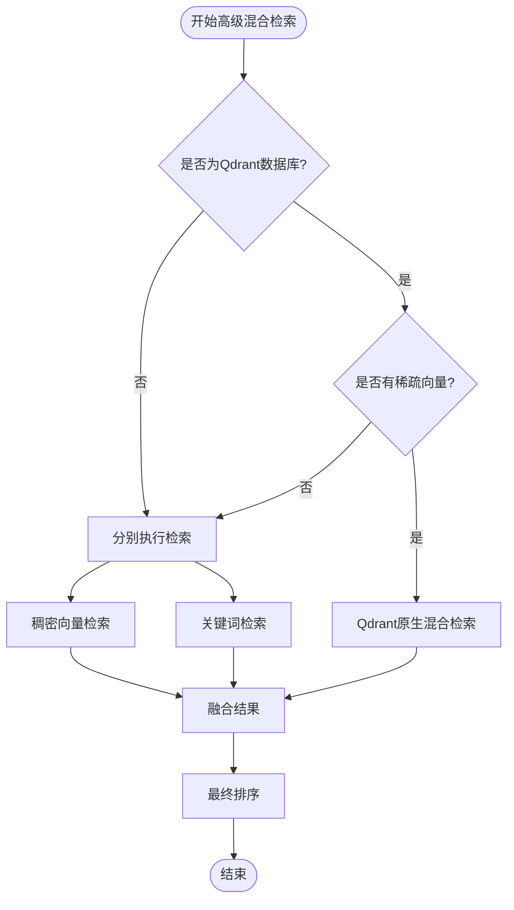

**图表来源**
- [retrieval_service.py](file://backend/app/services/retrieval_service.py#L538-L655)

#### 权重配置策略

| 检索方式 | 默认权重 | 适用场景 |
|----------|----------|----------|
| 稠密向量 | 0.5 | 语义相似度匹配 |
| 稀疏向量 | 0.3 | 关键词相关性匹配 |
| 关键词检索 | 0.2 | 精确匹配需求 |

**章节来源**
- [retrieval_service.py](file://backend/app/services/retrieval_service.py#L458-L655)

## 稀疏向量生成机制

### BM25算法实现

BM25（Best Matching 25）是混合检索中最常用的稀疏向量生成算法，基于词频和逆文档频率计算。

#### BM25数学公式

对于查询词项 \(t\) 和文档 \(D\)，BM25分数计算公式为：

\[
BM25(t,D) = IDF(t) \times \frac{f(t,D) \times (k_1 + 1)}{f(t,D) + k_1 \times (1 - b + b \times \frac{|D|}{avgdl})}
\]

其中：
- \(IDF(t)\) = \(\ln\left(\frac{N - df(t) + 0.5}{df(t) + 0.5} + 1\right)\)
- \(f(t,D)\) 是词项 \(t\) 在文档 \(D\) 中的词频
- \(k_1\) 控制词频饱和度（默认1.5）
- \(b\) 控制文档长度归一化（默认0.75）
- \(N\) 是总文档数
- \(df(t)\) 是包含词项 \(t\) 的文档数
- \(|D|\) 是文档长度
- \(avgdl\) 是平均文档长度

#### BM25稀疏向量服务

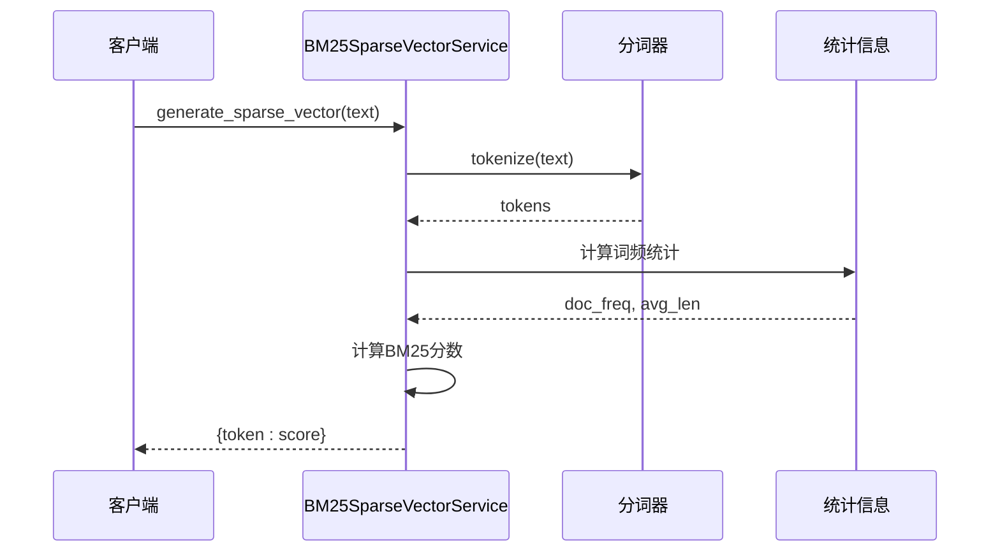

**图表来源**
- [sparse_vector_service.py](file://backend/app/services/sparse_vector_service.py#L99-L156)

### 其他稀疏向量生成方法

#### TF-IDF算法

TF-IDF（Term Frequency-Inverse Document Frequency）结合词频和逆文档频率，适用于关键词提取场景。

#### 简单稀疏向量

直接使用词频作为权重，计算简单但有效，在某些特定场景下表现良好。

#### 稀疏向量服务工厂

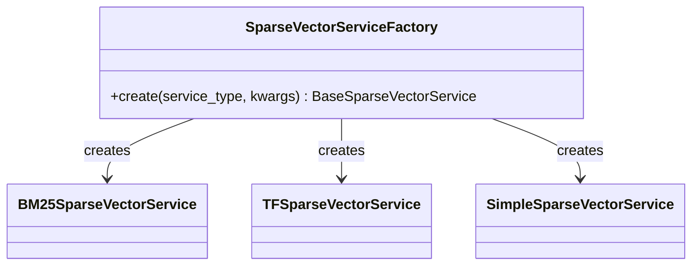

**图表来源**
- [sparse_vector_service.py](file://backend/app/services/sparse_vector_service.py#L272-L301)

**章节来源**
- [sparse_vector_service.py](file://backend/app/services/sparse_vector_service.py#L51-L156)
- [sparse_vector_service.py](file://backend/app/services/sparse_vector_service.py#L272-L301)

## 融合策略对比

### RRF（Reciprocal Rank Fusion）融合算法

RRF是混合检索中最常用的融合策略，具有计算简单、效果稳定的特点。

#### RRF算法原理

RRF的核心思想是将不同检索结果的排名位置转换为分数，然后进行加权求和。

#### RRF分数计算

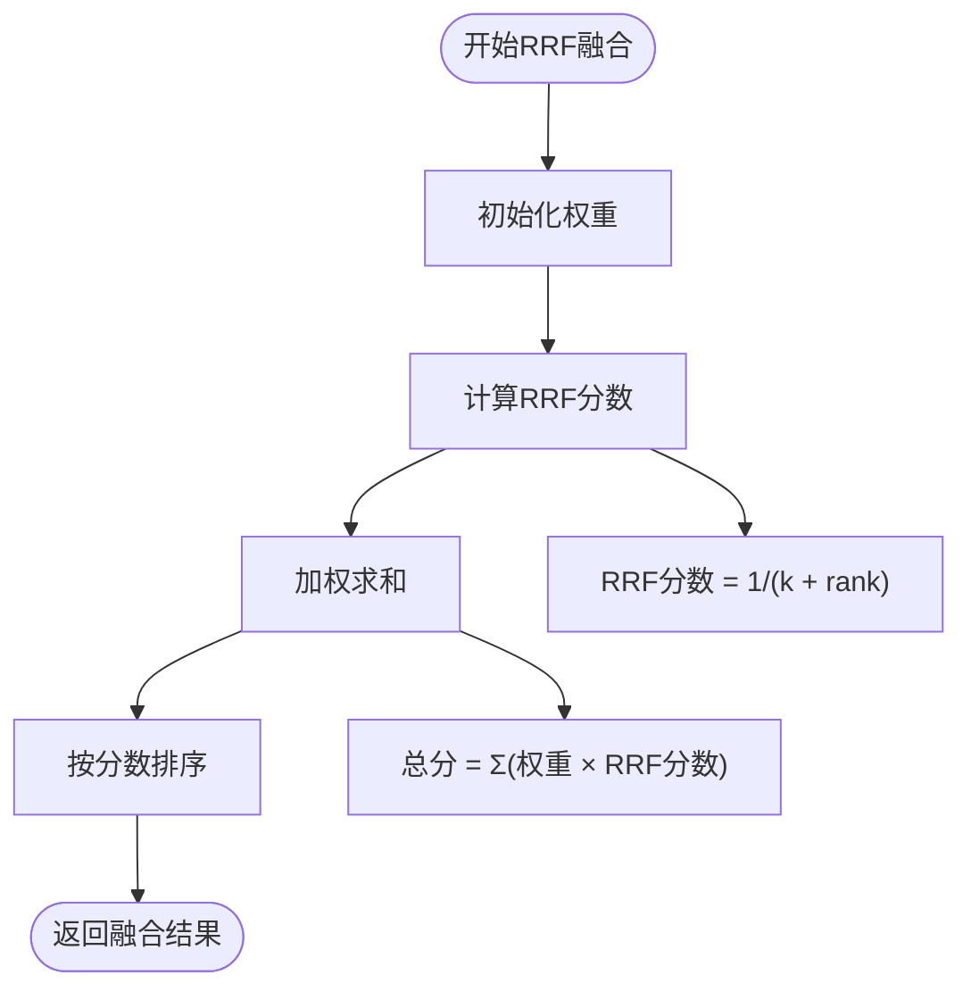

**图表来源**
- [retrieval_service.py](file://backend/app/services/retrieval_service.py#L44-L133)

#### RRF参数说明

| 参数 | 默认值 | 作用 | 调优建议 |
|------|--------|------|----------|
| k | 60 | 控制排名衰减速度 | 较小值（30-40）对高排名敏感，较大值（80-100）对低排名友好 |
| 权重 | 均等 | 平衡不同检索方式的重要性 | 根据业务需求调整，如向量检索权重可设为0.6-0.8 |

### DBSF（Differentiable Bayesian Score Fusion）融合算法

DBSF是一种基于贝叶斯理论的融合策略，能够更好地处理不同检索方式的不确定性。

#### DBSF优势

- **概率解释**：提供可解释的概率分数
- **不确定性建模**：能够处理检索结果的置信度差异
- **动态权重**：根据检索结果分布自动调整权重

#### DBSF适用场景

- **多源异构数据**：融合来自不同数据源的检索结果
- **质量差异显著**：不同检索方式质量差异较大的场景
- **需要可解释性**：需要理解融合过程和结果的业务场景

### 融合策略选择指南

| 场景 | 推荐策略 | 原因 |
|------|----------|------|
| 通用混合检索 | RRF | 简单高效，效果稳定 |
| 多源数据融合 | DBSF | 更好的不确定性建模 |
| 快速原型开发 | RRF | 开发成本低，易于调优 |
| 生产环境部署 | RRF或DBSF | 根据具体需求选择 |

**章节来源**
- [retrieval_service.py](file://backend/app/services/retrieval_service.py#L44-L133)

## Qdrant原生混合检索

### Qdrant混合检索能力

Qdrant原生混合检索是系统中最高效的混合检索方式，直接利用Qdrant数据库的原生能力。

#### Qdrant混合检索流程

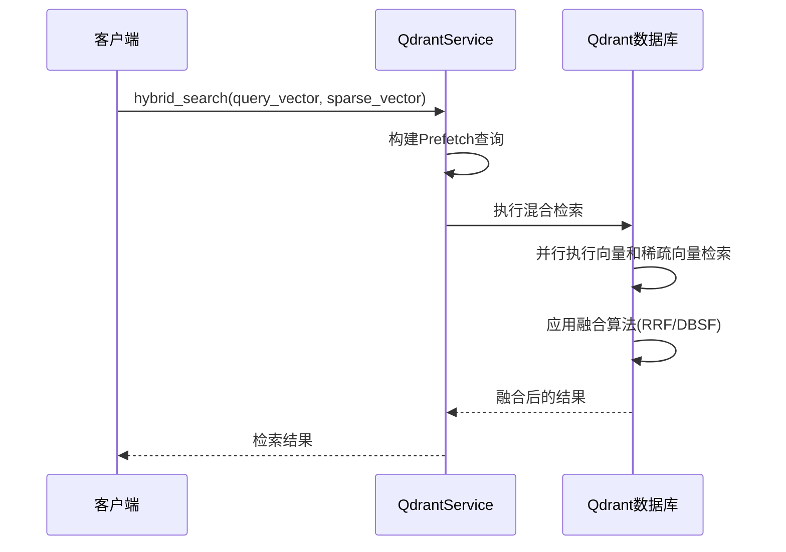

**图表来源**
- [vector_db_service.py](file://backend/app/services/vector_db_service.py#L654-L761)

#### Qdrant混合检索配置

| 参数 | 类型 | 说明 |
|------|------|------|
| query_vector | List[float] | 稠密查询向量 |
| query_sparse_vector | Dict | 稀疏查询向量（indices和values） |
| fusion | str | 融合方法（"rrf"或"dbsf"） |
| top_k | int | 返回结果数量 |
| score_threshold | float | 分数阈值 |

#### Qdrant混合检索优势

- **性能优化**：数据库层面的并行处理
- **内存效率**：减少网络传输和中间结果存储
- **实时融合**：在数据库内部完成融合计算
- **可扩展性**：支持大规模数据集的混合检索

### 稀疏向量格式转换

Qdrant混合检索需要特定的稀疏向量格式，系统提供自动转换功能。

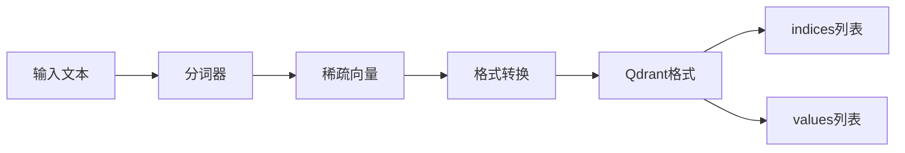

**图表来源**
- [sparse_vector_service.py](file://backend/app/services/sparse_vector_service.py#L304-L331)

**章节来源**
- [vector_db_service.py](file://backend/app/services/vector_db_service.py#L654-L761)
- [sparse_vector_service.py](file://backend/app/services/sparse_vector_service.py#L304-L331)

## 扩展接口设计

### 自定义融合策略接口

系统提供灵活的扩展接口，支持开发者实现自定义融合算法。

#### 融合策略接口规范

```python
class BaseFusionStrategy(ABC):
    @abstractmethod
    def fuse(self, results_lists: List[List[RetrievalResult]], 
             weights: Optional[List[float]] = None) -> List[RetrievalResult]:
        """融合多个检索结果列表"""
        pass
    
    @abstractmethod
    def get_name(self) -> str:
        """获取融合策略名称"""
        pass
```

#### 自定义融合策略实现示例

```python
class CustomFusionStrategy(BaseFusionStrategy):
    def __init__(self, alpha: float = 0.5):
        self.alpha = alpha  # 控制不同策略的权重
    
    def fuse(self, results_lists: List[List[RetrievalResult]], 
             weights: Optional[List[float]] = None) -> List[RetrievalResult]:
        # 实现自定义融合逻辑
        pass
    
    def get_name(self) -> str:
        return "custom_fusion"
```

### 扩展接口设计原则

#### 1. 插件化架构

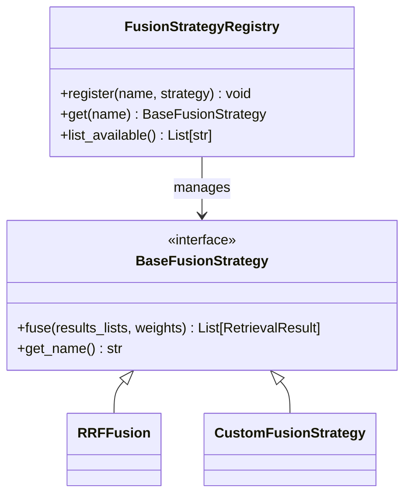

#### 2. 配置驱动

支持通过配置文件或运行时参数动态切换融合策略：

```yaml
fusion_strategies:
  default:
    type: rrf
    params:
      k: 60
      weights: [0.7, 0.3]
  
  advanced:
    type: custom
    params:
      alpha: 0.5
      method: bayesian
```

#### 3. 性能监控

```python
class MonitoredFusionStrategy(BaseFusionStrategy):
    def __init__(self, strategy: BaseFusionStrategy):
        self.strategy = strategy
        self.metrics = {}
    
    def fuse(self, results_lists: List[List[RetrievalResult]], 
             weights: Optional[List[float]] = None) -> List[RetrievalResult]:
        start_time = time.time()
        
        try:
            result = self.strategy.fuse(results_lists, weights)
            self.metrics['success'] = True
            return result
        except Exception as e:
            self.metrics['success'] = False
            self.metrics['error'] = str(e)
            raise
        finally:
            self.metrics['duration'] = time.time() - start_time
```

### API扩展接口

#### RESTful API设计

```python
@router.post("/fusion/custom")
async def custom_fusion(
    results_lists: List[List[Dict[str, Any]]],
    strategy_type: str = Query(..., description="融合策略类型"),
    strategy_params: Optional[Dict[str, Any]] = None
):
    """自定义融合策略接口"""
    # 实现自定义融合逻辑
    pass
```

#### WebSocket流式融合

```python
@router.websocket("/fusion/stream")
async def stream_fusion(websocket: WebSocket):
    """流式融合结果接口"""
    async for message in websocket:
        # 处理流式融合请求
        pass
```

**章节来源**
- [retrieval_service.py](file://backend/app/services/retrieval_service.py#L44-L133)

## 性能优化建议

### 检索性能优化

#### 1. 向量检索优化

| 优化策略 | 实现方法 | 性能提升 |
|----------|----------|----------|
| 向量量化 | 使用Qdrant的量化功能 | 内存减少4-32倍 |
| 索引优化 | 调整HNSW参数 | 检索速度提升2-5倍 |
| 批量处理 | 合并多个查询 | 减少网络开销50%+ |

#### 2. 关键词检索优化

```python
# 优化的关键词检索实现
class OptimizedKeywordSearch:
    def __init__(self, index_cache_size: int = 1000):
        self.index_cache = {}
        self.cache_size = index_cache_size
    
    def search_with_cache(self, query_tokens: List[str]) -> List[RetrievalResult]:
        # 缓存热门查询结果
        cache_key = tuple(sorted(query_tokens))
        
        if cache_key in self.index_cache:
            return self.index_cache[cache_key]
        
        # 执行搜索并缓存结果
        results = self.execute_search(query_tokens)
        
        if len(self.index_cache) >= self.cache_size:
            # 清理最旧的缓存
            oldest_key = next(iter(self.index_cache))
            del self.index_cache[oldest_key]
        
        self.index_cache[cache_key] = results
        return results
```

### 融合算法优化

#### 1. RRF算法优化

```python
class OptimizedRRF:
    @staticmethod
    def rrf_score_optimized(rank: int, k: int = 60) -> float:
        """优化的RRF分数计算，使用预计算表"""
        # 使用查找表替代实时计算
        if rank <= 1000:  # 仅对常见排名范围预计算
            return RRF_PRECOMPUTE_TABLE[rank]
        return 1.0 / (k + rank)
```

#### 2. 内存优化

```python
class MemoryEfficientFusion:
    def __init__(self, max_memory_mb: int = 100):
        self.max_memory = max_memory_mb * 1024 * 1024
        self.current_memory = 0
    
    def fuse_efficiently(self, results_lists: List[List[RetrievalResult]]) -> List[RetrievalResult]:
        # 流式处理，避免大量内存占用
        for results in results_lists:
            for result in results:
                yield result
                self.current_memory += sys.getsizeof(result)
                
                if self.current_memory > self.max_memory:
                    # 触发垃圾回收
                    gc.collect()
                    self.current_memory = 0
```

### 系统级优化

#### 1. 并行处理

```python
async def parallel_hybrid_search(
    kb_id: str,
    query: str,
    query_vector: List[float],
    query_tokens: List[str]
) -> List[RetrievalResult]:
    """并行执行多种检索方式"""
    
    tasks = [
        asyncio.create_task(vector_search(kb_id, query, query_vector)),
        asyncio.create_task(keyword_search(kb_id, query, query_tokens)),
        asyncio.create_task(sparse_search(kb_id, query))
    ]
    
    vector_results, keyword_results, sparse_results = await asyncio.gather(*tasks)
    
    # 并行融合
    return await fuse_results_parallel([
        vector_results, keyword_results, sparse_results
    ])
```

#### 2. 缓存策略

```python
class HybridSearchCache:
    def __init__(self, ttl: int = 300):  # 5分钟TTL
        self.cache = {}
        self.ttl = ttl
    
    def get_cached_result(self, query_hash: str) -> Optional[List[RetrievalResult]]:
        if query_hash in self.cache:
            cached = self.cache[query_hash]
            if time.time() - cached['timestamp'] < self.ttl:
                return cached['results']
        return None
    
    def cache_result(self, query_hash: str, results: List[RetrievalResult]):
        self.cache[query_hash] = {
            'results': results,
            'timestamp': time.time()
        }
```

## 故障排除指南

### 常见问题及解决方案

#### 1. 混合检索结果质量不佳

**症状**：检索结果相关性差，重复率高

**排查步骤**：
```python
# 1. 检查权重配置
print(f"向量权重: {vector_weight}, 关键词权重: {keyword_weight}")

# 2. 分别测试各检索方式
vector_results = await vector_search(...)
keyword_results = await keyword_search(...)
print(f"向量相关性: {calculate_correlation(vector_results)}")
print(f"关键词相关性: {calculate_correlation(keyword_results)}")

# 3. 检查稀疏向量质量
sparse_vector = await generate_sparse_vector(...)
print(f"稀疏向量密度: {len(sparse_vector) / total_tokens}")
```

**解决方案**：
- 调整权重比例，增加高质量检索方式的权重
- 优化稀疏向量生成参数
- 增加检索结果去重逻辑

#### 2. Qdrant混合检索失败

**症状**：Qdrant混合检索抛出异常

**排查步骤**：
```python
# 1. 检查Qdrant连接状态
try:
    client = QdrantClient(host, port)
    health = client.health_check()
    print(f"Qdrant健康状态: {health}")
except Exception as e:
    print(f"Qdrant连接失败: {e}")

# 2. 检查向量格式
print(f"稠密向量维度: {len(query_vector)}")
print(f"稀疏向量格式: {query_sparse_vector}")
```

**解决方案**：
- 确保Qdrant服务正常运行
- 验证向量格式符合Qdrant要求
- 检查集合配置是否正确

#### 3. 性能问题

**症状**：混合检索响应时间过长

**性能分析**：
```python
import time

class PerformanceMonitor:
    def __init__(self):
        self.timings = {}
    
    async def timed_hybrid_search(self, *args, **kwargs):
        start_total = time.time()
        
        # 向量检索
        start_vector = time.time()
        vector_results = await vector_search(...)
        self.timings['vector'] = time.time() - start_vector
        
        # 关键词检索
        start_keyword = time.time()
        keyword_results = await keyword_search(...)
        self.timings['keyword'] = time.time() - start_keyword
        
        # 融合
        start_fusion = time.time()
        fused_results = await fuse_results(...)
        self.timings['fusion'] = time.time() - start_fusion
        
        self.timings['total'] = time.time() - start_total
        return fused_results
```

**优化建议**：
- 使用并行处理减少总时间
- 启用结果缓存
- 优化稀疏向量生成算法

### 调试工具

#### 1. 检索结果可视化

```python
class SearchResultVisualizer:
    def plot_rank_distribution(self, results: List[RetrievalResult]):
        """绘制排名分布图"""
        ranks = [r.rank for r in results]
        plt.hist(ranks, bins=20)
        plt.title('检索结果排名分布')
        plt.xlabel('排名')
        plt.ylabel('数量')
    
    def plot_score_distribution(self, results: List[RetrievalResult]):
        """绘制分数分布图"""
        scores = [r.score for r in results]
        plt.boxplot(scores)
        plt.title('检索结果分数分布')
```

#### 2. 融合效果评估

```python
class FusionEvaluator:
    def evaluate_fusion(self, original_results: List[List[RetrievalResult]], 
                       fused_results: List[RetrievalResult]) -> Dict[str, float]:
        """评估融合效果"""
        metrics = {}
        
        # 排序稳定性
        metrics['stability'] = self.calculate_stability(original_results, fused_results)
        
        # 多样性
        metrics['diversity'] = self.calculate_diversity(fused_results)
        
        # 相关性
        metrics['relevance'] = self.calculate_relevance(fused_results)
        
        return metrics
```

**章节来源**
- [retrieval_service.py](file://backend/app/services/retrieval_service.py#L458-L655)
- [vector_db_service.py](file://backend/app/services/vector_db_service.py#L654-L761)

## 结论

RAG-Studio的混合检索系统通过精心设计的架构和多种融合策略，为用户提供了强大而灵活的检索能力。系统的主要优势包括：

1. **多模态融合**：支持向量、关键词和稀疏向量的智能融合
2. **灵活配置**：提供多种权重配置和融合策略选择
3. **高性能**：针对不同场景优化的检索和融合算法
4. **可扩展**：模块化设计支持自定义扩展

通过合理配置和优化，混合检索系统能够在各种应用场景中提供高质量的检索结果，满足不同业务需求。开发者可以根据具体场景选择合适的混合检索模式和融合策略，充分发挥系统的潜力。