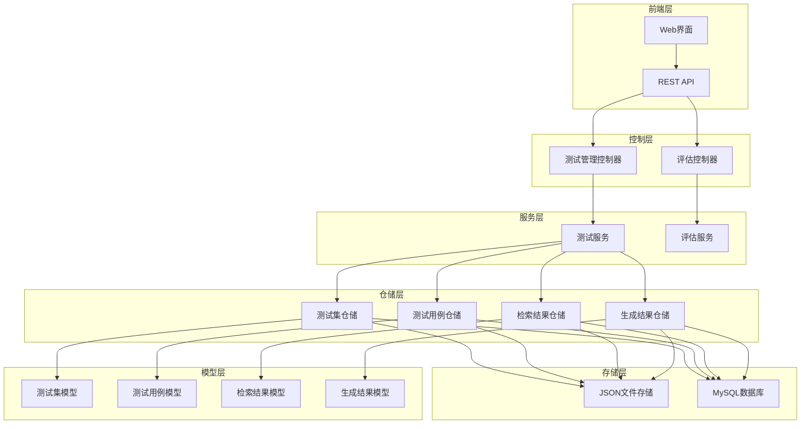
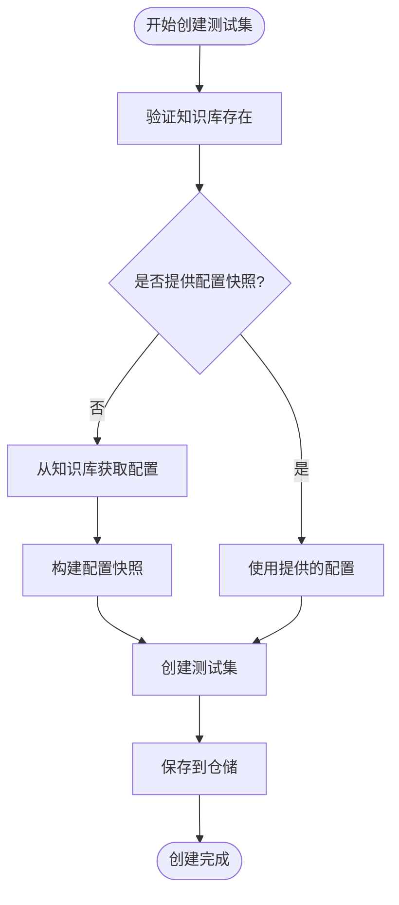
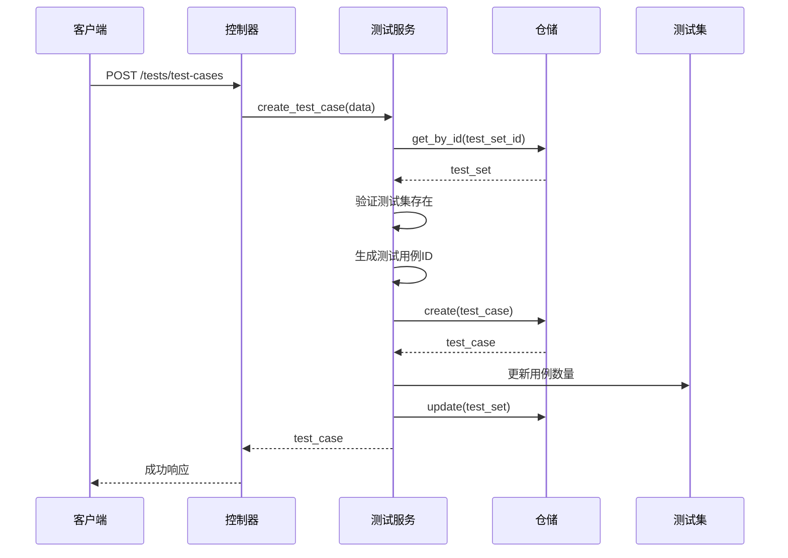
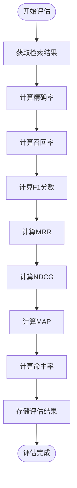

# 测试服务管理文档

<cite>
**本文档引用的文件**
- [test_service.py](file://backend/app/services/test_service.py)
- [test_management.py](file://backend/app/controllers/test_management.py)
- [test.py](file://backend/app/models/test.py)
- [test.py](file://backend/app/schemas/test.py)
- [factory.py](file://backend/app/repositories/factory.py)
- [base.py](file://backend/app/repositories/base.py)
- [json_repository.py](file://backend/app/repositories/json_repository.py)
- [README_TEST.md](file://backend/README_TEST.md)
</cite>

## 目录
1. [概述](#概述)
2. [系统架构](#系统架构)
3. [测试集管理](#测试集管理)
4. [测试用例管理](#测试用例管理)
5. [测试结果存储](#测试结果存储)
6. [评估流程集成](#评估流程集成)
7. [API接口详解](#api接口详解)
8. [扩展开发指南](#扩展开发指南)
9. [故障排查](#故障排查)

## 概述

RAG-Studio的测试服务是一个完整的测试管理系统，支持检索测试和生成测试两种类型的测试。该系统提供了测试集的创建、查询、更新和删除功能，以及测试用例的管理能力，并集成了评估指标计算和结果存储功能。

### 核心特性

- **双类型测试支持**：支持检索测试（retrieval）和生成测试（generation）
- **配置快照管理**：自动捕获知识库配置作为测试集的配置快照
- **批量操作**：支持批量创建测试用例和测试结果
- **评估指标集成**：内置多种评估指标计算方法
- **灵活的存储后端**：支持JSON文件和MySQL两种存储方式

## 系统架构



**图表来源**
- [test_management.py](file://backend/app/controllers/test_management.py#L1-L50)
- [test_service.py](file://backend/app/services/test_service.py#L24-L35)
- [factory.py](file://backend/app/repositories/factory.py#L69-L90)

### 核心组件说明

1. **控制器层**：负责HTTP请求处理和响应格式化
2. **服务层**：实现业务逻辑和测试流程控制
3. **仓储层**：提供数据持久化抽象
4. **存储层**：实际的数据存储实现

**章节来源**
- [test_management.py](file://backend/app/controllers/test_management.py#L1-L534)
- [test_service.py](file://backend/app/services/test_service.py#L1-L374)

## 测试集管理

### 测试集模型结构

测试集是测试的基本组织单元，包含以下核心属性：

| 字段名 | 类型 | 描述 | 默认值 |
|--------|------|------|--------|
| id | string | 测试集唯一标识符 | 自动生成 |
| name | string | 测试集名称 | 必填，1-100字符 |
| description | string | 测试集描述 | 可选，最多500字符 |
| kb_id | string | 关联知识库ID | 必填 |
| test_type | TestType | 测试类型 | RETRIEVAL/GENERATION |
| case_count | integer | 测试用例数量 | 0 |
| kb_config | Dict | 知识库配置快照 | 空字典 |
| chunking_config | Dict | 分块策略配置 | 空字典 |
| embedding_config | Dict | 嵌入模型配置 | 空字典 |
| sparse_vector_config | Dict | 稀疏向量配置 | 空字典 |
| index_config | Dict | 索引配置 | 空字典 |

### 测试集创建流程



**图表来源**
- [test_service.py](file://backend/app/services/test_service.py#L35-L89)

### 测试集操作接口

#### 创建测试集

**接口路径**：`POST /tests/test-sets`

**请求参数**：
- `name` (string): 测试集名称
- `description` (string): 测试集描述（可选）
- `kb_id` (string): 关联知识库ID
- `test_type` (TestType): 测试类型
- `kb_config` (Dict): 知识库配置快照（可选）
- `chunking_config` (Dict): 分块策略配置（可选）

#### 查询测试集

**接口路径**：`GET /tests/test-sets`

**查询参数**：
- `kb_id` (string): 知识库ID筛选（可选）
- `test_type` (string): 测试类型筛选（可选）
- `page` (integer): 页码，默认1
- `page_size` (integer): 每页大小，默认20

#### 更新测试集

**接口路径**：`PUT /tests/test-sets/{test_set_id}`

**请求参数**：
- `name` (string): 测试集名称（可选）
- `description` (string): 测试集描述（可选）

#### 删除测试集

**接口路径**：`DELETE /tests/test-sets/{test_set_id}`

**特点**：级联删除测试集下的所有测试用例

**章节来源**
- [test_service.py](file://backend/app/services/test_service.py#L35-L140)
- [test_management.py](file://backend/app/controllers/test_management.py#L32-L239)

## 测试用例管理

### 测试用例模型结构

测试用例是具体的测试实例，包含以下核心属性：

| 字段名 | 类型 | 描述 | 默认值 |
|--------|------|------|--------|
| id | string | 测试用例唯一标识符 | 自动生成 |
| test_set_id | string | 所属测试集ID | 必填 |
| kb_id | string | 关联知识库ID | 必填 |
| query | string | 测试问题/查询 | 必填，至少1字符 |
| expected_chunks | List[string] | 期望检索到的文档分块ID列表 | 可选 |
| expected_answer | string | 期望的答案 | 可选 |
| metadata | Dict | 测试用例元数据 | 空字典 |

### 测试用例创建流程



**图表来源**
- [test_service.py](file://backend/app/services/test_service.py#L144-L165)
- [test_management.py](file://backend/app/controllers/test_management.py#L243-L278)

### 批量创建测试用例

系统支持批量创建测试用例，提高测试数据准备效率：

**接口路径**：`POST /tests/test-cases/batch`

**请求参数**：
```json
{
  "test_set_id": "ts_001",
  "test_cases_data": [
    {
      "query": "测试问题1",
      "expected_chunks": ["chunk_001", "chunk_002"],
      "expected_answer": "期望答案1",
      "metadata": {}
    }
  ]
}
```

**返回结果**：
- 成功创建的测试用例列表
- 失败记录列表（包含索引、查询内容和错误信息）

### 测试用例操作接口

#### 创建测试用例

**接口路径**：`POST /tests/test-cases`

#### 查询测试用例列表

**接口路径**：`GET /tests/test-cases`

**查询参数**：
- `test_set_id` (string): 测试集ID（必填）
- `page` (integer): 页码，默认1
- `page_size` (integer): 每页大小，默认20

#### 查询单个测试用例

**接口路径**：`GET /tests/test-cases/{test_case_id}`

#### 更新测试用例

**接口路径**：`PUT /tests/test-cases/{test_case_id}`

#### 删除测试用例

**接口路径**：`DELETE /tests/test-cases/{test_case_id}`

**章节来源**
- [test_service.py](file://backend/app/services/test_service.py#L144-L268)
- [test_management.py](file://backend/app/controllers/test_management.py#L243-L421)

## 测试结果存储

### 检索测试结果模型

检索测试结果记录检索过程中的各项指标：

| 字段名 | 类型 | 描述 | 取值范围 |
|--------|------|------|----------|
| id | string | 结果唯一标识符 | 自动生成 |
| test_case_id | string | 测试用例ID | 必填 |
| test_set_id | string | 测试集ID | 必填 |
| kb_id | string | 知识库ID | 必填 |
| query | string | 测试查询 | 必填 |
| retrieved_chunks | List[Dict] | 检索到的分块列表 | 包含chunk_id和score |
| retrieval_time | float | 检索耗时(秒) | 必填 |
| precision | float | 精确率 | 0.0-1.0 |
| recall | float | 召回率 | 0.0-1.0 |
| f1_score | float | F1分数 | 0.0-1.0 |
| mrr | float | 平均倒数排名 | 0.0-1.0 |
| map_score | float | 平均精度均值 | 0.0-1.0 |
| ndcg | float | 归一化折损累积增益 | 0.0-1.0 |
| hit_rate | float | 命中率 | 0.0-1.0 |
| status | TestStatus | 测试状态 | PENDING/RUNNING/COMPLETED/FAILED |

### 生成测试结果模型

生成测试结果记录生成过程中的各项指标：

| 字段名 | 类型 | 描述 | 取值范围 |
|--------|------|------|----------|
| id | string | 结果唯一标识符 | 自动生成 |
| test_case_id | string | 测试用例ID | 必填 |
| test_set_id | string | 测试集ID | 必填 |
| kb_id | string | 知识库ID | 必填 |
| query | string | 测试问题 | 必填 |
| retrieved_chunks | List[Dict] | 检索到的分块 | 必填 |
| generated_answer | string | 生成的答案 | 必填 |
| generation_time | float | 生成耗时(秒) | 必填 |
| relevance_score | float | 相关性分数 | 0.0-1.0 |
| coherence_score | float | 连贯性分数 | 0.0-1.0 |
| faithfulness_score | float | 忠实度分数 | 0.0-1.0 |
| llm_model | string | 使用的LLM模型 | 可选 |
| status | TestStatus | 测试状态 | PENDING/RUNNING/COMPLETED/FAILED |

### 结果查询接口

#### 检索测试结果查询

**接口路径**：`GET /tests/retrieval/results`

**查询参数**：
- `test_set_id` (string): 测试集ID（必填）
- `page` (integer): 页码，默认1
- `page_size` (integer): 每页大小，默认20

#### 生成测试结果查询

**接口路径**：`GET /tests/generation/results`

**查询参数**：
- `test_set_id` (string): 测试集ID（必填）
- `page` (integer): 页码，默认1
- `page_size` (integer): 每页大小，默认20

**章节来源**
- [test.py](file://backend/app/models/test.py#L115-L227)
- [test_management.py](file://backend/app/controllers/test_management.py#L445-L534)

## 评估流程集成

### 评估指标计算

测试服务提供了多种评估指标的计算框架，目前处于待实现状态：

#### 检索指标计算



**图表来源**
- [test_service.py](file://backend/app/services/test_service.py#L342-L372)

#### 支持的评估指标

| 指标名称 | 描述 | 计算公式 | 取值范围 |
|----------|------|----------|----------|
| Precision | 精确率 | TP/(TP+FP) | 0.0-1.0 |
| Recall | 召回率 | TP/(TP+FN) | 0.0-1.0 |
| F1 Score | F1分数 | 2×(Precision×Recall)/(Precision+Recall) | 0.0-1.0 |
| MRR | 平均倒数排名 | 1/N × Σ(1/rank_i) | 0.0-1.0 |
| MAP | 平均精度均值 | 1/N × Σ(Precision@k) | 0.0-1.0 |
| NDCG | 归一化折损累积增益 | DCG/max_DCG | 0.0-1.0 |
| Hit Rate | 命中率 | 检索到相关文档的比例 | 0.0-1.0 |

### 测试执行流程

#### 检索测试执行

**接口路径**：`POST /tests/retrieval/run`

**请求参数**：
- `test_case_id` (string): 单个测试用例ID（可选）
- `test_set_id` (string): 测试集ID（可选，二选一）
- `top_k` (integer): 检索返回的top-k数量，默认10
- `score_threshold` (float): 相似度分数阈值（可选）

#### 生成测试执行

**接口路径**：`POST /tests/generation/run`

**请求参数**：
- `test_case_id` (string): 单个测试用例ID（可选）
- `test_set_id` (string): 测试集ID（可选，二选一）
- `llm_model` (string): 使用的LLM模型（可选）

**章节来源**
- [test_service.py](file://backend/app/services/test_service.py#L272-L338)

## API接口详解

### 完整API接口列表

#### 测试集管理

| 方法 | 路径 | 描述 | 请求体 |
|------|------|------|--------|
| POST | `/tests/test-sets` | 创建测试集 | TestSetCreate |
| GET | `/tests/test-sets` | 获取测试集列表 | 查询参数 |
| GET | `/tests/test-sets/{id}` | 获取测试集详情 | - |
| PUT | `/tests/test-sets/{id}` | 更新测试集 | TestSetUpdate |
| DELETE | `/tests/test-sets/{id}` | 删除测试集 | - |

#### 测试用例管理

| 方法 | 路径 | 描述 | 请求体 |
|------|------|------|--------|
| POST | `/tests/test-cases` | 创建测试用例 | TestCaseCreate |
| GET | `/tests/test-cases` | 获取测试用例列表 | 查询参数 |
| GET | `/tests/test-cases/{id}` | 获取测试用例详情 | - |
| PUT | `/tests/test-cases/{id}` | 更新测试用例 | TestCaseUpdate |
| DELETE | `/tests/test-cases/{id}` | 删除测试用例 | - |

#### 测试结果管理

| 方法 | 路径 | 描述 | 请求体 |
|------|------|------|--------|
| POST | `/tests/retrieval/run` | 执行检索测试 | RunRetrievalTestRequest |
| GET | `/tests/retrieval/results` | 获取检索测试结果 | 查询参数 |
| GET | `/tests/retrieval/results/{id}` | 获取检索测试结果详情 | - |
| POST | `/tests/generation/run` | 执行生成测试 | RunGenerationTestRequest |
| GET | `/tests/generation/results` | 获取生成测试结果 | 查询参数 |
| GET | `/tests/generation/results/{id}` | 获取生成测试结果详情 | - |

### 错误处理

系统采用统一的错误响应格式：

```json
{
  "success": false,
  "message": "错误描述",
  "data": null,
  "error_code": "错误代码"
}
```

常见错误类型：
- `NOT_FOUND`: 资源不存在
- `BAD_REQUEST`: 请求参数错误
- `INTERNAL_ERROR`: 内部服务器错误
- `CONFLICT`: 资源冲突

**章节来源**
- [test_management.py](file://backend/app/controllers/test_management.py#L1-L534)

## 扩展开发指南

### 添加新的测试类型

要添加新的测试类型，需要修改以下文件：

1. **修改测试类型枚举**（[test.py](file://backend/app/models/test.py#L12-L16)）：
```python
class TestType(str, Enum):
    RETRIEVAL = "retrieval"
    GENERATION = "generation"
    NEW_TYPE = "new_type"  # 新增类型
```

2. **扩展测试服务**（[test_service.py](file://backend/app/services/test_service.py#L272-L338)）：
```python
async def run_new_type_test(self, test_case_id: Optional[str] = None, test_set_id: Optional[str] = None) -> dict:
    # 实现新类型测试逻辑
    pass
```

3. **添加新的结果模型**（[test.py](file://backend/app/models/test.py#L115-L227)）：
```python
class NewTypeTestResult(BaseModelMixin):
    # 定义新类型测试结果模型
    pass
```

### 集成自动化测试流水线

#### CI/CD集成步骤

1. **测试环境准备**：
```yaml
stages:
  - test-setup
  - run-tests
  - report-results

test-setup:
  script:
    - python -m pip install -r requirements.txt
    - python run.py &  # 启动后端服务
    - sleep 10         # 等待服务启动
```

2. **自动化测试脚本**：
```python
import httpx
import pytest

def test_create_test_set():
    client = httpx.Client(base_url="http://localhost:8000/api/v1")
    response = client.post("/tests/test-sets", json={
        "name": "自动化测试集",
        "kb_id": "kb_001",
        "test_type": "retrieval"
    })
    assert response.status_code == 200
```

3. **结果报告**：
```python
@pytest.fixture(scope="session")
def test_report():
    report = {
        "total_tests": 0,
        "passed_tests": 0,
        "failed_tests": 0,
        "results": []
    }
    yield report
    # 生成测试报告
```

### 自定义评估指标

扩展评估指标计算方法：

```python
def _calculate_custom_metric(self, retrieved: List[str], expected: List[str]) -> float:
    """
    计算自定义评估指标
    
    Args:
        retrieved: 检索到的结果列表
        expected: 期望结果列表
    
    Returns:
        自定义指标值
    """
    # 实现自定义计算逻辑
    return custom_value
```

**章节来源**
- [test_service.py](file://backend/app/services/test_service.py#L1-L374)

## 故障排查

### 常见问题及解决方案

#### 1. 测试集创建失败

**症状**：创建测试集返回404错误

**原因**：关联的知识库不存在

**解决方案**：
```bash
# 检查知识库是否存在
curl http://localhost:8000/api/v1/knowledge-bases/{kb_id}

# 如果不存在，请先创建知识库
curl -X POST http://localhost:8000/api/v1/knowledge-bases \
  -H "Content-Type: application/json" \
  -d '{"name": "测试知识库", "embedding_model": "nomic-embed-text", "vector_db_type": "qdrant"}'
```

#### 2. 测试用例批量创建失败

**症状**：部分测试用例创建失败

**原因**：数据格式错误或重复ID

**解决方案**：
```python
# 检查失败记录中的错误信息
# 常见错误包括：
# - query字段为空
# - expected_chunks格式不正确
# - 测试集不存在
```

#### 3. 评估指标计算异常

**症状**：评估指标始终为0.0

**原因**：评估指标计算方法尚未实现

**解决方案**：
```python
# 修改test_service.py中的计算方法
def _calculate_precision(self, retrieved: List[str], expected: List[str]) -> float:
    """实现精确率计算"""
    if not expected:
        return 1.0  # 如果没有期望结果，视为完美匹配
    true_positives = len(set(retrieved) & set(expected))
    return true_positives / len(retrieved) if retrieved else 0.0
```

#### 4. 存储后端问题

**症状**：数据保存失败

**原因**：存储目录权限不足或数据库连接失败

**解决方案**：
```bash
# 检查存储目录权限
ls -la backend/storage/

# 创建存储目录（如果不存在）
mkdir -p backend/storage/

# 检查MySQL连接配置
# backend/.env
MYSQL_HOST=localhost
MYSQL_PORT=3306
MYSQL_DATABASE=rag_studio
MYSQL_USER=your_user
MYSQL_PASSWORD=your_password
```

### 调试技巧

#### 1. 启用详细日志

```python
import logging
logging.basicConfig(level=logging.DEBUG)
logger = logging.getLogger(__name__)
```

#### 2. 数据验证

```python
# 在关键位置添加数据验证
def validate_test_case(test_case):
    assert test_case.query, "查询不能为空"
    assert test_case.test_set_id, "测试集ID不能为空"
    # 添加更多验证规则
```

#### 3. 性能监控

```python
import time

async def run_test_with_monitoring(test_func):
    start_time = time.time()
    result = await test_func()
    duration = time.time() - start_time
    logger.info(f"测试执行耗时: {duration:.2f}秒")
    return result
```

**章节来源**
- [README_TEST.md](file://backend/README_TEST.md#L157-L208)

## 总结

RAG-Studio的测试服务提供了一个完整而灵活的测试管理系统，支持多种测试类型和评估指标。通过模块化的架构设计，系统具有良好的可扩展性和维护性。开发者可以基于现有的框架轻松添加新的测试类型、评估指标和集成自动化测试流水线。

系统的主要优势包括：
- **完整的测试生命周期管理**：从测试集创建到结果分析的全流程支持
- **灵活的存储后端**：支持JSON文件和MySQL两种存储方式
- **丰富的评估指标**：内置多种评估指标计算框架
- **易于扩展的架构**：模块化设计便于功能扩展

通过本文档的指导，开发者可以有效地使用和扩展测试服务功能，构建更加完善的RAG系统测试体系。