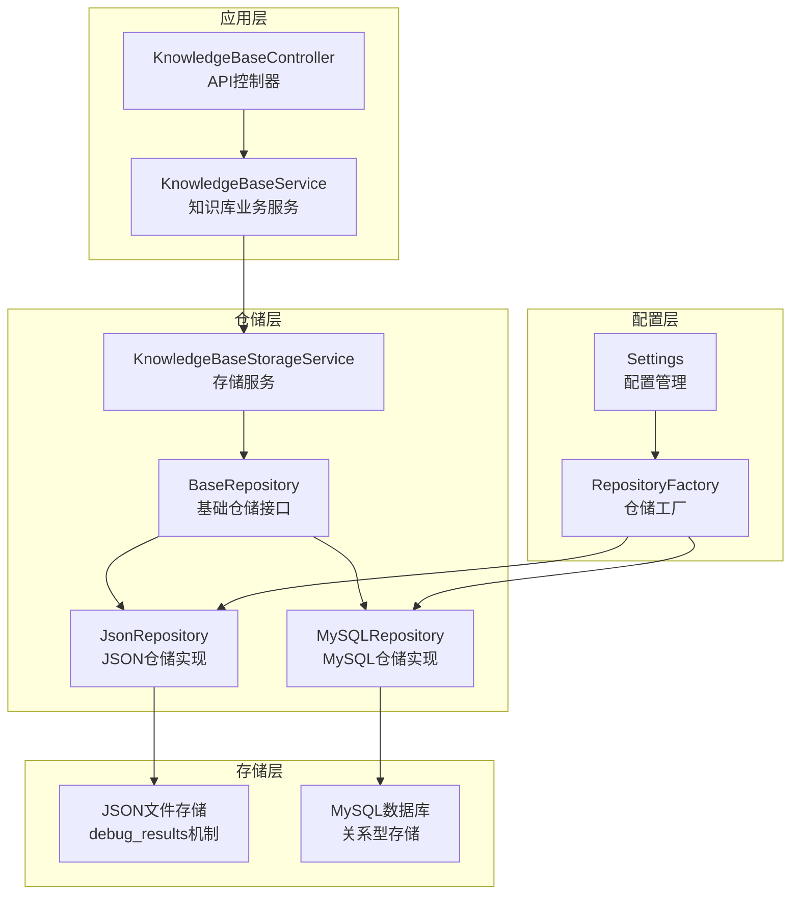
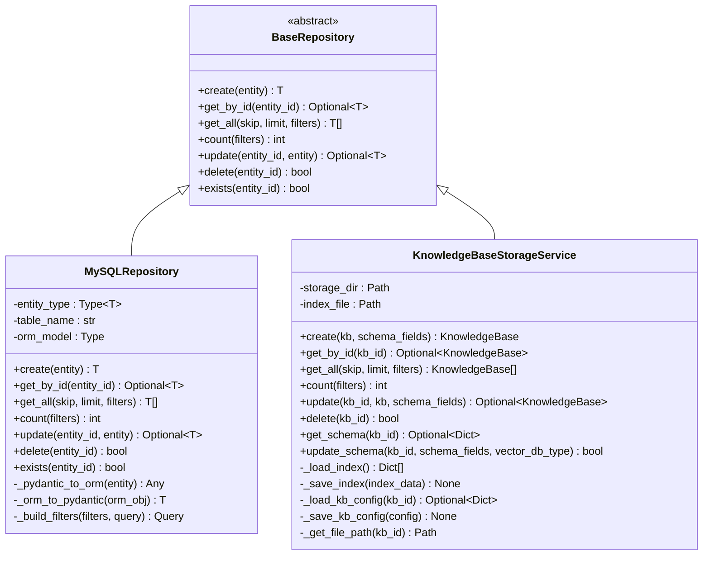
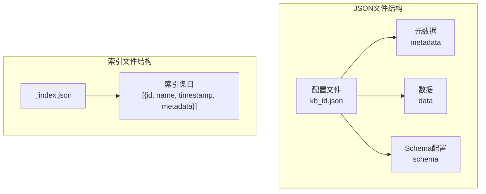
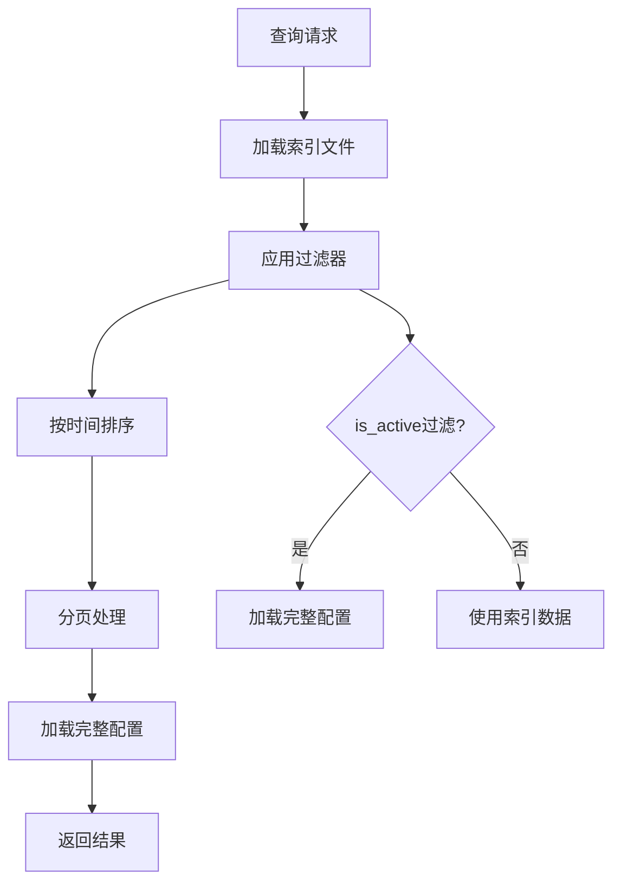
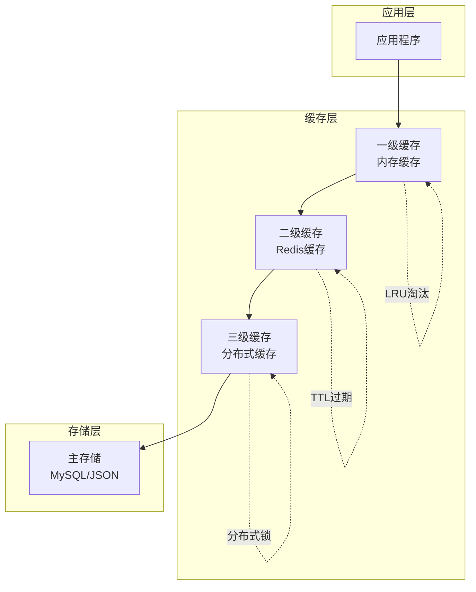

# 知识库存储服务

<cite>
**本文档引用的文件**
- [knowledge_base_storage.py](file://backend/app/services/knowledge_base_storage.py)
- [mysql_repository.py](file://backend/app/repositories/mysql_repository.py)
- [base.py](file://backend/app/repositories/base.py)
- [factory.py](file://backend/app/repositories/factory.py)
- [knowledge_base.py](file://backend/app/models/knowledge_base.py)
- [knowledge_base.py](file://backend/app/schemas/knowledge_base.py)
- [models.py](file://backend/app/database/models.py)
- [config.py](file://backend/app/config.py)
- [knowledge_base.py](file://backend/app/services/knowledge_base.py)
</cite>

## 目录
1. [简介](#简介)
2. [项目架构概览](#项目架构概览)
3. [仓储模式设计](#仓储模式设计)
4. [KnowledgeBaseStorageService核心功能](#knowledgebasestorageservice核心功能)
5. [数据存储结构](#数据存储结构)
6. [查询优化策略](#查询优化策略)
7. [扩展新存储后端](#扩展新存储后端)
8. [缓存层实现指导](#缓存层实现指导)
9. [最佳实践](#最佳实践)
10. [故障排除指南](#故障排除指南)

## 简介

RAG-Studio的知识库存储服务采用仓储模式（Repository Pattern）实现了灵活的数据持久化架构。该系统支持多种存储后端，包括基于JSON文件的传统存储和基于MySQL的关系型数据库存储，为知识库配置提供了统一的访问接口。

核心特性：
- **多存储后端支持**：JSON文件存储和MySQL数据库存储
- **仓储模式抽象**：通过抽象基类提供统一的数据访问接口
- **Schema管理**：完整的知识库Schema配置存储和管理
- **查询优化**：基于索引的高效查询机制
- **事务安全**：MySQL存储提供ACID事务保证

## 项目架构概览



**图表来源**
- [knowledge_base_storage.py](file://backend/app/services/knowledge_base_storage.py#L17-L359)
- [base.py](file://backend/app/repositories/base.py#L14-L119)
- [factory.py](file://backend/app/repositories/factory.py#L17-L116)

## 仓储模式设计

### 抽象基类设计

仓储模式通过抽象基类定义了统一的数据访问接口，确保不同存储后端的一致性。



**图表来源**
- [base.py](file://backend/app/repositories/base.py#L14-L119)
- [mysql_repository.py](file://backend/app/repositories/mysql_repository.py#L19-L308)
- [knowledge_base_storage.py](file://backend/app/services/knowledge_base_storage.py#L17-L359)

### 工厂模式实现

仓储工厂根据配置动态创建相应的存储实现，支持运行时切换存储后端。

**章节来源**
- [factory.py](file://backend/app/repositories/factory.py#L17-L116)

## KnowledgeBaseStorageService核心功能

### 创建知识库配置

KnowledgeBaseStorageService通过`create`方法创建新的知识库配置，支持自定义Schema字段和默认的向量数据库配置。

主要流程：
1. **ID验证**：检查知识库ID是否已存在
2. **Schema处理**：支持自定义Schema或使用默认配置
3. **配置构建**：按照debug_results格式构建完整配置
4. **文件存储**：保存配置到JSON文件
5. **索引更新**：更新全局索引文件

**章节来源**
- [knowledge_base_storage.py](file://backend/app/services/knowledge_base_storage.py#L92-L158)

### 获取知识库配置

提供多种查询方式获取知识库信息：

- **按ID查询**：`get_by_id`方法直接通过ID获取知识库
- **批量查询**：`get_all`方法支持分页和过滤
- **统计查询**：`count`方法提供数量统计

**章节来源**
- [knowledge_base_storage.py](file://backend/app/services/knowledge_base_storage.py#L160-L247)

### 更新和删除操作

- **更新配置**：`update`方法支持部分字段更新
- **Schema更新**：`update_schema`方法专门处理Schema配置变更
- **删除操作**：`delete`方法同时清理文件和索引

**章节来源**
- [knowledge_base_storage.py](file://backend/app/services/knowledge_base_storage.py#L249-L312)

## 数据存储结构

### JSON存储格式

KnowledgeBaseStorageService采用debug_results机制存储知识库配置，具有以下结构特点：



**图表来源**
- [knowledge_base_storage.py](file://backend/app/services/knowledge_base_storage.py#L125-L143)

### Schema字段定义

默认Schema包含以下核心字段：

| 字段名 | 类型 | 描述 | 索引类型 |
|--------|------|------|----------|
| content | text | 文本内容字段 | 全文索引 |
| embedding | dense_vector | 密集向量字段 | 向量索引 |
| sparse_vector | sparse_vector | 稀疏向量字段 | 稀疏向量索引 |

每个字段都包含详细的配置信息，如维度、距离度量、HNSW参数等。

**章节来源**
- [knowledge_base_storage.py](file://backend/app/services/knowledge_base_storage.py#L104-L122)

## 查询优化策略

### 索引机制

KnowledgeBaseStorageService维护一个全局索引文件，提供高效的查询性能：



**图表来源**
- [knowledge_base_storage.py](file://backend/app/services/knowledge_base_storage.py#L182-L208)

### 查询性能优化

1. **延迟加载**：索引文件只存储基本信息，完整配置按需加载
2. **内存缓存**：索引数据在内存中维护，避免重复I/O
3. **增量更新**：修改操作只更新相关部分，保持一致性
4. **批量操作**：支持批量查询和过滤，减少系统调用

**章节来源**
- [knowledge_base_storage.py](file://backend/app/services/knowledge_base_storage.py#L182-L247)

## 扩展新存储后端

### 实现步骤

要扩展新的存储后端，需要遵循以下步骤：

1. **继承基类**：实现BaseRepository抽象接口
2. **配置映射**：建立模型与存储的映射关系
3. **异常处理**：实现统一的异常处理机制
4. **工厂注册**：在RepositoryFactory中注册新后端

### MongoDB存储示例

```python
class MongoDBRepository(BaseRepository[T]):
    def __init__(self, entity_type: Type[T], collection_name: str):
        self.entity_type = entity_type
        self.collection = get_mongo_collection(collection_name)
    
    async def create(self, entity: T) -> T:
        # MongoDB特定实现
        pass
    
    async def get_by_id(self, entity_id: str) -> Optional[T]:
        # MongoDB特定实现
        pass
```

### Redis缓存集成

```python
class CachingRepository(BaseRepository[T]):
    def __init__(self, base_repo: BaseRepository[T]):
        self.base_repo = base_repo
        self.cache = get_redis_client()
    
    async def get_by_id(self, entity_id: str) -> Optional[T]:
        # 缓存优先策略
        cached = await self.cache.get(f"kb:{entity_id}")
        if cached:
            return self._deserialize(cached)
        
        entity = await self.base_repo.get_by_id(entity_id)
        if entity:
            await self.cache.set(f"kb:{entity_id}", self._serialize(entity))
        return entity
```

**章节来源**
- [base.py](file://backend/app/repositories/base.py#L14-L119)
- [factory.py](file://backend/app/repositories/factory.py#L24-L48)

## 缓存层实现指导

### 多级缓存架构



### 缓存策略

1. **写穿透**：写操作同时更新缓存和存储
2. **读修复**：缓存失效时自动从存储重建
3. **预热策略**：启动时预加载热点数据
4. **监控告警**：缓存命中率和性能监控

### 缓存配置示例

```python
class KnowledgeBaseCache:
    def __init__(self):
        self.redis_client = redis.Redis(
            host='localhost',
            port=6379,
            db=0,
            decode_responses=True
        )
        self.ttl = 300  # 5分钟
        self.max_size = 1000
    
    async def get_with_cache(self, kb_id: str) -> Optional[KnowledgeBase]:
        # 一级缓存
        cached = await self.redis_client.get(f"kb:{kb_id}")
        if cached:
            return KnowledgeBase(**json.loads(cached))
        
        # 二级缓存（从存储获取）
        kb = await self.storage.get_by_id(kb_id)
        if kb:
            await self.redis_client.setex(
                f"kb:{kb_id}", 
                self.ttl, 
                json.dumps(kb.model_dump())
            )
        return kb
```

## 最佳实践

### 配置管理

1. **环境隔离**：开发、测试、生产环境使用不同的存储配置
2. **配置验证**：启动时验证存储配置的有效性
3. **备份策略**：定期备份知识库配置数据

### 性能优化

1. **批量操作**：使用批量API减少网络开销
2. **连接池**：合理配置数据库连接池大小
3. **异步处理**：充分利用异步I/O提升并发性能

### 安全考虑

1. **访问控制**：实现细粒度的权限控制
2. **数据加密**：敏感配置信息加密存储
3. **审计日志**：记录所有配置变更操作

**章节来源**
- [config.py](file://backend/app/config.py#L42-L44)

## 故障排除指南

### 常见问题及解决方案

| 问题类型 | 症状 | 可能原因 | 解决方案 |
|----------|------|----------|----------|
| 存储访问失败 | 文件读写错误 | 权限不足或磁盘空间不足 | 检查文件权限和磁盘空间 |
| 索引损坏 | 查询结果异常 | 索引文件格式错误 | 重建索引文件 |
| 性能下降 | 查询响应慢 | 索引未优化或数据量过大 | 优化索引策略 |
| 内存占用高 | 系统内存不足 | 缓存配置不当 | 调整缓存大小和策略 |

### 监控指标

1. **存储指标**：文件大小、磁盘使用率、I/O性能
2. **查询指标**：响应时间、吞吐量、错误率
3. **缓存指标**：命中率、内存使用率、过期策略

### 日志分析

```python
import logging

logger = logging.getLogger(__name__)

class KnowledgeBaseStorageService:
    async def create(self, kb: KnowledgeBase, schema_fields: Optional[List[Dict[str, Any]]] = None):
        try:
            # 创建逻辑
            logger.info(f"创建知识库: {kb.id}, 名称: {kb.name}")
            # ... 实现
        except Exception as e:
            logger.error(f"创建知识库失败: {e}", exc_info=True)
            raise
```

**章节来源**
- [knowledge_base_storage.py](file://backend/app/services/knowledge_base_storage.py#L30-L37)
- [mysql_repository.py](file://backend/app/repositories/mysql_repository.py#L135-L142)

## 结论

RAG-Studio的知识库存储服务通过仓储模式实现了高度可扩展的数据持久化架构。KnowledgeBaseStorageService作为核心组件，不仅提供了完整的CRUD操作，还通过debug_results机制实现了灵活的Schema管理和高效的查询性能。

该架构的主要优势包括：
- **灵活性**：支持多种存储后端，易于扩展
- **一致性**：通过抽象接口保证操作的一致性
- **性能**：多级缓存和索引优化查询性能
- **可维护性**：清晰的职责分离和模块化设计

对于开发者而言，理解这套存储架构的设计理念和实现细节，有助于更好地扩展功能、优化性能和维护系统稳定性。