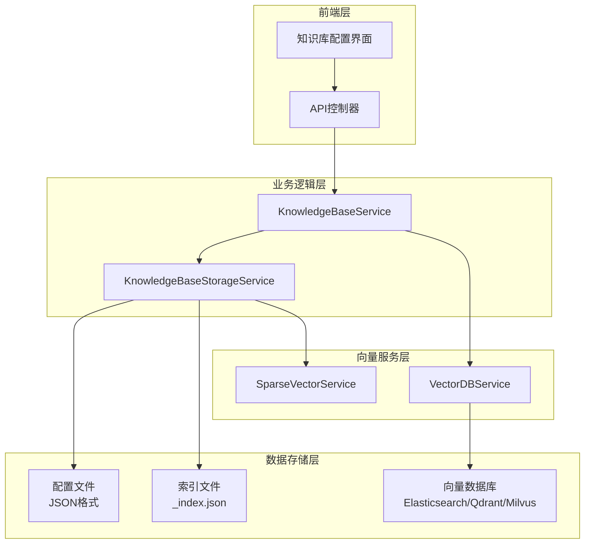
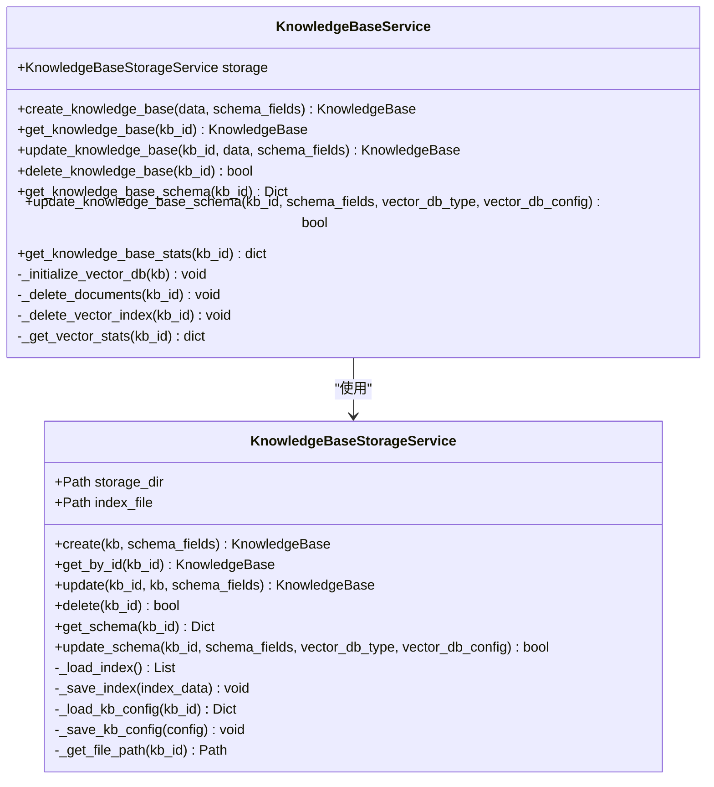
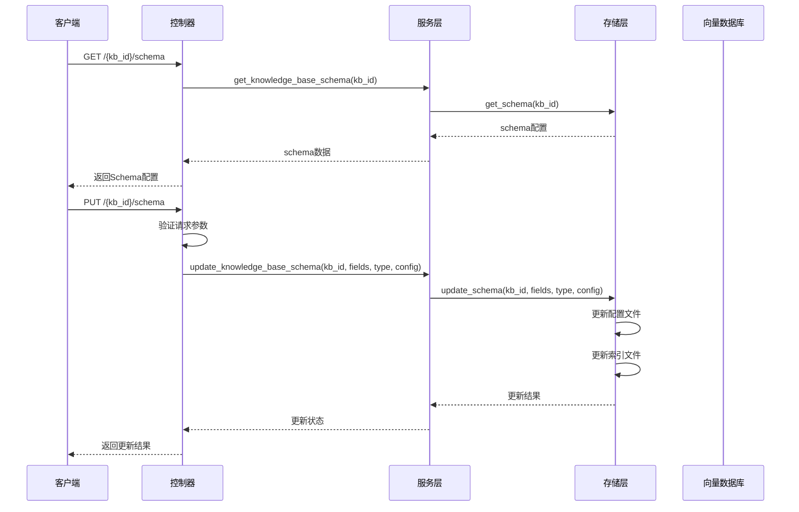
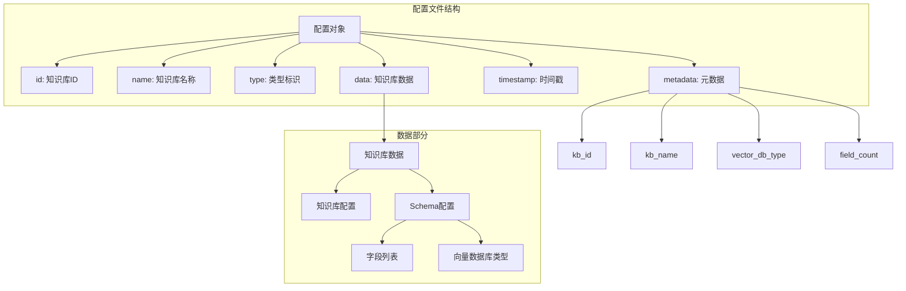
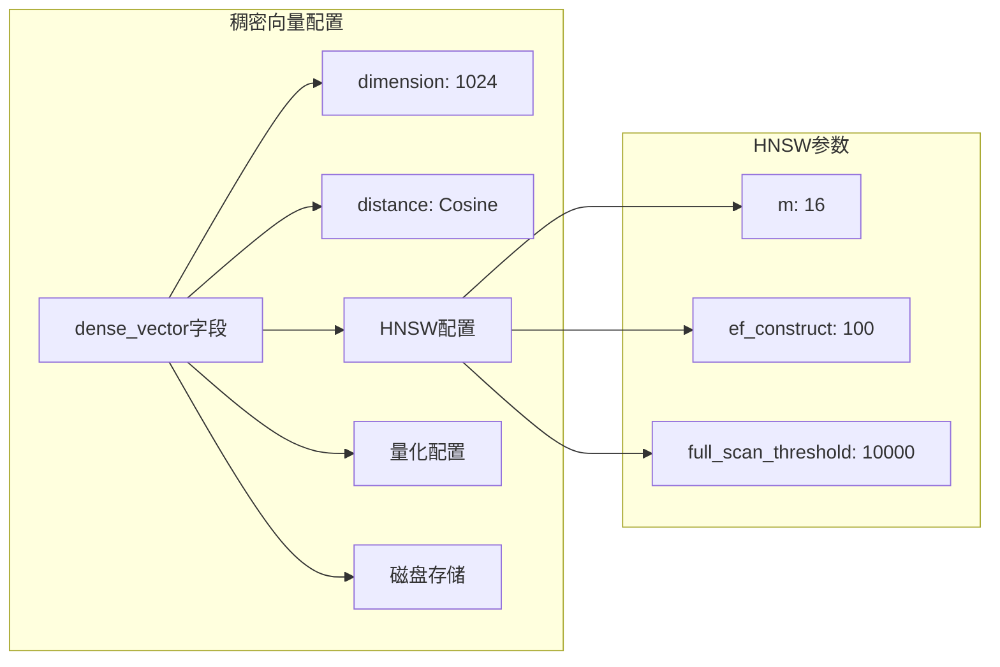
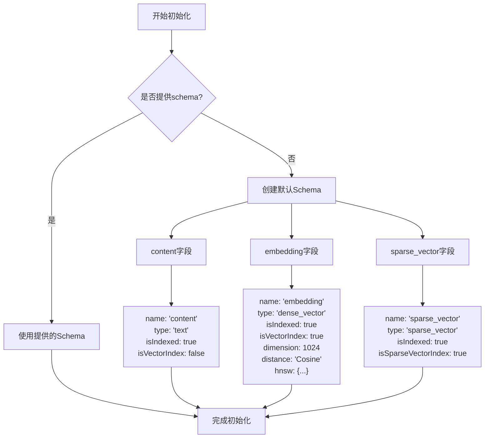
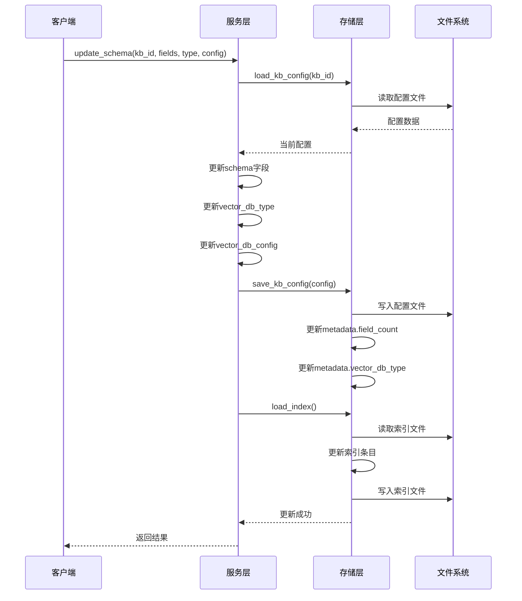
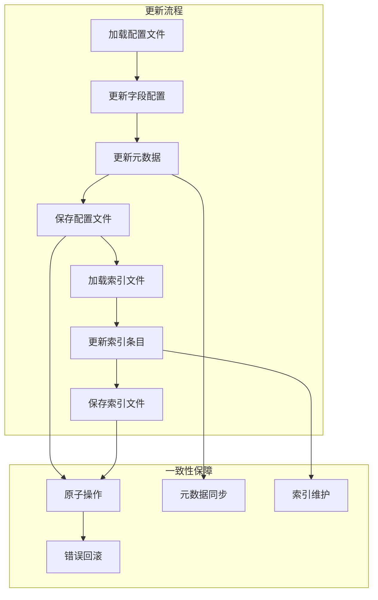
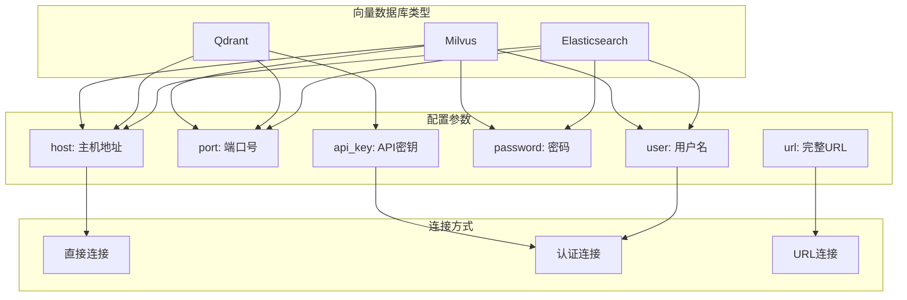

# Schema配置管理深度技术文档

<cite>
**本文档引用的文件**
- [knowledge_base.py](file://backend/app/models/knowledge_base.py)
- [knowledge_base_storage.py](file://backend/app/services/knowledge_base_storage.py)
- [knowledge_base.py](file://backend/app/services/knowledge_base.py)
- [knowledge_base.py](file://backend/app/schemas/knowledge_base.py)
- [knowledge_base.py](file://backend/app/controllers/knowledge_base.py)
- [vector_db_service.py](file://backend/app/services/vector_db_service.py)
- [config.py](file://backend/app/config.py)
- [test_sparse_vector_simple.py](file://test_sparse_vector_simple.py)
</cite>

## 目录
1. [概述](#概述)
2. [系统架构](#系统架构)
3. [核心组件分析](#核心组件分析)
4. [Schema存储结构设计](#schema存储结构设计)
5. [默认Schema初始化策略](#默认schema初始化策略)
6. [Schema更新与版本控制](#schema更新与版本控制)
7. [向量数据库配置](#向量数据库配置)
8. [扩展指南](#扩展指南)
9. [最佳实践](#最佳实践)
10. [故障排除](#故障排除)

## 概述

RAG Studio的Schema配置管理系统是一个高度灵活且可扩展的架构，专门用于管理知识库的结构化数据配置。该系统通过`get_knowledge_base_schema`和`update_knowledge_base_schema`两个核心方法，实现了对知识库Schema的完整生命周期管理，包括字段定义、向量数据库配置、版本控制和一致性保障。

### 主要特性

- **多向量支持**：同时支持密集向量(dense_vector)和稀疏向量(sparse_vector)的混合配置
- **灵活字段类型**：支持文本、整数、浮点数、布尔值等多种标量字段类型
- **版本控制机制**：通过metadata中的field_count和vector_db_type实现配置版本管理
- **双写一致性**：确保配置文件与索引文件的同步更新
- **向量数据库抽象**：支持Elasticsearch、Qdrant、Milvus等多种向量数据库

## 系统架构



**图表来源**
- [knowledge_base.py](file://backend/app/controllers/knowledge_base.py#L221-L280)
- [knowledge_base.py](file://backend/app/services/knowledge_base.py#L15-L20)
- [knowledge_base_storage.py](file://backend/app/services/knowledge_base_storage.py#L17-L24)

## 核心组件分析

### KnowledgeBaseService - 业务逻辑核心

KnowledgeBaseService是Schema管理的主要入口点，负责协调各个组件之间的交互。



**图表来源**
- [knowledge_base.py](file://backend/app/services/knowledge_base.py#L15-L230)
- [knowledge_base_storage.py](file://backend/app/services/knowledge_base_storage.py#L17-L359)

### 控制器层 - API接口

控制器层提供了RESTful API接口，封装了底层的业务逻辑调用。



**图表来源**
- [knowledge_base.py](file://backend/app/controllers/knowledge_base.py#L221-L280)

**章节来源**
- [knowledge_base.py](file://backend/app/controllers/knowledge_base.py#L221-L280)
- [knowledge_base.py](file://backend/app/services/knowledge_base.py#L15-L230)

## Schema存储结构设计

### 配置文件结构

Schema配置采用JSON格式存储，遵循debug_results机制的设计原则：



**图表来源**
- [knowledge_base_storage.py](file://backend/app/services/knowledge_base_storage.py#L125-L142)

### 字段类型定义

Schema中的字段具有丰富的类型定义和配置选项：

| 字段类型 | 描述 | 特性 | 示例配置 |
|---------|------|------|----------|
| `text` | 文本字段 | 支持全文索引、向量索引 | `{"name": "content", "type": "text", "isIndexed": true}` |
| `dense_vector` | 密集向量字段 | 支持多种距离度量、HNSW索引 | 见下文详细配置 |
| `sparse_vector` | 稀疏向量字段 | 支持BM25、TF-IDF等生成方法 | 见下文详细配置 |
| `integer` | 整数字段 | 数值索引、范围查询 | `{"name": "age", "type": "integer", "isIndexed": true}` |
| `float` | 浮点数字段 | 数值索引、精度控制 | `{"name": "score", "type": "float", "isIndexed": true}` |
| `boolean` | 布尔字段 | 布尔索引、条件查询 | `{"name": "active", "type": "boolean", "isIndexed": true}` |
| `keyword` | 关键词字段 | 精确匹配、聚合查询 | `{"name": "category", "type": "keyword", "isIndexed": true}` |

### 稠密向量字段配置

稠密向量字段是Schema的核心组成部分，支持复杂的配置选项：



**图表来源**
- [knowledge_base_storage.py](file://backend/app/services/knowledge_base_storage.py#L109-L119)

**章节来源**
- [knowledge_base_storage.py](file://backend/app/services/knowledge_base_storage.py#L109-L142)

## 默认Schema初始化策略

### 内容字段配置

默认Schema包含三个核心字段，每个字段都有特定的用途和配置：



**图表来源**
- [knowledge_base_storage.py](file://backend/app/services/knowledge_base_storage.py#L104-L121)

### 密集向量字段预设配置

密集向量字段采用1024维向量，使用余弦距离度量：

| 配置项 | 值 | 说明 |
|--------|-----|------|
| `name` | "embedding" | 字段名称 |
| `type` | "dense_vector" | 字段类型 |
| `isIndexed` | true | 是否建立索引 |
| `isVectorIndex` | true | 是否为向量索引 |
| `dimension` | 1024 | 向量维度 |
| `distance` | "Cosine" | 距离度量方式 |
| `hnsw.m` | 16 | HNSW连接数 |
| `hnsw.ef_construct` | 100 | HNSW构建时搜索宽度 |
| `hnsw.full_scan_threshold` | 10000 | 全扫描阈值 |
| `hnsw.on_disk` | false | 是否使用磁盘存储 |

### 稀疏向量字段配置

稀疏向量字段专门用于混合检索场景，支持多种生成方法：

| 配置项 | 值 | 说明 |
|--------|-----|------|
| `name` | "sparse_vector" | 字段名称 |
| `type` | "sparse_vector" | 字段类型 |
| `isIndexed` | true | 是否建立索引 |
| `isSparseVectorIndex` | true | 是否为稀疏向量索引 |

**章节来源**
- [knowledge_base_storage.py](file://backend/app/services/knowledge_base_storage.py#L104-L121)

## Schema更新与版本控制

### 版本控制机制

Schema更新采用基于metadata的版本控制机制，确保配置的一致性和可追溯性：



**图表来源**
- [knowledge_base_storage.py](file://backend/app/services/knowledge_base_storage.py#L322-L355)

### 双写一致性保障

系统通过以下机制确保配置文件与索引文件的一致性：

1. **原子操作**：更新操作在单个事务中完成
2. **元数据同步**：metadata中的field_count和vector_db_type实时更新
3. **索引维护**：索引文件与配置文件同步更新
4. **错误回滚**：操作失败时自动回滚到之前状态

### 配置文件与索引文件的同步更新



**图表来源**
- [knowledge_base_storage.py](file://backend/app/services/knowledge_base_storage.py#L322-L355)

**章节来源**
- [knowledge_base_storage.py](file://backend/app/services/knowledge_base_storage.py#L322-L355)

## 向量数据库配置

### 支持的向量数据库类型

系统支持三种主流向量数据库，每种都有其特定的配置要求：



**图表来源**
- [config.py](file://backend/app/config.py#L58-L73)
- [vector_db_service.py](file://backend/app/services/vector_db_service.py#L203-L260)

### 向量数据库配置详解

#### Qdrant配置

Qdrant是最主要的向量数据库支持，提供丰富的配置选项：

| 配置项 | 类型 | 默认值 | 说明 |
|--------|------|--------|------|
| `host` | string | "localhost" | Qdrant主机地址 |
| `port` | integer | 6333 | Qdrant端口号 |
| `api_key` | string | "" | API密钥（可选） |
| `url` | string | - | 完整URL（优先级最高） |

#### Milvus配置

Milvus支持分布式部署和认证：

| 配置项 | 类型 | 默认值 | 说明 |
|--------|------|--------|------|
| `host` | string | "localhost" | Milvus主机地址 |
| `port` | integer | 19530 | Milvus端口号 |
| `user` | string | "" | 用户名（可选） |
| `password` | string | "" | 密码（可选） |

#### Elasticsearch配置

Elasticsearch配置支持HTTP Basic认证：

| 配置项 | 类型 | 默认值 | 说明 |
|--------|------|--------|------|
| `host` | string | "localhost" | ES主机地址 |
| `port` | integer | 9200 | ES端口号 |
| `user` | string | "" | 用户名 |
| `password` | string | "" | 密码 |

### 向量参数配置

不同向量数据库的参数配置方式略有差异：

```mermaid
flowchart LR
subgraph "Qdrant配置"
QdrantParams[VectorParams]
QdrantDim[size: 1024]
QdrantDist[distance: COSINE]
QdrantHNSW[hnsw_config: {...}]
QdrantQuant[quantization_config: {...}]
QdrantDisk[on_disk: false]
end
subgraph "Milvus配置"
MilvusSchema[CollectionSchema]
MilvusField[FieldSchema]
MilvusType[dtype: FLOAT_VECTOR]
MilvusDim[dim: 1024]
end
subgraph "Elasticsearch配置"
ESMapping[映射配置]
ESVector[向量字段]
ESDim[dimensions: 1024]
ESDist[similarity: cosine]
end
QdrantParams --> QdrantDim
QdrantParams --> QdrantDist
QdrantParams --> QdrantHNSW
QdrantParams --> QdrantQuant
QdrantParams --> QdrantDisk
MilvusSchema --> MilvusField
MilvusField --> MilvusType
MilvusField --> MilvusDim
ESMapping --> ESVector
ESVector --> ESDim
ESVector --> ESDist
```

**图表来源**
- [vector_db_service.py](file://backend/app/services/vector_db_service.py#L310-L454)

**章节来源**
- [config.py](file://backend/app/config.py#L58-L73)
- [vector_db_service.py](file://backend/app/services/vector_db_service.py#L203-L454)

## 扩展指南

### 添加自定义字段类型

要添加新的字段类型，需要修改多个组件：

1. **模型定义**：在`knowledge_base.py`中扩展字段类型
2. **存储服务**：在`knowledge_base_storage.py`中处理新字段类型
3. **向量服务**：在`vector_db_service.py`中添加对应处理逻辑
4. **前端界面**：在前端组件中添加字段配置选项

### 集成新的向量数据库

集成新的向量数据库需要以下步骤：

1. **创建服务类**：继承`BaseVectorDBService`基类
2. **实现接口**：实现必需的方法如`create_collection`、`insert_vectors`等
3. **添加工厂**：在`VectorDBServiceFactory`中注册新服务
4. **配置支持**：在`config.py`中添加相应配置项

### 自定义稀疏向量生成方法

系统支持多种稀疏向量生成方法：

| 方法类型 | 说明 | 配置参数 |
|----------|------|----------|
| `bm25` | BM25算法 | `{"sparseMethod": "bm25"}` |
| `tf-idf` | TF-IDF算法 | `{"sparseMethod": "tf-idf"}` |
| `simple` | 简单词频 | `{"sparseMethod": "simple"}` |
| `splade` | SPLADE模型 | `{"sparseMethod": "splade"}` |

### 扩展现有功能

#### 添加新的距离度量

```python
# 在vector_db_service.py中添加新的距离度量
distance_map = {
    "Cosine": Distance.COSINE,
    "Euclidean": Distance.EUCLIDEAN,
    "Manhattan": Distance.MANHATTAN,
    "Dot": Distance.DOT_PRODUCT,
    "Custom": CustomDistance  # 新增自定义距离度量
}
```

#### 实现新的向量量化

```python
# 在vector_db_service.py中添加新的量化类型
if quant_type == "new_quantization":
    quantization_config = NewQuantizationConfig(
        parameter=value,
        always_ram=always_ram
    )
```

**章节来源**
- [vector_db_service.py](file://backend/app/services/vector_db_service.py#L310-L454)
- [test_sparse_vector_simple.py](file://test_sparse_vector_simple.py#L19-L108)

## 最佳实践

### Schema设计原则

1. **字段命名规范**
   - 使用有意义的字段名称
   - 避免特殊字符和空格
   - 保持命名一致性

2. **索引策略**
   - 对于频繁查询的字段启用索引
   - 平衡索引数量与性能
   - 考虑字段的查询模式

3. **向量配置优化**
   - 根据数据特征选择合适的维度
   - 选择适当的距离度量
   - 合理配置HNSW参数

### 性能优化建议

1. **批量操作**
   - 使用批量插入减少网络开销
   - 合理设置批量大小
   - 异步处理大量数据

2. **缓存策略**
   - 缓存常用的Schema配置
   - 利用内存缓存提高访问速度
   - 实现智能缓存失效机制

3. **资源管理**
   - 监控向量数据库资源使用
   - 实现自动扩缩容机制
   - 优化存储空间利用

### 安全考虑

1. **访问控制**
   - 实施细粒度权限管理
   - 记录Schema变更日志
   - 验证用户输入

2. **数据保护**
   - 加密敏感字段
   - 实现数据备份策略
   - 监控异常访问行为

## 故障排除

### 常见问题及解决方案

#### Schema加载失败

**问题症状**：无法获取知识库Schema配置

**可能原因**：
- 配置文件损坏
- 权限不足
- 文件路径错误

**解决方案**：
1. 检查配置文件完整性
2. 验证文件读写权限
3. 确认文件路径正确性

#### 向量数据库连接失败

**问题症状**：向量数据库连接超时或认证失败

**可能原因**：
- 数据库服务未启动
- 网络连接问题
- 配置参数错误

**解决方案**：
1. 检查数据库服务状态
2. 验证网络连通性
3. 确认配置参数正确

#### Schema更新冲突

**问题症状**：并发更新导致数据不一致

**可能原因**：
- 多个客户端同时更新
- 锁机制失效
- 网络延迟导致的竞态条件

**解决方案**：
1. 实现乐观锁机制
2. 添加更新验证逻辑
3. 使用分布式锁

### 调试工具和技巧

#### 日志记录

系统提供详细的日志记录功能：

```python
# 启用详细日志
import logging
logging.basicConfig(level=logging.DEBUG)

# 记录Schema操作
logger.info(f"更新知识库Schema: kb_id={kb_id}, field_count={len(schema_fields)}")
```

#### 性能监控

```python
# 监控Schema操作性能
import time

start_time = time.time()
result = await service.update_knowledge_base_schema(kb_id, schema_fields)
end_time = time.time()

logger.info(f"Schema更新耗时: {end_time - start_time:.2f}秒")
```

#### 配置验证

```python
# 验证Schema配置有效性
def validate_schema(schema_fields):
    for field in schema_fields:
        if field.get("type") == "dense_vector":
            assert field.get("dimension") > 0, "向量维度必须大于0"
            assert field.get("distance") in ["Cosine", "Euclidean", "Manhattan"], "无效的距离度量"
```

**章节来源**
- [knowledge_base_storage.py](file://backend/app/services/knowledge_base_storage.py#L322-L355)

## 结论

RAG Studio的Schema配置管理系统是一个设计精良、功能完备的架构，它通过模块化的组件设计、灵活的配置机制和强大的扩展能力，为知识库的结构化数据管理提供了坚实的基础。系统的双写一致性保障、版本控制机制和多向量支持特性，使其能够适应各种复杂的应用场景。

对于开发者而言，理解这套Schema管理机制的工作原理，不仅有助于更好地使用系统功能，也为后续的功能扩展和定制开发奠定了基础。随着向量数据库技术的不断发展，这套Schema管理系统也将持续演进，为构建更智能的RAG应用提供强有力的支持。