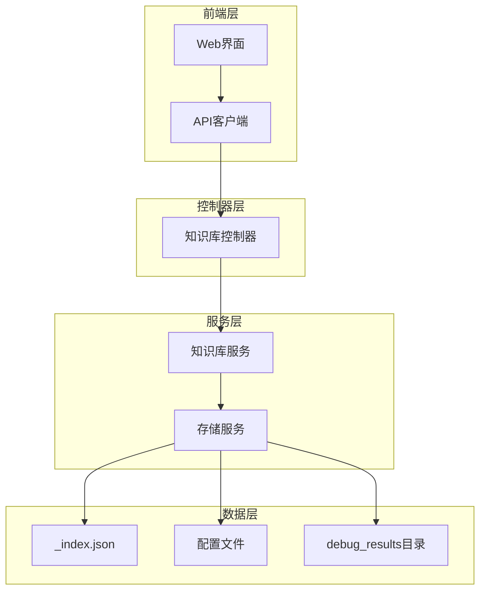
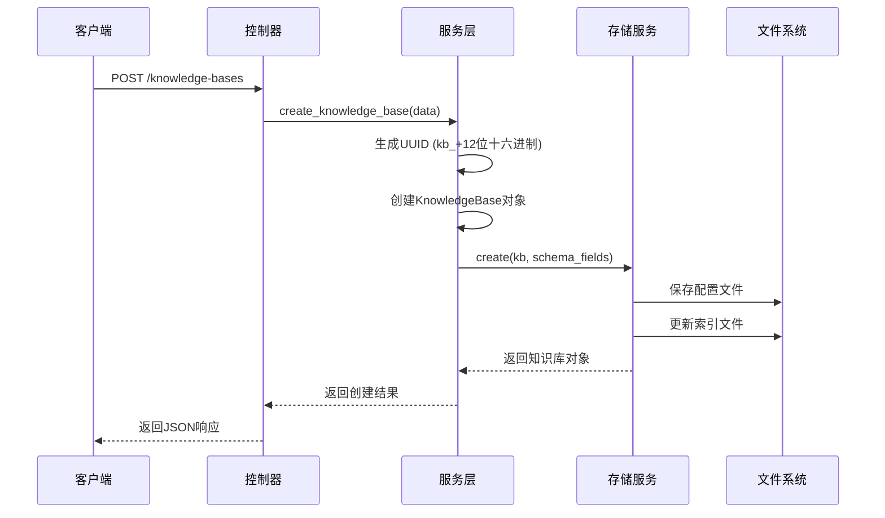
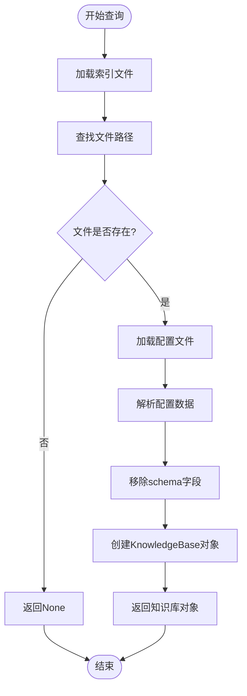
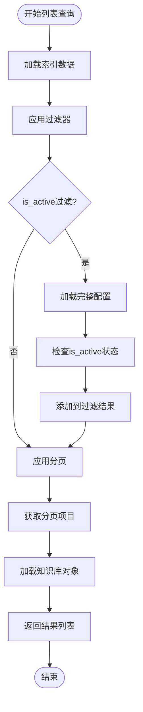
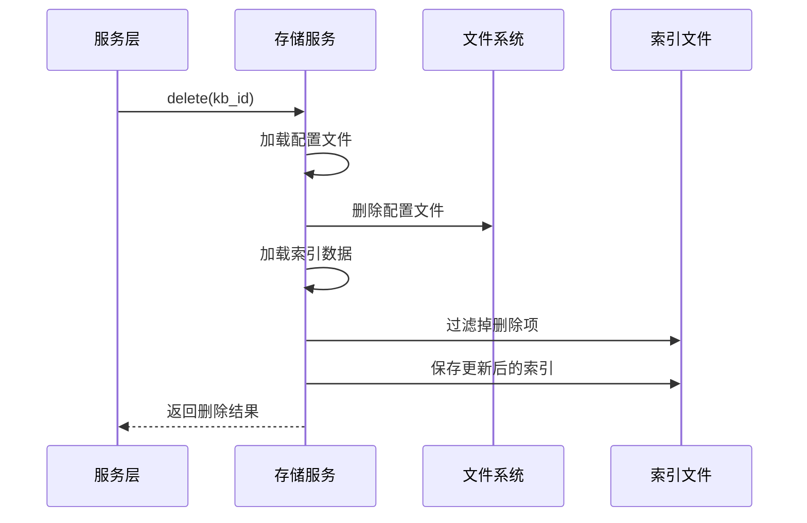
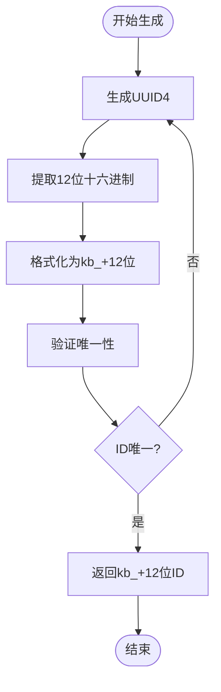
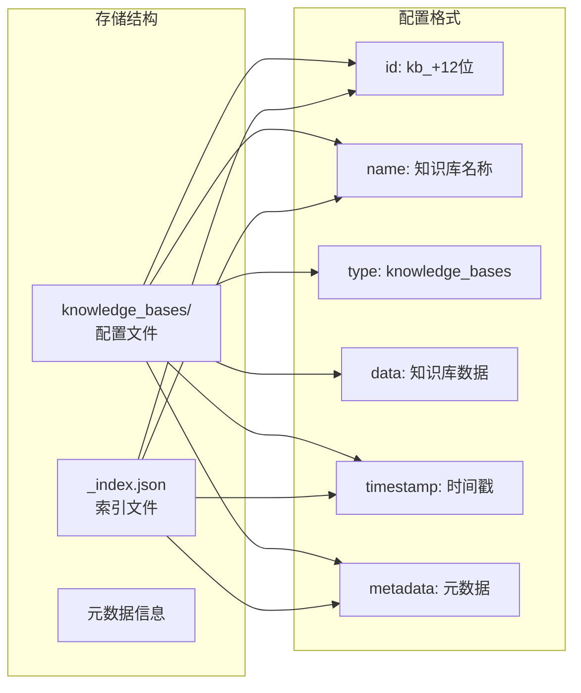
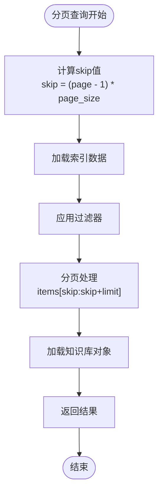
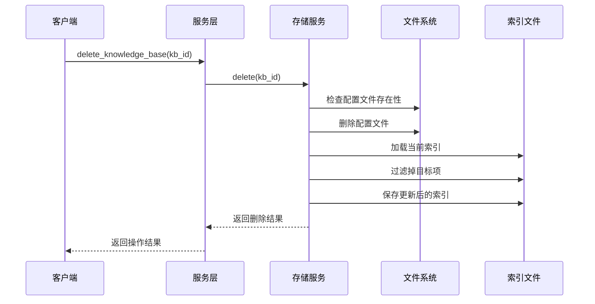
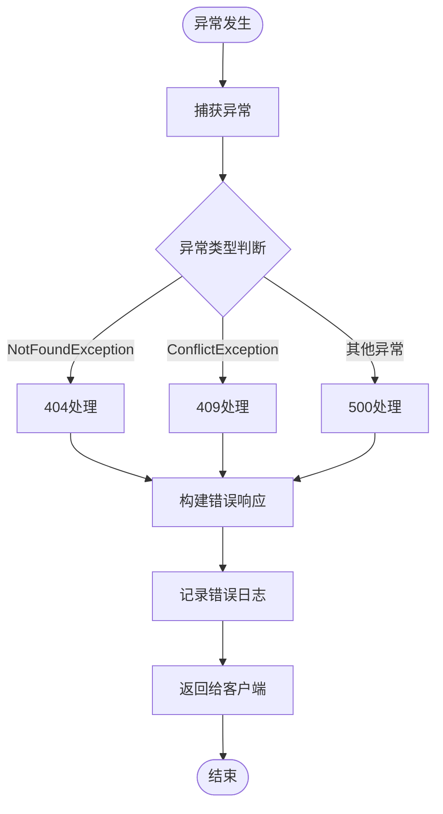

# 知识库服务核心CRUD操作技术文档

<cite>
**本文档引用的文件**
- [knowledge_base.py](file://backend/app/controllers/knowledge_base.py)
- [knowledge_base.py](file://backend/app/services/knowledge_base.py)
- [knowledge_base_storage.py](file://backend/app/services/knowledge_base_storage.py)
- [knowledge_base.py](file://backend/app/models/knowledge_base.py)
- [knowledge_base.py](file://backend/app/schemas/knowledge_base.py)
- [exceptions.py](file://backend/app/core/exceptions.py)
- [api.ts](file://web/lib/api.ts)
- [knowledge-base-list.tsx](file://web/components/views/knowledge-base-list.tsx)
</cite>

## 目录
1. [概述](#概述)
2. [系统架构](#系统架构)
3. [核心CRUD操作详解](#核心crud操作详解)
4. [UUID生成机制](#uuid生成机制)
5. [存储持久化流程](#存储持久化流程)
6. [查询操作实现](#查询操作实现)
7. [级联删除设计](#级联删除设计)
8. [异常处理机制](#异常处理机制)
9. [前端API调用示例](#前端api调用示例)
10. [最佳实践指南](#最佳实践指南)

## 概述

RAG Studio知识库服务提供了完整的CRUD操作能力，支持知识库的创建、查询、更新和删除。该系统采用分层架构设计，通过KnowledgeBaseService和KnowledgeBaseStorageService实现业务逻辑与数据存储的分离，确保系统的可维护性和扩展性。

## 系统架构



**图表来源**
- [knowledge_base.py](file://backend/app/controllers/knowledge_base.py#L1-L283)
- [knowledge_base.py](file://backend/app/services/knowledge_base.py#L1-L230)
- [knowledge_base_storage.py](file://backend/app/services/knowledge_base_storage.py#L1-L359)

## 核心CRUD操作详解

### 创建知识库（create_knowledge_base）

创建知识库是系统的核心功能，涉及UUID生成、对象构建和存储持久化三个关键步骤。



**图表来源**
- [knowledge_base.py](file://backend/app/controllers/knowledge_base.py#L22-L44)
- [knowledge_base.py](file://backend/app/services/knowledge_base.py#L21-L47)
- [knowledge_base_storage.py](file://backend/app/services/knowledge_base_storage.py#L92-L158)

**章节来源**
- [knowledge_base.py](file://backend/app/controllers/knowledge_base.py#L22-L44)
- [knowledge_base.py](file://backend/app/services/knowledge_base.py#L21-L47)

### 查询知识库（get_knowledge_base）

单体查询操作通过ID快速定位知识库配置，采用直接文件读取的方式实现高效访问。



**图表来源**
- [knowledge_base_storage.py](file://backend/app/services/knowledge_base_storage.py#L160-L171)

**章节来源**
- [knowledge_base_storage.py](file://backend/app/services/knowledge_base_storage.py#L160-L171)

### 列出知识库（list_knowledge_bases）

分页过滤查询实现了高效的列表展示功能，支持按激活状态进行索引扫描。



**图表来源**
- [knowledge_base_storage.py](file://backend/app/services/knowledge_base_storage.py#L173-L219)

**章节来源**
- [knowledge_base_storage.py](file://backend/app/services/knowledge_base_storage.py#L173-L219)

### 删除知识库（delete_knowledge_base）

删除操作采用原子性设计，确保文件删除和索引更新的一致性。



**图表来源**
- [knowledge_base_storage.py](file://backend/app/services/knowledge_base_storage.py#L292-L312)

**章节来源**
- [knowledge_base_storage.py](file://backend/app/services/knowledge_base_storage.py#L292-L312)

## UUID生成机制

### 唯一标识符生成

知识库ID采用特定格式的UUID生成机制，确保全局唯一性和可读性。



**图表来源**
- [knowledge_base.py](file://backend/app/services/knowledge_base.py#L33)

### 实现细节

UUID生成过程遵循以下规则：
- 使用Python标准库uuid.uuid4()生成随机UUID
- 提取hex属性的前12个字符
- 添加固定前缀"kb_"形成最终ID
- 在存储层检查ID唯一性避免冲突

**章节来源**
- [knowledge_base.py](file://backend/app/services/knowledge_base.py#L33)

## 存储持久化流程

### debug_results机制

系统采用debug_results存储机制，将知识库配置以结构化方式保存在本地文件系统中。



**图表来源**
- [knowledge_base_storage.py](file://backend/app/services/knowledge_base_storage.py#L125-L143)

### Schema配置

系统预设了包含稀疏向量字段的标准Schema配置：

| 字段名称 | 类型 | 描述 | 特殊配置 |
|---------|------|------|----------|
| content | text | 文本内容 | isIndexed: true, isVectorIndex: false |
| embedding | dense_vector | 密集向量 | isIndexed: true, isVectorIndex: true, dimension: 1024 |
| sparse_vector | sparse_vector | 稀疏向量 | isIndexed: true, isSparseVectorIndex: true |

**章节来源**
- [knowledge_base_storage.py](file://backend/app/services/knowledge_base_storage.py#L104-L122)

## 查询操作实现

### 分页算法

分页查询采用skip/limit模式，支持大数据集的高效浏览。



**图表来源**
- [knowledge_base_storage.py](file://backend/app/services/knowledge_base_storage.py#L82-L84)

### 索引扫描机制

is_active状态过滤采用索引扫描优化：

1. **索引阶段**：优先检查索引中的metadata信息
2. **完整配置加载**：当索引无法满足过滤条件时，加载完整配置文件
3. **内存过滤**：在内存中进行精确的状态匹配

**章节来源**
- [knowledge_base_storage.py](file://backend/app/services/knowledge_base_storage.py#L183-L204)

## 级联删除设计

### 原子性操作

删除操作确保文件系统和索引数据的一致性：



**图表来源**
- [knowledge_base_storage.py](file://backend/app/services/knowledge_base_storage.py#L292-L312)

### 错误处理

删除操作包含完善的错误处理机制：
- 文件不存在时返回False而非抛出异常
- 索引更新失败时保持原有状态
- 支持幂等性操作确保重复删除的安全性

**章节来源**
- [knowledge_base_storage.py](file://backend/app/services/knowledge_base_storage.py#L292-L312)

## 异常处理机制

### 异常类型定义

系统定义了专门的异常类型来处理不同场景：

| 异常类型 | HTTP状态码 | 触发条件 | 处理策略 |
|---------|-----------|----------|----------|
| NotFoundException | 404 | 资源不存在 | 返回用户友好的错误消息 |
| ConflictException | 409 | 资源冲突（如ID重复） | 提供冲突详情帮助解决 |
| InternalServerException | 500 | 内部服务器错误 | 记录详细日志便于调试 |

**章节来源**
- [exceptions.py](file://backend/app/core/exceptions.py#L12-L144)

### 异常处理流程



**图表来源**
- [exceptions.py](file://backend/app/core/exceptions.py#L94-L143)

## 前端API调用示例

### TypeScript API封装

前端提供了完整的TypeScript API封装，支持类型安全的调用：

```typescript
// 创建知识库
const createKB = async (data: CreateKnowledgeBaseData) => {
  return await knowledgeBaseAPI.create(data);
};

// 获取知识库列表
const listKB = async (page = 1, pageSize = 20, isActive?: boolean) => {
  return await knowledgeBaseAPI.list(page, pageSize, isActive);
};

// 更新知识库
const updateKB = async (id: string, data: UpdateKnowledgeBaseData) => {
  return await knowledgeBaseAPI.update(id, data);
};

// 删除知识库
const deleteKB = async (id: string) => {
  return await knowledgeBaseAPI.delete(id);
};
```

**章节来源**
- [api.ts](file://web/lib/api.ts#L108-L176)

### React组件集成

前端组件展示了最佳的API调用实践：

```typescript
// 加载知识库列表
const loadKnowledgeBases = async () => {
  try {
    setLoading(true);
    setError(null);
    const response = await knowledgeBaseAPI.list();
    setKnowledgeBases(response.data);
  } catch (err: any) {
    setError(err.message || "加载失败");
    console.error("加载知识库列表失败:", err);
  } finally {
    setLoading(false);
  }
};
```

**章节来源**
- [knowledge-base-list.tsx](file://web/components/views/knowledge-base-list.tsx#L15-L35)

## 最佳实践指南

### 开发建议

1. **错误处理**：始终包装API调用在try-catch块中
2. **状态管理**：合理使用loading和error状态
3. **数据验证**：在前端进行基础数据验证
4. **用户体验**：提供清晰的错误提示和成功反馈

### 性能优化

1. **分页查询**：合理设置page_size避免大数据集加载
2. **缓存策略**：对频繁访问的配置进行本地缓存
3. **批量操作**：对于大量数据操作考虑批量处理

### 安全考虑

1. **输入验证**：严格验证所有用户输入
2. **权限控制**：确保只有授权用户可以执行删除操作
3. **数据备份**：重要知识库变更前应进行备份

### 监控和调试

1. **日志记录**：记录关键操作的日志信息
2. **性能监控**：监控API响应时间和成功率
3. **错误追踪**：建立完善的错误追踪机制