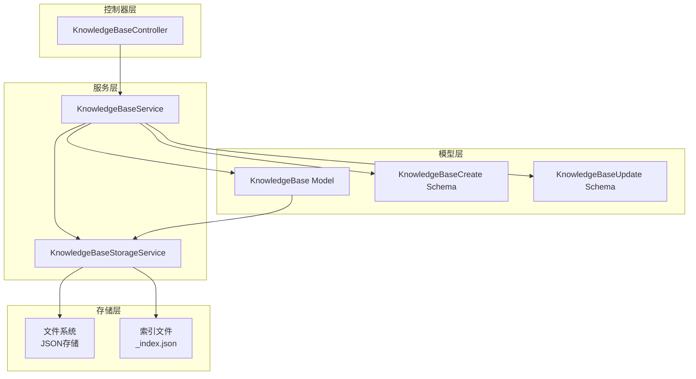
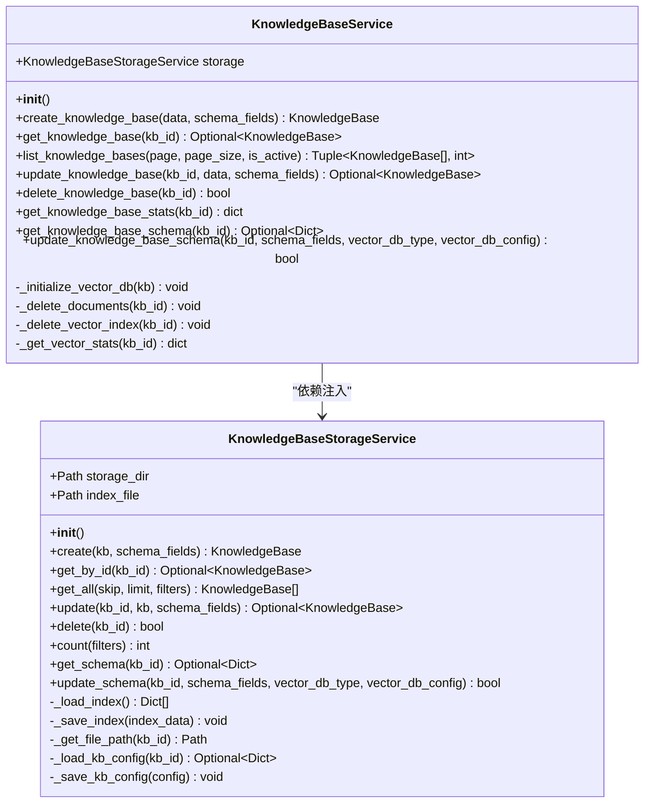
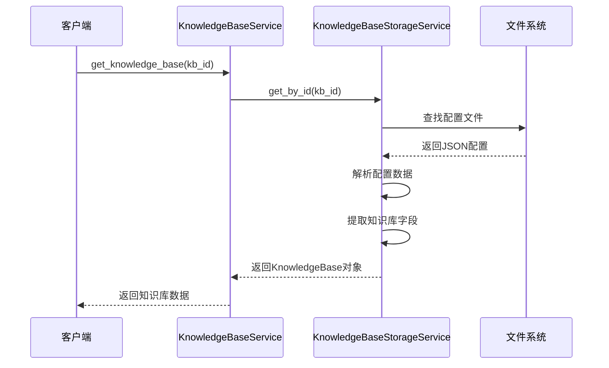
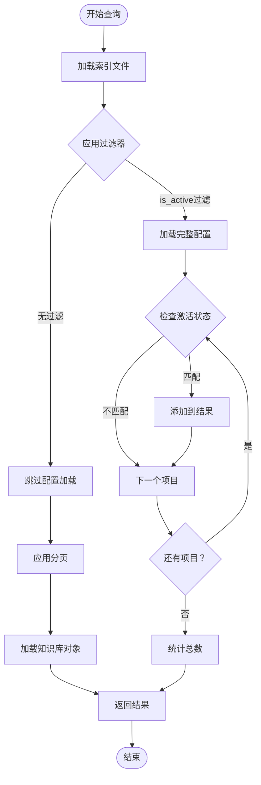
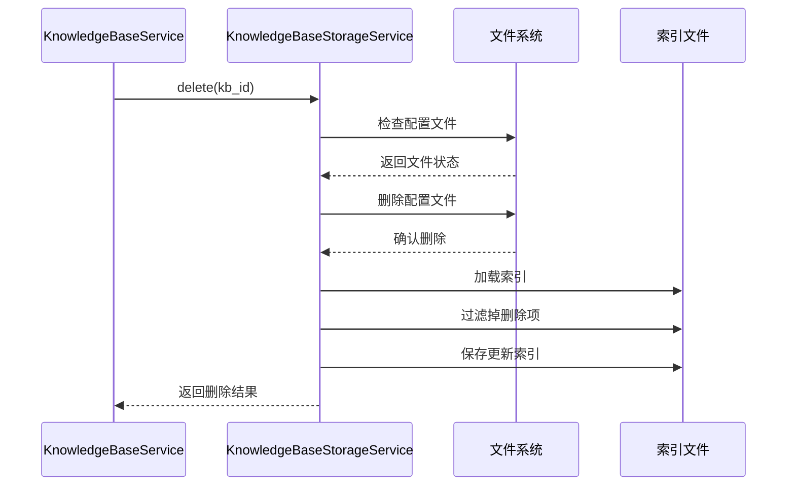
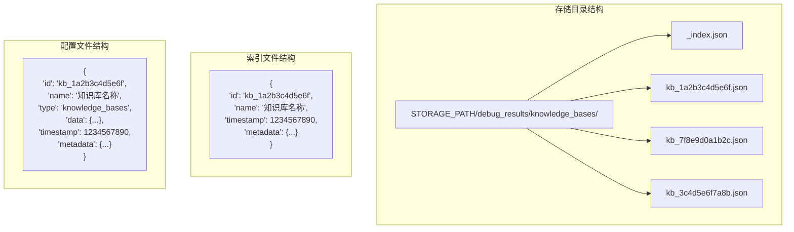
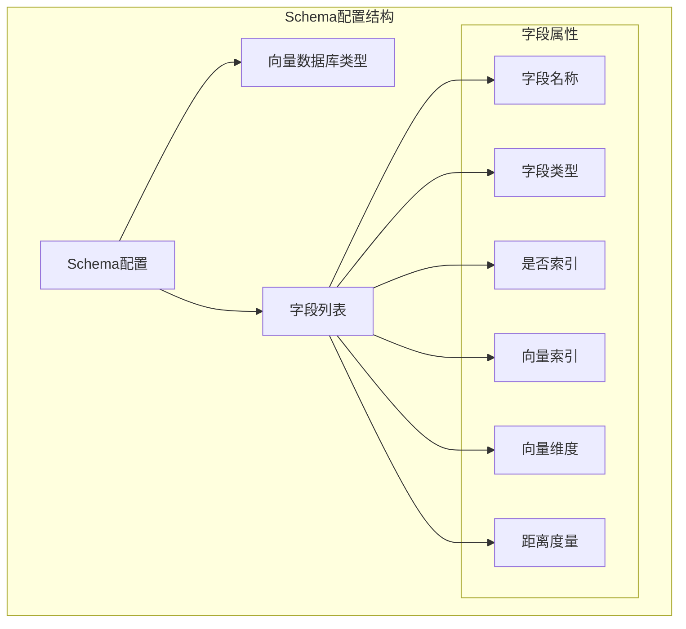
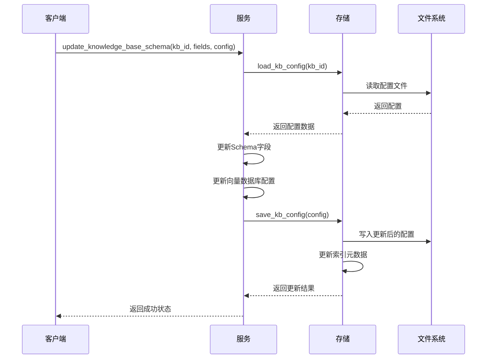

# RAG-Studio知识库服务业务逻辑文档

<cite>
**本文档引用的文件**
- [knowledge_base.py](file://backend/app/services/knowledge_base.py)
- [knowledge_base_storage.py](file://backend/app/services/knowledge_base_storage.py)
- [knowledge_base.py](file://backend/app/models/knowledge_base.py)
- [knowledge_base.py](file://backend/app/schemas/knowledge_base.py)
- [knowledge_base.py](file://backend/app/controllers/knowledge_base.py)
- [base.py](file://backend/app/models/base.py)
- [config.py](file://backend/app/config.py)
- [exceptions.py](file://backend/app/core/exceptions.py)
</cite>

## 目录
1. [概述](#概述)
2. [系统架构](#系统架构)
3. [核心组件分析](#核心组件分析)
4. [CRUD操作详解](#crud操作详解)
5. [数据持久化机制](#数据持久化机制)
6. [知识库元数据管理](#知识库元数据管理)
7. [扩展指南](#扩展指南)
8. [最佳实践](#最佳实践)
9. [故障排除](#故障排除)

## 概述

RAG-Studio知识库服务是一个基于FastAPI构建的企业级知识库管理系统，提供了完整的知识库生命周期管理功能。该服务采用分层架构设计，通过`KnowledgeBaseService`类实现核心业务逻辑，并通过`KnowledgeBaseStorageService`提供数据持久化能力。

### 主要特性

- **完整的CRUD操作**：支持知识库的创建、查询、更新、删除和统计
- **灵活的存储机制**：基于JSON文件的debug_results存储方案
- **Schema配置管理**：支持动态的字段结构和向量数据库配置
- **分页过滤**：高效的分页查询和条件筛选
- **状态管理**：完整的知识库激活/停用状态控制
- **依赖注入**：清晰的服务依赖关系设计

## 系统架构



**图表来源**
- [knowledge_base.py](file://backend/app/services/knowledge_base.py#L15-L230)
- [knowledge_base_storage.py](file://backend/app/services/knowledge_base_storage.py#L17-L359)

**章节来源**
- [knowledge_base.py](file://backend/app/services/knowledge_base.py#L1-L230)
- [knowledge_base_storage.py](file://backend/app/services/knowledge_base_storage.py#L1-L359)

## 核心组件分析

### KnowledgeBaseService 类

`KnowledgeBaseService`是知识库业务逻辑的核心类，负责协调各个组件之间的交互。

#### 类结构图



**图表来源**
- [knowledge_base.py](file://backend/app/services/knowledge_base.py#L15-L230)
- [knowledge_base_storage.py](file://backend/app/services/knowledge_base_storage.py#L17-L359)

#### 依赖注入模式

服务采用了简洁的依赖注入模式，通过构造函数注入`KnowledgeBaseStorageService`实例：

```python
def __init__(self):
    self.storage = KnowledgeBaseStorageService()
```

这种设计具有以下优势：
- **松耦合**：服务与具体存储实现解耦
- **可测试性**：便于单元测试时模拟存储服务
- **可扩展性**：支持切换不同的存储后端

**章节来源**
- [knowledge_base.py](file://backend/app/services/knowledge_base.py#L15-L230)

## CRUD操作详解

### create_knowledge_base - 知识库创建

#### ID生成机制

知识库ID采用UUID4算法生成，确保全局唯一性：

```python
kb_id = f"kb_{uuid.uuid4().hex[:12]}"
```

生成的ID格式为：`kb_<12位十六进制字符串>`，例如：`kb_1a2b3c4d5e6f`

#### 存储机制

创建操作通过以下步骤完成：

1. **ID验证**：检查生成的ID是否已存在
2. **对象创建**：基于传入数据创建`KnowledgeBase`对象
3. **Schema初始化**：如果未提供自定义Schema，则使用默认配置
4. **持久化存储**：调用存储服务保存到文件系统
5. **索引更新**：更新全局索引文件

#### 默认Schema配置

系统提供预定义的Schema字段，支持三种主要类型：

| 字段名称 | 类型 | 描述 | 特性 |
|---------|------|------|------|
| content | text | 文本内容 | 可索引，非向量 |
| embedding | dense_vector | 密集向量 | 可索引，向量索引 |
| sparse_vector | sparse_vector | 稀疏向量 | 可索引，稀疏向量索引 |

**章节来源**
- [knowledge_base.py](file://backend/app/services/knowledge_base.py#L21-L47)
- [knowledge_base_storage.py](file://backend/app/services/knowledge_base_storage.py#L92-L158)

### get_knowledge_base - 知识库查询

查询操作实现了高效的单条记录检索：



**图表来源**
- [knowledge_base.py](file://backend/app/services/knowledge_base.py#L49-L59)
- [knowledge_base_storage.py](file://backend/app/services/knowledge_base_storage.py#L160-L171)

查询逻辑特点：
- **缓存友好**：直接从文件系统读取，避免内存缓存
- **完整性保证**：只返回有效的知识库对象
- **异常处理**：不存在时返回None而非抛出异常

**章节来源**
- [knowledge_base.py](file://backend/app/services/knowledge_base.py#L49-L59)
- [knowledge_base_storage.py](file://backend/app/services/knowledge_base_storage.py#L160-L171)

### list_knowledge_bases - 分页过滤实现

分页查询支持多种筛选条件，实现高效的数据检索：

#### 查询流程



**图表来源**
- [knowledge_base.py](file://backend/app/services/knowledge_base.py#L61-L86)
- [knowledge_base_storage.py](file://backend/app/services/knowledge_base_storage.py#L173-L218)

#### 性能优化策略

1. **索引优先**：先从索引文件获取基本信息
2. **按需加载**：只有在需要时才加载完整配置
3. **内存效率**：支持大容量数据的分页处理
4. **并发友好**：过滤器独立处理，避免重复计算

**章节来源**
- [knowledge_base.py](file://backend/app/services/knowledge_base.py#L61-L86)
- [knowledge_base_storage.py](file://backend/app/services/knowledge_base_storage.py#L173-L218)

### delete_knowledge_base - 级联删除设计

删除操作遵循严格的级联删除原则：



**图表来源**
- [knowledge_base.py](file://backend/app/services/knowledge_base.py#L119-L133)
- [knowledge_base_storage.py](file://backend/app/services/knowledge_base_storage.py#L292-L312)

#### 删除策略

1. **原子性操作**：确保删除操作的完整性
2. **索引同步**：删除文件后立即更新索引
3. **错误处理**：不存在时返回False而非抛出异常
4. **扩展性**：预留了文档和向量索引删除的扩展点

**章节来源**
- [knowledge_base.py](file://backend/app/services/knowledge_base.py#L119-L133)
- [knowledge_base_storage.py](file://backend/app/services/knowledge_base_storage.py#L292-L312)

## 数据持久化机制

### KnowledgeBaseStorageService 设计

`KnowledgeBaseStorageService`实现了基于JSON文件的存储方案，采用debug_results格式进行数据组织。

#### 存储架构



**图表来源**
- [knowledge_base_storage.py](file://backend/app/services/knowledge_base_storage.py#L17-L24)
- [knowledge_base_storage.py](file://backend/app/services/knowledge_base_storage.py#L125-L143)

#### 文件命名策略

系统采用统一的文件命名规范：
- **主配置文件**：`{kb_id}.json`
- **索引文件**：`_index.json`

#### 数据格式设计

每个知识库配置包含以下核心字段：

| 字段 | 类型 | 描述 |
|------|------|------|
| id | string | 知识库唯一标识符 |
| name | string | 知识库显示名称 |
| type | string | 固定值："knowledge_bases" |
| data | dict | 知识库实际数据 |
| timestamp | int | 时间戳（毫秒） |
| metadata | dict | 元数据信息 |

**章节来源**
- [knowledge_base_storage.py](file://backend/app/services/knowledge_base_storage.py#L17-L359)

### debug_results 机制

系统采用debug_results格式进行数据存储，这种格式具有以下特点：

1. **标准化**：统一的JSON结构便于维护
2. **版本兼容**：支持未来格式升级
3. **调试友好**：便于人工查看和调试
4. **备份友好**：纯文本格式易于备份

#### 配置构建过程


**图表来源**
- [knowledge_base_storage.py](file://backend/app/services/knowledge_base_storage.py#L125-L143)

**章节来源**
- [knowledge_base_storage.py](file://backend/app/services/knowledge_base_storage.py#L17-L359)

## 知识库元数据管理

### get_knowledge_base_schema - Schema查询

Schema管理是知识库服务的重要功能，支持动态的字段结构配置。

#### Schema结构



**图表来源**
- [knowledge_base_storage.py](file://backend/app/services/knowledge_base_storage.py#L314-L320)

#### Schema查询流程

1. **文件读取**：从JSON配置文件中读取
2. **数据提取**：解析`data.schema`字段
3. **返回结果**：返回完整的Schema配置或None

**章节来源**
- [knowledge_base.py](file://backend/app/services/knowledge_base.py#L160-L170)
- [knowledge_base_storage.py](file://backend/app/services/knowledge_base_storage.py#L314-L320)

### update_knowledge_base_schema - Schema更新

Schema更新功能支持运行时调整知识库的字段结构和向量数据库配置。

#### 更新策略



**图表来源**
- [knowledge_base.py](file://backend/app/services/knowledge_base.py#L172-L191)
- [knowledge_base_storage.py](file://backend/app/services/knowledge_base_storage.py#L322-L355)

#### 支持的更新内容

| 更新类型 | 参数 | 描述 |
|----------|------|------|
| 字段配置 | schema_fields | 完整的字段列表 |
| 数据库类型 | vector_db_type | 向量数据库类型 |
| 配置参数 | vector_db_config | 数据库特定配置 |

**章节来源**
- [knowledge_base.py](file://backend/app/services/knowledge_base.py#L172-L191)
- [knowledge_base_storage.py](file://backend/app/services/knowledge_base_storage.py#L322-L355)

## 扩展指南

### 添加状态转换钩子

为了支持更复杂的状态管理，可以扩展`KnowledgeBaseService`以添加状态转换钩子：

#### 实现示例

```python
class KnowledgeBaseService:
    def __init__(self):
        self.storage = KnowledgeBaseStorageService()
        self.state_hooks = {}
    
    def register_state_hook(self, state: str, hook_func):
        """注册状态转换钩子"""
        if state not in self.state_hooks:
            self.state_hooks[state] = []
        self.state_hooks[state].append(hook_func)
    
    async def update_knowledge_base(self, kb_id: str, data: KnowledgeBaseUpdate):
        """带状态钩子的更新"""
        kb = await self.storage.get_by_id(kb_id)
        if not kb:
            return None
        
        # 检查状态变化
        old_state = kb.is_active
        update_data = data.model_dump(exclude_unset=True)
        
        # 执行更新
        for field, value in update_data.items():
            setattr(kb, field, value)
        
        # 执行状态钩子
        if 'is_active' in update_data:
            new_state = update_data['is_active']
            if old_state != new_state and new_state in self.state_hooks:
                for hook in self.state_hooks[new_state]:
                    await hook(kb_id, old_state, new_state)
        
        # 保存更新
        await self.storage.update(kb_id, kb)
        return kb
```

### 实现自定义存储适配器

#### 存储接口设计

```python
from abc import ABC, abstractmethod
from typing import List, Optional, Dict, Any

class KnowledgeBaseStorageInterface(ABC):
    """知识库存储接口"""
    
    @abstractmethod
    async def create(self, kb: KnowledgeBase, schema_fields: Optional[List[Dict]] = None) -> KnowledgeBase:
        """创建知识库"""
        pass
    
    @abstractmethod
    async def get_by_id(self, kb_id: str) -> Optional[KnowledgeBase]:
        """根据ID获取知识库"""
        pass
    
    @abstractmethod
    async def get_all(self, skip: int = 0, limit: int = 100, filters: Optional[Dict] = None) -> List[KnowledgeBase]:
        """获取所有知识库"""
        pass
    
    @abstractmethod
    async def update(self, kb_id: str, kb: KnowledgeBase, schema_fields: Optional[List[Dict]] = None) -> Optional[KnowledgeBase]:
        """更新知识库"""
        pass
    
    @abstractmethod
    async def delete(self, kb_id: str) -> bool:
        """删除知识库"""
        pass
    
    @abstractmethod
    async def count(self, filters: Optional[Dict] = None) -> int:
        """统计数量"""
        pass
    
    @abstractmethod
    async def get_schema(self, kb_id: str) -> Optional[Dict]:
        """获取Schema"""
        pass
    
    @abstractmethod
    async def update_schema(self, kb_id: str, schema_fields: List[Dict], 
                          vector_db_type: Optional[str] = None, 
                          vector_db_config: Optional[Dict] = None) -> bool:
        """更新Schema"""
        pass
```

#### MySQL存储适配器实现

```python
class MySQLKnowledgeBaseStorage(KnowledgeBaseStorageInterface):
    """MySQL存储适配器"""
    
    def __init__(self, db_connection):
        self.db = db_connection
    
    async def create(self, kb: KnowledgeBase, schema_fields: Optional[List[Dict]] = None):
        """MySQL创建实现"""
        query = """
        INSERT INTO knowledge_bases 
        (id, name, description, config, schema_config, created_at, updated_at)
        VALUES (%s, %s, %s, %s, %s, NOW(), NOW())
        """
        
        config_json = json.dumps(kb.model_dump())
        schema_json = json.dumps({"fields": schema_fields or [], "type": kb.vector_db_type})
        
        await self.db.execute(query, (
            kb.id, kb.name, kb.description, config_json, schema_json
        ))
        
        return kb
    
    async def get_by_id(self, kb_id: str):
        """MySQL查询实现"""
        query = """
        SELECT id, name, description, config, schema_config 
        FROM knowledge_bases 
        WHERE id = %s AND deleted_at IS NULL
        """
        
        result = await self.db.fetch_one(query, (kb_id,))
        if not result:
            return None
        
        kb_data = json.loads(result['config'])
        kb_data.pop('schema', None)  # 移除schema字段
        
        return KnowledgeBase(**kb_data)
```

### 集成新存储后端

#### 配置切换机制

```python
class KnowledgeBaseService:
    def __init__(self, storage_type: str = "json"):
        if storage_type == "mysql":
            self.storage = MySQLKnowledgeBaseStorage(db_connection)
        else:
            self.storage = KnowledgeBaseStorageService()
```

#### 配置文件支持

```python
# 在config.py中添加存储配置
class Settings(BaseSettings):
    STORAGE_TYPE: str = Field(default="json", description="存储类型: json 或 mysql")
    STORAGE_CONFIG: Dict[str, Any] = Field(default_factory=dict, description="存储配置")
```

## 最佳实践

### 性能优化建议

1. **批量操作**：对于大量数据的操作，考虑使用批量处理
2. **缓存策略**：对频繁访问的配置信息实施缓存
3. **索引优化**：合理设计索引字段，避免全表扫描
4. **异步处理**：利用异步特性提高并发性能

### 错误处理策略

```python
class KnowledgeBaseService:
    async def safe_operation(self, operation_func, *args, **kwargs):
        """安全的操作包装器"""
        try:
            return await operation_func(*args, **kwargs)
        except ConflictException as e:
            # 处理冲突情况
            logger.warning(f"Conflict during operation: {e}")
            raise
        except InternalServerException as e:
            # 处理服务器错误
            logger.error(f"Server error during operation: {e}")
            raise
        except Exception as e:
            # 处理未知错误
            logger.error(f"Unexpected error: {e}")
            raise InternalServerException(message="操作失败，请稍后重试")
```

### 数据一致性保证

1. **事务支持**：对于关键操作，确保数据库事务支持
2. **幂等性**：设计操作时考虑幂等性要求
3. **回滚机制**：实现必要的回滚逻辑
4. **监控告警**：建立完善的监控和告警机制

## 故障排除

### 常见问题及解决方案

#### 1. 知识库创建失败

**症状**：创建知识库时抛出`ConflictException`

**原因**：知识库ID已存在

**解决方案**：
- 检查ID生成逻辑
- 验证索引文件完整性
- 清理重复的配置文件

#### 2. 查询性能问题

**症状**：分页查询响应缓慢

**原因**：索引文件过大或过滤器效率低

**解决方案**：
- 优化索引结构
- 实施查询缓存
- 调整分页大小

#### 3. 存储空间不足

**症状**：文件系统空间耗尽

**解决方案**：
- 定期清理旧的配置文件
- 实施归档策略
- 监控存储使用情况

### 调试工具

#### 配置验证脚本

```python
async def validate_knowledge_base_config(kb_id: str):
    """验证知识库配置的有效性"""
    service = KnowledgeBaseService()
    
    # 验证基本配置
    kb = await service.get_knowledge_base(kb_id)
    if not kb:
        return {"valid": False, "error": "知识库不存在"}
    
    # 验证Schema配置
    schema = await service.get_knowledge_base_schema(kb_id)
    if not schema:
        return {"valid": False, "error": "Schema配置缺失"}
    
    # 验证向量数据库配置
    if not kb.vector_db_config:
        return {"valid": False, "error": "向量数据库配置缺失"}
    
    return {"valid": True, "message": "配置有效"}
```

#### 性能监控

```python
import time
from functools import wraps

def monitor_performance(func):
    """性能监控装饰器"""
    @wraps(func)
    async def wrapper(*args, **kwargs):
        start_time = time.time()
        try:
            result = await func(*args, **kwargs)
            duration = time.time() - start_time
            logger.info(f"{func.__name__} took {duration:.2f}s")
            return result
        except Exception as e:
            duration = time.time() - start_time
            logger.error(f"{func.__name__} failed after {duration:.2f}s: {e}")
            raise
    return wrapper
```

**章节来源**
- [exceptions.py](file://backend/app/core/exceptions.py#L1-L144)
- [knowledge_base.py](file://backend/app/services/knowledge_base.py#L195-L230)

## 结论

RAG-Studio知识库服务通过精心设计的分层架构，提供了完整而灵活的知识库管理解决方案。其核心优势包括：

1. **清晰的职责分离**：服务层专注于业务逻辑，存储层负责数据持久化
2. **灵活的扩展性**：支持多种存储后端和自定义钩子
3. **完善的错误处理**：基于异常的错误处理机制
4. **良好的可维护性**：模块化设计便于理解和维护

通过本文档提供的扩展指南和最佳实践，开发者可以轻松地根据具体需求定制和扩展知识库服务的功能，构建更加符合业务场景的解决方案。