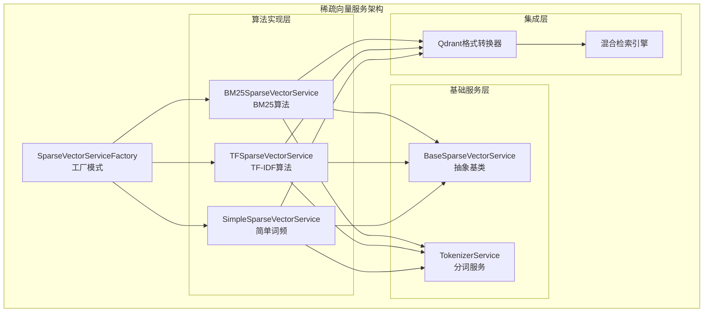
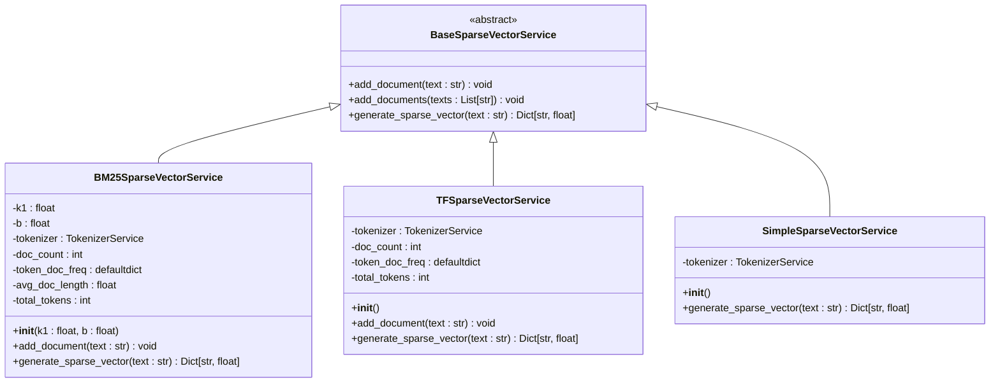
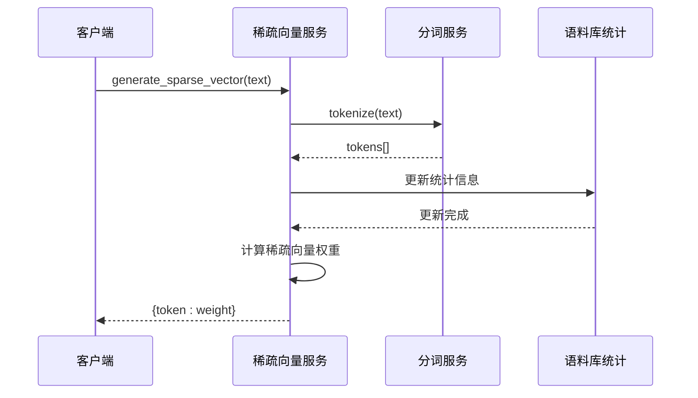
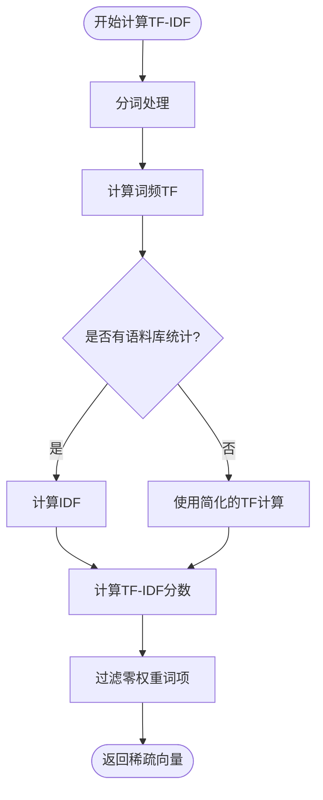
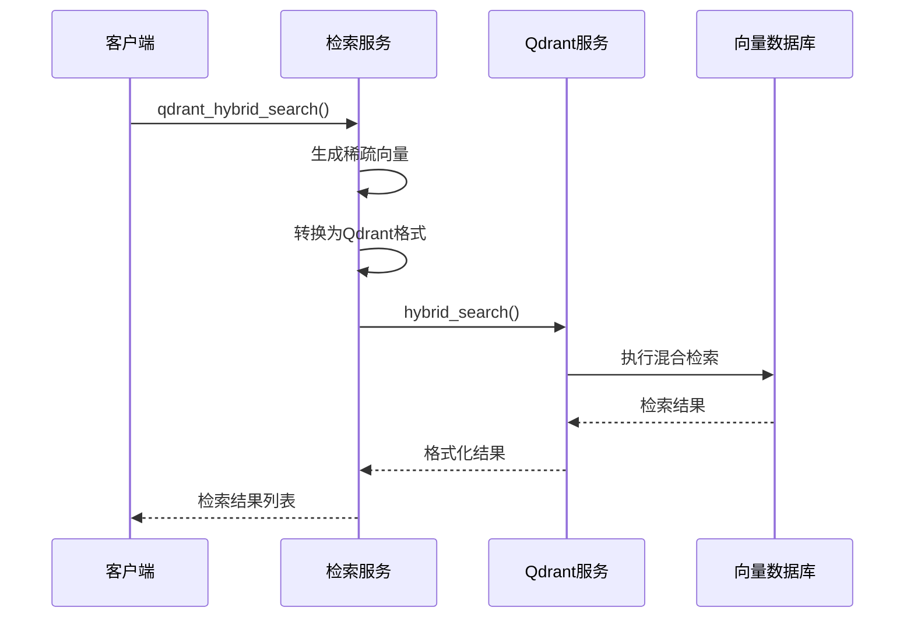
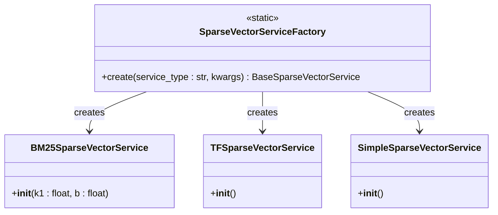
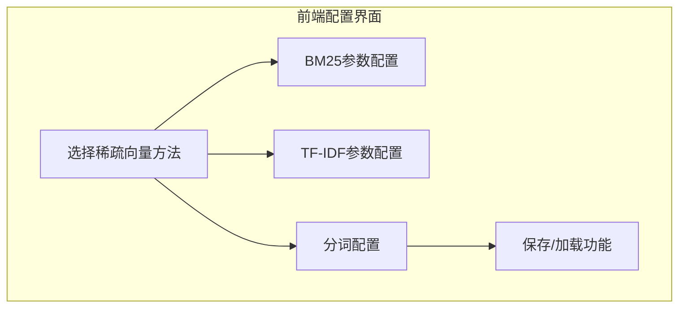
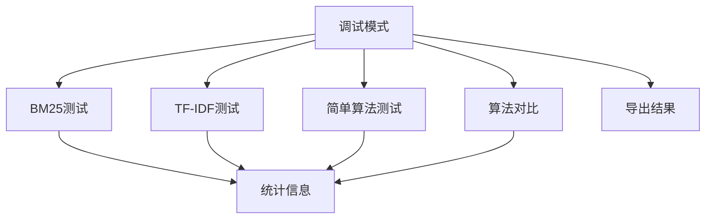

# 稀疏向量服务算法文档

<cite>
**本文档引用的文件**
- [sparse_vector_service.py](file://backend/app/services/sparse_vector_service.py)
- [tokenizer_service.py](file://backend/app/services/tokenizer_service.py)
- [retrieval_service.py](file://backend/app/services/retrieval_service.py)
- [vector_db_service.py](file://backend/app/services/vector_db_service.py)
- [debug_pipeline.py](file://backend/app/controllers/debug_pipeline.py)
- [test_sparse_vector_simple.py](file://test_sparse_vector_simple.py)
- [document-tokenization.tsx](file://web/components/views/document-tokenization.tsx)
</cite>

## 目录
1. [简介](#简介)
2. [系统架构概览](#系统架构概览)
3. [核心组件分析](#核心组件分析)
4. [BM25算法详解](#bm25算法详解)
5. [TF-IDF算法详解](#tf-idf算法详解)
6. [稀疏向量生成方法对比](#稀疏向量生成方法对比)
7. [Qdrant原生混合检索集成](#qdrant原生混合检索集成)
8. [工厂模式设计](#工厂模式设计)
9. [扩展指南](#扩展指南)
10. [性能优化建议](#性能优化建议)
11. [故障排除](#故障排除)

## 简介

RAG-Studio的稀疏向量服务是一个强大的文本表示生成系统，支持多种稀疏向量生成算法，包括BM25、TF-IDF、简单词频等方法。该服务专门为混合检索场景设计，能够与Qdrant向量数据库无缝集成，提供高效的语义和关键词检索能力。

稀疏向量是一种高维向量表示，其中大部分元素为零，只有少数非零元素携带重要信息。这种表示方式特别适合关键词检索和混合检索场景，在保持语义理解能力的同时，能够精确捕捉文本的关键词特征。

## 系统架构概览

稀疏向量服务采用模块化设计，主要包含以下核心组件：



**图表来源**
- [sparse_vector_service.py](file://backend/app/services/sparse_vector_service.py#L14-L331)

**章节来源**
- [sparse_vector_service.py](file://backend/app/services/sparse_vector_service.py#L1-L331)

## 核心组件分析

### 抽象基类设计

BaseSparseVectorService定义了稀疏向量服务的标准接口，确保所有具体实现都遵循统一的规范：



**图表来源**
- [sparse_vector_service.py](file://backend/app/services/sparse_vector_service.py#L14-L270)

### 分词服务集成

稀疏向量服务依赖于TokenizerService进行文本预处理，支持多种分词模式和停用词过滤：



**图表来源**
- [sparse_vector_service.py](file://backend/app/services/sparse_vector_service.py#L11-L13)
- [tokenizer_service.py](file://backend/app/services/tokenizer_service.py#L1-L49)

**章节来源**
- [sparse_vector_service.py](file://backend/app/services/sparse_vector_service.py#L14-L270)
- [tokenizer_service.py](file://backend/app/services/tokenizer_service.py#L1-L275)

## BM25算法详解

BM25（Best Matching 25）是一种经典的排序函数，广泛应用于信息检索领域。它结合了词频（TF）和逆文档频率（IDF）的概念，同时考虑了文档长度的影响。

### 算法原理

BM25的核心公式为：
```
BM25(t,D) = IDF(t) × TF(t,D) / [TF(t,D) + k1 × (1 - b + b × |D| / avgdl)]
```

其中：
- `t` 是查询词项
- `D` 是文档
- `IDF(t)` 是逆文档频率
- `TF(t,D)` 是词频
- `k1` 控制词频饱和度
- `b` 控制文档长度归一化
- `|D|` 是文档长度
- `avgdl` 是平均文档长度

### 参数调优

BM25算法的关键参数：

| 参数 | 默认值 | 作用 | 调优建议 |
|------|--------|------|----------|
| k1 | 1.5 | 控制词频饱和度 | 较大值（2.0-3.0）适用于短文档，较小值（1.0-1.5）适用于长文档 |
| b | 0.75 | 控制文档长度归一化 | 0.5-0.9之间，0.75是经验推荐值 |

### 词频计算逻辑

BM25的词频计算包含两个阶段：

1. **标准BM25计算**（有语料库统计时）：
   ```python
   # 计算IDF
   idf = log((N - doc_freq + 0.5) / (doc_freq + 0.5) + 1.0)
   
   # 计算TF
   norm_tf = (tf * (k1 + 1)) / (tf + k1 * (1 - b + b * doc_length / avg_doc_length))
   
   # BM25分数
   score = idf * norm_tf
   ```

2. **简化BM25计算**（调试模式）：
   当没有语料库统计时，使用单文档语料库进行简化计算。

### 性能特点

BM25算法的优势：
- **文档长度适应性**：通过参数b自动适应不同长度的文档
- **词频饱和**：参数k1防止高频词过度影响检索结果
- **语料库感知**：利用整个语料库统计提升检索质量

**章节来源**
- [sparse_vector_service.py](file://backend/app/services/sparse_vector_service.py#L51-L156)

## TF-IDF算法详解

TF-IDF（Term Frequency-Inverse Document Frequency）是一种传统的文本表示方法，通过词频和逆文档频率的乘积来衡量词项的重要性。

### 算法原理

TF-IDF的核心公式：
```
TF-IDF(t,D) = TF(t,D) × IDF(t)
```

其中：
- `TF(t,D)` = t在D中出现的次数 / D中总词数
- `IDF(t)` = log(总文档数 / 包含t的文档数)

### 计算流程



**图表来源**
- [sparse_vector_service.py](file://backend/app/services/sparse_vector_service.py#L199-L243)

### 语料库统计管理

TF-IDF服务维护以下统计信息：
- `doc_count`: 文档总数
- `token_doc_freq`: 每个词项在多少文档中出现
- `total_tokens`: 总词数（用于调试模式）

### 调试模式处理

当没有语料库统计时，TF-IDF使用简化的计算方式：
```python
# 调试模式：只使用TF权重
tf = freq / doc_length if doc_length > 0 else 0
```

这种方式虽然精度较低，但保证了算法的基本功能。

**章节来源**
- [sparse_vector_service.py](file://backend/app/services/sparse_vector_service.py#L159-L243)

## 稀疏向量生成方法对比

不同稀疏向量生成方法的特点和适用场景：

| 方法 | 优势 | 劣势 | 适用场景 |
|------|------|------|----------|
| BM25 | 文档长度适应性强，参数可调 | 计算复杂度较高 | 长文档检索，需要精确控制检索行为 |
| TF-IDF | 简单高效，易于理解 | 忽略文档长度差异 | 短文档检索，快速原型开发 |
| 简单词频 | 最简单，速度最快 | 缺乏语义信息 | 基础关键词匹配，性能要求极高 |

### 性能对比

```mermaid
graph LR
subgraph "计算复杂度"
Simple[简单词频<br/>O(n)]
TFIDF[TF-IDF<br/>O(n + m)]
BM25[BM25<br/>O(n + m)]
end
subgraph "内存使用"
SimpleMem[低内存占用]
TFIDFMem[中等内存占用]
BM25Mem[较高内存占用]
end
Simple --> SimpleMem
TFIDF --> TFIDFMem
BM25 --> BM25Mem
```

**图表来源**
- [sparse_vector_service.py](file://backend/app/services/sparse_vector_service.py#L246-L270)

**章节来源**
- [sparse_vector_service.py](file://backend/app/services/sparse_vector_service.py#L159-L270)

## Qdrant原生混合检索集成

RAG-Studio的稀疏向量服务与Qdrant的原生混合检索功能深度集成，提供高效的稠密向量和稀疏向量联合检索能力。

### 集成架构



**图表来源**
- [retrieval_service.py](file://backend/app/services/retrieval_service.py#L324-L454)
- [vector_db_service.py](file://backend/app/services/vector_db_service.py#L652-L774)

### Qdrant格式转换

稀疏向量需要转换为Qdrant兼容的格式：

```mermaid
flowchart TD
SparseVec[稀疏向量<br/>{token: weight}] --> TokenMap["生成token到ID映射"]
TokenMap --> CheckMapping{"是否有映射表?"}
CheckMapping --> |否| HashMapping["使用hash值生成ID"]
CheckMapping --> |是| UseMapping["使用现有映射"]
HashMapping --> ExtractPairs["提取(indices, values)"]
UseMapping --> ExtractPairs
ExtractPairs --> ValidateWeights["验证权重有效性"]
ValidateWeights --> QdrantFormat["Qdrant格式输出"]
```

**图表来源**
- [sparse_vector_service.py](file://backend/app/services/sparse_vector_service.py#L304-L331)

### 混合检索策略

系统支持两种混合检索策略：

1. **原生Qdrant混合检索**（推荐）：
   - 利用Qdrant的原生混合检索功能
   - 支持RRF和DBSF融合方法
   - 更高的性能和更好的结果质量

2. **传统混合检索**：
   - 分别执行向量检索和关键词检索
   - 使用RRF算法融合结果
   - 兼容性更好

### 融合方法选择

| 融合方法 | 特点 | 适用场景 |
|----------|------|----------|
| RRF (Reciprocal Rank Fusion) | 平衡向量和关键词检索 | 通用场景，结果均衡 |
| DBSF (Differentiated Bounded Score Fusion) | 偏向高分结果 | 对检索精度要求较高 |

**章节来源**
- [retrieval_service.py](file://backend/app/services/retrieval_service.py#L324-L492)
- [vector_db_service.py](file://backend/app/services/vector_db_service.py#L652-L774)
- [debug_pipeline.py](file://backend/app/controllers/debug_pipeline.py#L1202-L1296)

## 工厂模式设计

SparseVectorServiceFactory采用工厂模式，提供灵活的服务实例创建机制。

### 工厂实现



**图表来源**
- [sparse_vector_service.py](file://backend/app/services/sparse_vector_service.py#L272-L301)

### 支持的服务类型

| 服务类型 | 参数 | 描述 |
|----------|------|------|
| "bm25" | k1, b | BM25算法，支持参数调优 |
| "tf-idf" | 无 | TF-IDF算法，简单高效 |
| "tf" | 无 | TF算法，TF-IDF的简化版 |
| "simple" | 无 | 简单词频算法 |
| "splade" | 无 | SPLADE算法（暂未实现） |

### 错误处理

工厂模式提供完善的错误处理：
```python
if service_type not in ["bm25", "tf-idf", "tf", "simple", "splade"]:
    raise ValueError(f"不支持的稀疏向量服务类型: {service_type}")
```

**章节来源**
- [sparse_vector_service.py](file://backend/app/services/sparse_vector_service.py#L272-L301)

## 扩展指南

### 添加新的稀疏向量算法

要添加新的稀疏向量算法，需要遵循以下步骤：

1. **继承抽象基类**：
```python
class NewSparseVectorService(BaseSparseVectorService):
    def __init__(self, **kwargs):
        # 初始化参数
        pass
    
    def generate_sparse_vector(self, text: str) -> Dict[str, float]:
        # 实现算法逻辑
        pass
```

2. **更新工厂类**：
```python
elif service_type == "new-algorithm":
    return NewSparseVectorService(**kwargs)
```

3. **添加测试用例**：
参考现有的测试文件结构，为新算法编写测试。

### 优化现有算法

#### 性能优化建议

1. **缓存机制**：
```python
class OptimizedBM25Service(BM25SparseVectorService):
    def __init__(self):
        super().__init__()
        self._cache = {}
    
    def generate_sparse_vector(self, text: str):
        # 实现缓存逻辑
        if text in self._cache:
            return self._cache[text]
        
        result = self._compute_vector(text)
        self._cache[text] = result
        return result
```

2. **批量处理**：
```python
def batch_generate_vectors(self, texts: List[str]) -> List[Dict[str, float]]:
    # 批量处理多个文本
    return [self.generate_sparse_vector(text) for text in texts]
```

#### 算法改进方向

1. **SPLADE算法实现**：
目前SPLADE使用简单稀疏向量服务作为占位符，可以替换为真正的SPLADE模型实现。

2. **深度学习模型集成**：
集成BERT等预训练模型生成的稀疏向量。

3. **领域特定优化**：
针对特定领域的文本特征进行算法优化。

### Web界面集成

前端组件提供了丰富的配置选项：



**图表来源**
- [document-tokenization.tsx](file://web/components/views/document-tokenization.tsx#L515-L590)

**章节来源**
- [sparse_vector_service.py](file://backend/app/services/sparse_vector_service.py#L272-L301)
- [document-tokenization.tsx](file://web/components/views/document-tokenization.tsx#L10-L40)

## 性能优化建议

### 算法层面优化

1. **参数调优**：
   - 根据具体应用场景调整BM25参数
   - 在生产环境中进行A/B测试确定最佳参数

2. **内存管理**：
   - 及时清理不需要的语料库统计信息
   - 使用弱引用避免内存泄漏

3. **计算优化**：
   - 对于大规模语料库，考虑使用近似算法
   - 实现增量更新机制

### 系统层面优化

1. **并发处理**：
   - 使用异步处理生成稀疏向量
   - 实现批量处理接口

2. **缓存策略**：
   - 缓存频繁查询的稀疏向量
   - 实现智能缓存淘汰算法

3. **分布式部署**：
   - 将语料库统计分布到多个节点
   - 实现稀疏向量服务的水平扩展

### 监控和诊断

建议监控以下指标：
- 稀疏向量生成时间
- 内存使用情况
- Qdrant混合检索性能
- 不同算法的召回率和准确率

## 故障排除

### 常见问题及解决方案

#### 1. 稀疏向量为空

**症状**：生成的稀疏向量为空字典

**原因**：
- 输入文本过短或全是停用词
- 分词服务配置错误
- 语料库统计不完整

**解决方案**：
```python
# 检查输入文本
if not text.strip():
    return {}

# 检查分词结果
tokens = self.tokenizer.tokenize(text)
if not tokens:
    return {}
```

#### 2. Qdrant混合检索失败

**症状**：混合检索返回空结果或抛出异常

**原因**：
- Qdrant客户端版本不兼容
- 向量格式转换错误
- 数据库连接问题

**解决方案**：
```python
try:
    # 检查向量格式
    indices, values = convert_sparse_vector_to_qdrant_format(sparse_vector)
except Exception as e:
    logger.error(f"向量格式转换失败: {e}")
    return []
```

#### 3. 性能问题

**症状**：稀疏向量生成或检索响应缓慢

**解决方案**：
- 启用缓存机制
- 优化分词配置
- 调整Qdrant查询参数

### 调试工具

系统提供了丰富的调试功能：



**图表来源**
- [test_sparse_vector_simple.py](file://test_sparse_vector_simple.py#L19-L51)

**章节来源**
- [test_sparse_vector_simple.py](file://test_sparse_vector_simple.py#L1-L108)
- [sparse_vector_service.py](file://backend/app/services/sparse_vector_service.py#L304-L331)

## 结论

RAG-Studio的稀疏向量服务提供了一个强大而灵活的文本表示生成平台。通过支持多种算法、与Qdrant的深度集成以及完善的工厂模式设计，该系统能够满足各种检索场景的需求。

未来的发展方向包括：
- 实现更先进的稀疏向量算法（如SPLADE）
- 集成深度学习模型
- 优化大规模部署性能
- 增强监控和诊断功能

开发者可以通过扩展算法、优化性能和集成新的功能来进一步增强系统的实用性。