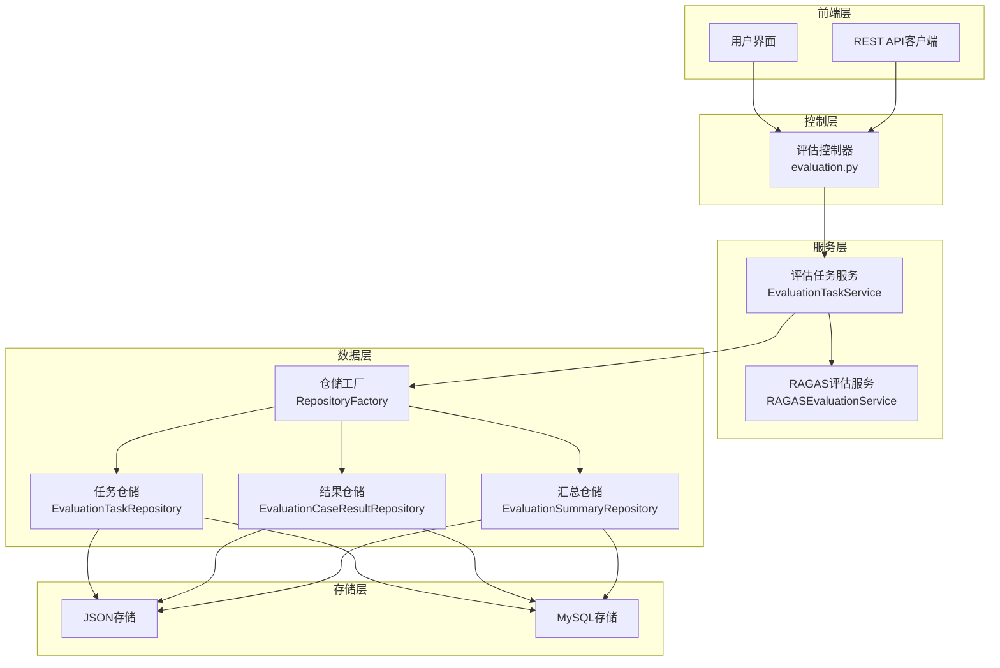
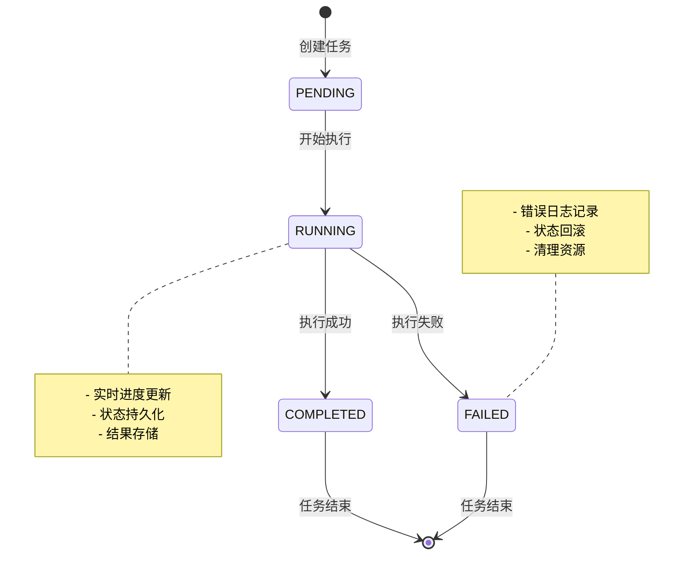
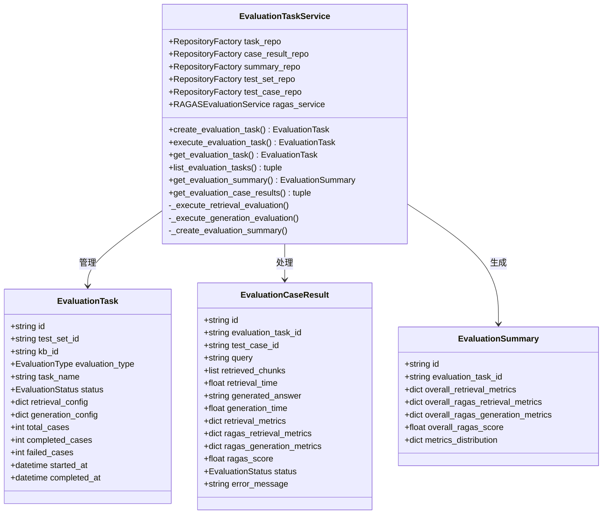
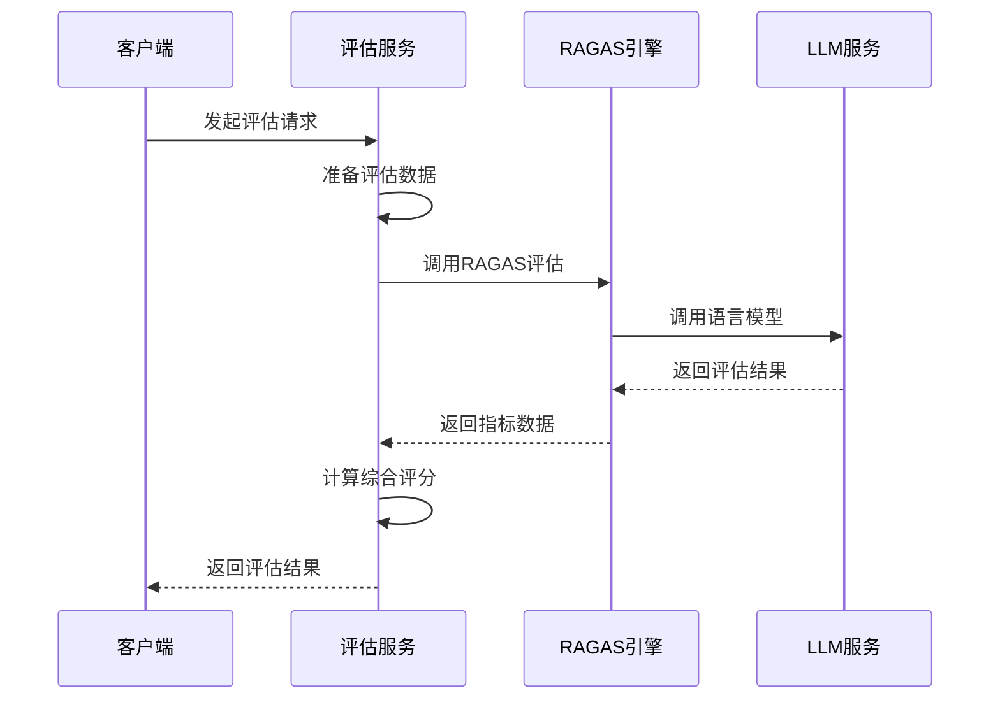
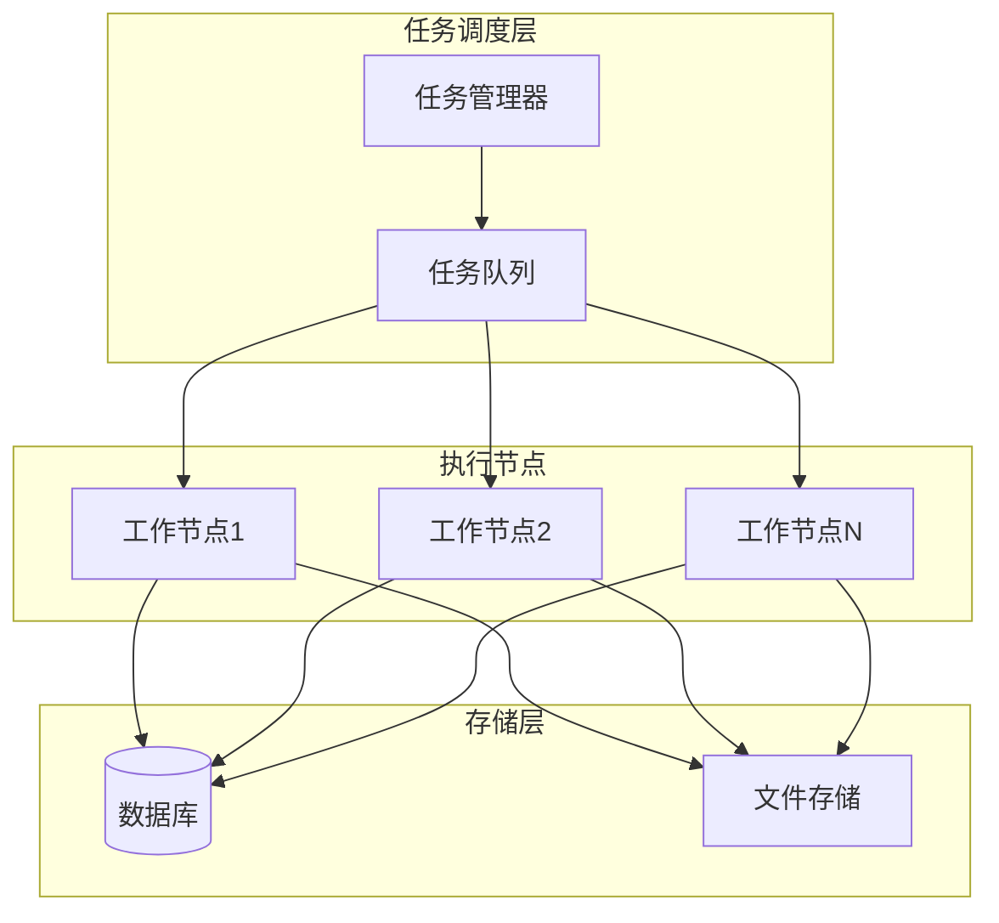
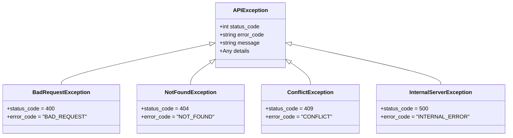

# 评估任务服务

<cite>
**本文档引用的文件**
- [evaluation_task.py](file://backend/app/services/evaluation_task.py)
- [evaluation.py](file://backend/app/controllers/evaluation.py)
- [evaluation.py](file://backend/app/models/evaluation.py)
- [config.py](file://backend/app/config.py)
- [factory.py](file://backend/app/repositories/factory.py)
- [ragas_evaluation.py](file://backend/app/services/ragas_evaluation.py)
- [exceptions.py](file://backend/app/core/exceptions.py)
- [requirements.txt](file://backend/requirements.txt)
</cite>

## 目录
1. [简介](#简介)
2. [系统架构](#系统架构)
3. [评估任务生命周期](#评估任务生命周期)
4. [核心组件分析](#核心组件分析)
5. [异步任务队列集成](#异步任务队列集成)
6. [错误处理与重试机制](#错误处理与重试机制)
7. [性能优化策略](#性能优化策略)
8. [扩展指南](#扩展指南)
9. [最佳实践](#最佳实践)
10. [故障排除](#故障排除)

## 简介

RAG-Studio评估任务管理系统是一个基于FastAPI构建的高性能评估服务，专门用于自动化RAG（检索增强生成）系统的评估。该系统支持两种主要的评估类型：检索器评估（RETRIEVAL）和生成器评估（GENERATION），并提供了完整的任务生命周期管理功能。

### 主要特性

- **双评估类型支持**：同时支持检索器和生成器的自动化评估
- **异步任务处理**：基于Python异步IO的高效任务执行
- **灵活的存储抽象**：支持JSON文件和MySQL两种存储方式
- **智能错误处理**：完善的异常捕获和恢复机制
- **实时进度跟踪**：详细的评估进度和状态监控
- **RAGAS集成**：深度集成RAGAS框架进行专业评估

## 系统架构

评估任务服务采用分层架构设计，遵循MVC模式，确保代码的可维护性和扩展性。



**架构图来源**
- [evaluation.py](file://backend/app/controllers/evaluation.py#L1-L50)
- [evaluation_task.py](file://backend/app/services/evaluation_task.py#L26-L50)
- [factory.py](file://backend/app/repositories/factory.py#L17-L116)

## 评估任务生命周期

评估任务的完整生命周期包括创建、初始化、执行、监控和完成五个阶段。



### 任务状态管理

系统定义了四种任务状态，每种状态都有明确的含义和处理逻辑：

| 状态 | 描述 | 可执行操作 |
|------|------|------------|
| PENDING | 待执行状态 | 可以开始执行 |
| RUNNING | 执行中状态 | 正在处理测试用例 |
| COMPLETED | 已完成状态 | 生成最终报告 |
| FAILED | 失败状态 | 记录错误信息 |

**生命周期来源**
- [evaluation.py](file://backend/app/models/evaluation.py#L19-L25)
- [evaluation_task.py](file://backend/app/services/evaluation_task.py#L95-L177)

## 核心组件分析

### 评估任务服务（EvaluationTaskService）

评估任务服务是整个系统的核心，负责协调各个子系统的协作。



**类图来源**
- [evaluation_task.py](file://backend/app/services/evaluation_task.py#L26-L607)
- [evaluation.py](file://backend/app/models/evaluation.py#L27-L179)

### 评估类型支持

系统支持两种主要的评估类型，每种类型都有专门的处理逻辑：

#### 检索器评估（RETRIEVAL）
- **目标**：评估检索系统的准确性
- **指标**：精确率、召回率、F1分数、RAGAS指标
- **流程**：查询 → 检索 → 评估 → 结果存储

#### 生成器评估（GENERATION）
- **目标**：评估生成内容的质量
- **指标**：忠实度、相关性、相似度、正确性
- **流程**：检索 → 生成 → 评估 → 结果存储

**组件分析来源**
- [evaluation_task.py](file://backend/app/services/evaluation_task.py#L179-L485)

### RAGAS评估集成

RAGAS评估服务提供了专业的评估指标计算能力，支持多种评估维度。



**序列图来源**
- [ragas_evaluation.py](file://backend/app/services/ragas_evaluation.py#L191-L598)

## 异步任务队列集成

虽然当前实现中评估任务是同步执行的，但系统设计考虑了异步任务队列的集成需求。

### 当前实现分析

目前的评估任务执行是同步的，存在以下限制：

```python
# 当前实现的问题
@router.post("/tasks/{task_id}/execute")
async def execute_evaluation_task():
    # 这里会阻塞，实际应该使用后台任务
    task = await evaluation_service.execute_evaluation_task(task_id)
```

### 推荐的异步集成方案

为了支持大规模评估任务，建议集成以下异步任务队列系统：

#### Celery集成方案

```python
# 示例：Celery任务定义
from celery import Celery
from app.services.evaluation_task import EvaluationTaskService

app = Celery('evaluation_tasks', broker='redis://localhost:6379')

@app.task(bind=True, max_retries=3)
def execute_evaluation_task_async(self, task_id: str, save_detailed_results: bool = True):
    try:
        service = EvaluationTaskService()
        return service.execute_evaluation_task(task_id, save_detailed_results)
    except Exception as e:
        self.retry(exc=e, countdown=60)  # 重试策略
```

#### 内置异步队列方案

利用Python的asyncio特性实现轻量级队列：

```python
# 示例：异步队列管理
import asyncio
from collections import deque

class AsyncTaskQueue:
    def __init__(self):
        self.queue = deque()
        self.semaphore = asyncio.Semaphore(10)  # 最大并发数
    
    async def enqueue(self, task_func, *args, **kwargs):
        async with self.semaphore:
            return await task_func(*args, **kwargs)
```

### 分布式任务调度

对于大规模部署，可以考虑以下分布式架构：



**异步集成来源**
- [evaluation.py](file://backend/app/controllers/evaluation.py#L84-L124)
- [evaluation_task.py](file://backend/app/services/evaluation_task.py#L95-L177)

## 错误处理与重试机制

系统实现了多层次的错误处理和重试机制，确保评估任务的可靠性。

### 异常层次结构



**异常层次来源**
- [exceptions.py](file://backend/app/core/exceptions.py#L12-L144)

### 错误处理策略

#### 1. 任务级别错误处理

```python
# 任务执行中的错误处理
try:
    # 执行评估任务
    task = await self.execute_evaluation_task(task_id)
except Exception as e:
    logger.error(f"执行评估任务失败: {e}", exc_info=True)
    task.status = EvaluationStatus.FAILED
    await self.task_repo.update(task_id, task)
    raise
```

#### 2. 测试用例级别错误处理

```python
# 单个测试用例的错误处理
for test_case in test_cases:
    try:
        # 执行具体评估逻辑
        pass
    except Exception as e:
        logger.error(f"评估测试用例失败 {test_case.id}: {e}", exc_info=True)
        # 记录失败结果而不中断整个任务
        failed_count += 1
        await self._record_failed_case(task, test_case, e)
```

#### 3. 超时处理机制

```python
# 超时处理示例
async def execute_with_timeout(task_func, timeout_seconds=300):
    try:
        return await asyncio.wait_for(task_func(), timeout=timeout_seconds)
    except asyncio.TimeoutError:
        logger.warning(f"任务执行超时: {timeout_seconds}秒")
        raise TimeoutException("评估任务执行超时")
```

### 重试策略

#### 指数退避重试

```python
import asyncio
from functools import wraps

def retry_with_backoff(max_retries=3, base_delay=1, max_delay=60):
    def decorator(func):
        @wraps(func)
        async def wrapper(*args, **kwargs):
            delay = base_delay
            for attempt in range(max_retries):
                try:
                    return await func(*args, **kwargs)
                except Exception as e:
                    if attempt == max_retries - 1:
                        raise
                    
                    logger.warning(f"重试 {attempt + 1}/{max_retries}: {e}")
                    await asyncio.sleep(delay)
                    delay = min(delay * 2, max_delay)
        return wrapper
    return decorator
```

**错误处理来源**
- [evaluation_task.py](file://backend/app/services/evaluation_task.py#L171-L177)
- [exceptions.py](file://backend/app/core/exceptions.py#L122-L144)

## 性能优化策略

### 并行处理优化

系统支持多个测试用例的并行处理，提高评估效率：

```python
# 并行处理测试用例
async def _process_test_cases_parallel(self, test_cases, batch_size=10):
    results = []
    for i in range(0, len(test_cases), batch_size):
        batch = test_cases[i:i + batch_size]
        tasks = [self._process_single_case(case) for case in batch]
        batch_results = await asyncio.gather(*tasks, return_exceptions=True)
        results.extend(batch_results)
    return results
```

### 内存管理优化

```python
# 大数据集的流式处理
async def _stream_process_large_dataset(self, dataset, processor_func):
    buffer = []
    for item in dataset:
        buffer.append(item)
        if len(buffer) >= 1000:  # 缓冲区大小
            yield await processor_func(buffer)
            buffer.clear()
    
    if buffer:
        yield await processor_func(buffer)
```

### 数据库连接优化

```python
# 连接池配置
from sqlalchemy.ext.asyncio import create_async_engine, AsyncSession

engine = create_async_engine(
    DATABASE_URL,
    pool_pre_ping=True,
    pool_recycle=3600,
    pool_timeout=30,
    max_overflow=10
)
```

## 扩展指南

### 添加新的评估类型

要添加新的评估类型，需要以下步骤：

#### 1. 定义新的评估类型枚举

```python
class EvaluationType(str, Enum):
    RETRIEVAL = "retrieval"
    GENERATION = "generation"
    CUSTOM_EVALUATION = "custom"  # 新增类型
```

#### 2. 实现对应的评估逻辑

```python
async def _execute_custom_evaluation(self, task, test_set, test_cases, save_detailed_results):
    """执行自定义评估"""
    # 实现具体的评估逻辑
    pass
```

#### 3. 更新主执行流程

```python
if task.evaluation_type == EvaluationType.CUSTOM_EVALUATION:
    await self._execute_custom_evaluation(task, test_set, test_cases, save_detailed_results)
```

### 集成第三方评估服务

```python
class ThirdPartyEvaluationService:
    def __init__(self, api_key: str):
        self.api_key = api_key
        self.session = httpx.AsyncClient()
    
    async def evaluate(self, queries: List[str], contexts: List[List[str]]) -> Dict:
        # 调用第三方API进行评估
        pass
```

### 自定义存储后端

```python
class CustomStorageRepository(BaseRepository):
    async def create(self, entity: T) -> T:
        # 实现自定义存储逻辑
        pass
    
    async def get_by_id(self, entity_id: str) -> Optional[T]:
        # 实现自定义查询逻辑
        pass
```

**扩展指南来源**
- [evaluation_task.py](file://backend/app/services/evaluation_task.py#L154-L162)
- [factory.py](file://backend/app/repositories/factory.py#L17-L116)

## 最佳实践

### 任务设计原则

1. **单一职责**：每个评估任务专注于特定的评估目标
2. **幂等性**：确保重复执行不会产生副作用
3. **可观测性**：提供详细的进度和状态信息
4. **容错性**：优雅处理各种异常情况

### 性能调优建议

1. **合理设置批处理大小**：平衡内存使用和处理效率
2. **启用连接池**：减少数据库连接开销
3. **使用缓存**：缓存频繁访问的数据
4. **监控资源使用**：及时发现性能瓶颈

### 安全考虑

1. **输入验证**：严格验证所有输入参数
2. **权限控制**：确保只有授权用户可以执行评估
3. **数据隔离**：不同用户的评估数据相互隔离
4. **审计日志**：记录所有关键操作

## 故障排除

### 常见问题及解决方案

#### 1. 评估任务卡在RUNNING状态

**症状**：任务长时间处于运行状态，进度不再更新

**原因分析**：
- 数据库连接超时
- 外部API调用失败
- 内存不足

**解决方案**：
```python
# 添加超时检测
async def execute_evaluation_task_with_timeout(self, task_id: str, timeout: int = 3600):
    try:
        return await asyncio.wait_for(
            self.execute_evaluation_task(task_id),
            timeout=timeout
        )
    except asyncio.TimeoutError:
        # 更新任务状态为失败
        task = await self.get_evaluation_task(task_id)
        task.status = EvaluationStatus.FAILED
        await self.task_repo.update(task_id, task)
        raise
```

#### 2. RAGAS评估失败

**症状**：RAGAS指标计算失败，返回默认值

**原因分析**：
- RAGAS依赖未正确安装
- LLM服务不可用
- 模型配置错误

**解决方案**：
```python
# 检查RAGAS可用性
def check_ragas_availability():
    try:
        from ragas import evaluate
        return True
    except ImportError:
        logger.warning("RAGAS未安装，使用基础评估")
        return False
```

#### 3. 数据库连接问题

**症状**：任务执行过程中出现数据库连接错误

**解决方案**：
```python
# 实现连接重试机制
async def execute_with_retry(self, task_id: str, max_retries: int = 3):
    for attempt in range(max_retries):
        try:
            return await self.execute_evaluation_task(task_id)
        except OperationalError as e:
            if attempt == max_retries - 1:
                raise
            logger.warning(f"数据库连接失败，重试 {attempt + 1}/{max_retries}")
            await asyncio.sleep(2 ** attempt)  # 指数退避
```

### 调试工具

#### 1. 任务状态监控

```python
# 实时监控任务状态
async def monitor_task_status(task_id: str):
    while True:
        task = await evaluation_service.get_evaluation_task(task_id)
        logger.info(f"任务状态: {task.status}, 已完成: {task.completed_cases}/{task.total_cases}")
        
        if task.status != EvaluationStatus.RUNNING:
            break
            
        await asyncio.sleep(5)
```

#### 2. 性能分析

```python
# 性能指标收集
import time
from contextlib import asynccontextmanager

@asynccontextmanager
async def performance_monitor(operation_name: str):
    start_time = time.time()
    try:
        yield
    finally:
        duration = time.time() - start_time
        logger.info(f"{operation_name} 耗时: {duration:.2f}秒")
```

**故障排除来源**
- [evaluation_task.py](file://backend/app/services/evaluation_task.py#L171-L177)
- [exceptions.py](file://backend/app/core/exceptions.py#L122-L144)

## 结论

RAG-Studio评估任务管理系统提供了一个完整、可靠的评估解决方案。通过模块化的架构设计、完善的错误处理机制和灵活的扩展能力，该系统能够满足各种RAG系统的评估需求。

### 系统优势

1. **架构清晰**：采用分层架构，职责分明
2. **扩展性强**：支持多种评估类型和存储后端
3. **可靠性高**：完善的错误处理和重试机制
4. **性能优秀**：支持并行处理和异步执行
5. **易于维护**：良好的代码组织和文档

### 发展方向

1. **异步队列集成**：支持大规模分布式评估
2. **实时监控**：提供更丰富的监控和告警功能
3. **自动化调度**：支持定时和触发式评估任务
4. **多租户支持**：满足企业级部署需求
5. **可视化界面**：提供直观的评估结果展示

通过持续的优化和功能扩展，该评估任务管理系统将成为RAG技术发展的重要基础设施。