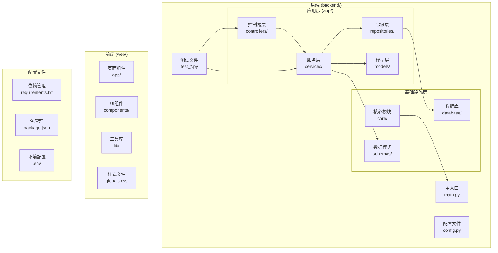
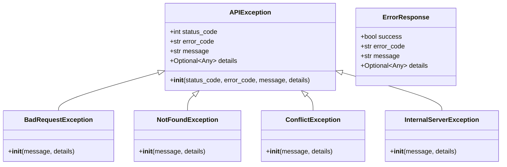
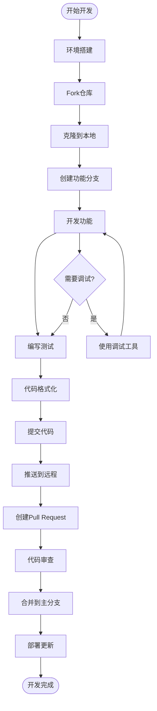

# 开发者指南

<cite>
**本文档引用的文件**
- [backend/test_api.py](file://backend/test_api.py)
- [backend/test_retriever_eval.py](file://backend/test_retriever_eval.py)
- [backend/app/core/exceptions.py](file://backend/app/core/exceptions.py)
- [backend/requirements.txt](file://backend/requirements.txt)
- [backend/app/main.py](file://backend/app/main.py)
- [backend/app/config.py](file://backend/app/config.py)
- [backend/run.py](file://backend/run.py)
- [web/eslint.config.mjs](file://web/eslint.config.mjs)
- [web/tsconfig.json](file://web/tsconfig.json)
- [web/package.json](file://web/package.json)
- [web/lib/api.ts](file://web/lib/api.ts)
- [web/next.config.ts](file://web/next.config.ts)
- [backend/app/controllers/pipeline.py](file://backend/app/controllers/pipeline.py)
</cite>

## 目录
1. [项目简介](#项目简介)
2. [项目结构](#项目结构)
3. [环境搭建](#环境搭建)
4. [代码规范](#代码规范)
5. [测试策略](#测试策略)
6. [异常处理机制](#异常处理机制)
7. [开发工作流](#开发工作流)
8. [调试技巧](#调试技巧)
9. [贡献指南](#贡献指南)

## 项目简介

RAG Studio是一个基于FastAPI和Next.js构建的RAG（检索增强生成）管理平台，支持云边架构的知识库管理、链路排查和测试评估。项目采用前后端分离架构，后端提供RESTful API服务，前端使用TypeScript和React构建现代化的用户界面。

### 核心特性
- **知识库管理**：支持多种向量数据库（Qdrant、Elasticsearch、Milvus）
- **文档处理**：自动化的文档分块、向量化和索引
- **检索评估**：基于T2Ranking数据集的检索器评估系统
- **链路排查**：完整的RAG处理链路可视化和调试工具
- **测试框架**：完善的单元测试和集成测试体系

## 项目结构



**图表来源**
- [backend/app/main.py](file://backend/app/main.py#L1-L112)
- [backend/app/config.py](file://backend/app/config.py#L1-L99)

### 目录结构详解

#### 后端目录结构
- **`app/controllers/`**：API控制器，处理HTTP请求和响应
- **`app/services/`**：业务逻辑服务，实现核心业务功能
- **`app/repositories/`**：数据访问层，处理数据持久化
- **`app/models/`**：ORM模型定义
- **`app/schemas/`**：Pydantic数据模式，用于请求验证和响应格式
- **`app/core/`**：核心功能模块（异常处理、中间件、响应格式）

#### 前端目录结构
- **`app/`**：Next.js页面组件
- **`components/`**：可复用的UI组件
- **`lib/`**：工具函数和API客户端
- **`styles/`**：全局样式文件

**章节来源**
- [backend/app/main.py](file://backend/app/main.py#L94-L102)
- [web/package.json](file://web/package.json#L1-L73)

## 环境搭建

### 后端环境配置

#### Python环境要求
- Python 3.8+
- 推荐使用虚拟环境

#### 安装依赖
```bash
# 进入后端目录
cd backend

# 安装依赖
pip install -r requirements.txt

# 创建环境变量文件
cp .env.example .env
```

#### 环境变量配置
```env
# 应用配置
APP_NAME=RAG Studio Backend
APP_VERSION=1.0.0
DEBUG=True
API_PREFIX=/api/v1
HOST=0.0.0.0
PORT=8000

# 数据库配置
DB_HOST=localhost
DB_PORT=3306
DB_USER=root
DB_PASSWORD=
DB_NAME=rag_studio

# 向量数据库配置
VECTOR_DB_TYPE=qdrant
QDRANT_HOST=localhost
QDRANT_PORT=6333
QDRANT_API_KEY=

# Ollama配置
OLLAMA_BASE_URL=http://localhost:11434
OLLAMA_EMBEDDING_MODEL=nomic-embed-text
OLLAMA_CHAT_MODEL=deepseek-r1:1.5b
```

#### 启动应用
```bash
# 使用run.py启动
python run.py

# 或直接使用uvicorn
uvicorn app.main:app --reload
```

### 前端环境配置

#### Node.js环境要求
- Node.js 18+
- npm或yarn

#### 安装依赖
```bash
# 进入前端目录
cd web

# 安装依赖
npm install

# 启动开发服务器
npm run dev
```

#### 构建生产版本
```bash
# 构建
npm run build

# 启动生产服务器
npm run start
```

**章节来源**
- [backend/requirements.txt](file://backend/requirements.txt#L1-L45)
- [web/package.json](file://web/package.json#L1-L73)
- [backend/app/config.py](file://backend/app/config.py#L1-L99)
- [backend/run.py](file://backend/run.py#L1-L22)

## 代码规范

### Python代码规范

#### 项目使用的工具
- **Black**：代码格式化工具，统一代码风格
- **Flake8**：代码质量检查工具，遵循PEP8规范
- **Pydantic**：数据验证和设置管理

#### 代码格式化
```bash
# 格式化所有Python文件
black .

# 检查代码质量问题
flake8 .
```

#### 编码约定
1. **文件编码**：所有Python文件使用UTF-8编码
2. **注释规范**：使用英文注释，重要功能需添加详细说明
3. **类型注解**：推荐使用类型注解提高代码可读性
4. **错误处理**：使用try-except块处理异常

### TypeScript代码规范

#### ESLint配置
项目使用ESLint进行代码质量控制，配置继承自Next.js官方推荐配置。

#### TypeScript配置
- **目标版本**：ES2017
- **严格模式**：启用
- **模块解析**：bundler模式
- **路径映射**：支持`@/*`别名

#### 代码风格
1. **命名规范**：使用驼峰命名法
2. **接口定义**：使用PascalCase
3. **常量定义**：使用大写蛇形命名法
4. **注释规范**：使用JSDoc风格注释

**章节来源**
- [backend/requirements.txt](file://backend/requirements.txt#L40-L44)
- [web/eslint.config.mjs](file://web/eslint.config.mjs#L1-L17)
- [web/tsconfig.json](file://web/tsconfig.json#L1-L28)

## 测试策略

### 单元测试

#### 测试框架
- **pytest**：主要测试框架
- **pytest-asyncio**：异步测试支持

#### 测试文件结构
- **`test_api.py`**：API功能测试
- **`test_retriever_eval.py`**：检索器评估测试
- **其他测试文件**：针对特定模块的功能测试

#### 运行测试
```bash
# 运行所有测试
pytest

# 运行特定测试文件
pytest test_api.py

# 生成测试覆盖率报告
pytest --cov=app --cov-report=html
```

### 集成测试

#### 测试策略
1. **API测试**：使用HTTP客户端测试完整的API流程
2. **数据流测试**：测试从文档上传到检索的完整数据流
3. **评估测试**：测试检索器评估系统的准确性

#### Mock外部服务
```python
# 示例：Mock外部API调用
from unittest.mock import patch

@patch('app.services.embedding_service.EmbeddingService.embed_text')
def test_embedding_service(mock_embed):
    mock_embed.return_value = [0.1, 0.2, 0.3]
    # 测试逻辑
```

### 测试覆盖率要求
- **核心模块**：不低于80%
- **新增功能**：100%覆盖
- **边界条件**：充分测试

**章节来源**
- [backend/test_api.py](file://backend/test_api.py#L1-L149)
- [backend/test_retriever_eval.py](file://backend/test_retriever_eval.py#L1-L150)
- [backend/requirements.txt](file://backend/requirements.txt#L40-L44)

## 异常处理机制

### 异常设计原则

#### 统一异常处理架构


**图表来源**
- [backend/app/core/exceptions.py](file://backend/app/core/exceptions.py#L12-L144)

#### 自定义异常使用方式

1. **基础异常类**：`APIException`作为所有自定义异常的基类
2. **HTTP状态码映射**：每个异常对应特定的HTTP状态码
3. **错误码标准化**：使用统一的错误码格式
4. **详细信息支持**：支持传递详细的错误信息

#### 异常处理最佳实践
```python
# 正确的异常使用方式
try:
    # 业务逻辑
    result = service.process_data(input_data)
except ValueError as e:
    raise BadRequestException(message="输入数据无效", details=str(e))
except NotFoundError as e:
    raise NotFoundException(message="资源不存在", details=str(e))
except Exception as e:
    logger.error(f"未知错误: {e}", exc_info=True)
    raise InternalServerException(message="服务器内部错误")
```

**章节来源**
- [backend/app/core/exceptions.py](file://backend/app/core/exceptions.py#L1-L144)

## 开发工作流

### 完整开发流程



### 详细步骤说明

#### 1. 环境搭建
- 克隆项目到本地
- 安装必要的依赖
- 配置环境变量
- 启动开发服务器

#### 2. 功能开发
- 在功能分支上开发
- 遵循项目代码规范
- 编写相应的单元测试
- 进行本地测试验证

#### 3. 代码质量保证
- 使用Black格式化代码
- 运行Flake8检查代码质量
- 确保测试覆盖率达标
- 编写清晰的commit消息

#### 4. 提交Pull Request
- 确保本地测试通过
- 更新相关文档
- 描述变更内容和影响
- 响应审查意见

### Git工作流规范

#### 分支命名规范
- 功能分支：`feature/功能名称`
- 修复分支：`fix/问题描述`
- 发布分支：`release/版本号`

#### Commit消息规范
```
<type>(<scope>): <subject>

<body>

<footer>
```

#### 类型说明
- `feat`：新功能
- `fix`：bug修复
- `docs`：文档更新
- `style`：代码格式调整
- `refactor`：代码重构
- `test`：测试相关
- `chore`：构建过程或辅助工具的变动

**章节来源**
- [backend/run.py](file://backend/run.py#L1-L22)
- [backend/app/main.py](file://backend/app/main.py#L15-L37)

## 调试技巧

### 后端调试

#### 日志配置
```python
import logging

logger = logging.getLogger(__name__)

# 记录不同级别的日志
logger.debug("调试信息")
logger.info("一般信息")
logger.warning("警告信息")
logger.error("错误信息")
logger.critical("严重错误")
```

#### 断点调试
```python
import pdb

# 在代码中插入断点
pdb.set_trace()

# 或使用Python内置的breakpoint()
breakpoint()
```

#### 调试中间件
```python
# 在app/core/middleware.py中添加调试中间件
async def debug_middleware(request: Request, call_next):
    start_time = time.time()
    
    response = await call_next(request)
    
    process_time = time.time() - start_time
    logger.info(f"请求耗时: {process_time:.3f}s")
    
    return response
```

### 前端调试

#### 浏览器开发者工具
1. **Console面板**：查看JavaScript错误和日志
2. **Network面板**：监控API请求和响应
3. **Sources面板**：设置断点和单步调试
4. **Elements面板**：检查DOM结构和样式

#### React DevTools
- 安装React DevTools浏览器扩展
- 查看组件树和状态
- 调试组件渲染性能

#### API调试
```typescript
// 在api.ts中添加请求日志
async function request<T>(endpoint: string, options: RequestInit = {}): Promise<T> {
    console.log(`发起请求: ${endpoint}`, options);
    
    const response = await fetch(url, config);
    
    console.log(`收到响应: ${endpoint}`, response);
    
    return await response.json();
}
```

### 调试最佳实践

1. **渐进式调试**：从简单到复杂逐步排查问题
2. **日志驱动**：通过日志定位问题发生的位置
3. **隔离测试**：将问题隔离到最小可重现的代码片段
4. **版本对比**：比较不同版本间的差异

**章节来源**
- [backend/app/main.py](file://backend/app/main.py#L15-L37)
- [web/lib/api.ts](file://web/lib/api.ts#L22-L56)

## 贡献指南

### 贡献流程

#### 1. 准备工作
- Star和Fork项目仓库
- 创建个人开发分支
- 同步最新代码

#### 2. 开发阶段
- 遵循项目代码规范
- 编写单元测试
- 更新相关文档
- 提交清晰的commit消息

#### 3. 提交PR
- 确保CI测试通过
- 填写详细的PR描述
- 关联相关的Issue
- 响应维护者的反馈

#### 4. 合并后
- 同步主分支代码
- 清理本地分支
- 参与后续讨论

### 代码审查要点

#### 后端审查重点
- 异常处理是否完善
- 数据验证是否充分
- 性能优化是否合理
- 安全性考虑是否到位

#### 前端审查重点
- 组件设计是否合理
- 状态管理是否清晰
- 类型定义是否准确
- 用户体验是否良好

### 社区规范

#### 行为准则
- 尊重他人意见
- 保持建设性的讨论
- 帮助新手解决问题
- 避免人身攻击

#### 沟通方式
- GitHub Issues：Bug报告和功能请求
- Pull Requests：代码贡献和审查
- Discussions：技术讨论和建议

### 常见问题解答

#### Q: 如何报告Bug？
A: 在GitHub Issues中创建新的Issue，提供详细的复现步骤和环境信息。

#### Q: 如何提出新功能？
A: 在GitHub Discussions中发起讨论，或者创建Feature Request Issue。

#### Q: 如何获得技术支持？
A: 查看项目文档，参考示例代码，或者在Issues中提问。

**章节来源**
- [backend/test_api.py](file://backend/test_api.py#L105-L148)
- [backend/test_retriever_eval.py](file://backend/test_retriever_eval.py#L122-L149)

## 结语

本开发者指南旨在帮助贡献者快速上手项目开发，降低参与门槛。通过遵循这些规范和流程，我们可以共同维护高质量的代码库，推动项目持续发展。

如果您在开发过程中遇到任何问题，欢迎通过GitHub Issues或Discussions寻求帮助。我们期待您的贡献！