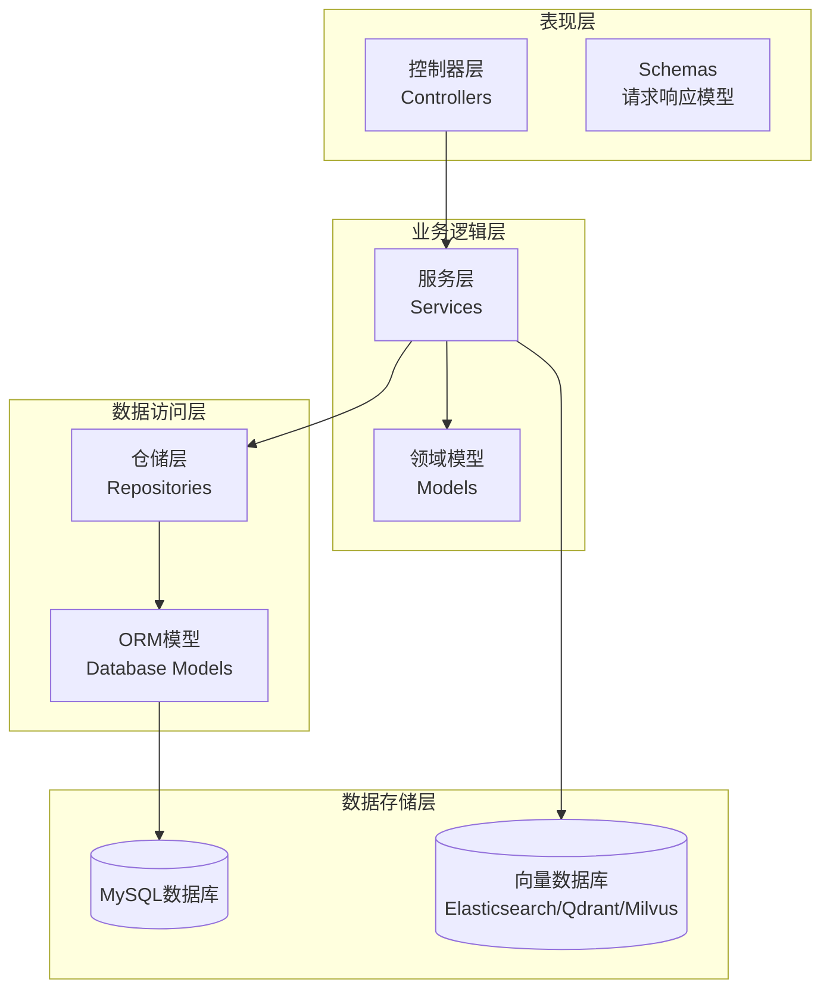
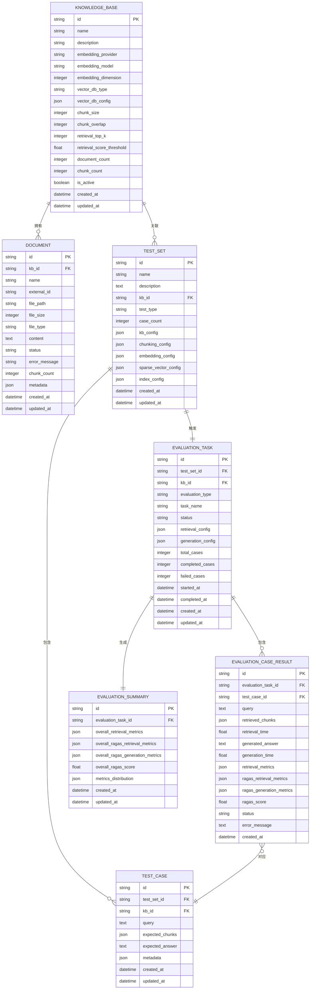
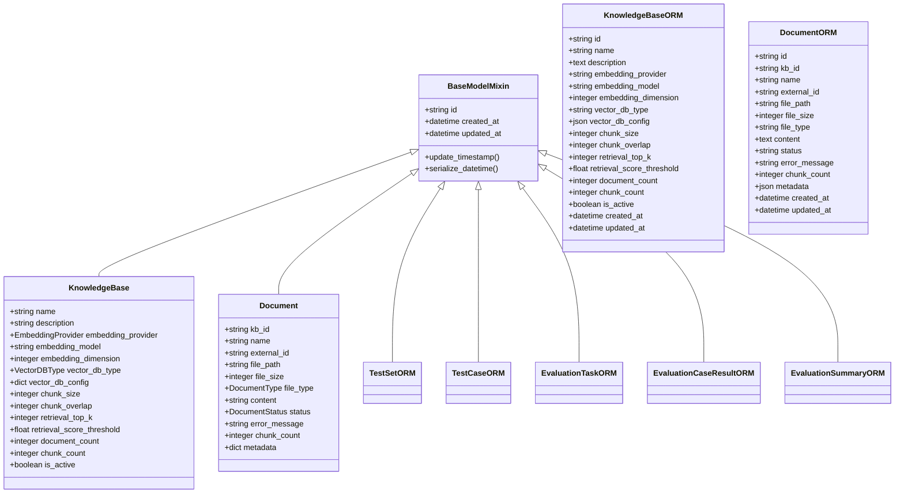
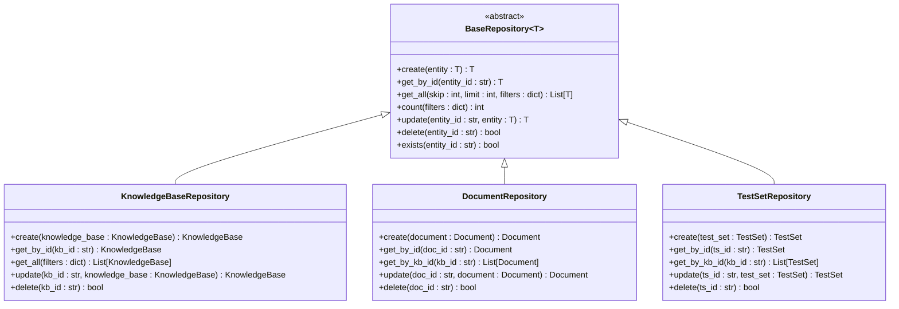
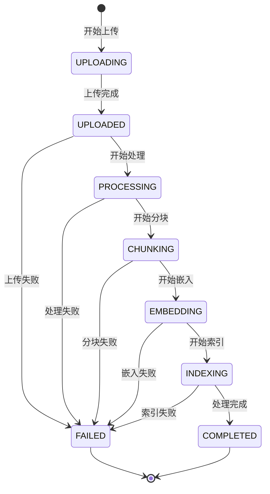
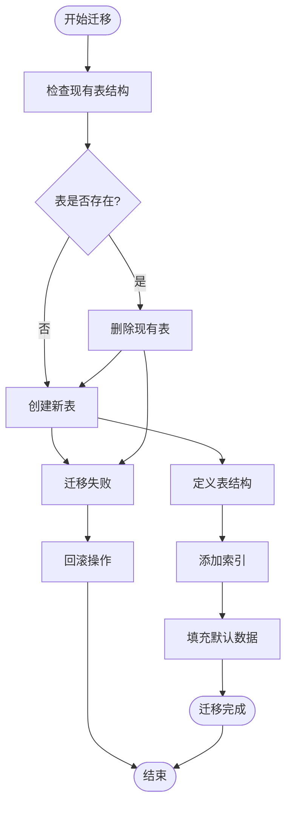

# 数据模型设计

<cite>
**本文档引用的文件**
- [backend/app/database/models.py](file://backend/app/database/models.py)
- [backend/app/models/base.py](file://backend/app/models/base.py)
- [backend/app/models/knowledge_base.py](file://backend/app/models/knowledge_base.py)
- [backend/app/models/document.py](file://backend/app/models/document.py)
- [backend/app/models/test.py](file://backend/app/models/test.py)
- [backend/app/models/evaluation.py](file://backend/app/models/evaluation.py)
- [backend/migrations/001_create_evaluation_tables.py](file://backend/migrations/001_create_evaluation_tables.py)
- [backend/app/repositories/base.py](file://backend/app/repositories/base.py)
- [backend/app/database/__init__.py](file://backend/app/database/__init__.py)
- [backend/app/services/knowledge_base.py](file://backend/app/services/knowledge_base.py)
- [backend/app/controllers/knowledge_base.py](file://backend/app/controllers/knowledge_base.py)
</cite>

## 目录
1. [概述](#概述)
2. [项目架构](#项目架构)
3. [核心数据模型](#核心数据模型)
4. [数据库实体关系](#数据库实体关系)
5. [模型映射关系](#模型映射关系)
6. [数据访问层](#数据访问层)
7. [数据生命周期管理](#数据生命周期管理)
8. [数据库迁移](#数据库迁移)
9. [性能优化建议](#性能优化建议)
10. [扩展指导](#扩展指导)

## 概述

RAG-Studio采用分层架构设计，包含领域模型（Domain Models）、ORM模型（Object-Relational Mapping）和数据访问层。该系统专注于构建和评估检索增强生成（RAG）系统的知识库，支持文档管理、测试集管理和评估结果跟踪。

### 架构特点

- **分层设计**：清晰分离领域模型、ORM模型和数据访问层
- **类型安全**：使用Pydantic进行数据验证和序列化
- **异步支持**：基于FastAPI和SQLAlchemy异步特性
- **灵活配置**：支持多种向量数据库和嵌入模型
- **版本控制**：完整的数据库迁移机制

## 项目架构



**图表来源**
- [backend/app/controllers/knowledge_base.py](file://backend/app/controllers/knowledge_base.py#L1-L50)
- [backend/app/services/knowledge_base.py](file://backend/app/services/knowledge_base.py#L1-L50)
- [backend/app/repositories/base.py](file://backend/app/repositories/base.py#L1-L50)
- [backend/app/database/models.py](file://backend/app/database/models.py#L1-L50)

## 核心数据模型

### 知识库模型（KnowledgeBase）

知识库是系统的核心实体，代表一个独立的RAG知识库实例。

| 字段名 | 数据类型 | 约束条件 | 业务含义 |
|--------|----------|----------|----------|
| id | String(50) | 主键，唯一 | 知识库唯一标识符 |
| name | String(100) | 非空，长度1-100 | 知识库名称 |
| description | String(500) | 可空 | 知识库描述信息 |
| embedding_provider | Enum | 默认OLLAMA | 嵌入模型提供商 |
| embedding_model | String | 非空 | 嵌入模型名称 |
| embedding_dimension | Integer | 默认768 | 向量维度 |
| vector_db_type | Enum | 非空 | 向量数据库类型 |
| vector_db_config | JSON | 可空 | 向量数据库配置 |
| chunk_size | Integer | 默认512，范围100-2000 | 分块大小 |
| chunk_overlap | Integer | 默认50，范围0-500 | 分块重叠 |
| retrieval_top_k | Integer | 默认5，范围1-50 | 检索返回数量 |
| retrieval_score_threshold | Float | 默认0.7，范围0.0-1.0 | 检索分数阈值 |
| document_count | Integer | 默认0 | 文档数量统计 |
| chunk_count | Integer | 默认0 | 分块数量统计 |
| is_active | Boolean | 默认True | 是否激活状态 |

**节来源**
- [backend/app/models/knowledge_base.py](file://backend/app/models/knowledge_base.py#L25-L80)

### 文档模型（Document）

文档模型表示知识库中的单个文档，支持多种文件格式。

| 字段名 | 数据类型 | 约束条件 | 业务含义 |
|--------|----------|----------|----------|
| id | String(50) | 主键，唯一 | 文档唯一标识符 |
| kb_id | String(50) | 非空，外键 | 所属知识库ID |
| name | String(200) | 非空，长度1-200 | 文档名称 |
| external_id | String | 可空 | 外部数据源ID |
| file_path | String | 非空 | 文件存储路径 |
| file_size | Integer | 默认0 | 文件大小(字节) |
| file_type | Enum | 非空 | 文件类型(TXT/PDF/DOCX等) |
| content | String | 可空 | 文档原始内容 |
| status | Enum | 默认UPLOADED | 处理状态 |
| error_message | String | 可空 | 错误信息 |
| chunk_count | Integer | 默认0 | 分块数量 |
| metadata | JSON | 默认空字典 | 文档元数据 |

**节来源**
- [backend/app/models/document.py](file://backend/app/models/document.py#L34-L116)

### 测试集模型（TestSet）

测试集模型定义了评估任务的测试用例集合。

| 字段名 | 数据类型 | 约束条件 | 业务含义 |
|--------|----------|----------|----------|
| id | String(50) | 主键，唯一 | 测试集唯一标识符 |
| name | String(100) | 非空，长度1-100 | 测试集名称 |
| description | String(500) | 可空 | 测试集描述 |
| kb_id | String(50) | 非空，索引 | 关联知识库ID |
| test_type | Enum | 非空，索引 | 测试类型(RETRIEVAL/GENERATION) |
| case_count | Integer | 默认0 | 测试用例数量 |
| kb_config | JSON | 可空 | 知识库配置快照 |
| chunking_config | JSON | 可空 | 分块策略配置 |
| embedding_config | JSON | 可空 | 嵌入模型配置 |
| sparse_vector_config | JSON | 可空 | 稀疏向量配置 |
| index_config | JSON | 可空 | 索引配置 |

**节来源**
- [backend/app/models/test.py](file://backend/app/models/test.py#L26-L81)

### 评估任务模型（EvaluationTask）

评估任务模型跟踪具体的评估执行过程。

| 字段名 | 数据类型 | 约束条件 | 业务含义 |
|--------|----------|----------|----------|
| id | String(50) | 主键，唯一 | 评估任务唯一标识符 |
| test_set_id | String(50) | 非空，外键，级联删除 | 关联测试集ID |
| kb_id | String(50) | 非空，索引 | 关联知识库ID |
| evaluation_type | Enum | 非空 | 评估类型(RETRIEVAL/GENERATION) |
| task_name | String(100) | 可空 | 任务名称 |
| status | Enum | 默认PENDING，索引 | 任务状态 |
| retrieval_config | JSON | 可空 | 检索配置 |
| generation_config | JSON | 可空 | 生成配置 |
| total_cases | Integer | 默认0 | 总测试用例数 |
| completed_cases | Integer | 默认0 | 已完成用例数 |
| failed_cases | Integer | 默认0 | 失败用例数 |
| started_at | DateTime | 可空 | 开始时间 |
| completed_at | DateTime | 可空 | 完成时间 |

**节来源**
- [backend/app/models/evaluation.py](file://backend/app/models/evaluation.py#L27-L68)

## 数据库实体关系



**图表来源**
- [backend/app/database/models.py](file://backend/app/database/models.py#L23-L128)

### 关系说明

1. **知识库-文档关系**：一对多，一个知识库可以包含多个文档
2. **知识库-测试集关系**：一对多，一个知识库可以有多个测试集
3. **测试集-测试用例关系**：一对多，一个测试集包含多个测试用例
4. **测试集-评估任务关系**：一对一，一个测试集对应一个评估任务
5. **评估任务-评估结果关系**：一对多，一个评估任务包含多个评估结果
6. **评估结果-测试用例关系**：多对一，多个评估结果对应同一个测试用例

## 模型映射关系

### 领域模型与ORM模型映射

系统采用分层模型设计，确保数据模型的一致性和可维护性：



**图表来源**
- [backend/app/models/base.py](file://backend/app/models/base.py#L11-L31)
- [backend/app/models/knowledge_base.py](file://backend/app/models/knowledge_base.py#L25-L80)
- [backend/app/models/document.py](file://backend/app/models/document.py#L34-L116)
- [backend/app/database/models.py](file://backend/app/database/models.py#L23-L128)

### 枚举类型映射

系统使用强类型枚举确保数据一致性：

| 枚举类型 | 可选值 | 业务含义 |
|----------|--------|----------|
| EmbeddingProvider | OLLAMA, CUSTOM | 嵌入模型提供商 |
| VectorDBType | ELASTICSEARCH, QDRANT, MILVUS | 向量数据库类型 |
| DocumentStatus | UPLOADING, UPLOADED, PROCESSING, CHUNKING, EMBEDDING, INDEXING, COMPLETED, FAILED | 文档处理状态 |
| DocumentType | TXT, PDF, DOCX, MD, HTML, JSON | 文档文件类型 |
| TestType | RETRIEVAL, GENERATION | 测试类型 |
| TestStatus | PENDING, RUNNING, COMPLETED, FAILED | 测试状态 |
| EvaluationType | RETRIEVAL, GENERATION | 评估类型 |
| EvaluationStatus | PENDING, RUNNING, COMPLETED, FAILED | 评估状态 |

**节来源**
- [backend/app/models/knowledge_base.py](file://backend/app/models/knowledge_base.py#L12-L23)
- [backend/app/models/document.py](file://backend/app/models/document.py#L12-L32)
- [backend/app/models/test.py](file://backend/app/models/test.py#L12-L24)
- [backend/app/models/evaluation.py](file://backend/app/models/evaluation.py#L13-L25)

## 数据访问层

### 仓储模式设计

系统采用仓储模式实现数据访问的抽象化：



**图表来源**
- [backend/app/repositories/base.py](file://backend/app/repositories/base.py#L14-L119)

### 数据访问模式

#### CRUD操作接口

所有仓储类都遵循统一的CRUD接口规范：

1. **创建操作**：`create(entity: T) -> T`
2. **查询操作**：
   - `get_by_id(entity_id: str) -> Optional[T]`
   - `get_all(skip: int, limit: int, filters: Optional[Dict] = None) -> List[T]`
   - `count(filters: Optional[Dict] = None) -> int`
3. **更新操作**：`update(entity_id: str, entity: T) -> Optional[T]`
4. **删除操作**：`delete(entity_id: str) -> bool`
5. **存在性检查**：`exists(entity_id: str) -> bool`

#### 查询优化策略

- **索引优化**：在外键字段上建立索引以加速关联查询
- **分页查询**：支持大数据量的分页查询，避免内存溢出
- **过滤条件**：支持动态过滤条件，提高查询灵活性
- **批量操作**：支持批量插入和更新操作

**节来源**
- [backend/app/repositories/base.py](file://backend/app/repositories/base.py#L14-L119)

## 数据生命周期管理

### 文档处理生命周期



### 评估结果存储策略

#### 数据保留策略

1. **短期存储**：最近30天的评估结果保持活跃状态
2. **中期归档**：30-90天的评估结果归档到历史表
3. **长期存储**：超过90天的评估结果压缩存储
4. **永久保留**：关键评估结果的摘要信息

#### 软删除机制

系统采用软删除策略，通过状态字段标记删除：

- **逻辑删除**：设置`is_deleted`标志位而非物理删除
- **恢复能力**：支持误删数据的恢复
- **审计追踪**：记录删除时间和操作用户

**节来源**
- [backend/app/models/document.py](file://backend/app/models/document.py#L12-L22)

## 数据库迁移

### 迁移脚本结构

系统使用SQLAlchemy进行数据库迁移管理：



**图表来源**
- [backend/migrations/001_create_evaluation_tables.py](file://backend/migrations/001_create_evaluation_tables.py#L16-L44)

### 表结构演进

#### 初始版本（v1.0）

- 创建核心表：`test_sets`, `test_cases`, `evaluation_tasks`
- 定义基本字段和约束
- 建立外键关系

#### 功能增强（v1.1）

- 添加`evaluation_case_results`表
- 引入评估指标字段
- 改进索引策略

#### 性能优化（v1.2）

- 添加复合索引
- 优化JSON字段查询
- 引入分区策略

**节来源**
- [backend/migrations/001_create_evaluation_tables.py](file://backend/migrations/001_create_evaluation_tables.py#L16-L44)

## 性能优化建议

### 查询优化

1. **索引策略**
   - 在外键字段上建立索引
   - 对频繁查询的字段建立复合索引
   - 使用覆盖索引减少回表查询

2. **查询优化**
   - 使用LIMIT限制查询结果数量
   - 避免SELECT *，只查询必要字段
   - 使用EXPLAIN分析查询计划

3. **缓存策略**
   - 缓存热点数据（知识库配置）
   - 实现读写分离
   - 使用Redis缓存临时计算结果

### 存储优化

1. **数据压缩**
   - 对大文本字段启用压缩
   - 使用列式存储格式
   - 定期清理无用数据

2. **分区策略**
   - 按时间分区存储评估结果
   - 按知识库ID分区存储文档
   - 实现冷热数据分离

### 并发控制

1. **事务管理**
   - 合理设置事务隔离级别
   - 避免长时间持有锁
   - 使用乐观锁处理并发更新

2. **连接池**
   - 配置合适的连接池大小
   - 实现连接健康检查
   - 监控连接池使用情况

## 扩展指导

### 新功能扩展

#### 添加新的评估指标

1. **修改模型定义**
   ```python
   # 在EvaluationCaseResultORM中添加新字段
   new_metric = Column(Float, nullable=True)
   ```

2. **更新领域模型**
   ```python
   # 在EvaluationCaseResult中添加新字段
   new_metric: Optional[float] = Field(None, description="新评估指标")
   ```

3. **更新迁移脚本**
   ```python
   # 添加ALTER TABLE语句
   op.add_column('evaluation_case_results', sa.Column('new_metric', sa.Float(), nullable=True))
   ```

#### 支持新的向量数据库

1. **扩展枚举类型**
   ```python
   class VectorDBType(str, enum.Enum):
       ELASTICSEARCH = "elasticsearch"
       QDRANT = "qdrant"
       MILVUS = "milvus"
       NEW_DB = "new_db"  # 新增支持
   ```

2. **实现适配器模式**
   ```python
   class NewVectorDBAdapter:
       def __init__(self, config: Dict[str, Any]):
           # 初始化新数据库连接
           pass
       
       def insert_vectors(self, vectors: List[VectorData]):
           # 实现向量插入逻辑
           pass
   ```

### 架构扩展

#### 微服务拆分

1. **知识库服务**
   - 负责知识库的创建、更新、删除
   - 管理文档上传和处理流程

2. **评估服务**
   - 负责测试集管理和评估任务执行
   - 处理评估结果的收集和分析

3. **检索服务**
   - 提供向量检索功能
   - 管理向量数据库的索引和查询

#### 事件驱动架构

1. **事件发布**
   - 文档处理完成事件
   - 评估任务状态变更事件
   - 知识库配置更新事件

2. **事件订阅**
   - 自动触发相关依赖任务
   - 实现实时通知功能
   - 支持异步处理长任务

### 监控和运维

#### 关键指标监控

1. **性能指标**
   - 数据库查询响应时间
   - 评估任务执行时长
   - 文档处理队列长度

2. **业务指标**
   - 知识库数量和活跃度
   - 评估成功率和质量
   - 用户操作频率

3. **资源指标**
   - 数据库存储使用率
   - 内存和CPU使用情况
   - 网络带宽消耗

#### 故障恢复

1. **自动恢复**
   - 数据库连接异常自动重试
   - 评估任务失败自动重试
   - 缓存失效自动重建

2. **人工干预**
   - 复杂故障的手动处理
   - 数据修复和迁移
   - 系统配置调整

通过以上设计，RAG-Studio实现了完整的数据模型体系，支持复杂的RAG系统管理需求，同时具备良好的扩展性和维护性。系统采用现代化的架构设计，为未来的功能扩展和性能优化奠定了坚实的基础。