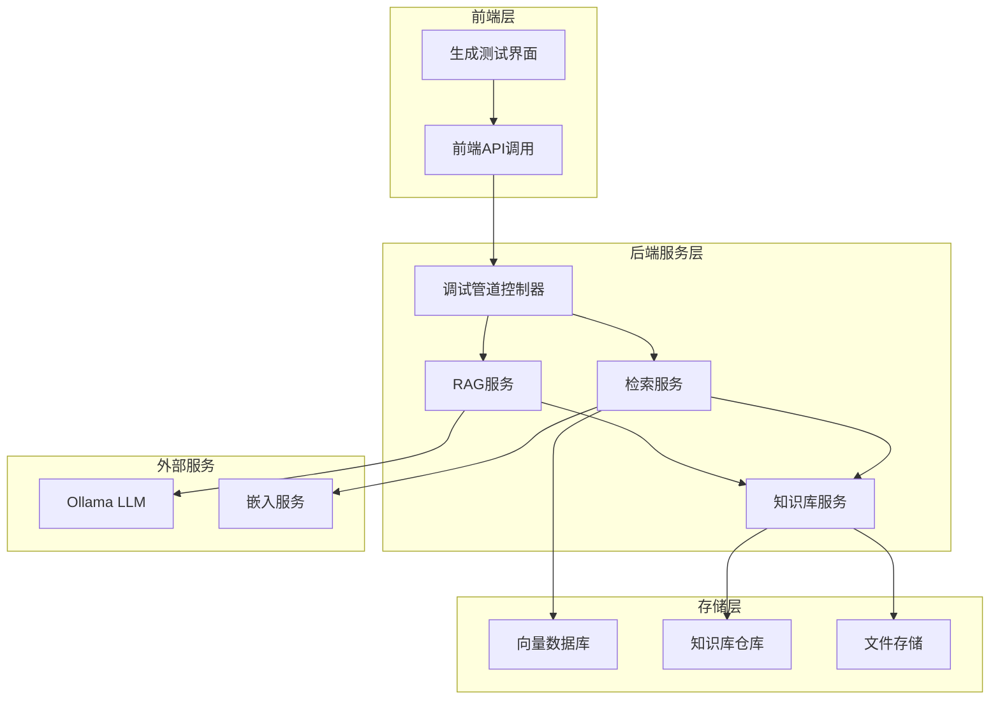
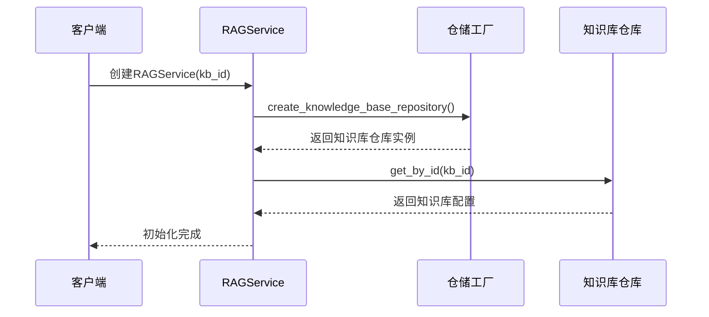
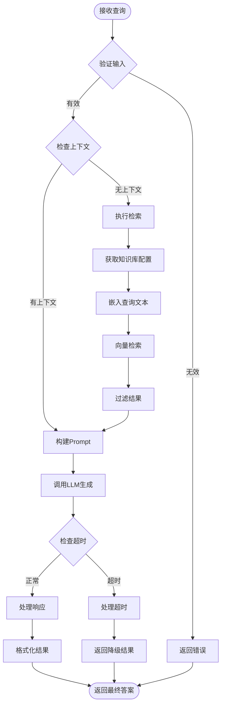
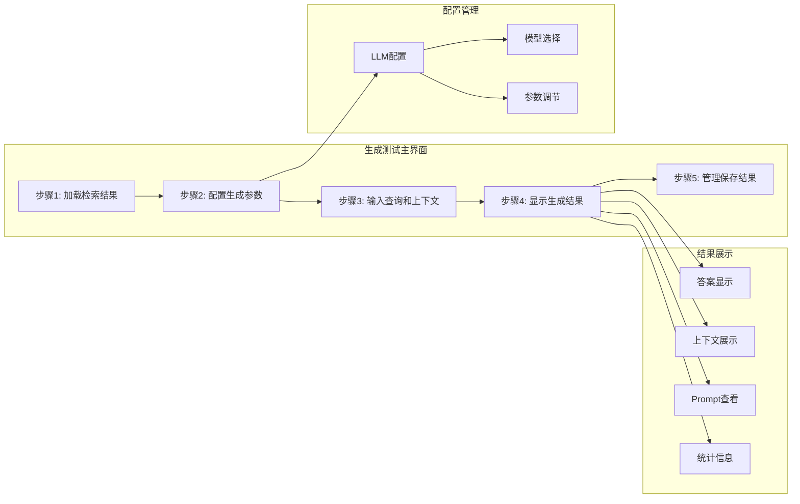
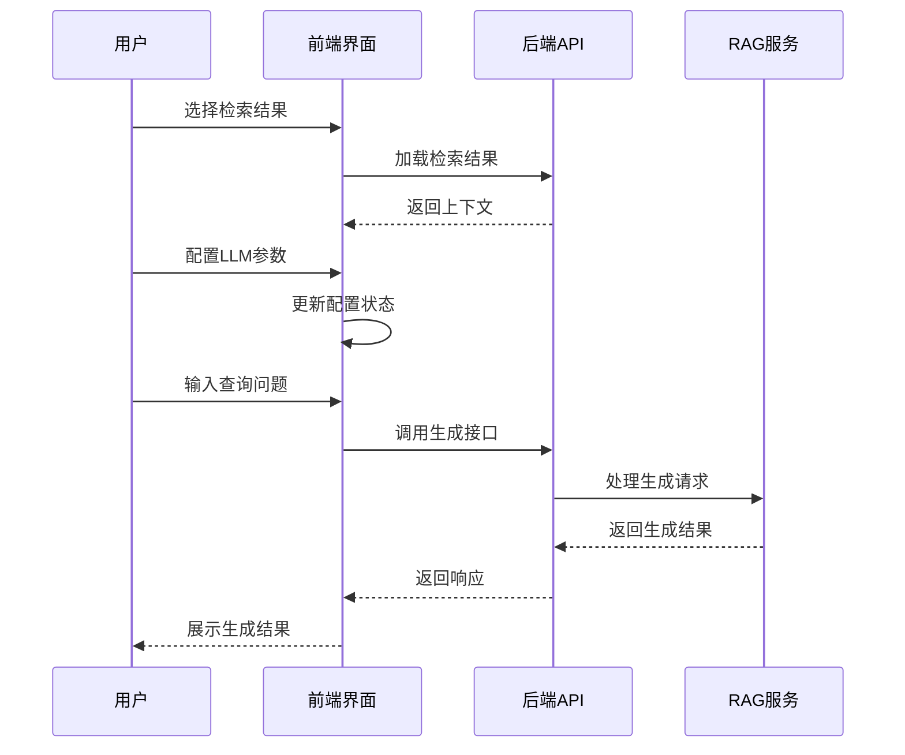
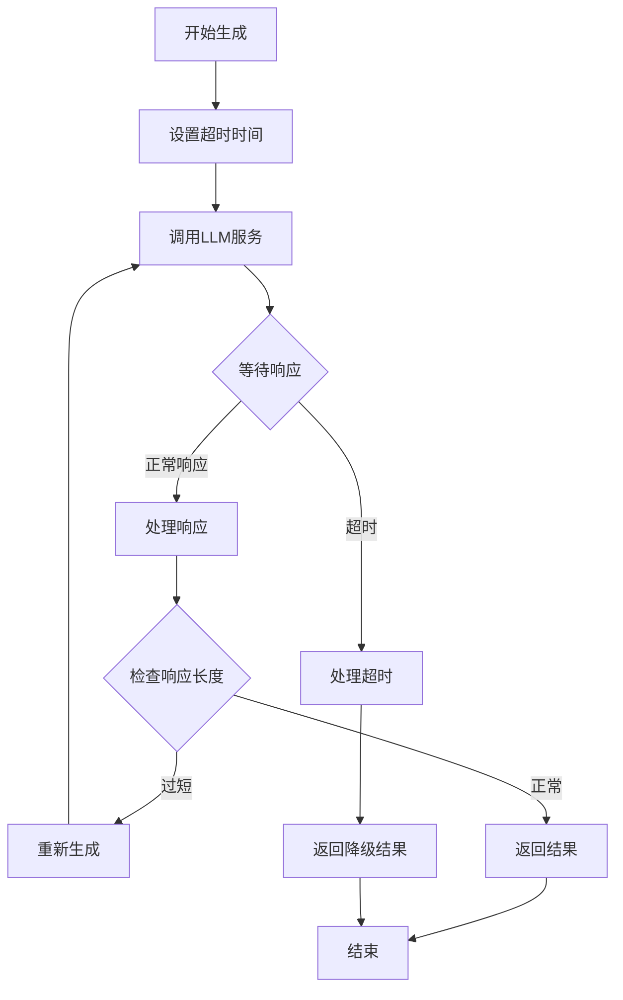
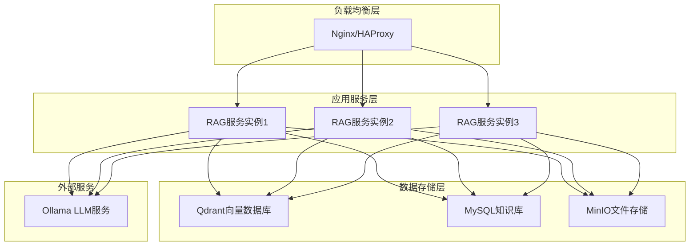

# RAG生成系统详细文档

<cite>
**本文档引用的文件**
- [rag_service.py](file://backend/app/services/rag_service.py)
- [generation-test.tsx](file://web/components/views/generation-test.tsx)
- [debug_pipeline.py](file://backend/app/controllers/debug_pipeline.py)
- [retrieval_service.py](file://backend/app/services/retrieval_service.py)
- [pipeline.py](file://backend/app/controllers/pipeline.py)
- [knowledge_base.py](file://backend/app/models/knowledge_base.py)
- [factory.py](file://backend/app/repositories/factory.py)
- [api.ts](file://web/lib/api.ts)
- [storage.ts](file://web/lib/storage.ts)
</cite>

## 目录
1. [系统概述](#系统概述)
2. [RAG服务架构](#rag服务架构)
3. [RAGService核心功能](#ragservice核心功能)
4. [查询处理流程](#查询处理流程)
5. [前端生成测试界面](#前端生成测试界面)
6. [性能优化策略](#性能优化策略)
7. [错误处理与降级](#错误处理与降级)
8. [系统集成与部署](#系统集成与部署)

## 系统概述

RAG（检索增强生成）系统是一个基于检索的问答平台，通过整合文档检索和语言模型生成能力，为用户提供准确、上下文相关的智能回答。系统采用前后端分离架构，后端提供核心的RAG服务，前端提供可视化的测试和调试界面。

### 核心特性

- **多模态检索**：支持向量检索、关键词检索和混合检索
- **灵活的生成引擎**：支持多种LLM提供商（目前主要支持Ollama）
- **可视化调试**：提供完整的链路调试和结果展示
- **高性能优化**：具备上下文长度控制、超时管理和错误降级机制
- **可扩展架构**：模块化设计支持多种存储和检索策略

## RAG服务架构

**图表来源**
- [debug_pipeline.py](file://backend/app/controllers/debug_pipeline.py#L1-L50)
- [rag_service.py](file://backend/app/services/rag_service.py#L1-L50)
- [retrieval_service.py](file://backend/app/services/retrieval_service.py#L1-L50)

### 服务组件说明

1. **调试管道控制器（DebugPipeline）**：提供完整的RAG链路调试接口
2. **检索服务（RetrievalService）**：负责文档检索和结果融合
3. **RAG服务（RAGService）**：整合检索和生成的核心服务
4. **知识库服务（KnowledgeBaseService）**：管理知识库配置和元数据

**章节来源**
- [debug_pipeline.py](file://backend/app/controllers/debug_pipeline.py#L1-L100)
- [rag_service.py](file://backend/app/services/rag_service.py#L1-L100)
- [retrieval_service.py](file://backend/app/services/retrieval_service.py#L1-L100)

## RAGService核心功能

### 初始化过程

RAGService的初始化过程体现了其与知识库的紧密耦合关系：

**图表来源**
- [rag_service.py](file://backend/app/services/rag_service.py#L19-L30)
- [factory.py](file://backend/app/repositories/factory.py#L40-L50)

### 检索功能实现

RAGService的检索功能遵循以下流程：

1. **获取知识库配置**：从知识库仓库获取检索参数
2. **参数处理**：应用默认值或覆盖用户指定参数
3. **向量检索**：调用向量数据库服务执行相似度搜索
4. **结果返回**：格式化并返回检索结果

### 生成功能实现

生成功能的核心逻辑包括：

1. **上下文准备**：如果没有提供上下文，则自动执行检索
2. **Prompt构建**：根据上下文和查询构建生成Prompt
3. **LLM调用**：调用指定的LLM服务生成答案
4. **结果封装**：整理生成结果并返回

**章节来源**
- [rag_service.py](file://backend/app/services/rag_service.py#L29-L165)

## 查询处理流程

### 完整处理链路

**图表来源**
- [debug_pipeline.py](file://backend/app/controllers/debug_pipeline.py#L1651-L1728)
- [rag_service.py](file://backend/app/services/rag_service.py#L83-L123)

### 检索阶段详解

检索阶段采用混合检索策略，支持多种检索方式的融合：

1. **向量检索**：基于语义相似度的密集向量搜索
2. **关键词检索**：基于词频和BM25算法的稀疏向量搜索
3. **混合检索**：结合向量和关键词的优势
4. **RRF融合**：使用递归倒数排名算法融合多源结果

### 生成阶段详解

生成阶段的核心流程：

1. **Prompt模板设计**：根据上下文和查询构建结构化Prompt
2. **上下文截断**：控制上下文长度以适应LLM的上下文窗口
3. **LLM调用**：通过HTTP客户端异步调用Ollama服务
4. **结果处理**：解析LLM响应并格式化输出

**章节来源**
- [debug_pipeline.py](file://backend/app/controllers/debug_pipeline.py#L1651-L1786)
- [retrieval_service.py](file://backend/app/services/retrieval_service.py#L136-L500)

## 前端生成测试界面

### 界面组件架构

前端生成测试界面采用模块化设计，提供完整的RAG测试体验：

**图表来源**
- [generation-test.tsx](file://web/components/views/generation-test.tsx#L246-L554)

### 主要功能模块

1. **检索结果加载**：支持从已保存的检索结果中加载上下文
2. **LLM参数配置**：提供模型选择、温度、最大token数等参数
3. **查询输入**：支持手动输入查询和上下文
4. **结果展示**：完整展示生成答案、上下文、Prompt和统计信息
5. **结果管理**：支持保存、加载、导出和导入生成结果

### 用户交互流程

**图表来源**
- [generation-test.tsx](file://web/components/views/generation-test.tsx#L105-L137)
- [api.ts](file://web/lib/api.ts#L1068-L1107)

**章节来源**
- [generation-test.tsx](file://web/components/views/generation-test.tsx#L1-L554)
- [api.ts](file://web/lib/api.ts#L1068-L1107)

## 性能优化策略

### 上下文长度控制

系统实现了多层次的上下文长度控制机制：

1. **动态截断**：根据LLM的上下文窗口限制动态调整上下文长度
2. **重要性排序**：基于检索分数对文档进行排序，优先保留高相关性内容
3. **分块策略**：采用滑动窗口方式处理长上下文

### 生成超时设置

**图表来源**
- [debug_pipeline.py](file://backend/app/controllers/debug_pipeline.py#L1730-L1786)

### 错误降级策略

系统实现了完善的错误处理和降级机制：

1. **服务降级**：当LLM服务不可用时，返回预设的降级消息
2. **网络重试**：对网络错误进行指数退避重试
3. **部分失败处理**：在检索部分失败时仍尝试生成
4. **缓存机制**：对频繁访问的检索结果进行缓存

**章节来源**
- [debug_pipeline.py](file://backend/app/controllers/debug_pipeline.py#L1730-L1786)
- [embedding_service.py](file://backend/app/services/embedding_service.py#L85-L146)

## 错误处理与降级

### 异常分类处理

系统对不同类型的异常采用不同的处理策略：

| 异常类型 | 处理策略 | 降级方案 |
|---------|---------|---------|
| 网络超时 | 指数退避重试 | 返回超时提示 |
| LLM服务不可用 | 服务降级 | 返回预设答案 |
| 知识库不存在 | 参数验证 | 返回错误信息 |
| 检索失败 | 部分降级 | 返回部分结果 |
| 嵌入失败 | 降级处理 | 使用默认向量 |

### 日志记录与监控

系统实现了完整的日志记录机制：

1. **结构化日志**：使用标准的日志格式记录关键操作
2. **性能监控**：记录各环节的处理时间和成功率
3. **错误追踪**：捕获并记录详细的错误堆栈信息
4. **审计日志**：记录用户操作和系统事件

**章节来源**
- [debug_pipeline.py](file://backend/app/controllers/debug_pipeline.py#L1730-L1786)
- [embedding_service.py](file://backend/app/services/embedding_service.py#L111-L146)

## 系统集成与部署

### 部署架构

### 配置管理

系统支持灵活的配置管理：

1. **环境变量**：通过环境变量配置服务地址和认证信息
2. **配置文件**：支持JSON格式的配置文件
3. **动态配置**：运行时可修改的部分配置
4. **配置验证**：启动时验证配置的完整性和有效性

### 扩展性设计

系统采用模块化设计，支持水平扩展：

1. **无状态设计**：服务实例之间无共享状态
2. **插件架构**：支持新的检索算法和LLM提供商
3. **缓存层**：可插入Redis等缓存服务
4. **监控集成**：支持Prometheus、Grafana等监控工具

**章节来源**
- [knowledge_base.py](file://backend/app/models/knowledge_base.py#L1-L80)
- [factory.py](file://backend/app/repositories/factory.py#L1-L61)

## 总结

RAG生成系统通过精心设计的架构和完善的优化策略，实现了高效、可靠的检索增强生成能力。系统的主要优势包括：

1. **完整的链路调试**：从前端界面到后端服务的全流程可视化
2. **灵活的配置管理**：支持多种检索策略和LLM提供商
3. **强大的性能优化**：多层次的上下文控制和错误处理
4. **良好的扩展性**：模块化设计支持功能扩展和性能提升

通过本文档的详细介绍，开发者可以深入理解RAG系统的内部机制，并根据具体需求进行定制和优化。