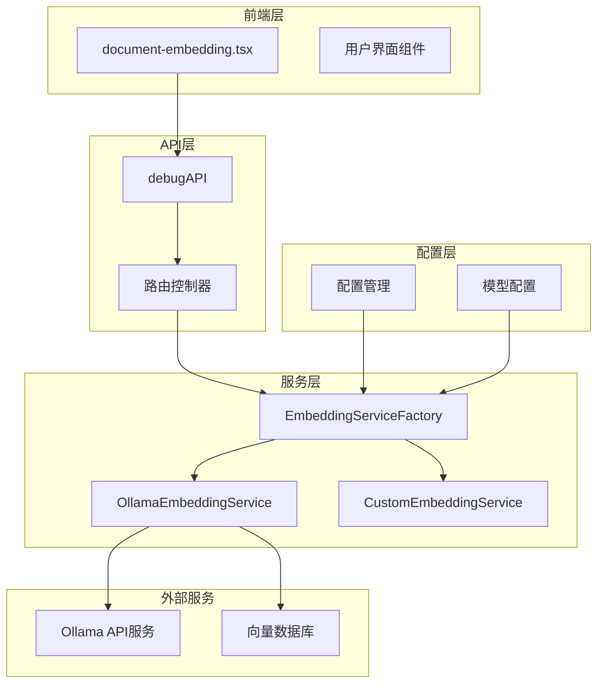
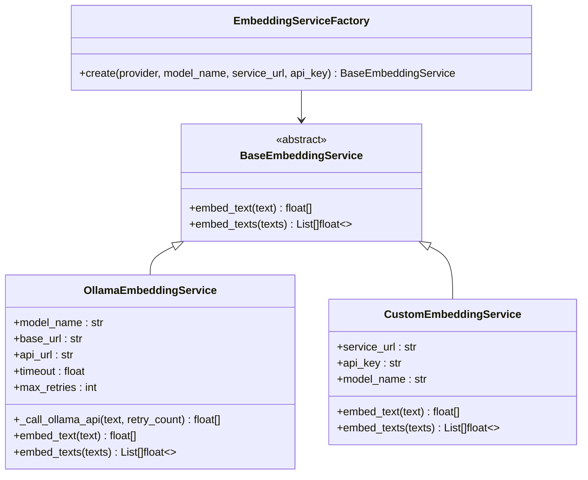
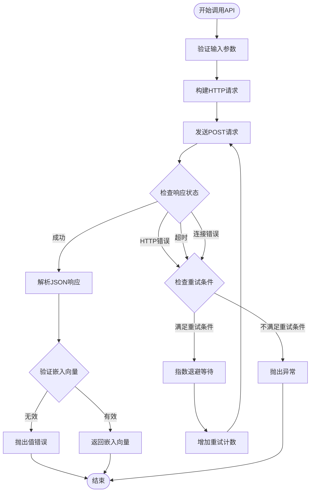
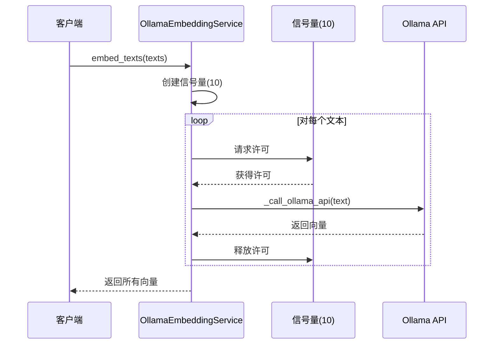
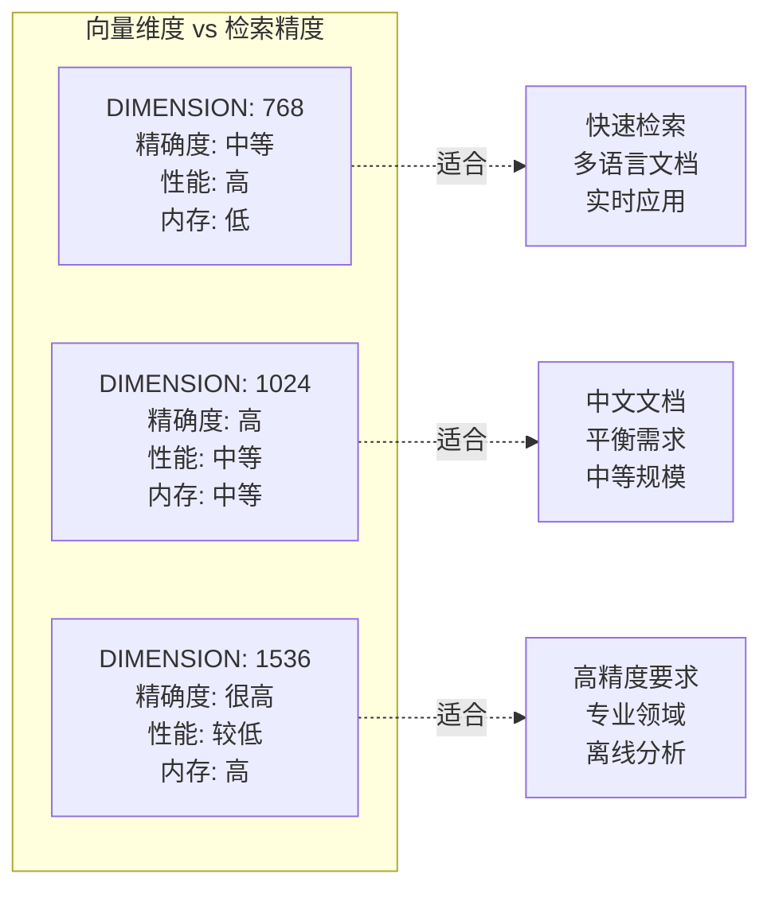
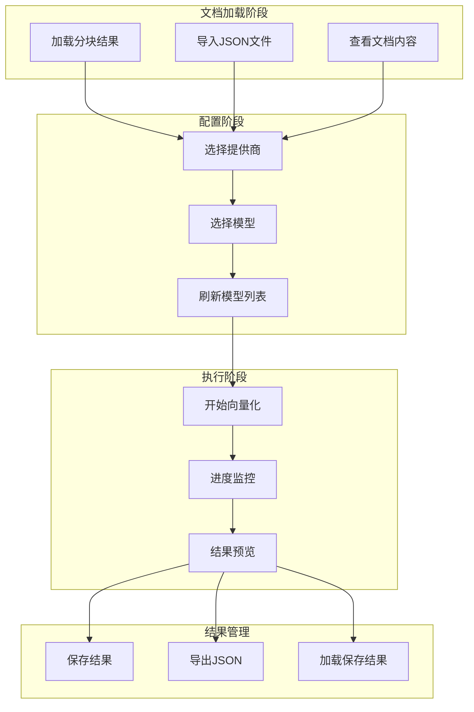

# 向量嵌入

<cite>
**本文档引用的文件**
- [embedding_service.py](file://backend/app/services/embedding_service.py)
- [document-embedding.tsx](file://web/components/views/document-embedding.tsx)
- [knowledge_base.py](file://backend/app/models/knowledge_base.py)
- [config.py](file://backend/app/config.py)
- [debug_pipeline.py](file://backend/app/controllers/debug_pipeline.py)
- [api.ts](file://web/lib/api.ts)
</cite>

## 目录
1. [简介](#简介)
2. [系统架构概览](#系统架构概览)
3. [EmbeddingServiceFactory工厂模式](#embeddingservicefactory工厂模式)
4. [OllamaEmbeddingService核心实现](#ollamaembeddingservice核心实现)
5. [HTTP请求构建与错误处理](#http请求构建与错误处理)
6. [并发控制与性能优化](#并发控制与性能优化)
7. [向量维度与检索精度](#向量维度与检索精度)
8. [前端交互设计](#前端交互设计)
9. [最佳实践与故障排除](#最佳实践与故障排除)
10. [总结](#总结)

## 简介

向量嵌入是现代检索增强生成（RAG）系统的核心组件，它将文本转换为高维向量表示，使得语义相似的文本在向量空间中距离更近。本文档深入解析RAG Studio系统中向量嵌入的完整流程，包括后端服务架构、前端交互设计以及性能优化策略。

## 系统架构概览

RAG Studio的向量嵌入系统采用分层架构设计，主要包含以下核心组件：

**图表来源**
- [document-embedding.tsx](file://web/components/views/document-embedding.tsx#L1-L50)
- [embedding_service.py](file://backend/app/services/embedding_service.py#L224-L257)
- [debug_pipeline.py](file://backend/app/controllers/debug_pipeline.py#L219-L305)

## EmbeddingServiceFactory工厂模式

EmbeddingServiceFactory采用工厂模式设计，根据配置动态创建不同类型的嵌入服务实例，体现了良好的扩展性和可维护性。

### 工厂方法实现

**图表来源**
- [embedding_service.py](file://backend/app/services/embedding_service.py#L224-L257)
- [embedding_service.py](file://backend/app/services/embedding_service.py#L48-L88)
- [embedding_service.py](file://backend/app/services/embedding_service.py#L186-L222)

### 配置驱动的服务创建

工厂方法根据提供的提供商类型自动选择合适的服务实现：

**章节来源**
- [embedding_service.py](file://backend/app/services/embedding_service.py#L228-L255)

## OllamaEmbeddingService核心实现

OllamaEmbeddingService是系统的主要嵌入服务实现，负责与Ollama API服务通信获取文本向量表示。

### 初始化配置

服务初始化时建立基础配置：

**章节来源**
- [embedding_service.py](file://backend/app/services/embedding_service.py#L55-L61)

### 核心方法设计

服务提供两个核心方法：
- `embed_text()`: 处理单个文本的向量化
- `embed_texts()`: 批量处理多个文本的向量化

**章节来源**
- [embedding_service.py](file://backend/app/services/embedding_service.py#L137-L183)

## HTTP请求构建与错误处理

### _call_ollama_api方法详解

该方法实现了完整的HTTP请求构建、发送和响应处理逻辑：

**图表来源**
- [embedding_service.py](file://backend/app/services/embedding_service.py#L62-L135)

### 错误重试机制

系统实现了智能的错误重试机制，针对不同类型的错误采用不同的处理策略：

**章节来源**
- [embedding_service.py](file://backend/app/services/embedding_service.py#L101-L131)

## 并发控制与性能优化

### Semaphore并发限制

为了防止过多并发请求导致Ollama服务过载，系统使用asyncio.Semaphore控制并发数：

**图表来源**
- [embedding_service.py](file://backend/app/services/embedding_service.py#L172-L183)

### 性能考量

这种设计考虑了以下因素：
- **资源控制**: 限制最大并发数避免服务过载
- **响应性**: 保持良好的用户体验
- **可靠性**: 通过重试机制提高成功率

**章节来源**
- [embedding_service.py](file://backend/app/services/embedding_service.py#L172-L183)

## 向量维度与检索精度

### 维度对比分析

系统支持不同维度的嵌入向量，主要模型及其特性：

| 模型名称 | 提供商 | 向量维度 | 特点 | 适用场景 |
|---------|--------|----------|------|----------|
| bge-m3:latest | Ollama | 1024 | 中文优化，高精度 | 中文文档检索 |
| nomic-embed-text:latest | Ollama | 768 | 英文通用，平衡性能 | 多语言文档 |

**章节来源**
- [debug_pipeline.py](file://backend/app/controllers/debug_pipeline.py#L277-L302)
- [knowledge_base.py](file://backend/app/models/knowledge_base.py#L36-L37)

### 维度对检索精度的影响

不同维度的向量对检索效果有显著影响：

### 检索性能指标

不同维度的向量在检索性能上的表现：

**章节来源**
- [debug_pipeline.py](file://backend/app/controllers/debug_pipeline.py#L243-L248)

## 前端交互设计

### document-embedding.tsx组件架构

前端组件提供了完整的向量嵌入工作流程：

**图表来源**
- [document-embedding.tsx](file://web/components/views/document-embedding.tsx#L1-L459)

### 模型选择与配置

前端提供了灵活的模型选择界面：

**章节来源**
- [document-embedding.tsx](file://web/components/views/document-embedding.tsx#L312-L344)

### 嵌入进度监控

系统提供了实时的嵌入进度监控：

**章节来源**
- [document-embedding.tsx](file://web/components/views/document-embedding.tsx#L350-L404)

### 结果预览与统计

向量化完成后，系统提供详细的结果预览：

**章节来源**
- [document-embedding.tsx](file://web/components/views/document-embedding.tsx#L370-L404)

## 最佳实践与故障排除

### 性能优化建议

1. **合理选择模型维度**
   - 小规模应用：768维足够
   - 中等规模：1024维平衡性能
   - 大规模应用：1536+维追求最高精度

2. **并发控制策略**
   - 根据Ollama服务性能调整信号量大小
   - 监控服务负载，动态调整并发数

3. **错误处理最佳实践**
   - 实施指数退避重试
   - 设置合理的超时时间
   - 提供详细的错误日志

### 常见问题排查

| 问题类型 | 症状 | 可能原因 | 解决方案 |
|---------|------|----------|----------|
| 连接超时 | 请求超时异常 | 网络延迟、服务负载高 | 增加超时时间、检查网络 |
| 服务器错误 | 5xx HTTP状态码 | Ollama服务异常 | 检查服务状态、重启服务 |
| 响应格式错误 | 嵌入向量格式异常 | API响应结构变化 | 更新解析逻辑 |
| 内存不足 | 服务崩溃 | 并发请求过多 | 减少并发数、增加内存 |

### 监控与调试

系统提供了完善的监控机制：

**章节来源**
- [embedding_service.py](file://backend/app/services/embedding_service.py#L101-L131)

## 总结

RAG Studio的向量嵌入系统展现了现代AI应用开发的最佳实践：

1. **架构设计**：采用工厂模式实现服务解耦，支持多种嵌入提供商
2. **可靠性**：完善的错误处理和重试机制确保服务稳定性
3. **性能优化**：通过并发控制和信号量机制平衡性能与资源使用
4. **用户体验**：前端提供直观的操作界面和实时进度反馈
5. **扩展性**：预留接口支持自定义嵌入服务，便于未来功能扩展

该系统不仅满足了当前的业务需求，还为未来的功能扩展和技术演进奠定了坚实的基础。通过合理的架构设计和性能优化，系统能够在保证高质量检索效果的同时，提供良好的用户体验和稳定的运行性能。