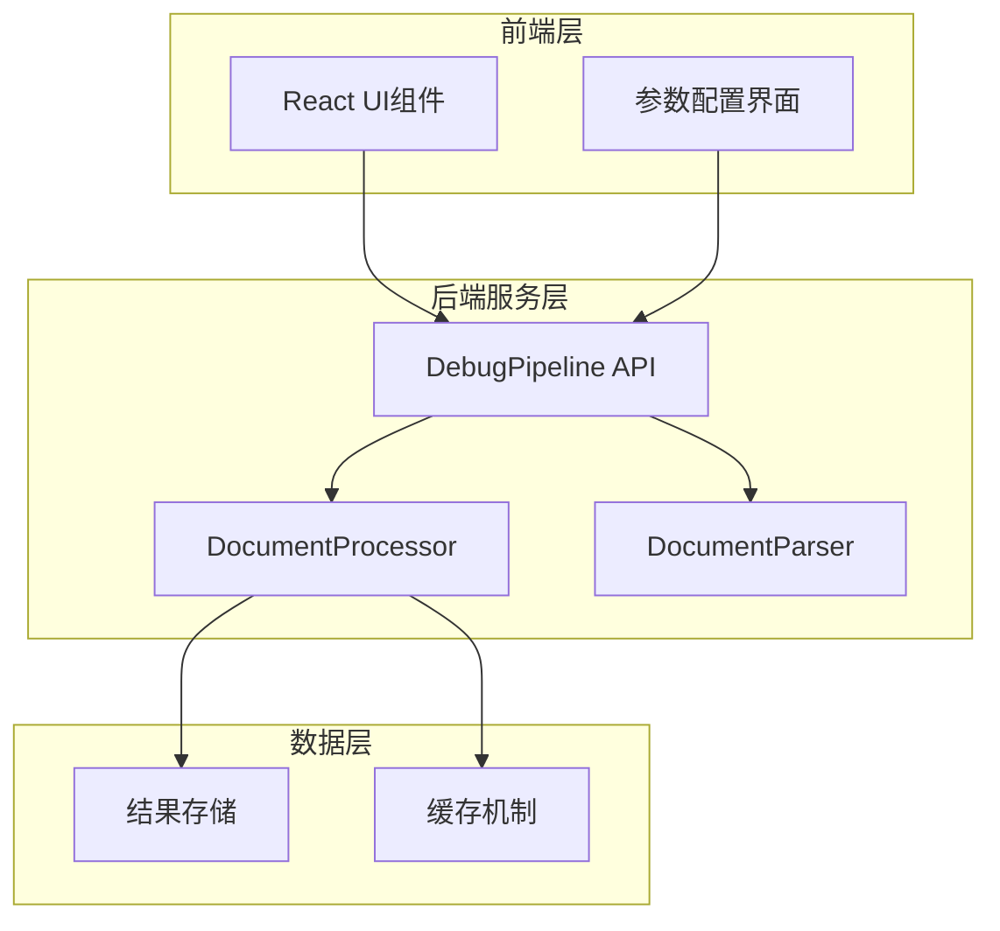
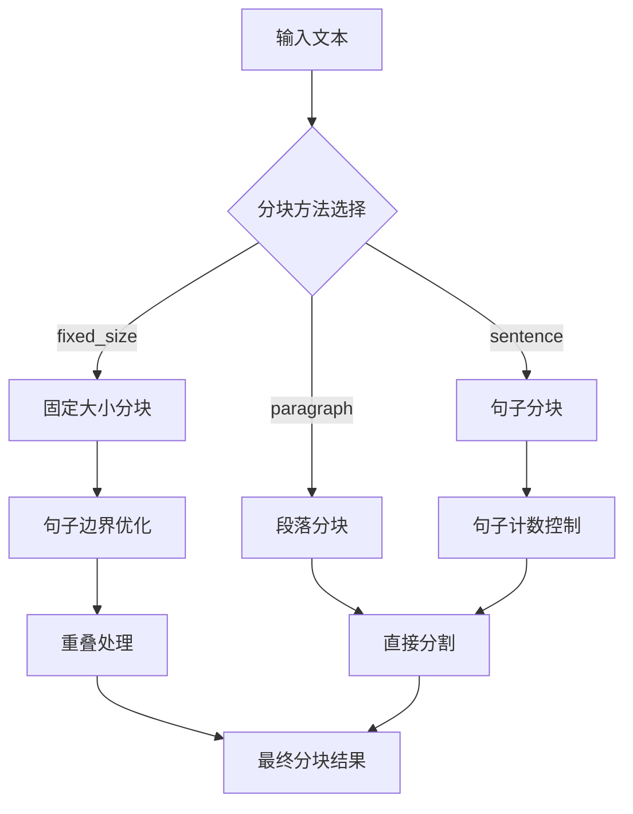
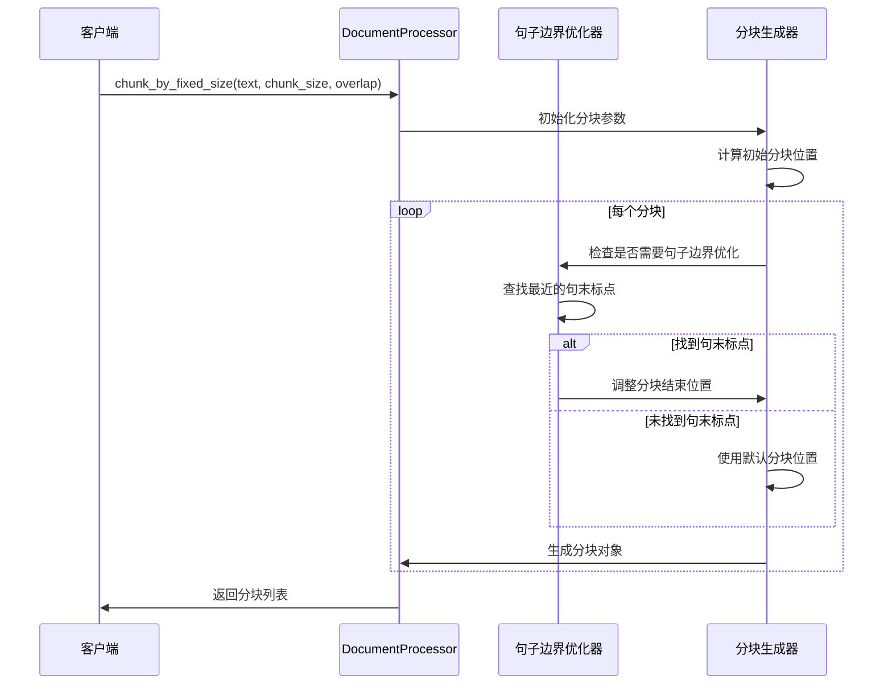
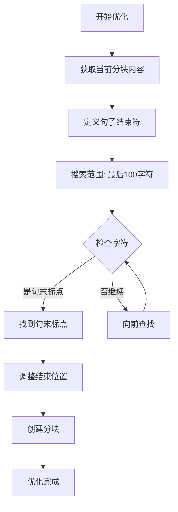
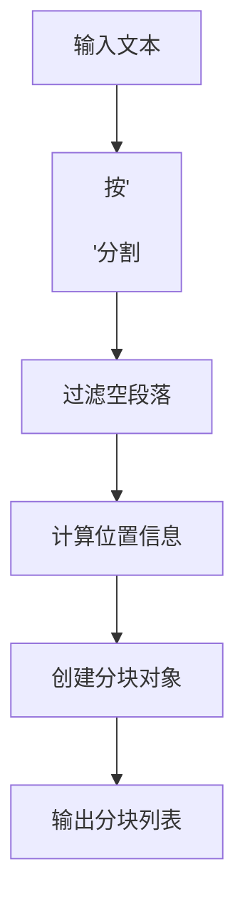
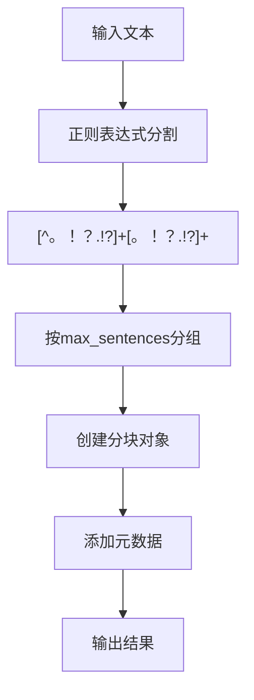
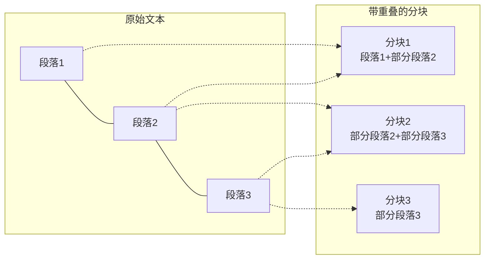
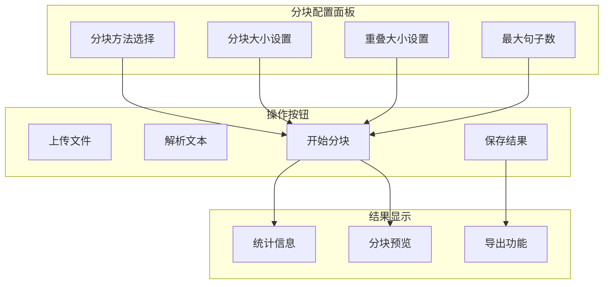

# 文本分块策略深度解析

<cite>
**本文档引用的文件**
- [document_processor.py](file://backend/app/services/document_processor.py)
- [debug_pipeline.py](file://backend/app/controllers/debug_pipeline.py)
- [document-processing.tsx](file://web/components/views/document-processing.tsx)
- [链路调试系统_架构设计.md](file://backend/链路调试系统_架构设计.md)
</cite>

## 目录
1. [引言](#引言)
2. [项目结构概览](#项目结构概览)
3. [核心分块策略](#核心分块策略)
4. [固定大小分块详解](#固定大小分块详解)
5. [段落分块策略](#段落分块策略)
6. [句子分块机制](#句子分块机制)
7. [重叠机制与语义连续性](#重叠机制与语义连续性)
8. [前端UI配置与调试](#前端ui配置与调试)
9. [性能优化建议](#性能优化建议)
10. [典型应用场景](#典型应用场景)
11. [故障排除指南](#故障排除指南)
12. [总结](#总结)

## 引言

文本分块是RAG（检索增强生成）系统中的关键预处理步骤，直接影响检索质量和生成效果。本文档深入解析RAG Studio项目中的三种分块策略：固定大小分块、段落分块和句子分块，重点阐述固定大小分块中句子边界优化算法的实现逻辑，以及分块重叠机制对语义连续性的保障作用。

## 项目结构概览

RAG Studio采用前后端分离架构，核心分块功能分布在以下模块：

**图表来源**
- [document_processing.py](file://backend/app/services/document_processor.py#L37-L328)
- [debug_pipeline.py](file://backend/app/controllers/debug_pipeline.py#L1-L50)

**章节来源**
- [document_processing.py](file://backend/app/services/document_processor.py#L1-L328)
- [debug_pipeline.py](file://backend/app/controllers/debug_pipeline.py#L1-L1786)

## 核心分块策略

系统提供三种主要的分块策略，每种都有其独特的适用场景和优势：

**图表来源**
- [document_processing.py](file://backend/app/services/document_processor.py#L204-L232)

### 分块策略对比表

| 特性 | 固定大小分块 | 段落分块 | 句子分块 |
|------|-------------|----------|----------|
| **语义完整性** | 中等 | 高 | 高 |
| **块大小一致性** | 高 | 低 | 中等 |
| **处理速度** | 快 | 中等 | 较慢 |
| **适用场景** | 大规模文档 | 结构化文档 | 精确控制 |
| **重叠支持** | ✅ | ❌ | ❌ |

## 固定大小分块详解

固定大小分块是最常用的策略，通过设定固定的字符数来切分文本，同时具备智能的句子边界优化功能。

### 核心算法实现

固定大小分块的核心算法包含以下关键步骤：

**图表来源**
- [document_processing.py](file://backend/app/services/document_processor.py#L60-L119)

### 句子边界优化算法

句子边界优化是固定大小分块的核心创新，确保不会在句子中间截断：

#### 优化算法流程

**图表来源**
- [document_processing.py](file://backend/app/services/document_processor.py#L89-L97)

#### 句末标点检测机制

系统支持中英文双语文本的句子边界识别：

| 语言类型 | 句末标点 | ASCII码范围 | 用途 |
|----------|----------|-------------|------|
| **中文** | 句号 | 。 | 标准句末 |
| | 问号 | ？ | 疑问句末尾 |
| | 感叹号 | ！ | 感叹句末尾 |
| **英文** | 句号 | . | 标准句末 |
| | 问号 | ? | 疑问句末尾 |
| | 感叹号 | ! | 感叹句末尾 |
| **通用** | 换行符 | \n | 段落分隔 |

### 实现细节分析

固定大小分块的实现包含以下关键逻辑：

#### 1. 分块边界计算
- **起始位置**: `start = end - chunk_overlap`
- **结束位置**: `end = min(start + chunk_size, text_length)`
- **重叠处理**: `start = end - chunk_overlap`

#### 2. 无限循环防护
系统实现了完善的循环保护机制：
- **条件检查**: `if end >= text_length: break`
- **进度跟踪**: 确保每次迭代都有进展
- **异常处理**: 防止极端情况下的死循环

**章节来源**
- [document_processing.py](file://backend/app/services/document_processor.py#L60-L119)

## 段落分块策略

段落分块基于文本的自然结构进行切分，适用于结构化文档如学术论文、技术文档等。

### 实现原理

段落分块采用简单的文本分割策略：

**图表来源**
- [document_processing.py](file://backend/app/services/document_processor.py#L124-L157)

### 优势与局限性

#### 优势
- **语义完整性**: 保持完整的段落语义
- **结构保留**: 维护文档的层次结构
- **处理效率**: 算法简单，执行快速

#### 局限性
- **大小不均**: 不同段落长度差异较大
- **缺乏灵活性**: 无法适应不同内容密度
- **重叠缺失**: 不支持语义连续性保障

**章节来源**
- [document_processing.py](file://backend/app/services/document_processor.py#L124-L157)

## 句子分块机制

句子分块提供了最精细的控制粒度，通过限制每个分块的句子数量来平衡语义完整性和大小一致性。

### 核心算法

句子分块采用正则表达式进行句子分割：

**图表来源**
- [document_processing.py](file://backend/app/services/document_processor.py#L160-L206)

### 句子分割策略

#### 1. 正则表达式设计
系统使用统一的句子分割模式：
- **中文句子**: `[^。！？.!?]+[。！？.!?]+`
- **英文句子**: `[^。！？.!?]+[。！？.!?]+`（兼容中英文）

#### 2. 最大句子数控制
- **默认值**: 5个句子
- **可配置**: 通过`max_sentences`参数调整
- **动态计算**: 自动计算分块数量

#### 3. 元数据管理
每个句子分块包含丰富的元数据：
- `chunk_method`: "sentence"
- `sentence_count`: 实际包含的句子数量

**章节来源**
- [document_processing.py](file://backend/app/services/document_processor.py#L160-L206)

## 重叠机制与语义连续性

分块重叠是确保语义连续性的关键技术，通过在相邻分块间建立重叠区域来避免信息丢失。

### 重叠机制原理

**图表来源**
- [document_processing.py](file://backend/app/services/document_processor.py#L113-L114)

### 重叠计算公式

固定大小分块的重叠计算遵循以下公式：

#### 基础公式
- **当前分块结束位置**: `end = min(start + chunk_size, text_length)`
- **下一分块起始位置**: `start = end - chunk_overlap`
- **重叠区域**: `chunk_overlap` 字符

#### 边界处理
- **首分块**: `start = 0`（无重叠）
- **末分块**: `end = text_length`（无重叠）
- **中间分块**: 应用标准重叠公式

### 语义连续性保障

重叠机制通过以下方式保障语义连续性：

#### 1. 上下文保留
- **前向重叠**: 保留前一个分块的部分内容
- **后向重叠**: 保留后一个分块的部分内容
- **双向覆盖**: 确保重要信息不被遗漏

#### 2. 检索质量提升
- **信息完整性**: 避免关键信息被截断
- **上下文关联**: 保持检索结果的连贯性
- **查询扩展**: 支持基于上下文的查询扩展

**章节来源**
- [document_processing.py](file://backend/app/services/document_processor.py#L113-L114)

## 前端UI配置与调试

前端提供了直观的配置界面，支持实时参数调整和效果预览。

### 配置界面设计

**图表来源**
- [document-processing.tsx](file://web/components/views/document-processing.tsx#L278-L313)

### 参数配置详解

#### 1. 分块方法选择
- **固定大小**: `fixed_size` - 默认选项，适用于大多数场景
- **按段落**: `paragraph` - 保持文档结构
- **按句子**: `sentence` - 精确控制粒度

#### 2. 核心参数配置

| 参数名称 | 默认值 | 可选范围 | 说明 |
|----------|--------|----------|------|
| **分块大小** | 500 | 100-2000 | 每个分块的字符数 |
| **重叠大小** | 50 | 0-200 | 相邻分块的重叠字符数 |
| **最大句子数** | 5 | 1-20 | 句子分块时每块的句子数量 |

#### 3. 实时效果预览
- **统计信息**: 平均字符数、最大/最小字符数
- **分块预览**: 前10个分块的内容预览
- **进度指示**: 分块过程的实时反馈

### 调试接口功能

后端提供了完整的调试接口支持：

#### 1. 结果保存与加载
- **本地保存**: 将分块结果保存到浏览器存储
- **批量加载**: 从历史结果中选择加载
- **JSON导入**: 支持外部JSON文件导入

#### 2. 结果导出功能
- **格式**: JSON格式，包含所有分块数据
- **元数据**: 包含配置信息和统计信息
- **兼容性**: 支持跨平台数据交换

**章节来源**
- [document-processing.tsx](file://web/components/views/document-processing.tsx#L1-L422)
- [debug_pipeline.py](file://backend/app/controllers/debug_pipeline.py#L1365-L1502)

## 性能优化建议

基于对代码实现的深入分析，提出以下性能优化建议：

### 1. 算法优化

#### 固定大小分块优化
- **提前终止**: 在找到句末标点后立即停止搜索
- **缓存机制**: 缓存常用句末标点的查找结果
- **批量处理**: 对大量文本采用批量处理策略

#### 正则表达式优化
- **编译缓存**: 预编译正则表达式对象
- **模式简化**: 优化句子分割正则表达式
- **内存管理**: 及时释放大型文本的内存占用

### 2. 内存优化

#### 1. 流式处理
- **逐批处理**: 对超大文档采用流式分块
- **内存监控**: 实时监控内存使用情况
- **垃圾回收**: 主动触发垃圾回收机制

#### 2. 数据结构优化
- **对象池**: 复用Chunk对象减少内存分配
- **延迟加载**: 按需加载分块内容
- **压缩存储**: 对历史结果进行压缩存储

### 3. 并发优化

#### 1. 异步处理
- **并发分块**: 支持多线程并发分块
- **流水线处理**: 实现分块-处理-存储的流水线
- **异步I/O**: 优化文件读写性能

#### 2. 负载均衡
- **任务队列**: 实现分块任务的队列管理
- **资源调度**: 动态调整并发度
- **错误恢复**: 实现任务失败的自动重试

### 4. 缓存策略

#### 1. 多级缓存
- **内存缓存**: 缓存频繁访问的分块结果
- **磁盘缓存**: 缓存大型文档的解析结果
- **分布式缓存**: 支持集群环境下的缓存共享

#### 2. 缓存失效
- **时间策略**: 基于时间的缓存失效
- **LRU淘汰**: 最近最少使用的缓存淘汰
- **手动刷新**: 支持手动刷新缓存

## 典型应用场景

基于不同的业务需求，推荐以下应用场景和配置方案：

### 1. 学术论文处理

#### 推荐配置
- **分块方法**: `paragraph`
- **分块大小**: 800-1200字符
- **重叠大小**: 100-150字符
- **理由**: 保持完整的段落语义，适合学术内容的深度理解

#### 应用场景
- **文献综述**: 处理长篇学术文章
- **研究论文**: 分解复杂的研究内容
- **教材分析**: 教学材料的结构化处理

### 2. 技术文档处理

#### 推荐配置
- **分块方法**: `fixed_size`
- **分块大小**: 500-800字符
- **重叠大小**: 50-100字符
- **理由**: 平衡语义完整性和处理效率

#### 应用场景
- **API文档**: 技术规范的分块处理
- **开发手册**: 开发指南的结构化组织
- **用户手册**: 操作指南的分块管理

### 3. 新闻资讯处理

#### 推荐配置
- **分块方法**: `sentence`
- **最大句子数**: 3-5个句子
- **理由**: 保持新闻内容的时效性和完整性

#### 应用场景
- **新闻聚合**: 多源新闻的标准化处理
- **内容摘要**: 新闻内容的智能摘要
- **情感分析**: 新闻文本的情感分析

### 4. 法律文档处理

#### 推荐配置
- **分块方法**: `paragraph`
- **分块大小**: 1000-1500字符
- **重叠大小**: 200-300字符
- **理由**: 严格的法律条款需要完整的上下文

#### 应用场景
- **合同文本**: 商业合同的条款分解
- **法规解读**: 法律条文的结构化处理
- **案例分析**: 法律案例的文本分析

### 5. 大规模文档处理

#### 推荐配置
- **分块方法**: `fixed_size`
- **分块大小**: 1000-2000字符
- **重叠大小**: 200-400字符
- **并发处理**: 启用多线程处理
- **理由**: 高效处理大规模文档集合

#### 应用场景
- **企业知识库**: 大量企业文档的统一处理
- **档案管理**: 历史档案的数字化处理
- **内容迁移**: 不同系统的文档迁移

## 故障排除指南

### 常见问题及解决方案

#### 1. 分块结果不符合预期

**症状**: 分块大小不均匀或语义不完整

**排查步骤**:
1. 检查分块方法选择是否合适
2. 验证参数配置是否合理
3. 分析文本的语言特征和结构

**解决方案**:
- 调整分块方法：从`fixed_size`切换到`paragraph`
- 优化参数：增加重叠大小或调整分块大小
- 文本预处理：清理特殊字符和格式

#### 2. 性能问题

**症状**: 分块处理速度慢或内存占用过高

**排查步骤**:
1. 检查文档大小是否超出处理能力
2. 监控内存使用情况
3. 分析算法复杂度

**解决方案**:
- 启用流式处理：对大文档采用分批处理
- 优化内存使用：及时释放不需要的对象
- 调整并发度：根据系统资源调整处理线程

#### 3. 句子边界识别错误

**症状**: 句子被错误地截断或合并

**排查步骤**:
1. 检查文本的语言类型
2. 验证句末标点的使用
3. 分析特殊格式的影响

**解决方案**:
- 增加句末标点类型：扩展支持更多语言的标点
- 文本清洗：移除影响识别的特殊字符
- 算法调整：优化正则表达式匹配规则

#### 4. 前端UI响应问题

**症状**: 分块过程中界面卡顿或无响应

**排查步骤**:
1. 检查JavaScript执行时间
2. 监控DOM操作频率
3. 分析网络请求状态

**解决方案**:
- 异步处理：将分块计算移到Web Worker
- 虚拟滚动：对大量分块采用虚拟化显示
- 进度反馈：提供详细的处理进度信息

### 调试技巧

#### 1. 日志分析
- **启用详细日志**: 设置DEBUG级别日志
- **关键节点标记**: 在重要处理节点添加日志
- **性能监控**: 记录各阶段的处理时间

#### 2. 数据验证
- **输入验证**: 检查输入文本的格式和编码
- **输出验证**: 验证分块结果的完整性和正确性
- **边界测试**: 测试极端情况下的处理行为

#### 3. 性能分析
- **内存分析**: 使用内存分析工具检测内存泄漏
- **CPU分析**: 分析算法的CPU占用情况
- **I/O分析**: 优化文件读写的性能

**章节来源**
- [debug_pipeline.py](file://backend/app/controllers/debug_pipeline.py#L1433-L1502)

## 总结

RAG Studio的文本分块策略体现了现代RAG系统设计的最佳实践，通过三种不同的分块方法满足多样化的业务需求。固定大小分块的句子边界优化算法展现了对中文文本特性的深刻理解，而重叠机制的设计则充分考虑了语义连续性的保障。

### 核心优势

1. **算法创新**: 句子边界优化算法有效解决了中文文本分块的特殊挑战
2. **灵活配置**: 支持多种分块方法和参数组合，适应不同场景需求
3. **性能优化**: 通过重叠机制和智能算法确保处理效率
4. **用户体验**: 完善的前端界面和调试功能提升了开发体验

### 发展方向

1. **智能优化**: 基于机器学习的自适应分块策略
2. **多模态支持**: 支持图片、表格等非文本内容的分块
3. **实时处理**: 实现流式和实时的文本分块处理
4. **质量评估**: 提供分块质量的自动化评估指标

通过深入理解和合理运用这些分块策略，开发者可以构建更加高效和准确的RAG系统，为用户提供优质的检索增强生成体验。