# 文本分词模块详细文档

<cite>
**本文档引用的文件**
- [tokenizer_service.py](file://backend/app/services/tokenizer_service.py)
- [document-tokenization.tsx](file://web/components/views/document-tokenization.tsx)
- [debug_pipeline.py](file://backend/app/controllers/debug_pipeline.py)
- [document_processor.py](file://backend/app/services/document_processor.py)
- [document.py](file://backend/app/schemas/document.py)
</cite>

## 目录
1. [概述](#概述)
2. [项目结构](#项目结构)
3. [核心组件](#核心组件)
4. [架构概览](#架构概览)
5. [详细组件分析](#详细组件分析)
6. [依赖关系分析](#依赖关系分析)
7. [性能考虑](#性能考虑)
8. [故障排除指南](#故障排除指南)
9. [结论](#结论)

## 概述

RAG Studio的文本分词模块是一个综合性的中文文本处理系统，主要基于jieba分词库构建，提供完整的分词、词频统计、关键词提取和稀疏向量生成功能。该模块在评估系统中发挥关键作用，特别是在embedding成本预估和文本分析方面具有重要价值。

### 主要特性

- **多模式分词**：支持精确模式、搜索引擎模式和全模式三种分词策略
- **智能停用词过滤**：内置中文常见停用词库，支持自定义停用词扩展
- **词频统计**：提供词频分析和高频词提取功能
- **关键词提取**：基于TF-IDF算法的关键词提取
- **稀疏向量生成**：支持多种稀疏向量生成算法（BM25、TF-IDF、SPLADE等）
- **token估算**：针对中英文混合文本的智能token数量估算
- **自定义词典**：支持用户自定义词典扩展
- **可视化界面**：提供直观的分词结果展示和交互式配置

## 项目结构

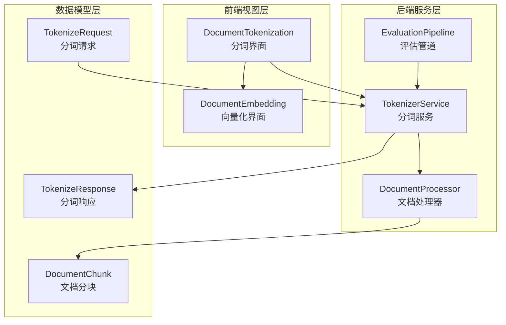

**图表来源**
- [tokenizer_service.py](file://backend/app/services/tokenizer_service.py#L1-L50)
- [document-tokenization.tsx](file://web/components/views/document-tokenization.tsx#L1-L50)

**章节来源**
- [tokenizer_service.py](file://backend/app/services/tokenizer_service.py#L1-L277)
- [document-tokenization.tsx](file://web/components/views/document-tokenization.tsx#L1-L793)

## 核心组件

### TokenizerService 分词服务

TokenizerService是整个分词模块的核心服务，基于jieba分词库提供强大的中文分词能力。

#### 主要功能特性

1. **延迟加载机制**：避免不必要的jieba库加载
2. **多模式分词**：
   - `default`：精确模式，适合文本分析
   - `search`：搜索引擎模式，适合检索场景  
   - `all`：全模式，速度快但可能冗余
3. **停用词管理**：
   - 内置100+个常用中文停用词
   - 支持动态添加和移除停用词
   - 支持从文件加载停用词
4. **词频统计**：提供词频分析和高频词提取
5. **关键词提取**：基于TF-IDF算法的关键词提取
6. **自定义词典**：支持用户自定义词典扩展
7. **新词发现**：基于HMM算法的新词识别

#### Token估算算法

系统实现了智能的token估算算法，针对中英文混合文本提供准确的成本预估：

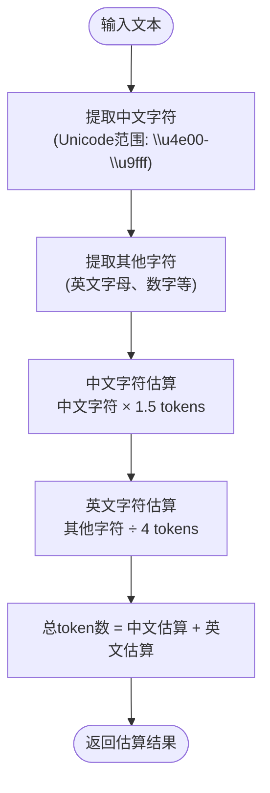

**图表来源**
- [document_processor.py](file://backend/app/services/document_processor.py#L234-L246)

**章节来源**
- [tokenizer_service.py](file://backend/app/services/tokenizer_service.py#L13-L277)

### 前端分词界面

前端提供了直观的分词操作界面，支持文档加载、参数配置、结果预览和保存功能。

#### 界面功能模块

1. **文档选择模块**：支持从已保存结果或JSON文件导入
2. **分词配置模块**：可配置分词模式和停用词过滤
3. **稀疏向量配置模块**：支持多种向量生成算法
4. **结果预览模块**：实时展示分词和向量生成结果
5. **保存/加载模块**：支持结果持久化和历史记录管理

**章节来源**
- [document-tokenization.tsx](file://web/components/views/document-tokenization.tsx#L1-L793)

## 架构概览

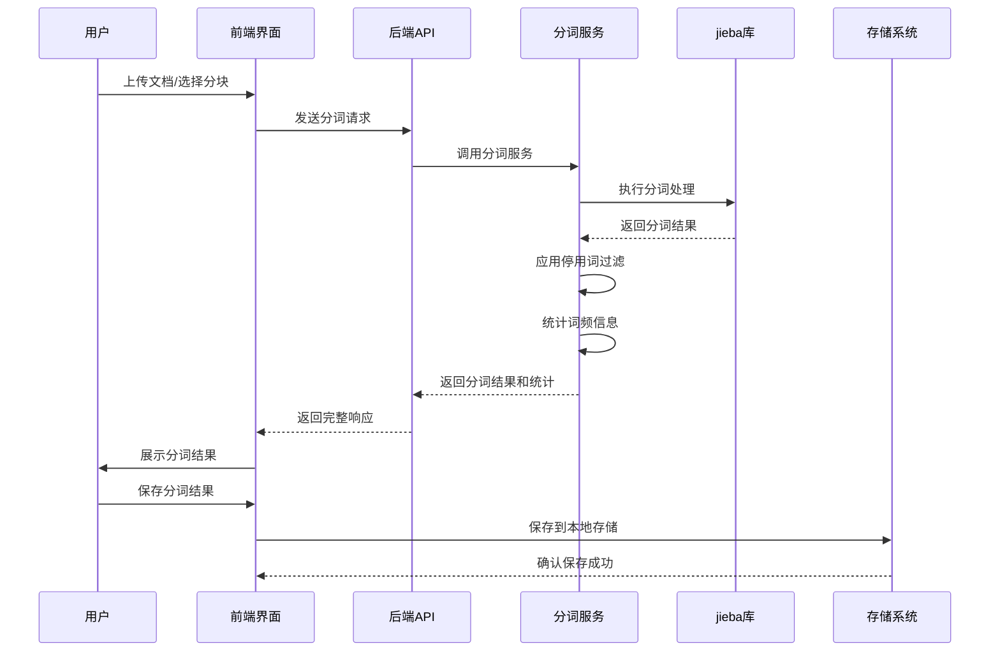

**图表来源**
- [document-tokenization.tsx](file://web/components/views/document-tokenization.tsx#L65-L90)
- [debug_pipeline.py](file://backend/app/controllers/debug_pipeline.py#L307-L347)

## 详细组件分析

### 分词服务核心实现

#### 初始化与配置

TokenizerService采用延迟加载机制，确保只有在实际使用时才加载jieba库：

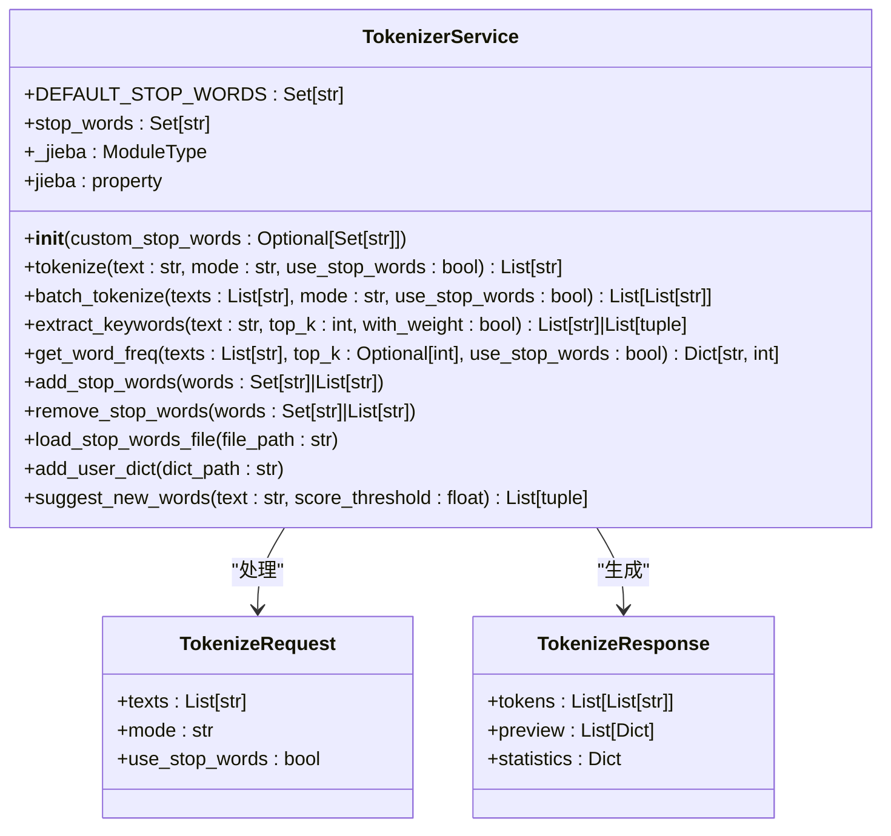

**图表来源**
- [tokenizer_service.py](file://backend/app/services/tokenizer_service.py#L13-L277)
- [debug_pipeline.py](file://backend/app/controllers/debug_pipeline.py#L42-L65)

#### 分词模式详解

系统提供三种不同的分词模式，每种模式适用于不同的应用场景：

| 分词模式 | 描述 | 适用场景 | 性能特点 |
|---------|------|----------|----------|
| default | 精确模式 | 文本分析、语义理解 | 准确性高，速度中等 |
| search | 搜索引擎模式 | 检索系统、关键词匹配 | 平衡准确性与召回率 |
| all | 全模式 | 快速处理、候选词提取 | 速度快，可能产生冗余 |

#### 停用词管理系统

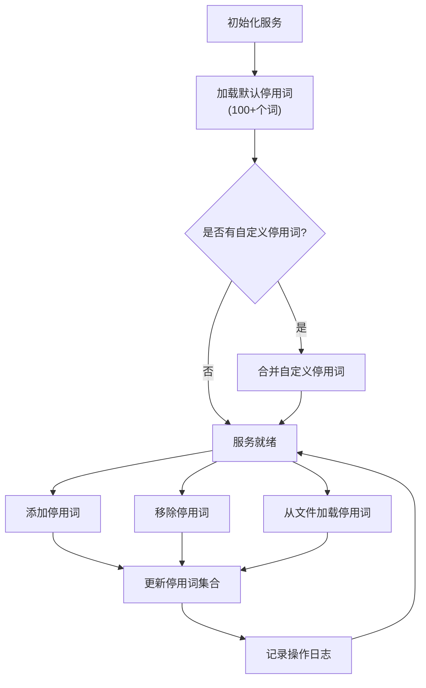

**图表来源**
- [tokenizer_service.py](file://backend/app/services/tokenizer_service.py#L17-L49)
- [tokenizer_service.py](file://backend/app/services/tokenizer_service.py#L178-L218)

**章节来源**
- [tokenizer_service.py](file://backend/app/services/tokenizer_service.py#L47-L89)
- [tokenizer_service.py](file://backend/app/services/tokenizer_service.py#L178-L218)

### 前端交互组件

#### 状态管理架构

前端采用React Hooks进行状态管理，实现了复杂的状态同步和数据流控制：

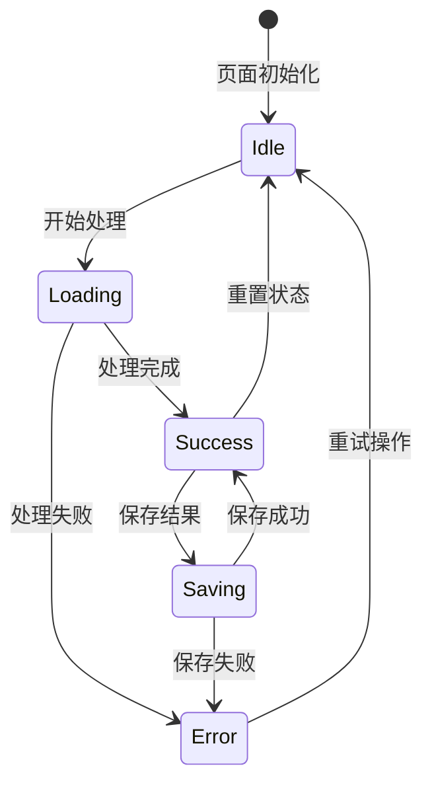

**图表来源**
- [document-tokenization.tsx](file://web/components/views/document-tokenization.tsx#L10-L40)

#### 数据流处理

前端实现了完整的数据流处理机制，支持批量处理和错误恢复：

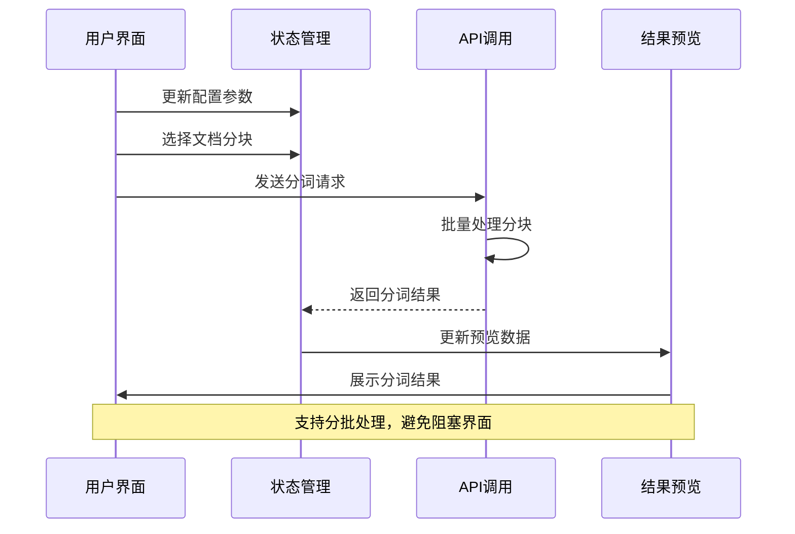

**图表来源**
- [document-tokenization.tsx](file://web/components/views/document-tokenization.tsx#L65-L90)

**章节来源**
- [document-tokenization.tsx](file://web/components/views/document-tokenization.tsx#L65-L90)
- [document-tokenization.tsx](file://web/components/views/document-tokenization.tsx#L10-L40)

### Token估算与成本预估

#### 估算算法实现

系统实现了基于字符类型的智能token估算算法，能够准确预估embedding成本：

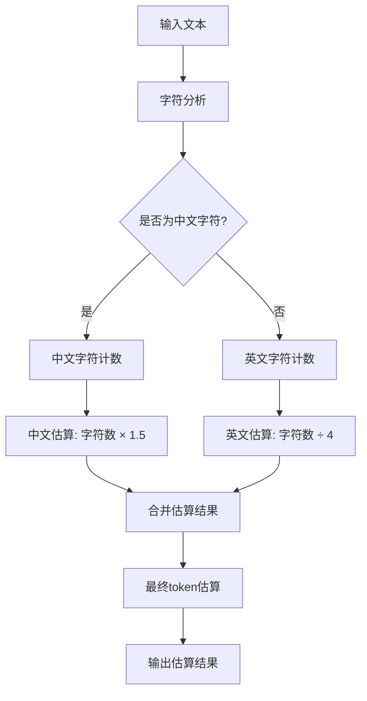

**图表来源**
- [document_processor.py](file://backend/app/services/document_processor.py#L234-L246)

#### 成本预估应用场景

1. **embedding费用计算**：根据token数量预估embedding API费用
2. **资源规划**：帮助用户合理分配计算资源
3. **性能优化**：指导分词策略选择
4. **预算控制**：为企业级应用提供成本控制依据

**章节来源**
- [document_processor.py](file://backend/app/services/document_processor.py#L234-L246)

### 自定义词典扩展

#### 词典管理功能

系统提供了完整的自定义词典管理功能，支持用户扩展专业术语和特殊词汇：

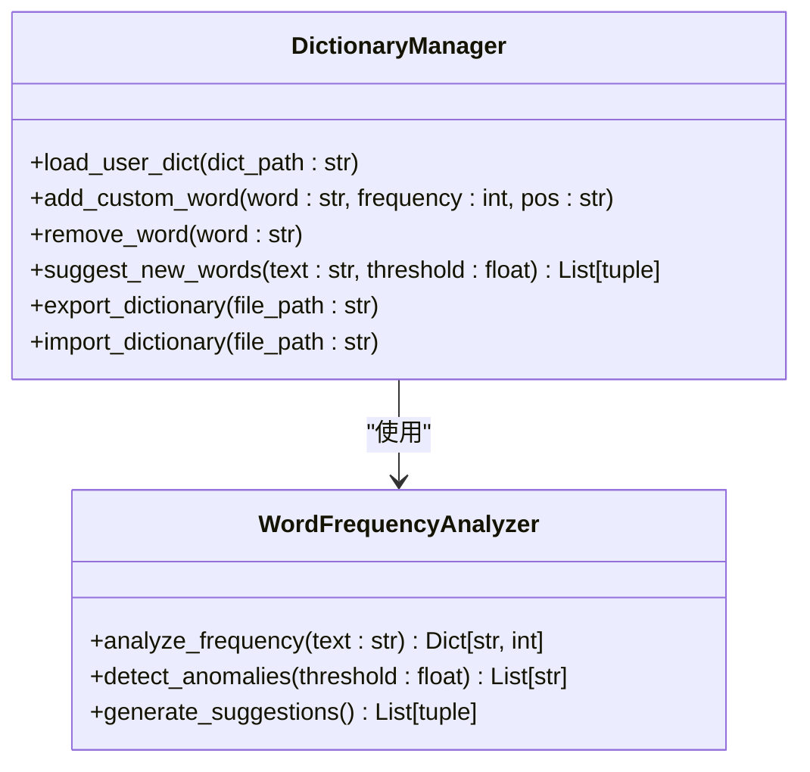

**图表来源**
- [tokenizer_service.py](file://backend/app/services/tokenizer_service.py#L216-L275)

#### 特殊术语处理

系统支持多种特殊术语的处理方式：

| 处理方式 | 描述 | 适用场景 | 配置方法 |
|---------|------|----------|----------|
| 自定义词典 | 用户手动添加专业术语 | 行业术语、专有名词 | `.txt`文件格式 |
| 新词发现 | 基于HMM算法自动识别 | 新兴词汇、技术术语 | 系统自动分析 |
| 频率过滤 | 基于词频统计过滤噪声 | 通用词汇、重复词 | 阈值配置 |
| 位置标注 | 为词语添加词性标注 | 语法分析、语义理解 | 手动标注 |

**章节来源**
- [tokenizer_service.py](file://backend/app/services/tokenizer_service.py#L216-L275)

## 依赖关系分析

### 后端依赖关系

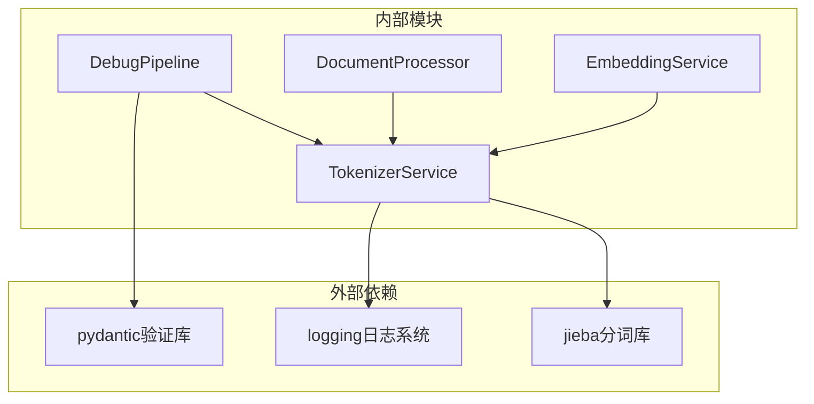

**图表来源**
- [tokenizer_service.py](file://backend/app/services/tokenizer_service.py#L1-L10)
- [debug_pipeline.py](file://backend/app/controllers/debug_pipeline.py#L1-L20)

### 前端依赖关系

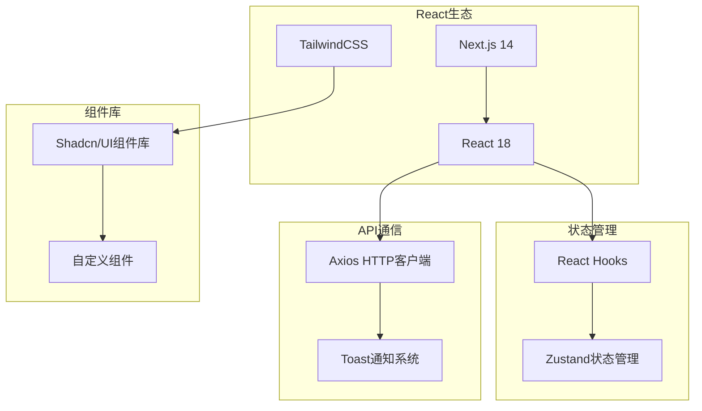

**图表来源**
- [document-tokenization.tsx](file://web/components/views/document-tokenization.tsx#L1-L10)

**章节来源**
- [tokenizer_service.py](file://backend/app/services/tokenizer_service.py#L1-L10)
- [document-tokenization.tsx](file://web/components/views/document-tokenization.tsx#L1-L10)

## 性能考虑

### 分词性能优化

1. **延迟加载机制**：避免不必要的jieba库加载
2. **批量处理**：支持批量分词减少API调用次数
3. **分批处理**：前端实现分批处理避免阻塞界面
4. **缓存策略**：对频繁使用的分词结果进行缓存

### 内存使用优化

1. **流式处理**：大文件采用流式读取避免内存溢出
2. **结果压缩**：对大量分词结果进行压缩存储
3. **及时释放**：处理完成后及时释放中间变量

### 并发处理能力

系统支持并发处理多个文档分块，提高整体处理效率：

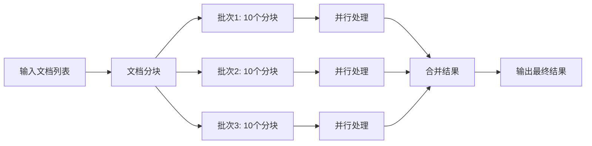

**图表来源**
- [document-tokenization.tsx](file://web/components/views/document-tokenization.tsx#L107-L160)

## 故障排除指南

### 常见问题及解决方案

#### jieba库加载失败

**问题描述**：系统提示jieba未安装或加载失败

**解决方案**：
1. 确保已安装jieba库：`pip install jieba`
2. 检查Python环境配置
3. 验证jieba版本兼容性

#### 分词结果异常

**问题描述**：分词结果不符合预期

**排查步骤**：
1. 检查分词模式设置
2. 验证停用词配置
3. 确认输入文本格式
4. 检查自定义词典加载

#### 性能问题

**问题描述**：分词处理速度过慢

**优化建议**：
1. 使用搜索引擎模式替代精确模式
2. 减少停用词过滤
3. 优化批量处理批次大小
4. 考虑使用全模式处理

**章节来源**
- [tokenizer_service.py](file://backend/app/services/tokenizer_service.py#L45-L51)
- [document-tokenization.tsx](file://web/components/views/document-tokenization.tsx#L75-L90)

## 结论

RAG Studio的文本分词模块是一个功能完善、架构合理的综合性中文文本处理系统。通过jieba分词库的强大功能和精心设计的架构，该模块能够满足各种复杂的文本分析需求。

### 主要优势

1. **功能完整性**：涵盖分词、词频统计、关键词提取、稀疏向量生成等全方位功能
2. **用户体验**：提供直观的前端界面和丰富的配置选项
3. **性能优化**：采用延迟加载、批量处理等优化策略
4. **扩展性强**：支持自定义词典和停用词扩展
5. **成本控制**：提供智能的token估算功能

### 应用价值

1. **评估系统支撑**：为embedding成本预估提供准确的数据基础
2. **文本分析工具**：支持各种文本挖掘和分析任务
3. **教育研究平台**：为自然语言处理研究提供实验环境
4. **企业级应用**：支持大规模文档处理和知识管理

该模块的设计充分体现了现代软件工程的最佳实践，为RAG Studio的整体功能提供了坚实的技术基础。