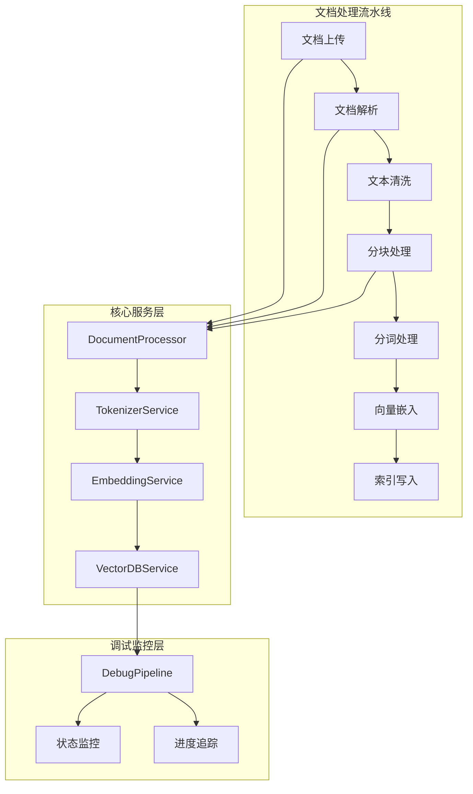
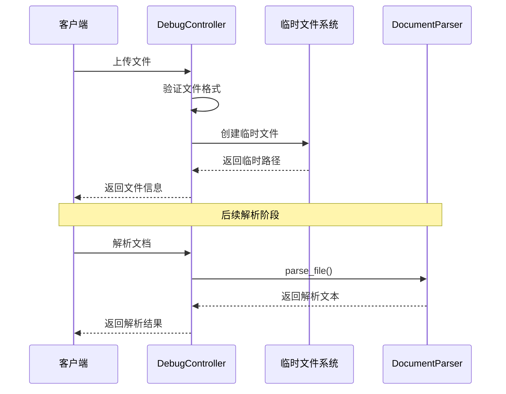
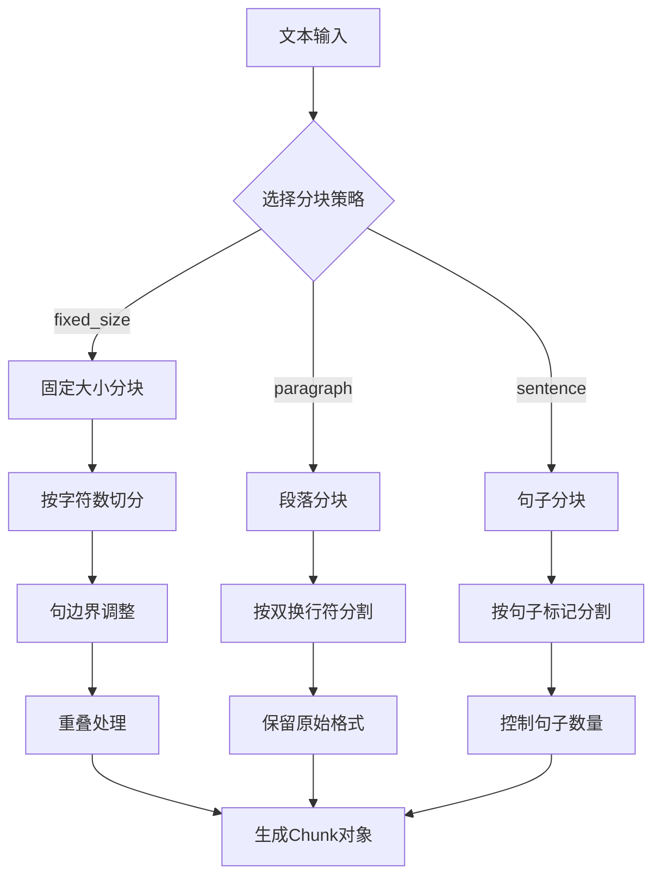
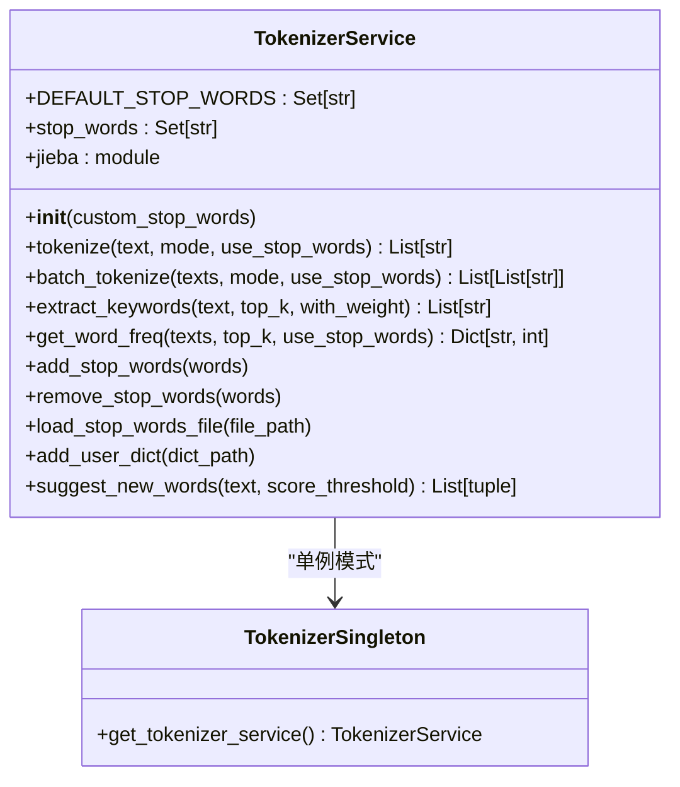
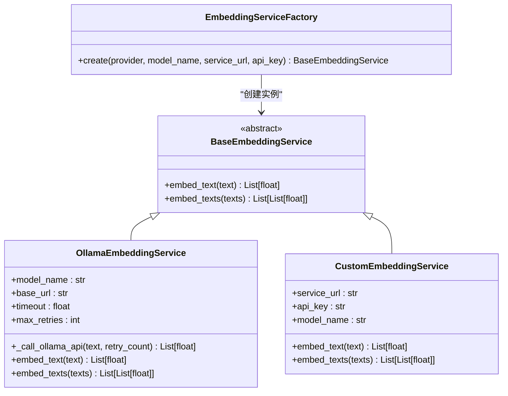
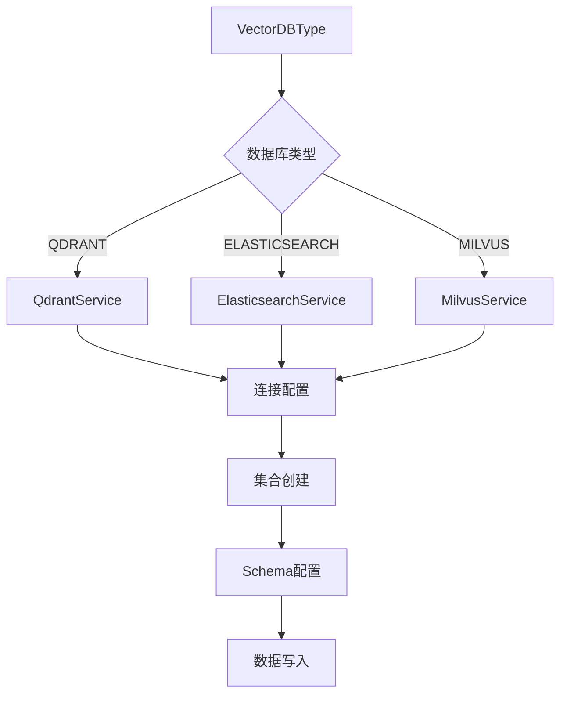
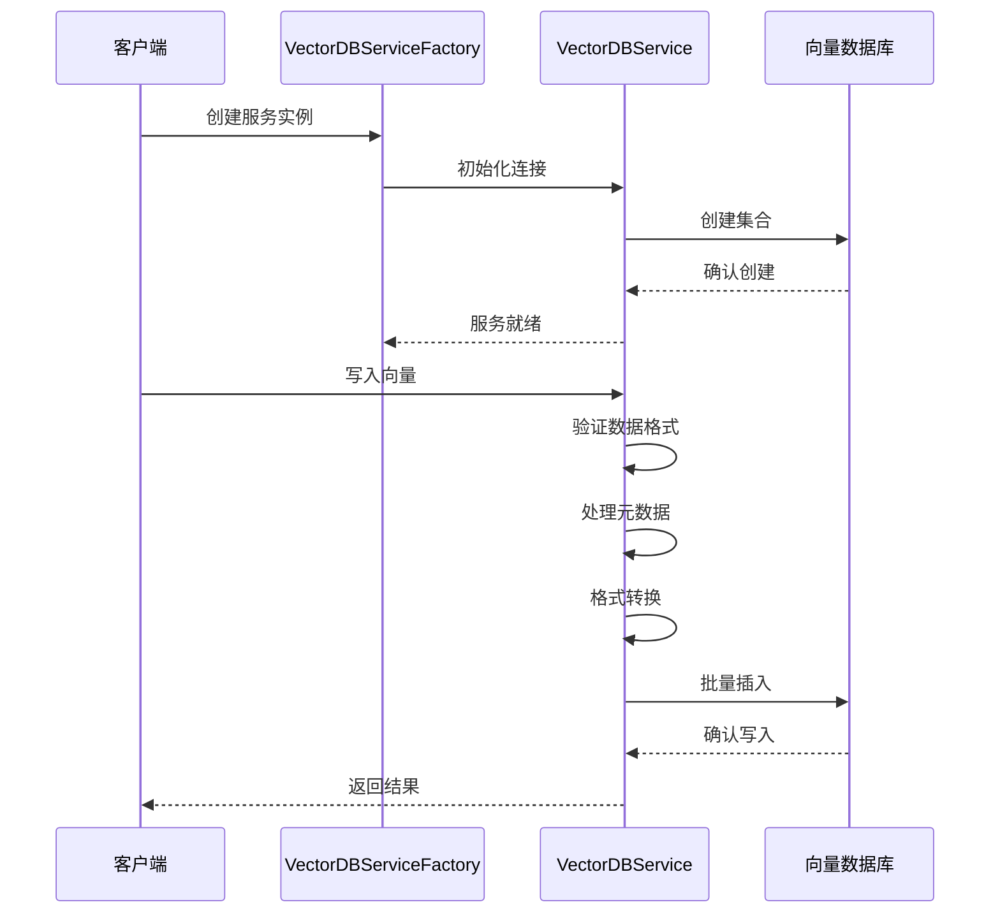
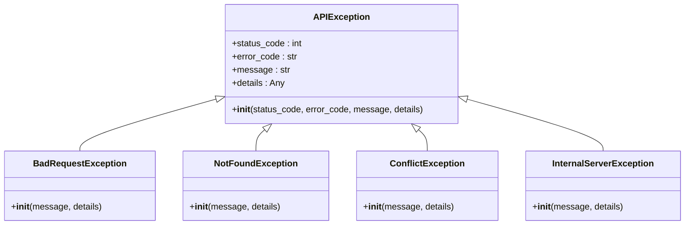
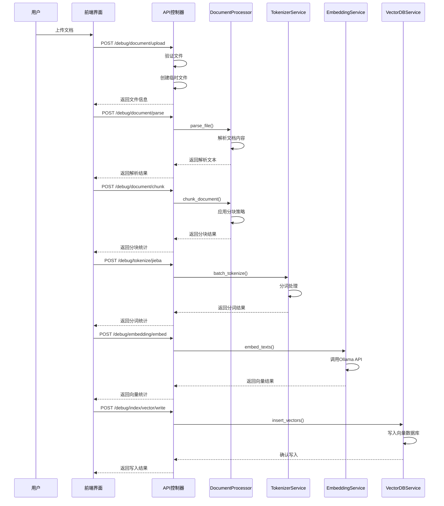

# 文档处理全流程深度解析

<cite>
**本文档引用的文件**
- [document_processor.py](file://backend/app/services/document_processor.py)
- [tokenizer_service.py](file://backend/app/services/tokenizer_service.py)
- [embedding_service.py](file://backend/app/services/embedding_service.py)
- [vector_db_service.py](file://backend/app/services/vector_db_service.py)
- [debug_pipeline.py](file://backend/app/controllers/debug_pipeline.py)
- [knowledge_base.py](file://backend/app/services/knowledge_base.py)
- [models/knowledge_base.py](file://backend/app/models/knowledge_base.py)
- [config.py](file://backend/app/config.py)
- [exceptions.py](file://backend/app/core/exceptions.py)
</cite>

## 目录
1. [概述](#概述)
2. [系统架构](#系统架构)
3. [文档上传与解析](#文档上传与解析)
4. [文本分块策略](#文本分块策略)
5. [分词处理](#分词处理)
6. [向量嵌入生成](#向量嵌入生成)
7. [索引写入流程](#索引写入流程)
8. [调试接口与监控](#调试接口与监控)
9. [错误处理与重试机制](#错误处理与重试机制)
10. [完整调用链路示例](#完整调用链路示例)
11. [性能优化建议](#性能优化建议)

## 概述

RAG Studio的文档处理系统是一个完整的端到端解决方案，涵盖了从文档上传到向量索引写入的全流程。该系统采用模块化设计，支持多种文档格式、分块策略、分词算法和向量数据库，为构建高质量的检索增强生成（RAG）系统提供了强大的基础设施。

### 核心特性

- **多格式文档支持**：TXT、MD、PDF、DOCX等格式解析
- **灵活分块策略**：固定大小、段落、句子等多种分块方法
- **智能分词处理**：基于jieba的中文分词，支持停用词过滤
- **向量化服务**：支持Ollama等主流嵌入模型
- **多向量数据库**：Qdrant、Elasticsearch、Milvus等
- **完善的调试系统**：可视化调试接口和状态监控

## 系统架构



**架构图来源**
- [document_processor.py](file://backend/app/services/document_processor.py#L37-L328)
- [tokenizer_service.py](file://backend/app/services/tokenizer_service.py#L13-L277)
- [embedding_service.py](file://backend/app/services/embedding_service.py#L18-L257)
- [vector_db_service.py](file://backend/app/services/vector_db_service.py#L31-L800)

## 文档上传与解析

### 文档上传机制

系统提供了完整的文档上传和临时文件管理机制，支持多种文件格式的上传和预处理。



**序列图来源**
- [debug_pipeline.py](file://backend/app/controllers/debug_pipeline.py#L90-L142)
- [debug_pipeline.py](file://backend/app/controllers/debug_pipeline.py#L144-L171)

### 文档解析器实现

DocumentParser类支持多种文档格式的解析，采用统一的接口设计：

| 支持格式 | 解析方法 | 特殊处理 |
|---------|---------|---------|
| TXT | parse_txt | UTF-8优先，GBK备用编码 |
| MD | parse_markdown | 直接文本读取 |
| PDF | parse_pdf | PyPDF2库，异常处理 |
| DOCX | parse_docx | python-docx库，异常处理 |

**节来源**
- [document_processor.py](file://backend/app/services/document_processor.py#L249-L328)

### 文本预处理

解析后的文本会经过标准化处理，包括：
- 移除多余空行
- 清理空白字符
- 统一换行符格式

## 文本分块策略

### 分块策略概览

DocumentProcessor提供了三种主要的分块策略，每种策略适用于不同的应用场景：



**流程图来源**
- [document_processor.py](file://backend/app/services/document_processor.py#L60-L232)

### 固定大小分块（fixed_size）

这是最常用的分块策略，适合大多数场景：

**核心参数**：
- `chunk_size`：分块大小，默认500字符
- `chunk_overlap`：重叠大小，默认50字符
- `sentence_endings`：句子结束符检测

**实现特点**：
- 在句子边界智能截断
- 保证语义完整性
- 支持可配置的重叠设置

**节来源**
- [document_processor.py](file://backend/app/services/document_processor.py#L60-L121)

### 段落分块（paragraph）

基于文档结构的分块策略：

**适用场景**：
- 结构化文档
- 技术文档
- 法律文档

**处理逻辑**：
- 按双换行符分割
- 保留段落完整性
- 记录原始位置信息

**节来源**
- [document_processor.py](file://backend/app/services/document_processor.py#L123-L157)

### 句子分块（sentence）

基于语言学的分块策略：

**核心算法**：
- 使用正则表达式识别句子边界
- 支持中英文混合语言
- 可配置最大句子数量

**节来源**
- [document_processor.py](file://backend/app/services/document_processor.py#L159-L201)

### Chunk数据结构

所有分块策略最终都生成统一的Chunk对象：

| 字段 | 类型 | 描述 |
|------|------|------|
| index | int | 分块索引 |
| content | str | 分块内容 |
| start_pos | int | 起始位置 |
| end_pos | int | 结束位置 |
| char_count | int | 字符数 |
| token_count | int | 令牌数（可选） |
| metadata | dict | 元数据信息 |

**节来源**
- [document_processor.py](file://backend/app/services/document_processor.py#L14-L34)

## 分词处理

### TokenizerService架构

TokenizerService基于jieba分词库，提供了完整的中文分词解决方案：



**类图来源**
- [tokenizer_service.py](file://backend/app/services/tokenizer_service.py#L13-L277)

### 分词模式

支持三种分词模式，满足不同应用场景：

| 模式 | 描述 | 适用场景 |
|------|------|---------|
| default | 精确模式 | 标准分词，准确性优先 |
| search | 搜索引擎模式 | 搜索优化，召回率优先 |
| all | 全模式 | 词汇挖掘，覆盖度优先 |

**节来源**
- [tokenizer_service.py](file://backend/app/services/tokenizer_service.py#L54-L94)

### 停用词处理

内置了丰富的中文停用词库，支持动态扩展：

**默认停用词类别**：
- 助词、语气词（的、了、是、在等）
- 连词、介词（和、就、不、人、都等）
- 代词、指示词（我、你、他、这、那等）
- 疑问词、感叹词（什么、怎么、为什么等）

**停用词管理**：
- 支持添加自定义停用词
- 支持从文件加载停用词
- 支持移除特定停用词

**节来源**
- [tokenizer_service.py](file://backend/app/services/tokenizer_service.py#L16-L25)
- [tokenizer_service.py](file://backend/app/services/tokenizer_service.py#L190-L218)

### 关键词提取

基于TF-IDF算法的关键词提取功能：

**核心功能**：
- TF-IDF关键词提取
- 支持带权重返回
- 可配置提取数量

**节来源**
- [tokenizer_service.py](file://backend/app/services/tokenizer_service.py#L121-L158)

### 词频统计

批量文本的词频统计功能：

**统计维度**：
- 总词频统计
- Top-K高频词
- 停用词过滤选项

**节来源**
- [tokenizer_service.py](file://backend/app/services/tokenizer_service.py#L159-L188)

## 向量嵌入生成

### EmbeddingServiceFactory架构

EmbeddingServiceFactory提供了统一的嵌入服务创建接口，支持多种提供商：



**类图来源**
- [embedding_service.py](file://backend/app/services/embedding_service.py#L18-L257)

### Ollama集成

OllamaEmbeddingService专门负责与Ollama服务的交互：

**核心特性**：
- 异步HTTP客户端
- 自动重试机制
- 超时处理
- 错误恢复

**重试策略**：
- 最大重试次数：3次
- 指数退避延迟
- 区分不同错误类型

**节来源**
- [embedding_service.py](file://backend/app/services/embedding_service.py#L48-L136)

### 向量维度管理

系统支持灵活的向量维度配置：

**配置层级**：
1. 知识库级别的默认维度
2. Schema定义的字段维度
3. 实际嵌入模型输出维度

**动态适配**：
- 自动检测实际维度
- 维度不匹配警告
- 配置自动更新

**节来源**
- [debug_pipeline.py](file://backend/app/controllers/debug_pipeline.py#L431-L445)

### 批量处理优化

为了提高性能，系统实现了并发批量处理：

**并发控制**：
- 信号量限制并发数（最多10个）
- 避免对Ollama服务造成过载
- 异常隔离处理

**节来源**
- [embedding_service.py](file://backend/app/services/embedding_service.py#L172-L183)

## 索引写入流程

### VectorDBServiceFactory

VectorDBServiceFactory根据配置创建对应的向量数据库服务：



**流程图来源**
- [vector_db_service.py](file://backend/app/services/vector_db_service.py#L1089-L1111)

### Qdrant集成详解

QdrantService提供了完整的向量数据库功能：

**高级特性**：
- 命名向量支持（多向量字段）
- 稀疏向量支持
- 向量量化压缩
- 索引优化配置

**Schema配置**：
- 密集向量字段配置
- 稀疏向量字段配置
- 标量字段索引
- 量化参数设置

**节来源**
- [vector_db_service.py](file://backend/app/services/vector_db_service.py#L203-L445)

### 混合检索支持

系统支持稠密向量和稀疏向量的混合检索：

**融合方法**：
- RRF（Reciprocal Rank Fusion）
- DBSF（Differentiable Soft Beam Search Fusion）

**实现细节**：
- 预取查询优化
- 分数融合计算
- 结果排序合并

**节来源**
- [vector_db_service.py](file://backend/app/services/vector_db_service.py#L654-L761)

### 数据写入流程

索引写入过程包含完整的数据验证和格式转换：



**序列图来源**
- [debug_pipeline.py](file://backend/app/controllers/debug_pipeline.py#L402-L586)

### ID处理与验证

系统实现了严格的ID验证和格式化：

**ID规则**：
- 数字字符串转换为整数
- UUID格式验证
- 负数ID特殊处理

**节来源**
- [debug_pipeline.py](file://backend/app/controllers/debug_pipeline.py#L523-L534)

## 调试接口与监控

### DebugPipeline控制器

DebugPipeline提供了完整的可视化调试接口：

**核心功能模块**：

| 接口 | 功能 | 主要用途 |
|------|------|---------|
| `/document/upload` | 文档上传 | 测试文件上传和临时文件管理 |
| `/document/parse` | 文档解析 | 验证各种格式的解析能力 |
| `/document/chunk` | 文档分块 | 调试分块策略和参数 |
| `/tokenize/jieba` | 分词处理 | 测试分词效果和停用词 |
| `/embedding/embed` | 向量化 | 验证嵌入模型和向量质量 |
| `/index/vector/write` | 索引写入 | 测试向量数据库写入 |

**节来源**
- [debug_pipeline.py](file://backend/app/controllers/debug_pipeline.py#L89-L800)

### 状态监控机制

系统提供了多层次的状态监控：

**监控维度**：
- 文件上传状态
- 解析进度跟踪
- 分块统计信息
- 分词处理结果
- 向量化性能指标
- 索引写入状态

**节来源**
- [debug_pipeline.py](file://backend/app/controllers/debug_pipeline.py#L146-L171)

### 调试工具集成

前端组件提供了完整的调试界面：

**功能特性**：
- 文件拖拽上传
- 实时处理进度
- 结果可视化展示
- 参数配置面板
- 导出导入功能

**节来源**
- [web/components/views/document-processing.tsx](file://web/components/views/document-processing.tsx#L1-L32)

## 错误处理与重试机制

### 异常体系设计

系统建立了完整的异常处理体系：



**类图来源**
- [exceptions.py](file://backend/app/core/exceptions.py#L12-L144)

### 重试策略实现

不同组件实现了针对性的重试策略：

**Ollama重试机制**：
- HTTP状态码5xx服务器错误重试
- 连接超时重试
- 请求超时重试
- 指数退避延迟

**向量数据库重试**：
- 网络连接异常重试
- 服务不可用重试
- 数据格式错误重试

**节来源**
- [embedding_service.py](file://backend/app/services/embedding_service.py#L62-L136)

### 错误恢复策略

系统实现了多层次的错误恢复：

**文件级恢复**：
- 编码错误自动切换
- 文件损坏跳过处理
- 临时文件清理

**网络级恢复**：
- 服务连接重试
- 请求超时处理
- 网络异常隔离

**数据级恢复**：
- 数据格式验证
- 维度不匹配处理
- 元数据完整性检查

**节来源**
- [document_processor.py](file://backend/app/services/document_processor.py#L41-L49)
- [embedding_service.py](file://backend/app/services/embedding_service.py#L101-L131)

## 完整调用链路示例

以下是一个完整的文档处理调用链路示例：



**序列图来源**
- [debug_pipeline.py](file://backend/app/controllers/debug_pipeline.py#L90-L800)

### 实际调用示例

以下是具体的API调用示例：

**1. 文档上传**：
```bash
curl -X POST "http://localhost:8000/api/v1/debug/document/upload" \
  -F "file=@document.pdf"
```

**2. 文档解析**：
```bash
curl -X POST "http://localhost:8000/api/v1/debug/document/parse" \
  -H "Content-Type: application/json" \
  -d '{"file_path": "/tmp/temp_file_123.pdf"}'
```

**3. 文档分块**：
```bash
curl -X POST "http://localhost:8000/api/v1/debug/document/chunk" \
  -H "Content-Type: application/json" \
  -d '{
    "text": "文档内容...",
    "method": "fixed_size",
    "chunk_size": 500,
    "chunk_overlap": 50
  }'
```

**4. 分词处理**：
```bash
curl -X POST "http://localhost:8000/api/v1/debug/tokenize/jieba" \
  -H "Content-Type: application/json" \
  -d '{
    "texts": ["文本1", "文本2"],
    "mode": "search",
    "use_stop_words": true
  }'
```

**5. 向量化**：
```bash
curl -X POST "http://localhost:8000/api/v1/debug/embedding/embed" \
  -H "Content-Type: application/json" \
  -d '{
    "texts": ["文本内容"],
    "model": "bge-m3:latest",
    "provider": "ollama"
  }'
```

**6. 索引写入**：
```bash
curl -X POST "http://localhost:8000/api/v1/debug/index/vector/write" \
  -H "Content-Type: application/json" \
  -d '{
    "kb_id": "kb_123",
    "chunks": [...],
    "vectors": [...],
    "fields": ["content", "metadata"]
  }'
```

## 性能优化建议

### 并发处理优化

**向量生成并发**：
- 控制并发数避免服务过载
- 使用信号量限制同时请求数
- 实现请求队列管理

**分词处理优化**：
- 批量处理减少API调用
- 缓存常用分词结果
- 异步处理提升响应速度

### 内存管理优化

**大文件处理**：
- 流式读取避免内存溢出
- 分块处理降低内存占用
- 及时释放临时资源

**向量缓存**：
- 内存缓存高频向量
- 磁盘持久化长期缓存
- LRU淘汰策略

### 网络优化

**连接池管理**：
- 复用HTTP连接
- 设置合理的超时时间
- 实现连接健康检查

**数据压缩**：
- 向量数据压缩传输
- JSON序列化优化
- 压缩中间结果

### 存储优化

**索引优化**：
- 合理设置向量维度
- 选择合适的距离度量
- 配置适当的索引参数

**批量操作**：
- 批量插入减少网络开销
- 批量更新提高效率
- 分批处理大数据集

### 监控与调优

**性能指标监控**：
- 处理时间统计
- 错误率跟踪
- 资源使用监控

**自动化调优**：
- 动态调整并发参数
- 智能负载均衡
- 自适应重试策略

通过以上优化措施，系统能够在保证质量的前提下，显著提升处理性能和用户体验。建议在实际部署时根据具体需求进行针对性的调优和监控。