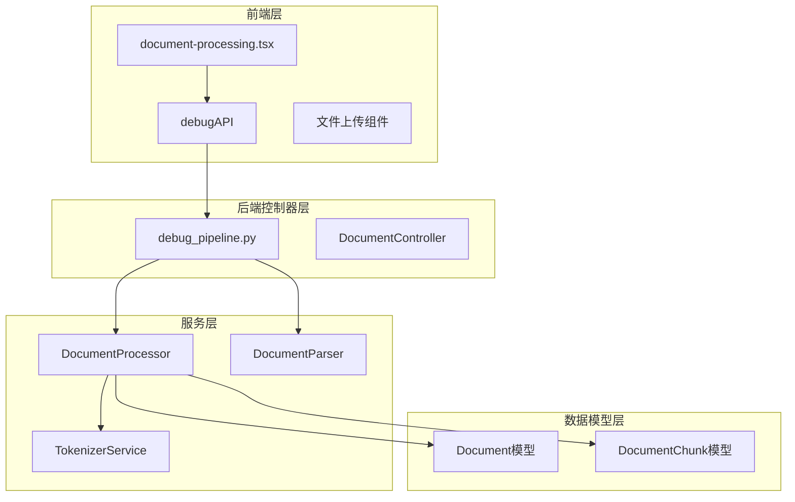
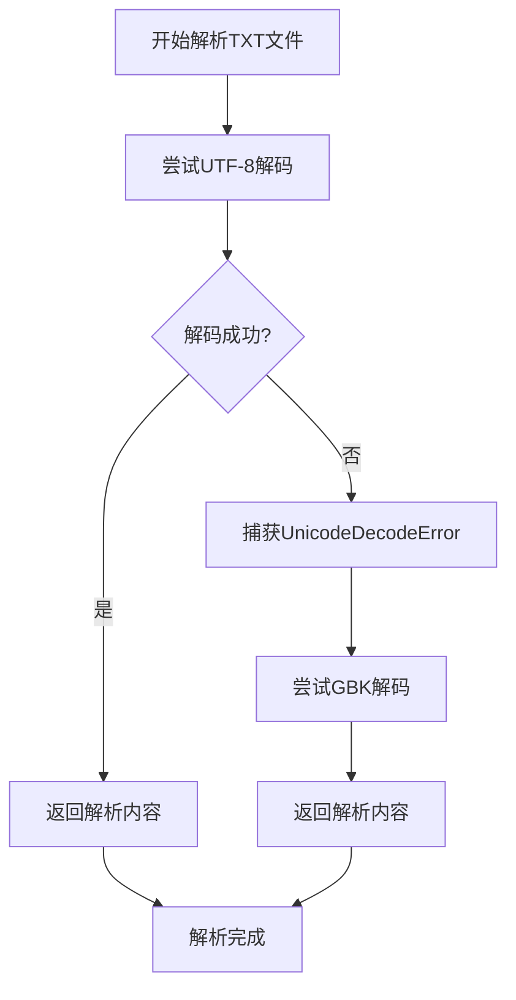
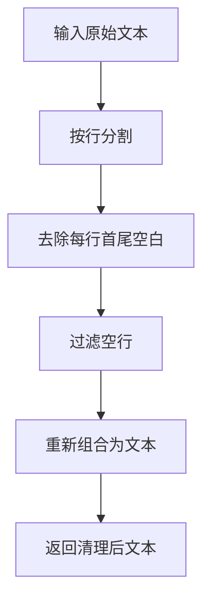
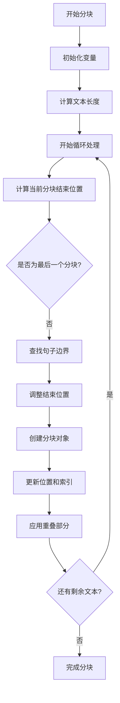
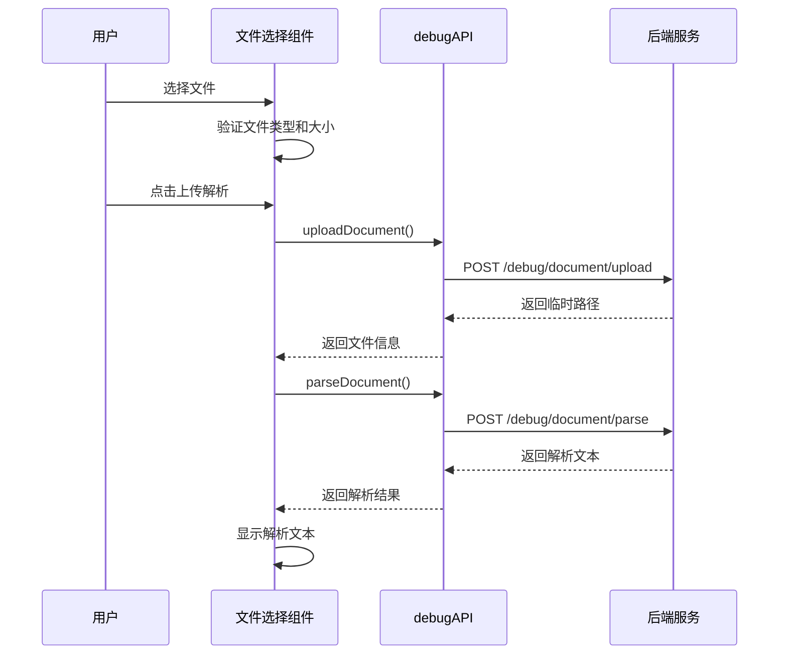
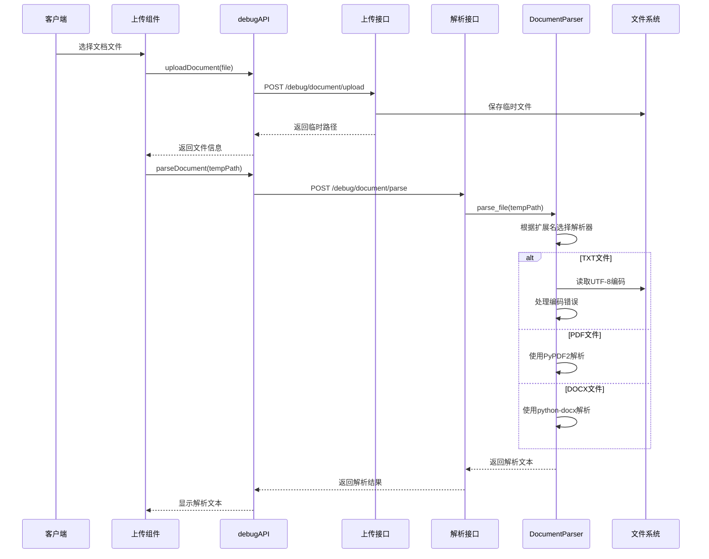
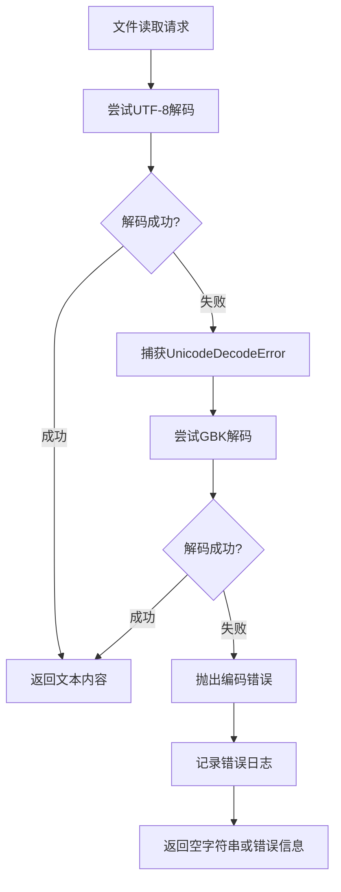
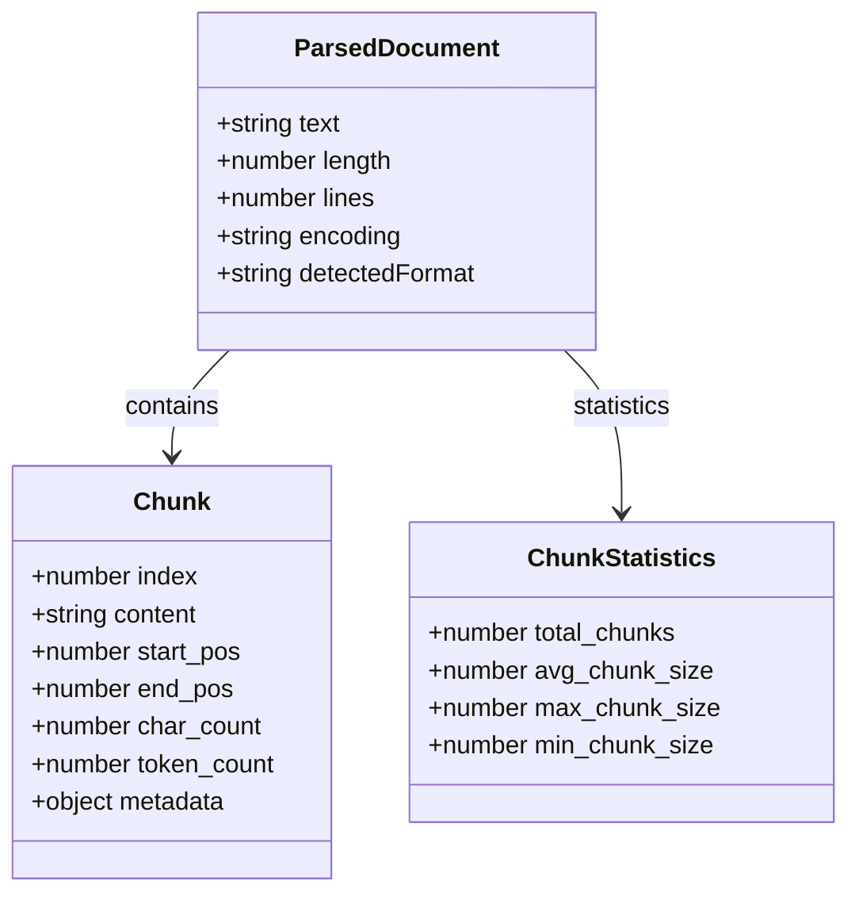

# 文档解析模块详细说明

<cite>
**本文档引用的文件**
- [document_processor.py](file://backend/app/services/document_processor.py)
- [document-processing.tsx](file://web/components/views/document-processing.tsx)
- [debug_pipeline.py](file://backend/app/controllers/debug_pipeline.py)
- [document.py](file://backend/app/models/document.py)
- [document.py](file://backend/app/schemas/document.py)
- [api.ts](file://web/lib/api.ts)
</cite>

## 目录
1. [概述](#概述)
2. [核心组件架构](#核心组件架构)
3. [DocumentProcessor类详解](#documentprocessor类详解)
4. [前端文件上传组件](#前端文件上传组件)
5. [完整调用链路分析](#完整调用链路分析)
6. [异常处理机制](#异常处理机制)
7. [调试系统展示](#调试系统展示)
8. [性能优化考虑](#性能优化考虑)
9. [故障排除指南](#故障排除指南)

## 概述

文档解析模块是RAG（检索增强生成）系统的核心组件之一，负责处理各种格式的文档文件，将其转换为可供后续处理的文本内容。该模块采用前后端分离的设计，前端提供用户友好的文件上传界面，后端实现强大的文档解析和处理能力。

### 主要功能特性

- **多格式支持**：支持TXT、PDF、DOCX、MD等多种文档格式
- **智能编码检测**：自动识别UTF-8和GBK编码格式
- **文本清理优化**：去除多余空行和标准化空白字符
- **灵活分块策略**：提供固定大小、段落、句子三种分块方法
- **异常恢复机制**：完善的错误处理和恢复策略

## 核心组件架构



**图表来源**
- [document-processing.tsx](file://web/components/views/document-processing.tsx#L1-L422)
- [debug_pipeline.py](file://backend/app/controllers/debug_pipeline.py#L1-L1786)
- [document_processor.py](file://backend/app/services/document_processor.py#L1-L328)

## DocumentProcessor类详解

### parse_txt方法的编码识别机制

DocumentProcessor类中的`parse_txt`方法实现了智能的编码识别和处理逻辑：



**图表来源**
- [document_processor.py](file://backend/app/services/document_processor.py#L40-L49)

#### 编码识别的具体实现

1. **UTF-8优先尝试**：首先使用UTF-8编码尝试解码文件内容
2. **异常捕获**：当UTF-8解码失败时捕获`UnicodeDecodeError`
3. **GBK回退**：自动切换到GBK编码进行解码
4. **透明处理**：对调用方完全透明，无需手动指定编码

**章节来源**
- [document_processor.py](file://backend/app/services/document_processor.py#L40-L49)

### 文本清理流程

`parse_text`方法实现了高效的文本清理和标准化：



**图表来源**
- [document_processor.py](file://backend/app/services/document_processor.py#L52-L57)

#### 清理规则详解

1. **行分割处理**：使用`\n`作为分隔符将文本分割成行
2. **空白字符去除**：对每行执行`strip()`操作去除首尾空白
3. **空行过滤**：移除所有仅包含空白字符的行
4. **重新组合**：使用`\n`重新连接非空行

**章节来源**
- [document_processor.py](file://backend/app/services/document_processor.py#L52-L57)

### 分块策略实现

DocumentProcessor提供了三种不同的分块策略：

#### 固定大小分块（chunk_by_fixed_size）



**图表来源**
- [document_processor.py](file://backend/app/services/document_processor.py#L60-L119)

#### 段落分块（chunk_by_paragraph）

基于双换行符进行分块，保持语义完整性。

#### 句子分块（chunk_by_sentence）

使用正则表达式识别句子边界，支持中英文混合文本。

**章节来源**
- [document_processor.py](file://backend/app/services/document_processor.py#L123-L232)

## 前端文件上传组件

### 组件架构设计

前端文档处理组件采用React Hooks模式，提供了完整的文件处理工作流：



**图表来源**
- [document-processing.tsx](file://web/components/views/document-processing.tsx#L39-L71)
- [api.ts](file://web/lib/api.ts#L844-L862)

### 文件上传处理流程

1. **文件验证**：检查文件类型（txt、md、pdf、docx）
2. **临时存储**：将文件上传到后端并获取临时路径
3. **异步处理**：后端解析完成后返回结果
4. **状态管理**：使用React状态管理解析进度和结果

**章节来源**
- [document-processing.tsx](file://web/components/views/document-processing.tsx#L39-L71)

### 分块配置界面

组件提供了灵活的分块配置选项：

| 配置项 | 类型 | 默认值 | 说明 |
|--------|------|--------|------|
| method | string | "fixed_size" | 分块方法：fixed_size, paragraph, sentence |
| chunk_size | number | 500 | 分块大小（字符数） |
| chunk_overlap | number | 50 | 重叠大小（字符数） |
| max_sentences | number | 5 | 句子分块时每块的最大句子数 |

**章节来源**
- [document-processing.tsx](file://web/components/views/document-processing.tsx#L16-L20)

## 完整调用链路分析

### 从用户上传到后端解析的完整流程



**图表来源**
- [document-processing.tsx](file://web/components/views/document-processing.tsx#L50-L62)
- [debug_pipeline.py](file://backend/app/controllers/debug_pipeline.py#L90-L171)
- [document_processor.py](file://backend/app/services/document_processor.py#L252-L327)

### 后端路由映射关系

| 前端API调用 | 后端路由 | 功能描述 |
|-------------|----------|----------|
| uploadDocument | /debug/document/upload | 上传文件并保存临时副本 |
| parseDocument | /debug/document/parse | 解析上传的文档文件 |
| chunkDocument | /debug/document/chunk | 对解析后的文本进行分块处理 |

**章节来源**
- [api.ts](file://web/lib/api.ts#L844-L862)
- [debug_pipeline.py](file://backend/app/controllers/debug_pipeline.py#L90-L171)

## 异常处理机制

### 编码错误处理策略



**图表来源**
- [document_processor.py](file://backend/app/services/document_processor.py#L40-L49)

### 文件读取失败恢复策略

1. **文件存在性检查**：验证文件是否存在于指定路径
2. **文件大小验证**：确保文件内容不为空
3. **权限检查**：确认有读取文件的权限
4. **临时文件清理**：自动清理上传过程中产生的临时文件

**章节来源**
- [debug_pipeline.py](file://backend/app/controllers/debug_pipeline.py#L90-L141)

### 前端异常处理

前端组件实现了多层次的异常处理：

```typescript
// 异常处理示例
try {
    const uploadResult = await debugAPI.uploadDocument(uploadedFile);
    const parseResult = await debugAPI.parseDocument(tempPath);
    showToast("文件上传和解析成功！", "success");
} catch (error) {
    console.error("上传解析失败:", error);
    showToast("上传解析失败: " + (error as Error).message, "error");
} finally {
    setLoading(false);
}
```

**章节来源**
- [document-processing.tsx](file://web/components/views/document-processing.tsx#L50-L68)

## 调试系统展示

### 解析结果数据结构

解析后的文档数据以标准化的结构展示：



**图表来源**
- [debug_pipeline.py](file://backend/app/controllers/debug_pipeline.py#L144-L171)
- [document_processor.py](file://backend/app/services/document_processor.py#L14-L34)

### 分块统计信息

系统提供详细的分块统计信息：

| 统计指标 | 说明 | 计算方式 |
|----------|------|----------|
| total_chunks | 总分块数量 | 分块列表长度 |
| avg_chunk_size | 平均分块大小 | 总字符数 ÷ 分块数量 |
| max_chunk_size | 最大分块大小 | 分块字符数的最大值 |
| min_chunk_size | 最小分块大小 | 分块字符数的最小值 |

**章节来源**
- [debug_pipeline.py](file://backend/app/controllers/debug_pipeline.py#L195-L200)

### 可视化展示效果

前端组件提供了直观的可视化展示：

1. **解析文本预览**：显示完整的解析文本内容
2. **分块列表**：展示前10个分块的内容预览
3. **统计信息**：实时显示分块统计指标
4. **交互式操作**：支持保存、加载、导出等功能

**章节来源**
- [document-processing.tsx](file://web/components/views/document-processing.tsx#L385-L416)

## 性能优化考虑

### 文件处理性能优化

1. **流式处理**：对于大文件采用流式读取避免内存溢出
2. **缓存机制**：对频繁访问的解析结果进行缓存
3. **并发处理**：支持多个文件的并发上传和解析
4. **资源清理**：及时清理临时文件和内存资源

### 前端性能优化

1. **虚拟滚动**：对大量分块采用虚拟滚动技术
2. **懒加载**：分块内容按需加载
3. **防抖处理**：文件上传操作防抖处理
4. **状态管理**：合理使用React状态提升性能

## 故障排除指南

### 常见问题及解决方案

#### 编码识别失败

**问题现象**：文件解析后出现乱码或解码错误

**解决方案**：
1. 检查文件实际编码格式
2. 手动指定编码参数
3. 使用文本编辑器转换编码格式

#### 文件上传失败

**问题现象**：文件上传过程中断或失败

**解决方案**：
1. 检查文件大小是否超过限制
2. 验证文件格式是否受支持
3. 确认网络连接稳定性

#### 分块结果异常

**问题现象**：分块结果不符合预期

**解决方案**：
1. 调整分块参数配置
2. 检查文本内容格式
3. 选择合适的分块方法

### 调试技巧

1. **启用详细日志**：在开发环境中启用DEBUG级别日志
2. **监控网络请求**：使用浏览器开发者工具监控API调用
3. **检查中间件状态**：验证中间件和异常处理器正常工作
4. **测试边界条件**：测试极端情况下的系统表现

**章节来源**
- [debug_pipeline.py](file://backend/app/controllers/debug_pipeline.py#L144-L171)