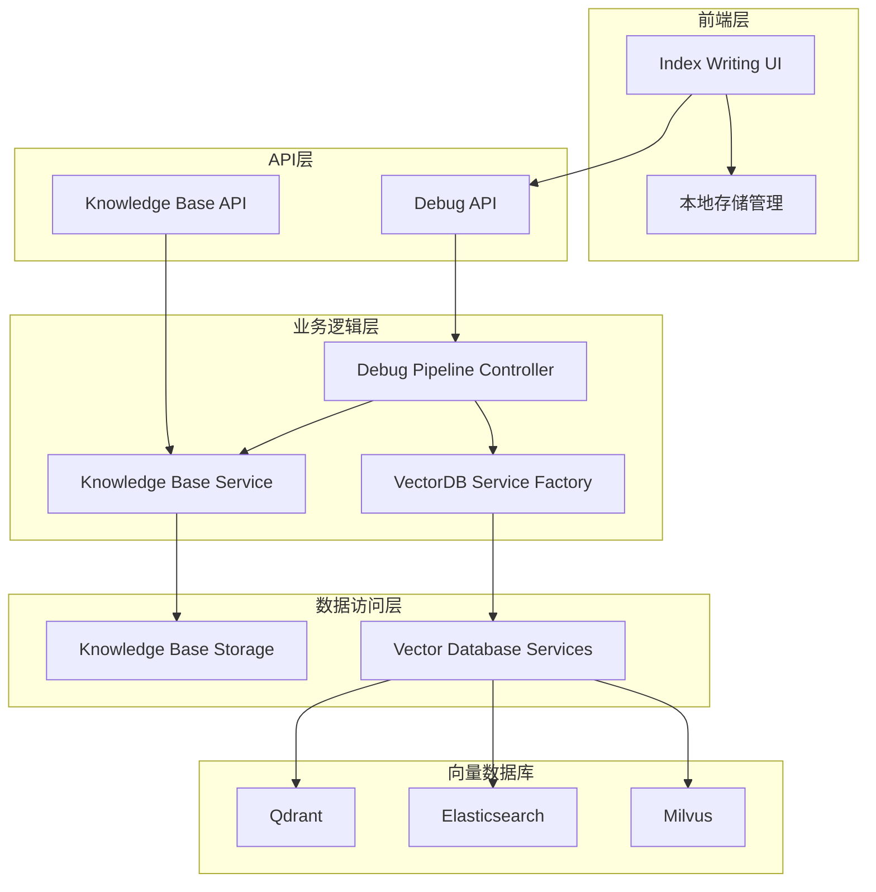
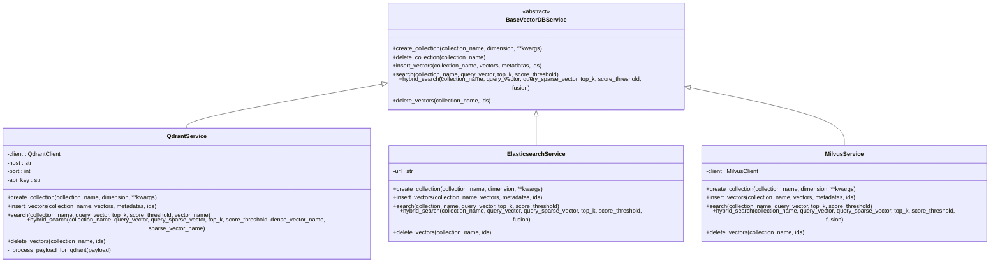
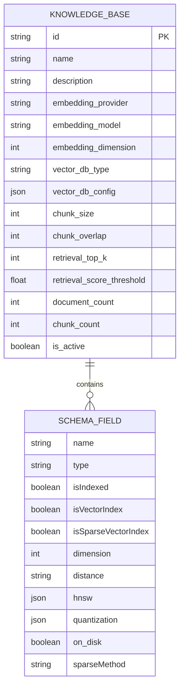
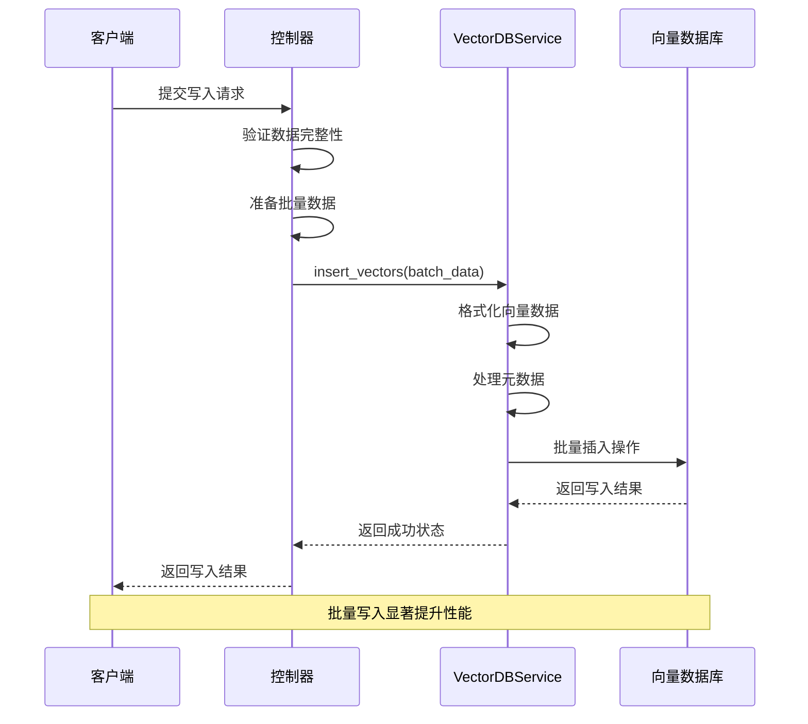
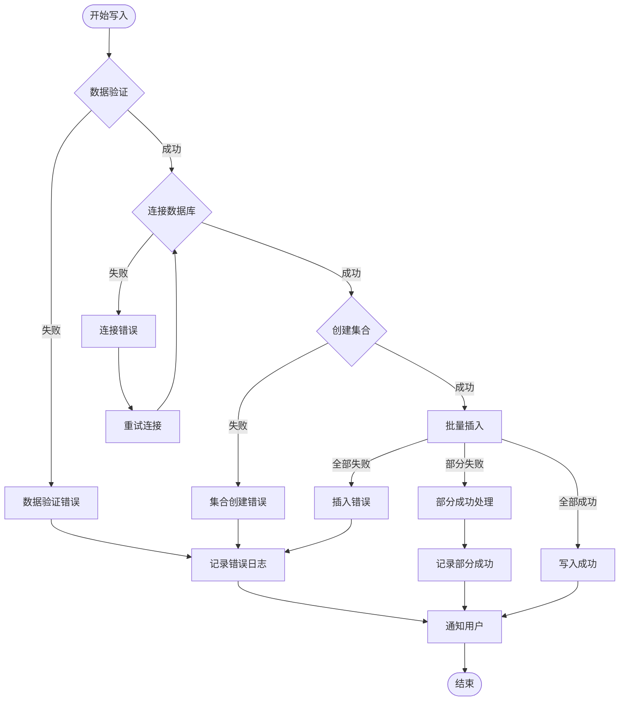
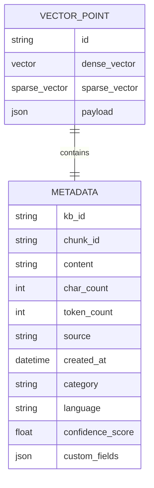
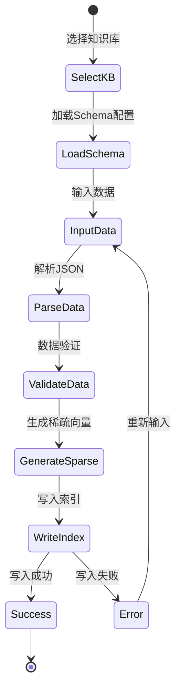
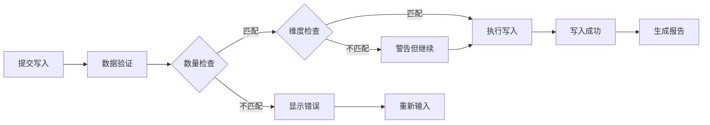
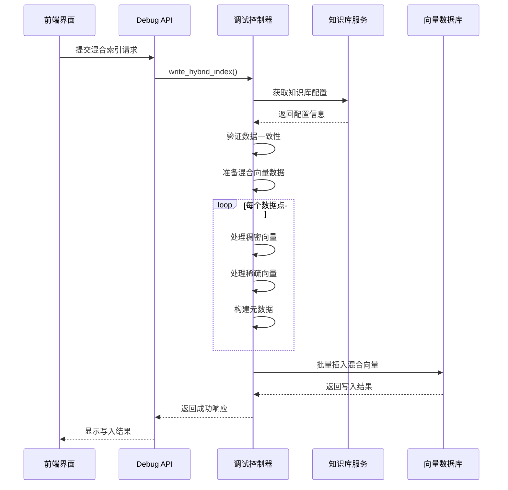

# 索引写入机制详细说明

<cite>
**本文档引用的文件**
- [vector_db_service.py](file://backend/app/services/vector_db_service.py)
- [index-writing.tsx](file://web/components/views/index-writing.tsx)
- [knowledge_base_storage.py](file://backend/app/services/knowledge_base_storage.py)
- [debug_pipeline.py](file://backend/app/controllers/debug_pipeline.py)
- [knowledge_base.py](file://backend/app/models/knowledge_base.py)
- [api.ts](file://web/lib/api.ts)
- [storage.ts](file://web/lib/storage.ts)
</cite>

## 目录
1. [概述](#概述)
2. [系统架构](#系统架构)
3. [VectorDBService核心机制](#vectordbservice核心机制)
4. [知识库存储抽象层](#知识库存储抽象层)
5. [批量写入优化策略](#批量写入优化策略)
6. [错误恢复机制](#错误恢复机制)
7. [元数据存储结构设计](#元数据存储结构设计)
8. [前端用户界面设计](#前端用户界面设计)
9. [混合索引写入流程](#混合索引写入流程)
10. [性能优化建议](#性能优化建议)

## 概述

索引写入机制是RAG Studio系统的核心功能之一，负责将向量数据（包括稠密向量和稀疏向量）以及元数据写入到不同的向量数据库中。该机制支持多种向量数据库（Qdrant、Elasticsearch、Milvus），提供统一的接口封装，并实现了批量写入优化和完善的错误恢复机制。

## 系统架构



**图表来源**
- [index-writing.tsx](file://web/components/views/index-writing.tsx#L1-L563)
- [debug_pipeline.py](file://backend/app/controllers/debug_pipeline.py#L792-L1017)
- [vector_db_service.py](file://backend/app/services/vector_db_service.py#L1089-L1111)

## VectorDBService核心机制

### 抽象基类设计

VectorDBService采用抽象工厂模式，定义了统一的向量数据库操作接口：



**图表来源**
- [vector_db_service.py](file://backend/app/services/vector_db_service.py#L31-L114)
- [vector_db_service.py](file://backend/app/services/vector_db_service.py#L203-L233)
- [vector_db_service.py](file://backend/app/services/vector_db_service.py#L116-L154)

### Qdrant服务实现详解

QdrantService是目前最完善的向量数据库实现，支持复杂的向量配置和混合检索：

#### 集合创建机制

QdrantService能够根据知识库schema动态创建集合，支持以下特性：
- **命名向量支持**：支持多个向量字段（如dense、sparse_vector等）
- **稀疏向量配置**：原生支持稀疏向量索引
- **量化配置**：支持标量量化、产品量化和二进制量化
- **HNSW参数调优**：可配置M、EF构造等参数
- **磁盘存储**：支持向量数据持久化到磁盘

#### 向量格式处理

```mermaid
flowchart TD
Start([开始写入]) --> CheckFormat{检查向量格式}
CheckFormat --> |命名向量| NamedFormat[使用命名向量格式<br/>{"dense": vector}]
CheckFormat --> |稀疏向量| SparseFormat[使用稀疏向量格式<br/>{"sparse_vector": {"indices": [], "values": []}}]
CheckFormat --> |混合格式| HybridFormat[使用混合格式<br/>{"dense": vector, "sparse_vector": {...}}]
NamedFormat --> ProcessPayload[处理元数据]
SparseFormat --> ProcessPayload
HybridFormat --> ProcessPayload
ProcessPayload --> ValidateDimension{验证维度}
ValidateDimension --> |匹配| InsertVectors[批量插入向量]
ValidateDimension --> |不匹配| AdjustDimension[调整维度配置]
AdjustDimension --> InsertVectors
InsertVectors --> Success([写入成功])
```

**图表来源**
- [vector_db_service.py](file://backend/app/services/vector_db_service.py#L484-L570)
- [vector_db_service.py](file://backend/app/services/vector_db_service.py#L538-L563)

**章节来源**
- [vector_db_service.py](file://backend/app/services/vector_db_service.py#L203-L800)

## 知识库存储抽象层

### Schema配置管理

知识库存储抽象层负责管理知识库的配置信息，包括向量数据库类型、字段定义和索引配置：



**图表来源**
- [knowledge_base.py](file://backend/app/models/knowledge_base.py#L25-L80)
- [knowledge_base_storage.py](file://backend/app/services/knowledge_base_storage.py#L104-L122)

### 存储机制设计

知识库存储采用debug_results机制，提供以下功能：
- **配置持久化**：将知识库配置保存到文件系统
- **索引管理**：维护知识库配置的索引文件
- **版本控制**：支持配置的更新和历史追踪
- **快速检索**：基于时间戳的配置快速查找

**章节来源**
- [knowledge_base_storage.py](file://backend/app/services/knowledge_base_storage.py#L17-L359)

## 批量写入优化策略

### 批量插入机制

系统实现了高效的批量写入策略，减少网络往返次数和数据库连接开销：



**图表来源**
- [debug_pipeline.py](file://backend/app/controllers/debug_pipeline.py#L849-L1017)
- [vector_db_service.py](file://backend/app/services/vector_db_service.py#L484-L570)

### 性能优化措施

1. **向量格式优化**
   - 自动检测和转换向量格式
   - 支持命名向量和稀疏向量的高效处理
   - 最小化数据序列化开销

2. **元数据处理优化**
   - 批量处理元数据字段
   - 自动填充默认字段值
   - 类型验证和转换

3. **连接池管理**
   - 复用数据库连接
   - 异步操作支持
   - 超时和重试机制

**章节来源**
- [vector_db_service.py](file://backend/app/services/vector_db_service.py#L510-L570)

## 错误恢复机制

### 多层次错误处理

系统实现了多层次的错误恢复机制，确保数据写入的可靠性：



**图表来源**
- [debug_pipeline.py](file://backend/app/controllers/debug_pipeline.py#L792-L1017)

### 错误分类和处理策略

| 错误类型 | 处理策略 | 恢复机制 |
|---------|---------|---------|
| 数据验证错误 | 立即终止，返回用户友好错误信息 | 用户修正后重新提交 |
| 连接超时 | 自动重试（最多3次） | 指数退避算法 |
| 集合已存在 | 忽略错误，继续操作 | 继续后续写入 |
| 写入冲突 | 记录冲突，跳过失败项 | 部分成功处理 |
| 网络中断 | 断线重连机制 | 自动恢复连接 |
| 存储空间不足 | 清理旧数据，重新尝试 | 主动清理策略 |

**章节来源**
- [debug_pipeline.py](file://backend/app/controllers/debug_pipeline.py#L849-L1017)

## 元数据存储结构设计

### 元数据字段规范

元数据存储结构设计遵循向量数据库的最佳实践，支持高效的过滤和检索：



**图表来源**
- [debug_pipeline.py](file://backend/app/controllers/debug_pipeline.py#L473-L524)

### 元数据过滤机制

元数据支持多维度的过滤和检索：

1. **基础字段过滤**
   - 文本内容匹配
   - 字符数范围过滤
   - 创建时间范围
   - 来源标识过滤

2. **结构化数据过滤**
   - 分类标签匹配
   - 语言识别
   - 置信度评分
   - 自定义字段

3. **复合条件过滤**
   - 时间范围组合
   - 多标签交集
   - 数值区间组合

**章节来源**
- [debug_pipeline.py](file://backend/app/controllers/debug_pipeline.py#L473-L524)

## 前端用户界面设计

### Index Writing组件架构

前端Index Writing组件提供了完整的索引写入工作流，包括数据准备、验证和结果反馈：



**图表来源**
- [index-writing.tsx](file://web/components/views/index-writing.tsx#L1-L563)

### 用户交互设计

#### 数据输入界面

前端提供了灵活的数据输入方式：
- **JSON文本框**：直接粘贴JSON数据
- **文件导入**：支持JSON文件上传
- **已保存结果加载**：从本地存储恢复之前的操作结果
- **实时验证**：输入时即时验证JSON格式

#### 写入进度反馈

系统提供详细的进度反馈机制：
- **实时状态指示**：显示当前操作阶段
- **进度条展示**：对于大数据量操作显示进度
- **错误提示**：清晰的错误信息和解决建议
- **成功确认**：写入完成后的详细统计信息

#### 结果验证机制



**图表来源**
- [index-writing.tsx](file://web/components/views/index-writing.tsx#L234-L343)

**章节来源**
- [index-writing.tsx](file://web/components/views/index-writing.tsx#L1-L563)
- [storage.ts](file://web/lib/storage.ts#L1-L119)

## 混合索引写入流程

### 稠密向量和稀疏向量的协同写入

系统支持同时写入稠密向量和稀疏向量，实现混合索引的高效存储：



**图表来源**
- [debug_pipeline.py](file://backend/app/controllers/debug_pipeline.py#L792-L1017)
- [index-writing.tsx](file://web/components/views/index-writing.tsx#L234-L343)

### 稀疏向量自动生成

当用户未提供稀疏向量时，系统会根据知识库schema自动生成功能：
- **方法选择**：支持BM25、TF-IDF、Simple、SPLADE等多种方法
- **批量生成**：异步处理大量文本的稀疏向量生成
- **错误容错**：单个生成失败不影响整体流程
- **质量控制**：提供稀疏性指标监控

**章节来源**
- [debug_pipeline.py](file://backend/app/controllers/debug_pipeline.py#L792-L1017)
- [index-writing.tsx](file://web/components/views/index-writing.tsx#L268-L301)

## 性能优化建议

### 写入性能调优

1. **批量大小优化**
   - 根据内存和网络条件调整批量大小
   - 推荐批量大小：100-1000个向量
   - 大数据集建议分批处理

2. **并发控制**
   - 限制并发写入任务数量
   - 使用队列机制平滑处理负载
   - 监控系统资源使用情况

3. **索引优化**
   - 在写入前预先创建集合
   - 合理配置向量数据库参数
   - 使用适当的索引策略

### 存储优化策略

1. **数据压缩**
   - 启用向量量化（量化率可根据精度要求调整）
   - 使用稀疏向量减少存储空间
   - 定期清理过期数据

2. **缓存机制**
   - 缓存频繁访问的知识库配置
   - 缓存向量数据库连接
   - 实现智能预加载策略

3. **监控和告警**
   - 监控写入延迟和成功率
   - 设置存储空间告警
   - 跟踪性能指标变化

通过以上优化策略，系统能够在保证数据完整性的前提下，实现高效的大规模向量数据写入操作。