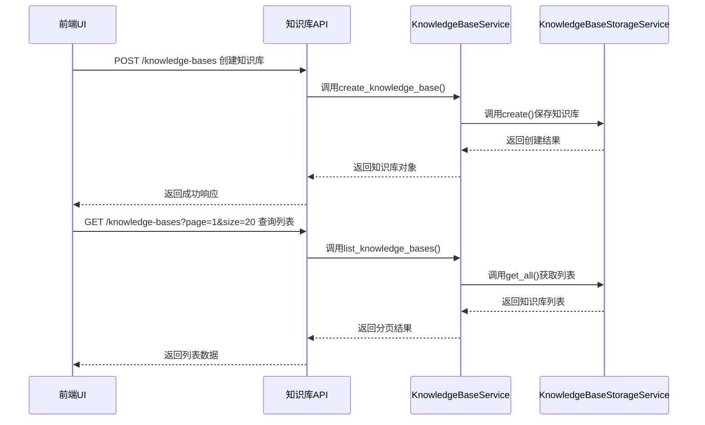
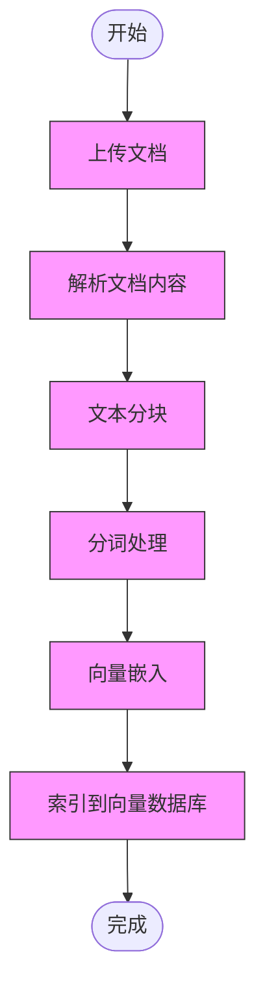
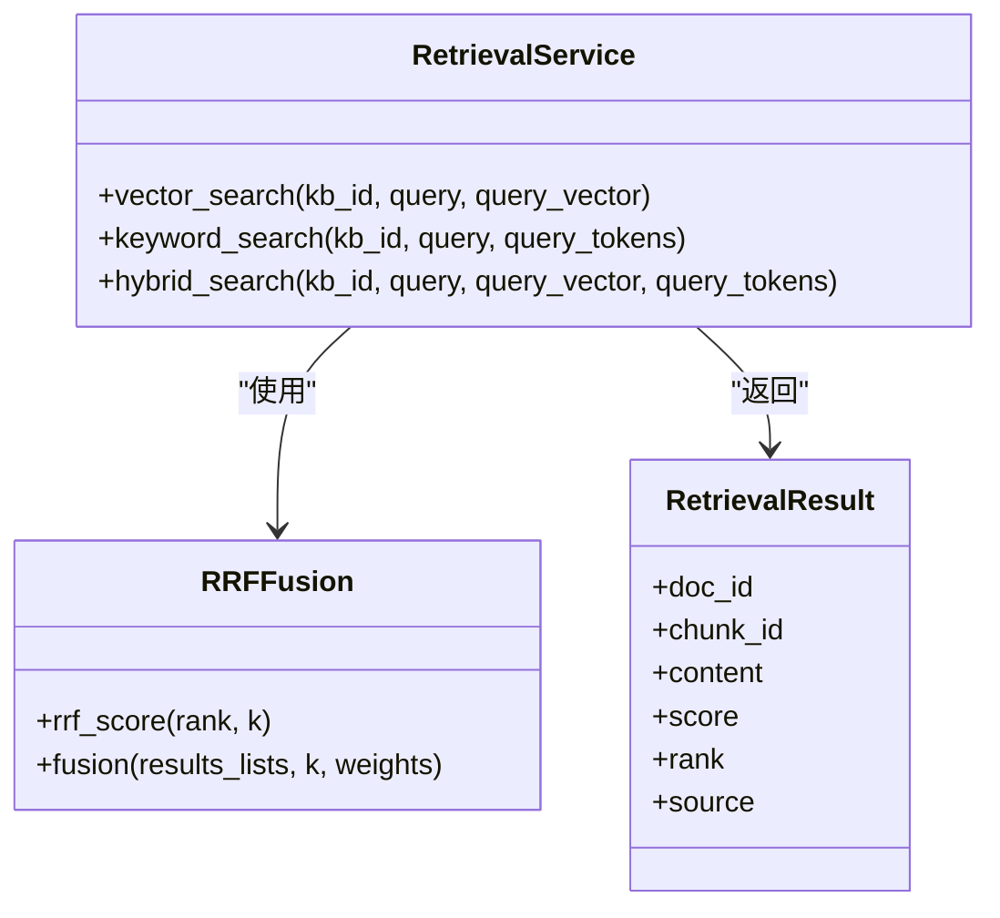
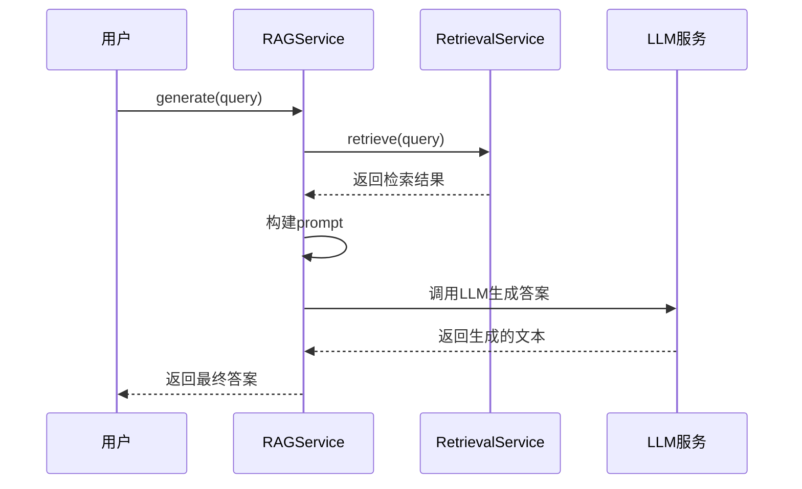
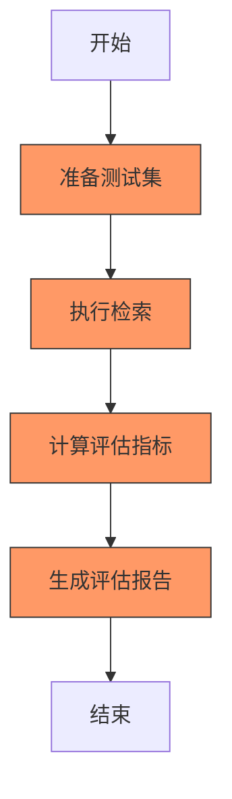
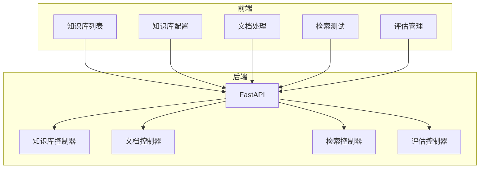

# 核心功能模块

<cite>
**本文档引用的文件**
- [main.py](file://backend/app/main.py)
- [knowledge_base.py](file://backend/app/controllers/knowledge_base.py)
- [document.py](file://backend/app/controllers/document.py)
- [tokenizer_service.py](file://backend/app/services/tokenizer_service.py)
- [embedding_service.py](file://backend/app/services/embedding_service.py)
- [vector_db_service.py](file://backend/app/services/vector_db_service.py)
- [retrieval_service.py](file://backend/app/services/retrieval_service.py)
- [rag_service.py](file://backend/app/services/rag_service.py)
- [sparse_vector_service.py](file://backend/app/services/sparse_vector_service.py)
- [knowledge_base.py](file://backend/app/models/knowledge_base.py)
- [page.tsx](file://web/app/page.tsx)
- [api.ts](file://web/lib/api.ts)
</cite>

## 目录
1. [知识库管理模块](#知识库管理模块)
2. [文档处理模块](#文档处理模块)
3. [检索服务模块](#检索服务模块)
4. [RAG生成模块](#rag生成模块)
5. [检索器评估模块](#检索器评估模块)
6. [前后端集成与UI体现](#前后端集成与ui体现)
7. [使用示例与最佳实践](#使用示例与最佳实践)

## 知识库管理模块

知识库管理模块是整个系统的配置中心，负责知识库的创建、配置、查询和删除等全生命周期管理。该模块通过RESTful API提供服务，前端通过调用这些API实现对知识库的可视化操作。

核心功能包括：
- **创建知识库**：通过POST请求创建新的知识库，需要提供名称、描述、嵌入模型、向量数据库类型、分块大小、检索返回数量等配置信息。
- **查询知识库**：支持分页查询知识库列表，可筛选激活状态。通过GET请求获取知识库详情、配置信息和统计信息。
- **更新知识库**：通过PUT请求更新知识库的配置，如分块大小、重叠长度、检索参数等。
- **删除知识库**：通过DELETE请求删除知识库，同时会删除其下的所有文档和索引。

知识库的配置信息非常丰富，包括嵌入模型提供商（Ollama或自研）、向量数据库类型（Elasticsearch、Qdrant、Milvus）、分块配置（大小、重叠）和检索配置（top_k、分数阈值）等。这些配置决定了后续文档处理和检索的行为。



**Diagram sources**
- [knowledge_base.py](file://backend/app/controllers/knowledge_base.py#L22-L145)
- [api.ts](file://web/lib/api.ts#L112-L141)

**Section sources**
- [knowledge_base.py](file://backend/app/controllers/knowledge_base.py#L1-L283)
- [api.ts](file://web/lib/api.ts#L108-L221)

## 文档处理模块

文档处理模块负责将原始文档转换为可用于检索的向量表示。该过程包括文档上传、文本分块、分词和向量嵌入四个主要步骤。

**文档上传**：支持多种格式的文档上传，包括txt、pdf、docx、md、html、json等。上传后，系统会将文档存储在指定位置，并记录文档元数据。

**文本分块**：根据知识库配置的分块大小和重叠长度，将文档内容分割成较小的文本块。这有助于提高检索的精度和效率。分块策略通常采用滑动窗口方式，确保上下文的连续性。

**分词处理**：使用`tokenizer_service.py`提供的分词服务对文本进行分词。该服务基于jieba分词库，支持精确模式、搜索引擎模式和全模式。分词时会过滤停用词，并支持自定义停用词和用户词典。

**向量嵌入**：使用`embedding_service.py`提供的嵌入服务将文本块转换为向量。系统支持多种嵌入模型提供商，目前主要支持Ollama。嵌入服务通过HTTP API调用Ollama服务，获取文本的向量表示。为了提高性能，批量嵌入时会使用信号量限制并发数，避免过载。



**Diagram sources**
- [document.py](file://backend/app/controllers/document.py#L20-L120)
- [tokenizer_service.py](file://backend/app/services/tokenizer_service.py#L54-L94)
- [embedding_service.py](file://backend/app/services/embedding_service.py#L137-L183)

**Section sources**
- [document.py](file://backend/app/controllers/document.py#L1-L171)
- [tokenizer_service.py](file://backend/app/services/tokenizer_service.py#L1-L277)
- [embedding_service.py](file://backend/app/services/embedding_service.py#L1-L257)

## 检索服务模块

检索服务模块实现了混合检索机制，结合了向量检索、关键词检索和RRF融合算法，以提高检索的准确性和召回率。

**向量检索**：基于向量相似度进行检索。首先将查询文本通过嵌入模型转换为向量，然后在向量数据库中查找最相似的向量。支持多种向量数据库，包括Qdrant、Elasticsearch和Milvus。Qdrant还支持原生的稠密向量+稀疏向量混合检索。

**关键词检索**：基于BM25算法进行关键词匹配。首先对查询文本进行分词，然后计算每个文档分块与查询的BM25分数。BM25是一种经典的检索算法，考虑了词频、文档频率和文档长度等因素。

**RRF融合**：Reciprocal Rank Fusion（倒数排名融合）算法用于融合向量检索和关键词检索的结果。RRF不依赖于原始分数，而是基于排名位置计算分数，公式为1/(k + rank)，其中k是常数，rank是排名位置。通过加权融合，可以得到更全面的检索结果。



**Diagram sources**
- [retrieval_service.py](file://backend/app/services/retrieval_service.py#L136-L537)
- [vector_db_service.py](file://backend/app/services/vector_db_service.py#L31-L114)

**Section sources**
- [retrieval_service.py](file://backend/app/services/retrieval_service.py#L1-L854)
- [vector_db_service.py](file://backend/app/services/vector_db_service.py#L1-L1112)

## RAG生成模块

RAG生成模块负责整合检索和生成两个阶段，实现基于检索的问答。该模块通过`rag_service.py`实现，主要包含检索和生成两个核心功能。

**检索**：根据用户查询，从知识库中检索相关的文档分块。检索过程会使用知识库配置的参数，如top_k和分数阈值。检索结果将作为生成阶段的上下文。

**生成**：使用大语言模型（LLM）生成答案。系统会构建一个包含查询和检索到的上下文的prompt，然后调用LLM服务生成答案。目前系统支持Ollama作为LLM服务提供商。

RAG服务的设计遵循了模块化原则，可以灵活地替换不同的检索和生成组件。例如，可以使用不同的嵌入模型或LLM模型，而无需修改核心逻辑。



**Diagram sources**
- [rag_service.py](file://backend/app/services/rag_service.py#L13-L165)

**Section sources**
- [rag_service.py](file://backend/app/services/rag_service.py#L1-L165)

## 检索器评估模块

检索器评估模块使用Ragas框架对检索效果进行量化评估，计算Precision、Recall、F1、MRR、MAP、NDCG等指标。该模块通过`retriever_evaluation.py`控制器和`ragas_evaluation.py`服务实现。

评估流程如下：
1. **准备测试集**：创建包含查询和相关文档标注的测试集。
2. **执行评估**：对每个查询执行检索，获取检索结果。
3. **计算指标**：使用Ragas框架计算各种评估指标。
4. **生成报告**：汇总评估结果，生成评估报告。

支持的评估指标包括：
- **Precision**：检索结果中相关文档的比例。
- **Recall**：所有相关文档中被检索到的比例。
- **F1**：Precision和Recall的调和平均数。
- **MRR**：Mean Reciprocal Rank，衡量第一个相关文档的排名。
- **MAP**：Mean Average Precision，衡量检索结果的整体质量。
- **NDCG**：Normalized Discounted Cumulative Gain，考虑文档排名位置的评估指标。



**Diagram sources**
- [retriever_evaluation.py](file://backend/app/controllers/retriever_evaluation.py)
- [ragas_evaluation.py](file://backend/app/services/ragas_evaluation.py)

**Section sources**
- [retriever_evaluation.py](file://backend/app/controllers/retriever_evaluation.py)
- [ragas_evaluation.py](file://backend/app/services/ragas_evaluation.py)

## 前后端集成与UI体现

系统采用前后端分离架构，前端使用Next.js构建，后端使用FastAPI提供API服务。前后端通过RESTful API进行通信。

前端主要组件包括：
- **知识库列表**：展示所有知识库，支持创建、编辑和删除操作。
- **知识库配置**：显示和编辑知识库的详细配置。
- **文档处理**：上传文档并查看处理状态。
- **检索测试**：输入查询文本，查看检索结果。
- **评估管理**：管理测试集和评估任务，查看评估结果。

API调用流程示例（创建知识库）：
1. 用户在前端填写知识库配置表单。
2. 前端调用`knowledgeBaseAPI.create()`方法。
3. 该方法发送POST请求到`/knowledge-bases`。
4. 后端`knowledge_base.py`中的`create_knowledge_base`函数处理请求。
5. 调用`KnowledgeBaseService`创建知识库。
6. 返回创建结果，前端更新UI。



**Diagram sources**
- [page.tsx](file://web/app/page.tsx#L1-L109)
- [api.ts](file://web/lib/api.ts#L108-L221)

**Section sources**
- [page.tsx](file://web/app/page.tsx#L1-L109)
- [api.ts](file://web/lib/api.ts#L1-L1107)

## 使用示例与最佳实践

### 使用示例

**创建知识库**
```python
# 前端调用
await knowledgeBaseAPI.create({
    name: "技术文档库",
    embedding_model: "nomic-embed-text",
    vector_db_type: "qdrant",
    chunk_size: 512,
    retrieval_top_k: 5
})
```

**上传并处理文档**
```python
# 上传文档
const file = document.getElementById('file').files[0];
await documentAPI.upload("kb_001", file);

# 处理文档
await documentAPI.process("doc_001");
```

**执行检索**
```python
# 执行混合检索
const results = await retrievalAPI.hybridSearch("kb_001", "如何配置网络？");
```

### 最佳实践

1. **知识库配置**：
   - 选择合适的分块大小（通常512-1024），避免过小或过大。
   - 设置适当的重叠长度（通常50-100），保持上下文连续性。
   - 根据数据特点选择合适的嵌入模型。

2. **文档处理**：
   - 确保文档格式正确，避免解析错误。
   - 监控文档处理状态，及时发现和处理失败任务。

3. **检索优化**：
   - 使用混合检索（向量+关键词）提高检索质量。
   - 调整RRF融合权重，平衡不同检索方式的影响。
   - 设置合理的分数阈值，过滤低质量结果。

4. **系统性能**：
   - 批量处理文档时，控制并发数，避免系统过载。
   - 定期清理不再使用的知识库和文档，释放存储空间。

5. **评估与迭代**：
   - 建立高质量的测试集，用于评估和优化检索效果。
   - 定期执行评估，监控系统性能变化。
   - 根据评估结果调整配置参数，持续优化系统。

**Section sources**
- [knowledge_base.py](file://backend/app/controllers/knowledge_base.py#L22-L145)
- [document.py](file://backend/app/controllers/document.py#L20-L120)
- [retrieval_service.py](file://backend/app/services/retrieval_service.py#L458-L537)
- [api.ts](file://web/lib/api.ts#L112-L320)