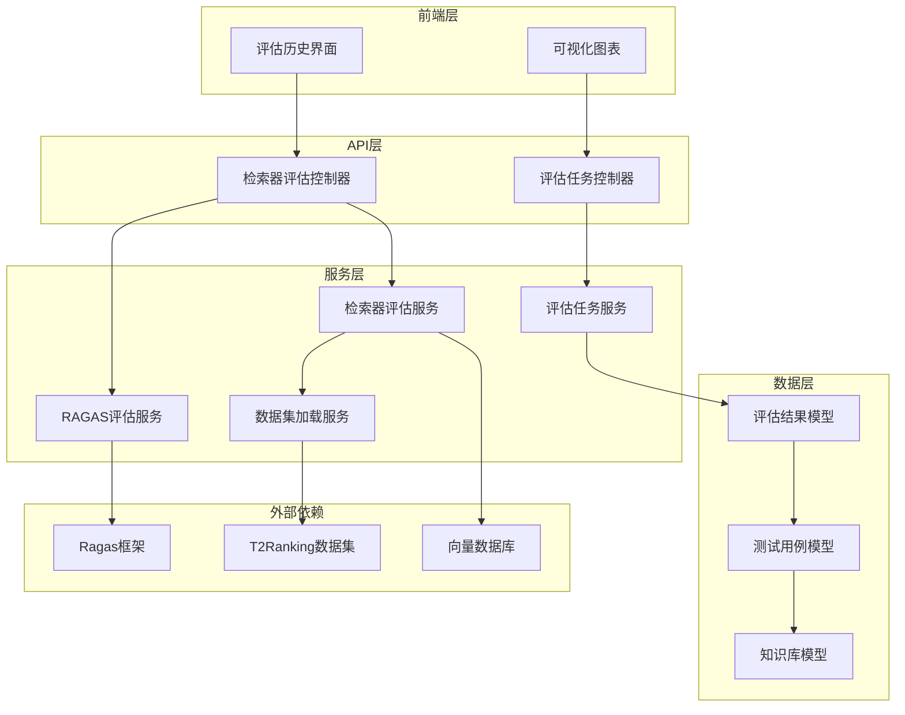
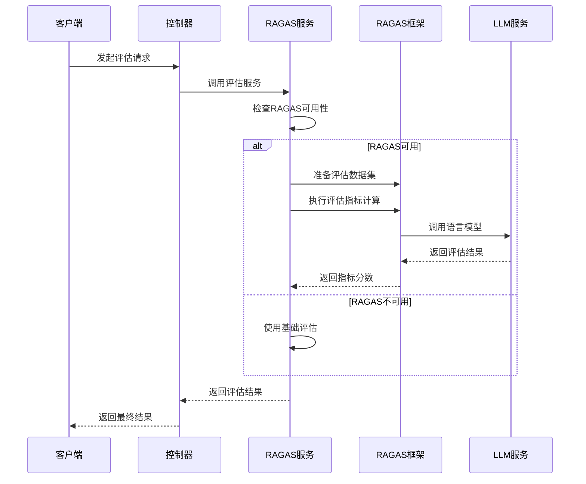
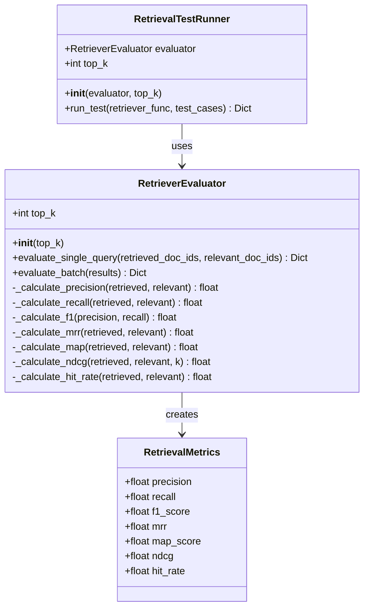
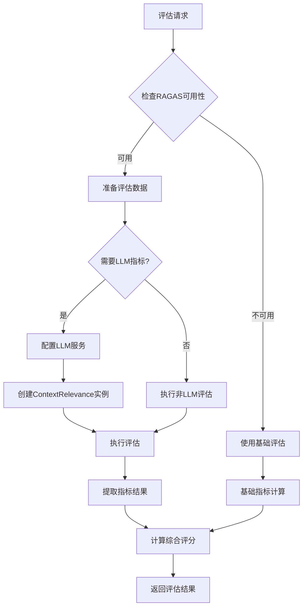
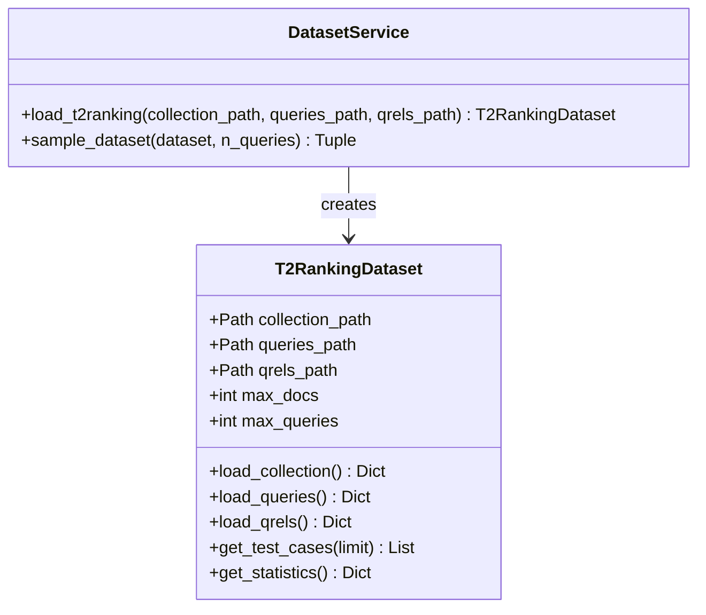
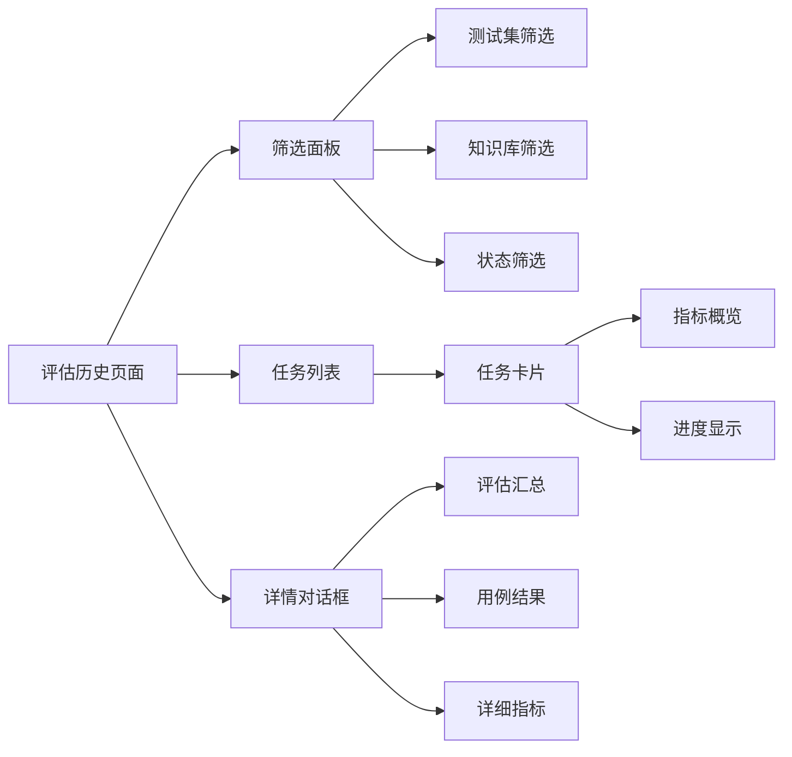
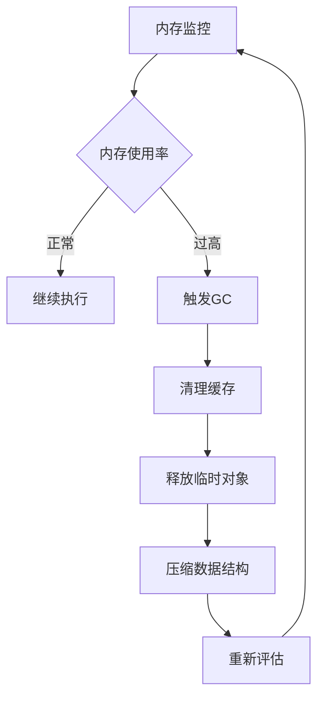

# 检索器评估系统架构与实现

<cite>
**本文档引用的文件**
- [retriever_evaluation.py](file://backend/app/controllers/retriever_evaluation.py)
- [ragas_evaluation.py](file://backend/app/services/ragas_evaluation.py)
- [retriever_evaluation.py](file://backend/app/services/retriever_evaluation.py)
- [retriever_evaluation.py](file://backend/app/models/retriever_evaluation.py)
- [evaluation-history.tsx](file://web/components/views/evaluation-history.tsx)
- [test.py](file://backend/app/schemas/test.py)
- [dataset_loader.py](file://backend/app/services/dataset_loader.py)
- [evaluation.py](file://backend/app/models/evaluation.py)
- [example_t2ranking_usage.py](file://backend/example_t2ranking_usage.py)
- [requirements.txt](file://backend/requirements.txt)
</cite>

## 目录
1. [系统概述](#系统概述)
2. [核心架构](#核心架构)
3. [Ragas框架集成](#ragas框架集成)
4. [评估服务详解](#评估服务详解)
5. [数据集处理](#数据集处理)
6. [前端可视化](#前端可视化)
7. [性能优化](#性能优化)
8. [使用指南](#使用指南)
9. [故障排除](#故障排除)

## 系统概述

检索器评估系统是一个基于Ragas框架构建的综合性评估平台，专门用于评估检索器性能和生成器质量。系统支持多种评估指标，包括传统的检索指标（Precision、Recall、F1-Score等）和现代的RAGAS指标（Context Precision、Context Recall、Faithfulness等）。

### 核心特性

- **多指标评估**：支持传统检索指标和RAGAS指标的双重评估
- **标准化数据集**：内置T2Ranking数据集支持
- **批量评估**：支持大规模测试用例的批量处理
- **可视化报告**：提供直观的评估结果展示
- **灵活配置**：支持多种评估配置和参数调优

## 核心架构

系统采用分层架构设计，主要包含以下核心组件：



**架构图来源**
- [retriever_evaluation.py](file://backend/app/controllers/retriever_evaluation.py#L1-L375)
- [ragas_evaluation.py](file://backend/app/services/ragas_evaluation.py#L1-L598)
- [evaluation-history.tsx](file://web/components/views/evaluation-history.tsx#L1-L464)

### 主要组件说明

1. **控制器层**：负责HTTP请求处理和路由分发
2. **服务层**：实现核心业务逻辑和算法
3. **模型层**：定义数据结构和验证规则
4. **外部集成**：与Ragas框架和数据集的交互

**章节来源**
- [retriever_evaluation.py](file://backend/app/controllers/retriever_evaluation.py#L1-L50)
- [ragas_evaluation.py](file://backend/app/services/ragas_evaluation.py#L190-L200)

## Ragas框架集成

Ragas框架是系统的核心评估引擎，提供了专业的RAG评估指标。系统实现了对Ragas框架的深度集成，支持多种评估模式。

### 核心指标体系

系统支持以下核心评估指标：

| 指标类别 | 具体指标 | 描述 | 计算方式 |
|---------|---------|------|----------|
| **检索质量** | Context Precision | 检索上下文的精确度 | 检索到的相关上下文比例 |
| | Context Recall | 检索上下文的召回率 | 检索到的相关上下文占总相关上下文的比例 |
| | Context Relevancy | 检索上下文的相关性 | 上下文与查询的相关程度 |
| **生成质量** | Faithfulness | 答案对上下文的忠实度 | 生成答案与检索上下文的一致性 |
| | Answer Relevancy | 答案与问题的相关性 | 生成答案与原始查询的相关程度 |
| **综合评分** | RAGAS Score | 综合评估分数 | 所有指标的加权平均值 |

### RAGAS评估流程



**序列图来源**
- [ragas_evaluation.py](file://backend/app/services/ragas_evaluation.py#L202-L380)
- [ragas_evaluation.py](file://backend/app/services/ragas_evaluation.py#L388-L537)

### LLM配置与兼容性

系统提供了灵活的LLM配置机制，支持多种语言模型：

- **Ollama集成**：默认使用本地Ollama部署的模型
- **模型切换**：支持动态切换不同的LLM模型
- **兼容性处理**：自动处理Python版本和依赖兼容性问题

**章节来源**
- [ragas_evaluation.py](file://backend/app/services/ragas_evaluation.py#L60-L120)
- [ragas_evaluation.py](file://backend/app/services/ragas_evaluation.py#L240-L270)

## 评估服务详解

### RetrieverEvaluator - 基础评估器

RetrieverEvaluator是系统的基础评估组件，实现了传统的检索器评估算法：



**类图来源**
- [retriever_evaluation.py](file://backend/app/services/retriever_evaluation.py#L26-L423)

#### 核心算法实现

系统实现了多种经典的检索评估指标算法：

1. **Precision@K**：精确率计算，衡量检索结果中有多少是相关文档
2. **Recall@K**：召回率计算，衡量相关文档中有多少被检索到
3. **F1-Score**：精确率和召回率的调和平均数
4. **MRR**：平均倒数排名，考虑检索结果的排序质量
5. **MAP**：平均精度均值，综合考虑多个相关文档的排序
6. **NDCG**：归一化折损累积增益，标准化的排序质量指标
7. **Hit Rate**：命中率，简单的二分类指标

### RAGASEvaluationService - 高级评估服务

RAGASEvaluationService是系统的核心评估服务，提供了完整的RAGAS集成：



**流程图来源**
- [ragas_evaluation.py](file://backend/app/services/ragas_evaluation.py#L202-L380)

**章节来源**
- [ragas_evaluation.py](file://backend/app/services/ragas_evaluation.py#L190-L598)

## 数据集处理

### T2Ranking数据集支持

系统提供了完整的T2Ranking数据集支持，这是业界广泛使用的检索器评估基准：



**类图来源**
- [dataset_loader.py](file://backend/app/services/dataset_loader.py#L14-L261)

#### 数据集处理流程

1. **文档加载**：从TSV文件加载文档集合
2. **查询处理**：解析查询文本和ID
3. **相关性标注**：处理查询-文档相关性关系
4. **测试用例生成**：组合查询和相关文档形成测试用例
5. **统计分析**：计算数据集的基本统计信息

### 数据集优化策略

为了提高评估效率，系统提供了多种数据集优化策略：

- **采样机制**：通过`max_queries`和`max_docs`参数控制数据规模
- **智能采样**：自动识别相关文档，减少不必要文档的加载
- **内存优化**：支持流式处理大型数据集

**章节来源**
- [dataset_loader.py](file://backend/app/services/dataset_loader.py#L14-L261)

## 前端可视化

### 评估历史界面

前端提供了直观的评估结果可视化界面：



**架构图来源**
- [evaluation-history.tsx](file://web/components/views/evaluation-history.tsx#L23-L464)

#### 可视化特性

1. **实时指标展示**：显示RAGAS综合评分和各项指标
2. **趋势分析**：支持多任务对比和性能趋势分析
3. **详细报告**：提供单个测试用例的详细评估结果
4. **交互式图表**：支持钻取和筛选操作

### 报告格式

系统支持多种评估报告格式：

- **综合评分**：RAGAS综合评分的百分比表示
- **指标矩阵**：各项指标的网格展示
- **分布统计**：指标的最大值、最小值和标准差
- **错误分析**：失败用例的详细错误信息

**章节来源**
- [evaluation-history.tsx](file://web/components/views/evaluation-history.tsx#L260-L464)

## 性能优化

### 评估性能优化策略

系统采用了多层次的性能优化策略：

#### 1. 异步处理
- 使用`asyncio`实现非阻塞的评估处理
- 支持并发执行多个评估任务
- 避免嵌套事件循环问题

#### 2. 缓存机制
- 智能缓存RAGAS评估结果
- 避免重复计算相同输入的指标
- 内存友好的缓存策略

#### 3. 线程池优化
- 使用`asyncio.to_thread`避免阻塞主线程
- 合理配置线程池大小
- 防止资源竞争和死锁

### 内存管理



**流程图来源**
- [ragas_evaluation.py](file://backend/app/services/ragas_evaluation.py#L300-L320)

### 批量处理优化

系统支持高效的批量处理：

- **分批处理**：将大量测试用例分批处理
- **进度跟踪**：实时显示处理进度
- **错误恢复**：单个用例失败不影响整体流程

**章节来源**
- [ragas_evaluation.py](file://backend/app/services/ragas_evaluation.py#L300-L380)

## 使用指南

### 基础使用流程

1. **数据集准备**
   ```python
   # 加载T2Ranking数据集
   dataset = DatasetService.load_t2ranking(
       collection_path="collection.tsv",
       queries_path="queries.dev.tsv", 
       qrels_path="qrels.dev.tsv",
       max_queries=100
   )
   ```

2. **评估器初始化**
   ```python
   # 创建评估器
   evaluator = RetrieverEvaluator(top_k=10)
   ```

3. **执行评估**
   ```python
   # 批量评估
   results = evaluator.evaluate_batch(test_cases)
   ```

### 高级配置

#### RAGAS配置
```python
# 配置自定义LLM
service = RAGASEvaluationService()
await service.evaluate_retrieval(
    queries, 
    retrieved_contexts, 
    ground_truth_contexts,
    llm_model="llama2",
    llm_base_url="http://localhost:11434"
)
```

#### 性能调优
```python
# 优化参数设置
evaluator = RetrieverEvaluator(top_k=20)  # 增加top_k提升召回率
```

**章节来源**
- [example_t2ranking_usage.py](file://backend/example_t2ranking_usage.py#L17-L171)

### 最佳实践

1. **数据集采样**：从100个查询开始，逐步增加规模
2. **指标选择**：根据具体需求选择合适的评估指标
3. **资源配置**：合理配置内存和CPU资源
4. **监控告警**：建立评估过程的监控机制

## 故障排除

### 常见问题及解决方案

#### 1. RAGAS依赖问题

**问题**：RAGAS模块导入失败
**原因**：Python版本或依赖包不兼容
**解决方案**：
- 升级pydantic到v2版本
- 降级Python到3.11
- 安装rapidfuzz库

#### 2. LLM连接问题

**问题**：Ollama连接超时
**原因**：本地Ollama服务未启动
**解决方案**：
```bash
# 启动Ollama服务
ollama serve

# 检查服务状态
curl http://localhost:11434/api/tags
```

#### 3. 内存不足

**问题**：处理大型数据集时内存溢出
**解决方案**：
- 减少`max_queries`参数
- 使用采样机制
- 增加系统内存

#### 4. 性能问题

**问题**：评估速度过慢
**解决方案**：
- 启用异步处理
- 增加并发度
- 优化数据加载流程

### 调试工具

系统提供了丰富的调试功能：

- **日志记录**：详细的执行日志
- **性能监控**：各阶段的耗时统计
- **错误追踪**：完整的异常堆栈信息
- **指标验证**：关键指标的计算验证

**章节来源**
- [ragas_evaluation.py](file://backend/app/services/ragas_evaluation.py#L160-L180)

## 总结

检索器评估系统是一个功能完备、性能优异的评估平台，通过深度集成Ragas框架，提供了业界领先的RAG评估能力。系统具有以下优势：

1. **技术先进**：采用最新的RAG评估指标和算法
2. **性能优异**：支持大规模数据集和高并发处理
3. **易于使用**：提供简洁的API和直观的可视化界面
4. **扩展性强**：支持多种评估场景和自定义配置

通过合理的使用和优化，该系统能够显著提升检索器和生成器的质量评估效率，为RAG应用的持续改进提供有力支撑。