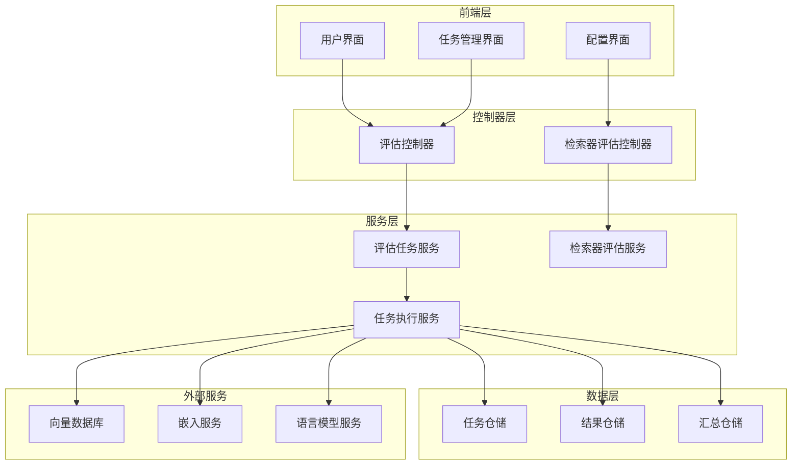
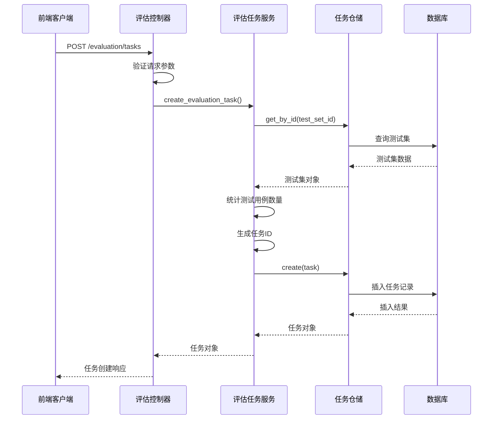
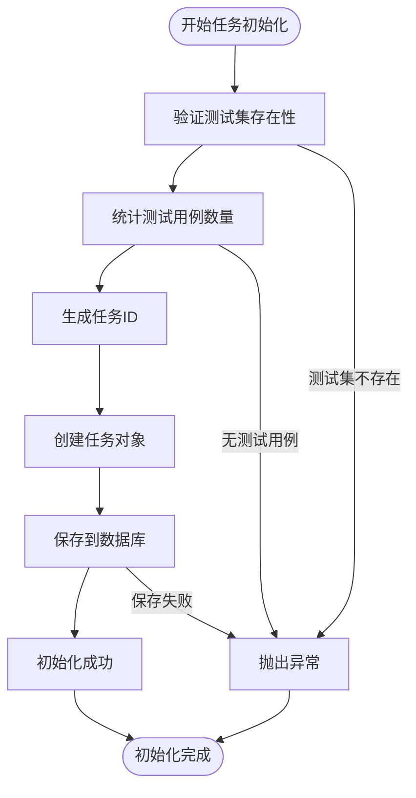
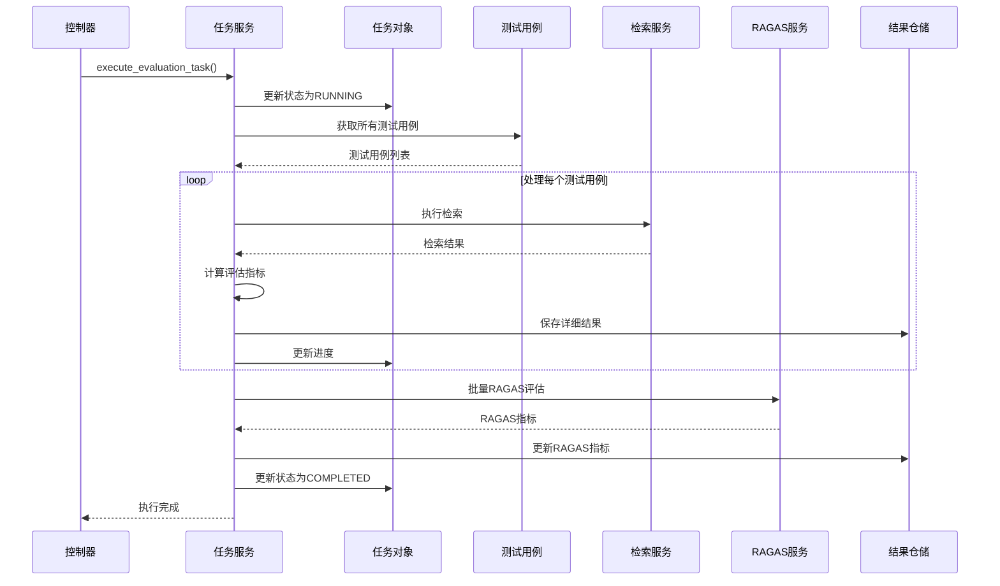
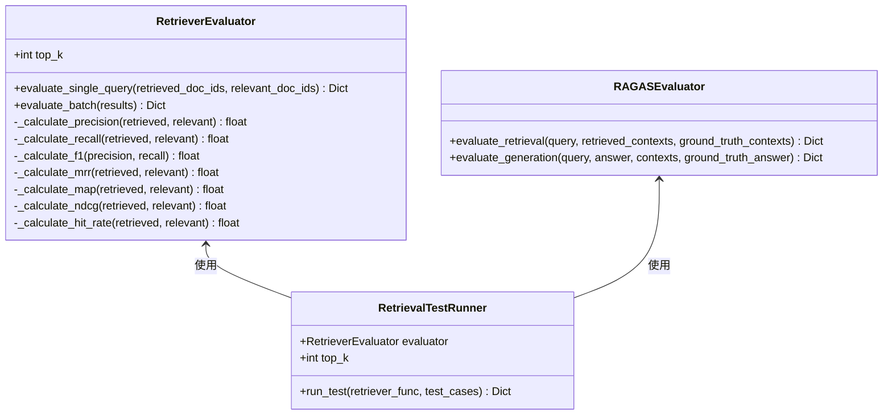
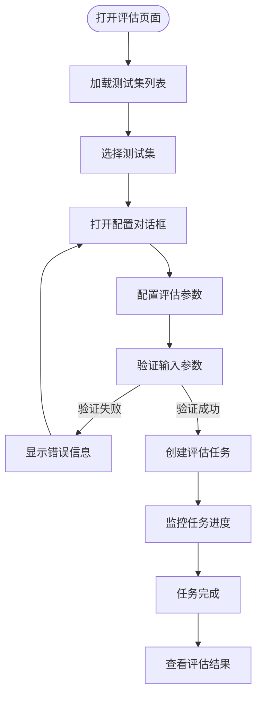
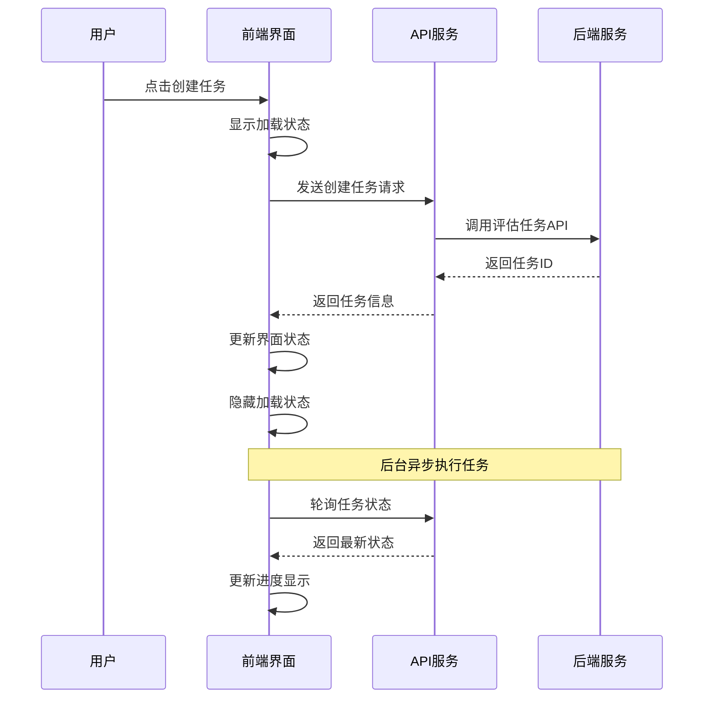
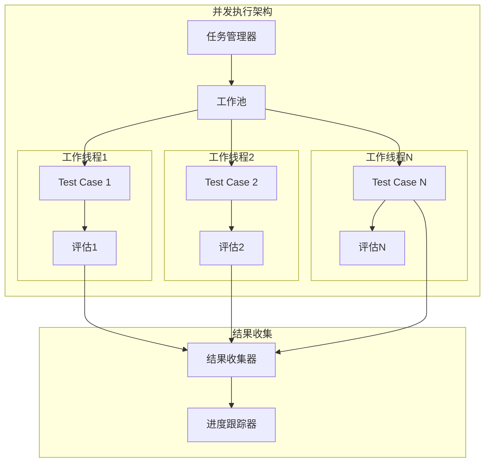
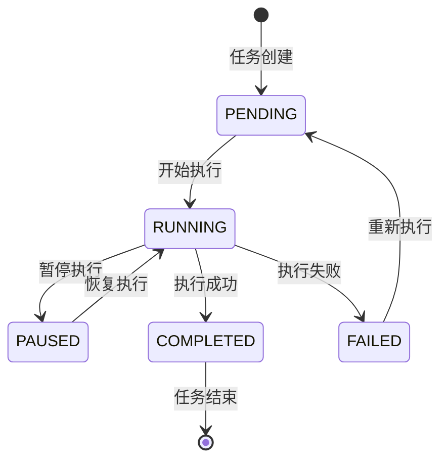

# 评估任务管理

<cite>
**本文档引用的文件**
- [retriever_evaluation.py](file://backend/app/controllers/retriever_evaluation.py)
- [retriever_evaluation.py](file://backend/app/services/retriever_evaluation.py)
- [retriever-evaluation.tsx](file://web/components/views/retriever-evaluation.tsx)
- [evaluation_task.py](file://backend/app/services/evaluation_task.py)
- [evaluation.py](file://backend/app/controllers/evaluation.py)
- [test.py](file://backend/app/schemas/test.py)
- [retriever_evaluation.py](file://backend/app/models/retriever_evaluation.py)
- [retriever_evaluation_repository.py](file://backend/app/repositories/retriever_evaluation_repository.py)
- [api.ts](file://web/lib/api.ts)
</cite>

## 目录
1. [概述](#概述)
2. [系统架构](#系统架构)
3. [评估任务生命周期](#评估任务生命周期)
4. [任务创建与初始化](#任务创建与初始化)
5. [任务执行与监控](#任务执行与监控)
6. [前端交互设计](#前端交互设计)
7. [并发控制与错误处理](#并发控制与错误处理)
8. [最佳实践](#最佳实践)
9. [总结](#总结)

## 概述

评估任务管理系统是一个完整的检索器评估解决方案，支持基于T2Ranking等标准数据集的检索器性能评估。系统采用分层架构设计，包含控制器层、服务层、数据访问层和前端界面，提供完整的任务创建、执行、监控和结果分析功能。

### 核心功能特性

- **多维度评估指标**：支持Precision@K、Recall@K、F1-Score、MRR、MAP、NDCG、Hit Rate等7个核心指标
- **灵活的配置选项**：支持top_k、score_threshold、融合方法、嵌入模型等多种参数配置
- **实时任务监控**：提供任务状态跟踪、进度显示和异常处理
- **批量评估支持**：能够同时处理大量测试用例的评估
- **RAGAS集成**：内置RAGAS框架支持，提供更专业的评估指标

## 系统架构



**架构图来源**
- [evaluation.py](file://backend/app/controllers/evaluation.py#L1-L335)
- [retriever_evaluation.py](file://backend/app/controllers/retriever_evaluation.py#L1-L375)
- [evaluation_task.py](file://backend/app/services/evaluation_task.py#L26-L607)

## 评估任务生命周期

评估任务从创建到完成经历完整的生命周期，包括任务初始化、配置绑定、执行监控和结果汇总等阶段。

```mermaid
stateDiagram-v2
[*] --> Pending : 创建任务
Pending --> Running : 开始执行
Running --> Completed : 执行成功
Running --> Failed : 执行失败
Completed --> [*] : 任务结束
Failed --> [*] : 错误处理
note right of Pending : 任务已创建但未开始<br/>状态 : PENDING
note right of Running : 任务正在执行中<br/>状态 : RUNNING
note right of Completed : 任务执行完成<br/>状态 : COMPLETED
note right of Failed : 任务执行失败<br/>状态 : FAILED
```

**状态图来源**
- [evaluation_task.py](file://backend/app/services/evaluation_task.py#L91-L177)

### 生命周期阶段详解

1. **任务创建阶段**
   - 验证测试集和知识库存在性
   - 统计测试用例数量
   - 生成唯一任务ID
   - 初始化任务状态为PENDING

2. **任务初始化阶段**
   - 设置任务配置参数
   - 预检查知识库连接
   - 准备评估环境
   - 更新任务状态为RUNNING

3. **任务执行阶段**
   - 并发处理测试用例
   - 实时更新任务进度
   - 记录执行过程中的异常
   - 执行RAGAS评估

4. **任务完成阶段**
   - 创建评估汇总报告
   - 保存详细结果
   - 更新最终任务状态
   - 触发后续通知

**节来源**
- [evaluation_task.py](file://backend/app/services/evaluation_task.py#L37-L177)

## 任务创建与初始化

### 控制器层任务创建

控制器层负责接收前端请求并调用服务层创建评估任务。系统支持两种类型的评估任务：检索器评估和生成器评估。



**序列图来源**
- [evaluation.py](file://backend/app/controllers/evaluation.py#L40-L81)
- [evaluation_task.py](file://backend/app/services/evaluation_task.py#L37-L89)

### 任务参数处理

系统支持丰富的任务配置参数，包括检索配置和生成配置两大类：

| 参数类别 | 参数名称 | 类型 | 默认值 | 说明 |
|---------|---------|------|--------|------|
| 检索配置 | top_k | int | 10 | 检索返回的top-k数量 |
| 检索配置 | score_threshold | float | 0.7 | 相似度分数阈值 |
| 检索配置 | fusion | string | "rrf" | 融合方法（rrf/dbsf） |
| 检索配置 | embedding_model | string | "bge-m3:latest" | 嵌入模型名称 |
| 检索配置 | vector_weight | float | 0.7 | 向量权重 |
| 检索配置 | keyword_weight | float | 0.3 | 关键词权重 |
| 生成配置 | llm_model | string | "deepseek-r1:1.5b" | LLM模型名称 |
| 生成配置 | temperature | float | 0.7 | 生成温度 |
| 生成配置 | max_tokens | int | 2048 | 最大令牌数 |

**节来源**
- [test.py](file://backend/app/schemas/test.py#L211-L232)
- [retriever-evaluation.tsx](file://web/components/views/retriever-evaluation.tsx#L39-L48)

### 任务初始化流程

任务初始化过程确保评估环境的正确配置和验证：



**流程图来源**
- [evaluation_task.py](file://backend/app/services/evaluation_task.py#L37-L89)

**节来源**
- [evaluation_task.py](file://backend/app/services/evaluation_task.py#L37-L89)

## 任务执行与监控

### 任务执行引擎

任务执行引擎负责协调整个评估过程，包括测试用例的并发处理、结果收集和状态更新。



**序列图来源**
- [evaluation_task.py](file://backend/app/services/evaluation_task.py#L91-L177)
- [evaluation_task.py](file://backend/app/services/evaluation_task.py#L179-L338)

### 实时进度监控

系统提供实时的任务进度监控功能，包括完成数量、失败数量和整体进度百分比：

| 监控指标 | 描述 | 更新频率 |
|---------|------|----------|
| 总用例数 | 测试集中的测试用例总数 | 任务创建时确定 |
| 已完成用例 | 已成功执行的测试用例数量 | 每个用例完成后更新 |
| 失败用例 | 执行过程中发生错误的测试用例数量 | 每个失败用例时更新 |
| 进度百分比 | 已完成用例占总用例的百分比 | 动态计算更新 |

**节来源**
- [retriever-evaluation.tsx](file://web/components/views/retriever-evaluation.tsx#L464-L494)

### 评估指标计算

系统实现了多种评估指标的计算逻辑，支持基础指标和RAGAS专业指标：



**类图来源**
- [retriever_evaluation.py](file://backend/app/services/retriever_evaluation.py#L26-L423)

**节来源**
- [retriever_evaluation.py](file://backend/app/services/retriever_evaluation.py#L26-L423)

## 前端交互设计

### 任务创建界面

前端界面提供了直观的任务创建和配置功能，支持测试集选择、参数配置和任务创建操作。



**流程图来源**
- [retriever-evaluation.tsx](file://web/components/views/retriever-evaluation.tsx#L105-L147)

### 参数配置界面

配置界面提供了丰富的参数设置选项，支持用户自定义评估配置：

| 配置项 | 输入类型 | 默认值 | 说明 |
|-------|---------|--------|------|
| Top K | 数字输入框 | 10 | 检索返回的top-k数量 |
| Score Threshold | 数字输入框 | 0.7 | 相似度分数阈值 |
| Fusion方法 | 下拉选择 | RRF | 向量和关键词融合方法 |
| Embedding模型 | 文本输入框 | bge-m3:latest | 使用的嵌入模型名称 |

**节来源**
- [retriever-evaluation.tsx](file://web/components/views/retriever-evaluation.tsx#L552-L606)

### 异步提交机制

前端实现了完善的异步提交机制，确保用户体验的流畅性：



**序列图来源**
- [retriever-evaluation.tsx](file://web/components/views/retriever-evaluation.tsx#L105-L147)
- [api.ts](file://web/lib/api.ts#L542-L587)

**节来源**
- [retriever-evaluation.tsx](file://web/components/views/retriever-evaluation.tsx#L105-L147)

## 并发控制与错误处理

### 并发执行策略

系统采用基于测试用例的并发执行策略，每个测试用例独立处理，避免相互影响：



**架构图来源**
- [evaluation_task.py](file://backend/app/services/evaluation_task.py#L179-L338)

### 错误恢复机制

系统实现了多层次的错误处理和恢复机制：

| 错误类型 | 处理策略 | 恢复方式 |
|---------|---------|----------|
| 网络连接错误 | 自动重试 | 指数退避重试 |
| 模型推理超时 | 跳过当前用例 | 记录失败并继续 |
| 数据库连接失败 | 任务失败 | 报告错误并终止 |
| 知识库不存在 | 验证失败 | 提示用户检查配置 |

### 任务状态管理

系统维护详细的任务状态信息，支持任务的暂停、恢复和重新执行：



**状态图来源**
- [evaluation_task.py](file://backend/app/services/evaluation_task.py#L91-L177)

**节来源**
- [evaluation_task.py](file://backend/app/services/evaluation_task.py#L91-L177)

## 最佳实践

### 任务配置最佳实践

1. **合理设置top_k值**
   - 初次测试：top_k=10
   - 中等规模：top_k=20-50
   - 大规模测试：top_k=100+

2. **优化评估参数**
   - 根据业务需求调整score_threshold
   - 选择合适的融合方法（RRF适用于大多数场景）
   - 验证不同嵌入模型的效果

3. **数据集规模选择**
   ```python
   # 初次验证 - 快速反馈
   max_queries = 50
   
   # 中等测试 - 平衡速度和准确性
   max_queries = 100-200
   
   # 生产评估 - 完整覆盖
   max_queries = 500+
   ```

### 性能优化建议

1. **并发控制**
   - 根据系统资源调整并发数量
   - 实施背压机制防止资源耗尽
   - 监控内存和CPU使用情况

2. **缓存策略**
   - 缓存频繁访问的测试用例
   - 缓存嵌入模型推理结果
   - 实施智能缓存失效策略

3. **网络优化**
   - 使用连接池减少连接开销
   - 实施请求限流防止服务过载
   - 启用压缩减少传输数据量

### 错误处理最佳实践

1. **优雅降级**
   - 单个用例失败不影响整体任务
   - 提供详细的错误日志便于排查
   - 实施断路器模式防止级联故障

2. **监控告警**
   - 监控任务执行时间和成功率
   - 设置关键指标阈值告警
   - 实施自动化故障恢复

3. **数据完整性**
   - 确保评估结果的原子性写入
   - 实施数据校验防止损坏
   - 提供数据备份和恢复机制

**节来源**
- [evaluation_task.py](file://backend/app/services/evaluation_task.py#L179-L338)

## 总结

评估任务管理系统是一个功能完整、架构清晰的检索器评估解决方案。系统通过分层架构设计实现了良好的可扩展性和可维护性，提供了从任务创建到结果分析的完整评估流程。

### 系统优势

1. **完整的评估指标体系**：支持7个核心检索指标和RAGAS专业指标
2. **灵活的配置选项**：满足不同场景的评估需求
3. **实时监控能力**：提供详细的进度跟踪和状态监控
4. **强大的错误处理**：确保系统的稳定性和可靠性
5. **优秀的用户体验**：直观的前端界面和流畅的操作体验

### 应用价值

该系统特别适用于：
- 检索器性能对比和优化
- 不同向量数据库的评估
- 嵌入模型效果测试
- 检索算法参数调优
- 生产环境的质量保证

通过合理的配置和使用，该系统能够为RAG应用的性能优化提供有力支撑，帮助开发者构建高质量的检索增强生成系统。